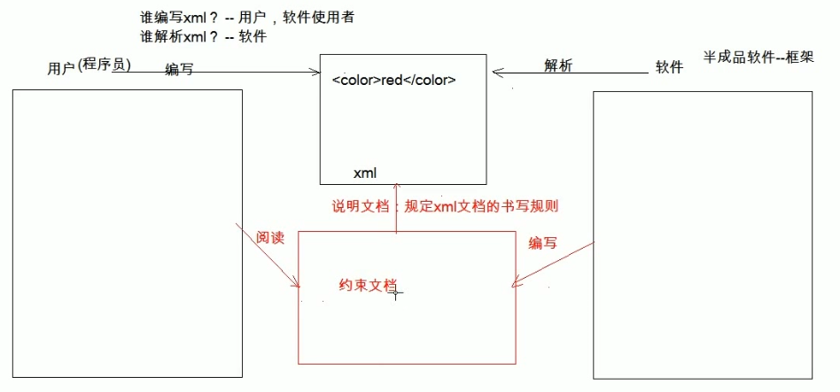

# 03.XML约束

- 笔记本：02.XML
- 创建时间：2020-01-27 09:04:28 UTC
- 更新时间：2020-01-27 10:30:57 UTC
- 印象笔记 GUID：374ce415-599f-40b6-83af-b7566b1f1aaf

**约束：** 规定 XML 文档的书写规则

1. 能够在 xml 中引入约束文档

1. 能够简单的读懂约束文档



**分类：**

1. DTD：一种简单的约束技术

1. Schema：一种复杂的约束技术

-
DTD：

  - 引入 dtd 文档到xml 文档中

    - 内部dtd：将约束规则定义在 xml 文档中

    - 外部dtd：将约束的规则定义在外部的 dtd 文档中

      - 本地：<!DOCTYPE 根标签名 SYSTEM "dtd文件的位置">

      - 网络：<!DOCTYPE 根标签名 PUBLIC "dtd文件名字" "dtd文件的位置URL">

-
Schema

  - 引入：

    1. 填写xml文档的根元素

    1. 引入 xsi 前缀，xmlns:xsi="http://www.w3.org/2001/XMLSchema-instance"

    1. 引入 xsd 文件命名空间 xsi:schemaLocation="http://www.liudezhi.cn/xml student.xsd"

    1. 为每一个 xsd 约束声明一个前缀，作为标识 xmlns="http://www.liudezhi.cn/xml"

**eg: 外部 dtd 文件**

```
<!ELEMENT students (student+) >
<!ELEMENT student (name, age, sex)>
<!ELEMENT name (#PCDATE)>
<!ELEMENT age(#PCDATE)>
<!ELEMENT sex(#PCDATE)>
<!ATTLIST student number ID #REQUIRED>

```

```
<?xml version="1.0" encoding="UTF-8" ?>
<!DOCTYPE students SYSTEM "student.dtd">

<students>
    <student number="s001">
        <name>zhangsan</name>
        <age>23</age>
        <sex>female</sex>
    </student>

    <student number="s002">
        <name>lisi</name>
        <age>22</age>
        <sex>male</sex>
    </student>
</students>

```

**eg: 内部 dtd 文件**

```
<?xml version="1.0" encoding="UTF-8" ?>
<!DOCTYPE students [
    <!ELEMENT students (student+) >
    <!ELEMENT student (name, age, sex)>
    <!ELEMENT name (#PCDATE)>
    <!ELEMENT age(#PCDATE)>
    <!ELEMENT sex(#PCDATE)>
    <!ATTLIST student number ID #REQUIRED>
]>
<students>
    <student number="s001">
        <name>zhangsan</name>
        <age>23</age>
        <sex>female</sex>
    </student>

    <student number="s002">
        <name>lisi</name>
        <age>22</age>
        <sex>male</sex>
    </student>
</students>

```

**eg: Schema**

```
<?xml version="1.0" encoding="UTF-8" ?>
<!--
    1. 填写xml文档的根元素
    2. 引入 xsi 前缀，xmlns:xsi="http://www.w3.org/2001/XMLSchema-instance"
    3. 引入 xsd 文件命名空间 xsi:schemaLocation="http://www.liudezhi.cn/xml student.xsd"
    4. 为每一个 xsd 约束声明一个前缀，作为标识 xmlns="http://www.liudezhi.cn/xml"
        xmlns:a 增加前缀a ，不加默认空前缀，当只有一个约束文件的时候可以为空
-->

<students xmlns:xsi="http://www.w3.org/2001/XMLSchema-instance"
    xmlns="http://www.liudezhi.cn/xml"
    xsi:schemaLocation="http://www.liudezhi.cn/xml student.xsd"
    >
    <student number="liu_0001">
        <name>zhangsan</name>
        <age>11</age>
        <sex>male</sex>
    </student>

    <student number="liu_0002">
        <name>lisi</name>
        <age>12</age>
        <sex>female</sex>
    </student>
</students>

<!--<a:students xmlns:xsi="http://www.w3.org/2001/XMLSchema-instance"
    xsi:schemaLocation="http://www.liudezhi.cn/xml student.xsd
        http://www.liudezhi.cn/xml2 student2.xsd"
    xmlns:a="http://www.liudezhi.cn/xml"
    xmlns:b="http://www.liudezhi.cn/xml2"
    >
    <a:student number="liu_0001">
        <a:name>zhangsan</a:name>
        <a:age>11</a:age>
        <a:sex>male</a:sex>
    </a:student>

    <a:student number="liu_0002">
        <a:name>lisi</a:name>
        <a:age>12</a:age>
        <a:sex>female</a:sex>
    </a:student>
</a:students>-->

```

```
<!-- student.xsd -->
<?xml version="1.0" ?>
<xsd:schema xmlns="http://www.liudezhi.cn/xml"
    xmlns:xsd="http://www.w3.org/2001/XMLSchema"
    targetNamespace="http://www.liudezhi.cn/xml" elementFormDefault="qulified">
    <xsd:element name="studnets" type="studentsType"/>
    <xsd:complexType name="studnetsType">
        <xsd:sequence>
            <xsd:element name="student" type="studnetType" minOccurs="0" maxOccurs="unbounded" />
        </xsd:sequence>
    </xsd:complexType>
    <xsd:compleType name="studentType">
        <xsd:sequence>
            <xsd:element name="name" type="xsd:string"/>
            <xsd:element name="age" type="ageType"/>
            <xsd:element name="sex" type="sexType"/>
        </xsd:sequence>
        <xsd:attribute name="number" type="numberType" use="required" />
    </xsd:complexType>
    <xsd:simpleType name="sexType">
        <xsd:restriction base="xsd:string">
            <xsd:enumeration value="male"/>
            <xsd:enumeration value="female"/>
        </xsd:restriction>
    </xsd:simpleType>
    <xsd:simpleType name="ageType">
        <xsd:restriction base="xsd:integer">
            <xsd:minInclusive value="0"/>
            <xsd:maxInclusive value="256"/>
        </xsd:restriction>
    </xsd:simpleType>
    <xsd:simpleType name="numberType">
        <xsd:restriction base="xsd:string">
            <xsd:pattern value="liu_\d{4}"/>
        </xsd:restriction>
    </xsd:simpleType>
</xsd:schema>

```

**%E7%BA%A6%E6%9D%9F%EF%BC%9A**%20%E8%A7%84%E5%AE%9A%20XML%20%E6%96%87%E6%A1%A3%E7%9A%84%E4%B9%A6%E5%86%99%E8%A7%84%E5%88%99%0A1.%20%E8%83%BD%E5%A4%9F%E5%9C%A8%20xml%20%E4%B8%AD%E5%BC%95%E5%85%A5%E7%BA%A6%E6%9D%9F%E6%96%87%E6%A1%A3%0A2.%20%E8%83%BD%E5%A4%9F%E7%AE%80%E5%8D%95%E7%9A%84%E8%AF%BB%E6%87%82%E7%BA%A6%E6%9D%9F%E6%96%87%E6%A1%A3%0A%0A!%5B6c665366522bcb4ac341172b93d86bb3.png%5D(en-resource%3A%2F%2Fdatabase%2F1160%3A0)%0A%0A%0A**%E5%88%86%E7%B1%BB%EF%BC%9A**%0A1.%20DTD%EF%BC%9A%E4%B8%80%E7%A7%8D%E7%AE%80%E5%8D%95%E7%9A%84%E7%BA%A6%E6%9D%9F%E6%8A%80%E6%9C%AF%0A2.%20Schema%EF%BC%9A%E4%B8%80%E7%A7%8D%E5%A4%8D%E6%9D%82%E7%9A%84%E7%BA%A6%E6%9D%9F%E6%8A%80%E6%9C%AF%0A%0A%2B%20DTD%EF%BC%9A%0A%20%20%20%20-%20%E5%BC%95%E5%85%A5%20dtd%20%E6%96%87%E6%A1%A3%E5%88%B0xml%20%E6%96%87%E6%A1%A3%E4%B8%AD%0A%20%20%20%20%20%20%20%20-%20%E5%86%85%E9%83%A8dtd%EF%BC%9A%E5%B0%86%E7%BA%A6%E6%9D%9F%E8%A7%84%E5%88%99%E5%AE%9A%E4%B9%89%E5%9C%A8%20xml%20%E6%96%87%E6%A1%A3%E4%B8%AD%0A%20%20%20%20%20%20%20%20-%20%E5%A4%96%E9%83%A8dtd%EF%BC%9A%E5%B0%86%E7%BA%A6%E6%9D%9F%E7%9A%84%E8%A7%84%E5%88%99%E5%AE%9A%E4%B9%89%E5%9C%A8%E5%A4%96%E9%83%A8%E7%9A%84%20dtd%20%E6%96%87%E6%A1%A3%E4%B8%AD%0A%20%20%20%20%20%20%20%20%20%20%20%20-%20%E6%9C%AC%E5%9C%B0%EF%BC%9A%3C!DOCTYPE%20%E6%A0%B9%E6%A0%87%E7%AD%BE%E5%90%8D%20SYSTEM%20%22dtd%E6%96%87%E4%BB%B6%E7%9A%84%E4%BD%8D%E7%BD%AE%22%3E%0A%20%20%20%20%20%20%20%20%20%20%20%20-%20%E7%BD%91%E7%BB%9C%EF%BC%9A%3C!DOCTYPE%20%E6%A0%B9%E6%A0%87%E7%AD%BE%E5%90%8D%20PUBLIC%20%22dtd%E6%96%87%E4%BB%B6%E5%90%8D%E5%AD%97%22%20%22dtd%E6%96%87%E4%BB%B6%E7%9A%84%E4%BD%8D%E7%BD%AEURL%22%3E%20%0A%0A%2B%20Schema%0A%20%20%20%20-%20%E5%BC%95%E5%85%A5%EF%BC%9A%0A%20%20%20%20%20%20%20%201.%20%E5%A1%AB%E5%86%99xml%E6%96%87%E6%A1%A3%E7%9A%84%E6%A0%B9%E5%85%83%E7%B4%A0%0A%20%20%20%20%20%20%20%202.%20%E5%BC%95%E5%85%A5%20xsi%20%E5%89%8D%E7%BC%80%EF%BC%8Cxmlns%3Axsi%3D%22http%3A%2F%2Fwww.w3.org%2F2001%2FXMLSchema-instance%22%0A%20%20%20%20%20%20%20%203.%20%E5%BC%95%E5%85%A5%20xsd%20%E6%96%87%E4%BB%B6%E5%91%BD%E5%90%8D%E7%A9%BA%E9%97%B4%20xsi%3AschemaLocation%3D%22http%3A%2F%2Fwww.liudezhi.cn%2Fxml%20student.xsd%22%0A%20%20%20%20%20%20%20%204.%20%E4%B8%BA%E6%AF%8F%E4%B8%80%E4%B8%AA%20xsd%20%E7%BA%A6%E6%9D%9F%E5%A3%B0%E6%98%8E%E4%B8%80%E4%B8%AA%E5%89%8D%E7%BC%80%EF%BC%8C%E4%BD%9C%E4%B8%BA%E6%A0%87%E8%AF%86%20xmlns%3D%22http%3A%2F%2Fwww.liudezhi.cn%2Fxml%22%20%0A%0A**eg%3A%20%E5%A4%96%E9%83%A8%20dtd%20%E6%96%87%E4%BB%B6**%20%0A%60%60%60dtd%0A%3C!ELEMENT%20students%20(student%2B)%20%3E%20%0A%3C!ELEMENT%20student%20(name%2C%20age%2C%20sex)%3E%0A%3C!ELEMENT%20name%20(%23PCDATE)%3E%0A%3C!ELEMENT%20age(%23PCDATE)%3E%0A%3C!ELEMENT%20sex(%23PCDATE)%3E%0A%3C!ATTLIST%20student%20number%20ID%20%23REQUIRED%3E%0A%60%60%60%0A%0A%60%60%60xml%0A%3C%3Fxml%20version%3D%221.0%22%20encoding%3D%22UTF-8%22%20%3F%3E%0A%3C!DOCTYPE%20students%20SYSTEM%20%22student.dtd%22%3E%0A%0A%3Cstudents%3E%0A%20%20%20%20%3Cstudent%20number%3D%22s001%22%3E%0A%20%20%20%20%20%20%20%20%3Cname%3Ezhangsan%3C%2Fname%3E%0A%20%20%20%20%20%20%20%20%3Cage%3E23%3C%2Fage%3E%0A%20%20%20%20%20%20%20%20%3Csex%3Efemale%3C%2Fsex%3E%0A%20%20%20%20%3C%2Fstudent%3E%0A%20%20%20%20%0A%20%20%20%20%3Cstudent%20number%3D%22s002%22%3E%0A%20%20%20%20%20%20%20%20%3Cname%3Elisi%3C%2Fname%3E%0A%20%20%20%20%20%20%20%20%3Cage%3E22%3C%2Fage%3E%0A%20%20%20%20%20%20%20%20%3Csex%3Emale%3C%2Fsex%3E%0A%20%20%20%20%3C%2Fstudent%3E%0A%3C%2Fstudents%3E%0A%60%60%60%0A%0A**eg%3A%20%E5%86%85%E9%83%A8%20dtd%20%E6%96%87%E4%BB%B6**%20%0A%60%60%60xml%0A%3C%3Fxml%20version%3D%221.0%22%20encoding%3D%22UTF-8%22%20%3F%3E%0A%3C!DOCTYPE%20students%20%5B%0A%20%20%20%20%3C!ELEMENT%20students%20(student%2B)%20%3E%20%0A%20%20%20%20%3C!ELEMENT%20student%20(name%2C%20age%2C%20sex)%3E%0A%20%20%20%20%3C!ELEMENT%20name%20(%23PCDATE)%3E%0A%20%20%20%20%3C!ELEMENT%20age(%23PCDATE)%3E%0A%20%20%20%20%3C!ELEMENT%20sex(%23PCDATE)%3E%0A%20%20%20%20%3C!ATTLIST%20student%20number%20ID%20%23REQUIRED%3E%0A%5D%3E%0A%3Cstudents%3E%0A%20%20%20%20%3Cstudent%20number%3D%22s001%22%3E%0A%20%20%20%20%20%20%20%20%3Cname%3Ezhangsan%3C%2Fname%3E%0A%20%20%20%20%20%20%20%20%3Cage%3E23%3C%2Fage%3E%0A%20%20%20%20%20%20%20%20%3Csex%3Efemale%3C%2Fsex%3E%0A%20%20%20%20%3C%2Fstudent%3E%0A%20%20%20%20%0A%20%20%20%20%3Cstudent%20number%3D%22s002%22%3E%0A%20%20%20%20%20%20%20%20%3Cname%3Elisi%3C%2Fname%3E%0A%20%20%20%20%20%20%20%20%3Cage%3E22%3C%2Fage%3E%0A%20%20%20%20%20%20%20%20%3Csex%3Emale%3C%2Fsex%3E%0A%20%20%20%20%3C%2Fstudent%3E%0A%3C%2Fstudents%3E%0A%60%60%60%0A---%0A%0A%0A**eg%3A%20Schema**%0A%60%60%60xml%0A%3C%3Fxml%20version%3D%221.0%22%20encoding%3D%22UTF-8%22%20%3F%3E%0A%3C!--%20%0A%20%20%20%201.%20%E5%A1%AB%E5%86%99xml%E6%96%87%E6%A1%A3%E7%9A%84%E6%A0%B9%E5%85%83%E7%B4%A0%0A%20%20%20%202.%20%E5%BC%95%E5%85%A5%20xsi%20%E5%89%8D%E7%BC%80%EF%BC%8Cxmlns%3Axsi%3D%22http%3A%2F%2Fwww.w3.org%2F2001%2FXMLSchema-instance%22%0A%20%20%20%203.%20%E5%BC%95%E5%85%A5%20xsd%20%E6%96%87%E4%BB%B6%E5%91%BD%E5%90%8D%E7%A9%BA%E9%97%B4%20xsi%3AschemaLocation%3D%22http%3A%2F%2Fwww.liudezhi.cn%2Fxml%20student.xsd%22%0A%20%20%20%204.%20%E4%B8%BA%E6%AF%8F%E4%B8%80%E4%B8%AA%20xsd%20%E7%BA%A6%E6%9D%9F%E5%A3%B0%E6%98%8E%E4%B8%80%E4%B8%AA%E5%89%8D%E7%BC%80%EF%BC%8C%E4%BD%9C%E4%B8%BA%E6%A0%87%E8%AF%86%20xmlns%3D%22http%3A%2F%2Fwww.liudezhi.cn%2Fxml%22%20%0A%20%20%20%20%20%20%20%20xmlns%3Aa%20%E5%A2%9E%E5%8A%A0%E5%89%8D%E7%BC%80a%20%EF%BC%8C%E4%B8%8D%E5%8A%A0%E9%BB%98%E8%AE%A4%E7%A9%BA%E5%89%8D%E7%BC%80%EF%BC%8C%E5%BD%93%E5%8F%AA%E6%9C%89%E4%B8%80%E4%B8%AA%E7%BA%A6%E6%9D%9F%E6%96%87%E4%BB%B6%E7%9A%84%E6%97%B6%E5%80%99%E5%8F%AF%E4%BB%A5%E4%B8%BA%E7%A9%BA%0A--%3E%0A%0A%3Cstudents%20xmlns%3Axsi%3D%22http%3A%2F%2Fwww.w3.org%2F2001%2FXMLSchema-instance%22%0A%20%20%20%20xmlns%3D%22http%3A%2F%2Fwww.liudezhi.cn%2Fxml%22%0A%20%20%20%20xsi%3AschemaLocation%3D%22http%3A%2F%2Fwww.liudezhi.cn%2Fxml%20student.xsd%22%0A%20%20%20%20%3E%0A%20%20%20%20%3Cstudent%20number%3D%22liu_0001%22%3E%0A%20%20%20%20%20%20%20%20%3Cname%3Ezhangsan%3C%2Fname%3E%0A%20%20%20%20%20%20%20%20%3Cage%3E11%3C%2Fage%3E%0A%20%20%20%20%20%20%20%20%3Csex%3Emale%3C%2Fsex%3E%0A%20%20%20%20%3C%2Fstudent%3E%0A%20%20%20%20%0A%20%20%20%20%3Cstudent%20number%3D%22liu_0002%22%3E%0A%20%20%20%20%20%20%20%20%3Cname%3Elisi%3C%2Fname%3E%0A%20%20%20%20%20%20%20%20%3Cage%3E12%3C%2Fage%3E%0A%20%20%20%20%20%20%20%20%3Csex%3Efemale%3C%2Fsex%3E%0A%20%20%20%20%3C%2Fstudent%3E%0A%3C%2Fstudents%3E%0A%0A%3C!--%3Ca%3Astudents%20xmlns%3Axsi%3D%22http%3A%2F%2Fwww.w3.org%2F2001%2FXMLSchema-instance%22%0A%20%20%20%20xsi%3AschemaLocation%3D%22http%3A%2F%2Fwww.liudezhi.cn%2Fxml%20student.xsd%0A%20%20%20%20%20%20%20%20http%3A%2F%2Fwww.liudezhi.cn%2Fxml2%20student2.xsd%22%0A%20%20%20%20xmlns%3Aa%3D%22http%3A%2F%2Fwww.liudezhi.cn%2Fxml%22%0A%20%20%20%20xmlns%3Ab%3D%22http%3A%2F%2Fwww.liudezhi.cn%2Fxml2%22%0A%20%20%20%20%3E%0A%20%20%20%20%3Ca%3Astudent%20number%3D%22liu_0001%22%3E%0A%20%20%20%20%20%20%20%20%3Ca%3Aname%3Ezhangsan%3C%2Fa%3Aname%3E%0A%20%20%20%20%20%20%20%20%3Ca%3Aage%3E11%3C%2Fa%3Aage%3E%0A%20%20%20%20%20%20%20%20%3Ca%3Asex%3Emale%3C%2Fa%3Asex%3E%0A%20%20%20%20%3C%2Fa%3Astudent%3E%0A%20%20%20%20%0A%20%20%20%20%3Ca%3Astudent%20number%3D%22liu_0002%22%3E%0A%20%20%20%20%20%20%20%20%3Ca%3Aname%3Elisi%3C%2Fa%3Aname%3E%0A%20%20%20%20%20%20%20%20%3Ca%3Aage%3E12%3C%2Fa%3Aage%3E%0A%20%20%20%20%20%20%20%20%3Ca%3Asex%3Efemale%3C%2Fa%3Asex%3E%0A%20%20%20%20%3C%2Fa%3Astudent%3E%0A%3C%2Fa%3Astudents%3E--%3E%0A%60%60%60%0A%0A%60%60%60xml%0A%3C!--%20student.xsd%20--%3E%0A%3C%3Fxml%20version%3D%221.0%22%20%3F%3E%0A%3Cxsd%3Aschema%20xmlns%3D%22http%3A%2F%2Fwww.liudezhi.cn%2Fxml%22%0A%20%20%20%20xmlns%3Axsd%3D%22http%3A%2F%2Fwww.w3.org%2F2001%2FXMLSchema%22%0A%20%20%20%20targetNamespace%3D%22http%3A%2F%2Fwww.liudezhi.cn%2Fxml%22%20elementFormDefault%3D%22qulified%22%3E%0A%20%20%20%20%3Cxsd%3Aelement%20name%3D%22studnets%22%20type%3D%22studentsType%22%2F%3E%0A%20%20%20%20%3Cxsd%3AcomplexType%20name%3D%22studnetsType%22%3E%0A%20%20%20%20%20%20%20%20%3Cxsd%3Asequence%3E%0A%20%20%20%20%20%20%20%20%20%20%20%20%3Cxsd%3Aelement%20name%3D%22student%22%20type%3D%22studnetType%22%20minOccurs%3D%220%22%20maxOccurs%3D%22unbounded%22%20%2F%3E%0A%20%20%20%20%20%20%20%20%3C%2Fxsd%3Asequence%3E%0A%20%20%20%20%3C%2Fxsd%3AcomplexType%3E%0A%20%20%20%20%3Cxsd%3AcompleType%20name%3D%22studentType%22%3E%0A%20%20%20%20%20%20%20%20%3Cxsd%3Asequence%3E%0A%20%20%20%20%20%20%20%20%20%20%20%20%3Cxsd%3Aelement%20name%3D%22name%22%20type%3D%22xsd%3Astring%22%2F%3E%0A%20%20%20%20%20%20%20%20%20%20%20%20%3Cxsd%3Aelement%20name%3D%22age%22%20type%3D%22ageType%22%2F%3E%0A%20%20%20%20%20%20%20%20%20%20%20%20%3Cxsd%3Aelement%20name%3D%22sex%22%20type%3D%22sexType%22%2F%3E%0A%20%20%20%20%20%20%20%20%3C%2Fxsd%3Asequence%3E%0A%20%20%20%20%20%20%20%20%3Cxsd%3Aattribute%20name%3D%22number%22%20type%3D%22numberType%22%20use%3D%22required%22%20%2F%3E%0A%20%20%20%20%3C%2Fxsd%3AcomplexType%3E%0A%20%20%20%20%3Cxsd%3AsimpleType%20name%3D%22sexType%22%3E%0A%20%20%20%20%20%20%20%20%3Cxsd%3Arestriction%20base%3D%22xsd%3Astring%22%3E%0A%20%20%20%20%20%20%20%20%20%20%20%20%3Cxsd%3Aenumeration%20value%3D%22male%22%2F%3E%0A%20%20%20%20%20%20%20%20%20%20%20%20%3Cxsd%3Aenumeration%20value%3D%22female%22%2F%3E%0A%20%20%20%20%20%20%20%20%3C%2Fxsd%3Arestriction%3E%0A%20%20%20%20%3C%2Fxsd%3AsimpleType%3E%0A%20%20%20%20%3Cxsd%3AsimpleType%20name%3D%22ageType%22%3E%0A%20%20%20%20%20%20%20%20%3Cxsd%3Arestriction%20base%3D%22xsd%3Ainteger%22%3E%0A%20%20%20%20%20%20%20%20%20%20%20%20%3Cxsd%3AminInclusive%20value%3D%220%22%2F%3E%0A%20%20%20%20%20%20%20%20%20%20%20%20%3Cxsd%3AmaxInclusive%20value%3D%22256%22%2F%3E%0A%20%20%20%20%20%20%20%20%3C%2Fxsd%3Arestriction%3E%0A%20%20%20%20%3C%2Fxsd%3AsimpleType%3E%0A%20%20%20%20%3Cxsd%3AsimpleType%20name%3D%22numberType%22%3E%0A%20%20%20%20%20%20%20%20%3Cxsd%3Arestriction%20base%3D%22xsd%3Astring%22%3E%0A%20%20%20%20%20%20%20%20%20%20%20%20%3Cxsd%3Apattern%20value%3D%22liu_%5Cd%7B4%7D%22%2F%3E%0A%20%20%20%20%20%20%20%20%3C%2Fxsd%3Arestriction%3E%0A%20%20%20%20%3C%2Fxsd%3AsimpleType%3E%0A%3C%2Fxsd%3Aschema%3E%0A%60%60%60%0A
