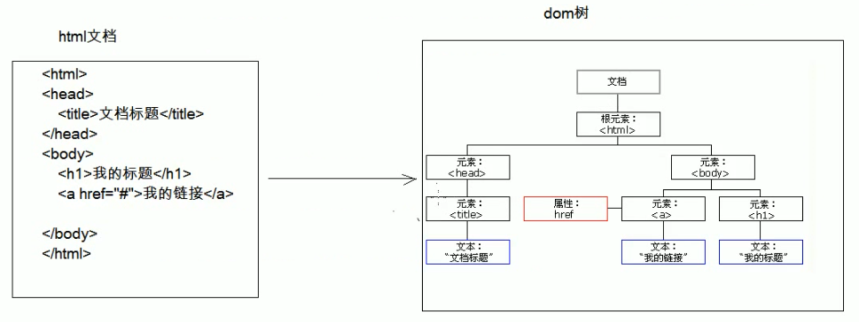

# 04.XML解析

- 笔记本：02.XML
- 创建时间：2020-01-27 10:31:32 UTC
- 更新时间：2020-01-27 16:23:36 UTC
- 印象笔记 GUID：401e58e2-555f-4a77-a8c6-73c15d01527c

#### 解析：操作 xml 文档，将文档中的数据读取到内存中

-
操作 xml 文档

  1. 解析（读取）：将文档中的数据读取到内存中

  1. 写入：将内存中的数据保存到 xml 文档中。持久化的存储

-
解析 xml 的方式：

  1. DOM：将标记语言文档一次性加载进内存，在内存中形成一颗 dom 树

    - 优点：操作方便，可以对文档进行 CRUD 的所有操作

    - 缺点：占内存
 

  1. SAX：逐行读取，基于事件驱动的

    - 优点：不占内存

    - 缺点：只能读取，不能增删改

-
xml 常见的解析器：

  1. JAXP：sun 公司提供的解析器，支持 dom 和 sax 两种思想

  1. DOM4J：一款非常优秀的解析器

  1. Jsoup：jsoup 是一款Java 的HTML 解析器，可直接解析某个 URL 地址、HTML 文本内容。它提供了一套非常省力的API，可通过DOM，CSS 以及类似于jQuery 的操作方法来取出和操作数据。

  1. PULL：Android 操作系统内置的解析器，sax 方式的。

**Jsoup：jsoup 是一款Java 的 HTML 解析器，可直接解析某个 URL 地址、HTML文本内容。它提供了一套非常省力的 API，可通过 DOM，CSS以及类似于jQuery 的操作方法来取出和操作数据。**

- 快速入门

  - 步骤：

    1. 导入jar 包

    1. 获取 Document 对象

    1. 获取对应的标签 Element 对象

    1. 获取数据

- 对象的使用：

  1. Jsoup：工具类，可以解析html 或xml 文档，返回Document

    - parse：解析html 或 xml 文档，返回Document

      - parse(File in, String charsetName): 解析xml/html 文件

      - parse(String html): 解析xml/html字符串

      - parse(URL url, int timeoutMillis): 通过网络路径获取指定的html/xml 的文档对象

  1. Document：文档对象，代表内存中的dom 树

    - 获取 Element 对象

      - getElementById(String id): 根据id 属性值获取唯一的 Element 对象

      - getElementsByTag(String tagName): 根据标签名称获取元素对象集合

      - getElementsByAttribute(String key): 根据属性名称获取元素对象集合

      - getElementsByAttributeValue(String key, String value): 根据对应的属性名和属性值获取元素对象集合

  1. Elements：元素Element 对象的集合。可以当做 ArrayList<Element>来使用

  1. Element：元素对象

    1. 获取子元素标签

      - getElementById(String id): 根据id 属性值获取唯一的 Element 对象

      - getElementsByTag(String tagName): 根据标签名称获取元素对象集合

      - getElementsByAttribute(String key): 根据属性名称获取元素对象集合

      - getElementsByAttributeValue(String key, String value): 根据对应的属性名和属性值

    1. 获取属性值

      - String attr(String key): 根据属性名称获取属性值

    1. 获取文本内容

      - String text(): 获取文本内容（获取所有子标签的纯文本内容）

      - String html(): 获取标签体内的所有元素（包括子标签的标签和文本内容）

  1. Node：节点对象

    - 是 Document 和 Element 的父类

**代码**

```
public class JsouupDemo {
    public static void main(String[] args) throws IOException {
        // 2. 获取 Document 对象，根据 xml 文档获取
        // 2.1 获取 student.xml 的 path
        String path = JsoupDem.class.getClassLoader().getResource("student.xml").getPath();
        // 2.2 解析xml 文档，加载文档进内存，获取 dom 树 --> Document
        Document document = Jsoup.parse(new File(path), "utf-8");
        // 3. 获取元素对象 Element
        Elements elements = document.getElementsByTag("name");
        System.out.println(elements.size());
        // 3.1 获取第一个name 的Element对象
        Element element = elements.get(0);
        String name = element.text();
        System.out.println(name);
    }
}

```

```
<?xml version="1.0" encoding="UTF-8" ?>
<students>
    <student number="s001">
        <name>zhangsan</name>
        <age>23</age>
        <sex>female</sex>
    </student>

    <student number="s002">
        <name>lisi</name>
        <age>22</age>
        <sex>male</sex>
    </student>
</students>

```

**Jsoup根据选择器查询**

- 快捷查询方式：

  1. selector：选择器

    - 使用的方法：Elements select(String cssQuery)

      - 语法：参考 Selector 类中定义的语法

  1. XPath：XPath 即为XML 路径语言，它是一种用来确定XML（标准通用标记语言的子集）文档中某部分位置的语言

    - 使用Jsoup 的 xpath 需要额外导入jar包

    - 查询 w3cschool 参考手册，使用xpath 语法

**selector使用案例**

```
public class JsoupDemo {
    public static void main(String[] args) {
        // 1. 获取 student.xml 的 path
        String path = JsoupDemo.class.getClassLoader().getResource("student.xml").getPath();
        // 2. 获取 Document 对象
        Document document = Jsoup.parse(new File(path), "utf-8");

        // 3. 查询 name 标签
        Elements elements = document.select("name");
        System.out.prinln(elements);

        // 4. 查询 id 为 itcast 的元素
        Elements elements2 = document.select("#itcast");
        System.out.println(elements2);

        // 5. 获取student 标签并且 number 属性值为 s001 的 age 子标签
        // 5.1 获取 student 标签并且 number 属性值为 s001
        Elements element3 = document.select("studnet[number=\"s001\"]");
        System.out.println(element3);
        // 5.2 获取student 标签并且 number 属性值为 s001 的 age 子标签
        Elements element4 = document.select("studnet[number=\"s001\"] > age");
        System.out.println(element4);
    }
}

```

```
<?xml version="1.0" encoding="UTF-8" ?>
<students>
    <student number="s001">
        <name id="itcast">zhangsan</name>
        <age>23</age>
        <sex>female</sex>
    </student>

    <student number="s002">
        <name>lisi</name>
        <age>22</age>
        <sex>male</sex>
    </student>
</students>

```

**selector使用案例**

```
public class JsoupDemo {
    public static void main(String[] args) {
        // 1. 获取 student.xml 的 path
        String path = JsoupDemo.class.getClassLoader().getResource("student.xml").getPath();
        // 2. 获取 Document 对象
        Document document = Jsoup.parse(new File(path), "utf-8");

        // 3. 根据document 对象，创建JXDocument 对象
        JXDocument jxDocument = new JXDocument(document);
        // 4. 结合 xpath 语法查询
        // 4.1 查询所有的 studnet 标签
        List<JXNode> jxNodes = jxDocument.selN("//student");
        for(JXNode jxNode : jxNodes) {
            System.out.println(jxNode);
        }
        // 4.2 查询所有的student 标签下的 name 标签
        List<JXNode> jxNodes2 = jxDocument.selN("//student/name");
        for(JXNode jxNode : jxNode2) {
            System.out.println(jxNode);
        }
        // 4.3 查询所有的student 标签下带有 id 属性的 name 标签
        List<JXNode> jxNodes3 = jxDocument.selN("//student/name[@id]");
        for(JXNode jxNode : jxNode3) {
            System.out.println(jxNode);
        }
        // 4.4 查询所有的student 标签下带有 id 属性的 name 标签，并且id 属性值为 itcast
        List<JXNode> jxNodes4 = jxDocument.selN("//student/name[@]");
        for(JXNode jxNode : jxNode4) {
            System.out.println(jxNode);
        }
    }
}

```

%23%23%23%23%20%E8%A7%A3%E6%9E%90%EF%BC%9A%E6%93%8D%E4%BD%9C%20xml%20%E6%96%87%E6%A1%A3%EF%BC%8C%E5%B0%86%E6%96%87%E6%A1%A3%E4%B8%AD%E7%9A%84%E6%95%B0%E6%8D%AE%E8%AF%BB%E5%8F%96%E5%88%B0%E5%86%85%E5%AD%98%E4%B8%AD%0A%0A*%20%E6%93%8D%E4%BD%9C%20xml%20%E6%96%87%E6%A1%A3%0A%20%20%20%201.%20%E8%A7%A3%E6%9E%90%EF%BC%88%E8%AF%BB%E5%8F%96%EF%BC%89%EF%BC%9A%E5%B0%86%E6%96%87%E6%A1%A3%E4%B8%AD%E7%9A%84%E6%95%B0%E6%8D%AE%E8%AF%BB%E5%8F%96%E5%88%B0%E5%86%85%E5%AD%98%E4%B8%AD%0A%20%20%20%202.%20%E5%86%99%E5%85%A5%EF%BC%9A%E5%B0%86%E5%86%85%E5%AD%98%E4%B8%AD%E7%9A%84%E6%95%B0%E6%8D%AE%E4%BF%9D%E5%AD%98%E5%88%B0%20xml%20%E6%96%87%E6%A1%A3%E4%B8%AD%E3%80%82%E6%8C%81%E4%B9%85%E5%8C%96%E7%9A%84%E5%AD%98%E5%82%A8%0A%0A*%20%E8%A7%A3%E6%9E%90%20xml%20%E7%9A%84%E6%96%B9%E5%BC%8F%EF%BC%9A%0A%20%20%20%201.%20DOM%EF%BC%9A%E5%B0%86%E6%A0%87%E8%AE%B0%E8%AF%AD%E8%A8%80%E6%96%87%E6%A1%A3%E4%B8%80%E6%AC%A1%E6%80%A7%E5%8A%A0%E8%BD%BD%E8%BF%9B%E5%86%85%E5%AD%98%EF%BC%8C%E5%9C%A8%E5%86%85%E5%AD%98%E4%B8%AD%E5%BD%A2%E6%88%90%E4%B8%80%E9%A2%97%20dom%20%E6%A0%91%0A%20%20%20%20%20%20%20%20*%20%E4%BC%98%E7%82%B9%EF%BC%9A%E6%93%8D%E4%BD%9C%E6%96%B9%E4%BE%BF%EF%BC%8C%E5%8F%AF%E4%BB%A5%E5%AF%B9%E6%96%87%E6%A1%A3%E8%BF%9B%E8%A1%8C%20CRUD%20%E7%9A%84%E6%89%80%E6%9C%89%E6%93%8D%E4%BD%9C%0A%20%20%20%20%20%20%20%20*%20%E7%BC%BA%E7%82%B9%EF%BC%9A%E5%8D%A0%E5%86%85%E5%AD%98%0A!%5Be288fac26c6ca2be5be1296a1c5df08f.png%5D(en-resource%3A%2F%2Fdatabase%2F1164%3A0)%0A%20%20%20%202.%20SAX%EF%BC%9A%E9%80%90%E8%A1%8C%E8%AF%BB%E5%8F%96%EF%BC%8C%E5%9F%BA%E4%BA%8E%E4%BA%8B%E4%BB%B6%E9%A9%B1%E5%8A%A8%E7%9A%84%0A%20%20%20%20%20%20%20%20*%20%E4%BC%98%E7%82%B9%EF%BC%9A%E4%B8%8D%E5%8D%A0%E5%86%85%E5%AD%98%0A%20%20%20%20%20%20%20%20*%20%E7%BC%BA%E7%82%B9%EF%BC%9A%E5%8F%AA%E8%83%BD%E8%AF%BB%E5%8F%96%EF%BC%8C%E4%B8%8D%E8%83%BD%E5%A2%9E%E5%88%A0%E6%94%B9%0A%0A%0A*%20xml%20%E5%B8%B8%E8%A7%81%E7%9A%84%E8%A7%A3%E6%9E%90%E5%99%A8%EF%BC%9A%0A%20%20%20%201.%20JAXP%EF%BC%9Asun%20%E5%85%AC%E5%8F%B8%E6%8F%90%E4%BE%9B%E7%9A%84%E8%A7%A3%E6%9E%90%E5%99%A8%EF%BC%8C%E6%94%AF%E6%8C%81%20dom%20%E5%92%8C%20sax%20%E4%B8%A4%E7%A7%8D%E6%80%9D%E6%83%B3%0A%20%20%20%202.%20DOM4J%EF%BC%9A%E4%B8%80%E6%AC%BE%E9%9D%9E%E5%B8%B8%E4%BC%98%E7%A7%80%E7%9A%84%E8%A7%A3%E6%9E%90%E5%99%A8%0A%20%20%20%203.%20Jsoup%EF%BC%9Ajsoup%20%E6%98%AF%E4%B8%80%E6%AC%BEJava%20%E7%9A%84HTML%20%E8%A7%A3%E6%9E%90%E5%99%A8%EF%BC%8C%E5%8F%AF%E7%9B%B4%E6%8E%A5%E8%A7%A3%E6%9E%90%E6%9F%90%E4%B8%AA%20URL%20%E5%9C%B0%E5%9D%80%E3%80%81HTML%20%E6%96%87%E6%9C%AC%E5%86%85%E5%AE%B9%E3%80%82%E5%AE%83%E6%8F%90%E4%BE%9B%E4%BA%86%E4%B8%80%E5%A5%97%E9%9D%9E%E5%B8%B8%E7%9C%81%E5%8A%9B%E7%9A%84API%EF%BC%8C%E5%8F%AF%E9%80%9A%E8%BF%87DOM%EF%BC%8CCSS%20%E4%BB%A5%E5%8F%8A%E7%B1%BB%E4%BC%BC%E4%BA%8EjQuery%20%E7%9A%84%E6%93%8D%E4%BD%9C%E6%96%B9%E6%B3%95%E6%9D%A5%E5%8F%96%E5%87%BA%E5%92%8C%E6%93%8D%E4%BD%9C%E6%95%B0%E6%8D%AE%E3%80%82%0A%20%20%20%204.%20PULL%EF%BC%9AAndroid%20%E6%93%8D%E4%BD%9C%E7%B3%BB%E7%BB%9F%E5%86%85%E7%BD%AE%E7%9A%84%E8%A7%A3%E6%9E%90%E5%99%A8%EF%BC%8Csax%20%E6%96%B9%E5%BC%8F%E7%9A%84%E3%80%82%0A%0A**Jsoup%EF%BC%9Ajsoup%20%E6%98%AF%E4%B8%80%E6%AC%BEJava%20%E7%9A%84%20HTML%20%E8%A7%A3%E6%9E%90%E5%99%A8%EF%BC%8C%E5%8F%AF%E7%9B%B4%E6%8E%A5%E8%A7%A3%E6%9E%90%E6%9F%90%E4%B8%AA%20URL%20%E5%9C%B0%E5%9D%80%E3%80%81HTML%E6%96%87%E6%9C%AC%E5%86%85%E5%AE%B9%E3%80%82%E5%AE%83%E6%8F%90%E4%BE%9B%E4%BA%86%E4%B8%80%E5%A5%97%E9%9D%9E%E5%B8%B8%E7%9C%81%E5%8A%9B%E7%9A%84%20API%EF%BC%8C%E5%8F%AF%E9%80%9A%E8%BF%87%20DOM%EF%BC%8CCSS%E4%BB%A5%E5%8F%8A%E7%B1%BB%E4%BC%BC%E4%BA%8EjQuery%20%E7%9A%84%E6%93%8D%E4%BD%9C%E6%96%B9%E6%B3%95%E6%9D%A5%E5%8F%96%E5%87%BA%E5%92%8C%E6%93%8D%E4%BD%9C%E6%95%B0%E6%8D%AE%E3%80%82**%0A*%20%E5%BF%AB%E9%80%9F%E5%85%A5%E9%97%A8%0A%20%20%20%20*%20%E6%AD%A5%E9%AA%A4%EF%BC%9A%0A%20%20%20%20%20%20%20%201.%20%E5%AF%BC%E5%85%A5jar%20%E5%8C%85%0A%20%20%20%20%20%20%20%202.%20%E8%8E%B7%E5%8F%96%20Document%20%E5%AF%B9%E8%B1%A1%0A%20%20%20%20%20%20%20%203.%20%E8%8E%B7%E5%8F%96%E5%AF%B9%E5%BA%94%E7%9A%84%E6%A0%87%E7%AD%BE%20Element%20%E5%AF%B9%E8%B1%A1%0A%20%20%20%20%20%20%20%204.%20%E8%8E%B7%E5%8F%96%E6%95%B0%E6%8D%AE%0A*%20%E5%AF%B9%E8%B1%A1%E7%9A%84%E4%BD%BF%E7%94%A8%EF%BC%9A%0A%20%20%20%201.%20Jsoup%EF%BC%9A%E5%B7%A5%E5%85%B7%E7%B1%BB%EF%BC%8C%E5%8F%AF%E4%BB%A5%E8%A7%A3%E6%9E%90html%20%E6%88%96xml%20%E6%96%87%E6%A1%A3%EF%BC%8C%E8%BF%94%E5%9B%9EDocument%0A%20%20%20%20%20%20%20%20*%20parse%EF%BC%9A%E8%A7%A3%E6%9E%90html%20%E6%88%96%20xml%20%E6%96%87%E6%A1%A3%EF%BC%8C%E8%BF%94%E5%9B%9EDocument%0A%20%20%20%20%20%20%20%20%20%20%20%20*%20parse(File%20in%2C%20String%20charsetName)%3A%20%E8%A7%A3%E6%9E%90xml%2Fhtml%20%E6%96%87%E4%BB%B6%0A%20%20%20%20%20%20%20%20%20%20%20%20*%20parse(String%20html)%3A%20%E8%A7%A3%E6%9E%90xml%2Fhtml%E5%AD%97%E7%AC%A6%E4%B8%B2%0A%20%20%20%20%20%20%20%20%20%20%20%20*%20parse(URL%20url%2C%20int%20timeoutMillis)%3A%20%E9%80%9A%E8%BF%87%E7%BD%91%E7%BB%9C%E8%B7%AF%E5%BE%84%E8%8E%B7%E5%8F%96%E6%8C%87%E5%AE%9A%E7%9A%84html%2Fxml%20%E7%9A%84%E6%96%87%E6%A1%A3%E5%AF%B9%E8%B1%A1%0A%20%20%20%202.%20Document%EF%BC%9A%E6%96%87%E6%A1%A3%E5%AF%B9%E8%B1%A1%EF%BC%8C%E4%BB%A3%E8%A1%A8%E5%86%85%E5%AD%98%E4%B8%AD%E7%9A%84dom%20%E6%A0%91%0A%20%20%20%20%20%20%20%20*%20%E8%8E%B7%E5%8F%96%20Element%20%E5%AF%B9%E8%B1%A1%0A%20%20%20%20%20%20%20%20%20%20%20%20*%20getElementById(String%20id)%3A%20%E6%A0%B9%E6%8D%AEid%20%E5%B1%9E%E6%80%A7%E5%80%BC%E8%8E%B7%E5%8F%96%E5%94%AF%E4%B8%80%E7%9A%84%20Element%20%E5%AF%B9%E8%B1%A1%20%0A%20%20%20%20%20%20%20%20%20%20%20%20*%20getElementsByTag(String%20tagName)%3A%20%E6%A0%B9%E6%8D%AE%E6%A0%87%E7%AD%BE%E5%90%8D%E7%A7%B0%E8%8E%B7%E5%8F%96%E5%85%83%E7%B4%A0%E5%AF%B9%E8%B1%A1%E9%9B%86%E5%90%88%0A%20%20%20%20%20%20%20%20%20%20%20%20*%20getElementsByAttribute(String%20key)%3A%20%E6%A0%B9%E6%8D%AE%E5%B1%9E%E6%80%A7%E5%90%8D%E7%A7%B0%E8%8E%B7%E5%8F%96%E5%85%83%E7%B4%A0%E5%AF%B9%E8%B1%A1%E9%9B%86%E5%90%88%0A%20%20%20%20%20%20%20%20%20%20%20%20*%20getElementsByAttributeValue(String%20key%2C%20String%20value)%3A%20%E6%A0%B9%E6%8D%AE%E5%AF%B9%E5%BA%94%E7%9A%84%E5%B1%9E%E6%80%A7%E5%90%8D%E5%92%8C%E5%B1%9E%E6%80%A7%E5%80%BC%E8%8E%B7%E5%8F%96%E5%85%83%E7%B4%A0%E5%AF%B9%E8%B1%A1%E9%9B%86%E5%90%88%0A%20%20%20%203.%20Elements%EF%BC%9A%E5%85%83%E7%B4%A0Element%20%E5%AF%B9%E8%B1%A1%E7%9A%84%E9%9B%86%E5%90%88%E3%80%82%E5%8F%AF%E4%BB%A5%E5%BD%93%E5%81%9A%20ArrayList%3CElement%3E%E6%9D%A5%E4%BD%BF%E7%94%A8%0A%20%20%20%204.%20Element%EF%BC%9A%E5%85%83%E7%B4%A0%E5%AF%B9%E8%B1%A1%0A%20%20%20%20%20%20%20%201.%20%E8%8E%B7%E5%8F%96%E5%AD%90%E5%85%83%E7%B4%A0%E6%A0%87%E7%AD%BE%0A%20%20%20%20%20%20%20%20%20%20%20%20%20*%20getElementById(String%20id)%3A%20%E6%A0%B9%E6%8D%AEid%20%E5%B1%9E%E6%80%A7%E5%80%BC%E8%8E%B7%E5%8F%96%E5%94%AF%E4%B8%80%E7%9A%84%20Element%20%E5%AF%B9%E8%B1%A1%20%0A%20%20%20%20%20%20%20%20%20%20%20%20*%20getElementsByTag(String%20tagName)%3A%20%E6%A0%B9%E6%8D%AE%E6%A0%87%E7%AD%BE%E5%90%8D%E7%A7%B0%E8%8E%B7%E5%8F%96%E5%85%83%E7%B4%A0%E5%AF%B9%E8%B1%A1%E9%9B%86%E5%90%88%0A%20%20%20%20%20%20%20%20%20%20%20%20*%20getElementsByAttribute(String%20key)%3A%20%E6%A0%B9%E6%8D%AE%E5%B1%9E%E6%80%A7%E5%90%8D%E7%A7%B0%E8%8E%B7%E5%8F%96%E5%85%83%E7%B4%A0%E5%AF%B9%E8%B1%A1%E9%9B%86%E5%90%88%0A%20%20%20%20%20%20%20%20%20%20%20%20*%20getElementsByAttributeValue(String%20key%2C%20String%20value)%3A%20%E6%A0%B9%E6%8D%AE%E5%AF%B9%E5%BA%94%E7%9A%84%E5%B1%9E%E6%80%A7%E5%90%8D%E5%92%8C%E5%B1%9E%E6%80%A7%E5%80%BC%0A%20%20%20%20%20%20%20%202.%20%E8%8E%B7%E5%8F%96%E5%B1%9E%E6%80%A7%E5%80%BC%0A%20%20%20%20%20%20%20%20%20%20%20%20*%20String%20attr(String%20key)%3A%20%E6%A0%B9%E6%8D%AE%E5%B1%9E%E6%80%A7%E5%90%8D%E7%A7%B0%E8%8E%B7%E5%8F%96%E5%B1%9E%E6%80%A7%E5%80%BC%0A%20%20%20%20%20%20%20%203.%20%E8%8E%B7%E5%8F%96%E6%96%87%E6%9C%AC%E5%86%85%E5%AE%B9%0A%20%20%20%20%20%20%20%20%20%20%20%20*%20String%20text()%3A%20%E8%8E%B7%E5%8F%96%E6%96%87%E6%9C%AC%E5%86%85%E5%AE%B9%EF%BC%88%E8%8E%B7%E5%8F%96%E6%89%80%E6%9C%89%E5%AD%90%E6%A0%87%E7%AD%BE%E7%9A%84%E7%BA%AF%E6%96%87%E6%9C%AC%E5%86%85%E5%AE%B9%EF%BC%89%0A%20%20%20%20%20%20%20%20%20%20%20%20*%20String%20html()%3A%20%E8%8E%B7%E5%8F%96%E6%A0%87%E7%AD%BE%E4%BD%93%E5%86%85%E7%9A%84%E6%89%80%E6%9C%89%E5%85%83%E7%B4%A0%EF%BC%88%E5%8C%85%E6%8B%AC%E5%AD%90%E6%A0%87%E7%AD%BE%E7%9A%84%E6%A0%87%E7%AD%BE%E5%92%8C%E6%96%87%E6%9C%AC%E5%86%85%E5%AE%B9%EF%BC%89%0A%20%20%20%205.%20Node%EF%BC%9A%E8%8A%82%E7%82%B9%E5%AF%B9%E8%B1%A1%0A%20%20%20%20%20%20%20%20*%20%E6%98%AF%20Document%20%E5%92%8C%20Element%20%E7%9A%84%E7%88%B6%E7%B1%BB%0A%0A%20**%E4%BB%A3%E7%A0%81**%20%20%20%20%20%20%20%0A%60%60%60java%0Apublic%20class%20JsouupDemo%20%7B%0A%20%20%20%20public%20static%20void%20main(String%5B%5D%20args)%20throws%20IOException%20%7B%0A%20%20%20%20%20%20%20%20%2F%2F%202.%20%E8%8E%B7%E5%8F%96%20Document%20%E5%AF%B9%E8%B1%A1%EF%BC%8C%E6%A0%B9%E6%8D%AE%20xml%20%E6%96%87%E6%A1%A3%E8%8E%B7%E5%8F%96%0A%20%20%20%20%20%20%20%20%2F%2F%202.1%20%E8%8E%B7%E5%8F%96%20student.xml%20%E7%9A%84%20path%0A%20%20%20%20%20%20%20%20String%20path%20%3D%20JsoupDem.class.getClassLoader().getResource(%22student.xml%22).getPath()%3B%0A%20%20%20%20%20%20%20%20%2F%2F%202.2%20%E8%A7%A3%E6%9E%90xml%20%E6%96%87%E6%A1%A3%EF%BC%8C%E5%8A%A0%E8%BD%BD%E6%96%87%E6%A1%A3%E8%BF%9B%E5%86%85%E5%AD%98%EF%BC%8C%E8%8E%B7%E5%8F%96%20dom%20%E6%A0%91%20--%3E%20Document%0A%20%20%20%20%20%20%20%20Document%20document%20%3D%20Jsoup.parse(new%20File(path)%2C%20%22utf-8%22)%3B%0A%20%20%20%20%20%20%20%20%2F%2F%203.%20%E8%8E%B7%E5%8F%96%E5%85%83%E7%B4%A0%E5%AF%B9%E8%B1%A1%20Element%0A%20%20%20%20%20%20%20%20Elements%20elements%20%3D%20document.getElementsByTag(%22name%22)%3B%0A%20%20%20%20%20%20%20%20System.out.println(elements.size())%3B%0A%20%20%20%20%20%20%20%20%2F%2F%203.1%20%E8%8E%B7%E5%8F%96%E7%AC%AC%E4%B8%80%E4%B8%AAname%20%E7%9A%84Element%E5%AF%B9%E8%B1%A1%0A%20%20%20%20%20%20%20%20Element%20element%20%3D%20elements.get(0)%3B%0A%20%20%20%20%20%20%20%20String%20name%20%3D%20element.text()%3B%0A%20%20%20%20%20%20%20%20System.out.println(name)%3B%0A%20%20%20%20%7D%0A%7D%0A%60%60%60%0A%0A%60%60%60xml%0A%3C%3Fxml%20version%3D%221.0%22%20encoding%3D%22UTF-8%22%20%3F%3E%0A%3Cstudents%3E%0A%20%20%20%20%3Cstudent%20number%3D%22s001%22%3E%0A%20%20%20%20%20%20%20%20%3Cname%3Ezhangsan%3C%2Fname%3E%0A%20%20%20%20%20%20%20%20%3Cage%3E23%3C%2Fage%3E%0A%20%20%20%20%20%20%20%20%3Csex%3Efemale%3C%2Fsex%3E%0A%20%20%20%20%3C%2Fstudent%3E%0A%20%20%20%20%0A%20%20%20%20%3Cstudent%20number%3D%22s002%22%3E%0A%20%20%20%20%20%20%20%20%3Cname%3Elisi%3C%2Fname%3E%0A%20%20%20%20%20%20%20%20%3Cage%3E22%3C%2Fage%3E%0A%20%20%20%20%20%20%20%20%3Csex%3Emale%3C%2Fsex%3E%0A%20%20%20%20%3C%2Fstudent%3E%0A%3C%2Fstudents%3E%0A%60%60%60%0A%0A---%0A%0A**Jsoup%E6%A0%B9%E6%8D%AE%E9%80%89%E6%8B%A9%E5%99%A8%E6%9F%A5%E8%AF%A2**%0A*%20%E5%BF%AB%E6%8D%B7%E6%9F%A5%E8%AF%A2%E6%96%B9%E5%BC%8F%EF%BC%9A%0A%20%20%20%201.%20selector%EF%BC%9A%E9%80%89%E6%8B%A9%E5%99%A8%0A%20%20%20%20%20%20%20%20*%20%E4%BD%BF%E7%94%A8%E7%9A%84%E6%96%B9%E6%B3%95%EF%BC%9AElements%20select(String%20cssQuery)%0A%20%20%20%20%20%20%20%20%20%20%20%20*%20%E8%AF%AD%E6%B3%95%EF%BC%9A%E5%8F%82%E8%80%83%20Selector%20%E7%B1%BB%E4%B8%AD%E5%AE%9A%E4%B9%89%E7%9A%84%E8%AF%AD%E6%B3%95%0A%20%20%20%202.%20XPath%EF%BC%9AXPath%20%E5%8D%B3%E4%B8%BAXML%20%E8%B7%AF%E5%BE%84%E8%AF%AD%E8%A8%80%EF%BC%8C%E5%AE%83%E6%98%AF%E4%B8%80%E7%A7%8D%E7%94%A8%E6%9D%A5%E7%A1%AE%E5%AE%9AXML%EF%BC%88%E6%A0%87%E5%87%86%E9%80%9A%E7%94%A8%E6%A0%87%E8%AE%B0%E8%AF%AD%E8%A8%80%E7%9A%84%E5%AD%90%E9%9B%86%EF%BC%89%E6%96%87%E6%A1%A3%E4%B8%AD%E6%9F%90%E9%83%A8%E5%88%86%E4%BD%8D%E7%BD%AE%E7%9A%84%E8%AF%AD%E8%A8%80%0A%20%20%20%20%20%20%20%20*%20%E4%BD%BF%E7%94%A8Jsoup%20%E7%9A%84%20xpath%20%E9%9C%80%E8%A6%81%E9%A2%9D%E5%A4%96%E5%AF%BC%E5%85%A5jar%E5%8C%85%0A%20%20%20%20%20%20%20%20*%20%E6%9F%A5%E8%AF%A2%20w3cschool%20%E5%8F%82%E8%80%83%E6%89%8B%E5%86%8C%EF%BC%8C%E4%BD%BF%E7%94%A8xpath%20%E8%AF%AD%E6%B3%95%E5%AE%8C%E6%88%90%E6%9F%A5%E8%AF%A2%0A%0A**selector%E4%BD%BF%E7%94%A8%E6%A1%88%E4%BE%8B**%0A%60%60%60java%0Apublic%20class%20JsoupDemo%20%7B%0A%20%20%20%20public%20static%20void%20main(String%5B%5D%20args)%20%7B%0A%20%20%20%20%20%20%20%20%2F%2F%201.%20%E8%8E%B7%E5%8F%96%20student.xml%20%E7%9A%84%20path%0A%20%20%20%20%20%20%20%20String%20path%20%3D%20JsoupDemo.class.getClassLoader().getResource(%22student.xml%22).getPath()%3B%0A%20%20%20%20%20%20%20%20%2F%2F%202.%20%E8%8E%B7%E5%8F%96%20Document%20%E5%AF%B9%E8%B1%A1%0A%20%20%20%20%20%20%20%20Document%20document%20%3D%20Jsoup.parse(new%20File(path)%2C%20%22utf-8%22)%3B%0A%20%20%20%20%20%20%20%20%0A%20%20%20%20%20%20%20%20%2F%2F%203.%20%E6%9F%A5%E8%AF%A2%20name%20%E6%A0%87%E7%AD%BE%0A%20%20%20%20%20%20%20%20Elements%20elements%20%3D%20document.select(%22name%22)%3B%0A%20%20%20%20%20%20%20%20System.out.prinln(elements)%3B%0A%20%20%20%20%20%20%20%20%0A%20%20%20%20%20%20%20%20%2F%2F%204.%20%E6%9F%A5%E8%AF%A2%20id%20%E4%B8%BA%20itcast%20%E7%9A%84%E5%85%83%E7%B4%A0%0A%20%20%20%20%20%20%20%20Elements%20elements2%20%3D%20document.select(%22%23itcast%22)%3B%0A%20%20%20%20%20%20%20%20System.out.println(elements2)%3B%0A%20%20%20%20%20%20%20%20%0A%20%20%20%20%20%20%20%20%2F%2F%205.%20%E8%8E%B7%E5%8F%96student%20%E6%A0%87%E7%AD%BE%E5%B9%B6%E4%B8%94%20number%20%E5%B1%9E%E6%80%A7%E5%80%BC%E4%B8%BA%20s001%20%E7%9A%84%20age%20%E5%AD%90%E6%A0%87%E7%AD%BE%0A%20%20%20%20%20%20%20%20%2F%2F%205.1%20%E8%8E%B7%E5%8F%96%20student%20%E6%A0%87%E7%AD%BE%E5%B9%B6%E4%B8%94%20number%20%E5%B1%9E%E6%80%A7%E5%80%BC%E4%B8%BA%20s001%20%0A%20%20%20%20%20%20%20%20Elements%20element3%20%3D%20document.select(%22studnet%5Bnumber%3D%5C%22s001%5C%22%5D%22)%3B%0A%20%20%20%20%20%20%20%20System.out.println(element3)%3B%0A%20%20%20%20%20%20%20%20%2F%2F%205.2%20%E8%8E%B7%E5%8F%96student%20%E6%A0%87%E7%AD%BE%E5%B9%B6%E4%B8%94%20number%20%E5%B1%9E%E6%80%A7%E5%80%BC%E4%B8%BA%20s001%20%E7%9A%84%20age%20%E5%AD%90%E6%A0%87%E7%AD%BE%0A%20%20%20%20%20%20%20%20Elements%20element4%20%3D%20document.select(%22studnet%5Bnumber%3D%5C%22s001%5C%22%5D%20%3E%20age%22)%3B%0A%20%20%20%20%20%20%20%20System.out.println(element4)%3B%0A%20%20%20%20%7D%0A%7D%0A%60%60%60%0A%0A%60%60%60xml%0A%3C%3Fxml%20version%3D%221.0%22%20encoding%3D%22UTF-8%22%20%3F%3E%0A%3Cstudents%3E%0A%20%20%20%20%3Cstudent%20number%3D%22s001%22%3E%0A%20%20%20%20%20%20%20%20%3Cname%20id%3D%22itcast%22%3Ezhangsan%3C%2Fname%3E%0A%20%20%20%20%20%20%20%20%3Cage%3E23%3C%2Fage%3E%0A%20%20%20%20%20%20%20%20%3Csex%3Efemale%3C%2Fsex%3E%0A%20%20%20%20%3C%2Fstudent%3E%0A%20%20%20%20%0A%20%20%20%20%3Cstudent%20number%3D%22s002%22%3E%0A%20%20%20%20%20%20%20%20%3Cname%3Elisi%3C%2Fname%3E%0A%20%20%20%20%20%20%20%20%3Cage%3E22%3C%2Fage%3E%0A%20%20%20%20%20%20%20%20%3Csex%3Emale%3C%2Fsex%3E%0A%20%20%20%20%3C%2Fstudent%3E%0A%3C%2Fstudents%3E%0A%60%60%60%0A**selector%E4%BD%BF%E7%94%A8%E6%A1%88%E4%BE%8B**%0A%60%60%60java%0Apublic%20class%20JsoupDemo%20%7B%0A%20%20%20%20public%20static%20void%20main(String%5B%5D%20args)%20%7B%0A%20%20%20%20%20%20%20%20%2F%2F%201.%20%E8%8E%B7%E5%8F%96%20student.xml%20%E7%9A%84%20path%0A%20%20%20%20%20%20%20%20String%20path%20%3D%20JsoupDemo.class.getClassLoader().getResource(%22student.xml%22).getPath()%3B%0A%20%20%20%20%20%20%20%20%2F%2F%202.%20%E8%8E%B7%E5%8F%96%20Document%20%E5%AF%B9%E8%B1%A1%0A%20%20%20%20%20%20%20%20Document%20document%20%3D%20Jsoup.parse(new%20File(path)%2C%20%22utf-8%22)%3B%0A%20%20%20%20%20%20%20%20%0A%20%20%20%20%20%20%20%20%2F%2F%203.%20%E6%A0%B9%E6%8D%AEdocument%20%E5%AF%B9%E8%B1%A1%EF%BC%8C%E5%88%9B%E5%BB%BAJXDocument%20%E5%AF%B9%E8%B1%A1%0A%20%20%20%20%20%20%20%20JXDocument%20jxDocument%20%3D%20new%20JXDocument(document)%3B%0A%20%20%20%20%20%20%20%20%2F%2F%204.%20%E7%BB%93%E5%90%88%20xpath%20%E8%AF%AD%E6%B3%95%E6%9F%A5%E8%AF%A2%0A%20%20%20%20%20%20%20%20%2F%2F%204.1%20%E6%9F%A5%E8%AF%A2%E6%89%80%E6%9C%89%E7%9A%84%20studnet%20%E6%A0%87%E7%AD%BE%0A%20%20%20%20%20%20%20%20List%3CJXNode%3E%20jxNodes%20%3D%20jxDocument.selN(%22%2F%2Fstudent%22)%3B%0A%20%20%20%20%20%20%20%20for(JXNode%20jxNode%20%3A%20jxNodes)%20%7B%0A%20%20%20%20%20%20%20%20%20%20%20%20System.out.println(jxNode)%3B%0A%20%20%20%20%20%20%20%20%7D%0A%20%20%20%20%20%20%20%20%2F%2F%204.2%20%E6%9F%A5%E8%AF%A2%E6%89%80%E6%9C%89%E7%9A%84student%20%E6%A0%87%E7%AD%BE%E4%B8%8B%E7%9A%84%20name%20%E6%A0%87%E7%AD%BE%0A%20%20%20%20%20%20%20%20List%3CJXNode%3E%20jxNodes2%20%3D%20jxDocument.selN(%22%2F%2Fstudent%2Fname%22)%3B%0A%20%20%20%20%20%20%20%20for(JXNode%20jxNode%20%3A%20jxNode2)%20%7B%0A%20%20%20%20%20%20%20%20%20%20%20%20System.out.println(jxNode)%3B%0A%20%20%20%20%20%20%20%20%7D%0A%20%20%20%20%20%20%20%20%2F%2F%204.3%20%E6%9F%A5%E8%AF%A2%E6%89%80%E6%9C%89%E7%9A%84student%20%E6%A0%87%E7%AD%BE%E4%B8%8B%E5%B8%A6%E6%9C%89%20id%20%E5%B1%9E%E6%80%A7%E7%9A%84%20name%20%E6%A0%87%E7%AD%BE%0A%20%20%20%20%20%20%20%20List%3CJXNode%3E%20jxNodes3%20%3D%20jxDocument.selN(%22%2F%2Fstudent%2Fname%5B%40id%5D%22)%3B%0A%20%20%20%20%20%20%20%20for(JXNode%20jxNode%20%3A%20jxNode3)%20%7B%0A%20%20%20%20%20%20%20%20%20%20%20%20System.out.println(jxNode)%3B%0A%20%20%20%20%20%20%20%20%7D%0A%20%20%20%20%20%20%20%20%2F%2F%204.4%20%E6%9F%A5%E8%AF%A2%E6%89%80%E6%9C%89%E7%9A%84student%20%E6%A0%87%E7%AD%BE%E4%B8%8B%E5%B8%A6%E6%9C%89%20id%20%E5%B1%9E%E6%80%A7%E7%9A%84%20name%20%E6%A0%87%E7%AD%BE%EF%BC%8C%E5%B9%B6%E4%B8%94id%20%E5%B1%9E%E6%80%A7%E5%80%BC%E4%B8%BA%20itcast%0A%20%20%20%20%20%20%20%20List%3CJXNode%3E%20jxNodes4%20%3D%20jxDocument.selN(%22%2F%2Fstudent%2Fname%5B%40id%3D'itcast'%5D%22)%3B%0A%20%20%20%20%20%20%20%20for(JXNode%20jxNode%20%3A%20jxNode4)%20%7B%0A%20%20%20%20%20%20%20%20%20%20%20%20System.out.println(jxNode)%3B%0A%20%20%20%20%20%20%20%20%7D%0A%20%20%20%20%7D%0A%7D%0A%60%60%60%0A
