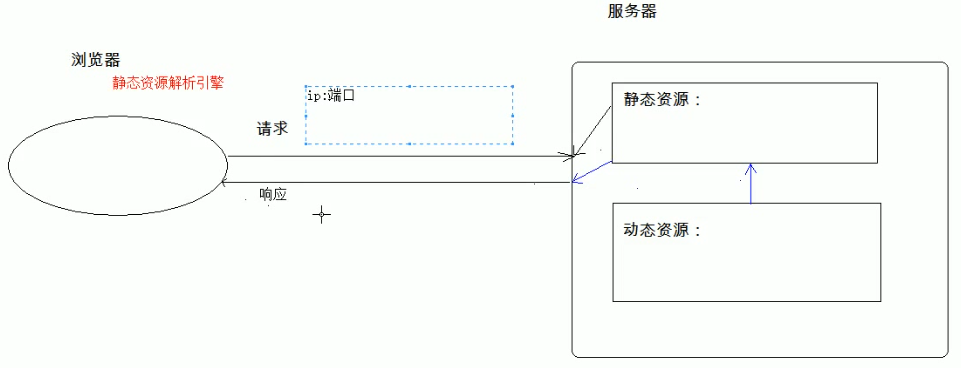

# 01.Web相关概念

- 笔记本：03.Tomcat
- 创建时间：2020-01-27 16:25:08 UTC
- 更新时间：2020-01-27 16:42:19 UTC
- 印象笔记 GUID：3a4359b1-27d7-44a0-9480-921f234e4513

#### Web 相关概念

1.
软件架构

  1. C/S：客户端/服务器端

  1. B/S：浏览器/服务器端

1.
资源分类

  1. 静态资源：所有用户访问后，得到的结果都是一样的；称为静态资源。静态资源可以直接被浏览器解析

    - 如：html、css、JavaScript

  1. 动态资源：每个用户访问相同资源后，得到的结果可能不一样。称为动态资源。动态资源被访问后，需要先转换为静态资源，再返回给浏览器

    - 如：servlet/jsp，php，asp ......

1.
网络通信三要素

  1. IP：电子设备(计算机)在网络中的唯一标识

  1. 端口：应用程序在计算机中的唯一标识。0~65535

  1. 传输协议：规定了数据传输的规则

    1. 基础协议

      1. tcp：安全协议，三次握手。速度稍慢

      1. udp：不安全协议，速度快
 

#### Web 服务器软件：

- 服务器：安装了服务器软件的计算机

- 服务器软件：接收用户的请求，处理请求，做出响应

- web 服务器软件：接收用户的请求，处理请求，做出响应

  - 在 web服务器软件中，可以部署web 项目，让用户通过浏览器来访问这些项目

  - web容器

- 常见的java相关的web服务器软件：

  - webLogic：oracle公司，大型的JavaEE服务器，支持所有的JavaEE规范，收费的

  - webSphere：IBM公司，大型的JavaEE服务器，支持所有的JavaEE规范，收费的

  - JBOSS：JBOSS公司，大型的JavaEE服务器，支持所有的JavaEE规范，收费的

  - Tomcat：Apache 基金组织，中小型的JavaEE 服务器，仅仅支持少量的JavaEE规范servlet/jsp。开源的，免费的

- JavaEE：Java语言在企业级看开发中使用的技术规范的总和，一共规定了13项大的规范

%23%23%23%23%20Web%20%E7%9B%B8%E5%85%B3%E6%A6%82%E5%BF%B5%0A1.%20%E8%BD%AF%E4%BB%B6%E6%9E%B6%E6%9E%84%0A%20%20%20%201.%20C%2FS%EF%BC%9A%E5%AE%A2%E6%88%B7%E7%AB%AF%2F%E6%9C%8D%E5%8A%A1%E5%99%A8%E7%AB%AF%0A%20%20%20%202.%20B%2FS%EF%BC%9A%E6%B5%8F%E8%A7%88%E5%99%A8%2F%E6%9C%8D%E5%8A%A1%E5%99%A8%E7%AB%AF%0A%0A2.%20%E8%B5%84%E6%BA%90%E5%88%86%E7%B1%BB%0A%20%20%20%201.%20%E9%9D%99%E6%80%81%E8%B5%84%E6%BA%90%EF%BC%9A%E6%89%80%E6%9C%89%E7%94%A8%E6%88%B7%E8%AE%BF%E9%97%AE%E5%90%8E%EF%BC%8C%E5%BE%97%E5%88%B0%E7%9A%84%E7%BB%93%E6%9E%9C%E9%83%BD%E6%98%AF%E4%B8%80%E6%A0%B7%E7%9A%84%EF%BC%9B%E7%A7%B0%E4%B8%BA%E9%9D%99%E6%80%81%E8%B5%84%E6%BA%90%E3%80%82%E9%9D%99%E6%80%81%E8%B5%84%E6%BA%90%E5%8F%AF%E4%BB%A5%E7%9B%B4%E6%8E%A5%E8%A2%AB%E6%B5%8F%E8%A7%88%E5%99%A8%E8%A7%A3%E6%9E%90%0A%20%20%20%20%20%20%20%20*%20%E5%A6%82%EF%BC%9Ahtml%E3%80%81css%E3%80%81JavaScript%0A%20%20%20%202.%20%E5%8A%A8%E6%80%81%E8%B5%84%E6%BA%90%EF%BC%9A%E6%AF%8F%E4%B8%AA%E7%94%A8%E6%88%B7%E8%AE%BF%E9%97%AE%E7%9B%B8%E5%90%8C%E8%B5%84%E6%BA%90%E5%90%8E%EF%BC%8C%E5%BE%97%E5%88%B0%E7%9A%84%E7%BB%93%E6%9E%9C%E5%8F%AF%E8%83%BD%E4%B8%8D%E4%B8%80%E6%A0%B7%E3%80%82%E7%A7%B0%E4%B8%BA%E5%8A%A8%E6%80%81%E8%B5%84%E6%BA%90%E3%80%82%E5%8A%A8%E6%80%81%E8%B5%84%E6%BA%90%E8%A2%AB%E8%AE%BF%E9%97%AE%E5%90%8E%EF%BC%8C%E9%9C%80%E8%A6%81%E5%85%88%E8%BD%AC%E6%8D%A2%E4%B8%BA%E9%9D%99%E6%80%81%E8%B5%84%E6%BA%90%EF%BC%8C%E5%86%8D%E8%BF%94%E5%9B%9E%E7%BB%99%E6%B5%8F%E8%A7%88%E5%99%A8%0A%20%20%20%20%20%20%20%20*%20%E5%A6%82%EF%BC%9Aservlet%2Fjsp%EF%BC%8Cphp%EF%BC%8Casp%20......%0A%0A3.%20%E7%BD%91%E7%BB%9C%E9%80%9A%E4%BF%A1%E4%B8%89%E8%A6%81%E7%B4%A0%0A%20%20%20%201.%20IP%EF%BC%9A%E7%94%B5%E5%AD%90%E8%AE%BE%E5%A4%87(%E8%AE%A1%E7%AE%97%E6%9C%BA)%E5%9C%A8%E7%BD%91%E7%BB%9C%E4%B8%AD%E7%9A%84%E5%94%AF%E4%B8%80%E6%A0%87%E8%AF%86%0A%20%20%20%202.%20%E7%AB%AF%E5%8F%A3%EF%BC%9A%E5%BA%94%E7%94%A8%E7%A8%8B%E5%BA%8F%E5%9C%A8%E8%AE%A1%E7%AE%97%E6%9C%BA%E4%B8%AD%E7%9A%84%E5%94%AF%E4%B8%80%E6%A0%87%E8%AF%86%E3%80%820~65535%0A%20%20%20%203.%20%E4%BC%A0%E8%BE%93%E5%8D%8F%E8%AE%AE%EF%BC%9A%E8%A7%84%E5%AE%9A%E4%BA%86%E6%95%B0%E6%8D%AE%E4%BC%A0%E8%BE%93%E7%9A%84%E8%A7%84%E5%88%99%0A%20%20%20%20%20%20%20%201.%20%E5%9F%BA%E7%A1%80%E5%8D%8F%E8%AE%AE%0A%20%20%20%20%20%20%20%20%20%20%20%201.%20tcp%EF%BC%9A%E5%AE%89%E5%85%A8%E5%8D%8F%E8%AE%AE%EF%BC%8C%E4%B8%89%E6%AC%A1%E6%8F%A1%E6%89%8B%E3%80%82%E9%80%9F%E5%BA%A6%E7%A8%8D%E6%85%A2%0A%20%20%20%20%20%20%20%20%20%20%20%202.%20udp%EF%BC%9A%E4%B8%8D%E5%AE%89%E5%85%A8%E5%8D%8F%E8%AE%AE%EF%BC%8C%E9%80%9F%E5%BA%A6%E5%BF%AB%0A!%5Bd859f1b76cd65a20e50ff118521aac78.png%5D(en-resource%3A%2F%2Fdatabase%2F1174%3A0)%0A%0A%23%23%23%23%20Web%20%E6%9C%8D%E5%8A%A1%E5%99%A8%E8%BD%AF%E4%BB%B6%EF%BC%9A%0A*%20%E6%9C%8D%E5%8A%A1%E5%99%A8%EF%BC%9A%E5%AE%89%E8%A3%85%E4%BA%86%E6%9C%8D%E5%8A%A1%E5%99%A8%E8%BD%AF%E4%BB%B6%E7%9A%84%E8%AE%A1%E7%AE%97%E6%9C%BA%0A*%20%E6%9C%8D%E5%8A%A1%E5%99%A8%E8%BD%AF%E4%BB%B6%EF%BC%9A%E6%8E%A5%E6%94%B6%E7%94%A8%E6%88%B7%E7%9A%84%E8%AF%B7%E6%B1%82%EF%BC%8C%E5%A4%84%E7%90%86%E8%AF%B7%E6%B1%82%EF%BC%8C%E5%81%9A%E5%87%BA%E5%93%8D%E5%BA%94%0A*%20web%20%E6%9C%8D%E5%8A%A1%E5%99%A8%E8%BD%AF%E4%BB%B6%EF%BC%9A%E6%8E%A5%E6%94%B6%E7%94%A8%E6%88%B7%E7%9A%84%E8%AF%B7%E6%B1%82%EF%BC%8C%E5%A4%84%E7%90%86%E8%AF%B7%E6%B1%82%EF%BC%8C%E5%81%9A%E5%87%BA%E5%93%8D%E5%BA%94%0A%20%20%20%20*%20%E5%9C%A8%20web%E6%9C%8D%E5%8A%A1%E5%99%A8%E8%BD%AF%E4%BB%B6%E4%B8%AD%EF%BC%8C%E5%8F%AF%E4%BB%A5%E9%83%A8%E7%BD%B2web%20%E9%A1%B9%E7%9B%AE%EF%BC%8C%E8%AE%A9%E7%94%A8%E6%88%B7%E9%80%9A%E8%BF%87%E6%B5%8F%E8%A7%88%E5%99%A8%E6%9D%A5%E8%AE%BF%E9%97%AE%E8%BF%99%E4%BA%9B%E9%A1%B9%E7%9B%AE%0A%20%20%20%20*%20web%E5%AE%B9%E5%99%A8%0A*%20%E5%B8%B8%E8%A7%81%E7%9A%84java%E7%9B%B8%E5%85%B3%E7%9A%84web%E6%9C%8D%E5%8A%A1%E5%99%A8%E8%BD%AF%E4%BB%B6%EF%BC%9A%0A%20%20%20%20*%20webLogic%EF%BC%9Aoracle%E5%85%AC%E5%8F%B8%EF%BC%8C%E5%A4%A7%E5%9E%8B%E7%9A%84JavaEE%E6%9C%8D%E5%8A%A1%E5%99%A8%EF%BC%8C%E6%94%AF%E6%8C%81%E6%89%80%E6%9C%89%E7%9A%84JavaEE%E8%A7%84%E8%8C%83%EF%BC%8C%E6%94%B6%E8%B4%B9%E7%9A%84%0A%20%20%20%20*%20webSphere%EF%BC%9AIBM%E5%85%AC%E5%8F%B8%EF%BC%8C%E5%A4%A7%E5%9E%8B%E7%9A%84JavaEE%E6%9C%8D%E5%8A%A1%E5%99%A8%EF%BC%8C%E6%94%AF%E6%8C%81%E6%89%80%E6%9C%89%E7%9A%84JavaEE%E8%A7%84%E8%8C%83%EF%BC%8C%E6%94%B6%E8%B4%B9%E7%9A%84%0A%20%20%20%20*%20JBOSS%EF%BC%9AJBOSS%E5%85%AC%E5%8F%B8%EF%BC%8C%E5%A4%A7%E5%9E%8B%E7%9A%84JavaEE%E6%9C%8D%E5%8A%A1%E5%99%A8%EF%BC%8C%E6%94%AF%E6%8C%81%E6%89%80%E6%9C%89%E7%9A%84JavaEE%E8%A7%84%E8%8C%83%EF%BC%8C%E6%94%B6%E8%B4%B9%E7%9A%84%0A%20%20%20%20*%20Tomcat%EF%BC%9AApache%20%E5%9F%BA%E9%87%91%E7%BB%84%E7%BB%87%EF%BC%8C%E4%B8%AD%E5%B0%8F%E5%9E%8B%E7%9A%84JavaEE%20%E6%9C%8D%E5%8A%A1%E5%99%A8%EF%BC%8C%E4%BB%85%E4%BB%85%E6%94%AF%E6%8C%81%E5%B0%91%E9%87%8F%E7%9A%84JavaEE%E8%A7%84%E8%8C%83servlet%2Fjsp%E3%80%82%E5%BC%80%E6%BA%90%E7%9A%84%EF%BC%8C%E5%85%8D%E8%B4%B9%E7%9A%84%0A*%20JavaEE%EF%BC%9AJava%E8%AF%AD%E8%A8%80%E5%9C%A8%E4%BC%81%E4%B8%9A%E7%BA%A7%E7%9C%8B%E5%BC%80%E5%8F%91%E4%B8%AD%E4%BD%BF%E7%94%A8%E7%9A%84%E6%8A%80%E6%9C%AF%E8%A7%84%E8%8C%83%E7%9A%84%E6%80%BB%E5%92%8C%EF%BC%8C%E4%B8%80%E5%85%B1%E8%A7%84%E5%AE%9A%E4%BA%8613%E9%A1%B9%E5%A4%A7%E7%9A%84%E8%A7%84%E8%8C%83%0A
