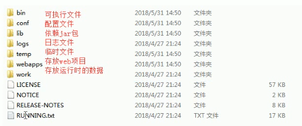

# 02.Tomcat基本操作

- 笔记本：03.Tomcat
- 创建时间：2020-01-27 16:49:33 UTC
- 更新时间：2020-01-27 17:21:25 UTC
- 印象笔记 GUID：fde124da-80c9-4d6a-9e37-0603a44c8bec

Tomcat：web服务器软件

1. 下载：http://tomcat.apache.org/

1. 安装：解压即可

  - 注意：安装目录建议不要有中文

1. 卸载：删除目录即可

1. 启动：

  - bin目录下startup.bat 双击启动

  - 访问：浏览器访问 http://127.0.0.1:8080

  - 可能遇到的问题：

    1. 黑窗口一闪而过

      - 原因：没有配置JAVA_HOME环境变量

      - 解决方案：正确配置JAVA_HOME环境变量

    1. 启动报错

      1. 暴力：找到占用的端口号，并且找到对应的进程，杀死该进程

        - netstat -ano

      1. 温柔：修改自身的端口号

        - conf/server.xml

        - 一般会将tomcat的默认端口号修改为80，80端口号是http协议的默认端口号。

          - 好处：在访问时，就不用输入端口号

1. 关闭：

  1. 正常关机

    - bin/shutdown.bat

    - ctrl + c

  1. 强制关机

    - 点击启动窗口的 x

1. 配置

  - 部署项目的方式：

    1. 直接将项目放到 webapps 目录即可

      - /hello 项目的访问路径 --> 虚拟路径

      - 简化部署：将项目打成一个war包，再将war包放置到webapps目录下。

        - war包会自动解压缩

    1. 配置 conf/server.xml 文件
 在<Host>标签体中配置
 `<Context docBase="D:\hello" path="/hehe" />`

      - docBase：项目存放的路径

      - path：虚拟目录

    1. 在conf/Catalina/localhost 中创建任意名称的xml 文件。在文件中编写（热部署，推荐）
 `<Context docBase="D:\hello"/>`

      - 虚拟目录：xml文件的名称

  - 静态项目和动态项目

    - 目录结构

      - java 动态项目的目录结构：

        - 项目的根目录

          - WEB-INF 目录

            - web.xml：web项目的核心配置文件

            - classes目录：放置字节码文件的目录

            - lib目录：放置依赖的jar包

  - 将tomcat集成到IDEA中，并且创建JavaEE项目，部署项目

**Tomcat 目录结构：**
 

Tomcat%EF%BC%9Aweb%E6%9C%8D%E5%8A%A1%E5%99%A8%E8%BD%AF%E4%BB%B6%0A1.%20%E4%B8%8B%E8%BD%BD%EF%BC%9Ahttp%3A%2F%2Ftomcat.apache.org%2F%0A2.%20%E5%AE%89%E8%A3%85%EF%BC%9A%E8%A7%A3%E5%8E%8B%E5%8D%B3%E5%8F%AF%0A%20%20%20%20*%20%E6%B3%A8%E6%84%8F%EF%BC%9A%E5%AE%89%E8%A3%85%E7%9B%AE%E5%BD%95%E5%BB%BA%E8%AE%AE%E4%B8%8D%E8%A6%81%E6%9C%89%E4%B8%AD%E6%96%87%0A3.%20%E5%8D%B8%E8%BD%BD%EF%BC%9A%E5%88%A0%E9%99%A4%E7%9B%AE%E5%BD%95%E5%8D%B3%E5%8F%AF%0A4.%20%E5%90%AF%E5%8A%A8%EF%BC%9A%0A%20%20%20%20*%20bin%E7%9B%AE%E5%BD%95%E4%B8%8Bstartup.bat%20%E5%8F%8C%E5%87%BB%E5%90%AF%E5%8A%A8%20%0A%20%20%20%20*%20%E8%AE%BF%E9%97%AE%EF%BC%9A%E6%B5%8F%E8%A7%88%E5%99%A8%E8%AE%BF%E9%97%AE%20http%3A%2F%2F127.0.0.1%3A8080%0A%20%20%20%20*%20%E5%8F%AF%E8%83%BD%E9%81%87%E5%88%B0%E7%9A%84%E9%97%AE%E9%A2%98%EF%BC%9A%0A%20%20%20%20%20%20%20%201.%20%20%E9%BB%91%E7%AA%97%E5%8F%A3%E4%B8%80%E9%97%AA%E8%80%8C%E8%BF%87%0A%20%20%20%20%20%20%20%20%20%20%20%20*%20%E5%8E%9F%E5%9B%A0%EF%BC%9A%E6%B2%A1%E6%9C%89%E9%85%8D%E7%BD%AEJAVA_HOME%E7%8E%AF%E5%A2%83%E5%8F%98%E9%87%8F%0A%20%20%20%20%20%20%20%20%20%20%20%20*%20%E8%A7%A3%E5%86%B3%E6%96%B9%E6%A1%88%EF%BC%9A%E6%AD%A3%E7%A1%AE%E9%85%8D%E7%BD%AEJAVA_HOME%E7%8E%AF%E5%A2%83%E5%8F%98%E9%87%8F%0A%20%20%20%20%20%20%20%202.%20%E5%90%AF%E5%8A%A8%E6%8A%A5%E9%94%99%0A%20%20%20%20%20%20%20%20%20%20%20%201.%20%E6%9A%B4%E5%8A%9B%EF%BC%9A%E6%89%BE%E5%88%B0%E5%8D%A0%E7%94%A8%E7%9A%84%E7%AB%AF%E5%8F%A3%E5%8F%B7%EF%BC%8C%E5%B9%B6%E4%B8%94%E6%89%BE%E5%88%B0%E5%AF%B9%E5%BA%94%E7%9A%84%E8%BF%9B%E7%A8%8B%EF%BC%8C%E6%9D%80%E6%AD%BB%E8%AF%A5%E8%BF%9B%E7%A8%8B%0A%20%20%20%20%20%20%20%20%20%20%20%20%20%20%20%20*%20netstat%20-ano%0A%20%20%20%20%20%20%20%20%20%20%20%202.%20%E6%B8%A9%E6%9F%94%EF%BC%9A%E4%BF%AE%E6%94%B9%E8%87%AA%E8%BA%AB%E7%9A%84%E7%AB%AF%E5%8F%A3%E5%8F%B7%0A%20%20%20%20%20%20%20%20%20%20%20%20%20%20%20%20*%20conf%2Fserver.xml%0A%20%20%20%20%20%20%20%20%20%20%20%20%20%20%20%20*%20%E4%B8%80%E8%88%AC%E4%BC%9A%E5%B0%86tomcat%E7%9A%84%E9%BB%98%E8%AE%A4%E7%AB%AF%E5%8F%A3%E5%8F%B7%E4%BF%AE%E6%94%B9%E4%B8%BA80%EF%BC%8C80%E7%AB%AF%E5%8F%A3%E5%8F%B7%E6%98%AFhttp%E5%8D%8F%E8%AE%AE%E7%9A%84%E9%BB%98%E8%AE%A4%E7%AB%AF%E5%8F%A3%E5%8F%B7%E3%80%82%0A%20%20%20%20%20%20%20%20%20%20%20%20%20%20%20%20%20%20%20%20*%20%E5%A5%BD%E5%A4%84%EF%BC%9A%E5%9C%A8%E8%AE%BF%E9%97%AE%E6%97%B6%EF%BC%8C%E5%B0%B1%E4%B8%8D%E7%94%A8%E8%BE%93%E5%85%A5%E7%AB%AF%E5%8F%A3%E5%8F%B7%0A5.%20%E5%85%B3%E9%97%AD%EF%BC%9A%0A%20%20%20%201.%20%E6%AD%A3%E5%B8%B8%E5%85%B3%E6%9C%BA%0A%20%20%20%20%20%20%20%20*%20bin%2Fshutdown.bat%0A%20%20%20%20%20%20%20%20*%20ctrl%20%2B%20c%0A%20%20%20%202.%20%E5%BC%BA%E5%88%B6%E5%85%B3%E6%9C%BA%0A%20%20%20%20%20%20%20%20*%20%E7%82%B9%E5%87%BB%E5%90%AF%E5%8A%A8%E7%AA%97%E5%8F%A3%E7%9A%84%20x%0A6.%20%E9%85%8D%E7%BD%AE%0A%20%20%20%20*%20%E9%83%A8%E7%BD%B2%E9%A1%B9%E7%9B%AE%E7%9A%84%E6%96%B9%E5%BC%8F%EF%BC%9A%0A%20%20%20%20%20%20%20%201.%20%E7%9B%B4%E6%8E%A5%E5%B0%86%E9%A1%B9%E7%9B%AE%E6%94%BE%E5%88%B0%20webapps%20%E7%9B%AE%E5%BD%95%E5%8D%B3%E5%8F%AF%0A%20%20%20%20%20%20%20%20%20%20%20%20*%20%2Fhello%20%E9%A1%B9%E7%9B%AE%E7%9A%84%E8%AE%BF%E9%97%AE%E8%B7%AF%E5%BE%84%20--%3E%20%E8%99%9A%E6%8B%9F%E8%B7%AF%E5%BE%84%0A%20%20%20%20%20%20%20%20%20%20%20%20*%20%E7%AE%80%E5%8C%96%E9%83%A8%E7%BD%B2%EF%BC%9A%E5%B0%86%E9%A1%B9%E7%9B%AE%E6%89%93%E6%88%90%E4%B8%80%E4%B8%AAwar%E5%8C%85%EF%BC%8C%E5%86%8D%E5%B0%86war%E5%8C%85%E6%94%BE%E7%BD%AE%E5%88%B0webapps%E7%9B%AE%E5%BD%95%E4%B8%8B%E3%80%82%0A%20%20%20%20%20%20%20%20%20%20%20%20%20%20%20%20*%20war%E5%8C%85%E4%BC%9A%E8%87%AA%E5%8A%A8%E8%A7%A3%E5%8E%8B%E7%BC%A9%0A%20%20%20%20%20%20%20%202.%20%E9%85%8D%E7%BD%AE%20conf%2Fserver.xml%20%E6%96%87%E4%BB%B6%0A%20%20%20%20%20%20%20%20%20%20%20%20%E5%9C%A8%3CHost%3E%E6%A0%87%E7%AD%BE%E4%BD%93%E4%B8%AD%E9%85%8D%E7%BD%AE%0A%20%20%20%20%20%20%20%20%20%20%20%20%60%3CContext%20docBase%3D%22D%3A%5Chello%22%20path%3D%22%2Fhehe%22%20%2F%3E%60%0A%20%20%20%20%20%20%20%20%20%20%20%20*%20docBase%EF%BC%9A%E9%A1%B9%E7%9B%AE%E5%AD%98%E6%94%BE%E7%9A%84%E8%B7%AF%E5%BE%84%0A%20%20%20%20%20%20%20%20%20%20%20%20*%20path%EF%BC%9A%E8%99%9A%E6%8B%9F%E7%9B%AE%E5%BD%95%0A%20%20%20%20%20%20%20%203.%20%E5%9C%A8conf%2FCatalina%2Flocalhost%20%E4%B8%AD%E5%88%9B%E5%BB%BA%E4%BB%BB%E6%84%8F%E5%90%8D%E7%A7%B0%E7%9A%84xml%20%E6%96%87%E4%BB%B6%E3%80%82%E5%9C%A8%E6%96%87%E4%BB%B6%E4%B8%AD%E7%BC%96%E5%86%99%EF%BC%88%E7%83%AD%E9%83%A8%E7%BD%B2%EF%BC%8C%E6%8E%A8%E8%8D%90%EF%BC%89%0A%20%20%20%20%20%20%20%20%20%20%20%20%60%3CContext%20docBase%3D%22D%3A%5Chello%22%2F%3E%60%0A%20%20%20%20%20%20%20%20%20%20%20%20*%20%E8%99%9A%E6%8B%9F%E7%9B%AE%E5%BD%95%EF%BC%9Axml%E6%96%87%E4%BB%B6%E7%9A%84%E5%90%8D%E7%A7%B0%0A%20%20%20%20*%20%E9%9D%99%E6%80%81%E9%A1%B9%E7%9B%AE%E5%92%8C%E5%8A%A8%E6%80%81%E9%A1%B9%E7%9B%AE%0A%20%20%20%20%20%20%20%20*%20%E7%9B%AE%E5%BD%95%E7%BB%93%E6%9E%84%0A%20%20%20%20%20%20%20%20%20%20%20%20*%20java%20%E5%8A%A8%E6%80%81%E9%A1%B9%E7%9B%AE%E7%9A%84%E7%9B%AE%E5%BD%95%E7%BB%93%E6%9E%84%EF%BC%9A%0A%20%20%20%20%20%20%20%20%20%20%20%20%20%20%20%20-%20%E9%A1%B9%E7%9B%AE%E7%9A%84%E6%A0%B9%E7%9B%AE%E5%BD%95%0A%20%20%20%20%20%20%20%20%20%20%20%20%20%20%20%20%20%20%20%20-%20WEB-INF%20%E7%9B%AE%E5%BD%95%0A%20%20%20%20%20%20%20%20%20%20%20%20%20%20%20%20%20%20%20%20%20%20%20%20-%20web.xml%EF%BC%9Aweb%E9%A1%B9%E7%9B%AE%E7%9A%84%E6%A0%B8%E5%BF%83%E9%85%8D%E7%BD%AE%E6%96%87%E4%BB%B6%0A%20%20%20%20%20%20%20%20%20%20%20%20%20%20%20%20%20%20%20%20%20%20%20%20-%20classes%E7%9B%AE%E5%BD%95%EF%BC%9A%E6%94%BE%E7%BD%AE%E5%AD%97%E8%8A%82%E7%A0%81%E6%96%87%E4%BB%B6%E7%9A%84%E7%9B%AE%E5%BD%95%0A%20%20%20%20%20%20%20%20%20%20%20%20%20%20%20%20%20%20%20%20%20%20%20%20-%20lib%E7%9B%AE%E5%BD%95%EF%BC%9A%E6%94%BE%E7%BD%AE%E4%BE%9D%E8%B5%96%E7%9A%84jar%E5%8C%85%0A%20%20%20%20*%20%E5%B0%86tomcat%E9%9B%86%E6%88%90%E5%88%B0IDEA%E4%B8%AD%EF%BC%8C%E5%B9%B6%E4%B8%94%E5%88%9B%E5%BB%BAJavaEE%E9%A1%B9%E7%9B%AE%EF%BC%8C%E9%83%A8%E7%BD%B2%E9%A1%B9%E7%9B%AE%0A%20%20%20%20%0A%0A**Tomcat%20%E7%9B%AE%E5%BD%95%E7%BB%93%E6%9E%84%EF%BC%9A**%0A!%5B0c4e1d573dbc02fc9e0e1c7425ac76f1.png%5D(en-resource%3A%2F%2Fdatabase%2F1178%3A0)%0A
