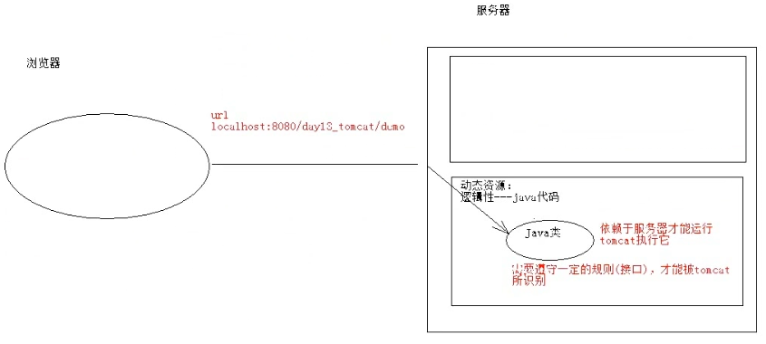
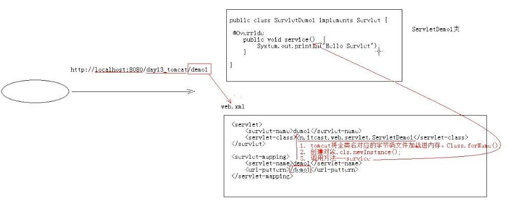

# 01.Servlet概述

- 笔记本：04.Servlet
- 创建时间：2020-01-28 10:55:48 UTC
- 更新时间：2020-01-28 11:13:19 UTC
- 印象笔记 GUID：57dfe8e7-54cf-4885-8e6a-1d189e1eaa3a

#### Servlet: server applet

- 概念：运行在服务器端的小程序

  - Servlet 就是一个接口，定义了Java 类被浏览器访问到（tomcat识别)的规则。

  - 将来我们自定义一个类，实现Servlet 接口，复写方法。
 

- 快速入门：

  1. 创建JavaEE 项目

  1. 定义一个类，实现Servlet 接口

    - public class ServletDemo implements Servlet

  1. 实现接口中的抽象方法

  1. 配置 Servlet

**Servlet 入门案例**

```
public class ServletDemo implements Servlet {
    @Override
    public void init(ServletConfig servletConfig) throws ServletException {
    }

    @Override
    public ServletConfig getServletConfig() {
    }

    // 提供服务的方法
    @Override
    public void service(ServletRequest servletRequest, ServletResponse servletResponse) throws ServletExcetion {
        System.out.println("Hello Servlet");
    }

    @Override
    public String getServletInfo() {
        retrun null;
    }

    @Override
    public void destory() {
    }
}

```

```
<!-- web.xml -->
<!-- 配置Servlet -->
<servlet>
    <servlet-name>demo</servlet-name>
    <servlet-class>cn.liudezhi.web.servlet.ServletDemo</servlet-class>
</servlet>
<servlet-mapping>
    <servlet-name>demo</servlet-name>
    <url-pattern>/demo</url-pattern>
</servlet-mapping>

```

- 执行原理：

  1. 当服务器接受到客户端浏览器的请求后，会解析请求URL路径，获取访问的Servlet的资源路径

  1. 查找web.xml 文件，是否有对应的<url-pattern>标签体内容。

  1. 如果有，则在找到对应的<servlet-class>全类名

  1. tomcat 会将字节码文件加载进内存，并且创建其对象。

  1. 调用其方法。



%23%23%23%23%20Servlet%3A%20server%20applet%0A*%20%E6%A6%82%E5%BF%B5%EF%BC%9A%E8%BF%90%E8%A1%8C%E5%9C%A8%E6%9C%8D%E5%8A%A1%E5%99%A8%E7%AB%AF%E7%9A%84%E5%B0%8F%E7%A8%8B%E5%BA%8F%0A%20%20%20%20*%20Servlet%20%E5%B0%B1%E6%98%AF%E4%B8%80%E4%B8%AA%E6%8E%A5%E5%8F%A3%EF%BC%8C%E5%AE%9A%E4%B9%89%E4%BA%86Java%20%E7%B1%BB%E8%A2%AB%E6%B5%8F%E8%A7%88%E5%99%A8%E8%AE%BF%E9%97%AE%E5%88%B0%EF%BC%88tomcat%E8%AF%86%E5%88%AB)%E7%9A%84%E8%A7%84%E5%88%99%E3%80%82%0A%20%20%20%20*%20%E5%B0%86%E6%9D%A5%E6%88%91%E4%BB%AC%E8%87%AA%E5%AE%9A%E4%B9%89%E4%B8%80%E4%B8%AA%E7%B1%BB%EF%BC%8C%E5%AE%9E%E7%8E%B0Servlet%20%E6%8E%A5%E5%8F%A3%EF%BC%8C%E5%A4%8D%E5%86%99%E6%96%B9%E6%B3%95%E3%80%82%0A!%5B7e0426b6b0e8576ad45a6a116a9d4142.png%5D(en-resource%3A%2F%2Fdatabase%2F1184%3A0)%0A*%20%E5%BF%AB%E9%80%9F%E5%85%A5%E9%97%A8%EF%BC%9A%0A%20%20%20%201.%20%E5%88%9B%E5%BB%BAJavaEE%20%E9%A1%B9%E7%9B%AE%0A%20%20%20%202.%20%E5%AE%9A%E4%B9%89%E4%B8%80%E4%B8%AA%E7%B1%BB%EF%BC%8C%E5%AE%9E%E7%8E%B0Servlet%20%E6%8E%A5%E5%8F%A3%0A%20%20%20%20%20%20%20%20*%20public%20class%20ServletDemo%20implements%20Servlet%0A%20%20%20%203.%20%E5%AE%9E%E7%8E%B0%E6%8E%A5%E5%8F%A3%E4%B8%AD%E7%9A%84%E6%8A%BD%E8%B1%A1%E6%96%B9%E6%B3%95%0A%20%20%20%204.%20%E9%85%8D%E7%BD%AE%20Servlet%0A%0A**Servlet%20%E5%85%A5%E9%97%A8%E6%A1%88%E4%BE%8B**%0A%60%60%60java%0Apublic%20class%20ServletDemo%20implements%20Servlet%20%7B%0A%20%20%20%20%40Override%0A%20%20%20%20public%20void%20init(ServletConfig%20servletConfig)%20throws%20ServletException%20%7B%0A%20%20%20%20%7D%0A%20%20%20%20%0A%20%20%20%20%40Override%0A%20%20%20%20public%20ServletConfig%20getServletConfig()%20%7B%0A%20%20%20%20%7D%0A%20%20%20%20%0A%20%20%20%20%2F%2F%20%E6%8F%90%E4%BE%9B%E6%9C%8D%E5%8A%A1%E7%9A%84%E6%96%B9%E6%B3%95%0A%20%20%20%20%40Override%0A%20%20%20%20public%20void%20service(ServletRequest%20servletRequest%2C%20ServletResponse%20servletResponse)%20throws%20ServletExcetion%20%7B%0A%20%20%20%20%20%20%20%20System.out.println(%22Hello%20Servlet%22)%3B%0A%20%20%20%20%7D%0A%20%20%20%20%0A%20%20%20%20%40Override%0A%20%20%20%20public%20String%20getServletInfo()%20%7B%0A%20%20%20%20%20%20%20%20retrun%20null%3B%0A%20%20%20%20%7D%0A%20%20%20%20%0A%20%20%20%20%40Override%0A%20%20%20%20public%20void%20destory()%20%7B%0A%20%20%20%20%7D%0A%7D%0A%60%60%60%0A%0A%60%60%60xml%0A%3C!--%20web.xml%20--%3E%0A%3C!--%20%E9%85%8D%E7%BD%AEServlet%20--%3E%0A%3Cservlet%3E%0A%20%20%20%20%3Cservlet-name%3Edemo%3C%2Fservlet-name%3E%0A%20%20%20%20%3Cservlet-class%3Ecn.liudezhi.web.servlet.ServletDemo%3C%2Fservlet-class%3E%0A%3C%2Fservlet%3E%0A%3Cservlet-mapping%3E%0A%20%20%20%20%3Cservlet-name%3Edemo%3C%2Fservlet-name%3E%0A%20%20%20%20%3Curl-pattern%3E%2Fdemo%3C%2Furl-pattern%3E%0A%3C%2Fservlet-mapping%3E%0A%60%60%60%0A%0A*%20%E6%89%A7%E8%A1%8C%E5%8E%9F%E7%90%86%EF%BC%9A%0A%20%20%20%201.%20%E5%BD%93%E6%9C%8D%E5%8A%A1%E5%99%A8%E6%8E%A5%E5%8F%97%E5%88%B0%E5%AE%A2%E6%88%B7%E7%AB%AF%E6%B5%8F%E8%A7%88%E5%99%A8%E7%9A%84%E8%AF%B7%E6%B1%82%E5%90%8E%EF%BC%8C%E4%BC%9A%E8%A7%A3%E6%9E%90%E8%AF%B7%E6%B1%82URL%E8%B7%AF%E5%BE%84%EF%BC%8C%E8%8E%B7%E5%8F%96%E8%AE%BF%E9%97%AE%E7%9A%84Servlet%E7%9A%84%E8%B5%84%E6%BA%90%E8%B7%AF%E5%BE%84%0A%20%20%20%202.%20%E6%9F%A5%E6%89%BEweb.xml%20%E6%96%87%E4%BB%B6%EF%BC%8C%E6%98%AF%E5%90%A6%E6%9C%89%E5%AF%B9%E5%BA%94%E7%9A%84%3Curl-pattern%3E%E6%A0%87%E7%AD%BE%E4%BD%93%E5%86%85%E5%AE%B9%E3%80%82%0A%20%20%20%203.%20%E5%A6%82%E6%9E%9C%E6%9C%89%EF%BC%8C%E5%88%99%E5%9C%A8%E6%89%BE%E5%88%B0%E5%AF%B9%E5%BA%94%E7%9A%84%3Cservlet-class%3E%E5%85%A8%E7%B1%BB%E5%90%8D%0A%20%20%20%204.%20tomcat%20%E4%BC%9A%E5%B0%86%E5%AD%97%E8%8A%82%E7%A0%81%E6%96%87%E4%BB%B6%E5%8A%A0%E8%BD%BD%E8%BF%9B%E5%86%85%E5%AD%98%EF%BC%8C%E5%B9%B6%E4%B8%94%E5%88%9B%E5%BB%BA%E5%85%B6%E5%AF%B9%E8%B1%A1%E3%80%82%0A%20%20%20%205.%20%E8%B0%83%E7%94%A8%E5%85%B6%E6%96%B9%E6%B3%95%E3%80%82%0A%0A!%5B3fb8ddcaa1a3bf506030b38781b818c4.png%5D(en-resource%3A%2F%2Fdatabase%2F1186%3A0)%0A
