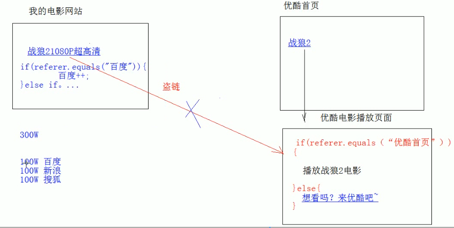

# 01.HTTP请求协议

- 笔记本：05.HTTP协议
- 创建时间：2020-01-29 14:59:13 UTC
- 更新时间：2020-01-29 15:30:50 UTC
- 印象笔记 GUID：4017e5b4-812a-4535-a9be-26c5a9cc1e56

#### HTTP

-
概念：Hyper Text Transfer Protocol 超文本传输协议

  - 传输协议：定义了客户端和服务器端通信时，发送数据的格式

  - 特点：

    1. 基于TCP/IP 的高级协议

    1. 默认端口号：80

    1. 基于请求相应模型的，一次请求对应一次响应

    1. 无状态的：每次请求之前相互独立，不能交互数据

  - 历史版本：

    - 1.0：每一次请求响应都会建立新的连接

    - 1.1：复用连接（对缓存的支持比较好...）

-
请求消息数据格式

  1. 请求行
 请求方式 请求url 请求协议/版本
 GET /login.html HTTP/1.1

    - 请求方式：

      - HTTP 协议中有7种请求方式，常用的有两种

        - GET：

          1. 请求参数在请求行中，在url后

          1. 请求的url 长度是有限制的

          1. 不太安全（请求的数据在地址栏可以看到）

        - POST：

          1. 请求参数在请求体中

          1. 请求的url长度没有限制

          1. 相对安全

  1. 请求头：客户端浏览器告诉服务器一些信息
 请求头名称：请求头值

    - 常见的请求头：

      1. User-Agent：浏览器告诉服务器，我访问你使用的浏览器版本信息

        - 可以在服务器端获取该头的信息，解决浏览器的兼容性问题

      1. Referer：http://localhost/login.html

        - 告诉服务器，我（当前请求）从哪里来

          - 作用：

            1. 防盗链：

            1. 统计工作：
 

  1. 请求空行

    - 空行，就是用于分割POST 请求的请求头和请求体的

  1. 请求体（正文）

    - 封装POST请求消息的请求参数

-
响应消息数据格式

%23%23%23%23%20HTTP%0A*%20%E6%A6%82%E5%BF%B5%EF%BC%9AHyper%20Text%20Transfer%20Protocol%20%E8%B6%85%E6%96%87%E6%9C%AC%E4%BC%A0%E8%BE%93%E5%8D%8F%E8%AE%AE%0A%20%20%20%20*%20%E4%BC%A0%E8%BE%93%E5%8D%8F%E8%AE%AE%EF%BC%9A%E5%AE%9A%E4%B9%89%E4%BA%86%E5%AE%A2%E6%88%B7%E7%AB%AF%E5%92%8C%E6%9C%8D%E5%8A%A1%E5%99%A8%E7%AB%AF%E9%80%9A%E4%BF%A1%E6%97%B6%EF%BC%8C%E5%8F%91%E9%80%81%E6%95%B0%E6%8D%AE%E7%9A%84%E6%A0%BC%E5%BC%8F%0A%20%20%20%20*%20%E7%89%B9%E7%82%B9%EF%BC%9A%0A%20%20%20%20%20%20%20%201.%20%E5%9F%BA%E4%BA%8ETCP%2FIP%20%E7%9A%84%E9%AB%98%E7%BA%A7%E5%8D%8F%E8%AE%AE%0A%20%20%20%20%20%20%20%202.%20%E9%BB%98%E8%AE%A4%E7%AB%AF%E5%8F%A3%E5%8F%B7%EF%BC%9A80%0A%20%20%20%20%20%20%20%203.%20%E5%9F%BA%E4%BA%8E%E8%AF%B7%E6%B1%82%E7%9B%B8%E5%BA%94%E6%A8%A1%E5%9E%8B%E7%9A%84%EF%BC%8C%E4%B8%80%E6%AC%A1%E8%AF%B7%E6%B1%82%E5%AF%B9%E5%BA%94%E4%B8%80%E6%AC%A1%E5%93%8D%E5%BA%94%0A%20%20%20%20%20%20%20%204.%20%E6%97%A0%E7%8A%B6%E6%80%81%E7%9A%84%EF%BC%9A%E6%AF%8F%E6%AC%A1%E8%AF%B7%E6%B1%82%E4%B9%8B%E5%89%8D%E7%9B%B8%E4%BA%92%E7%8B%AC%E7%AB%8B%EF%BC%8C%E4%B8%8D%E8%83%BD%E4%BA%A4%E4%BA%92%E6%95%B0%E6%8D%AE%0A%20%20%20%20*%20%E5%8E%86%E5%8F%B2%E7%89%88%E6%9C%AC%EF%BC%9A%0A%20%20%20%20%20%20%20%20*%201.0%EF%BC%9A%E6%AF%8F%E4%B8%80%E6%AC%A1%E8%AF%B7%E6%B1%82%E5%93%8D%E5%BA%94%E9%83%BD%E4%BC%9A%E5%BB%BA%E7%AB%8B%E6%96%B0%E7%9A%84%E8%BF%9E%E6%8E%A5%0A%20%20%20%20%20%20%20%20*%201.1%EF%BC%9A%E5%A4%8D%E7%94%A8%E8%BF%9E%E6%8E%A5%EF%BC%88%E5%AF%B9%E7%BC%93%E5%AD%98%E7%9A%84%E6%94%AF%E6%8C%81%E6%AF%94%E8%BE%83%E5%A5%BD...%EF%BC%89%0A%0A*%20%E8%AF%B7%E6%B1%82%E6%B6%88%E6%81%AF%E6%95%B0%E6%8D%AE%E6%A0%BC%E5%BC%8F%0A%20%20%20%201.%20%E8%AF%B7%E6%B1%82%E8%A1%8C%0A%20%20%20%20%20%20%20%20%E8%AF%B7%E6%B1%82%E6%96%B9%E5%BC%8F%20%E8%AF%B7%E6%B1%82url%20%E8%AF%B7%E6%B1%82%E5%8D%8F%E8%AE%AE%2F%E7%89%88%E6%9C%AC%0A%20%20%20%20%20%20%20%20GET%20%2Flogin.html%20HTTP%2F1.1%0A%20%20%20%20%20%20%20%20*%20%E8%AF%B7%E6%B1%82%E6%96%B9%E5%BC%8F%EF%BC%9A%0A%20%20%20%20%20%20%20%20%20%20%20%20*%20HTTP%20%E5%8D%8F%E8%AE%AE%E4%B8%AD%E6%9C%897%E7%A7%8D%E8%AF%B7%E6%B1%82%E6%96%B9%E5%BC%8F%EF%BC%8C%E5%B8%B8%E7%94%A8%E7%9A%84%E6%9C%89%E4%B8%A4%E7%A7%8D%0A%20%20%20%20%20%20%20%20%20%20%20%20%20%20%20%20*%20GET%EF%BC%9A%0A%20%20%20%20%20%20%20%20%20%20%20%20%20%20%20%20%20%20%20%201.%20%E8%AF%B7%E6%B1%82%E5%8F%82%E6%95%B0%E5%9C%A8%E8%AF%B7%E6%B1%82%E8%A1%8C%E4%B8%AD%EF%BC%8C%E5%9C%A8url%E5%90%8E%0A%20%20%20%20%20%20%20%20%20%20%20%20%20%20%20%20%20%20%20%202.%20%E8%AF%B7%E6%B1%82%E7%9A%84url%20%E9%95%BF%E5%BA%A6%E6%98%AF%E6%9C%89%E9%99%90%E5%88%B6%E7%9A%84%0A%20%20%20%20%20%20%20%20%20%20%20%20%20%20%20%20%20%20%20%203.%20%E4%B8%8D%E5%A4%AA%E5%AE%89%E5%85%A8%EF%BC%88%E8%AF%B7%E6%B1%82%E7%9A%84%E6%95%B0%E6%8D%AE%E5%9C%A8%E5%9C%B0%E5%9D%80%E6%A0%8F%E5%8F%AF%E4%BB%A5%E7%9C%8B%E5%88%B0%EF%BC%89%0A%20%20%20%20%20%20%20%20%20%20%20%20%20%20%20%20*%20POST%EF%BC%9A%0A%20%20%20%20%20%20%20%20%20%20%20%20%20%20%20%20%20%20%20%201.%20%E8%AF%B7%E6%B1%82%E5%8F%82%E6%95%B0%E5%9C%A8%E8%AF%B7%E6%B1%82%E4%BD%93%E4%B8%AD%0A%20%20%20%20%20%20%20%20%20%20%20%20%20%20%20%20%20%20%20%202.%20%E8%AF%B7%E6%B1%82%E7%9A%84url%E9%95%BF%E5%BA%A6%E6%B2%A1%E6%9C%89%E9%99%90%E5%88%B6%0A%20%20%20%20%20%20%20%20%20%20%20%20%20%20%20%20%20%20%20%203.%20%E7%9B%B8%E5%AF%B9%E5%AE%89%E5%85%A8%0A%20%20%20%202.%20%E8%AF%B7%E6%B1%82%E5%A4%B4%EF%BC%9A%E5%AE%A2%E6%88%B7%E7%AB%AF%E6%B5%8F%E8%A7%88%E5%99%A8%E5%91%8A%E8%AF%89%E6%9C%8D%E5%8A%A1%E5%99%A8%E4%B8%80%E4%BA%9B%E4%BF%A1%E6%81%AF%0A%20%20%20%20%20%20%20%20%E8%AF%B7%E6%B1%82%E5%A4%B4%E5%90%8D%E7%A7%B0%EF%BC%9A%E8%AF%B7%E6%B1%82%E5%A4%B4%E5%80%BC%0A%20%20%20%20%20%20%20%20*%20%E5%B8%B8%E8%A7%81%E7%9A%84%E8%AF%B7%E6%B1%82%E5%A4%B4%EF%BC%9A%0A%20%20%20%20%20%20%20%20%20%20%20%201.%20User-Agent%EF%BC%9A%E6%B5%8F%E8%A7%88%E5%99%A8%E5%91%8A%E8%AF%89%E6%9C%8D%E5%8A%A1%E5%99%A8%EF%BC%8C%E6%88%91%E8%AE%BF%E9%97%AE%E4%BD%A0%E4%BD%BF%E7%94%A8%E7%9A%84%E6%B5%8F%E8%A7%88%E5%99%A8%E7%89%88%E6%9C%AC%E4%BF%A1%E6%81%AF%0A%20%20%20%20%20%20%20%20%20%20%20%20%20%20%20%20*%20%E5%8F%AF%E4%BB%A5%E5%9C%A8%E6%9C%8D%E5%8A%A1%E5%99%A8%E7%AB%AF%E8%8E%B7%E5%8F%96%E8%AF%A5%E5%A4%B4%E7%9A%84%E4%BF%A1%E6%81%AF%EF%BC%8C%E8%A7%A3%E5%86%B3%E6%B5%8F%E8%A7%88%E5%99%A8%E7%9A%84%E5%85%BC%E5%AE%B9%E6%80%A7%E9%97%AE%E9%A2%98%0A%20%20%20%20%20%20%20%20%20%20%20%202.%20Referer%EF%BC%9Ahttp%3A%2F%2Flocalhost%2Flogin.html%0A%20%20%20%20%20%20%20%20%20%20%20%20%20%20%20%20*%20%E5%91%8A%E8%AF%89%E6%9C%8D%E5%8A%A1%E5%99%A8%EF%BC%8C%E6%88%91%EF%BC%88%E5%BD%93%E5%89%8D%E8%AF%B7%E6%B1%82%EF%BC%89%E4%BB%8E%E5%93%AA%E9%87%8C%E6%9D%A5%0A%20%20%20%20%20%20%20%20%20%20%20%20%20%20%20%20%20%20%20%20*%20%E4%BD%9C%E7%94%A8%EF%BC%9A%0A%20%20%20%20%20%20%20%20%20%20%20%20%20%20%20%20%20%20%20%20%20%20%20%201.%20%E9%98%B2%E7%9B%97%E9%93%BE%EF%BC%9A%0A%20%20%20%20%20%20%20%20%20%20%20%20%20%20%20%20%20%20%20%20%20%20%20%202.%20%E7%BB%9F%E8%AE%A1%E5%B7%A5%E4%BD%9C%EF%BC%9A%0A%20%20%20%20%20%20%20%20%20%20%20%20%20%20%20%20%20%20%20%20!%5B582581c1b54f0e370dad7a3712659415.png%5D(en-resource%3A%2F%2Fdatabase%2F1202%3A0)%20%20%20%20%20%20%20%20%20%20%20%0A%20%20%20%203.%20%E8%AF%B7%E6%B1%82%E7%A9%BA%E8%A1%8C%0A%20%20%20%20%20%20%20%20*%20%E7%A9%BA%E8%A1%8C%EF%BC%8C%E5%B0%B1%E6%98%AF%E7%94%A8%E4%BA%8E%E5%88%86%E5%89%B2POST%20%E8%AF%B7%E6%B1%82%E7%9A%84%E8%AF%B7%E6%B1%82%E5%A4%B4%E5%92%8C%E8%AF%B7%E6%B1%82%E4%BD%93%E7%9A%84%0A%20%20%20%204.%20%E8%AF%B7%E6%B1%82%E4%BD%93%EF%BC%88%E6%AD%A3%E6%96%87%EF%BC%89%0A%20%20%20%20%20%20%20%20*%20%E5%B0%81%E8%A3%85POST%E8%AF%B7%E6%B1%82%E6%B6%88%E6%81%AF%E7%9A%84%E8%AF%B7%E6%B1%82%E5%8F%82%E6%95%B0%0A%20%20%20%20%20%20%20%20%0A*%20%E5%93%8D%E5%BA%94%E6%B6%88%E6%81%AF%E6%95%B0%E6%8D%AE%E6%A0%BC%E5%BC%8F
