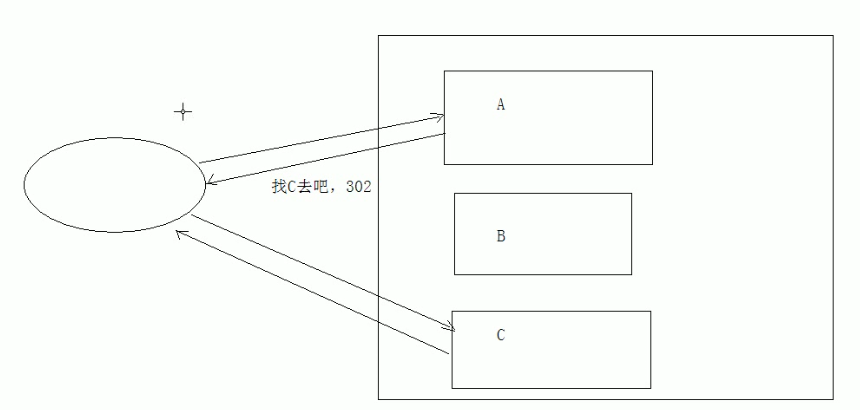

# 02.HTTP响应协议

- 笔记本：05.HTTP协议
- 创建时间：2020-01-30 15:08:35 UTC
- 更新时间：2020-01-30 15:31:25 UTC
- 原始链接：devtools://devtools/bundled/devtools_app.html?remoteBase=https://chrome-devtools-frontend.appspot.com/serve_file/@20c21f4010010f32462ea8e1d6af30cef66d48c8/&can_dock=true&dockSide=undocked
- 印象笔记 GUID：16c787a6-66e4-464e-b4ff-67885cee7863

1.
请求消息：客户端发送给服务器端的数据

  - 数据格式：

    1. 请求行

    1. 请求头

    1. 请求空行

    1. 请求体

1.
响应消息：服务器端发送给客户端的数据

  - 数据格式

    1. 响应行

      1. 组成：协议/版本 响应状态码 状态码描述

      1. 响应状态码：服务器告诉客户端浏览器本次请求和响应的状态

        1. 状态码都是3为数字

        1. 分类：

          1. 1xx：服务器接收客户端消息，但没有接受完成，等待一段时间后，发送1xx多状态码

          1. 2xx：成功。代表：200

          1. 3xx：重定向。代表：302（重定向），304（访问缓存）
 

          1. 4xx：客户端错误。

            - 代表：

              - 404：请求路径没有对应的资源

              - 405：请求方式没有对应的doXxx方法（eg：Servlet中没有写doGet，通过浏览器访问就会报405）

          1. 5xx：服务器端错误。代表：500（服务器内部出现异常）

    1. 响应头

      1. 格式：头名称：值

      1. 常见的响应头：

        1. Content-Type：服务器告诉客户端本次响应体数据格式以及编码格式

        1. Content-disposition：服务器告诉客户端以什么格式打开响应体数据

          - 值：

            - in-line：默认值，在当前页面内打开

            - attachment;filename=xxx：以附件形式打开响应体。文件下载

    1. 响应空行

    1. 响应体:

  - 响应字符串格式
 HTTP/1.1 200 OK
 Content-Type: text/html;charset=UTF-8
 Content-Length:101
 Date: Thu, 30 Jan 2020 15:11:43 GMT

<html>
 <head>
 ...
 </head>
 <body>
 ...
 </body>
 </html>

1.%20%E8%AF%B7%E6%B1%82%E6%B6%88%E6%81%AF%EF%BC%9A%E5%AE%A2%E6%88%B7%E7%AB%AF%E5%8F%91%E9%80%81%E7%BB%99%E6%9C%8D%E5%8A%A1%E5%99%A8%E7%AB%AF%E7%9A%84%E6%95%B0%E6%8D%AE%0A%20%20%20%20*%20%E6%95%B0%E6%8D%AE%E6%A0%BC%E5%BC%8F%EF%BC%9A%0A%20%20%20%20%20%20%20%201.%20%E8%AF%B7%E6%B1%82%E8%A1%8C%0A%20%20%20%20%20%20%20%202.%20%E8%AF%B7%E6%B1%82%E5%A4%B4%0A%20%20%20%20%20%20%20%203.%20%E8%AF%B7%E6%B1%82%E7%A9%BA%E8%A1%8C%0A%20%20%20%20%20%20%20%204.%20%E8%AF%B7%E6%B1%82%E4%BD%93%0A2.%20%E5%93%8D%E5%BA%94%E6%B6%88%E6%81%AF%EF%BC%9A%E6%9C%8D%E5%8A%A1%E5%99%A8%E7%AB%AF%E5%8F%91%E9%80%81%E7%BB%99%E5%AE%A2%E6%88%B7%E7%AB%AF%E7%9A%84%E6%95%B0%E6%8D%AE%0A%20%20%20%20*%20%E6%95%B0%E6%8D%AE%E6%A0%BC%E5%BC%8F%0A%20%20%20%20%20%20%20%201.%20%E5%93%8D%E5%BA%94%E8%A1%8C%0A%20%20%20%20%20%20%20%20%20%20%20%201.%20%E7%BB%84%E6%88%90%EF%BC%9A%E5%8D%8F%E8%AE%AE%2F%E7%89%88%E6%9C%AC%20%E5%93%8D%E5%BA%94%E7%8A%B6%E6%80%81%E7%A0%81%20%E7%8A%B6%E6%80%81%E7%A0%81%E6%8F%8F%E8%BF%B0%0A%20%20%20%20%20%20%20%20%20%20%20%202.%20%E5%93%8D%E5%BA%94%E7%8A%B6%E6%80%81%E7%A0%81%EF%BC%9A%E6%9C%8D%E5%8A%A1%E5%99%A8%E5%91%8A%E8%AF%89%E5%AE%A2%E6%88%B7%E7%AB%AF%E6%B5%8F%E8%A7%88%E5%99%A8%E6%9C%AC%E6%AC%A1%E8%AF%B7%E6%B1%82%E5%92%8C%E5%93%8D%E5%BA%94%E7%9A%84%E7%8A%B6%E6%80%81%0A%20%20%20%20%20%20%20%20%20%20%20%20%20%20%20%201.%20%E7%8A%B6%E6%80%81%E7%A0%81%E9%83%BD%E6%98%AF3%E4%B8%BA%E6%95%B0%E5%AD%97%0A%20%20%20%20%20%20%20%20%20%20%20%20%20%20%20%202.%20%E5%88%86%E7%B1%BB%EF%BC%9A%0A%20%20%20%20%20%20%20%20%20%20%20%20%20%20%20%20%20%20%20%201.%201xx%EF%BC%9A%E6%9C%8D%E5%8A%A1%E5%99%A8%E6%8E%A5%E6%94%B6%E5%AE%A2%E6%88%B7%E7%AB%AF%E6%B6%88%E6%81%AF%EF%BC%8C%E4%BD%86%E6%B2%A1%E6%9C%89%E6%8E%A5%E5%8F%97%E5%AE%8C%E6%88%90%EF%BC%8C%E7%AD%89%E5%BE%85%E4%B8%80%E6%AE%B5%E6%97%B6%E9%97%B4%E5%90%8E%EF%BC%8C%E5%8F%91%E9%80%811xx%E5%A4%9A%E7%8A%B6%E6%80%81%E7%A0%81%0A%20%20%20%20%20%20%20%20%20%20%20%20%20%20%20%20%20%20%20%202.%202xx%EF%BC%9A%E6%88%90%E5%8A%9F%E3%80%82%E4%BB%A3%E8%A1%A8%EF%BC%9A200%0A%20%20%20%20%20%20%20%20%20%20%20%20%20%20%20%20%20%20%20%203.%203xx%EF%BC%9A%E9%87%8D%E5%AE%9A%E5%90%91%E3%80%82%E4%BB%A3%E8%A1%A8%EF%BC%9A302%EF%BC%88%E9%87%8D%E5%AE%9A%E5%90%91%EF%BC%89%EF%BC%8C304%EF%BC%88%E8%AE%BF%E9%97%AE%E7%BC%93%E5%AD%98%EF%BC%89%0A%20%20%20%20%20%20%20%20%20%20%20%20%20%20%20%20%20%20%20%20!%5B353334ec9fc8e72eeb81ca92b1116e33.png%5D(en-resource%3A%2F%2Fdatabase%2F1232%3A0)%0A%20%20%20%20%20%20%20%20%20%20%20%20%20%20%20%20%20%20%20%204.%204xx%EF%BC%9A%E5%AE%A2%E6%88%B7%E7%AB%AF%E9%94%99%E8%AF%AF%E3%80%82%0A%20%20%20%20%20%20%20%20%20%20%20%20%20%20%20%20%20%20%20%20%20%20%20%20*%20%E4%BB%A3%E8%A1%A8%EF%BC%9A%0A%20%20%20%20%20%20%20%20%20%20%20%20%20%20%20%20%20%20%20%20%20%20%20%20%20%20%20%20*%20404%EF%BC%9A%E8%AF%B7%E6%B1%82%E8%B7%AF%E5%BE%84%E6%B2%A1%E6%9C%89%E5%AF%B9%E5%BA%94%E7%9A%84%E8%B5%84%E6%BA%90%0A%20%20%20%20%20%20%20%20%20%20%20%20%20%20%20%20%20%20%20%20%20%20%20%20%20%20%20%20*%20405%EF%BC%9A%E8%AF%B7%E6%B1%82%E6%96%B9%E5%BC%8F%E6%B2%A1%E6%9C%89%E5%AF%B9%E5%BA%94%E7%9A%84doXxx%E6%96%B9%E6%B3%95%EF%BC%88eg%EF%BC%9AServlet%E4%B8%AD%E6%B2%A1%E6%9C%89%E5%86%99doGet%EF%BC%8C%E9%80%9A%E8%BF%87%E6%B5%8F%E8%A7%88%E5%99%A8%E8%AE%BF%E9%97%AE%E5%B0%B1%E4%BC%9A%E6%8A%A5405%EF%BC%89%0A%20%20%20%20%20%20%20%20%20%20%20%20%20%20%20%20%20%20%20%205.%205xx%EF%BC%9A%E6%9C%8D%E5%8A%A1%E5%99%A8%E7%AB%AF%E9%94%99%E8%AF%AF%E3%80%82%E4%BB%A3%E8%A1%A8%EF%BC%9A500%EF%BC%88%E6%9C%8D%E5%8A%A1%E5%99%A8%E5%86%85%E9%83%A8%E5%87%BA%E7%8E%B0%E5%BC%82%E5%B8%B8%EF%BC%89%0A%20%20%20%20%20%20%20%202.%20%E5%93%8D%E5%BA%94%E5%A4%B4%0A%20%20%20%20%20%20%20%20%20%20%20%201.%20%E6%A0%BC%E5%BC%8F%EF%BC%9A%E5%A4%B4%E5%90%8D%E7%A7%B0%EF%BC%9A%E5%80%BC%0A%20%20%20%20%20%20%20%20%20%20%20%202.%20%E5%B8%B8%E8%A7%81%E7%9A%84%E5%93%8D%E5%BA%94%E5%A4%B4%EF%BC%9A%0A%20%20%20%20%20%20%20%20%20%20%20%20%20%20%20%201.%20Content-Type%EF%BC%9A%E6%9C%8D%E5%8A%A1%E5%99%A8%E5%91%8A%E8%AF%89%E5%AE%A2%E6%88%B7%E7%AB%AF%E6%9C%AC%E6%AC%A1%E5%93%8D%E5%BA%94%E4%BD%93%E6%95%B0%E6%8D%AE%E6%A0%BC%E5%BC%8F%E4%BB%A5%E5%8F%8A%E7%BC%96%E7%A0%81%E6%A0%BC%E5%BC%8F%0A%20%20%20%20%20%20%20%20%20%20%20%20%20%20%20%202.%20Content-disposition%EF%BC%9A%E6%9C%8D%E5%8A%A1%E5%99%A8%E5%91%8A%E8%AF%89%E5%AE%A2%E6%88%B7%E7%AB%AF%E4%BB%A5%E4%BB%80%E4%B9%88%E6%A0%BC%E5%BC%8F%E6%89%93%E5%BC%80%E5%93%8D%E5%BA%94%E4%BD%93%E6%95%B0%E6%8D%AE%0A%20%20%20%20%20%20%20%20%20%20%20%20%20%20%20%20%20%20%20%20*%20%E5%80%BC%EF%BC%9A%0A%20%20%20%20%20%20%20%20%20%20%20%20%20%20%20%20%20%20%20%20%20%20%20%20*%20in-line%EF%BC%9A%E9%BB%98%E8%AE%A4%E5%80%BC%EF%BC%8C%E5%9C%A8%E5%BD%93%E5%89%8D%E9%A1%B5%E9%9D%A2%E5%86%85%E6%89%93%E5%BC%80%0A%20%20%20%20%20%20%20%20%20%20%20%20%20%20%20%20%20%20%20%20%20%20%20%20*%20attachment%3Bfilename%3Dxxx%EF%BC%9A%E4%BB%A5%E9%99%84%E4%BB%B6%E5%BD%A2%E5%BC%8F%E6%89%93%E5%BC%80%E5%93%8D%E5%BA%94%E4%BD%93%E3%80%82%E6%96%87%E4%BB%B6%E4%B8%8B%E8%BD%BD%0A%20%20%20%20%20%20%20%203.%20%E5%93%8D%E5%BA%94%E7%A9%BA%E8%A1%8C%0A%20%20%20%20%20%20%20%204.%20%E5%93%8D%E5%BA%94%E4%BD%93%EF%BC%9A%E4%BC%A0%E8%BE%93%E7%9A%84%E6%95%B0%E6%8D%AE%0A%20%20%20%20*%20%E5%93%8D%E5%BA%94%E5%AD%97%E7%AC%A6%E4%B8%B2%E6%A0%BC%E5%BC%8F%20%20%20%20%0A%20%20%20%20HTTP%2F1.1%20200%20OK%0A%20%20%20%20Content-Type%3A%20text%2Fhtml%3Bcharset%3DUTF-8%0A%20%20%20%20Content-Length%3A101%0A%20%20%20%20Date%3A%20Thu%2C%2030%20Jan%202020%2015%3A11%3A43%20GMT%0A%20%20%20%20%0A%20%20%20%20%3Chtml%3E%0A%20%20%20%20%20%20%20%20%3Chead%3E%0A%20%20%20%20%20%20%20%20%20%20%20%20...%0A%20%20%20%20%20%20%20%20%3C%2Fhead%3E%0A%20%20%20%20%20%20%20%20%3Cbody%3E%0A%20%20%20%20%20%20%20%20%20%20%20%20...%0A%20%20%20%20%20%20%20%20%3C%2Fbody%3E%0A%20%20%20%20%3C%2Fhtml%3E
