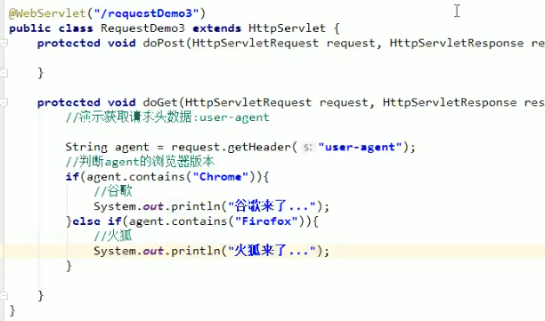
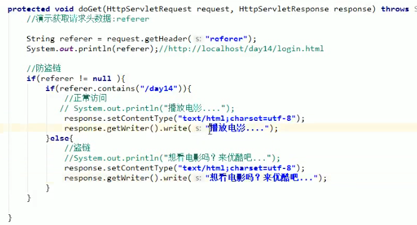
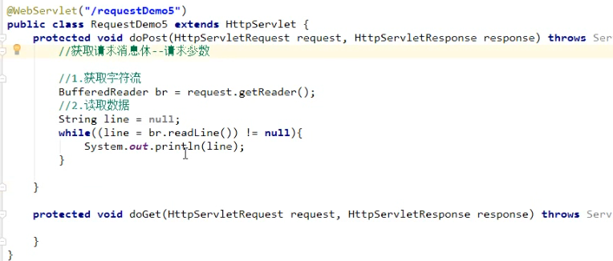
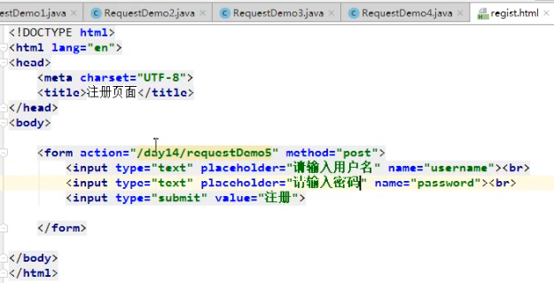
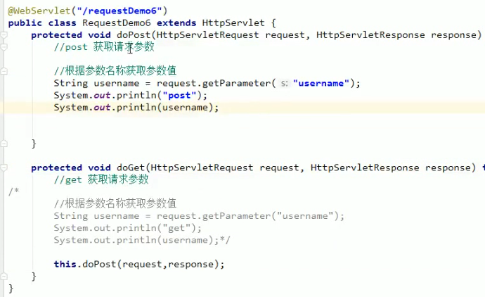
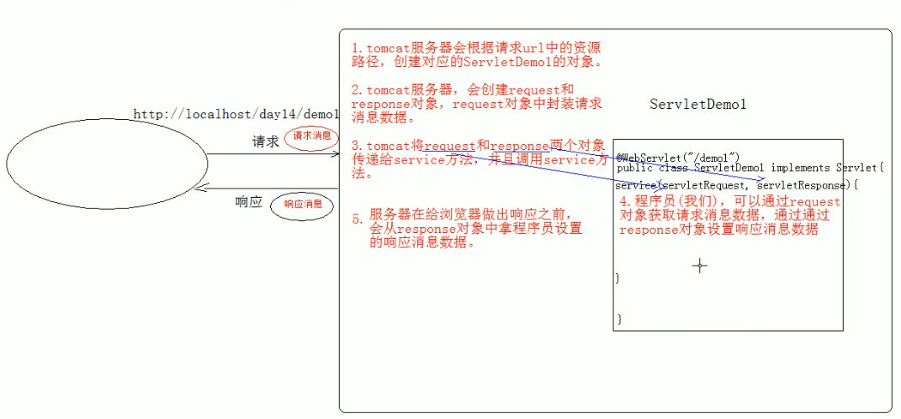

# 01.Request原理、继承体系及功能

- 笔记本：06.Request和Response
- 创建时间：2020-01-29 15:34:16 UTC
- 更新时间：2020-01-30 11:27:21 UTC
- 印象笔记 GUID：4f004bfd-f955-4437-a95a-4e8978ae6615

#### Request：

1. request 对象和 response 对象的原理

  1. request 和 response 对象是由服务器创建的，我们来使用它们

  1. request对象是来获取请求消息，response 对象是来设置响应消息

1. request 对象继承体系结构：
 ServletRequest -- 接口
 | 继承
 HttpServletRequest -- 接口
 | 实现
 org.apache.catalina.connector.RequestFacade 类（tomcat）

1. request 功能：

  1. 获取请求消息数据

    1. 获取请求行数据

      - GET /day14/demo?name=zhangsan HTTP/1.1

      - 方法

        1. 获取请求方式：GET

          - String getMethod()

        1. (*)获取虚拟目录：/day14

          - String getContextPath()

        1. 获取Servlet路径：/demo

          - String getServletPath()

        1. 获取get 方式请求参数：name=zhangsan

          - String getQueryString()

        1. (*)获取请求URI：/day14/demo

          - String getRequestURI(): /day14/demo

          - StringBuffer getRequestURL(): http://localhost/day14/demo

          - URL: 统一资源定位符：http://localhost/day14/demo

          - URI: 统一资源标识符：/day14/demo

        1. 获取协议及版本：HTTP/1.1

          - String getProtocol()

        1. 获取客户机的IP地址：

          - String getRemoteAddr()

    1. 获取请求头数据

      - 方法：

        - String getHeader(String name): 通过请求头的名称获取请求头的值

        - Enumeration<String> getHeaderNames(): 获取所有的请求头名称

```
@WebServlet("/requestDemo")
public class RequestDemo extends HttpServlet {
    protected void doGet(HttpServletRequest request, HttpServletResponse response) {
        // 演示获取请求头数据
        // 1. 获取所有的请求头名称
        Enumeration<String> headerNames = request.getHeaderNames();
        // 2. 遍历
        while(headerNames.hasMoreElements()) {
            String name = headerNames.nextElement();
            // 根据名称获取请求头的值
            String value = request.getHeader(naem);
            System.out.println(name + "---" + value);
        }
    }
}

```

 
 

    1. 获取请求体数据

      - 请求体：只有POST请求方式才有请求体，在请求体中封装了POST请求的请求参数

      - 步骤：

        1. 获取流对象

          - BufferedReader getReader(): 获取字符输入流，只能操作字符数据

          - ServletInputStream getInputStream(): 获取字节输入流，可以操作所有类型数据
 
 

        1. 再从流对象中拿数据

  1. 其他功能：

    1. 获取请求参数通用方式：不论get还是post请求方式都可以使用下列方法来获取请求参数

      1. String getParameter(String name): 根据参数名称获取参数值 username=zs&password=123

      1. String[] getParameterValues(String name): 根据参数名称获取参数值得数组 hobby=xx&hobby=game

      1. Enumeration<String> getParameterNames(): 获取所有 请求的参数名称

      1. Map<String, String[]> getParameterMap(): 获取所有参数的map 集合
 

      - 中文乱码问题：

        - get 方式：tomcat8 已经将get 方式乱码解决了

        - post 方式 ：会乱码

          - 解决：在获取参数前，设置request 的编码 request.setCharacterEncoding("utf-8");

    1. 请求转发：一种在服务器内部的资源跳转方式

      1. 步骤：

        1. 通过request 对象获取请求转发器对象：RequestDispatcher getRequestDispatcher(String path)

        1. 使用RequestDispatcher 对象来进行转发：forward(ServletRequest request, ServletResponse response)

        1. 两句合成一句：request.getRequestDispatcher("/requestDemo").forward(request, response);

      1. 特点：

        1. 浏览器地址栏路径不发生变化

        1. 只能转发到当前服务器内部资源中

        1. 转发是一次请求

    1. 共享数据：

      - 域对象：一个有作用范围的对象，可以在范围内共享数据

      - request域：代表一次请求的范围，一般用于请求转发的多个资源共享数据

      - 方法：

        1. void setAttribute(String name, Object obj): 存储数据

        1. Object getAttribute(String name): 通过键获取值

        1. void removeAttribute(String name): 通过键移除键值对

    1. 获取ServletContext:

      - ServletContext getServletContext()



%23%23%23%23%20Request%EF%BC%9A%0A1.%20request%20%E5%AF%B9%E8%B1%A1%E5%92%8C%20response%20%E5%AF%B9%E8%B1%A1%E7%9A%84%E5%8E%9F%E7%90%86%0A%20%20%20%201.%20request%20%E5%92%8C%20response%20%E5%AF%B9%E8%B1%A1%E6%98%AF%E7%94%B1%E6%9C%8D%E5%8A%A1%E5%99%A8%E5%88%9B%E5%BB%BA%E7%9A%84%EF%BC%8C%E6%88%91%E4%BB%AC%E6%9D%A5%E4%BD%BF%E7%94%A8%E5%AE%83%E4%BB%AC%0A%20%20%20%202.%20request%E5%AF%B9%E8%B1%A1%E6%98%AF%E6%9D%A5%E8%8E%B7%E5%8F%96%E8%AF%B7%E6%B1%82%E6%B6%88%E6%81%AF%EF%BC%8Cresponse%20%E5%AF%B9%E8%B1%A1%E6%98%AF%E6%9D%A5%E8%AE%BE%E7%BD%AE%E5%93%8D%E5%BA%94%E6%B6%88%E6%81%AF%0A2.%20request%20%E5%AF%B9%E8%B1%A1%E7%BB%A7%E6%89%BF%E4%BD%93%E7%B3%BB%E7%BB%93%E6%9E%84%EF%BC%9A%0A%20%20%20%20ServletRequest%20%20%20%20%20%20%20%20--%20%20%20%20%E6%8E%A5%E5%8F%A3%0A%20%20%20%20%20%20%20%20%7C%20%E7%BB%A7%E6%89%BF%0A%20%20%20%20HttpServletRequest%20%20%20--%20%20%20%E6%8E%A5%E5%8F%A3%0A%20%20%20%20%20%20%20%20%7C%20%E5%AE%9E%E7%8E%B0%0A%20%20%20%20org.apache.catalina.connector.RequestFacade%20%E7%B1%BB%EF%BC%88tomcat%EF%BC%89%0A3.%20request%20%E5%8A%9F%E8%83%BD%EF%BC%9A%0A%20%20%20%201.%20%E8%8E%B7%E5%8F%96%E8%AF%B7%E6%B1%82%E6%B6%88%E6%81%AF%E6%95%B0%E6%8D%AE%0A%20%20%20%20%20%20%20%201.%20%E8%8E%B7%E5%8F%96%E8%AF%B7%E6%B1%82%E8%A1%8C%E6%95%B0%E6%8D%AE%0A%20%20%20%20%20%20%20%20%20%20%20%20*%20GET%20%2Fday14%2Fdemo%3Fname%3Dzhangsan%20HTTP%2F1.1%0A%20%20%20%20%20%20%20%20%20%20%20%20*%20%E6%96%B9%E6%B3%95%0A%20%20%20%20%20%20%20%20%20%20%20%20%20%20%20%201.%20%E8%8E%B7%E5%8F%96%E8%AF%B7%E6%B1%82%E6%96%B9%E5%BC%8F%EF%BC%9AGET%0A%20%20%20%20%20%20%20%20%20%20%20%20%20%20%20%20%20%20%20%20*%20String%20getMethod()%0A%20%20%20%20%20%20%20%20%20%20%20%20%20%20%20%202.%20(*)%E8%8E%B7%E5%8F%96%E8%99%9A%E6%8B%9F%E7%9B%AE%E5%BD%95%EF%BC%9A%2Fday14%0A%20%20%20%20%20%20%20%20%20%20%20%20%20%20%20%20%20%20%20%20*%20String%20getContextPath()%0A%20%20%20%20%20%20%20%20%20%20%20%20%20%20%20%203.%20%E8%8E%B7%E5%8F%96Servlet%E8%B7%AF%E5%BE%84%EF%BC%9A%2Fdemo%0A%20%20%20%20%20%20%20%20%20%20%20%20%20%20%20%20%20%20%20%20*%20String%20getServletPath()%0A%20%20%20%20%20%20%20%20%20%20%20%20%20%20%20%204.%20%E8%8E%B7%E5%8F%96get%20%E6%96%B9%E5%BC%8F%E8%AF%B7%E6%B1%82%E5%8F%82%E6%95%B0%EF%BC%9Aname%3Dzhangsan%20%0A%20%20%20%20%20%20%20%20%20%20%20%20%20%20%20%20%20%20%20%20*%20String%20getQueryString()%0A%20%20%20%20%20%20%20%20%20%20%20%20%20%20%20%205.%20(*)%E8%8E%B7%E5%8F%96%E8%AF%B7%E6%B1%82URI%EF%BC%9A%2Fday14%2Fdemo%0A%20%20%20%20%20%20%20%20%20%20%20%20%20%20%20%20%20%20%20%20*%20String%20getRequestURI()%3A%20%2Fday14%2Fdemo%0A%20%20%20%20%20%20%20%20%20%20%20%20%20%20%20%20%20%20%20%20*%20StringBuffer%20getRequestURL()%3A%20http%3A%2F%2Flocalhost%2Fday14%2Fdemo%0A%20%20%20%20%20%20%20%20%20%20%20%20%20%20%20%20%20%20%20%20*%20URL%3A%20%E7%BB%9F%E4%B8%80%E8%B5%84%E6%BA%90%E5%AE%9A%E4%BD%8D%E7%AC%A6%EF%BC%9Ahttp%3A%2F%2Flocalhost%2Fday14%2Fdemo%0A%20%20%20%20%20%20%20%20%20%20%20%20%20%20%20%20%20%20%20%20*%20URI%3A%20%E7%BB%9F%E4%B8%80%E8%B5%84%E6%BA%90%E6%A0%87%E8%AF%86%E7%AC%A6%EF%BC%9A%2Fday14%2Fdemo%0A%20%20%20%20%20%20%20%20%20%20%20%20%20%20%20%206.%20%E8%8E%B7%E5%8F%96%E5%8D%8F%E8%AE%AE%E5%8F%8A%E7%89%88%E6%9C%AC%EF%BC%9AHTTP%2F1.1%0A%20%20%20%20%20%20%20%20%20%20%20%20%20%20%20%20%20%20%20%20*%20String%20getProtocol()%0A%20%20%20%20%20%20%20%20%20%20%20%20%20%20%20%207.%20%E8%8E%B7%E5%8F%96%E5%AE%A2%E6%88%B7%E6%9C%BA%E7%9A%84IP%E5%9C%B0%E5%9D%80%EF%BC%9A%0A%20%20%20%20%20%20%20%20%20%20%20%20%20%20%20%20%20%20%20%20*%20String%20getRemoteAddr()%0A%20%20%20%20%20%20%20%202.%20%E8%8E%B7%E5%8F%96%E8%AF%B7%E6%B1%82%E5%A4%B4%E6%95%B0%E6%8D%AE%0A%20%20%20%20%20%20%20%20%20%20%20%20*%20%E6%96%B9%E6%B3%95%EF%BC%9A%0A%20%20%20%20%20%20%20%20%20%20%20%20%20%20%20%20*%20String%20getHeader(String%20name)%3A%20%E9%80%9A%E8%BF%87%E8%AF%B7%E6%B1%82%E5%A4%B4%E7%9A%84%E5%90%8D%E7%A7%B0%E8%8E%B7%E5%8F%96%E8%AF%B7%E6%B1%82%E5%A4%B4%E7%9A%84%E5%80%BC%0A%20%20%20%20%20%20%20%20%20%20%20%20%20%20%20%20*%20Enumeration%3CString%3E%20getHeaderNames()%3A%20%E8%8E%B7%E5%8F%96%E6%89%80%E6%9C%89%E7%9A%84%E8%AF%B7%E6%B1%82%E5%A4%B4%E5%90%8D%E7%A7%B0%0A%20%20%20%20%20%20%20%20%20%20%20%20%20%20%20%20%60%60%60java%0A%20%20%20%20%20%20%20%20%20%20%20%20%20%20%20%20%40WebServlet(%22%2FrequestDemo%22)%0A%20%20%20%20%20%20%20%20%20%20%20%20%20%20%20%20public%20class%20RequestDemo%20extends%20HttpServlet%20%7B%0A%20%20%20%20%20%20%20%20%20%20%20%20%20%20%20%20%20%20%20%20protected%20void%20doGet(HttpServletRequest%20request%2C%20HttpServletResponse%20response)%20%7B%0A%20%20%20%20%20%20%20%20%20%20%20%20%20%20%20%20%20%20%20%20%20%20%20%20%2F%2F%20%E6%BC%94%E7%A4%BA%E8%8E%B7%E5%8F%96%E8%AF%B7%E6%B1%82%E5%A4%B4%E6%95%B0%E6%8D%AE%0A%20%20%20%20%20%20%20%20%20%20%20%20%20%20%20%20%20%20%20%20%20%20%20%20%2F%2F%201.%20%E8%8E%B7%E5%8F%96%E6%89%80%E6%9C%89%E7%9A%84%E8%AF%B7%E6%B1%82%E5%A4%B4%E5%90%8D%E7%A7%B0%0A%20%20%20%20%20%20%20%20%20%20%20%20%20%20%20%20%20%20%20%20%20%20%20%20Enumeration%3CString%3E%20headerNames%20%3D%20request.getHeaderNames()%3B%0A%20%20%20%20%20%20%20%20%20%20%20%20%20%20%20%20%20%20%20%20%20%20%20%20%2F%2F%202.%20%E9%81%8D%E5%8E%86%0A%20%20%20%20%20%20%20%20%20%20%20%20%20%20%20%20%20%20%20%20%20%20%20%20while(headerNames.hasMoreElements())%20%7B%0A%20%20%20%20%20%20%20%20%20%20%20%20%20%20%20%20%20%20%20%20%20%20%20%20%20%20%20%20String%20name%20%3D%20headerNames.nextElement()%3B%0A%20%20%20%20%20%20%20%20%20%20%20%20%20%20%20%20%20%20%20%20%20%20%20%20%20%20%20%20%2F%2F%20%E6%A0%B9%E6%8D%AE%E5%90%8D%E7%A7%B0%E8%8E%B7%E5%8F%96%E8%AF%B7%E6%B1%82%E5%A4%B4%E7%9A%84%E5%80%BC%0A%20%20%20%20%20%20%20%20%20%20%20%20%20%20%20%20%20%20%20%20%20%20%20%20%20%20%20%20String%20value%20%3D%20request.getHeader(naem)%3B%0A%20%20%20%20%20%20%20%20%20%20%20%20%20%20%20%20%20%20%20%20%20%20%20%20%20%20%20%20System.out.println(name%20%2B%20%22---%22%20%2B%20value)%3B%0A%20%20%20%20%20%20%20%20%20%20%20%20%20%20%20%20%20%20%20%20%20%20%20%20%7D%0A%20%20%20%20%20%20%20%20%20%20%20%20%20%20%20%20%20%20%20%20%7D%0A%20%20%20%20%20%20%20%20%20%20%20%20%20%20%20%20%7D%0A%20%20%20%20%20%20%20%20%20%20%20%20%20%20%20%20%60%60%60%0A%20%20%20%20%20%20%20%20%20%20%20%20%20%20%20%20!%5B487f1334f8f7f022abb4c1f93615d250.png%5D(en-resource%3A%2F%2Fdatabase%2F1210%3A1)%20%20%20%0A%20%20%20%20%20%20%20%20%20%20%20%20%20%20%20%20!%5Bee01fc0636b69f9eca7e3e4c32636750.png%5D(en-resource%3A%2F%2Fdatabase%2F1214%3A1)%0A%20%20%20%20%20%20%20%203.%20%E8%8E%B7%E5%8F%96%E8%AF%B7%E6%B1%82%E4%BD%93%E6%95%B0%E6%8D%AE%0A%20%20%20%20%20%20%20%20%20%20%20%20*%20%E8%AF%B7%E6%B1%82%E4%BD%93%EF%BC%9A%E5%8F%AA%E6%9C%89POST%E8%AF%B7%E6%B1%82%E6%96%B9%E5%BC%8F%E6%89%8D%E6%9C%89%E8%AF%B7%E6%B1%82%E4%BD%93%EF%BC%8C%E5%9C%A8%E8%AF%B7%E6%B1%82%E4%BD%93%E4%B8%AD%E5%B0%81%E8%A3%85%E4%BA%86POST%E8%AF%B7%E6%B1%82%E7%9A%84%E8%AF%B7%E6%B1%82%E5%8F%82%E6%95%B0%0A%20%20%20%20%20%20%20%20%20%20%20%20*%20%E6%AD%A5%E9%AA%A4%EF%BC%9A%0A%20%20%20%20%20%20%20%20%20%20%20%20%20%20%20%201.%20%E8%8E%B7%E5%8F%96%E6%B5%81%E5%AF%B9%E8%B1%A1%0A%20%20%20%20%20%20%20%20%20%20%20%20%20%20%20%20%20%20%20%20*%20BufferedReader%20getReader()%3A%20%E8%8E%B7%E5%8F%96%E5%AD%97%E7%AC%A6%E8%BE%93%E5%85%A5%E6%B5%81%EF%BC%8C%E5%8F%AA%E8%83%BD%E6%93%8D%E4%BD%9C%E5%AD%97%E7%AC%A6%E6%95%B0%E6%8D%AE%0A%20%20%20%20%20%20%20%20%20%20%20%20%20%20%20%20%20%20%20%20*%20ServletInputStream%20getInputStream()%3A%20%E8%8E%B7%E5%8F%96%E5%AD%97%E8%8A%82%E8%BE%93%E5%85%A5%E6%B5%81%EF%BC%8C%E5%8F%AF%E4%BB%A5%E6%93%8D%E4%BD%9C%E6%89%80%E6%9C%89%E7%B1%BB%E5%9E%8B%E6%95%B0%E6%8D%AE%0A%20%20%20%20%20%20%20%20%20%20%20%20%20%20%20%20%20%20%20%20!%5B20784af1b76ecaae3c67e8544097337e.png%5D(en-resource%3A%2F%2Fdatabase%2F1216%3A1)%0A%20%20%20%20%20%20%20%20%20%20%20%20%20%20%20%20%20%20%20%20!%5Bb2778a327727416e204e4c672a287d1e.png%5D(en-resource%3A%2F%2Fdatabase%2F1218%3A1)%0A%20%20%20%20%20%20%20%20%20%20%20%20%20%20%20%202.%20%E5%86%8D%E4%BB%8E%E6%B5%81%E5%AF%B9%E8%B1%A1%E4%B8%AD%E6%8B%BF%E6%95%B0%E6%8D%AE%0A%20%20%20%202.%20%E5%85%B6%E4%BB%96%E5%8A%9F%E8%83%BD%EF%BC%9A%0A%20%20%20%20%20%20%20%201.%20%E8%8E%B7%E5%8F%96%E8%AF%B7%E6%B1%82%E5%8F%82%E6%95%B0%E9%80%9A%E7%94%A8%E6%96%B9%E5%BC%8F%EF%BC%9A%E4%B8%8D%E8%AE%BAget%E8%BF%98%E6%98%AFpost%E8%AF%B7%E6%B1%82%E6%96%B9%E5%BC%8F%E9%83%BD%E5%8F%AF%E4%BB%A5%E4%BD%BF%E7%94%A8%E4%B8%8B%E5%88%97%E6%96%B9%E6%B3%95%E6%9D%A5%E8%8E%B7%E5%8F%96%E8%AF%B7%E6%B1%82%E5%8F%82%E6%95%B0%0A%20%20%20%20%20%20%20%20%20%20%20%201.%20String%20getParameter(String%20name)%3A%20%E6%A0%B9%E6%8D%AE%E5%8F%82%E6%95%B0%E5%90%8D%E7%A7%B0%E8%8E%B7%E5%8F%96%E5%8F%82%E6%95%B0%E5%80%BC%20username%3Dzs%26password%3D123%0A%20%20%20%20%20%20%20%20%20%20%20%202.%20String%5B%5D%20getParameterValues(String%20name)%3A%20%E6%A0%B9%E6%8D%AE%E5%8F%82%E6%95%B0%E5%90%8D%E7%A7%B0%E8%8E%B7%E5%8F%96%E5%8F%82%E6%95%B0%E5%80%BC%E5%BE%97%E6%95%B0%E7%BB%84%20hobby%3Dxx%26hobby%3Dgame%0A%20%20%20%20%20%20%20%20%20%20%20%203.%20Enumeration%3CString%3E%20getParameterNames()%3A%20%E8%8E%B7%E5%8F%96%E6%89%80%E6%9C%89%20%E8%AF%B7%E6%B1%82%E7%9A%84%E5%8F%82%E6%95%B0%E5%90%8D%E7%A7%B0%0A%20%20%20%20%20%20%20%20%20%20%20%204.%20Map%3CString%2C%20String%5B%5D%3E%20getParameterMap()%3A%20%E8%8E%B7%E5%8F%96%E6%89%80%E6%9C%89%E5%8F%82%E6%95%B0%E7%9A%84map%20%E9%9B%86%E5%90%88%0A%20%20%20%20%20%20%20%20%20%20%20%20!%5B24d41a9ac23ca3f11dd5caa6e14067fd.png%5D(en-resource%3A%2F%2Fdatabase%2F1220%3A1)%0A%20%20%20%20%20%20%20%20%20%20%20%20*%20%E4%B8%AD%E6%96%87%E4%B9%B1%E7%A0%81%E9%97%AE%E9%A2%98%EF%BC%9A%0A%20%20%20%20%20%20%20%20%20%20%20%20%20%20%20%20*%20get%20%E6%96%B9%E5%BC%8F%EF%BC%9Atomcat8%20%E5%B7%B2%E7%BB%8F%E5%B0%86get%20%E6%96%B9%E5%BC%8F%E4%B9%B1%E7%A0%81%E8%A7%A3%E5%86%B3%E4%BA%86%0A%20%20%20%20%20%20%20%20%20%20%20%20%20%20%20%20*%20post%20%E6%96%B9%E5%BC%8F%20%EF%BC%9A%E4%BC%9A%E4%B9%B1%E7%A0%81%0A%20%20%20%20%20%20%20%20%20%20%20%20%20%20%20%20%20%20%20%20*%20%E8%A7%A3%E5%86%B3%EF%BC%9A%E5%9C%A8%E8%8E%B7%E5%8F%96%E5%8F%82%E6%95%B0%E5%89%8D%EF%BC%8C%E8%AE%BE%E7%BD%AErequest%20%E7%9A%84%E7%BC%96%E7%A0%81%20request.setCharacterEncoding(%22utf-8%22)%3B%0A%20%20%20%20%20%20%20%202.%20%E8%AF%B7%E6%B1%82%E8%BD%AC%E5%8F%91%EF%BC%9A%E4%B8%80%E7%A7%8D%E5%9C%A8%E6%9C%8D%E5%8A%A1%E5%99%A8%E5%86%85%E9%83%A8%E7%9A%84%E8%B5%84%E6%BA%90%E8%B7%B3%E8%BD%AC%E6%96%B9%E5%BC%8F%0A%20%20%20%20%20%20%20%20%20%20%20%201.%20%E6%AD%A5%E9%AA%A4%EF%BC%9A%0A%20%20%20%20%20%20%20%20%20%20%20%20%20%20%20%201.%20%E9%80%9A%E8%BF%87request%20%E5%AF%B9%E8%B1%A1%E8%8E%B7%E5%8F%96%E8%AF%B7%E6%B1%82%E8%BD%AC%E5%8F%91%E5%99%A8%E5%AF%B9%E8%B1%A1%EF%BC%9ARequestDispatcher%20getRequestDispatcher(String%20path)%0A%20%20%20%20%20%20%20%20%20%20%20%20%20%20%20%202.%20%E4%BD%BF%E7%94%A8RequestDispatcher%20%E5%AF%B9%E8%B1%A1%E6%9D%A5%E8%BF%9B%E8%A1%8C%E8%BD%AC%E5%8F%91%EF%BC%9Aforward(ServletRequest%20request%2C%20ServletResponse%20response)%0A%20%20%20%20%20%20%20%20%20%20%20%20%20%20%20%203.%20%E4%B8%A4%E5%8F%A5%E5%90%88%E6%88%90%E4%B8%80%E5%8F%A5%EF%BC%9Arequest.getRequestDispatcher(%22%2FrequestDemo%22).forward(request%2C%20response)%3B%0A%20%20%20%20%20%20%20%20%20%20%20%202.%20%E7%89%B9%E7%82%B9%EF%BC%9A%0A%20%20%20%20%20%20%20%20%20%20%20%20%20%20%20%201.%20%E6%B5%8F%E8%A7%88%E5%99%A8%E5%9C%B0%E5%9D%80%E6%A0%8F%E8%B7%AF%E5%BE%84%E4%B8%8D%E5%8F%91%E7%94%9F%E5%8F%98%E5%8C%96%0A%20%20%20%20%20%20%20%20%20%20%20%20%20%20%20%202.%20%E5%8F%AA%E8%83%BD%E8%BD%AC%E5%8F%91%E5%88%B0%E5%BD%93%E5%89%8D%E6%9C%8D%E5%8A%A1%E5%99%A8%E5%86%85%E9%83%A8%E8%B5%84%E6%BA%90%E4%B8%AD%0A%20%20%20%20%20%20%20%20%20%20%20%20%20%20%20%203.%20%E8%BD%AC%E5%8F%91%E6%98%AF%E4%B8%80%E6%AC%A1%E8%AF%B7%E6%B1%82%0A%20%20%20%20%20%20%20%203.%20%E5%85%B1%E4%BA%AB%E6%95%B0%E6%8D%AE%EF%BC%9A%0A%20%20%20%20%20%20%20%20%20%20%20%20*%20%E5%9F%9F%E5%AF%B9%E8%B1%A1%EF%BC%9A%E4%B8%80%E4%B8%AA%E6%9C%89%E4%BD%9C%E7%94%A8%E8%8C%83%E5%9B%B4%E7%9A%84%E5%AF%B9%E8%B1%A1%EF%BC%8C%E5%8F%AF%E4%BB%A5%E5%9C%A8%E8%8C%83%E5%9B%B4%E5%86%85%E5%85%B1%E4%BA%AB%E6%95%B0%E6%8D%AE%0A%20%20%20%20%20%20%20%20%20%20%20%20*%20request%E5%9F%9F%EF%BC%9A%E4%BB%A3%E8%A1%A8%E4%B8%80%E6%AC%A1%E8%AF%B7%E6%B1%82%E7%9A%84%E8%8C%83%E5%9B%B4%EF%BC%8C%E4%B8%80%E8%88%AC%E7%94%A8%E4%BA%8E%E8%AF%B7%E6%B1%82%E8%BD%AC%E5%8F%91%E7%9A%84%E5%A4%9A%E4%B8%AA%E8%B5%84%E6%BA%90%E5%85%B1%E4%BA%AB%E6%95%B0%E6%8D%AE%0A%20%20%20%20%20%20%20%20%20%20%20%20*%20%E6%96%B9%E6%B3%95%EF%BC%9A%0A%20%20%20%20%20%20%20%20%20%20%20%20%20%20%20%201.%20void%20setAttribute(String%20name%2C%20Object%20obj)%3A%20%E5%AD%98%E5%82%A8%E6%95%B0%E6%8D%AE%0A%20%20%20%20%20%20%20%20%20%20%20%20%20%20%20%202.%20Object%20getAttribute(String%20name)%3A%20%E9%80%9A%E8%BF%87%E9%94%AE%E8%8E%B7%E5%8F%96%E5%80%BC%0A%20%20%20%20%20%20%20%20%20%20%20%20%20%20%20%203.%20void%20removeAttribute(String%20name)%3A%20%E9%80%9A%E8%BF%87%E9%94%AE%E7%A7%BB%E9%99%A4%E9%94%AE%E5%80%BC%E5%AF%B9%0A%20%20%20%20%20%20%20%204.%20%E8%8E%B7%E5%8F%96ServletContext%3A%0A%20%20%20%20%20%20%20%20%20%20%20%20*%20ServletContext%20getServletContext()%0A%0A!%5B08bf5761fce70d6c6eb67e9541925d30.png%5D(en-resource%3A%2F%2Fdatabase%2F1208%3A1)%0A
