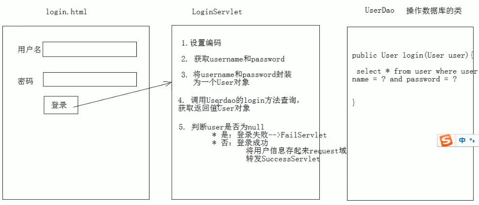
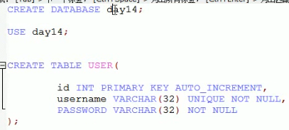
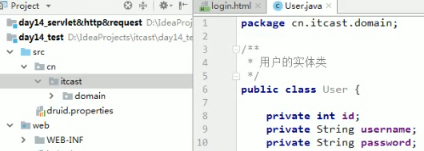

# 02.request登录案例

- 笔记本：06.Request和Response
- 创建时间：2020-01-30 11:27:42 UTC
- 更新时间：2020-01-30 14:56:50 UTC
- 印象笔记 GUID：865fde1f-a57e-426a-bdb4-ee4b31712d49

#### 案例：用户登录

-
用户登录案例需求：

  1. 编写login.html 登录页面
 username & password 两个输入框

  1. 使用Druid 数据库连接池技术，操作mysql，数据库中的user 表

  1. 使用JdbcTemplate 技术封装JDBC

  1. 登录成功跳转到SuccessServlet 展示：登录成功！用户名，欢迎您

  1. 登录失败跳转到FailServlet 展示：登录失败，用户名或密码错误
 

-
开发步骤

  1.
创建项目，导入html页面，配置文件，导入jar包

  1.
创建数据库环境
 

  1.
创建包cn.itcast.domain，创建User类
 

  1.
创建包cn.itcast.dao，创建类UserDao，提供login的方法

```
// itcast.util.JDBCUtil.java
// JDBC工具类，使用Durid 连接池
public class JDBCUtils {
    private static DataSource ds;
    static {
        try {
            // 1. 加载配置文件
            Properties pro = new Properties();
            // 使用ClassLoader 加载配置文件，获取字节输入流
            InputStream  is = JDBCUtils.class.getClassLoader().getResourceAsStream('druid.properties");
            pro.load(is);
            // 2. 初始化连接池对象
            ds = DruidDataSourceFactory.createDataSource(pro);
        } catch(IOException e) {
            e.printStackTrace();
        } catch(Exception e) {
            e.printStackTrace();
        }
    }
}

```

```
/**
 * 操作数据库中 User 表的类
 */
public class UserDao {
    //  声明JDBCTemplate 对象共用
    private JdbcTemplate template = new JdbcTemplate(JDBCUtils.getDataSource());
    /**
     * 登录方法
     */
    public User login(User loginUser) {
        try {
            String sql = "select * from user where username = ? and password = ?";
            User user = template.queryForObject(sql, new BeanPropertyRowMapper<User>(User.class), loginUser.getUsername(), loginUser.getPassword());
            return user;
        } catch(DataAccessException e) {
            e.printStackTrace();
            return null;
        }
    }
}

```

  1.
编写cn.itcast.web.servlet.LoginServlet 类

```
@WebServlet("/loginServlet")
public class LoginServlet extends HttpServlet {
    @Override
    protected void doGet(HttpServletRequest req, HttpServletResponse resp) {
        // 1. 设置编码
        req.setCharacterEncoding("utf-8");
        // 2. 获取请求参数
        String username = req.getParameter("username");
        String password = req.getParameter("password");
        // 3. 封装User 对象
        User loginUser = new User();
        loginUser.setUsername(username);
        loginUser.setPassword(password);
        // 4. 调用UserDao 的login 方法
        UserDao dao = new UserDao();
        User user = dao.login(loginUser);
        // 5. 判断user
        if(user == null) {
            // 登录失败
            req.getRequestDispatcher("/failServlet").forward(req, resp);
        } else {
            // 登录成功
            // 存储数据
            req.setAttribute("user", user);
            req.getRequestDispatcher("/successServlet").forward(req, resp);
        }
    }
    @Override
    protected void doPost(HttpServletRequest req, HttpServletResponse resp) {
    }
}

```

```
@WebServlet("/failServlet")
public class FailServlet extends HttpServlet {
    @Override
    protected void doGet(HttpServletRequest req, HttpServletResponse res) {
        // 设置编码
        res.setContentType("text/html;charset=utf-8");
        // 输出
        res.getWriter().write("登录失败，用户名或密码错误");
    }
    @Override
    protected void doPost(HttpServletRequest req, HttpServletResponse res) {
    }
}

```

```
@WebServlet("/successServlet")
public class SuccessServlet extends HttpServlet {
    @Override
    protected void doGet(HttpServletRequest req, HttpServletResponse res) {
        // 获取request域中共享的user对象
        User user = (User)req.getAttribute("user");
        if(user != null) {
            // 设置编码
            res.setContentType("text/html;charset=utf-8");
            // 输出
            res.getWriter().write("登录成功，" + user.getUsername() + "欢迎您");
        }
    }
    @Override
    protected void doPost(HttpServletRequest req, HttpServletResponse res) {
    }
}

```

  1.
login.html 中form 表单的action 路径的写法

    - 虚拟目录+Servlet的资源路径

  1.
BeanUtils工具类，简化数据封装(commons-beanutils-1.8.0.jar)

    - 用于封装JavaBean 的

    1. JavaBean：标准的Java 类

      1. 要求：

        1. 类必须被public 修饰

        1. 必须提供空参的构造器

        1. 成员变量必须使用private 修饰

        1. 提供公共setter 和 getter 方法

      1. 功能：封装数据

    1. 概念：

      - 成员变量

      - 属性：setter 和getter 方法截取后的产物。eg：getUsername() --> Username --> username

    1. 方法：

      1. setProperty()

      1. getProperty()

      1. populate(Object obj, Map map): 将集合的键值对封装到对应大的JavaBean对象中

```
@WebServlet("/loginServlet")
public class LoginServlet extends HttpServlet {
    @Override
    protected void doGet(HttpServletRequest req, HttpServletResponse resp) {
        // 1. 设置编码
        req.setCharacterEncoding("utf-8");
        /* // 2. 获取请求参数
        String username = req.getParameter("username");
        String password = req.getParameter("password");
        // 3. 封装User 对象
        User loginUser = new User();
        loginUser.setUsername(username);
        loginUser.setPassword(password); */
        // 2. 获取所有请求参数
        map<String, String[]> map = req.getParameterMap();
        // 3. 创建User 对象
        User loginUser = new User();
        // 3.2 使用BeanUtils 封装
        try {
            BeanUtils.populate(loginUser, map);
        } catch(IllegalAccessException e) {
            e.printStackTrace();
        } catch(InvocationTargetException e) {
            e.printStackTrace();
        }
        // 4. 调用UserDao 的login 方法
        UserDao dao = new UserDao();
        User user = dao.login(loginUser);
        // 5. 判断user
        if(user == null) {
            // 登录失败
            req.getRequestDispatcher("/failServlet").forward(req, resp);
        } else {
            // 登录成功
            // 存储数据
            req.setAttribute("user", user);
            req.getRequestDispatcher("/successServlet").forward(req, resp);
        }
    }
    @Override
    protected void doPost(HttpServletRequest req, HttpServletResponse resp) {
    }
}

```

```
<!-- login.html -->
<form action="/day14_test/loginServlet" method="post">
    用户名：<input type="text" name="username"><br data-tomark-pass>    密码：<input type="password" name="password"><br data-tomark-pass>    <input type="submit" value="登录">
</form>

```

```
// druid.properties
driverClassName=com.mysql.jdbc.Driver
url=jdbc:mysql:///day14
username=root
password=root
initialSize=5
maxAction=10
maxWait=3000

```

%23%23%23%23%20%E6%A1%88%E4%BE%8B%EF%BC%9A%E7%94%A8%E6%88%B7%E7%99%BB%E5%BD%95%0A*%20%E7%94%A8%E6%88%B7%E7%99%BB%E5%BD%95%E6%A1%88%E4%BE%8B%E9%9C%80%E6%B1%82%EF%BC%9A%0A%20%20%20%201.%20%E7%BC%96%E5%86%99login.html%20%E7%99%BB%E5%BD%95%E9%A1%B5%E9%9D%A2%0A%20%20%20%20%20%20%20%20username%20%26%20password%20%E4%B8%A4%E4%B8%AA%E8%BE%93%E5%85%A5%E6%A1%86%0A%20%20%20%202.%20%E4%BD%BF%E7%94%A8Druid%20%E6%95%B0%E6%8D%AE%E5%BA%93%E8%BF%9E%E6%8E%A5%E6%B1%A0%E6%8A%80%E6%9C%AF%EF%BC%8C%E6%93%8D%E4%BD%9Cmysql%EF%BC%8C%E6%95%B0%E6%8D%AE%E5%BA%93%E4%B8%AD%E7%9A%84user%20%E8%A1%A8%0A%20%20%20%203.%20%E4%BD%BF%E7%94%A8JdbcTemplate%20%E6%8A%80%E6%9C%AF%E5%B0%81%E8%A3%85JDBC%0A%20%20%20%204.%20%E7%99%BB%E5%BD%95%E6%88%90%E5%8A%9F%E8%B7%B3%E8%BD%AC%E5%88%B0SuccessServlet%20%E5%B1%95%E7%A4%BA%EF%BC%9A%E7%99%BB%E5%BD%95%E6%88%90%E5%8A%9F%EF%BC%81%E7%94%A8%E6%88%B7%E5%90%8D%EF%BC%8C%E6%AC%A2%E8%BF%8E%E6%82%A8%0A%20%20%20%205.%20%E7%99%BB%E5%BD%95%E5%A4%B1%E8%B4%A5%E8%B7%B3%E8%BD%AC%E5%88%B0FailServlet%20%E5%B1%95%E7%A4%BA%EF%BC%9A%E7%99%BB%E5%BD%95%E5%A4%B1%E8%B4%A5%EF%BC%8C%E7%94%A8%E6%88%B7%E5%90%8D%E6%88%96%E5%AF%86%E7%A0%81%E9%94%99%E8%AF%AF%0A!%5Bf781b85a6d9e9522e1e994593c32ffee.png%5D(en-resource%3A%2F%2Fdatabase%2F1224%3A0)%0A%0A*%20%E5%BC%80%E5%8F%91%E6%AD%A5%E9%AA%A4%0A%20%20%20%201.%20%E5%88%9B%E5%BB%BA%E9%A1%B9%E7%9B%AE%EF%BC%8C%E5%AF%BC%E5%85%A5html%E9%A1%B5%E9%9D%A2%EF%BC%8C%E9%85%8D%E7%BD%AE%E6%96%87%E4%BB%B6%EF%BC%8C%E5%AF%BC%E5%85%A5jar%E5%8C%85%0A%20%20%20%202.%20%E5%88%9B%E5%BB%BA%E6%95%B0%E6%8D%AE%E5%BA%93%E7%8E%AF%E5%A2%83%0A%20%20%20%20%20%20%20%20!%5Bb894a23c77b0ad6ec714131f64c3529d.png%5D(en-resource%3A%2F%2Fdatabase%2F1226%3A0)%0A%20%20%20%203.%20%E5%88%9B%E5%BB%BA%E5%8C%85cn.itcast.domain%EF%BC%8C%E5%88%9B%E5%BB%BAUser%E7%B1%BB%0A%20%20%20%20%20%20%20%20!%5B19935dca8b0947e5ef61c9466c35da0f.png%5D(en-resource%3A%2F%2Fdatabase%2F1228%3A0)%0A%20%20%20%204.%20%E5%88%9B%E5%BB%BA%E5%8C%85cn.itcast.dao%EF%BC%8C%E5%88%9B%E5%BB%BA%E7%B1%BBUserDao%EF%BC%8C%E6%8F%90%E4%BE%9Blogin%E7%9A%84%E6%96%B9%E6%B3%95%0A%20%20%20%20%20%20%20%20%60%60%60java%0A%20%20%20%20%20%20%20%20%2F%2F%20itcast.util.JDBCUtil.java%0A%20%20%20%20%20%20%20%20%2F%2F%20JDBC%E5%B7%A5%E5%85%B7%E7%B1%BB%EF%BC%8C%E4%BD%BF%E7%94%A8Durid%20%E8%BF%9E%E6%8E%A5%E6%B1%A0%0A%20%20%20%20%20%20%20%20public%20class%20JDBCUtils%20%7B%0A%20%20%20%20%20%20%20%20%20%20%20%20private%20static%20DataSource%20ds%3B%0A%20%20%20%20%20%20%20%20%20%20%20%20static%20%7B%0A%20%20%20%20%20%20%20%20%20%20%20%20%20%20%20%20try%20%7B%0A%20%20%20%20%20%20%20%20%20%20%20%20%20%20%20%20%20%20%20%20%2F%2F%201.%20%E5%8A%A0%E8%BD%BD%E9%85%8D%E7%BD%AE%E6%96%87%E4%BB%B6%0A%20%20%20%20%20%20%20%20%20%20%20%20%20%20%20%20%20%20%20%20Properties%20pro%20%3D%20new%20Properties()%3B%0A%20%20%20%20%20%20%20%20%20%20%20%20%20%20%20%20%20%20%20%20%2F%2F%20%E4%BD%BF%E7%94%A8ClassLoader%20%E5%8A%A0%E8%BD%BD%E9%85%8D%E7%BD%AE%E6%96%87%E4%BB%B6%EF%BC%8C%E8%8E%B7%E5%8F%96%E5%AD%97%E8%8A%82%E8%BE%93%E5%85%A5%E6%B5%81%0A%20%20%20%20%20%20%20%20%20%20%20%20%20%20%20%20%20%20%20%20InputStream%20%20is%20%3D%20JDBCUtils.class.getClassLoader().getResourceAsStream('druid.properties%22)%3B%0A%20%20%20%20%20%20%20%20%20%20%20%20%20%20%20%20%20%20%20%20pro.load(is)%3B%0A%20%20%20%20%20%20%20%20%20%20%20%20%20%20%20%20%20%20%20%20%2F%2F%202.%20%E5%88%9D%E5%A7%8B%E5%8C%96%E8%BF%9E%E6%8E%A5%E6%B1%A0%E5%AF%B9%E8%B1%A1%0A%20%20%20%20%20%20%20%20%20%20%20%20%20%20%20%20%20%20%20%20ds%20%3D%20DruidDataSourceFactory.createDataSource(pro)%3B%0A%20%20%20%20%20%20%20%20%20%20%20%20%20%20%20%20%7D%20catch(IOException%20e)%20%7B%0A%20%20%20%20%20%20%20%20%20%20%20%20%20%20%20%20%20%20%20%20e.printStackTrace()%3B%0A%20%20%20%20%20%20%20%20%20%20%20%20%20%20%20%20%7D%20catch(Exception%20e)%20%7B%0A%20%20%20%20%20%20%20%20%20%20%20%20%20%20%20%20%20%20%20%20e.printStackTrace()%3B%0A%20%20%20%20%20%20%20%20%20%20%20%20%20%20%20%20%7D%0A%20%20%20%20%20%20%20%20%20%20%20%20%7D%0A%20%20%20%20%20%20%20%20%7D%0A%20%20%20%20%20%20%20%20%60%60%60%0A%20%20%20%20%20%20%20%20%0A%20%20%20%20%20%20%20%20%60%60%60java%20%0A%20%20%20%20%20%20%20%20%2F**%0A%20%20%20%20%20%20%20%20%20*%20%E6%93%8D%E4%BD%9C%E6%95%B0%E6%8D%AE%E5%BA%93%E4%B8%AD%20User%20%E8%A1%A8%E7%9A%84%E7%B1%BB%0A%20%20%20%20%20%20%20%20%20*%2F%0A%20%20%20%20%20%20%20%20public%20class%20UserDao%20%7B%0A%20%20%20%20%20%20%20%20%20%20%20%20%2F%2F%20%20%E5%A3%B0%E6%98%8EJDBCTemplate%20%E5%AF%B9%E8%B1%A1%E5%85%B1%E7%94%A8%0A%20%20%20%20%20%20%20%20%20%20%20%20private%20JdbcTemplate%20template%20%3D%20new%20JdbcTemplate(JDBCUtils.getDataSource())%3B%0A%20%20%20%20%20%20%20%20%20%20%20%20%2F**%0A%20%20%20%20%20%20%20%20%20%20%20%20%20*%20%E7%99%BB%E5%BD%95%E6%96%B9%E6%B3%95%0A%20%20%20%20%20%20%20%20%20%20%20%20%20*%2F%0A%20%20%20%20%20%20%20%20%20%20%20%20public%20User%20login(User%20loginUser)%20%7B%0A%20%20%20%20%20%20%20%20%20%20%20%20%20%20%20%20try%20%7B%0A%20%20%20%20%20%20%20%20%20%20%20%20%20%20%20%20%20%20%20%20String%20sql%20%3D%20%22select%20*%20from%20user%20where%20username%20%3D%20%3F%20and%20password%20%3D%20%3F%22%3B%0A%20%20%20%20%20%20%20%20%20%20%20%20%20%20%20%20%20%20%20%20User%20user%20%3D%20template.queryForObject(sql%2C%20new%20BeanPropertyRowMapper%3CUser%3E(User.class)%2C%20loginUser.getUsername()%2C%20loginUser.getPassword())%3B%0A%20%20%20%20%20%20%20%20%20%20%20%20%20%20%20%20%20%20%20%20return%20user%3B%0A%20%20%20%20%20%20%20%20%20%20%20%20%20%20%20%20%7D%20catch(DataAccessException%20e)%20%7B%0A%20%20%20%20%20%20%20%20%20%20%20%20%20%20%20%20%20%20%20%20e.printStackTrace()%3B%0A%20%20%20%20%20%20%20%20%20%20%20%20%20%20%20%20%20%20%20%20return%20null%3B%0A%20%20%20%20%20%20%20%20%20%20%20%20%20%20%20%20%7D%0A%20%20%20%20%20%20%20%20%20%20%20%20%7D%0A%20%20%20%20%20%20%20%20%7D%0A%20%20%20%20%20%20%20%20%60%60%60%0A%0A%20%20%20%205.%20%E7%BC%96%E5%86%99cn.itcast.web.servlet.LoginServlet%20%E7%B1%BB%0A%20%20%20%20%20%20%20%20%60%60%60java%0A%20%20%20%20%20%20%20%20%40WebServlet(%22%2FloginServlet%22)%0A%20%20%20%20%20%20%20%20public%20class%20LoginServlet%20extends%20HttpServlet%20%7B%0A%20%20%20%20%20%20%20%20%20%20%20%20%40Override%0A%20%20%20%20%20%20%20%20%20%20%20%20protected%20void%20doGet(HttpServletRequest%20req%2C%20HttpServletResponse%20resp)%20%7B%0A%20%20%20%20%20%20%20%20%20%20%20%20%20%20%20%20%2F%2F%201.%20%E8%AE%BE%E7%BD%AE%E7%BC%96%E7%A0%81%0A%20%20%20%20%20%20%20%20%20%20%20%20%20%20%20%20req.setCharacterEncoding(%22utf-8%22)%3B%0A%20%20%20%20%20%20%20%20%20%20%20%20%20%20%20%20%2F%2F%202.%20%E8%8E%B7%E5%8F%96%E8%AF%B7%E6%B1%82%E5%8F%82%E6%95%B0%0A%20%20%20%20%20%20%20%20%20%20%20%20%20%20%20%20String%20username%20%3D%20req.getParameter(%22username%22)%3B%0A%20%20%20%20%20%20%20%20%20%20%20%20%20%20%20%20String%20password%20%3D%20req.getParameter(%22password%22)%3B%0A%20%20%20%20%20%20%20%20%20%20%20%20%20%20%20%20%2F%2F%203.%20%E5%B0%81%E8%A3%85User%20%E5%AF%B9%E8%B1%A1%0A%20%20%20%20%20%20%20%20%20%20%20%20%20%20%20%20User%20loginUser%20%3D%20new%20User()%3B%0A%20%20%20%20%20%20%20%20%20%20%20%20%20%20%20%20loginUser.setUsername(username)%3B%0A%20%20%20%20%20%20%20%20%20%20%20%20%20%20%20%20loginUser.setPassword(password)%3B%0A%20%20%20%20%20%20%20%20%20%20%20%20%20%20%20%20%2F%2F%204.%20%E8%B0%83%E7%94%A8UserDao%20%E7%9A%84login%20%E6%96%B9%E6%B3%95%0A%20%20%20%20%20%20%20%20%20%20%20%20%20%20%20%20UserDao%20dao%20%3D%20new%20UserDao()%3B%0A%20%20%20%20%20%20%20%20%20%20%20%20%20%20%20%20User%20user%20%3D%20dao.login(loginUser)%3B%0A%20%20%20%20%20%20%20%20%20%20%20%20%20%20%20%20%2F%2F%205.%20%E5%88%A4%E6%96%ADuser%0A%20%20%20%20%20%20%20%20%20%20%20%20%20%20%20%20if(user%20%3D%3D%20null)%20%7B%0A%20%20%20%20%20%20%20%20%20%20%20%20%20%20%20%20%20%20%20%20%2F%2F%20%E7%99%BB%E5%BD%95%E5%A4%B1%E8%B4%A5%0A%20%20%20%20%20%20%20%20%20%20%20%20%20%20%20%20%20%20%20%20req.getRequestDispatcher(%22%2FfailServlet%22).forward(req%2C%20resp)%3B%0A%20%20%20%20%20%20%20%20%20%20%20%20%20%20%20%20%7D%20else%20%7B%0A%20%20%20%20%20%20%20%20%20%20%20%20%20%20%20%20%20%20%20%20%2F%2F%20%E7%99%BB%E5%BD%95%E6%88%90%E5%8A%9F%0A%20%20%20%20%20%20%20%20%20%20%20%20%20%20%20%20%20%20%20%20%2F%2F%20%E5%AD%98%E5%82%A8%E6%95%B0%E6%8D%AE%0A%20%20%20%20%20%20%20%20%20%20%20%20%20%20%20%20%20%20%20%20req.setAttribute(%22user%22%2C%20user)%3B%0A%20%20%20%20%20%20%20%20%20%20%20%20%20%20%20%20%20%20%20%20req.getRequestDispatcher(%22%2FsuccessServlet%22).forward(req%2C%20resp)%3B%0A%20%20%20%20%20%20%20%20%20%20%20%20%20%20%20%20%7D%0A%20%20%20%20%20%20%20%20%20%20%20%20%7D%0A%20%20%20%20%20%20%20%20%20%20%20%20%40Override%0A%20%20%20%20%20%20%20%20%20%20%20%20protected%20void%20doPost(HttpServletRequest%20req%2C%20HttpServletResponse%20resp)%20%7B%0A%20%20%20%20%20%20%20%20%20%20%20%20%7D%0A%20%20%20%20%20%20%20%20%7D%0A%20%20%20%20%20%20%20%20%60%60%60%0A%0A%20%20%20%20%20%20%20%20%60%60%60java%0A%20%20%20%20%20%20%20%20%40WebServlet(%22%2FfailServlet%22)%0A%20%20%20%20%20%20%20%20public%20class%20FailServlet%20extends%20HttpServlet%20%7B%0A%20%20%20%20%20%20%20%20%20%20%20%20%40Override%0A%20%20%20%20%20%20%20%20%20%20%20%20protected%20void%20doGet(HttpServletRequest%20req%2C%20HttpServletResponse%20res)%20%7B%0A%20%20%20%20%20%20%20%20%20%20%20%20%20%20%20%20%2F%2F%20%E8%AE%BE%E7%BD%AE%E7%BC%96%E7%A0%81%0A%20%20%20%20%20%20%20%20%20%20%20%20%20%20%20%20res.setContentType(%22text%2Fhtml%3Bcharset%3Dutf-8%22)%3B%0A%20%20%20%20%20%20%20%20%20%20%20%20%20%20%20%20%2F%2F%20%E8%BE%93%E5%87%BA%0A%20%20%20%20%20%20%20%20%20%20%20%20%20%20%20%20res.getWriter().write(%22%E7%99%BB%E5%BD%95%E5%A4%B1%E8%B4%A5%EF%BC%8C%E7%94%A8%E6%88%B7%E5%90%8D%E6%88%96%E5%AF%86%E7%A0%81%E9%94%99%E8%AF%AF%22)%3B%0A%20%20%20%20%20%20%20%20%20%20%20%20%7D%0A%20%20%20%20%20%20%20%20%20%20%20%20%40Override%0A%20%20%20%20%20%20%20%20%20%20%20%20protected%20void%20doPost(HttpServletRequest%20req%2C%20HttpServletResponse%20res)%20%7B%0A%20%20%20%20%20%20%20%20%20%20%20%20%7D%0A%20%20%20%20%20%20%20%20%7D%0A%20%20%20%20%20%20%20%20%60%60%60%0A%20%20%20%20%20%20%20%20%60%60%60java%0A%20%20%20%20%20%20%20%20%40WebServlet(%22%2FsuccessServlet%22)%0A%20%20%20%20%20%20%20%20public%20class%20SuccessServlet%20extends%20HttpServlet%20%7B%0A%20%20%20%20%20%20%20%20%20%20%20%20%40Override%0A%20%20%20%20%20%20%20%20%20%20%20%20protected%20void%20doGet(HttpServletRequest%20req%2C%20HttpServletResponse%20res)%20%7B%0A%20%20%20%20%20%20%20%20%20%20%20%20%20%20%20%20%2F%2F%20%E8%8E%B7%E5%8F%96request%E5%9F%9F%E4%B8%AD%E5%85%B1%E4%BA%AB%E7%9A%84user%E5%AF%B9%E8%B1%A1%0A%20%20%20%20%20%20%20%20%20%20%20%20%20%20%20%20User%20user%20%3D%20(User)req.getAttribute(%22user%22)%3B%0A%20%20%20%20%20%20%20%20%20%20%20%20%20%20%20%20if(user%20!%3D%20null)%20%7B%0A%20%20%20%20%20%20%20%20%20%20%20%20%20%20%20%20%20%20%20%20%2F%2F%20%E8%AE%BE%E7%BD%AE%E7%BC%96%E7%A0%81%0A%20%20%20%20%20%20%20%20%20%20%20%20%20%20%20%20%20%20%20%20res.setContentType(%22text%2Fhtml%3Bcharset%3Dutf-8%22)%3B%0A%20%20%20%20%20%20%20%20%20%20%20%20%20%20%20%20%20%20%20%20%2F%2F%20%E8%BE%93%E5%87%BA%0A%20%20%20%20%20%20%20%20%20%20%20%20%20%20%20%20%20%20%20%20res.getWriter().write(%22%E7%99%BB%E5%BD%95%E6%88%90%E5%8A%9F%EF%BC%8C%22%20%2B%20user.getUsername()%20%2B%20%22%E6%AC%A2%E8%BF%8E%E6%82%A8%22)%3B%0A%20%20%20%20%20%20%20%20%20%20%20%20%20%20%20%20%7D%0A%20%20%20%20%20%20%20%20%20%20%20%20%7D%0A%20%20%20%20%20%20%20%20%20%20%20%20%40Override%0A%20%20%20%20%20%20%20%20%20%20%20%20protected%20void%20doPost(HttpServletRequest%20req%2C%20HttpServletResponse%20res)%20%7B%0A%20%20%20%20%20%20%20%20%20%20%20%20%7D%0A%20%20%20%20%20%20%20%20%7D%0A%20%20%20%20%20%20%20%20%60%60%60%0A%0A%20%20%20%206.%20login.html%20%E4%B8%ADform%20%E8%A1%A8%E5%8D%95%E7%9A%84action%20%E8%B7%AF%E5%BE%84%E7%9A%84%E5%86%99%E6%B3%95%0A%20%20%20%20%20%20%20%20*%20%E8%99%9A%E6%8B%9F%E7%9B%AE%E5%BD%95%2BServlet%E7%9A%84%E8%B5%84%E6%BA%90%E8%B7%AF%E5%BE%84%0A%20%20%20%207.%20BeanUtils%E5%B7%A5%E5%85%B7%E7%B1%BB%EF%BC%8C%E7%AE%80%E5%8C%96%E6%95%B0%E6%8D%AE%E5%B0%81%E8%A3%85(commons-beanutils-1.8.0.jar)%0A%20%20%20%20%20%20%20%20*%20%E7%94%A8%E4%BA%8E%E5%B0%81%E8%A3%85JavaBean%20%E7%9A%84%0A%20%20%20%20%20%20%20%201.%20JavaBean%EF%BC%9A%E6%A0%87%E5%87%86%E7%9A%84Java%20%E7%B1%BB%0A%20%20%20%20%20%20%20%20%20%20%20%201.%20%E8%A6%81%E6%B1%82%EF%BC%9A%0A%20%20%20%20%20%20%20%20%20%20%20%20%20%20%20%201.%20%E7%B1%BB%E5%BF%85%E9%A1%BB%E8%A2%ABpublic%20%E4%BF%AE%E9%A5%B0%0A%20%20%20%20%20%20%20%20%20%20%20%20%20%20%20%202.%20%E5%BF%85%E9%A1%BB%E6%8F%90%E4%BE%9B%E7%A9%BA%E5%8F%82%E7%9A%84%E6%9E%84%E9%80%A0%E5%99%A8%0A%20%20%20%20%20%20%20%20%20%20%20%20%20%20%20%203.%20%E6%88%90%E5%91%98%E5%8F%98%E9%87%8F%E5%BF%85%E9%A1%BB%E4%BD%BF%E7%94%A8private%20%E4%BF%AE%E9%A5%B0%0A%20%20%20%20%20%20%20%20%20%20%20%20%20%20%20%204.%20%E6%8F%90%E4%BE%9B%E5%85%AC%E5%85%B1setter%20%E5%92%8C%20getter%20%E6%96%B9%E6%B3%95%0A%20%20%20%20%20%20%20%20%20%20%20%202.%20%E5%8A%9F%E8%83%BD%EF%BC%9A%E5%B0%81%E8%A3%85%E6%95%B0%E6%8D%AE%0A%20%20%20%20%20%20%20%202.%20%E6%A6%82%E5%BF%B5%EF%BC%9A%0A%20%20%20%20%20%20%20%20%20%20%20%20*%20%E6%88%90%E5%91%98%E5%8F%98%E9%87%8F%0A%20%20%20%20%20%20%20%20%20%20%20%20*%20%E5%B1%9E%E6%80%A7%EF%BC%9Asetter%20%E5%92%8Cgetter%20%E6%96%B9%E6%B3%95%E6%88%AA%E5%8F%96%E5%90%8E%E7%9A%84%E4%BA%A7%E7%89%A9%E3%80%82eg%EF%BC%9AgetUsername()%20--%3E%20Username%20--%3E%20username%0A%20%20%20%20%20%20%20%203.%20%E6%96%B9%E6%B3%95%EF%BC%9A%0A%20%20%20%20%20%20%20%20%20%20%20%201.%20setProperty()%0A%20%20%20%20%20%20%20%20%20%20%20%202.%20getProperty()%0A%20%20%20%20%20%20%20%20%20%20%20%203.%20populate(Object%20obj%2C%20Map%20map)%3A%20%E5%B0%86%E9%9B%86%E5%90%88%E7%9A%84%E9%94%AE%E5%80%BC%E5%AF%B9%E5%B0%81%E8%A3%85%E5%88%B0%E5%AF%B9%E5%BA%94%E5%A4%A7%E7%9A%84JavaBean%E5%AF%B9%E8%B1%A1%E4%B8%AD%0A%20%20%20%20%20%20%20%20%60%60%60java%0A%20%20%20%20%20%20%20%20%40WebServlet(%22%2FloginServlet%22)%0A%20%20%20%20%20%20%20%20public%20class%20LoginServlet%20extends%20HttpServlet%20%7B%0A%20%20%20%20%20%20%20%20%20%20%20%20%40Override%0A%20%20%20%20%20%20%20%20%20%20%20%20protected%20void%20doGet(HttpServletRequest%20req%2C%20HttpServletResponse%20resp)%20%7B%0A%20%20%20%20%20%20%20%20%20%20%20%20%20%20%20%20%2F%2F%201.%20%E8%AE%BE%E7%BD%AE%E7%BC%96%E7%A0%81%0A%20%20%20%20%20%20%20%20%20%20%20%20%20%20%20%20req.setCharacterEncoding(%22utf-8%22)%3B%0A%20%20%20%20%20%20%20%20%20%20%20%20%20%20%20%20%2F*%20%2F%2F%202.%20%E8%8E%B7%E5%8F%96%E8%AF%B7%E6%B1%82%E5%8F%82%E6%95%B0%0A%20%20%20%20%20%20%20%20%20%20%20%20%20%20%20%20String%20username%20%3D%20req.getParameter(%22username%22)%3B%0A%20%20%20%20%20%20%20%20%20%20%20%20%20%20%20%20String%20password%20%3D%20req.getParameter(%22password%22)%3B%0A%20%20%20%20%20%20%20%20%20%20%20%20%20%20%20%20%2F%2F%203.%20%E5%B0%81%E8%A3%85User%20%E5%AF%B9%E8%B1%A1%0A%20%20%20%20%20%20%20%20%20%20%20%20%20%20%20%20User%20loginUser%20%3D%20new%20User()%3B%0A%20%20%20%20%20%20%20%20%20%20%20%20%20%20%20%20loginUser.setUsername(username)%3B%0A%20%20%20%20%20%20%20%20%20%20%20%20%20%20%20%20loginUser.setPassword(password)%3B%20*%2F%0A%20%20%20%20%20%20%20%20%20%20%20%20%20%20%20%20%2F%2F%202.%20%E8%8E%B7%E5%8F%96%E6%89%80%E6%9C%89%E8%AF%B7%E6%B1%82%E5%8F%82%E6%95%B0%0A%20%20%20%20%20%20%20%20%20%20%20%20%20%20%20%20map%3CString%2C%20String%5B%5D%3E%20map%20%3D%20req.getParameterMap()%3B%0A%20%20%20%20%20%20%20%20%20%20%20%20%20%20%20%20%2F%2F%203.%20%E5%88%9B%E5%BB%BAUser%20%E5%AF%B9%E8%B1%A1%0A%20%20%20%20%20%20%20%20%20%20%20%20%20%20%20%20User%20loginUser%20%3D%20new%20User()%3B%0A%20%20%20%20%20%20%20%20%20%20%20%20%20%20%20%20%2F%2F%203.2%20%E4%BD%BF%E7%94%A8BeanUtils%20%E5%B0%81%E8%A3%85%0A%20%20%20%20%20%20%20%20%20%20%20%20%20%20%20%20try%20%7B%0A%20%20%20%20%20%20%20%20%20%20%20%20%20%20%20%20%20%20%20%20BeanUtils.populate(loginUser%2C%20map)%3B%0A%20%20%20%20%20%20%20%20%20%20%20%20%20%20%20%20%7D%20catch(IllegalAccessException%20e)%20%7B%0A%20%20%20%20%20%20%20%20%20%20%20%20%20%20%20%20%20%20%20%20e.printStackTrace()%3B%0A%20%20%20%20%20%20%20%20%20%20%20%20%20%20%20%20%7D%20catch(InvocationTargetException%20e)%20%7B%0A%20%20%20%20%20%20%20%20%20%20%20%20%20%20%20%20%20%20%20%20e.printStackTrace()%3B%0A%20%20%20%20%20%20%20%20%20%20%20%20%20%20%20%20%7D%0A%20%20%20%20%20%20%20%20%20%20%20%20%20%20%20%20%2F%2F%204.%20%E8%B0%83%E7%94%A8UserDao%20%E7%9A%84login%20%E6%96%B9%E6%B3%95%0A%20%20%20%20%20%20%20%20%20%20%20%20%20%20%20%20UserDao%20dao%20%3D%20new%20UserDao()%3B%0A%20%20%20%20%20%20%20%20%20%20%20%20%20%20%20%20User%20user%20%3D%20dao.login(loginUser)%3B%0A%20%20%20%20%20%20%20%20%20%20%20%20%20%20%20%20%2F%2F%205.%20%E5%88%A4%E6%96%ADuser%0A%20%20%20%20%20%20%20%20%20%20%20%20%20%20%20%20if(user%20%3D%3D%20null)%20%7B%0A%20%20%20%20%20%20%20%20%20%20%20%20%20%20%20%20%20%20%20%20%2F%2F%20%E7%99%BB%E5%BD%95%E5%A4%B1%E8%B4%A5%0A%20%20%20%20%20%20%20%20%20%20%20%20%20%20%20%20%20%20%20%20req.getRequestDispatcher(%22%2FfailServlet%22).forward(req%2C%20resp)%3B%0A%20%20%20%20%20%20%20%20%20%20%20%20%20%20%20%20%7D%20else%20%7B%0A%20%20%20%20%20%20%20%20%20%20%20%20%20%20%20%20%20%20%20%20%2F%2F%20%E7%99%BB%E5%BD%95%E6%88%90%E5%8A%9F%0A%20%20%20%20%20%20%20%20%20%20%20%20%20%20%20%20%20%20%20%20%2F%2F%20%E5%AD%98%E5%82%A8%E6%95%B0%E6%8D%AE%0A%20%20%20%20%20%20%20%20%20%20%20%20%20%20%20%20%20%20%20%20req.setAttribute(%22user%22%2C%20user)%3B%0A%20%20%20%20%20%20%20%20%20%20%20%20%20%20%20%20%20%20%20%20req.getRequestDispatcher(%22%2FsuccessServlet%22).forward(req%2C%20resp)%3B%0A%20%20%20%20%20%20%20%20%20%20%20%20%20%20%20%20%7D%0A%20%20%20%20%20%20%20%20%20%20%20%20%7D%0A%20%20%20%20%20%20%20%20%20%20%20%20%40Override%0A%20%20%20%20%20%20%20%20%20%20%20%20protected%20void%20doPost(HttpServletRequest%20req%2C%20HttpServletResponse%20resp)%20%7B%0A%20%20%20%20%20%20%20%20%20%20%20%20%7D%0A%20%20%20%20%20%20%20%20%7D%0A%20%20%20%20%20%20%20%20%60%60%60%0A%0A%0A%60%60%60html%0A%3C!--%20login.html%20--%3E%0A%3Cform%20action%3D%22%2Fday14_test%2FloginServlet%22%20method%3D%22post%22%3E%0A%20%20%20%20%E7%94%A8%E6%88%B7%E5%90%8D%EF%BC%9A%3Cinput%20type%3D%22text%22%20name%3D%22username%22%3E%3Cbr%3E%0A%20%20%20%20%E5%AF%86%E7%A0%81%EF%BC%9A%3Cinput%20type%3D%22password%22%20name%3D%22password%22%3E%3Cbr%3E%0A%20%20%20%20%3Cinput%20type%3D%22submit%22%20value%3D%22%E7%99%BB%E5%BD%95%22%3E%0A%3C%2Fform%3E%0A%60%60%60%0A%0A%60%60%60properties%0A%2F%2F%20druid.properties%0AdriverClassName%3Dcom.mysql.jdbc.Driver%0Aurl%3Djdbc%3Amysql%3A%2F%2F%2Fday14%0Ausername%3Droot%0Apassword%3Droot%0AinitialSize%3D5%0AmaxAction%3D10%0AmaxWait%3D3000%0A%60%60%60%0A
