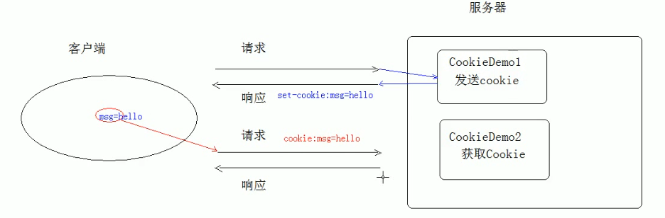

# 01.Cookie快速入门

- 笔记本：07.Cookie和Session
- 创建时间：2020-01-31 16:38:35 UTC
- 更新时间：2020-02-01 05:23:59 UTC
- 印象笔记 GUID：a6611167-6430-41c5-9957-d1d8224dc9d2

#### 会话技术

1. 会话：一次会话中包含多次请求和响应。

  - 一次会话：浏览器第一次给服务器资源发送请求，会话建立，知道有一方断开为止

1. 在一次会话的范围内的多次请求间，共享数据

1. 方式：

  1. 客户端会话技术：Cookie

  1. 服务器端会话技术：Session

#### Cookie:

1. 概念：客户端会话技术，将数据保存到客户端

1. 快速入门：

  - 使用步骤：

    1. 创建Cookie 对象，绑定数据

      - `new Cookie(String name, String value)`

    1. 发送Cookie 对象

      - `response.addCookie(Cookie cookie)`

    1. 获取Cookie，拿到数据

      - `Cookie[] cookies = request.getCookies()`

1. 实现原理

  - 基于响应头set-coolie 和请求头 cookie 实现
 

1. cookie 的细节

  1. 一次可不可以发送多个cookie？

    - 可以创建多个cookie 对象，使用response 调用多次addCookie方法发送cookie 即可。

  1. cookie 在浏览器中保存多长时间？

    1. 默认情况下，当浏览器关闭后，cookie 数据被销毁

    1. 持久化存储：

      - setMaxAge(int seconds)

        1. 正数：将Cookie 数据写到硬盘的文件中。持久化存储。cookie 存活时间。

        1. 负数：默认值

        1. 零：删除cookie 信息

```
// 1. 创建Cookie对象
Cookie c = new Cookie("msg", "setMaxAge");
// 2. 设置cookie 的存活时间
c.setMaxAge(30);            // 将cookie 持久化到硬盘，30秒后自动删除cookie 文件
// 3. 发送cookie
response.addCookie(c);

```

  1. cookie能不能存中文？

    - 在tomcat8 之前，cookie 中不能直接存储中文数据

      - 需要将中文数据转码 --- 一般采用URL编码(%E3)

    - 在tomcat8 之后，cookie 支持中文数据；特殊字符还是不支持，建议使用URL 编码存储，UR解码解析

  1. cookie共享问题

    1. 假设在一个tomcat 中部署了多个web项目，那么在这些web项目中cookie能不能共享？

      - 默认情况下cookie不能共享

      - `setPath(String path)`：设置cookie 的获取范围。默认情况下，设置当前的虚拟目录

      - 如果要共享，则可以将path 设置为 "/"

```
protected void doPost(HttpServletRequest request, HttpServletResponse response)  {
    // 1. 创建Cookie 对象
    Cookie c = new Cookie("msg", "你好:);
    // 2. 设置path，让当前服务器下部署的所有项目共享Cookie信息
    c.setPath("/");
    // 3. 发送Cookie
    response.addCookie(c);
}

```

    1. 不同的tomcat 服务器间cookie 共享问题？

      - `setDomain(String path)`：如果设置一级域名相同，那么多个服务器之间cookie 可以共享

        - `setDomain(".baidu.com")`，那么tieba.baidu.com 和news.baidu.com中cookie可以共享

1. Cookie 的特点和作用

  1. cookie 存储数据在客户端浏览器

  1. 浏览器对于单个cookie 的大小有限制（4kb）以及对同一域名下的总cookie数量也有限制（20个）

  - 作用：

    1. cookie 一般用于存储少量的不太敏感的数据

    1. 在不登录的情况下，完成服务器对客户端的身份识别 eg: 百度网页，不登录也可以设置搜设设置

**eg: Cookie 使用代码：**

```
@WebServlet("/cookieDemo1")
public class CookieDemo1 extends HttpServlet {
    protected void doPost(HttpServletRequest req, HttpServletResponse res) {
        // 1. 创建Cookie 对象
        Cookie cookie = new Cookie("msg", "你好");
        // 2. 发送Cookie
        response.addCookie(cookie);
    }
    protected void doGet(HttpServletRequest req, HttpServletResponse res) {
        this.doPost(req, res);
    }
}

```

```
@WebServlet("/cookieDemo2")
public class CookieDemo2 extends HttpServlet {
    protected void doPost(HttpServletRequest req, HttpServletResponse res) {
        // 3. 获取Cookie
        Cookie[] cs = request.getCookies();
        // 获取数据，遍历Cookies
        if(cs != null) {
            for(Cookie c : cs) {
                String name = c.getName();
                String value = c.getValue();
                System.out.println(name + ":" + value);
            }
        }
    }
    protected void doGet(HttpServletRequest req, HttpServletResponse res) {
        this.doPost(req, res);
    }
}

```

%23%23%23%23%20%20%E4%BC%9A%E8%AF%9D%E6%8A%80%E6%9C%AF%0A1.%20%E4%BC%9A%E8%AF%9D%EF%BC%9A%E4%B8%80%E6%AC%A1%E4%BC%9A%E8%AF%9D%E4%B8%AD%E5%8C%85%E5%90%AB%E5%A4%9A%E6%AC%A1%E8%AF%B7%E6%B1%82%E5%92%8C%E5%93%8D%E5%BA%94%E3%80%82%0A%20%20%20%20*%20%E4%B8%80%E6%AC%A1%E4%BC%9A%E8%AF%9D%EF%BC%9A%E6%B5%8F%E8%A7%88%E5%99%A8%E7%AC%AC%E4%B8%80%E6%AC%A1%E7%BB%99%E6%9C%8D%E5%8A%A1%E5%99%A8%E8%B5%84%E6%BA%90%E5%8F%91%E9%80%81%E8%AF%B7%E6%B1%82%EF%BC%8C%E4%BC%9A%E8%AF%9D%E5%BB%BA%E7%AB%8B%EF%BC%8C%E7%9F%A5%E9%81%93%E6%9C%89%E4%B8%80%E6%96%B9%E6%96%AD%E5%BC%80%E4%B8%BA%E6%AD%A2%0A2.%20%E5%9C%A8%E4%B8%80%E6%AC%A1%E4%BC%9A%E8%AF%9D%E7%9A%84%E8%8C%83%E5%9B%B4%E5%86%85%E7%9A%84%E5%A4%9A%E6%AC%A1%E8%AF%B7%E6%B1%82%E9%97%B4%EF%BC%8C%E5%85%B1%E4%BA%AB%E6%95%B0%E6%8D%AE%0A3.%20%E6%96%B9%E5%BC%8F%EF%BC%9A%0A%20%20%20%201.%20%E5%AE%A2%E6%88%B7%E7%AB%AF%E4%BC%9A%E8%AF%9D%E6%8A%80%E6%9C%AF%EF%BC%9ACookie%0A%20%20%20%202.%20%E6%9C%8D%E5%8A%A1%E5%99%A8%E7%AB%AF%E4%BC%9A%E8%AF%9D%E6%8A%80%E6%9C%AF%EF%BC%9ASession%0A%0A%23%23%23%23%20Cookie%3A%0A1.%20%E6%A6%82%E5%BF%B5%EF%BC%9A%E5%AE%A2%E6%88%B7%E7%AB%AF%E4%BC%9A%E8%AF%9D%E6%8A%80%E6%9C%AF%EF%BC%8C%E5%B0%86%E6%95%B0%E6%8D%AE%E4%BF%9D%E5%AD%98%E5%88%B0%E5%AE%A2%E6%88%B7%E7%AB%AF%0A2.%20%E5%BF%AB%E9%80%9F%E5%85%A5%E9%97%A8%EF%BC%9A%0A%20%20%20%20*%20%E4%BD%BF%E7%94%A8%E6%AD%A5%E9%AA%A4%EF%BC%9A%0A%20%20%20%20%20%20%20%201.%20%E5%88%9B%E5%BB%BACookie%20%E5%AF%B9%E8%B1%A1%EF%BC%8C%E7%BB%91%E5%AE%9A%E6%95%B0%E6%8D%AE%0A%20%20%20%20%20%20%20%20%20%20%20%20*%20%60new%20Cookie(String%20name%2C%20String%20value)%60%0A%20%20%20%20%20%20%20%202.%20%E5%8F%91%E9%80%81Cookie%20%E5%AF%B9%E8%B1%A1%0A%20%20%20%20%20%20%20%20%20%20%20%20*%20%60response.addCookie(Cookie%20cookie)%60%0A%20%20%20%20%20%20%20%203.%20%E8%8E%B7%E5%8F%96Cookie%EF%BC%8C%E6%8B%BF%E5%88%B0%E6%95%B0%E6%8D%AE%0A%20%20%20%20%20%20%20%20%20%20%20%20*%20%60Cookie%5B%5D%20cookies%20%3D%20request.getCookies()%60%0A3.%20%E5%AE%9E%E7%8E%B0%E5%8E%9F%E7%90%86%0A%20%20%20%20*%20%E5%9F%BA%E4%BA%8E%E5%93%8D%E5%BA%94%E5%A4%B4set-coolie%20%E5%92%8C%E8%AF%B7%E6%B1%82%E5%A4%B4%20cookie%20%E5%AE%9E%E7%8E%B0%0A%20%20%20%20!%5B475b04af6712473b32850365a0ba3d7f.png%5D(en-resource%3A%2F%2Fdatabase%2F1244%3A1)%0A4.%20cookie%20%E7%9A%84%E7%BB%86%E8%8A%82%0A%20%20%20%201.%20%E4%B8%80%E6%AC%A1%E5%8F%AF%E4%B8%8D%E5%8F%AF%E4%BB%A5%E5%8F%91%E9%80%81%E5%A4%9A%E4%B8%AAcookie%EF%BC%9F%0A%20%20%20%20%20%20%20%20*%20%E5%8F%AF%E4%BB%A5%E5%88%9B%E5%BB%BA%E5%A4%9A%E4%B8%AAcookie%20%E5%AF%B9%E8%B1%A1%EF%BC%8C%E4%BD%BF%E7%94%A8response%20%E8%B0%83%E7%94%A8%E5%A4%9A%E6%AC%A1addCookie%E6%96%B9%E6%B3%95%E5%8F%91%E9%80%81cookie%20%E5%8D%B3%E5%8F%AF%E3%80%82%0A%20%20%20%202.%20cookie%20%E5%9C%A8%E6%B5%8F%E8%A7%88%E5%99%A8%E4%B8%AD%E4%BF%9D%E5%AD%98%E5%A4%9A%E9%95%BF%E6%97%B6%E9%97%B4%EF%BC%9F%0A%20%20%20%20%20%20%20%201.%20%E9%BB%98%E8%AE%A4%E6%83%85%E5%86%B5%E4%B8%8B%EF%BC%8C%E5%BD%93%E6%B5%8F%E8%A7%88%E5%99%A8%E5%85%B3%E9%97%AD%E5%90%8E%EF%BC%8Ccookie%20%E6%95%B0%E6%8D%AE%E8%A2%AB%E9%94%80%E6%AF%81%0A%20%20%20%20%20%20%20%202.%20%E6%8C%81%E4%B9%85%E5%8C%96%E5%AD%98%E5%82%A8%EF%BC%9A%0A%20%20%20%20%20%20%20%20%20%20%20%20*%20setMaxAge(int%20seconds)%0A%20%20%20%20%20%20%20%20%20%20%20%20%20%20%20%201.%20%E6%AD%A3%E6%95%B0%EF%BC%9A%E5%B0%86Cookie%20%E6%95%B0%E6%8D%AE%E5%86%99%E5%88%B0%E7%A1%AC%E7%9B%98%E7%9A%84%E6%96%87%E4%BB%B6%E4%B8%AD%E3%80%82%E6%8C%81%E4%B9%85%E5%8C%96%E5%AD%98%E5%82%A8%E3%80%82cookie%20%E5%AD%98%E6%B4%BB%E6%97%B6%E9%97%B4%E3%80%82%0A%20%20%20%20%20%20%20%20%20%20%20%20%20%20%20%202.%20%E8%B4%9F%E6%95%B0%EF%BC%9A%E9%BB%98%E8%AE%A4%E5%80%BC%0A%20%20%20%20%20%20%20%20%20%20%20%20%20%20%20%203.%20%E9%9B%B6%EF%BC%9A%E5%88%A0%E9%99%A4cookie%20%E4%BF%A1%E6%81%AF%0A%20%20%20%20%20%20%20%20%20%20%20%20%60%60%60java%0A%20%20%20%20%20%20%20%20%20%20%20%20%2F%2F%201.%20%E5%88%9B%E5%BB%BACookie%E5%AF%B9%E8%B1%A1%0A%20%20%20%20%20%20%20%20%20%20%20%20Cookie%20c%20%3D%20new%20Cookie(%22msg%22%2C%20%22setMaxAge%22)%3B%0A%20%20%20%20%20%20%20%20%20%20%20%20%2F%2F%202.%20%E8%AE%BE%E7%BD%AEcookie%20%E7%9A%84%E5%AD%98%E6%B4%BB%E6%97%B6%E9%97%B4%0A%20%20%20%20%20%20%20%20%20%20%20%20c.setMaxAge(30)%3B%20%20%20%20%20%20%20%20%20%20%20%20%2F%2F%20%E5%B0%86cookie%20%E6%8C%81%E4%B9%85%E5%8C%96%E5%88%B0%E7%A1%AC%E7%9B%98%EF%BC%8C30%E7%A7%92%E5%90%8E%E8%87%AA%E5%8A%A8%E5%88%A0%E9%99%A4cookie%20%E6%96%87%E4%BB%B6%0A%20%20%20%20%20%20%20%20%20%20%20%20%2F%2F%203.%20%E5%8F%91%E9%80%81cookie%0A%20%20%20%20%20%20%20%20%20%20%20%20response.addCookie(c)%3B%0A%20%20%20%20%20%20%20%20%20%20%20%20%60%60%60%0A%20%20%20%203.%20cookie%E8%83%BD%E4%B8%8D%E8%83%BD%E5%AD%98%E4%B8%AD%E6%96%87%EF%BC%9F%0A%20%20%20%20%20%20%20%20*%20%E5%9C%A8tomcat8%20%E4%B9%8B%E5%89%8D%EF%BC%8Ccookie%20%E4%B8%AD%E4%B8%8D%E8%83%BD%E7%9B%B4%E6%8E%A5%E5%AD%98%E5%82%A8%E4%B8%AD%E6%96%87%E6%95%B0%E6%8D%AE%0A%20%20%20%20%20%20%20%20%20%20%20%20*%20%E9%9C%80%E8%A6%81%E5%B0%86%E4%B8%AD%E6%96%87%E6%95%B0%E6%8D%AE%E8%BD%AC%E7%A0%81%20---%20%E4%B8%80%E8%88%AC%E9%87%87%E7%94%A8URL%E7%BC%96%E7%A0%81(%25E3)%0A%20%20%20%20%20%20%20%20*%20%E5%9C%A8tomcat8%20%E4%B9%8B%E5%90%8E%EF%BC%8Ccookie%20%E6%94%AF%E6%8C%81%E4%B8%AD%E6%96%87%E6%95%B0%E6%8D%AE%EF%BC%9B%E7%89%B9%E6%AE%8A%E5%AD%97%E7%AC%A6%E8%BF%98%E6%98%AF%E4%B8%8D%E6%94%AF%E6%8C%81%EF%BC%8C%E5%BB%BA%E8%AE%AE%E4%BD%BF%E7%94%A8URL%20%E7%BC%96%E7%A0%81%E5%AD%98%E5%82%A8%EF%BC%8CUR%E8%A7%A3%E7%A0%81%E8%A7%A3%E6%9E%90%0A%20%20%20%204.%20cookie%E5%85%B1%E4%BA%AB%E9%97%AE%E9%A2%98%0A%20%20%20%20%20%20%20%201.%20%E5%81%87%E8%AE%BE%E5%9C%A8%E4%B8%80%E4%B8%AAtomcat%20%E4%B8%AD%E9%83%A8%E7%BD%B2%E4%BA%86%E5%A4%9A%E4%B8%AAweb%E9%A1%B9%E7%9B%AE%EF%BC%8C%E9%82%A3%E4%B9%88%E5%9C%A8%E8%BF%99%E4%BA%9Bweb%E9%A1%B9%E7%9B%AE%E4%B8%ADcookie%E8%83%BD%E4%B8%8D%E8%83%BD%E5%85%B1%E4%BA%AB%EF%BC%9F%0A%20%20%20%20%20%20%20%20%20%20%20%20*%20%E9%BB%98%E8%AE%A4%E6%83%85%E5%86%B5%E4%B8%8Bcookie%E4%B8%8D%E8%83%BD%E5%85%B1%E4%BA%AB%0A%20%20%20%20%20%20%20%20%20%20%20%20*%20%60setPath(String%20path)%60%EF%BC%9A%E8%AE%BE%E7%BD%AEcookie%20%E7%9A%84%E8%8E%B7%E5%8F%96%E8%8C%83%E5%9B%B4%E3%80%82%E9%BB%98%E8%AE%A4%E6%83%85%E5%86%B5%E4%B8%8B%EF%BC%8C%E8%AE%BE%E7%BD%AE%E5%BD%93%E5%89%8D%E7%9A%84%E8%99%9A%E6%8B%9F%E7%9B%AE%E5%BD%95%0A%20%20%20%20%20%20%20%20%20%20%20%20*%20%E5%A6%82%E6%9E%9C%E8%A6%81%E5%85%B1%E4%BA%AB%EF%BC%8C%E5%88%99%E5%8F%AF%E4%BB%A5%E5%B0%86path%20%E8%AE%BE%E7%BD%AE%E4%B8%BA%20%22%2F%22%20%0A%20%20%20%20%20%20%20%20%20%20%20%20%60%60%60java%0A%20%20%20%20%20%20%20%20%20%20%20%20protected%20void%20doPost(HttpServletRequest%20request%2C%20HttpServletResponse%20response)%20%20%7B%0A%20%20%20%20%20%20%20%20%20%20%20%20%20%20%20%20%2F%2F%201.%20%E5%88%9B%E5%BB%BACookie%20%E5%AF%B9%E8%B1%A1%0A%20%20%20%20%20%20%20%20%20%20%20%20%20%20%20%20Cookie%20c%20%3D%20new%20Cookie(%22msg%22%2C%20%22%E4%BD%A0%E5%A5%BD%3A)%3B%0A%20%20%20%20%20%20%20%20%20%20%20%20%20%20%20%20%2F%2F%202.%20%E8%AE%BE%E7%BD%AEpath%EF%BC%8C%E8%AE%A9%E5%BD%93%E5%89%8D%E6%9C%8D%E5%8A%A1%E5%99%A8%E4%B8%8B%E9%83%A8%E7%BD%B2%E7%9A%84%E6%89%80%E6%9C%89%E9%A1%B9%E7%9B%AE%E5%85%B1%E4%BA%ABCookie%E4%BF%A1%E6%81%AF%0A%20%20%20%20%20%20%20%20%20%20%20%20%20%20%20%20c.setPath(%22%2F%22)%3B%0A%20%20%20%20%20%20%20%20%20%20%20%20%20%20%20%20%2F%2F%203.%20%E5%8F%91%E9%80%81Cookie%0A%20%20%20%20%20%20%20%20%20%20%20%20%20%20%20%20response.addCookie(c)%3B%0A%20%20%20%20%20%20%20%20%20%20%20%20%7D%0A%20%20%20%20%20%20%20%20%20%20%20%20%60%60%60%0A%20%20%20%20%20%20%20%202.%20%E4%B8%8D%E5%90%8C%E7%9A%84tomcat%20%E6%9C%8D%E5%8A%A1%E5%99%A8%E9%97%B4cookie%20%E5%85%B1%E4%BA%AB%E9%97%AE%E9%A2%98%EF%BC%9F%0A%20%20%20%20%20%20%20%20%20%20%20%20*%20%60setDomain(String%20path)%60%EF%BC%9A%E5%A6%82%E6%9E%9C%E8%AE%BE%E7%BD%AE%E4%B8%80%E7%BA%A7%E5%9F%9F%E5%90%8D%E7%9B%B8%E5%90%8C%EF%BC%8C%E9%82%A3%E4%B9%88%E5%A4%9A%E4%B8%AA%E6%9C%8D%E5%8A%A1%E5%99%A8%E4%B9%8B%E9%97%B4cookie%20%E5%8F%AF%E4%BB%A5%E5%85%B1%E4%BA%AB%0A%20%20%20%20%20%20%20%20%20%20%20%20%20%20%20%20*%20%60setDomain(%22.baidu.com%22)%60%EF%BC%8C%E9%82%A3%E4%B9%88tieba.baidu.com%20%E5%92%8Cnews.baidu.com%E4%B8%ADcookie%E5%8F%AF%E4%BB%A5%E5%85%B1%E4%BA%AB%0A5.%20Cookie%20%E7%9A%84%E7%89%B9%E7%82%B9%E5%92%8C%E4%BD%9C%E7%94%A8%0A%20%20%20%201.%20cookie%20%E5%AD%98%E5%82%A8%E6%95%B0%E6%8D%AE%E5%9C%A8%E5%AE%A2%E6%88%B7%E7%AB%AF%E6%B5%8F%E8%A7%88%E5%99%A8%0A%20%20%20%202.%20%E6%B5%8F%E8%A7%88%E5%99%A8%E5%AF%B9%E4%BA%8E%E5%8D%95%E4%B8%AAcookie%20%E7%9A%84%E5%A4%A7%E5%B0%8F%E6%9C%89%E9%99%90%E5%88%B6%EF%BC%884kb%EF%BC%89%E4%BB%A5%E5%8F%8A%E5%AF%B9%E5%90%8C%E4%B8%80%E5%9F%9F%E5%90%8D%E4%B8%8B%E7%9A%84%E6%80%BBcookie%E6%95%B0%E9%87%8F%E4%B9%9F%E6%9C%89%E9%99%90%E5%88%B6%EF%BC%8820%E4%B8%AA%EF%BC%89%0A%20%20%20%20*%20%E4%BD%9C%E7%94%A8%EF%BC%9A%0A%20%20%20%20%20%20%20%201.%20cookie%20%E4%B8%80%E8%88%AC%E7%94%A8%E4%BA%8E%E5%AD%98%E5%82%A8%E5%B0%91%E9%87%8F%E7%9A%84%E4%B8%8D%E5%A4%AA%E6%95%8F%E6%84%9F%E7%9A%84%E6%95%B0%E6%8D%AE%0A%20%20%20%20%20%20%20%202.%20%E5%9C%A8%E4%B8%8D%E7%99%BB%E5%BD%95%E7%9A%84%E6%83%85%E5%86%B5%E4%B8%8B%EF%BC%8C%E5%AE%8C%E6%88%90%E6%9C%8D%E5%8A%A1%E5%99%A8%E5%AF%B9%E5%AE%A2%E6%88%B7%E7%AB%AF%E7%9A%84%E8%BA%AB%E4%BB%BD%E8%AF%86%E5%88%AB%20eg%3A%20%E7%99%BE%E5%BA%A6%E7%BD%91%E9%A1%B5%EF%BC%8C%E4%B8%8D%E7%99%BB%E5%BD%95%E4%B9%9F%E5%8F%AF%E4%BB%A5%E8%AE%BE%E7%BD%AE%E6%90%9C%E8%AE%BE%E8%AE%BE%E7%BD%AE%0A%0A%0A**eg%3A%20Cookie%20%E4%BD%BF%E7%94%A8%E4%BB%A3%E7%A0%81%EF%BC%9A**%0A%60%60%60java%0A%40WebServlet(%22%2FcookieDemo1%22)%0Apublic%20class%20CookieDemo1%20extends%20HttpServlet%20%7B%0A%20%20%20%20protected%20void%20doPost(HttpServletRequest%20req%2C%20HttpServletResponse%20res)%20%7B%0A%20%20%20%20%20%20%20%20%2F%2F%201.%20%E5%88%9B%E5%BB%BACookie%20%E5%AF%B9%E8%B1%A1%0A%20%20%20%20%20%20%20%20Cookie%20cookie%20%3D%20new%20Cookie(%22msg%22%2C%20%22%E4%BD%A0%E5%A5%BD%22)%3B%0A%20%20%20%20%20%20%20%20%2F%2F%202.%20%E5%8F%91%E9%80%81Cookie%0A%20%20%20%20%20%20%20%20response.addCookie(cookie)%3B%0A%20%20%20%20%7D%0A%20%20%20%20protected%20void%20doGet(HttpServletRequest%20req%2C%20HttpServletResponse%20res)%20%7B%0A%20%20%20%20%20%20%20%20this.doPost(req%2C%20res)%3B%0A%20%20%20%20%7D%0A%7D%0A%60%60%60%0A%60%60%60java%0A%40WebServlet(%22%2FcookieDemo2%22)%0Apublic%20class%20CookieDemo2%20extends%20HttpServlet%20%7B%0A%20%20%20%20protected%20void%20doPost(HttpServletRequest%20req%2C%20HttpServletResponse%20res)%20%7B%0A%20%20%20%20%20%20%20%20%2F%2F%203.%20%E8%8E%B7%E5%8F%96Cookie%0A%20%20%20%20%20%20%20%20Cookie%5B%5D%20cs%20%3D%20request.getCookies()%3B%0A%20%20%20%20%20%20%20%20%2F%2F%20%E8%8E%B7%E5%8F%96%E6%95%B0%E6%8D%AE%EF%BC%8C%E9%81%8D%E5%8E%86Cookies%0A%20%20%20%20%20%20%20%20if(cs%20!%3D%20null)%20%7B%0A%20%20%20%20%20%20%20%20%20%20%20%20for(Cookie%20c%20%3A%20cs)%20%7B%0A%20%20%20%20%20%20%20%20%20%20%20%20%20%20%20%20String%20name%20%3D%20c.getName()%3B%0A%20%20%20%20%20%20%20%20%20%20%20%20%20%20%20%20String%20value%20%3D%20c.getValue()%3B%0A%20%20%20%20%20%20%20%20%20%20%20%20%20%20%20%20System.out.println(name%20%2B%20%22%3A%22%20%2B%20value)%3B%0A%20%20%20%20%20%20%20%20%20%20%20%20%7D%0A%20%20%20%20%20%20%20%20%7D%0A%20%20%20%20%7D%0A%20%20%20%20protected%20void%20doGet(HttpServletRequest%20req%2C%20HttpServletResponse%20res)%20%7B%0A%20%20%20%20%20%20%20%20this.doPost(req%2C%20res)%3B%0A%20%20%20%20%7D%0A%7D%0A%60%60%60%0A%0A
