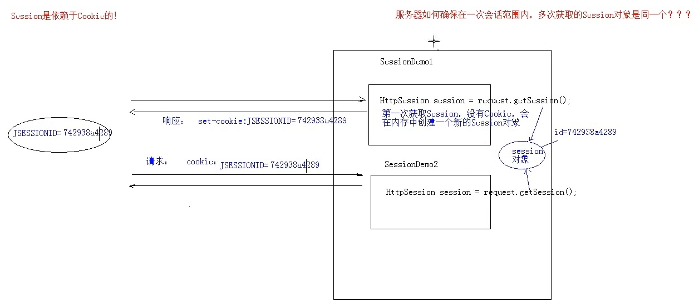

# 03.Session快速入门

- 笔记本：07.Cookie和Session
- 创建时间：2020-02-02 03:57:49 UTC
- 更新时间：2020-02-02 04:34:38 UTC
- 印象笔记 GUID：4a4f9036-d08c-4e90-8fb2-c2d94b7f08ed

#### Session：

1. 概念：服务器端会话技术，在一次会话的多次请求间共享数据，将数据保存在服务器端的对象中。HttpSession

1. 快速入门：

  1. 获取HttpSession对象：

    - HttpSession session = request.getSession();

  1. 使用HttpSession对象;

    - Object getAttribute(String name)

    - void setAttribute(String name, Object value)

    - void remove Attribute(String name)

**eg：**

```
@WebServlet("/sessionDemo1")
public class SessionDemo1 extends HttpServlet {
    protected void doPost(HttpServletRequest req, HttpServletResponse res) {
        // 使用session 共享数据
        // 1. 获取session
        HttpSession session = req.getSession();
        // 2. 存储数据
        session.setAttribute("msg", "Hello Session");
    }
    protected void doGet(HttpServletRequest req, HttpServletResponse res) {
        this.doPost(req, res);
    }
}

```

```
@WebServlet("/sessionDemo1")
public class SessionDemo1 extends HttpServlet {
    protected void doPost(HttpServletRequest req, HttpServletResponse res) {
        // 使用session 获取数据
        // 1. 获取session
        HttpSession session = req.getSession();
        // 2. 获取数据
        Object msg = session.getAttribute("msg");
        System.out.println(msg);
    }
    protected void doGet(HttpServletRequest req, HttpServletResponse res) {
        this.doPost(req, res);
    }
}

```

1.
原理：

  - Session 的实现是依赖于Cookie 的。
 

1.
细节：

  1. 当客户端关闭后，服务器不关闭，两次获取session 是否为同一个？

    - 默认情况下不是。

    - 如果需要相同，则可以创建Cookie，键为JSESSIONID，设置最大存活时间，让cookie 持久化保存。

```
@WebServlet("/sessionDemo")
public class SessionDemo extends HttpServlet {
    protected void doPost(HttpServletRequest req, HttpServletResponse res) {
        // 1. 获取session
        HttpSession session = req.getSession();
        // 期望客户端关闭后，session 也能相同
        Cookie c = new Cookie("JSESSIONID", session.getId());
        c.setMaxAge(60 * 60);
        res.addCookie(c);
    }
    protected void doGet(HttpServletRequest req, HttpServletResponse res) {
        this.doPost(req, res);
    }
}

```

  1. 客户端不关闭，服务器关闭后，两次获取的session是同一个嘛？

    - 不是同一个，但是要确保数据不丢失

      - session 的钝化：

        - 在服务器正常关闭之前，将session 对象序列化到硬盘上。

      - session 的活化：

        - 在服务器启动后，将session 文件转化为内存中的session 对象即可。

      - Tomcat 已经帮我们完成了这项工作。当服务器正常关闭时，work目录下的项目文件夹中会生成session.ser文件，当服务器启动时，这个文件会被读取到内存。文件删除

  1. session 什么时候被销毁？

    1. 服务器关闭

    1. session 对象调用 `invalidate()`

    1. session 默认失效时间 30分钟
 选择性配置修改

      - tomcat/conf/web.xml（是所有项目的父配置文件）

```
<session-config>
    <session-timeout>30</session-timeout>
</session-config>

```

1.
session 的特点

  1. sesssion 用于存储一次会话的多次请求的数据，存在服务器端

  1. session 可以存储任意类型，任意大小的数据

**Session 与Cookie 的区别：**
 1. session 存储数据在服务器端，Cookie 在客户端
 2. session 没有数据大小限制，Cookie有
 3. session 数据安全，Cookie 相对不安全

%23%23%23%23%20Session%EF%BC%9A%0A%0A1.%20%E6%A6%82%E5%BF%B5%EF%BC%9A%E6%9C%8D%E5%8A%A1%E5%99%A8%E7%AB%AF%E4%BC%9A%E8%AF%9D%E6%8A%80%E6%9C%AF%EF%BC%8C%E5%9C%A8%E4%B8%80%E6%AC%A1%E4%BC%9A%E8%AF%9D%E7%9A%84%E5%A4%9A%E6%AC%A1%E8%AF%B7%E6%B1%82%E9%97%B4%E5%85%B1%E4%BA%AB%E6%95%B0%E6%8D%AE%EF%BC%8C%E5%B0%86%E6%95%B0%E6%8D%AE%E4%BF%9D%E5%AD%98%E5%9C%A8%E6%9C%8D%E5%8A%A1%E5%99%A8%E7%AB%AF%E7%9A%84%E5%AF%B9%E8%B1%A1%E4%B8%AD%E3%80%82HttpSession%0A2.%20%E5%BF%AB%E9%80%9F%E5%85%A5%E9%97%A8%EF%BC%9A%0A%20%20%20%201.%20%E8%8E%B7%E5%8F%96HttpSession%E5%AF%B9%E8%B1%A1%EF%BC%9A%0A%20%20%20%20%20%20%20%20*%20HttpSession%20session%20%3D%20request.getSession()%3B%0A%20%20%20%202.%20%E4%BD%BF%E7%94%A8HttpSession%E5%AF%B9%E8%B1%A1%3B%0A%20%20%20%20%20%20%20%20*%20Object%20getAttribute(String%20name)%0A%20%20%20%20%20%20%20%20*%20void%20setAttribute(String%20name%2C%20Object%20value)%0A%20%20%20%20%20%20%20%20*%20void%20remove%20Attribute(String%20name)%0A%0A**eg%EF%BC%9A**%0A%60%60%60java%0A%40WebServlet(%22%2FsessionDemo1%22)%0Apublic%20class%20SessionDemo1%20extends%20HttpServlet%20%7B%0A%20%20%20%20protected%20void%20doPost(HttpServletRequest%20req%2C%20HttpServletResponse%20res)%20%7B%0A%20%20%20%20%20%20%20%20%2F%2F%20%E4%BD%BF%E7%94%A8session%20%E5%85%B1%E4%BA%AB%E6%95%B0%E6%8D%AE%0A%20%20%20%20%20%20%20%20%2F%2F%201.%20%E8%8E%B7%E5%8F%96session%0A%20%20%20%20%20%20%20%20HttpSession%20session%20%3D%20req.getSession()%3B%0A%20%20%20%20%20%20%20%20%2F%2F%202.%20%E5%AD%98%E5%82%A8%E6%95%B0%E6%8D%AE%0A%20%20%20%20%20%20%20%20session.setAttribute(%22msg%22%2C%20%22Hello%20Session%22)%3B%0A%20%20%20%20%7D%0A%20%20%20%20protected%20void%20doGet(HttpServletRequest%20req%2C%20HttpServletResponse%20res)%20%7B%0A%20%20%20%20%20%20%20%20this.doPost(req%2C%20res)%3B%0A%20%20%20%20%7D%0A%7D%0A%60%60%60%0A%60%60%60java%0A%40WebServlet(%22%2FsessionDemo1%22)%0Apublic%20class%20SessionDemo1%20extends%20HttpServlet%20%7B%0A%20%20%20%20protected%20void%20doPost(HttpServletRequest%20req%2C%20HttpServletResponse%20res)%20%7B%0A%20%20%20%20%20%20%20%20%2F%2F%20%E4%BD%BF%E7%94%A8session%20%E8%8E%B7%E5%8F%96%E6%95%B0%E6%8D%AE%0A%20%20%20%20%20%20%20%20%2F%2F%201.%20%E8%8E%B7%E5%8F%96session%0A%20%20%20%20%20%20%20%20HttpSession%20session%20%3D%20req.getSession()%3B%0A%20%20%20%20%20%20%20%20%2F%2F%202.%20%E8%8E%B7%E5%8F%96%E6%95%B0%E6%8D%AE%0A%20%20%20%20%20%20%20%20Object%20msg%20%3D%20session.getAttribute(%22msg%22)%3B%0A%20%20%20%20%20%20%20%20System.out.println(msg)%3B%0A%20%20%20%20%7D%0A%20%20%20%20protected%20void%20doGet(HttpServletRequest%20req%2C%20HttpServletResponse%20res)%20%7B%0A%20%20%20%20%20%20%20%20this.doPost(req%2C%20res)%3B%0A%20%20%20%20%7D%0A%7D%0A%60%60%60%0A%0A3.%20%E5%8E%9F%E7%90%86%EF%BC%9A%0A%20%20%20%20*%20Session%20%E7%9A%84%E5%AE%9E%E7%8E%B0%E6%98%AF%E4%BE%9D%E8%B5%96%E4%BA%8ECookie%20%E7%9A%84%E3%80%82%0A!%5B2b9cf4f0606a677fe0adc6414da7bf54.png%5D(en-resource%3A%2F%2Fdatabase%2F1268%3A0)%0A%0A4.%20%E7%BB%86%E8%8A%82%EF%BC%9A%0A%20%20%20%201.%20%E5%BD%93%E5%AE%A2%E6%88%B7%E7%AB%AF%E5%85%B3%E9%97%AD%E5%90%8E%EF%BC%8C%E6%9C%8D%E5%8A%A1%E5%99%A8%E4%B8%8D%E5%85%B3%E9%97%AD%EF%BC%8C%E4%B8%A4%E6%AC%A1%E8%8E%B7%E5%8F%96session%20%E6%98%AF%E5%90%A6%E4%B8%BA%E5%90%8C%E4%B8%80%E4%B8%AA%EF%BC%9F%0A%20%20%20%20%20%20%20%20*%20%E9%BB%98%E8%AE%A4%E6%83%85%E5%86%B5%E4%B8%8B%E4%B8%8D%E6%98%AF%E3%80%82%20%0A%20%20%20%20%20%20%20%20*%20%E5%A6%82%E6%9E%9C%E9%9C%80%E8%A6%81%E7%9B%B8%E5%90%8C%EF%BC%8C%E5%88%99%E5%8F%AF%E4%BB%A5%E5%88%9B%E5%BB%BACookie%EF%BC%8C%E9%94%AE%E4%B8%BAJSESSIONID%EF%BC%8C%E8%AE%BE%E7%BD%AE%E6%9C%80%E5%A4%A7%E5%AD%98%E6%B4%BB%E6%97%B6%E9%97%B4%EF%BC%8C%E8%AE%A9cookie%20%E6%8C%81%E4%B9%85%E5%8C%96%E4%BF%9D%E5%AD%98%E3%80%82%0A%20%20%20%20%20%20%20%20%60%60%60java%0A%20%20%20%20%20%20%20%20%40WebServlet(%22%2FsessionDemo%22)%0A%20%20%20%20%20%20%20%20public%20class%20SessionDemo%20extends%20HttpServlet%20%7B%0A%20%20%20%20%20%20%20%20%20%20%20%20protected%20void%20doPost(HttpServletRequest%20req%2C%20HttpServletResponse%20res)%20%7B%0A%20%20%20%20%20%20%20%20%20%20%20%20%20%20%20%20%2F%2F%201.%20%E8%8E%B7%E5%8F%96session%0A%20%20%20%20%20%20%20%20%20%20%20%20%20%20%20%20HttpSession%20session%20%3D%20req.getSession()%3B%0A%20%20%20%20%20%20%20%20%20%20%20%20%20%20%20%20%2F%2F%20%E6%9C%9F%E6%9C%9B%E5%AE%A2%E6%88%B7%E7%AB%AF%E5%85%B3%E9%97%AD%E5%90%8E%EF%BC%8Csession%20%E4%B9%9F%E8%83%BD%E7%9B%B8%E5%90%8C%0A%20%20%20%20%20%20%20%20%20%20%20%20%20%20%20%20Cookie%20c%20%3D%20new%20Cookie(%22JSESSIONID%22%2C%20session.getId())%3B%0A%20%20%20%20%20%20%20%20%20%20%20%20%20%20%20%20c.setMaxAge(60%20*%2060)%3B%20%20%20%20%20%20%20%20%20%20%20%20%20%20%20%0A%20%20%20%20%20%20%20%20%20%20%20%20%20%20%20%20res.addCookie(c)%3B%0A%20%20%20%20%20%20%20%20%20%20%20%20%7D%0A%20%20%20%20%20%20%20%20%20%20%20%20protected%20void%20doGet(HttpServletRequest%20req%2C%20HttpServletResponse%20res)%20%7B%0A%20%20%20%20%20%20%20%20%20%20%20%20%20%20%20%20this.doPost(req%2C%20res)%3B%0A%20%20%20%20%20%20%20%20%20%20%20%20%7D%0A%20%20%20%20%20%20%20%20%7D%0A%20%20%20%20%20%20%20%20%60%60%60%0A%20%20%20%202.%20%E5%AE%A2%E6%88%B7%E7%AB%AF%E4%B8%8D%E5%85%B3%E9%97%AD%EF%BC%8C%E6%9C%8D%E5%8A%A1%E5%99%A8%E5%85%B3%E9%97%AD%E5%90%8E%EF%BC%8C%E4%B8%A4%E6%AC%A1%E8%8E%B7%E5%8F%96%E7%9A%84session%E6%98%AF%E5%90%8C%E4%B8%80%E4%B8%AA%E5%98%9B%EF%BC%9F%0A%20%20%20%20%20%20%20%20*%20%E4%B8%8D%E6%98%AF%E5%90%8C%E4%B8%80%E4%B8%AA%EF%BC%8C%E4%BD%86%E6%98%AF%E8%A6%81%E7%A1%AE%E4%BF%9D%E6%95%B0%E6%8D%AE%E4%B8%8D%E4%B8%A2%E5%A4%B1%0A%20%20%20%20%20%20%20%20%20%20%20%20*%20session%20%E7%9A%84%E9%92%9D%E5%8C%96%EF%BC%9A%0A%20%20%20%20%20%20%20%20%20%20%20%20%20%20%20%20*%20%E5%9C%A8%E6%9C%8D%E5%8A%A1%E5%99%A8%E6%AD%A3%E5%B8%B8%E5%85%B3%E9%97%AD%E4%B9%8B%E5%89%8D%EF%BC%8C%E5%B0%86session%20%E5%AF%B9%E8%B1%A1%E5%BA%8F%E5%88%97%E5%8C%96%E5%88%B0%E7%A1%AC%E7%9B%98%E4%B8%8A%E3%80%82%0A%20%20%20%20%20%20%20%20%20%20%20%20*%20session%20%E7%9A%84%E6%B4%BB%E5%8C%96%EF%BC%9A%0A%20%20%20%20%20%20%20%20%20%20%20%20%20%20%20%20*%20%E5%9C%A8%E6%9C%8D%E5%8A%A1%E5%99%A8%E5%90%AF%E5%8A%A8%E5%90%8E%EF%BC%8C%E5%B0%86session%20%E6%96%87%E4%BB%B6%E8%BD%AC%E5%8C%96%E4%B8%BA%E5%86%85%E5%AD%98%E4%B8%AD%E7%9A%84session%20%E5%AF%B9%E8%B1%A1%E5%8D%B3%E5%8F%AF%E3%80%82%0A%20%20%20%20%20%20%20%20%20%20%20%20*%20Tomcat%20%E5%B7%B2%E7%BB%8F%E5%B8%AE%E6%88%91%E4%BB%AC%E5%AE%8C%E6%88%90%E4%BA%86%E8%BF%99%E9%A1%B9%E5%B7%A5%E4%BD%9C%E3%80%82%E5%BD%93%E6%9C%8D%E5%8A%A1%E5%99%A8%E6%AD%A3%E5%B8%B8%E5%85%B3%E9%97%AD%E6%97%B6%EF%BC%8Cwork%E7%9B%AE%E5%BD%95%E4%B8%8B%E7%9A%84%E9%A1%B9%E7%9B%AE%E6%96%87%E4%BB%B6%E5%A4%B9%E4%B8%AD%E4%BC%9A%E7%94%9F%E6%88%90session.ser%E6%96%87%E4%BB%B6%EF%BC%8C%E5%BD%93%E6%9C%8D%E5%8A%A1%E5%99%A8%E5%90%AF%E5%8A%A8%E6%97%B6%EF%BC%8C%E8%BF%99%E4%B8%AA%E6%96%87%E4%BB%B6%E4%BC%9A%E8%A2%AB%E8%AF%BB%E5%8F%96%E5%88%B0%E5%86%85%E5%AD%98%E3%80%82%E6%96%87%E4%BB%B6%E5%88%A0%E9%99%A4%0A%20%20%20%203.%20session%20%E4%BB%80%E4%B9%88%E6%97%B6%E5%80%99%E8%A2%AB%E9%94%80%E6%AF%81%EF%BC%9F%0A%20%20%20%20%20%20%20%201.%20%E6%9C%8D%E5%8A%A1%E5%99%A8%E5%85%B3%E9%97%AD%0A%20%20%20%20%20%20%20%202.%20session%20%E5%AF%B9%E8%B1%A1%E8%B0%83%E7%94%A8%20%60invalidate()%60%0A%20%20%20%20%20%20%20%203.%20session%20%E9%BB%98%E8%AE%A4%E5%A4%B1%E6%95%88%E6%97%B6%E9%97%B4%2030%E5%88%86%E9%92%9F%0A%20%20%20%20%20%20%20%20%20%20%20%20%E9%80%89%E6%8B%A9%E6%80%A7%E9%85%8D%E7%BD%AE%E4%BF%AE%E6%94%B9%0A%20%20%20%20%20%20%20%20%20%20%20%20*%20tomcat%2Fconf%2Fweb.xml%EF%BC%88%E6%98%AF%E6%89%80%E6%9C%89%E9%A1%B9%E7%9B%AE%E7%9A%84%E7%88%B6%E9%85%8D%E7%BD%AE%E6%96%87%E4%BB%B6%EF%BC%89%0A%20%20%20%20%20%20%20%20%20%20%20%20%60%60%60xml%0A%20%20%20%20%20%20%20%20%20%20%20%20%3Csession-config%3E%0A%20%20%20%20%20%20%20%20%20%20%20%20%20%20%20%20%3Csession-timeout%3E30%3C%2Fsession-timeout%3E%0A%20%20%20%20%20%20%20%20%20%20%20%20%3C%2Fsession-config%3E%0A%20%20%20%20%20%20%20%20%20%20%20%20%60%60%60%0A%20%20%20%20%20%20%20%20%20%20%20%20%0A5.%20session%20%E7%9A%84%E7%89%B9%E7%82%B9%0A%20%20%20%201.%20sesssion%20%E7%94%A8%E4%BA%8E%E5%AD%98%E5%82%A8%E4%B8%80%E6%AC%A1%E4%BC%9A%E8%AF%9D%E7%9A%84%E5%A4%9A%E6%AC%A1%E8%AF%B7%E6%B1%82%E7%9A%84%E6%95%B0%E6%8D%AE%EF%BC%8C%E5%AD%98%E5%9C%A8%E6%9C%8D%E5%8A%A1%E5%99%A8%E7%AB%AF%0A%20%20%20%202.%20session%20%E5%8F%AF%E4%BB%A5%E5%AD%98%E5%82%A8%E4%BB%BB%E6%84%8F%E7%B1%BB%E5%9E%8B%EF%BC%8C%E4%BB%BB%E6%84%8F%E5%A4%A7%E5%B0%8F%E7%9A%84%E6%95%B0%E6%8D%AE%0A%0A**Session%20%E4%B8%8ECookie%20%E7%9A%84%E5%8C%BA%E5%88%AB%EF%BC%9A**%0A%20%20%20%201.%20session%20%E5%AD%98%E5%82%A8%E6%95%B0%E6%8D%AE%E5%9C%A8%E6%9C%8D%E5%8A%A1%E5%99%A8%E7%AB%AF%EF%BC%8CCookie%20%E5%9C%A8%E5%AE%A2%E6%88%B7%E7%AB%AF%0A%20%20%20%202.%20session%20%E6%B2%A1%E6%9C%89%E6%95%B0%E6%8D%AE%E5%A4%A7%E5%B0%8F%E9%99%90%E5%88%B6%EF%BC%8CCookie%E6%9C%89%0A%20%20%20%203.%20session%20%E6%95%B0%E6%8D%AE%E5%AE%89%E5%85%A8%EF%BC%8CCookie%20%E7%9B%B8%E5%AF%B9%E4%B8%8D%E5%AE%89%E5%85%A8
