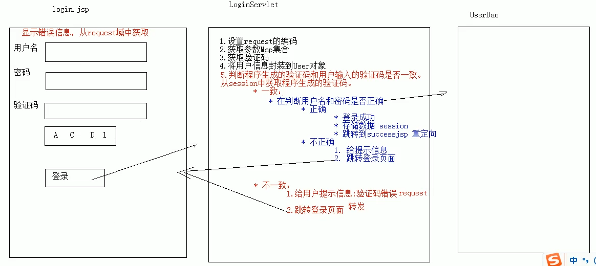

# 04.Session案例-验证码

- 笔记本：07.Cookie和Session
- 创建时间：2020-02-02 05:17:59 UTC
- 更新时间：2020-02-02 05:21:35 UTC
- 印象笔记 GUID：660dd12d-37d9-410e-9d6b-74bb3bedf027

1. 案例需求:

  1. 访问带有验证码的登录页面login.jsp

  1. 用户输入用户名，密码以及验证码。

    - 如果用户名和密码输入有误，跳转登录页面，提示：用户名或密码错误

    - 如果验证码输入有误，跳转登录页面，提示：验证码错误

    - 如果全部输入正确，则跳转到主页success.jsp，显示：用户名，欢迎您

1. 分析：
 

```

```

1.%20%E6%A1%88%E4%BE%8B%E9%9C%80%E6%B1%82%3A%0A%20%20%20%201.%20%E8%AE%BF%E9%97%AE%E5%B8%A6%E6%9C%89%E9%AA%8C%E8%AF%81%E7%A0%81%E7%9A%84%E7%99%BB%E5%BD%95%E9%A1%B5%E9%9D%A2login.jsp%0A%20%20%20%202.%20%E7%94%A8%E6%88%B7%E8%BE%93%E5%85%A5%E7%94%A8%E6%88%B7%E5%90%8D%EF%BC%8C%E5%AF%86%E7%A0%81%E4%BB%A5%E5%8F%8A%E9%AA%8C%E8%AF%81%E7%A0%81%E3%80%82%0A%20%20%20%20%20%20%20%20*%20%E5%A6%82%E6%9E%9C%E7%94%A8%E6%88%B7%E5%90%8D%E5%92%8C%E5%AF%86%E7%A0%81%E8%BE%93%E5%85%A5%E6%9C%89%E8%AF%AF%EF%BC%8C%E8%B7%B3%E8%BD%AC%E7%99%BB%E5%BD%95%E9%A1%B5%E9%9D%A2%EF%BC%8C%E6%8F%90%E7%A4%BA%EF%BC%9A%E7%94%A8%E6%88%B7%E5%90%8D%E6%88%96%E5%AF%86%E7%A0%81%E9%94%99%E8%AF%AF%0A%20%20%20%20%20%20%20%20*%20%E5%A6%82%E6%9E%9C%E9%AA%8C%E8%AF%81%E7%A0%81%E8%BE%93%E5%85%A5%E6%9C%89%E8%AF%AF%EF%BC%8C%E8%B7%B3%E8%BD%AC%E7%99%BB%E5%BD%95%E9%A1%B5%E9%9D%A2%EF%BC%8C%E6%8F%90%E7%A4%BA%EF%BC%9A%E9%AA%8C%E8%AF%81%E7%A0%81%E9%94%99%E8%AF%AF%0A%20%20%20%20%20%20%20%20*%20%E5%A6%82%E6%9E%9C%E5%85%A8%E9%83%A8%E8%BE%93%E5%85%A5%E6%AD%A3%E7%A1%AE%EF%BC%8C%E5%88%99%E8%B7%B3%E8%BD%AC%E5%88%B0%E4%B8%BB%E9%A1%B5success.jsp%EF%BC%8C%E6%98%BE%E7%A4%BA%EF%BC%9A%E7%94%A8%E6%88%B7%E5%90%8D%EF%BC%8C%E6%AC%A2%E8%BF%8E%E6%82%A8%0A2.%20%E5%88%86%E6%9E%90%EF%BC%9A%0A!%5B8ffd8e343b0c425a10aeb0d0e465629e.png%5D(en-resource%3A%2F%2Fdatabase%2F1272%3A0)%0A%0A%60%60%60java%0A%0A%60%60%60
