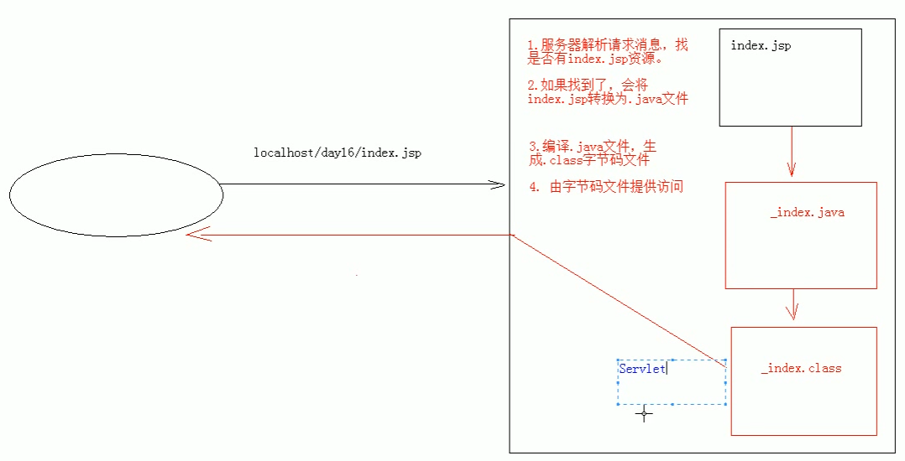

# 01.JSP：入门学习

- 笔记本：08.JSP、EL和JSTL
- 创建时间：2020-02-01 08:32:31 UTC
- 更新时间：2020-02-02 03:54:55 UTC
- 印象笔记 GUID：6d4bd375-48e5-488d-9707-c5fb8c52e3d5

1.
概念：

  - Java Server Pages：java服务器端页面

    - 可以理解为：一个特殊的页面，其中既可以指定定义html 标签，又可以定义java 代码

    - 用于简化书写

1.
原理：

  - JSP 本质上就是一个Servlet
 
 **原理补充：** 查看log 中的目录，当服务器启动后，对应目录中生成work 目录，放的就是Jsp对应的执行文件以及字节码文件，打开 index_jsp.java，可以看到 `public final class index_jsp extends org.apache.jasper.runtime.HttpJspBase` 通过查看tomcat 源码可以知道 HttpJspBase 继承 HttpServlet `public abstract classs HttpJspBase extends HttpServlet implements HttpJspPage`

1.
JSP 的脚本：

  1. <% 代码 %>：定义的java 代码，在service 方法中。service 方法中更可以定义什么，该脚本中就可以定义什么。

  1. <%! 代码 %>：定义的java 代码，在jsp 转换后的java类的成员位置。（很少用，可能会引发线程安全问题）

  1. <%= 代码 %>：定义的java 代码，会输出到页面上，输出语句中可以定义什么，该脚本中就可以定义什么。

1.
JSP 的内置对象：

  - 在Jsp 中不需要获取和创建，可以直接使用的对象

  - Jsp 一共有9个内置对象。

    - request

    - response

    - out：可以将数据输出到页面上。和response.getWriter() 类似

      - response.getWriter() 和out.writer() 的区别：

        - 在tomcat 服务器真正给客户端做出响应之前，会先找response 缓冲区数据，再找out 缓冲区数据。

        - response.getWriter() 数据输出永远在out.write

1.%20%E6%A6%82%E5%BF%B5%EF%BC%9A%0A%20%20%20%20*%20Java%20Server%20Pages%EF%BC%9Ajava%E6%9C%8D%E5%8A%A1%E5%99%A8%E7%AB%AF%E9%A1%B5%E9%9D%A2%0A%20%20%20%20%20%20%20%20*%20%E5%8F%AF%E4%BB%A5%E7%90%86%E8%A7%A3%E4%B8%BA%EF%BC%9A%E4%B8%80%E4%B8%AA%E7%89%B9%E6%AE%8A%E7%9A%84%E9%A1%B5%E9%9D%A2%EF%BC%8C%E5%85%B6%E4%B8%AD%E6%97%A2%E5%8F%AF%E4%BB%A5%E6%8C%87%E5%AE%9A%E5%AE%9A%E4%B9%89html%20%E6%A0%87%E7%AD%BE%EF%BC%8C%E5%8F%88%E5%8F%AF%E4%BB%A5%E5%AE%9A%E4%B9%89java%20%E4%BB%A3%E7%A0%81%0A%20%20%20%20%20%20%20%20*%20%E7%94%A8%E4%BA%8E%E7%AE%80%E5%8C%96%E4%B9%A6%E5%86%99%0A2.%20%E5%8E%9F%E7%90%86%EF%BC%9A%0A%20%20%20%20*%20JSP%20%E6%9C%AC%E8%B4%A8%E4%B8%8A%E5%B0%B1%E6%98%AF%E4%B8%80%E4%B8%AAServlet%0A%20%20%20%20!%5B5c437c9b3a04e852e93a77c7cdea055d.png%5D(en-resource%3A%2F%2Fdatabase%2F1264%3A0)%0A**%E5%8E%9F%E7%90%86%E8%A1%A5%E5%85%85%EF%BC%9A**%20%E6%9F%A5%E7%9C%8Blog%20%E4%B8%AD%E7%9A%84%E7%9B%AE%E5%BD%95%EF%BC%8C%E5%BD%93%E6%9C%8D%E5%8A%A1%E5%99%A8%E5%90%AF%E5%8A%A8%E5%90%8E%EF%BC%8C%E5%AF%B9%E5%BA%94%E7%9B%AE%E5%BD%95%E4%B8%AD%E7%94%9F%E6%88%90work%20%E7%9B%AE%E5%BD%95%EF%BC%8C%E6%94%BE%E7%9A%84%E5%B0%B1%E6%98%AFJsp%E5%AF%B9%E5%BA%94%E7%9A%84%E6%89%A7%E8%A1%8C%E6%96%87%E4%BB%B6%E4%BB%A5%E5%8F%8A%E5%AD%97%E8%8A%82%E7%A0%81%E6%96%87%E4%BB%B6%EF%BC%8C%E6%89%93%E5%BC%80%20index_jsp.java%EF%BC%8C%E5%8F%AF%E4%BB%A5%E7%9C%8B%E5%88%B0%20%60public%20final%20class%20index_jsp%20extends%20org.apache.jasper.runtime.HttpJspBase%60%20%20%E9%80%9A%E8%BF%87%E6%9F%A5%E7%9C%8Btomcat%20%E6%BA%90%E7%A0%81%E5%8F%AF%E4%BB%A5%E7%9F%A5%E9%81%93%20HttpJspBase%20%E7%BB%A7%E6%89%BF%20HttpServlet%20%60public%20abstract%20classs%20HttpJspBase%20extends%20HttpServlet%20implements%20HttpJspPage%60%0A%0A3.%20JSP%20%E7%9A%84%E8%84%9A%E6%9C%AC%EF%BC%9A%0A%20%20%20%201.%20%3C%25%20%E4%BB%A3%E7%A0%81%20%25%3E%EF%BC%9A%E5%AE%9A%E4%B9%89%E7%9A%84java%20%E4%BB%A3%E7%A0%81%EF%BC%8C%E5%9C%A8service%20%E6%96%B9%E6%B3%95%E4%B8%AD%E3%80%82service%20%E6%96%B9%E6%B3%95%E4%B8%AD%E6%9B%B4%E5%8F%AF%E4%BB%A5%E5%AE%9A%E4%B9%89%E4%BB%80%E4%B9%88%EF%BC%8C%E8%AF%A5%E8%84%9A%E6%9C%AC%E4%B8%AD%E5%B0%B1%E5%8F%AF%E4%BB%A5%E5%AE%9A%E4%B9%89%E4%BB%80%E4%B9%88%E3%80%82%0A%20%20%20%202.%20%3C%25!%20%E4%BB%A3%E7%A0%81%20%25%3E%EF%BC%9A%E5%AE%9A%E4%B9%89%E7%9A%84java%20%E4%BB%A3%E7%A0%81%EF%BC%8C%E5%9C%A8jsp%20%E8%BD%AC%E6%8D%A2%E5%90%8E%E7%9A%84java%E7%B1%BB%E7%9A%84%E6%88%90%E5%91%98%E4%BD%8D%E7%BD%AE%E3%80%82%EF%BC%88%E5%BE%88%E5%B0%91%E7%94%A8%EF%BC%8C%E5%8F%AF%E8%83%BD%E4%BC%9A%E5%BC%95%E5%8F%91%E7%BA%BF%E7%A8%8B%E5%AE%89%E5%85%A8%E9%97%AE%E9%A2%98%EF%BC%89%0A%20%20%20%203.%20%3C%25%3D%20%E4%BB%A3%E7%A0%81%20%25%3E%EF%BC%9A%E5%AE%9A%E4%B9%89%E7%9A%84java%20%E4%BB%A3%E7%A0%81%EF%BC%8C%E4%BC%9A%E8%BE%93%E5%87%BA%E5%88%B0%E9%A1%B5%E9%9D%A2%E4%B8%8A%EF%BC%8C%E8%BE%93%E5%87%BA%E8%AF%AD%E5%8F%A5%E4%B8%AD%E5%8F%AF%E4%BB%A5%E5%AE%9A%E4%B9%89%E4%BB%80%E4%B9%88%EF%BC%8C%E8%AF%A5%E8%84%9A%E6%9C%AC%E4%B8%AD%E5%B0%B1%E5%8F%AF%E4%BB%A5%E5%AE%9A%E4%B9%89%E4%BB%80%E4%B9%88%E3%80%82%0A%0A4.%20JSP%20%E7%9A%84%E5%86%85%E7%BD%AE%E5%AF%B9%E8%B1%A1%EF%BC%9A%0A%20%20%20%20*%20%E5%9C%A8Jsp%20%E4%B8%AD%E4%B8%8D%E9%9C%80%E8%A6%81%E8%8E%B7%E5%8F%96%E5%92%8C%E5%88%9B%E5%BB%BA%EF%BC%8C%E5%8F%AF%E4%BB%A5%E7%9B%B4%E6%8E%A5%E4%BD%BF%E7%94%A8%E7%9A%84%E5%AF%B9%E8%B1%A1%0A%20%20%20%20*%20Jsp%20%E4%B8%80%E5%85%B1%E6%9C%899%E4%B8%AA%E5%86%85%E7%BD%AE%E5%AF%B9%E8%B1%A1%E3%80%82%0A%20%20%20%20%20%20%20%20*%20request%0A%20%20%20%20%20%20%20%20*%20response%0A%20%20%20%20%20%20%20%20*%20out%EF%BC%9A%E5%8F%AF%E4%BB%A5%E5%B0%86%E6%95%B0%E6%8D%AE%E8%BE%93%E5%87%BA%E5%88%B0%E9%A1%B5%E9%9D%A2%E4%B8%8A%E3%80%82%E5%92%8Cresponse.getWriter()%20%E7%B1%BB%E4%BC%BC%0A%20%20%20%20%20%20%20%20%20%20%20%20*%20response.getWriter()%20%E5%92%8Cout.writer()%20%E7%9A%84%E5%8C%BA%E5%88%AB%EF%BC%9A%0A%20%20%20%20%20%20%20%20%20%20%20%20%20%20%20%20*%20%E5%9C%A8tomcat%20%E6%9C%8D%E5%8A%A1%E5%99%A8%E7%9C%9F%E6%AD%A3%E7%BB%99%E5%AE%A2%E6%88%B7%E7%AB%AF%E5%81%9A%E5%87%BA%E5%93%8D%E5%BA%94%E4%B9%8B%E5%89%8D%EF%BC%8C%E4%BC%9A%E5%85%88%E6%89%BEresponse%20%E7%BC%93%E5%86%B2%E5%8C%BA%E6%95%B0%E6%8D%AE%EF%BC%8C%E5%86%8D%E6%89%BEout%20%E7%BC%93%E5%86%B2%E5%8C%BA%E6%95%B0%E6%8D%AE%E3%80%82%0A%20%20%20%20%20%20%20%20%20%20%20%20%20%20%20%20*%20response.getWriter()%20%E6%95%B0%E6%8D%AE%E8%BE%93%E5%87%BA%E6%B0%B8%E8%BF%9C%E5%9C%A8out.write()%20%E4%B9%8B%E5%89%8D%E3%80%82
