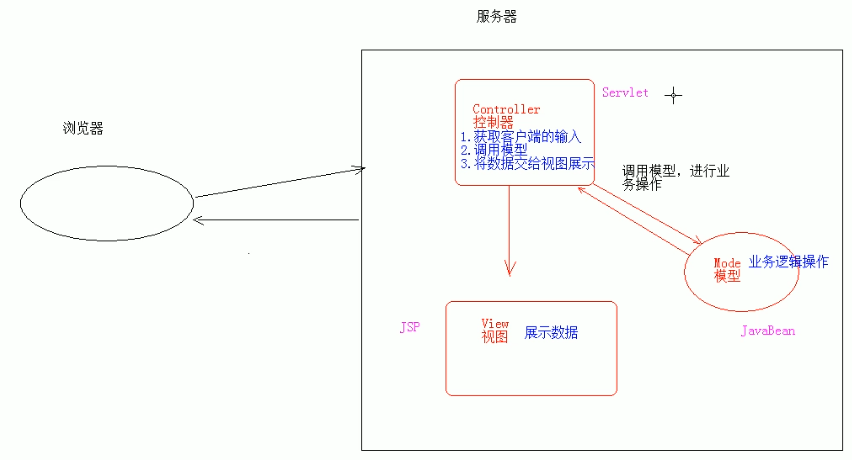

# 03.MVC

- 笔记本：08.JSP、EL和JSTL
- 创建时间：2020-02-02 07:57:19 UTC
- 更新时间：2020-02-02 08:07:20 UTC
- 印象笔记 GUID：c5df55c1-0fa0-4122-9576-eaeb29d7ee22

#### MVC：开发模式

1.
JSP 演变历史

  1. 早期只有servlet，只能使用response 输出标签数据，非常麻烦

  1. 后来有了jsp，简化了Servlet 的开发，如果过度使用jsp，在jsp中即有大量的java 代码，又有html代码，造成难于维护，难于分工协作

  1. 再后来，java web 开发，借鉴MVC 开发模式，使得程序的设计更加合理

1.
MVC：

  1. M：Model，模型。JavaBean

    - 完成具体的业务操作，如：查询数据库，封装对象

  1. V：View，试图。JSP

    - 展示数据

  1. C：Controller，控制器。Servlet

    - 获取用户的输入

    - 调用模型

    - 将数据交给视图展示
 

1.
MVC 优缺点：

  1. 优点：

    1. 耦合性低，方便维护，利于分工协作

    1. 重用性高

  1. 缺点：使得项目架构变得复杂，对

%23%23%23%23%20MVC%EF%BC%9A%E5%BC%80%E5%8F%91%E6%A8%A1%E5%BC%8F%0A1.%20JSP%20%E6%BC%94%E5%8F%98%E5%8E%86%E5%8F%B2%0A%20%20%20%201.%20%E6%97%A9%E6%9C%9F%E5%8F%AA%E6%9C%89servlet%EF%BC%8C%E5%8F%AA%E8%83%BD%E4%BD%BF%E7%94%A8response%20%E8%BE%93%E5%87%BA%E6%A0%87%E7%AD%BE%E6%95%B0%E6%8D%AE%EF%BC%8C%E9%9D%9E%E5%B8%B8%E9%BA%BB%E7%83%A6%0A%20%20%20%202.%20%E5%90%8E%E6%9D%A5%E6%9C%89%E4%BA%86jsp%EF%BC%8C%E7%AE%80%E5%8C%96%E4%BA%86Servlet%20%E7%9A%84%E5%BC%80%E5%8F%91%EF%BC%8C%E5%A6%82%E6%9E%9C%E8%BF%87%E5%BA%A6%E4%BD%BF%E7%94%A8jsp%EF%BC%8C%E5%9C%A8jsp%E4%B8%AD%E5%8D%B3%E6%9C%89%E5%A4%A7%E9%87%8F%E7%9A%84java%20%E4%BB%A3%E7%A0%81%EF%BC%8C%E5%8F%88%E6%9C%89html%E4%BB%A3%E7%A0%81%EF%BC%8C%E9%80%A0%E6%88%90%E9%9A%BE%E4%BA%8E%E7%BB%B4%E6%8A%A4%EF%BC%8C%E9%9A%BE%E4%BA%8E%E5%88%86%E5%B7%A5%E5%8D%8F%E4%BD%9C%0A%20%20%20%203.%20%E5%86%8D%E5%90%8E%E6%9D%A5%EF%BC%8Cjava%20web%20%E5%BC%80%E5%8F%91%EF%BC%8C%E5%80%9F%E9%89%B4MVC%20%E5%BC%80%E5%8F%91%E6%A8%A1%E5%BC%8F%EF%BC%8C%E4%BD%BF%E5%BE%97%E7%A8%8B%E5%BA%8F%E7%9A%84%E8%AE%BE%E8%AE%A1%E6%9B%B4%E5%8A%A0%E5%90%88%E7%90%86%0A%0A2.%20MVC%EF%BC%9A%0A%20%20%20%201.%20M%EF%BC%9AModel%EF%BC%8C%E6%A8%A1%E5%9E%8B%E3%80%82JavaBean%0A%20%20%20%20%20%20%20%20*%20%E5%AE%8C%E6%88%90%E5%85%B7%E4%BD%93%E7%9A%84%E4%B8%9A%E5%8A%A1%E6%93%8D%E4%BD%9C%EF%BC%8C%E5%A6%82%EF%BC%9A%E6%9F%A5%E8%AF%A2%E6%95%B0%E6%8D%AE%E5%BA%93%EF%BC%8C%E5%B0%81%E8%A3%85%E5%AF%B9%E8%B1%A1%0A%20%20%20%202.%20V%EF%BC%9AView%EF%BC%8C%E8%AF%95%E5%9B%BE%E3%80%82JSP%0A%20%20%20%20%20%20%20%20*%20%E5%B1%95%E7%A4%BA%E6%95%B0%E6%8D%AE%0A%20%20%20%203.%20C%EF%BC%9AController%EF%BC%8C%E6%8E%A7%E5%88%B6%E5%99%A8%E3%80%82Servlet%0A%20%20%20%20%20%20%20%20*%20%E8%8E%B7%E5%8F%96%E7%94%A8%E6%88%B7%E7%9A%84%E8%BE%93%E5%85%A5%0A%20%20%20%20%20%20%20%20*%20%E8%B0%83%E7%94%A8%E6%A8%A1%E5%9E%8B%0A%20%20%20%20%20%20%20%20*%20%E5%B0%86%E6%95%B0%E6%8D%AE%E4%BA%A4%E7%BB%99%E8%A7%86%E5%9B%BE%E5%B1%95%E7%A4%BA%0A!%5Beb3a590bace47ae650e232b4ee26611b.png%5D(en-resource%3A%2F%2Fdatabase%2F1278%3A0)%0A%0A3.%20MVC%20%E4%BC%98%E7%BC%BA%E7%82%B9%EF%BC%9A%0A%20%20%20%201.%20%E4%BC%98%E7%82%B9%EF%BC%9A%0A%20%20%20%20%20%20%20%201.%20%E8%80%A6%E5%90%88%E6%80%A7%E4%BD%8E%EF%BC%8C%E6%96%B9%E4%BE%BF%E7%BB%B4%E6%8A%A4%EF%BC%8C%E5%88%A9%E4%BA%8E%E5%88%86%E5%B7%A5%E5%8D%8F%E4%BD%9C%0A%20%20%20%20%20%20%20%202.%20%E9%87%8D%E7%94%A8%E6%80%A7%E9%AB%98%0A%20%20%20%202.%20%E7%BC%BA%E7%82%B9%EF%BC%9A%E4%BD%BF%E5%BE%97%E9%A1%B9%E7%9B%AE%E6%9E%B6%E6%9E%84%E5%8F%98%E5%BE%97%E5%A4%8D%E6%9D%82%EF%BC%8C%E5%AF%B9%E5%BC%80%E5%8F%91%E4%BA%BA%E5%91%98%E8%A6%81%E6%B1%82%E9%AB%98
