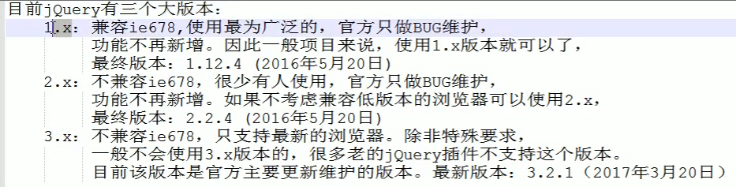
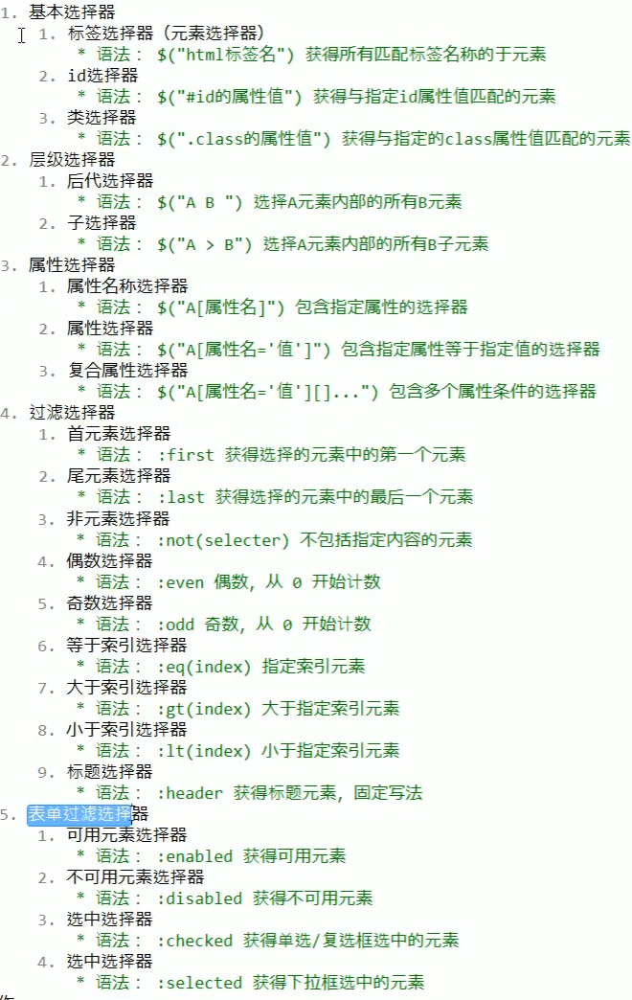

# 01.JQuery快速入门

- 笔记本：10.JQuery
- 创建时间：2020-02-16 17:25:23 UTC
- 更新时间：2020-02-16 18:10:50 UTC
- 原始链接：https://baike.baidu.com/item/jQuery/5385065?fr=aladdin
- 印象笔记 GUID：252945de-0afa-435e-8a0f-d75dedaac2c4

JQuery 基础：

1.
概念：一个JavaScript 框架。简化JS 开发

  - jQuery是一个快速、简洁的JavaScript框架，是继Prototype之后又一个优秀的JavaScript代码库（或JavaScript框架）。jQuery设计的宗旨是“write Less，Do More”，即倡导写更少的代码，做更多的事情。它封装JavaScript常用的功能代码，提供一种简便的JavaScript设计模式，优化HTML文档操作、事件处理、动画设计和Ajax交互。

  - JavaScript 框架：本质上就是一些js 文件，封装了js 的原生代码而已。
 **eg：自定义js 框架**

```
// liudezhi.js
function $(id) {
    var obj = document.getElementById(id);
    return obj;
}

```

```
<!DOCTYPE html>
<html lang="en">
<head>
    <meta charset="UTF-8">
    <meta name="viewport" content="width=device-width, initial-scale=1.0">
    <title>自定义JS 框架</title>
    <script src="js/liudezhi.js"></script>
</head>
<body>
    <div id="div1">div1...</div>
    <div id="div2">div2...</div>
    <script>
        // 1. 根据id 获取元素对象
        // var div1 = document.getElementById("div1");
        // var div2 = document.getElementById("div2");
        var div1 = $("div1");
        var div2 = $("div2");
        // 2. 获取标签体内容
        alert(div1.innerHTML);
        alert(div2.innerHTML);
    </script>
</body>
</html>

```

1.
快速入门

  1. 步骤：

    1. 下载JQuery
 

      - jquery-版本.js 与 jquery-版本.min.js 区别：

        1. jquery-版本.js：开发版本。给程序员看的，有良好的注释和缩进。

        1. jquery-版本.min.js：生成版本。程序中使用，没有缩进。体积小一些。程序加载更快

    1. 导入JQuery的js文件：导入 min.js 文件

    1. 使用

```
<!DOCTYPE html>
<html lang="en">
<head>
    <meta charset="UTF-8">
    <meta name="viewport" content="width=device-width, initial-scale=1.0">
    <title>自定义JS 框架</title>
    <script src="js/jquery-2.2.1.min.js"></script>
</head>
<body>
    <div id="div1">div1...</div>
    <div id="div2">div2...</div>
    <script>
        // 使用JQuery 获取元素对象
        var div1 = $("#div1");
        var div2 = $("#div2");
        alert(div1.html());
        alert(div2.html());
    </script>
</body>
</html>

```

1.
JQuery 对象和 JS 对象区别于转换

  - jq --> js：jquery对象[索引] 或者 jquery对象.get(索引)

  - js --> jq：$(js对象)

1.
选择器：赛选具有相同特征的元素（标签）

  1. 基本语法学习：

    1. 事件绑定

```
<!DOCTYPE html>
<html lang="en">
<head>
    <meta charset="UTF-8">
    <meta name="viewport" content="width=device-width, initial-scale=1.0">
    <title>事件绑</title>
    <script src="js/jquery-2.2.1.min.js"></script>
    <script>
        /*window.onload = function() {
            // ...
        }*/
        // jquery 入口函数（dom文档加载完成之后执行该函数中的代码）
        $(function() {
            $("#button1").click(function() {
                alert("aaa");
            });
        });

    /*
        window.onload 和 $(function)的区别
            * window.onload 只能定义一次，如果定义多次，后面的会把前面的覆盖掉
            * $(function) 可以定义多次
    */

    </script>
</head>
<body>
    <input type="button" value="点我" id="button1">
    <script>
        // 给button1 按钮添加单击事件
        // // 1. 获取button1 按钮
        // $("#button1").click(function() {
        //     alert("aaa");
        // });
    </script>
</body>
</html>

```

2. 入口函数
 3. 样式
 2. 分类：
 

1.
DOM 操作

1.
案例

JQuery%20%E5%9F%BA%E7%A1%80%EF%BC%9A%0A1.%20%E6%A6%82%E5%BF%B5%EF%BC%9A%E4%B8%80%E4%B8%AAJavaScript%20%E6%A1%86%E6%9E%B6%E3%80%82%E7%AE%80%E5%8C%96JS%20%E5%BC%80%E5%8F%91%0A%20%20%20%20*%20jQuery%E6%98%AF%E4%B8%80%E4%B8%AA%E5%BF%AB%E9%80%9F%E3%80%81%E7%AE%80%E6%B4%81%E7%9A%84JavaScript%E6%A1%86%E6%9E%B6%EF%BC%8C%E6%98%AF%E7%BB%A7Prototype%E4%B9%8B%E5%90%8E%E5%8F%88%E4%B8%80%E4%B8%AA%E4%BC%98%E7%A7%80%E7%9A%84JavaScript%E4%BB%A3%E7%A0%81%E5%BA%93%EF%BC%88%E6%88%96JavaScript%E6%A1%86%E6%9E%B6%EF%BC%89%E3%80%82jQuery%E8%AE%BE%E8%AE%A1%E7%9A%84%E5%AE%97%E6%97%A8%E6%98%AF%E2%80%9Cwrite%20Less%EF%BC%8CDo%20More%E2%80%9D%EF%BC%8C%E5%8D%B3%E5%80%A1%E5%AF%BC%E5%86%99%E6%9B%B4%E5%B0%91%E7%9A%84%E4%BB%A3%E7%A0%81%EF%BC%8C%E5%81%9A%E6%9B%B4%E5%A4%9A%E7%9A%84%E4%BA%8B%E6%83%85%E3%80%82%E5%AE%83%E5%B0%81%E8%A3%85JavaScript%E5%B8%B8%E7%94%A8%E7%9A%84%E5%8A%9F%E8%83%BD%E4%BB%A3%E7%A0%81%EF%BC%8C%E6%8F%90%E4%BE%9B%E4%B8%80%E7%A7%8D%E7%AE%80%E4%BE%BF%E7%9A%84JavaScript%E8%AE%BE%E8%AE%A1%E6%A8%A1%E5%BC%8F%EF%BC%8C%E4%BC%98%E5%8C%96HTML%E6%96%87%E6%A1%A3%E6%93%8D%E4%BD%9C%E3%80%81%E4%BA%8B%E4%BB%B6%E5%A4%84%E7%90%86%E3%80%81%E5%8A%A8%E7%94%BB%E8%AE%BE%E8%AE%A1%E5%92%8CAjax%E4%BA%A4%E4%BA%92%E3%80%82%0A%20%20%20%20*%20JavaScript%20%E6%A1%86%E6%9E%B6%EF%BC%9A%E6%9C%AC%E8%B4%A8%E4%B8%8A%E5%B0%B1%E6%98%AF%E4%B8%80%E4%BA%9Bjs%20%E6%96%87%E4%BB%B6%EF%BC%8C%E5%B0%81%E8%A3%85%E4%BA%86js%20%E7%9A%84%E5%8E%9F%E7%94%9F%E4%BB%A3%E7%A0%81%E8%80%8C%E5%B7%B2%E3%80%82%0A**eg%EF%BC%9A%E8%87%AA%E5%AE%9A%E4%B9%89js%20%E6%A1%86%E6%9E%B6**%0A%20%20%20%20%60%60%60javascript%0A%20%20%20%20%2F%2F%20liudezhi.js%0A%20%20%20%20function%C2%A0%24(id)%C2%A0%7B%0A%20%20%20%20%20%20%20%20var%C2%A0obj%C2%A0%3D%C2%A0document.getElementById(id)%3B%0A%20%20%20%20%20%20%20%20return%C2%A0obj%3B%0A%20%20%20%20%7D%0A%20%20%20%20%60%60%60%0A%0A%20%20%20%20%60%60%60html%0A%20%20%20%20%3C!DOCTYPE%C2%A0html%3E%0A%20%20%20%20%3Chtml%C2%A0lang%3D%22en%22%3E%0A%20%20%20%20%3Chead%3E%0A%20%20%20%20%20%20%20%20%3Cmeta%C2%A0charset%3D%22UTF-8%22%3E%0A%20%20%20%20%20%20%20%20%3Cmeta%C2%A0name%3D%22viewport%22%C2%A0content%3D%22width%3Ddevice-width%2C%C2%A0initial-scale%3D1.0%22%3E%0A%20%20%20%20%20%20%20%20%3Ctitle%3E%E8%87%AA%E5%AE%9A%E4%B9%89JS%C2%A0%E6%A1%86%E6%9E%B6%3C%2Ftitle%3E%0A%20%20%20%20%20%20%20%20%3Cscript%C2%A0src%3D%22js%2Fliudezhi.js%22%3E%3C%2Fscript%3E%0A%20%20%20%20%3C%2Fhead%3E%0A%20%20%20%20%3Cbody%3E%0A%20%20%20%20%20%20%20%20%3Cdiv%C2%A0id%3D%22div1%22%3Ediv1...%3C%2Fdiv%3E%0A%20%20%20%20%20%20%20%20%3Cdiv%C2%A0id%3D%22div2%22%3Ediv2...%3C%2Fdiv%3E%0A%20%20%20%20%20%20%20%20%3Cscript%3E%0A%20%20%20%20%20%20%20%20%20%20%20%20%2F%2F%C2%A01.%C2%A0%E6%A0%B9%E6%8D%AEid%C2%A0%E8%8E%B7%E5%8F%96%E5%85%83%E7%B4%A0%E5%AF%B9%E8%B1%A1%0A%20%20%20%20%20%20%20%20%20%20%20%20%2F%2F%C2%A0var%C2%A0div1%C2%A0%3D%C2%A0document.getElementById(%22div1%22)%3B%0A%20%20%20%20%20%20%20%20%20%20%20%20%2F%2F%C2%A0var%C2%A0div2%C2%A0%3D%C2%A0document.getElementById(%22div2%22)%3B%0A%20%20%20%20%20%20%20%20%20%20%20%20var%C2%A0div1%C2%A0%3D%C2%A0%24(%22div1%22)%3B%0A%20%20%20%20%20%20%20%20%20%20%20%20var%C2%A0div2%C2%A0%3D%C2%A0%24(%22div2%22)%3B%0A%20%20%20%20%20%20%20%20%20%20%20%20%2F%2F%C2%A02.%C2%A0%E8%8E%B7%E5%8F%96%E6%A0%87%E7%AD%BE%E4%BD%93%E5%86%85%E5%AE%B9%0A%20%20%20%20%20%20%20%20%20%20%20%20alert(div1.innerHTML)%3B%0A%20%20%20%20%20%20%20%20%20%20%20%20alert(div2.innerHTML)%3B%0A%20%20%20%20%20%20%20%20%3C%2Fscript%3E%0A%20%20%20%20%3C%2Fbody%3E%0A%20%20%20%20%3C%2Fhtml%3E%0A%20%20%20%20%60%60%60%0A%0A2.%20%E5%BF%AB%E9%80%9F%E5%85%A5%E9%97%A8%0A%20%20%20%201.%20%E6%AD%A5%E9%AA%A4%EF%BC%9A%0A%20%20%20%20%20%20%20%201.%20%E4%B8%8B%E8%BD%BDJQuery%0A%20%20%20%20%20%20%20%20!%5B66c1df7d57991a201585ead8839f7891.png%5D(en-resource%3A%2F%2Fdatabase%2F1334%3A1)%0A%20%20%20%20%20%20%20%20%20%20%20%20*%20jquery-%E7%89%88%E6%9C%AC.js%20%E4%B8%8E%20jquery-%E7%89%88%E6%9C%AC.min.js%20%E5%8C%BA%E5%88%AB%EF%BC%9A%0A%20%20%20%20%20%20%20%20%20%20%20%20%20%20%20%201.%20jquery-%E7%89%88%E6%9C%AC.js%EF%BC%9A%E5%BC%80%E5%8F%91%E7%89%88%E6%9C%AC%E3%80%82%E7%BB%99%E7%A8%8B%E5%BA%8F%E5%91%98%E7%9C%8B%E7%9A%84%EF%BC%8C%E6%9C%89%E8%89%AF%E5%A5%BD%E7%9A%84%E6%B3%A8%E9%87%8A%E5%92%8C%E7%BC%A9%E8%BF%9B%E3%80%82%0A%20%20%20%20%20%20%20%20%20%20%20%20%20%20%20%202.%20jquery-%E7%89%88%E6%9C%AC.min.js%EF%BC%9A%E7%94%9F%E6%88%90%E7%89%88%E6%9C%AC%E3%80%82%E7%A8%8B%E5%BA%8F%E4%B8%AD%E4%BD%BF%E7%94%A8%EF%BC%8C%E6%B2%A1%E6%9C%89%E7%BC%A9%E8%BF%9B%E3%80%82%E4%BD%93%E7%A7%AF%E5%B0%8F%E4%B8%80%E4%BA%9B%E3%80%82%E7%A8%8B%E5%BA%8F%E5%8A%A0%E8%BD%BD%E6%9B%B4%E5%BF%AB%0A%20%20%20%20%20%20%20%202.%20%E5%AF%BC%E5%85%A5JQuery%E7%9A%84js%E6%96%87%E4%BB%B6%EF%BC%9A%E5%AF%BC%E5%85%A5%20min.js%20%E6%96%87%E4%BB%B6%0A%20%20%20%20%20%20%20%203.%20%E4%BD%BF%E7%94%A8%0A%20%20%20%20%60%60%60html%0A%20%20%20%20%3C!DOCTYPE%C2%A0html%3E%0A%20%20%20%20%3Chtml%C2%A0lang%3D%22en%22%3E%0A%20%20%20%20%3Chead%3E%0A%20%20%20%20%20%20%20%20%3Cmeta%C2%A0charset%3D%22UTF-8%22%3E%0A%20%20%20%20%20%20%20%20%3Cmeta%C2%A0name%3D%22viewport%22%C2%A0content%3D%22width%3Ddevice-width%2C%C2%A0initial-scale%3D1.0%22%3E%0A%20%20%20%20%20%20%20%20%3Ctitle%3E%E8%87%AA%E5%AE%9A%E4%B9%89JS%C2%A0%E6%A1%86%E6%9E%B6%3C%2Ftitle%3E%0A%20%20%20%20%20%20%20%20%3Cscript%C2%A0src%3D%22js%2Fjquery-2.2.1.min.js%22%3E%3C%2Fscript%3E%0A%20%20%20%20%3C%2Fhead%3E%0A%20%20%20%20%3Cbody%3E%0A%20%20%20%20%20%20%20%20%3Cdiv%C2%A0id%3D%22div1%22%3Ediv1...%3C%2Fdiv%3E%0A%20%20%20%20%20%20%20%20%3Cdiv%C2%A0id%3D%22div2%22%3Ediv2...%3C%2Fdiv%3E%0A%20%20%20%20%20%20%20%20%3Cscript%3E%0A%20%20%20%20%20%20%20%20%20%20%20%20%2F%2F%C2%A0%E4%BD%BF%E7%94%A8JQuery%C2%A0%E8%8E%B7%E5%8F%96%E5%85%83%E7%B4%A0%E5%AF%B9%E8%B1%A1%0A%20%20%20%20%20%20%20%20%20%20%20%20var%C2%A0div1%C2%A0%3D%C2%A0%24(%22%23div1%22)%3B%0A%20%20%20%20%20%20%20%20%20%20%20%20var%C2%A0div2%C2%A0%3D%C2%A0%24(%22%23div2%22)%3B%0A%20%20%20%20%20%20%20%20%20%20%20%20alert(div1.html())%3B%0A%20%20%20%20%20%20%20%20%20%20%20%20alert(div2.html())%3B%0A%20%20%20%20%20%20%20%20%3C%2Fscript%3E%0A%20%20%20%20%3C%2Fbody%3E%0A%20%20%20%20%3C%2Fhtml%3E%0A%20%20%20%20%60%60%60%0A3.%20JQuery%20%E5%AF%B9%E8%B1%A1%E5%92%8C%20JS%20%E5%AF%B9%E8%B1%A1%E5%8C%BA%E5%88%AB%E4%BA%8E%E8%BD%AC%E6%8D%A2%0A%20%20%20%20*%20jq%C2%A0--%3E%C2%A0js%EF%BC%9Ajquery%E5%AF%B9%E8%B1%A1%5B%E7%B4%A2%E5%BC%95%5D%C2%A0%E6%88%96%E8%80%85%C2%A0jquery%E5%AF%B9%E8%B1%A1.get(%E7%B4%A2%E5%BC%95)%0A%20%20%20%20*%20js%C2%A0--%3E%C2%A0jq%EF%BC%9A%24(js%E5%AF%B9%E8%B1%A1)%0A%0A4.%20%E9%80%89%E6%8B%A9%E5%99%A8%EF%BC%9A%E8%B5%9B%E9%80%89%E5%85%B7%E6%9C%89%E7%9B%B8%E5%90%8C%E7%89%B9%E5%BE%81%E7%9A%84%E5%85%83%E7%B4%A0%EF%BC%88%E6%A0%87%E7%AD%BE%EF%BC%89%0A%20%20%20%201.%20%E5%9F%BA%E6%9C%AC%E8%AF%AD%E6%B3%95%E5%AD%A6%E4%B9%A0%EF%BC%9A%0A%20%20%20%20%20%20%20%201.%20%E4%BA%8B%E4%BB%B6%E7%BB%91%E5%AE%9A%0A%20%20%20%20%60%60%60html%20%20%20%20%20%20%20%20%0A%20%20%20%20%3C!DOCTYPE%C2%A0html%3E%0A%20%20%20%20%3Chtml%C2%A0lang%3D%22en%22%3E%0A%20%20%20%20%3Chead%3E%0A%20%20%20%20%20%20%20%20%3Cmeta%C2%A0charset%3D%22UTF-8%22%3E%0A%20%20%20%20%20%20%20%20%3Cmeta%C2%A0name%3D%22viewport%22%C2%A0content%3D%22width%3Ddevice-width%2C%C2%A0initial-scale%3D1.0%22%3E%0A%20%20%20%20%20%20%20%20%3Ctitle%3E%E4%BA%8B%E4%BB%B6%E7%BB%91%3C%2Ftitle%3E%0A%20%20%20%20%20%20%20%20%3Cscript%C2%A0src%3D%22js%2Fjquery-2.2.1.min.js%22%3E%3C%2Fscript%3E%0A%20%20%20%20%20%20%20%20%3Cscript%3E%0A%20%20%20%20%20%20%20%20%20%20%20%20%2F*window.onload%C2%A0%3D%C2%A0function()%C2%A0%7B%0A%20%20%20%20%20%20%20%20%20%20%20%20%20%20%20%20%2F%2F%C2%A0...%0A%20%20%20%20%20%20%20%20%20%20%20%20%7D*%2F%0A%20%20%20%20%20%20%20%20%20%20%20%20%2F%2F%C2%A0jquery%C2%A0%E5%85%A5%E5%8F%A3%E5%87%BD%E6%95%B0%EF%BC%88dom%E6%96%87%E6%A1%A3%E5%8A%A0%E8%BD%BD%E5%AE%8C%E6%88%90%E4%B9%8B%E5%90%8E%E6%89%A7%E8%A1%8C%E8%AF%A5%E5%87%BD%E6%95%B0%E4%B8%AD%E7%9A%84%E4%BB%A3%E7%A0%81%EF%BC%89%0A%20%20%20%20%20%20%20%20%20%20%20%20%24(function()%C2%A0%7B%0A%20%20%20%20%20%20%20%20%20%20%20%20%20%20%20%20%24(%22%23button1%22).click(function()%C2%A0%7B%0A%20%20%20%20%20%20%20%20%20%20%20%20%20%20%20%20%20%20%20%20alert(%22aaa%22)%3B%0A%20%20%20%20%20%20%20%20%20%20%20%20%20%20%20%20%7D)%3B%0A%20%20%20%20%20%20%20%20%20%20%20%20%7D)%3B%0A%20%20%20%20%20%20%20%20%20%20%20%20%0A%20%20%20%20%20%20%20%20%2F*%0A%20%20%20%20%20%20%20%20%20%20%20%20window.onload%C2%A0%E5%92%8C%C2%A0%24(function)%E7%9A%84%E5%8C%BA%E5%88%AB%0A%20%20%20%20%20%20%20%20%20%20%20%20%20%20%20%20*%C2%A0window.onload%C2%A0%E5%8F%AA%E8%83%BD%E5%AE%9A%E4%B9%89%E4%B8%80%E6%AC%A1%EF%BC%8C%E5%A6%82%E6%9E%9C%E5%AE%9A%E4%B9%89%E5%A4%9A%E6%AC%A1%EF%BC%8C%E5%90%8E%E9%9D%A2%E7%9A%84%E4%BC%9A%E6%8A%8A%E5%89%8D%E9%9D%A2%E7%9A%84%E8%A6%86%E7%9B%96%E6%8E%89%0A%20%20%20%20%20%20%20%20%20%20%20%20%20%20%20%20*%C2%A0%24(function)%C2%A0%E5%8F%AF%E4%BB%A5%E5%AE%9A%E4%B9%89%E5%A4%9A%E6%AC%A1%0A%20%20%20%20%20%20%20%20*%2F%0A%0A%20%20%20%20%20%20%20%20%3C%2Fscript%3E%0A%20%20%20%20%3C%2Fhead%3E%0A%20%20%20%20%3Cbody%3E%0A%20%20%20%20%20%20%20%20%3Cinput%C2%A0type%3D%22button%22%C2%A0value%3D%22%E7%82%B9%E6%88%91%22%C2%A0id%3D%22button1%22%3E%0A%20%20%20%20%20%20%20%20%3Cscript%3E%0A%20%20%20%20%20%20%20%20%20%20%20%20%2F%2F%C2%A0%E7%BB%99button1%C2%A0%E6%8C%89%E9%92%AE%E6%B7%BB%E5%8A%A0%E5%8D%95%E5%87%BB%E4%BA%8B%E4%BB%B6%0A%20%20%20%20%20%20%20%20%20%20%20%20%2F%2F%C2%A0%2F%2F%C2%A01.%C2%A0%E8%8E%B7%E5%8F%96button1%C2%A0%E6%8C%89%E9%92%AE%0A%20%20%20%20%20%20%20%20%20%20%20%20%2F%2F%C2%A0%24(%22%23button1%22).click(function()%C2%A0%7B%0A%20%20%20%20%20%20%20%20%20%20%20%20%2F%2F%C2%A0%C2%A0%C2%A0%C2%A0%C2%A0alert(%22aaa%22)%3B%0A%20%20%20%20%20%20%20%20%20%20%20%20%2F%2F%C2%A0%7D)%3B%0A%20%20%20%20%20%20%20%20%3C%2Fscript%3E%0A%20%20%20%20%3C%2Fbody%3E%0A%20%20%20%20%3C%2Fhtml%3E%0A%20%20%20%20%60%60%60%0A%20%20%20%20%20%20%20%202.%20%E5%85%A5%E5%8F%A3%E5%87%BD%E6%95%B0%0A%20%20%20%20%20%20%20%203.%20%E6%A0%B7%E5%BC%8F%0A%20%20%20%202.%20%E5%88%86%E7%B1%BB%EF%BC%9A%0A%20%20%20%20%20%20%20%20!%5B3627795e149ed92da37b0f8bdd094d10.png%5D(en-resource%3A%2F%2Fdatabase%2F1336%3A0)%0A%20%20%20%20%20%20%20%20%0A5.%20DOM%20%E6%93%8D%E4%BD%9C%0A6.%20%E6%A1%88%E4%BE%8B
