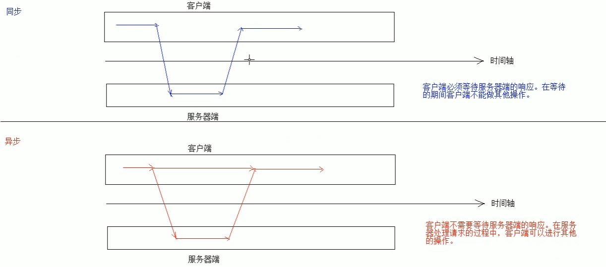

# 01.Ajax概念

- 笔记本：11.Ajax和JSON
- 创建时间：2020-02-17 01:41:50 UTC
- 更新时间：2020-02-17 02:37:41 UTC
- 印象笔记 GUID：15d73ac1-3f31-42ae-bc88-119b28ef2c14

1. 概念：ASynchronous JavaScript And XML 异步的Javascript 和 XML

  1. 异步和同步：客户端和服务器端相互通信的基础上

    - 同步：客户端必须等待服务器端的响应。在等待的期间客户端不能做其他操作。

    - 异步：客户端不需要等待服务器端的响应。在服务器处理请求的过程中，客户端可以进行其他的操作。
 

1.%20%E6%A6%82%E5%BF%B5%EF%BC%9AASynchronous%20JavaScript%20And%20XML%20%E5%BC%82%E6%AD%A5%E7%9A%84Javascript%20%E5%92%8C%20XML%0A%20%20%20%201.%20%E5%BC%82%E6%AD%A5%E5%92%8C%E5%90%8C%E6%AD%A5%EF%BC%9A%E5%AE%A2%E6%88%B7%E7%AB%AF%E5%92%8C%E6%9C%8D%E5%8A%A1%E5%99%A8%E7%AB%AF%E7%9B%B8%E4%BA%92%E9%80%9A%E4%BF%A1%E7%9A%84%E5%9F%BA%E7%A1%80%E4%B8%8A%0A%20%20%20%20%20%20%20%20*%20%E5%90%8C%E6%AD%A5%EF%BC%9A%E5%AE%A2%E6%88%B7%E7%AB%AF%E5%BF%85%E9%A1%BB%E7%AD%89%E5%BE%85%E6%9C%8D%E5%8A%A1%E5%99%A8%E7%AB%AF%E7%9A%84%E5%93%8D%E5%BA%94%E3%80%82%E5%9C%A8%E7%AD%89%E5%BE%85%E7%9A%84%E6%9C%9F%E9%97%B4%E5%AE%A2%E6%88%B7%E7%AB%AF%E4%B8%8D%E8%83%BD%E5%81%9A%E5%85%B6%E4%BB%96%E6%93%8D%E4%BD%9C%E3%80%82%0A%20%20%20%20%20%20%20%20*%20%E5%BC%82%E6%AD%A5%EF%BC%9A%E5%AE%A2%E6%88%B7%E7%AB%AF%E4%B8%8D%E9%9C%80%E8%A6%81%E7%AD%89%E5%BE%85%E6%9C%8D%E5%8A%A1%E5%99%A8%E7%AB%AF%E7%9A%84%E5%93%8D%E5%BA%94%E3%80%82%E5%9C%A8%E6%9C%8D%E5%8A%A1%E5%99%A8%E5%A4%84%E7%90%86%E8%AF%B7%E6%B1%82%E7%9A%84%E8%BF%87%E7%A8%8B%E4%B8%AD%EF%BC%8C%E5%AE%A2%E6%88%B7%E7%AB%AF%E5%8F%AF%E4%BB%A5%E8%BF%9B%E8%A1%8C%E5%85%B6%E4%BB%96%E7%9A%84%E6%93%8D%E4%BD%9C%E3%80%82%0A%20%20%20%20!%5B7c1075b3dfb963e7fbfff27bca1a2b59.png%5D(en-resource%3A%2F%2Fdatabase%2F1344%3A1)%0A%0A
