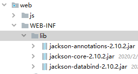

# 05.JSON解析器

- 笔记本：11.Ajax和JSON
- 创建时间：2020-02-17 04:07:28 UTC
- 更新时间：2020-02-17 05:11:15 UTC
- 印象笔记 GUID：42b344c8-ae51-49b1-8f32-cf552c261a30

JSON 数据和Java 对象的相互转换

- JSON 解析器：

  - 常见的解析器：Jsonlib, Gson，fastjson，jackson（springmvc 内置的解析器）

1.
JSON 转为Java 对象

  1. 导入相关jar 包

  1. 创建Jackson 核心对象 ObjectMapper

  1. 调用ObjectMapper的相关方法进行转换

    1. readValue(json字符串数据, Class);

```
@Test
public void test5() throws JsonProcessingException {
    // 1. 初始化JSON 字符串
    String json= "{\"name\":\"zhangsan\",\"age\":23,\"gender\":\"男\",\"birthday\":1581915395523}";

    // 2. 创建 ObjectMapper 对象
    ObjectMapper mapper = new ObjectMapper();
    // 3. 转换为Java 对象 Person 对象
    Person person = mapper.readValue(json, Person.class);
    System.out.println(person);
}

```

1.
Java 对象转为JSON

  1. 使用步骤：

    1.
导入相关jar 包
 

    1.
创建Jackson 核心对象 ObjectMapper

    1.
调用ObjectMapper的相关方法进行转换

      1. 转换方法：

        - writeValue(参数1, obj)

          - 参数1：

            - File:将obj 对象转换为JSON 字符串，并保存到指定的文件中

            - Writer：将obj 对象转换为JSON 字符串，并将json 数据填充到字符输出流中

            - OutputStream:将obj 对象转换为JSON 字符串，并将 json数据填充到字节输出流中

        - writeValueAsString(obj)：将对象转为json 字符串

```
package cn.liudezhi.test;

import cn.liudezhi.domain.Person;
import com.fasterxml.jackson.databind.ObjectMapper;
import org.junit.Test;

import java.io.File;
import java.io.FileWriter;
import java.io.IOException;

public class JacksonTest {

    // Java 对象转为JSON 字符串
    @Test
    public void test1() throws IOException {
        // 1. 创建Person 对象
        Person p = new Person();
        p.setName("zhangsan");
        p.setAge(23);
        p.setGender("男");

        // 2. 创建Jackson 的核心对象 ObjectMapper
        ObjectMapper mapper = new ObjectMapper();
        // 3. 转换
        /*
            转换方法：
                writeValue(参数1, obj)
                    参数1：
                        File:将obj 对象转换为JSON 字符串，并保存到指定的文件中
                        Writer：将obj 对象转换为JSON 字符串，并将json 数据填充到字符输出流中
                        OutputStream:将obj 对象转换为JSON 字符串，并将 json数据填充到字节输出流中
                writeValueAsString(obj)：将对象转为json 字符串
         */
        String json = mapper.writeValueAsString(p);
        System.out.println(json);

        // wirteValue，将数据写到D:\\a.txt 文件中
        // mapper.writeValue(new File("d://a.txt"), p);

        // writeValue，将数据关联到writer中
        mapper.writeValue(new FileWriter("d://b.txt"), p);
    }
}

```

      1. 注解：

        1. @JsonIgnore：排除属性。

        1. @JsonFormat：属性值的格式化

```
// @JsonIgnore // 忽略改属性
@JsonFormat(pattern = "yyyy-MM-dd")
private Date birthday;

```

      1. 复杂java 对象转换

        1. List：数组

        1. Map：对象格式一致

```
@Test
public void test3() throws JsonProcessingException {
    // 1. 创建Person 对象
    Person p = new Person();
    p.setName("zhangsan");
    p.setAge(23);
    p.setGender("男");
    p.setBirthday(new Date());
    Person p1 = new Person();
    p1.setName("zhangsan");
    p1.setAge(23);
    p1.setGender("男");
    p1.setBirthday(new Date());
    Person p2 = new Person();
    p2.setName("zhangsan");
    p2.setAge(23);
    p2.setGender("男");
    p2.setBirthday(new Date());
    // 创建List 集合
    List<Person> ps = new ArrayList<Person>();
    ps.add(p);
    ps.add(p1);
    ps.add(p2);

    // 2. 转换
    ObjectMapper mapper = new ObjectMapper();
    String json = mapper.writeValueAsString(ps);

    System.out.println(json);
}

@Test
public void test4() throws JsonProcessingException {
    Map<String, Object> map = new HashMap<String, Object>();
    map.put("name", "张三");
    map.put("age", 23);
    map.put("gender", "男");

    ObjectMapper mapper = new ObjectMapper();
    String json = mapper.writeValueAsString(map);
    System.out.println(json);
}

```

JSON%20%E6%95%B0%E6%8D%AE%E5%92%8CJava%20%E5%AF%B9%E8%B1%A1%E7%9A%84%E7%9B%B8%E4%BA%92%E8%BD%AC%E6%8D%A2%0A*%20JSON%20%E8%A7%A3%E6%9E%90%E5%99%A8%EF%BC%9A%0A%20%20%20%20*%20%E5%B8%B8%E8%A7%81%E7%9A%84%E8%A7%A3%E6%9E%90%E5%99%A8%EF%BC%9AJsonlib%2C%20Gson%EF%BC%8Cfastjson%EF%BC%8Cjackson%EF%BC%88springmvc%20%E5%86%85%E7%BD%AE%E7%9A%84%E8%A7%A3%E6%9E%90%E5%99%A8%EF%BC%89%0A1.%20JSON%20%E8%BD%AC%E4%B8%BAJava%20%E5%AF%B9%E8%B1%A1%0A%20%20%20%201.%20%E5%AF%BC%E5%85%A5%E7%9B%B8%E5%85%B3jar%20%E5%8C%85%0A%20%20%20%202.%20%E5%88%9B%E5%BB%BAJackson%20%E6%A0%B8%E5%BF%83%E5%AF%B9%E8%B1%A1%20ObjectMapper%0A%20%20%20%203.%20%E8%B0%83%E7%94%A8ObjectMapper%E7%9A%84%E7%9B%B8%E5%85%B3%E6%96%B9%E6%B3%95%E8%BF%9B%E8%A1%8C%E8%BD%AC%E6%8D%A2%0A%20%20%20%20%20%20%20%201.%20readValue(json%E5%AD%97%E7%AC%A6%E4%B8%B2%E6%95%B0%E6%8D%AE%2C%20Class)%3B%0A%20%20%20%20%20%20%20%20%60%60%60java%0A%20%20%20%20%20%20%20%20%40Test%0A%20%20%20%20%20%20%20%20public%20void%20test5()%20throws%20JsonProcessingException%20%7B%0A%20%20%20%20%20%20%20%20%20%20%20%20%2F%2F%201.%20%E5%88%9D%E5%A7%8B%E5%8C%96JSON%20%E5%AD%97%E7%AC%A6%E4%B8%B2%0A%20%20%20%20%20%20%20%20%20%20%20%20String%20json%3D%20%22%7B%5C%22name%5C%22%3A%5C%22zhangsan%5C%22%2C%5C%22age%5C%22%3A23%2C%5C%22gender%5C%22%3A%5C%22%E7%94%B7%5C%22%2C%5C%22birthday%5C%22%3A1581915395523%7D%22%3B%0A%0A%20%20%20%20%20%20%20%20%20%20%20%20%2F%2F%202.%20%E5%88%9B%E5%BB%BA%20ObjectMapper%20%E5%AF%B9%E8%B1%A1%0A%20%20%20%20%20%20%20%20%20%20%20%20ObjectMapper%20mapper%20%3D%20new%20ObjectMapper()%3B%0A%20%20%20%20%20%20%20%20%20%20%20%20%2F%2F%203.%20%E8%BD%AC%E6%8D%A2%E4%B8%BAJava%20%E5%AF%B9%E8%B1%A1%20Person%20%E5%AF%B9%E8%B1%A1%0A%20%20%20%20%20%20%20%20%20%20%20%20Person%20person%20%3D%20mapper.readValue(json%2C%20Person.class)%3B%0A%20%20%20%20%20%20%20%20%20%20%20%20System.out.println(person)%3B%0A%20%20%20%20%20%20%20%20%7D%0A%20%20%20%20%20%20%20%20%60%60%60%0A%0A2.%20Java%20%E5%AF%B9%E8%B1%A1%E8%BD%AC%E4%B8%BAJSON%0A%20%20%20%201.%20%E4%BD%BF%E7%94%A8%E6%AD%A5%E9%AA%A4%EF%BC%9A%0A%20%20%20%20%20%20%20%201.%20%E5%AF%BC%E5%85%A5%E7%9B%B8%E5%85%B3jar%20%E5%8C%85%0A%20%20%20%20%20%20%20%20!%5B8ec628d4b332ec9a2af8e12be5313522.png%5D(en-resource%3A%2F%2Fdatabase%2F1358%3A0)%0A%20%20%20%20%20%20%20%20%0A%20%20%20%20%20%20%20%202.%20%E5%88%9B%E5%BB%BAJackson%20%E6%A0%B8%E5%BF%83%E5%AF%B9%E8%B1%A1%20ObjectMapper%0A%20%20%20%20%20%20%20%203.%20%E8%B0%83%E7%94%A8ObjectMapper%E7%9A%84%E7%9B%B8%E5%85%B3%E6%96%B9%E6%B3%95%E8%BF%9B%E8%A1%8C%E8%BD%AC%E6%8D%A2%0A%20%20%20%20%20%20%20%20%20%20%20%201.%20%E8%BD%AC%E6%8D%A2%E6%96%B9%E6%B3%95%EF%BC%9A%0A%20%20%20%20%20%20%20%20%20%20%20%20%20%20%20%20*%20writeValue(%E5%8F%82%E6%95%B01%2C%20obj)%C2%A0%C2%A0%C2%A0%20%0A%20%20%20%20%20%20%20%20%20%20%20%20%20%20%20%20%20%20%20%20*%20%E5%8F%82%E6%95%B01%EF%BC%9A%C2%A0%C2%A0%C2%A0%C2%A0%C2%A0%C2%A0%C2%A0%20%0A%20%20%20%20%20%20%20%20%20%20%20%20%20%20%20%20%20%20%20%20%20%20%20%20*%20File%3A%E5%B0%86obj%20%E5%AF%B9%E8%B1%A1%E8%BD%AC%E6%8D%A2%E4%B8%BAJSON%20%E5%AD%97%E7%AC%A6%E4%B8%B2%EF%BC%8C%E5%B9%B6%E4%BF%9D%E5%AD%98%E5%88%B0%E6%8C%87%E5%AE%9A%E7%9A%84%E6%96%87%E4%BB%B6%E4%B8%AD%C2%A0%C2%A0%C2%A0%C2%A0%C2%A0%C2%A0%C2%A0%20%0A%20%20%20%20%20%20%20%20%20%20%20%20%20%20%20%20%20%20%20%20%20%20%20%20*%20Writer%EF%BC%9A%E5%B0%86obj%20%E5%AF%B9%E8%B1%A1%E8%BD%AC%E6%8D%A2%E4%B8%BAJSON%20%E5%AD%97%E7%AC%A6%E4%B8%B2%EF%BC%8C%E5%B9%B6%E5%B0%86json%20%E6%95%B0%E6%8D%AE%E5%A1%AB%E5%85%85%E5%88%B0%E5%AD%97%E7%AC%A6%E8%BE%93%E5%87%BA%E6%B5%81%E4%B8%AD%C2%A0%C2%A0%C2%A0%C2%A0%C2%A0%C2%A0%C2%A0%20%0A%20%20%20%20%20%20%20%20%20%20%20%20%20%20%20%20%20%20%20%20%20%20%20%20*%20OutputStream%3A%E5%B0%86obj%20%E5%AF%B9%E8%B1%A1%E8%BD%AC%E6%8D%A2%E4%B8%BAJSON%20%E5%AD%97%E7%AC%A6%E4%B8%B2%EF%BC%8C%E5%B9%B6%E5%B0%86%20json%E6%95%B0%E6%8D%AE%E5%A1%AB%E5%85%85%E5%88%B0%E5%AD%97%E8%8A%82%E8%BE%93%E5%87%BA%E6%B5%81%E4%B8%AD%0A%20%20%20%20%20%20%20%20%20%20%20%20%20%20%20%20*%20writeValueAsString(obj)%EF%BC%9A%E5%B0%86%E5%AF%B9%E8%B1%A1%E8%BD%AC%E4%B8%BAjson%20%E5%AD%97%E7%AC%A6%E4%B8%B2%0A%0A%0A%20%20%20%20%20%20%20%20%20%20%20%20%60%60%60java%0A%20%20%20%20%20%20%20%20%20%20%20%20package%20cn.liudezhi.test%3B%0A%0A%20%20%20%20%20%20%20%20%20%20%20%20import%20cn.liudezhi.domain.Person%3B%0A%20%20%20%20%20%20%20%20%20%20%20%20import%20com.fasterxml.jackson.databind.ObjectMapper%3B%0A%20%20%20%20%20%20%20%20%20%20%20%20import%20org.junit.Test%3B%0A%0A%20%20%20%20%20%20%20%20%20%20%20%20import%20java.io.File%3B%0A%20%20%20%20%20%20%20%20%20%20%20%20import%20java.io.FileWriter%3B%0A%20%20%20%20%20%20%20%20%20%20%20%20import%20java.io.IOException%3B%0A%0A%20%20%20%20%20%20%20%20%20%20%20%20public%20class%20JacksonTest%20%7B%0A%0A%20%20%20%20%20%20%20%20%20%20%20%20%20%20%20%20%2F%2F%20Java%20%E5%AF%B9%E8%B1%A1%E8%BD%AC%E4%B8%BAJSON%20%E5%AD%97%E7%AC%A6%E4%B8%B2%0A%20%20%20%20%20%20%20%20%20%20%20%20%20%20%20%20%40Test%0A%20%20%20%20%20%20%20%20%20%20%20%20%20%20%20%20public%20void%20test1()%20throws%20IOException%20%7B%0A%20%20%20%20%20%20%20%20%20%20%20%20%20%20%20%20%20%20%20%20%2F%2F%201.%20%E5%88%9B%E5%BB%BAPerson%20%E5%AF%B9%E8%B1%A1%0A%20%20%20%20%20%20%20%20%20%20%20%20%20%20%20%20%20%20%20%20Person%20p%20%3D%20new%20Person()%3B%0A%20%20%20%20%20%20%20%20%20%20%20%20%20%20%20%20%20%20%20%20p.setName(%22zhangsan%22)%3B%0A%20%20%20%20%20%20%20%20%20%20%20%20%20%20%20%20%20%20%20%20p.setAge(23)%3B%0A%20%20%20%20%20%20%20%20%20%20%20%20%20%20%20%20%20%20%20%20p.setGender(%22%E7%94%B7%22)%3B%0A%0A%20%20%20%20%20%20%20%20%20%20%20%20%20%20%20%20%20%20%20%20%2F%2F%202.%20%E5%88%9B%E5%BB%BAJackson%20%E7%9A%84%E6%A0%B8%E5%BF%83%E5%AF%B9%E8%B1%A1%20ObjectMapper%0A%20%20%20%20%20%20%20%20%20%20%20%20%20%20%20%20%20%20%20%20ObjectMapper%20mapper%20%3D%20new%20ObjectMapper()%3B%0A%20%20%20%20%20%20%20%20%20%20%20%20%20%20%20%20%20%20%20%20%2F%2F%203.%20%E8%BD%AC%E6%8D%A2%0A%20%20%20%20%20%20%20%20%20%20%20%20%20%20%20%20%20%20%20%20%2F*%0A%20%20%20%20%20%20%20%20%20%20%20%20%20%20%20%20%20%20%20%20%20%20%20%20%E8%BD%AC%E6%8D%A2%E6%96%B9%E6%B3%95%EF%BC%9A%0A%20%20%20%20%20%20%20%20%20%20%20%20%20%20%20%20%20%20%20%20%20%20%20%20%20%20%20%20writeValue(%E5%8F%82%E6%95%B01%2C%20obj)%0A%20%20%20%20%20%20%20%20%20%20%20%20%20%20%20%20%20%20%20%20%20%20%20%20%20%20%20%20%20%20%20%20%E5%8F%82%E6%95%B01%EF%BC%9A%0A%20%20%20%20%20%20%20%20%20%20%20%20%20%20%20%20%20%20%20%20%20%20%20%20%20%20%20%20%20%20%20%20%20%20%20%20File%3A%E5%B0%86obj%20%E5%AF%B9%E8%B1%A1%E8%BD%AC%E6%8D%A2%E4%B8%BAJSON%20%E5%AD%97%E7%AC%A6%E4%B8%B2%EF%BC%8C%E5%B9%B6%E4%BF%9D%E5%AD%98%E5%88%B0%E6%8C%87%E5%AE%9A%E7%9A%84%E6%96%87%E4%BB%B6%E4%B8%AD%0A%20%20%20%20%20%20%20%20%20%20%20%20%20%20%20%20%20%20%20%20%20%20%20%20%20%20%20%20%20%20%20%20%20%20%20%20Writer%EF%BC%9A%E5%B0%86obj%20%E5%AF%B9%E8%B1%A1%E8%BD%AC%E6%8D%A2%E4%B8%BAJSON%20%E5%AD%97%E7%AC%A6%E4%B8%B2%EF%BC%8C%E5%B9%B6%E5%B0%86json%20%E6%95%B0%E6%8D%AE%E5%A1%AB%E5%85%85%E5%88%B0%E5%AD%97%E7%AC%A6%E8%BE%93%E5%87%BA%E6%B5%81%E4%B8%AD%0A%20%20%20%20%20%20%20%20%20%20%20%20%20%20%20%20%20%20%20%20%20%20%20%20%20%20%20%20%20%20%20%20%20%20%20%20OutputStream%3A%E5%B0%86obj%20%E5%AF%B9%E8%B1%A1%E8%BD%AC%E6%8D%A2%E4%B8%BAJSON%20%E5%AD%97%E7%AC%A6%E4%B8%B2%EF%BC%8C%E5%B9%B6%E5%B0%86%20json%E6%95%B0%E6%8D%AE%E5%A1%AB%E5%85%85%E5%88%B0%E5%AD%97%E8%8A%82%E8%BE%93%E5%87%BA%E6%B5%81%E4%B8%AD%0A%20%20%20%20%20%20%20%20%20%20%20%20%20%20%20%20%20%20%20%20%20%20%20%20%20%20%20%20writeValueAsString(obj)%EF%BC%9A%E5%B0%86%E5%AF%B9%E8%B1%A1%E8%BD%AC%E4%B8%BAjson%20%E5%AD%97%E7%AC%A6%E4%B8%B2%0A%20%20%20%20%20%20%20%20%20%20%20%20%20%20%20%20%20%20%20%20%20*%2F%0A%20%20%20%20%20%20%20%20%20%20%20%20%20%20%20%20%20%20%20%20String%20json%20%3D%20mapper.writeValueAsString(p)%3B%0A%20%20%20%20%20%20%20%20%20%20%20%20%20%20%20%20%20%20%20%20System.out.println(json)%3B%0A%0A%20%20%20%20%20%20%20%20%20%20%20%20%20%20%20%20%20%20%20%20%2F%2F%20wirteValue%EF%BC%8C%E5%B0%86%E6%95%B0%E6%8D%AE%E5%86%99%E5%88%B0D%3A%5C%5Ca.txt%20%E6%96%87%E4%BB%B6%E4%B8%AD%0A%20%20%20%20%20%20%20%20%20%20%20%20%20%20%20%20%20%20%20%20%2F%2F%20mapper.writeValue(new%20File(%22d%3A%2F%2Fa.txt%22)%2C%20p)%3B%0A%0A%20%20%20%20%20%20%20%20%20%20%20%20%20%20%20%20%20%20%20%20%2F%2F%20writeValue%EF%BC%8C%E5%B0%86%E6%95%B0%E6%8D%AE%E5%85%B3%E8%81%94%E5%88%B0writer%E4%B8%AD%0A%20%20%20%20%20%20%20%20%20%20%20%20%20%20%20%20%20%20%20%20mapper.writeValue(new%20FileWriter(%22d%3A%2F%2Fb.txt%22)%2C%20p)%3B%0A%20%20%20%20%20%20%20%20%20%20%20%20%20%20%20%20%7D%0A%20%20%20%20%20%20%20%20%20%20%20%20%7D%0A%20%20%20%20%20%20%20%20%20%20%20%20%60%60%60%0A%0A%20%20%20%20%20%20%20%20%20%20%20%202.%20%E6%B3%A8%E8%A7%A3%EF%BC%9A%0A%20%20%20%20%20%20%20%20%20%20%20%20%20%20%20%201.%20%40JsonIgnore%EF%BC%9A%E6%8E%92%E9%99%A4%E5%B1%9E%E6%80%A7%E3%80%82%0A%20%20%20%20%20%20%20%20%20%20%20%20%20%20%20%202.%20%40JsonFormat%EF%BC%9A%E5%B1%9E%E6%80%A7%E5%80%BC%E7%9A%84%E6%A0%BC%E5%BC%8F%E5%8C%96%0A%20%20%20%20%20%20%20%20%20%20%20%20%20%20%20%20%60%60%60java%0A%20%20%20%20%20%20%20%20%20%20%20%20%20%20%20%20%2F%2F%20%40JsonIgnore%20%2F%2F%20%E5%BF%BD%E7%95%A5%E6%94%B9%E5%B1%9E%E6%80%A7%0A%20%20%20%20%20%20%20%20%20%20%20%20%20%20%20%20%40JsonFormat(pattern%20%3D%20%22yyyy-MM-dd%22)%0A%20%20%20%20%20%20%20%20%20%20%20%20%20%20%20%20private%20Date%20birthday%3B%0A%20%20%20%20%20%20%20%20%20%20%20%20%20%20%20%20%60%60%60%0A%20%20%20%20%20%20%20%20%20%20%20%203.%20%E5%A4%8D%E6%9D%82java%20%E5%AF%B9%E8%B1%A1%E8%BD%AC%E6%8D%A2%0A%20%20%20%20%20%20%20%20%20%20%20%20%20%20%20%201.%20List%EF%BC%9A%E6%95%B0%E7%BB%84%0A%20%20%20%20%20%20%20%20%20%20%20%20%20%20%20%202.%20Map%EF%BC%9A%E5%AF%B9%E8%B1%A1%E6%A0%BC%E5%BC%8F%E4%B8%80%E8%87%B4%0A%20%20%20%20%20%20%20%20%20%20%20%20%20%20%20%20%60%60%60java%0A%20%20%20%20%20%20%20%20%20%20%20%20%20%20%20%20%40Test%0A%20%20%20%20%20%20%20%20%20%20%20%20%20%20%20%20public%20void%20test3()%20throws%20JsonProcessingException%20%7B%0A%20%20%20%20%20%20%20%20%20%20%20%20%20%20%20%20%20%20%20%20%2F%2F%201.%20%E5%88%9B%E5%BB%BAPerson%20%E5%AF%B9%E8%B1%A1%0A%20%20%20%20%20%20%20%20%20%20%20%20%20%20%20%20%20%20%20%20Person%20p%20%3D%20new%20Person()%3B%0A%20%20%20%20%20%20%20%20%20%20%20%20%20%20%20%20%20%20%20%20p.setName(%22zhangsan%22)%3B%0A%20%20%20%20%20%20%20%20%20%20%20%20%20%20%20%20%20%20%20%20p.setAge(23)%3B%0A%20%20%20%20%20%20%20%20%20%20%20%20%20%20%20%20%20%20%20%20p.setGender(%22%E7%94%B7%22)%3B%0A%20%20%20%20%20%20%20%20%20%20%20%20%20%20%20%20%20%20%20%20p.setBirthday(new%20Date())%3B%0A%20%20%20%20%20%20%20%20%20%20%20%20%20%20%20%20%20%20%20%20Person%20p1%20%3D%20new%20Person()%3B%0A%20%20%20%20%20%20%20%20%20%20%20%20%20%20%20%20%20%20%20%20p1.setName(%22zhangsan%22)%3B%0A%20%20%20%20%20%20%20%20%20%20%20%20%20%20%20%20%20%20%20%20p1.setAge(23)%3B%0A%20%20%20%20%20%20%20%20%20%20%20%20%20%20%20%20%20%20%20%20p1.setGender(%22%E7%94%B7%22)%3B%0A%20%20%20%20%20%20%20%20%20%20%20%20%20%20%20%20%20%20%20%20p1.setBirthday(new%20Date())%3B%0A%20%20%20%20%20%20%20%20%20%20%20%20%20%20%20%20%20%20%20%20Person%20p2%20%3D%20new%20Person()%3B%0A%20%20%20%20%20%20%20%20%20%20%20%20%20%20%20%20%20%20%20%20p2.setName(%22zhangsan%22)%3B%0A%20%20%20%20%20%20%20%20%20%20%20%20%20%20%20%20%20%20%20%20p2.setAge(23)%3B%0A%20%20%20%20%20%20%20%20%20%20%20%20%20%20%20%20%20%20%20%20p2.setGender(%22%E7%94%B7%22)%3B%0A%20%20%20%20%20%20%20%20%20%20%20%20%20%20%20%20%20%20%20%20p2.setBirthday(new%20Date())%3B%0A%20%20%20%20%20%20%20%20%20%20%20%20%20%20%20%20%20%20%20%20%2F%2F%20%E5%88%9B%E5%BB%BAList%20%E9%9B%86%E5%90%88%0A%20%20%20%20%20%20%20%20%20%20%20%20%20%20%20%20%20%20%20%20List%3CPerson%3E%20ps%20%3D%20new%20ArrayList%3CPerson%3E()%3B%0A%20%20%20%20%20%20%20%20%20%20%20%20%20%20%20%20%20%20%20%20ps.add(p)%3B%0A%20%20%20%20%20%20%20%20%20%20%20%20%20%20%20%20%20%20%20%20ps.add(p1)%3B%0A%20%20%20%20%20%20%20%20%20%20%20%20%20%20%20%20%20%20%20%20ps.add(p2)%3B%0A%0A%20%20%20%20%20%20%20%20%20%20%20%20%20%20%20%20%20%20%20%20%2F%2F%202.%20%E8%BD%AC%E6%8D%A2%0A%20%20%20%20%20%20%20%20%20%20%20%20%20%20%20%20%20%20%20%20ObjectMapper%20mapper%20%3D%20new%20ObjectMapper()%3B%0A%20%20%20%20%20%20%20%20%20%20%20%20%20%20%20%20%20%20%20%20String%20json%20%3D%20mapper.writeValueAsString(ps)%3B%0A%0A%20%20%20%20%20%20%20%20%20%20%20%20%20%20%20%20%20%20%20%20System.out.println(json)%3B%0A%20%20%20%20%20%20%20%20%20%20%20%20%20%20%20%20%7D%0A%0A%20%20%20%20%20%20%20%20%20%20%20%20%20%20%20%20%40Test%0A%20%20%20%20%20%20%20%20%20%20%20%20%20%20%20%20public%20void%20test4()%20throws%20JsonProcessingException%20%7B%0A%20%20%20%20%20%20%20%20%20%20%20%20%20%20%20%20%20%20%20%20Map%3CString%2C%20Object%3E%20map%20%3D%20new%20HashMap%3CString%2C%20Object%3E()%3B%0A%20%20%20%20%20%20%20%20%20%20%20%20%20%20%20%20%20%20%20%20map.put(%22name%22%2C%20%22%E5%BC%A0%E4%B8%89%22)%3B%0A%20%20%20%20%20%20%20%20%20%20%20%20%20%20%20%20%20%20%20%20map.put(%22age%22%2C%2023)%3B%0A%20%20%20%20%20%20%20%20%20%20%20%20%20%20%20%20%20%20%20%20map.put(%22gender%22%2C%20%22%E7%94%B7%22)%3B%0A%0A%20%20%20%20%20%20%20%20%20%20%20%20%20%20%20%20%20%20%20%20ObjectMapper%20mapper%20%3D%20new%20ObjectMapper()%3B%0A%20%20%20%20%20%20%20%20%20%20%20%20%20%20%20%20%20%20%20%20String%20json%20%3D%20mapper.writeValueAsString(map)%3B%0A%20%20%20%20%20%20%20%20%20%20%20%20%20%20%20%20%20%20%20%20System.out.println(json)%3B%0A%20%20%20%20%20%20%20%20%20%20%20%20%20%20%20%20%7D%0A%20%20%20%20%20%20%20%20%20%20%20%20%20%20%20%20%60%60%60
