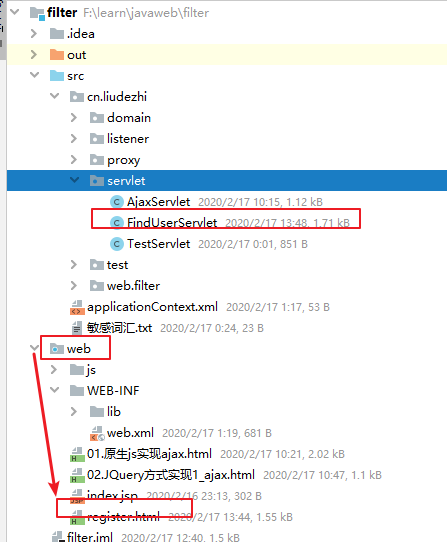

# 06.案例-校验用户名是否存在

- 笔记本：11.Ajax和JSON
- 创建时间：2020-02-17 05:46:35 UTC
- 更新时间：2020-02-17 05:50:51 UTC
- 印象笔记 GUID：8ea00be3-c97c-4d8f-81bd-8e4cdc0854f0

1. 服务器响应的数据，在客户端使用时，要想当作json 数据格式使用

  1. $.get(type)：将最后一个参数type 指定为"json"

  1. 在服务器端设置MIME 类型：`response.setContentType("application/json;charset=utf-8");`

```
<!DOCTYPE html>
<html lang="en">
<head>
    <meta charset="UTF-8">
    <title>注册页面</title>
    <script src="js/jquery-2.2.1.min.js"></script>
    <script>
        // 在页面加载完成后
        $(function() {
            // 给username 绑定blur 事件
            $("#username").blur(function () {
                // 获取username文本输入框的值
                var username = $(this).val();
                // 发送ajax 请求
                // 期望服务器响应回的数据格式：{"userExsit": ture, "msg":"此用户名已存在"}
                //                           {"userExsit": false, "msg":"用户名可用"}
                $.get("findUserServlet", {username: username}, function(data) {
                    var span = $("#s_username");
                    // 判断userExist 键的值是否是true
                    if(data.userExsit)  {
                        span.css("color", "red");
                        span.html(data.msg);
                    } else {
                        span.css("color", "green");
                        span.html(data.msg);
                    }
                },"json");
            })
        });
    </script>
</head>
<body>
    <form>
        <input type="text" id="username" name="username" placeholder="请输入用户名">
        <span id="s_username"></span><br data-tomark-pass>        <input type="password" name="password" placeholder="请输入密码"><br data-tomark-pass>        <input type="button" value="注册"><br data-tomark-pass>    </form>
</body>
</html>

```

```
package cn.liudezhi.servlet;

import com.fasterxml.jackson.databind.ObjectMapper;

import javax.servlet.ServletException;
import javax.servlet.annotation.WebServlet;
import javax.servlet.http.HttpServlet;
import javax.servlet.http.HttpServletRequest;
import javax.servlet.http.HttpServletResponse;
import java.io.IOException;
import java.util.HashMap;
import java.util.Map;

@WebServlet("/findUserServlet")
public class FindUserServlet extends HttpServlet {
    @Override
    protected void doPost(HttpServletRequest request, HttpServletResponse response) throws ServletException, IOException {
        // 解决中文乱码问题
        response.setContentType("text/html;charset=utf-8");
        // 设置响应的数据格式为json，客户端ajax请求，就不用指定最后一个type为ajax
        // response.setContentType("application/json;charset=utf-8");
        // 1. 获取用户名
        String username = request.getParameter("username");
        // 2. 调用service 层判断用户名是否存在
        Map<String, Object> map = new HashMap<String, Object>();
        if("tom".equals(username)) {
            map.put("userExsit", true);
            map.put("msg", "此用户名已存在");
        } else {
            map.put("userExsit", false);
            map.put("msg", "用户名可用");
        }
        // 将map 转为json，并传递给
        ObjectMapper mapper = new ObjectMapper();
        mapper.writeValue(response.getWriter(), map);
    }

    @Override
    protected void doGet(HttpServletRequest request, HttpServletResponse response) throws ServletException, IOException {
        this.doPost(request, response);
    }
}

```



1.%20%E6%9C%8D%E5%8A%A1%E5%99%A8%E5%93%8D%E5%BA%94%E7%9A%84%E6%95%B0%E6%8D%AE%EF%BC%8C%E5%9C%A8%E5%AE%A2%E6%88%B7%E7%AB%AF%E4%BD%BF%E7%94%A8%E6%97%B6%EF%BC%8C%E8%A6%81%E6%83%B3%E5%BD%93%E4%BD%9Cjson%20%E6%95%B0%E6%8D%AE%E6%A0%BC%E5%BC%8F%E4%BD%BF%E7%94%A8%0A%20%20%20%201.%20%24.get(type)%EF%BC%9A%E5%B0%86%E6%9C%80%E5%90%8E%E4%B8%80%E4%B8%AA%E5%8F%82%E6%95%B0type%20%E6%8C%87%E5%AE%9A%E4%B8%BA%22json%22%0A%20%20%20%202.%20%E5%9C%A8%E6%9C%8D%E5%8A%A1%E5%99%A8%E7%AB%AF%E8%AE%BE%E7%BD%AEMIME%20%E7%B1%BB%E5%9E%8B%EF%BC%9A%60response.setContentType(%22application%2Fjson%3Bcharset%3Dutf-8%22)%3B%60%0A%0A%60%60%60html%0A%3C!DOCTYPE%20html%3E%0A%3Chtml%20lang%3D%22en%22%3E%0A%3Chead%3E%0A%20%20%20%20%3Cmeta%20charset%3D%22UTF-8%22%3E%0A%20%20%20%20%3Ctitle%3E%E6%B3%A8%E5%86%8C%E9%A1%B5%E9%9D%A2%3C%2Ftitle%3E%20%0A%20%20%20%20%3Cscript%20src%3D%22js%2Fjquery-2.2.1.min.js%22%3E%3C%2Fscript%3E%0A%20%20%20%20%3Cscript%3E%0A%20%20%20%20%20%20%20%20%2F%2F%20%E5%9C%A8%E9%A1%B5%E9%9D%A2%E5%8A%A0%E8%BD%BD%E5%AE%8C%E6%88%90%E5%90%8E%0A%20%20%20%20%20%20%20%20%24(function()%20%7B%0A%20%20%20%20%20%20%20%20%20%20%20%20%2F%2F%20%E7%BB%99username%20%E7%BB%91%E5%AE%9Ablur%20%E4%BA%8B%E4%BB%B6%0A%20%20%20%20%20%20%20%20%20%20%20%20%24(%22%23username%22).blur(function%20()%20%7B%0A%20%20%20%20%20%20%20%20%20%20%20%20%20%20%20%20%2F%2F%20%E8%8E%B7%E5%8F%96username%E6%96%87%E6%9C%AC%E8%BE%93%E5%85%A5%E6%A1%86%E7%9A%84%E5%80%BC%0A%20%20%20%20%20%20%20%20%20%20%20%20%20%20%20%20var%20username%20%3D%20%24(this).val()%3B%0A%20%20%20%20%20%20%20%20%20%20%20%20%20%20%20%20%2F%2F%20%E5%8F%91%E9%80%81ajax%20%E8%AF%B7%E6%B1%82%0A%20%20%20%20%20%20%20%20%20%20%20%20%20%20%20%20%2F%2F%20%E6%9C%9F%E6%9C%9B%E6%9C%8D%E5%8A%A1%E5%99%A8%E5%93%8D%E5%BA%94%E5%9B%9E%E7%9A%84%E6%95%B0%E6%8D%AE%E6%A0%BC%E5%BC%8F%EF%BC%9A%7B%22userExsit%22%3A%20ture%2C%20%22msg%22%3A%22%E6%AD%A4%E7%94%A8%E6%88%B7%E5%90%8D%E5%B7%B2%E5%AD%98%E5%9C%A8%22%7D%0A%20%20%20%20%20%20%20%20%20%20%20%20%20%20%20%20%2F%2F%20%20%20%20%20%20%20%20%20%20%20%20%20%20%20%20%20%20%20%20%20%20%20%20%20%20%20%7B%22userExsit%22%3A%20false%2C%20%22msg%22%3A%22%E7%94%A8%E6%88%B7%E5%90%8D%E5%8F%AF%E7%94%A8%22%7D%0A%20%20%20%20%20%20%20%20%20%20%20%20%20%20%20%20%24.get(%22findUserServlet%22%2C%20%7Busername%3A%20username%7D%2C%20function(data)%20%7B%0A%20%20%20%20%20%20%20%20%20%20%20%20%20%20%20%20%20%20%20%20var%20span%20%3D%20%24(%22%23s_username%22)%3B%0A%20%20%20%20%20%20%20%20%20%20%20%20%20%20%20%20%20%20%20%20%2F%2F%20%E5%88%A4%E6%96%ADuserExist%20%E9%94%AE%E7%9A%84%E5%80%BC%E6%98%AF%E5%90%A6%E6%98%AFtrue%0A%20%20%20%20%20%20%20%20%20%20%20%20%20%20%20%20%20%20%20%20if(data.userExsit)%20%20%7B%0A%20%20%20%20%20%20%20%20%20%20%20%20%20%20%20%20%20%20%20%20%20%20%20%20span.css(%22color%22%2C%20%22red%22)%3B%0A%20%20%20%20%20%20%20%20%20%20%20%20%20%20%20%20%20%20%20%20%20%20%20%20span.html(data.msg)%3B%0A%20%20%20%20%20%20%20%20%20%20%20%20%20%20%20%20%20%20%20%20%7D%20else%20%7B%0A%20%20%20%20%20%20%20%20%20%20%20%20%20%20%20%20%20%20%20%20%20%20%20%20span.css(%22color%22%2C%20%22green%22)%3B%0A%20%20%20%20%20%20%20%20%20%20%20%20%20%20%20%20%20%20%20%20%20%20%20%20span.html(data.msg)%3B%0A%20%20%20%20%20%20%20%20%20%20%20%20%20%20%20%20%20%20%20%20%7D%0A%20%20%20%20%20%20%20%20%20%20%20%20%20%20%20%20%7D%2C%22json%22)%3B%0A%20%20%20%20%20%20%20%20%20%20%20%20%7D)%0A%20%20%20%20%20%20%20%20%7D)%3B%0A%20%20%20%20%3C%2Fscript%3E%0A%3C%2Fhead%3E%0A%3Cbody%3E%0A%20%20%20%20%3Cform%3E%0A%20%20%20%20%20%20%20%20%3Cinput%20type%3D%22text%22%20id%3D%22username%22%20name%3D%22username%22%20placeholder%3D%22%E8%AF%B7%E8%BE%93%E5%85%A5%E7%94%A8%E6%88%B7%E5%90%8D%22%3E%0A%20%20%20%20%20%20%20%20%3Cspan%20id%3D%22s_username%22%3E%3C%2Fspan%3E%3Cbr%3E%0A%20%20%20%20%20%20%20%20%3Cinput%20type%3D%22password%22%20name%3D%22password%22%20placeholder%3D%22%E8%AF%B7%E8%BE%93%E5%85%A5%E5%AF%86%E7%A0%81%22%3E%3Cbr%3E%0A%20%20%20%20%20%20%20%20%3Cinput%20type%3D%22button%22%20value%3D%22%E6%B3%A8%E5%86%8C%22%3E%3Cbr%3E%0A%20%20%20%20%3C%2Fform%3E%0A%3C%2Fbody%3E%0A%3C%2Fhtml%3E%0A%60%60%60%0A%0A%60%60%60java%0Apackage%20cn.liudezhi.servlet%3B%0A%0Aimport%20com.fasterxml.jackson.databind.ObjectMapper%3B%0A%0Aimport%20javax.servlet.ServletException%3B%0Aimport%20javax.servlet.annotation.WebServlet%3B%0Aimport%20javax.servlet.http.HttpServlet%3B%0Aimport%20javax.servlet.http.HttpServletRequest%3B%0Aimport%20javax.servlet.http.HttpServletResponse%3B%0Aimport%20java.io.IOException%3B%0Aimport%20java.util.HashMap%3B%0Aimport%20java.util.Map%3B%0A%0A%40WebServlet(%22%2FfindUserServlet%22)%0Apublic%20class%20FindUserServlet%20extends%20HttpServlet%20%7B%0A%20%20%20%20%40Override%0A%20%20%20%20protected%20void%20doPost(HttpServletRequest%20request%2C%20HttpServletResponse%20response)%20throws%20ServletException%2C%20IOException%20%7B%0A%20%20%20%20%20%20%20%20%2F%2F%20%E8%A7%A3%E5%86%B3%E4%B8%AD%E6%96%87%E4%B9%B1%E7%A0%81%E9%97%AE%E9%A2%98%0A%20%20%20%20%20%20%20%20response.setContentType(%22text%2Fhtml%3Bcharset%3Dutf-8%22)%3B%0A%20%20%20%20%20%20%20%20%2F%2F%20%E8%AE%BE%E7%BD%AE%E5%93%8D%E5%BA%94%E7%9A%84%E6%95%B0%E6%8D%AE%E6%A0%BC%E5%BC%8F%E4%B8%BAjson%EF%BC%8C%E5%AE%A2%E6%88%B7%E7%AB%AFajax%E8%AF%B7%E6%B1%82%EF%BC%8C%E5%B0%B1%E4%B8%8D%E7%94%A8%E6%8C%87%E5%AE%9A%E6%9C%80%E5%90%8E%E4%B8%80%E4%B8%AAtype%E4%B8%BAajax%0A%20%20%20%20%20%20%20%20%2F%2F%20response.setContentType(%22application%2Fjson%3Bcharset%3Dutf-8%22)%3B%0A%20%20%20%20%20%20%20%20%2F%2F%201.%20%E8%8E%B7%E5%8F%96%E7%94%A8%E6%88%B7%E5%90%8D%0A%20%20%20%20%20%20%20%20String%20username%20%3D%20request.getParameter(%22username%22)%3B%0A%20%20%20%20%20%20%20%20%2F%2F%202.%20%E8%B0%83%E7%94%A8service%20%E5%B1%82%E5%88%A4%E6%96%AD%E7%94%A8%E6%88%B7%E5%90%8D%E6%98%AF%E5%90%A6%E5%AD%98%E5%9C%A8%0A%20%20%20%20%20%20%20%20Map%3CString%2C%20Object%3E%20map%20%3D%20new%20HashMap%3CString%2C%20Object%3E()%3B%0A%20%20%20%20%20%20%20%20if(%22tom%22.equals(username))%20%7B%0A%20%20%20%20%20%20%20%20%20%20%20%20map.put(%22userExsit%22%2C%20true)%3B%0A%20%20%20%20%20%20%20%20%20%20%20%20map.put(%22msg%22%2C%20%22%E6%AD%A4%E7%94%A8%E6%88%B7%E5%90%8D%E5%B7%B2%E5%AD%98%E5%9C%A8%22)%3B%0A%20%20%20%20%20%20%20%20%7D%20else%20%7B%0A%20%20%20%20%20%20%20%20%20%20%20%20map.put(%22userExsit%22%2C%20false)%3B%0A%20%20%20%20%20%20%20%20%20%20%20%20map.put(%22msg%22%2C%20%22%E7%94%A8%E6%88%B7%E5%90%8D%E5%8F%AF%E7%94%A8%22)%3B%0A%20%20%20%20%20%20%20%20%7D%0A%20%20%20%20%20%20%20%20%2F%2F%20%E5%B0%86map%20%E8%BD%AC%E4%B8%BAjson%EF%BC%8C%E5%B9%B6%E4%BC%A0%E9%80%92%E7%BB%99%0A%20%20%20%20%20%20%20%20ObjectMapper%20mapper%20%3D%20new%20ObjectMapper()%3B%0A%20%20%20%20%20%20%20%20mapper.writeValue(response.getWriter()%2C%20map)%3B%0A%20%20%20%20%7D%0A%0A%20%20%20%20%40Override%0A%20%20%20%20protected%20void%20doGet(HttpServletRequest%20request%2C%20HttpServletResponse%20response)%20throws%20ServletException%2C%20IOException%20%7B%0A%20%20%20%20%20%20%20%20this.doPost(request%2C%20response)%3B%0A%20%20%20%20%7D%0A%7D%0A%60%60%60%0A%0A!%5B834aa551696d59dadd730dbec6d12d80.png%5D(en-resource%3A%2F%2Fdatabase%2F1362%3A0)%0A
