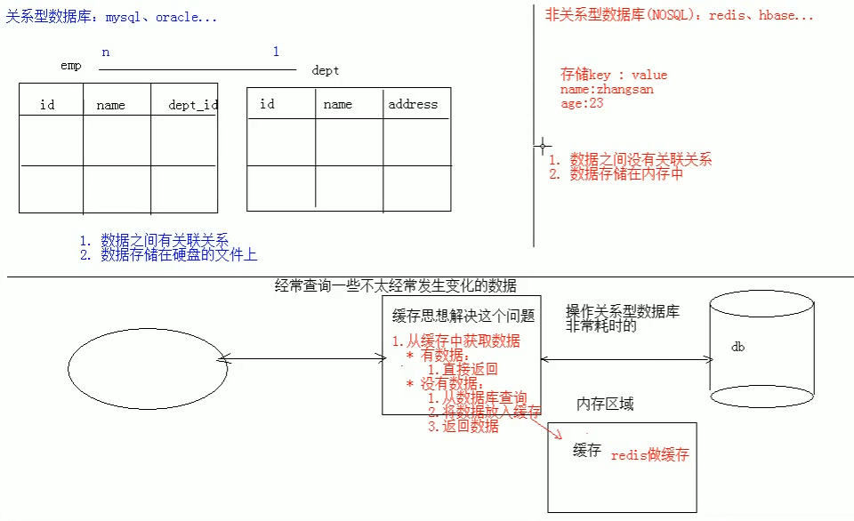
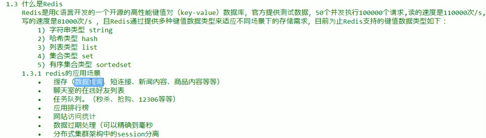
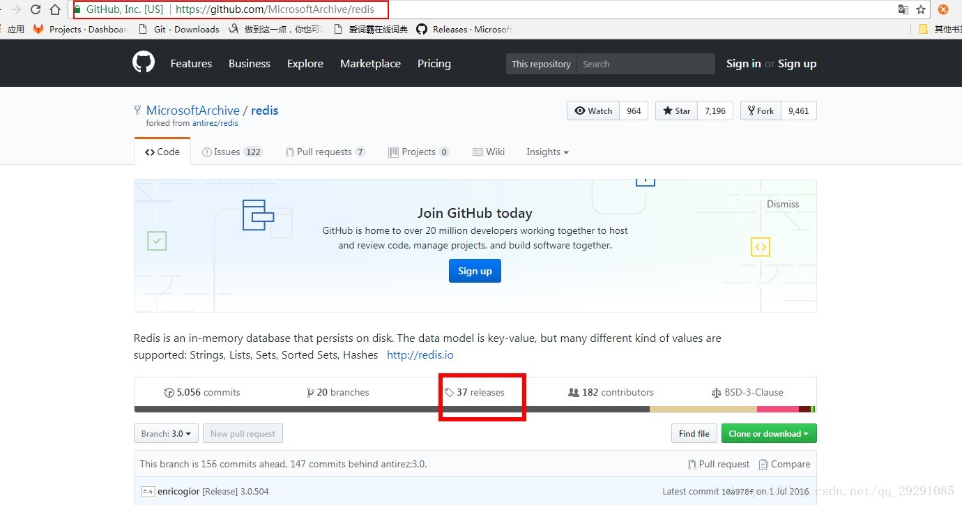
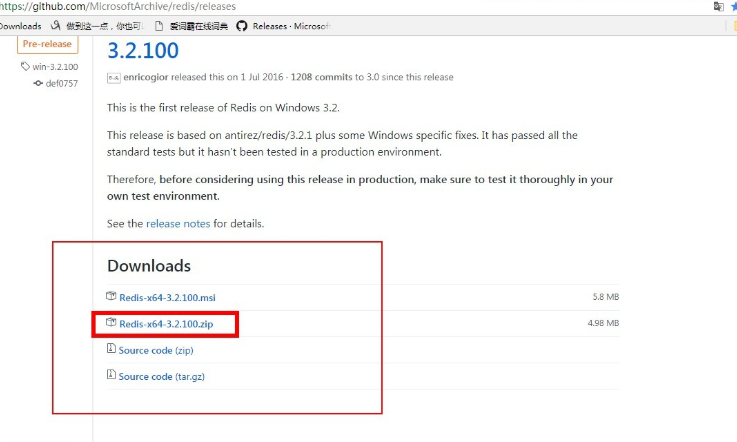
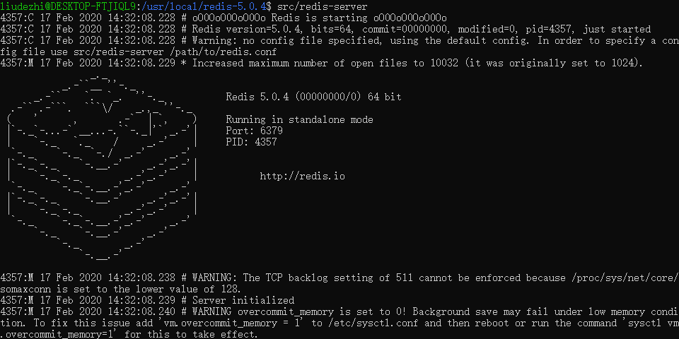
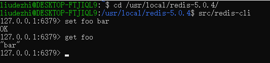

# 01.Redis入门

- 笔记本：12.Redis
- 创建时间：2020-02-17 05:52:10 UTC
- 更新时间：2020-02-17 06:45:07 UTC
- 原始链接：https://blog.csdn.net/qq_29291085/article/details/77489342
- 印象笔记 GUID：34ab1eaf-8cfa-46b5-9cf4-a3f92f89bfc9

1.
概念：redis 是一款高性能的非关系型数据库
 
 

1.
下载安装

  1.
下载地址：

    1. [官网](https://redis.io) (速度慢，不推荐)

    1. [中文网](http://www.redis.net.cn)

    1. [github](https://github.com/MicrosoftArchive/redis)
 
 

  1.
安装：

    1. windows：解压直接可以使用

      - redis.windows.conf：配置文件

      - redis-cli.exe：redis的客户端

      - redis-server.exe：redis的服务器端

    1. linux：

```
wget http://download.redis.io/releases/redis-5.0.4.tar.gz
tar xzf redis-5.0.4.tar.gz
cd redis-5.0.4
make

```

```
src/redis-server    # 启动服务端

```

```
src/redis-cli       # 启动客户端
set foo bar         # 添加数据
get foo             # 获取数据

```


 

1.%20%E6%A6%82%E5%BF%B5%EF%BC%9Aredis%20%E6%98%AF%E4%B8%80%E6%AC%BE%E9%AB%98%E6%80%A7%E8%83%BD%E7%9A%84%E9%9D%9E%E5%85%B3%E7%B3%BB%E5%9E%8B%E6%95%B0%E6%8D%AE%E5%BA%93%0A!%5B354efab492b6be45ba44e8976fbeb85c.png%5D(en-resource%3A%2F%2Fdatabase%2F1370%3A0)%0A!%5Ba796ef06766b2fb8a1c8a2367d476ff6.png%5D(en-resource%3A%2F%2Fdatabase%2F1372%3A0)%0A%0A2.%20%E4%B8%8B%E8%BD%BD%E5%AE%89%E8%A3%85%0A%20%20%20%201.%20%E4%B8%8B%E8%BD%BD%E5%9C%B0%E5%9D%80%EF%BC%9A%0A%20%20%20%20%20%20%20%201.%20%5B%E5%AE%98%E7%BD%91%5D(https%3A%2F%2Fredis.io)%20(%E9%80%9F%E5%BA%A6%E6%85%A2%EF%BC%8C%E4%B8%8D%E6%8E%A8%E8%8D%90)%0A%20%20%20%20%20%20%20%202.%20%5B%E4%B8%AD%E6%96%87%E7%BD%91%5D(http%3A%2F%2Fwww.redis.net.cn)%0A%20%20%20%20%20%20%20%203.%20%5Bgithub%5D(https%3A%2F%2Fgithub.com%2FMicrosoftArchive%2Fredis)%0A%20%20%20%20%20%20%20%20!%5B0d72d08fef94fc1b9cedb1684dcd68a1.png%5D(en-resource%3A%2F%2Fdatabase%2F1374%3A0)%0A%20%20%20%20%20%20%20%20!%5Bdfa82e32919a64cdc578148e43ed9661.png%5D(en-resource%3A%2F%2Fdatabase%2F1376%3A0)%0A%20%20%20%20%20%20%20%20%0A%20%20%20%202.%20%E5%AE%89%E8%A3%85%EF%BC%9A%0A%20%20%20%20%20%20%20%201.%20windows%EF%BC%9A%E8%A7%A3%E5%8E%8B%E7%9B%B4%E6%8E%A5%E5%8F%AF%E4%BB%A5%E4%BD%BF%E7%94%A8%0A%20%20%20%20%20%20%20%20%20%20%20%20*%20redis.windows.conf%EF%BC%9A%E9%85%8D%E7%BD%AE%E6%96%87%E4%BB%B6%0A%20%20%20%20%20%20%20%20%20%20%20%20*%20redis-cli.exe%EF%BC%9Aredis%E7%9A%84%E5%AE%A2%E6%88%B7%E7%AB%AF%0A%20%20%20%20%20%20%20%20%20%20%20%20*%20redis-server.exe%EF%BC%9Aredis%E7%9A%84%E6%9C%8D%E5%8A%A1%E5%99%A8%E7%AB%AF%0A%20%20%20%20%20%20%20%202.%20linux%EF%BC%9A%0A%20%20%20%20%20%20%20%20%60%60%60shell%0A%20%20%20%20%20%20%20%20wget%20http%3A%2F%2Fdownload.redis.io%2Freleases%2Fredis-5.0.4.tar.gz%0A%20%20%20%20%20%20%20%20tar%20xzf%20redis-5.0.4.tar.gz%0A%20%20%20%20%20%20%20%20cd%20redis-5.0.4%0A%20%20%20%20%20%20%20%20make%0A%20%20%20%20%20%20%20%20%60%60%60%0A%20%20%20%20%20%20%20%20%60%60%60shell%0A%20%20%20%20%20%20%20%20src%2Fredis-server%20%20%20%20%23%20%E5%90%AF%E5%8A%A8%E6%9C%8D%E5%8A%A1%E7%AB%AF%0A%20%20%20%20%20%20%20%20%60%60%60%0A%20%20%20%20%20%20%20%20%60%60%60shell%0A%20%20%20%20%20%20%20%20src%2Fredis-cli%20%20%20%20%20%20%20%23%20%E5%90%AF%E5%8A%A8%E5%AE%A2%E6%88%B7%E7%AB%AF%0A%20%20%20%20%20%20%20%20set%20foo%20bar%20%20%20%20%20%20%20%20%20%23%20%E6%B7%BB%E5%8A%A0%E6%95%B0%E6%8D%AE%0A%20%20%20%20%20%20%20%20get%20foo%20%20%20%20%20%20%20%20%20%20%20%20%20%23%20%E8%8E%B7%E5%8F%96%E6%95%B0%E6%8D%AE%0A%20%20%20%20%20%20%20%20%60%60%60%0A%20%20%20%20%20%20%20%20!%5B3feda844571bd262f66515dfba0f908b.png%5D(en-resource%3A%2F%2Fdatabase%2F1378%3A0)%0A%20%20%20%20%20%20%20%20!%5B19861366ae6b261a9fdf93aacd1c8f55.png%5D(en-resource%3A%2F%2Fdatabase%2F1380%3A0)%0A%20%20%20%20%20%20%20%20%0A
