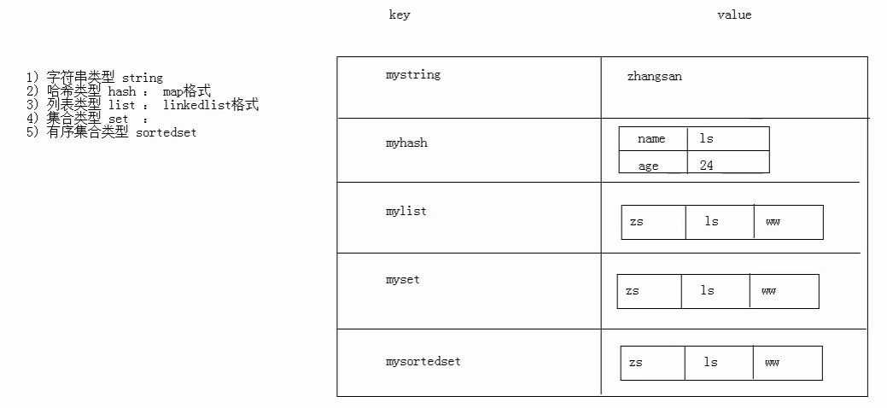
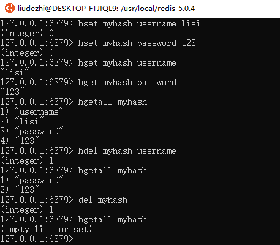
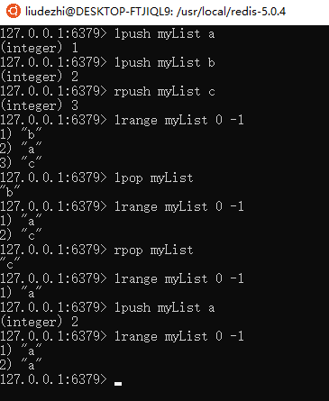
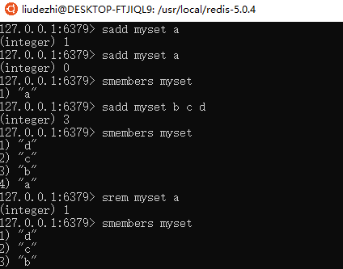
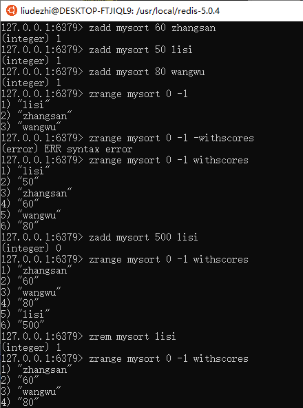
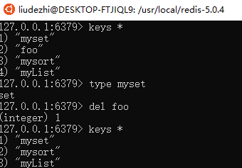

# 02.Redis-命令操作

- 笔记本：12.Redis
- 创建时间：2020-02-17 06:44:50 UTC
- 更新时间：2020-02-17 10:38:24 UTC
- 印象笔记 GUID：7153173c-de44-480b-9698-e9b9ab7f177b

#### 命令操作

1.
redis 的数据结构

  - redis 存储的是：key,value格式的数据，其中key都是字符串，value有5中不同的数据类型

    - value 的数据类型

      1. 字符串类型：string

      1. 哈希类型：hash：map格式

      1. 列表类型：list：linkedlist格式。支持重复元数据

      1. 集合类型：set ： 不支持重复元素

      1. 有序集合类型：sortedset：不允许重复元素，且元素有序
 

1.
字符串类型 string

  1. 存储：set key value

  1. 获取：get key

  1. 删除：del key

1.
哈希类型：hash

  1. 存储：hset key field value

  1. 获取：

    - hget key field：获取指定的field 对应的值

    - hgetall key：获取所有的field 和value

  1. 删除：hdel key field
 

1.
列表类型：list：可以添加一个元素到列表的头部（左边）或者尾部（右边）,允许有重复元素

  1. 存储：

    1. lpush key value：将元素加入列表左边

    1. rpush key value：将元素加入列表右边

  1. 获取：

    - lrange key start end ： 获取范围 (larange key 0 -1 获取所有)

  1. 删除：

    - lpop key：删除列表最左边的元素，并将元素返回

    - rpop key：删除列表最右边的元素，并将元素返回
 

1.
集合类型：set：不允许重复元素

  1. 存储：sadd key value

  1. 获取：smembers key：获取set集合中所有元素

  1. 删除：srem key value：删除set集合中的某一个元素
 

1.
有序集合类型：sortedset：不允许重复元素，且元素有顺序

  1. 存储：zadd key score value：

  1. 获取：zrange key start end

  1. 删除：zrem key value
 

1.
通用命令

  1. keys * ：查询所有的键

  1. type key ：获取键对应的value 的类型

  1. del key：删除指定的key value
 

%23%23%23%23%20%E5%91%BD%E4%BB%A4%E6%93%8D%E4%BD%9C%0A1.%20redis%20%E7%9A%84%E6%95%B0%E6%8D%AE%E7%BB%93%E6%9E%84%0A%20%20%20%20*%20redis%20%E5%AD%98%E5%82%A8%E7%9A%84%E6%98%AF%EF%BC%9Akey%2Cvalue%E6%A0%BC%E5%BC%8F%E7%9A%84%E6%95%B0%E6%8D%AE%EF%BC%8C%E5%85%B6%E4%B8%ADkey%E9%83%BD%E6%98%AF%E5%AD%97%E7%AC%A6%E4%B8%B2%EF%BC%8Cvalue%E6%9C%895%E4%B8%AD%E4%B8%8D%E5%90%8C%E7%9A%84%E6%95%B0%E6%8D%AE%E7%B1%BB%E5%9E%8B%0A%20%20%20%20%20%20%20%20*%20value%20%E7%9A%84%E6%95%B0%E6%8D%AE%E7%B1%BB%E5%9E%8B%0A%20%20%20%20%20%20%20%20%20%20%20%201.%20%E5%AD%97%E7%AC%A6%E4%B8%B2%E7%B1%BB%E5%9E%8B%EF%BC%9Astring%0A%20%20%20%20%20%20%20%20%20%20%20%202.%20%E5%93%88%E5%B8%8C%E7%B1%BB%E5%9E%8B%EF%BC%9Ahash%EF%BC%9Amap%E6%A0%BC%E5%BC%8F%0A%20%20%20%20%20%20%20%20%20%20%20%203.%20%E5%88%97%E8%A1%A8%E7%B1%BB%E5%9E%8B%EF%BC%9Alist%EF%BC%9Alinkedlist%E6%A0%BC%E5%BC%8F%E3%80%82%E6%94%AF%E6%8C%81%E9%87%8D%E5%A4%8D%E5%85%83%E6%95%B0%E6%8D%AE%0A%20%20%20%20%20%20%20%20%20%20%20%204.%20%E9%9B%86%E5%90%88%E7%B1%BB%E5%9E%8B%EF%BC%9Aset%20%EF%BC%9A%20%E4%B8%8D%E6%94%AF%E6%8C%81%E9%87%8D%E5%A4%8D%E5%85%83%E7%B4%A0%0A%20%20%20%20%20%20%20%20%20%20%20%205.%20%E6%9C%89%E5%BA%8F%E9%9B%86%E5%90%88%E7%B1%BB%E5%9E%8B%EF%BC%9Asortedset%EF%BC%9A%E4%B8%8D%E5%85%81%E8%AE%B8%E9%87%8D%E5%A4%8D%E5%85%83%E7%B4%A0%EF%BC%8C%E4%B8%94%E5%85%83%E7%B4%A0%E6%9C%89%E5%BA%8F%0A!%5B395692b4636e6f5eb809436ff81a12db.png%5D(en-resource%3A%2F%2Fdatabase%2F1386%3A1)%0A%0A2.%20%E5%AD%97%E7%AC%A6%E4%B8%B2%E7%B1%BB%E5%9E%8B%20string%0A%20%20%20%201.%20%E5%AD%98%E5%82%A8%EF%BC%9Aset%20key%20value%0A%20%20%20%202.%20%E8%8E%B7%E5%8F%96%EF%BC%9Aget%20key%0A%20%20%20%203.%20%E5%88%A0%E9%99%A4%EF%BC%9Adel%20key%0A%0A3.%20%E5%93%88%E5%B8%8C%E7%B1%BB%E5%9E%8B%EF%BC%9Ahash%0A%20%20%20%201.%20%E5%AD%98%E5%82%A8%EF%BC%9Ahset%20key%20field%20value%0A%20%20%20%202.%20%E8%8E%B7%E5%8F%96%EF%BC%9A%0A%20%20%20%20%20%20%20%20*%20hget%20key%20field%EF%BC%9A%E8%8E%B7%E5%8F%96%E6%8C%87%E5%AE%9A%E7%9A%84field%20%E5%AF%B9%E5%BA%94%E7%9A%84%E5%80%BC%0A%20%20%20%20%20%20%20%20*%20hgetall%20key%EF%BC%9A%E8%8E%B7%E5%8F%96%E6%89%80%E6%9C%89%E7%9A%84field%20%E5%92%8Cvalue%0A%20%20%20%203.%20%E5%88%A0%E9%99%A4%EF%BC%9Ahdel%20key%20field%0A%20%20%20%20!%5B41c7734ccc99cfcc217cdbff1ae93927.png%5D(en-resource%3A%2F%2Fdatabase%2F1388%3A1)%0A%0A4.%20%E5%88%97%E8%A1%A8%E7%B1%BB%E5%9E%8B%EF%BC%9Alist%EF%BC%9A%E5%8F%AF%E4%BB%A5%E6%B7%BB%E5%8A%A0%E4%B8%80%E4%B8%AA%E5%85%83%E7%B4%A0%E5%88%B0%E5%88%97%E8%A1%A8%E7%9A%84%E5%A4%B4%E9%83%A8%EF%BC%88%E5%B7%A6%E8%BE%B9%EF%BC%89%E6%88%96%E8%80%85%E5%B0%BE%E9%83%A8%EF%BC%88%E5%8F%B3%E8%BE%B9%EF%BC%89%2C%E5%85%81%E8%AE%B8%E6%9C%89%E9%87%8D%E5%A4%8D%E5%85%83%E7%B4%A0%0A%20%20%20%201.%20%E5%AD%98%E5%82%A8%EF%BC%9A%0A%20%20%20%20%20%20%20%201.%20lpush%20key%20value%EF%BC%9A%E5%B0%86%E5%85%83%E7%B4%A0%E5%8A%A0%E5%85%A5%E5%88%97%E8%A1%A8%E5%B7%A6%E8%BE%B9%0A%20%20%20%20%20%20%20%202.%20rpush%20key%20value%EF%BC%9A%E5%B0%86%E5%85%83%E7%B4%A0%E5%8A%A0%E5%85%A5%E5%88%97%E8%A1%A8%E5%8F%B3%E8%BE%B9%0A%20%20%20%202.%20%E8%8E%B7%E5%8F%96%EF%BC%9A%0A%20%20%20%20%20%20%20%20*%20lrange%20key%20start%20end%20%EF%BC%9A%20%E8%8E%B7%E5%8F%96%E8%8C%83%E5%9B%B4%20(larange%20key%200%20-1%20%E8%8E%B7%E5%8F%96%E6%89%80%E6%9C%89)%0A%20%20%20%203.%20%E5%88%A0%E9%99%A4%EF%BC%9A%0A%20%20%20%20%20%20%20%20*%20lpop%20key%EF%BC%9A%E5%88%A0%E9%99%A4%E5%88%97%E8%A1%A8%E6%9C%80%E5%B7%A6%E8%BE%B9%E7%9A%84%E5%85%83%E7%B4%A0%EF%BC%8C%E5%B9%B6%E5%B0%86%E5%85%83%E7%B4%A0%E8%BF%94%E5%9B%9E%0A%20%20%20%20%20%20%20%20*%20rpop%20key%EF%BC%9A%E5%88%A0%E9%99%A4%E5%88%97%E8%A1%A8%E6%9C%80%E5%8F%B3%E8%BE%B9%E7%9A%84%E5%85%83%E7%B4%A0%EF%BC%8C%E5%B9%B6%E5%B0%86%E5%85%83%E7%B4%A0%E8%BF%94%E5%9B%9E%0A%20%20%20%20!%5B842e5d1bf10e29c9457f82f3ba8af6c1.png%5D(en-resource%3A%2F%2Fdatabase%2F1392%3A1)%0A%20%20%20%20%0A%0A5.%20%E9%9B%86%E5%90%88%E7%B1%BB%E5%9E%8B%EF%BC%9Aset%EF%BC%9A%E4%B8%8D%E5%85%81%E8%AE%B8%E9%87%8D%E5%A4%8D%E5%85%83%E7%B4%A0%0A%20%20%20%201.%20%E5%AD%98%E5%82%A8%EF%BC%9Asadd%20key%20value%0A%20%20%20%202.%20%E8%8E%B7%E5%8F%96%EF%BC%9Asmembers%20key%EF%BC%9A%E8%8E%B7%E5%8F%96set%E9%9B%86%E5%90%88%E4%B8%AD%E6%89%80%E6%9C%89%E5%85%83%E7%B4%A0%0A%20%20%20%203.%20%E5%88%A0%E9%99%A4%EF%BC%9Asrem%20key%20value%EF%BC%9A%E5%88%A0%E9%99%A4set%E9%9B%86%E5%90%88%E4%B8%AD%E7%9A%84%E6%9F%90%E4%B8%80%E4%B8%AA%E5%85%83%E7%B4%A0%0A%20%20%20%20!%5B083b8152a6c5ebcf908248281a0ab0c9.png%5D(en-resource%3A%2F%2Fdatabase%2F1394%3A1)%0A%0A%0A6.%20%E6%9C%89%E5%BA%8F%E9%9B%86%E5%90%88%E7%B1%BB%E5%9E%8B%EF%BC%9Asortedset%EF%BC%9A%E4%B8%8D%E5%85%81%E8%AE%B8%E9%87%8D%E5%A4%8D%E5%85%83%E7%B4%A0%EF%BC%8C%E4%B8%94%E5%85%83%E7%B4%A0%E6%9C%89%E9%A1%BA%E5%BA%8F%0A%20%20%20%201.%20%E5%AD%98%E5%82%A8%EF%BC%9Azadd%20key%20score%20value%EF%BC%9A%0A%20%20%20%202.%20%E8%8E%B7%E5%8F%96%EF%BC%9Azrange%20key%20start%20end%0A%20%20%20%203.%20%E5%88%A0%E9%99%A4%EF%BC%9Azrem%20key%20value%0A!%5B1311a37e057e39b7a6b9ae5c00c752b0.png%5D(en-resource%3A%2F%2Fdatabase%2F1396%3A1)%0A%0A7.%20%E9%80%9A%E7%94%A8%E5%91%BD%E4%BB%A4%0A%20%20%20%201.%20keys%20*%20%EF%BC%9A%E6%9F%A5%E8%AF%A2%E6%89%80%E6%9C%89%E7%9A%84%E9%94%AE%0A%20%20%20%202.%20type%20key%20%EF%BC%9A%E8%8E%B7%E5%8F%96%E9%94%AE%E5%AF%B9%E5%BA%94%E7%9A%84value%20%E7%9A%84%E7%B1%BB%E5%9E%8B%0A%20%20%20%203.%20del%20key%EF%BC%9A%E5%88%A0%E9%99%A4%E6%8C%87%E5%AE%9A%E7%9A%84key%20value%0A!%5Bee2e43bcb5e05b6103c9d09aed96c28d.png%5D(en-resource%3A%2F%2Fdatabase%2F1398%3A0)%0A
