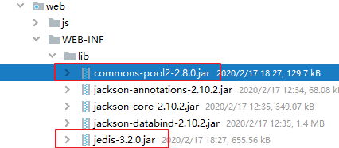

# 04.Jedis代码操作

- 笔记本：12.Redis
- 创建时间：2020-02-17 08:05:56 UTC
- 更新时间：2020-02-17 11:03:02 UTC
- 印象笔记 GUID：485aa30d-7150-4956-9924-e3d9de33fe23

**Jedis：** 一款java 操作redis 数据库的工具。

**使用步骤：**

1.
下载jedis 的jar 包
 

1.
使用

```
@Test
public void test1() {
    // 1. 获取连接
    Jedis jedis = new Jedis("127.0.0.1", 6379);
    // 2. 操作
    jedis.set("username", "xiashuang");
    // 3. 关闭连接
    jedis.close();
}

```

**Jedis 操作各种redis 中的数据结构**

1.
字符串类型：string

```
@Test
public void testString() {
    // 1. 获取连接
    Jedis jedis = new Jedis("127.0.0.1", 6379);     // 如果使用空参构造，默认值"localhost",6379端口
    // 2. 操作
    // 存储
    jedis.set("username", "xiashuang");
    // 获取
    String username = jedis.get("username");
    System.out.println(username);
    // 可以使用setex() 方法存储，可以指定过期时间的key value
    jedis.setex("activecode", 20, "haha");  // 将 activecode: hehe 键值对存入redis，并且20秒后自动删除该键值对
    // 3. 关闭连接
    jedis.close();
}

```

1.
哈希类型：hash：map格式

```
@Test
public void testHash() {
    // 1. 获取连接
    Jedis jedis = new Jedis("127.0.0.1", 6379);     // 如果使用空参构造，默认值"localhost",6379端口
    // 2. 操作
    // 存储hash
    jedis.hset("user", "name", "lisi");
    jedis.hset("user", "age", "23");
    jedis.hset("user", "gender", "male");
    // 获取hash
    String name = jedis.hget("user", "name");
    System.out.println(name);
    // 获取hash 的所有map 中的数据
    Map<String, String> user = jedis.hgetAll("user");
    System.out.println(user);
    Set<String> keySet = user.keySet();
    for (String key : keySet) {
        String value = user.get(key);
        System.out.println(key + ":" + value);
    }
    // 3. 关闭连接
    jedis.close();
}

```

1.
列表类型：list：linkedlist格式。支持重复元数据

```
@Test
public void testList() {
    // 1. 获取连接
    Jedis jedis = new Jedis("127.0.0.1", 6379);     // 如果使用空参构造，默认值"localhost",6379端口
    // 2. 操作
    // list 存储
    jedis.lpush("mylist", "a", "b", "c");
    jedis.rpush("mylist", "a", "b", "c");
    // list 范围获取
    List<String> mylist = jedis.lrange("mylist", 0, -1);
    System.out.println(mylist);
    // list 弹出
    String element1 = jedis.lpop("mylist"); //c
    String element2 = jedis.rpop("mylist"); // c
    System.out.println(element1 + "," + element2);

    List<String> mylist2 = jedis.lrange("mylist", 0, -1);
    System.out.println(mylist2);

    // 删除 list
    jedis.del("mylist");
    // 3. 关闭连接
    jedis.close();
}

```

1.
集合类型：set ： 不支持重复元素

```
@Test
public void testSet() {
    // 1. 获取连接
    Jedis jedis = new Jedis("127.0.0.1", 6379);     // 如果使用空参构造，默认值"localhost",6379端口
    // 2. 操作
    // set 存储
    jedis.sadd("myset", "java", "php", "c++");
    Set<String> myset = jedis.smembers("myset");
    System.out.println(myset);
    // 3. 关闭连接
    jedis.close();
}

```

1.
有序集合类型：sortedset：不允许重复元素，且元素有序

```
@Test
public void testSortedSet() {
    // 1. 获取连接
    Jedis jedis = new Jedis("127.0.0.1", 6379);     // 如果使用空参构造，默认值"localhost",6379端口
    // 2. 操作
    // sortedset 存储
    jedis.zadd("mysortedset", 30, "M4");
    jedis.zadd("mysortedset", 12, "M16");
    jedis.zadd("mysortedset", 25, "Scar");
    // sortedset 获取
    Set<String> mysortedset = jedis.zrange("mysortedset", 0, -1);
    System.out.println(mysortedset);
    Set<Tuple> mysortedset1 = jedis.zrangeWithScores("mysortedset", 0, -1);
    System.out.println(mysortedset1);
    // 3. 关闭连接
    jedis.close();
}

```

**Jedis%EF%BC%9A**%20%E4%B8%80%E6%AC%BEjava%20%E6%93%8D%E4%BD%9Credis%20%E6%95%B0%E6%8D%AE%E5%BA%93%E7%9A%84%E5%B7%A5%E5%85%B7%E3%80%82%0A%0A**%E4%BD%BF%E7%94%A8%E6%AD%A5%E9%AA%A4%EF%BC%9A**%0A1.%20%E4%B8%8B%E8%BD%BDjedis%20%E7%9A%84jar%20%E5%8C%85%0A!%5Bd4e548536c31dfcb9ab43505c22be652.png%5D(en-resource%3A%2F%2Fdatabase%2F1406%3A0)%0A%0A2.%20%E4%BD%BF%E7%94%A8%0A%20%20%20%20%60%60%60java%0A%20%20%20%20%40Test%0A%20%20%20%20public%20void%20test1()%20%7B%0A%20%20%20%20%20%20%20%20%2F%2F%201.%20%E8%8E%B7%E5%8F%96%E8%BF%9E%E6%8E%A5%0A%20%20%20%20%20%20%20%20Jedis%20jedis%20%3D%20new%20Jedis(%22127.0.0.1%22%2C%206379)%3B%0A%20%20%20%20%20%20%20%20%2F%2F%202.%20%E6%93%8D%E4%BD%9C%0A%20%20%20%20%20%20%20%20jedis.set(%22username%22%2C%20%22xiashuang%22)%3B%0A%20%20%20%20%20%20%20%20%2F%2F%203.%20%E5%85%B3%E9%97%AD%E8%BF%9E%E6%8E%A5%0A%20%20%20%20%20%20%20%20jedis.close()%3B%0A%20%20%20%20%7D%0A%20%20%20%20%60%60%60%0A%20%20%20%20%0A%20%20%20%20**Jedis%20%E6%93%8D%E4%BD%9C%E5%90%84%E7%A7%8Dredis%20%E4%B8%AD%E7%9A%84%E6%95%B0%E6%8D%AE%E7%BB%93%E6%9E%84**%0A1.%20%E5%AD%97%E7%AC%A6%E4%B8%B2%E7%B1%BB%E5%9E%8B%EF%BC%9Astring%0A%20%20%20%20%60%60%60java%0A%20%20%20%20%40Test%0A%20%20%20%20public%20void%20testString()%20%7B%0A%20%20%20%20%20%20%20%20%2F%2F%201.%20%E8%8E%B7%E5%8F%96%E8%BF%9E%E6%8E%A5%0A%20%20%20%20%20%20%20%20Jedis%20jedis%20%3D%20new%20Jedis(%22127.0.0.1%22%2C%206379)%3B%20%20%20%20%20%2F%2F%20%E5%A6%82%E6%9E%9C%E4%BD%BF%E7%94%A8%E7%A9%BA%E5%8F%82%E6%9E%84%E9%80%A0%EF%BC%8C%E9%BB%98%E8%AE%A4%E5%80%BC%22localhost%22%2C6379%E7%AB%AF%E5%8F%A3%0A%20%20%20%20%20%20%20%20%2F%2F%202.%20%E6%93%8D%E4%BD%9C%0A%20%20%20%20%20%20%20%20%2F%2F%20%E5%AD%98%E5%82%A8%0A%20%20%20%20%20%20%20%20jedis.set(%22username%22%2C%20%22xiashuang%22)%3B%0A%20%20%20%20%20%20%20%20%2F%2F%20%E8%8E%B7%E5%8F%96%0A%20%20%20%20%20%20%20%20String%20username%20%3D%20jedis.get(%22username%22)%3B%0A%20%20%20%20%20%20%20%20System.out.println(username)%3B%0A%20%20%20%20%20%20%20%20%2F%2F%20%E5%8F%AF%E4%BB%A5%E4%BD%BF%E7%94%A8setex()%20%E6%96%B9%E6%B3%95%E5%AD%98%E5%82%A8%EF%BC%8C%E5%8F%AF%E4%BB%A5%E6%8C%87%E5%AE%9A%E8%BF%87%E6%9C%9F%E6%97%B6%E9%97%B4%E7%9A%84key%20value%0A%20%20%20%20%20%20%20%20jedis.setex(%22activecode%22%2C%2020%2C%20%22haha%22)%3B%20%20%2F%2F%20%E5%B0%86%20activecode%3A%20hehe%20%E9%94%AE%E5%80%BC%E5%AF%B9%E5%AD%98%E5%85%A5redis%EF%BC%8C%E5%B9%B6%E4%B8%9420%E7%A7%92%E5%90%8E%E8%87%AA%E5%8A%A8%E5%88%A0%E9%99%A4%E8%AF%A5%E9%94%AE%E5%80%BC%E5%AF%B9%0A%20%20%20%20%20%20%20%20%2F%2F%203.%20%E5%85%B3%E9%97%AD%E8%BF%9E%E6%8E%A5%0A%20%20%20%20%20%20%20%20jedis.close()%3B%0A%20%20%20%20%7D%0A%20%20%20%20%60%60%60%0A2.%20%E5%93%88%E5%B8%8C%E7%B1%BB%E5%9E%8B%EF%BC%9Ahash%EF%BC%9Amap%E6%A0%BC%E5%BC%8F%0A%20%20%20%20%60%60%60java%0A%20%20%20%20%40Test%0A%20%20%20%20public%20void%20testHash()%20%7B%0A%20%20%20%20%20%20%20%20%2F%2F%201.%20%E8%8E%B7%E5%8F%96%E8%BF%9E%E6%8E%A5%0A%20%20%20%20%20%20%20%20Jedis%20jedis%20%3D%20new%20Jedis(%22127.0.0.1%22%2C%206379)%3B%20%20%20%20%20%2F%2F%20%E5%A6%82%E6%9E%9C%E4%BD%BF%E7%94%A8%E7%A9%BA%E5%8F%82%E6%9E%84%E9%80%A0%EF%BC%8C%E9%BB%98%E8%AE%A4%E5%80%BC%22localhost%22%2C6379%E7%AB%AF%E5%8F%A3%0A%20%20%20%20%20%20%20%20%2F%2F%202.%20%E6%93%8D%E4%BD%9C%0A%20%20%20%20%20%20%20%20%2F%2F%20%E5%AD%98%E5%82%A8hash%0A%20%20%20%20%20%20%20%20jedis.hset(%22user%22%2C%20%22name%22%2C%20%22lisi%22)%3B%0A%20%20%20%20%20%20%20%20jedis.hset(%22user%22%2C%20%22age%22%2C%20%2223%22)%3B%0A%20%20%20%20%20%20%20%20jedis.hset(%22user%22%2C%20%22gender%22%2C%20%22male%22)%3B%0A%20%20%20%20%20%20%20%20%2F%2F%20%E8%8E%B7%E5%8F%96hash%0A%20%20%20%20%20%20%20%20String%20name%20%3D%20jedis.hget(%22user%22%2C%20%22name%22)%3B%0A%20%20%20%20%20%20%20%20System.out.println(name)%3B%0A%20%20%20%20%20%20%20%20%2F%2F%20%E8%8E%B7%E5%8F%96hash%20%E7%9A%84%E6%89%80%E6%9C%89map%20%E4%B8%AD%E7%9A%84%E6%95%B0%E6%8D%AE%0A%20%20%20%20%20%20%20%20Map%3CString%2C%20String%3E%20user%20%3D%20jedis.hgetAll(%22user%22)%3B%0A%20%20%20%20%20%20%20%20System.out.println(user)%3B%0A%20%20%20%20%20%20%20%20Set%3CString%3E%20keySet%20%3D%20user.keySet()%3B%0A%20%20%20%20%20%20%20%20for%20(String%20key%20%3A%20keySet)%20%7B%0A%20%20%20%20%20%20%20%20%20%20%20%20String%20value%20%3D%20user.get(key)%3B%0A%20%20%20%20%20%20%20%20%20%20%20%20System.out.println(key%20%2B%20%22%3A%22%20%2B%20value)%3B%0A%20%20%20%20%20%20%20%20%7D%0A%20%20%20%20%20%20%20%20%2F%2F%203.%20%E5%85%B3%E9%97%AD%E8%BF%9E%E6%8E%A5%0A%20%20%20%20%20%20%20%20jedis.close()%3B%0A%20%20%20%20%7D%0A%20%20%20%20%60%60%60%0A3.%20%E5%88%97%E8%A1%A8%E7%B1%BB%E5%9E%8B%EF%BC%9Alist%EF%BC%9Alinkedlist%E6%A0%BC%E5%BC%8F%E3%80%82%E6%94%AF%E6%8C%81%E9%87%8D%E5%A4%8D%E5%85%83%E6%95%B0%E6%8D%AE%0A%20%20%20%20%60%60%60java%0A%20%20%20%20%40Test%0A%20%20%20%20public%20void%20testList()%20%7B%0A%20%20%20%20%20%20%20%20%2F%2F%201.%20%E8%8E%B7%E5%8F%96%E8%BF%9E%E6%8E%A5%0A%20%20%20%20%20%20%20%20Jedis%20jedis%20%3D%20new%20Jedis(%22127.0.0.1%22%2C%206379)%3B%20%20%20%20%20%2F%2F%20%E5%A6%82%E6%9E%9C%E4%BD%BF%E7%94%A8%E7%A9%BA%E5%8F%82%E6%9E%84%E9%80%A0%EF%BC%8C%E9%BB%98%E8%AE%A4%E5%80%BC%22localhost%22%2C6379%E7%AB%AF%E5%8F%A3%0A%20%20%20%20%20%20%20%20%2F%2F%202.%20%E6%93%8D%E4%BD%9C%0A%20%20%20%20%20%20%20%20%2F%2F%20list%20%E5%AD%98%E5%82%A8%0A%20%20%20%20%20%20%20%20jedis.lpush(%22mylist%22%2C%20%22a%22%2C%20%22b%22%2C%20%22c%22)%3B%0A%20%20%20%20%20%20%20%20jedis.rpush(%22mylist%22%2C%20%22a%22%2C%20%22b%22%2C%20%22c%22)%3B%0A%20%20%20%20%20%20%20%20%2F%2F%20list%20%E8%8C%83%E5%9B%B4%E8%8E%B7%E5%8F%96%0A%20%20%20%20%20%20%20%20List%3CString%3E%20mylist%20%3D%20jedis.lrange(%22mylist%22%2C%200%2C%20-1)%3B%0A%20%20%20%20%20%20%20%20System.out.println(mylist)%3B%0A%20%20%20%20%20%20%20%20%2F%2F%20list%20%E5%BC%B9%E5%87%BA%0A%20%20%20%20%20%20%20%20String%20element1%20%3D%20jedis.lpop(%22mylist%22)%3B%20%2F%2Fc%0A%20%20%20%20%20%20%20%20String%20element2%20%3D%20jedis.rpop(%22mylist%22)%3B%20%2F%2F%20c%0A%20%20%20%20%20%20%20%20System.out.println(element1%20%2B%20%22%2C%22%20%2B%20element2)%3B%0A%0A%20%20%20%20%20%20%20%20List%3CString%3E%20mylist2%20%3D%20jedis.lrange(%22mylist%22%2C%200%2C%20-1)%3B%0A%20%20%20%20%20%20%20%20System.out.println(mylist2)%3B%0A%0A%20%20%20%20%20%20%20%20%2F%2F%20%E5%88%A0%E9%99%A4%20list%0A%20%20%20%20%20%20%20%20jedis.del(%22mylist%22)%3B%0A%20%20%20%20%20%20%20%20%2F%2F%203.%20%E5%85%B3%E9%97%AD%E8%BF%9E%E6%8E%A5%0A%20%20%20%20%20%20%20%20jedis.close()%3B%0A%20%20%20%20%7D%0A%20%20%20%20%60%60%60%0A4.%20%E9%9B%86%E5%90%88%E7%B1%BB%E5%9E%8B%EF%BC%9Aset%20%EF%BC%9A%20%E4%B8%8D%E6%94%AF%E6%8C%81%E9%87%8D%E5%A4%8D%E5%85%83%E7%B4%A0%0A%20%20%20%20%60%60%60java%0A%20%20%20%20%40Test%0A%20%20%20%20public%20void%20testSet()%20%7B%0A%20%20%20%20%20%20%20%20%2F%2F%201.%20%E8%8E%B7%E5%8F%96%E8%BF%9E%E6%8E%A5%0A%20%20%20%20%20%20%20%20Jedis%20jedis%20%3D%20new%20Jedis(%22127.0.0.1%22%2C%206379)%3B%20%20%20%20%20%2F%2F%20%E5%A6%82%E6%9E%9C%E4%BD%BF%E7%94%A8%E7%A9%BA%E5%8F%82%E6%9E%84%E9%80%A0%EF%BC%8C%E9%BB%98%E8%AE%A4%E5%80%BC%22localhost%22%2C6379%E7%AB%AF%E5%8F%A3%0A%20%20%20%20%20%20%20%20%2F%2F%202.%20%E6%93%8D%E4%BD%9C%0A%20%20%20%20%20%20%20%20%2F%2F%20set%20%E5%AD%98%E5%82%A8%0A%20%20%20%20%20%20%20%20jedis.sadd(%22myset%22%2C%20%22java%22%2C%20%22php%22%2C%20%22c%2B%2B%22)%3B%0A%20%20%20%20%20%20%20%20Set%3CString%3E%20myset%20%3D%20jedis.smembers(%22myset%22)%3B%0A%20%20%20%20%20%20%20%20System.out.println(myset)%3B%0A%20%20%20%20%20%20%20%20%2F%2F%203.%20%E5%85%B3%E9%97%AD%E8%BF%9E%E6%8E%A5%0A%20%20%20%20%20%20%20%20jedis.close()%3B%0A%20%20%20%20%7D%0A%20%20%20%20%60%60%60%0A5.%20%E6%9C%89%E5%BA%8F%E9%9B%86%E5%90%88%E7%B1%BB%E5%9E%8B%EF%BC%9Asortedset%EF%BC%9A%E4%B8%8D%E5%85%81%E8%AE%B8%E9%87%8D%E5%A4%8D%E5%85%83%E7%B4%A0%EF%BC%8C%E4%B8%94%E5%85%83%E7%B4%A0%E6%9C%89%E5%BA%8F%0A%20%20%20%20%60%60%60java%0A%20%20%20%20%40Test%0A%20%20%20%20public%20void%20testSortedSet()%20%7B%0A%20%20%20%20%20%20%20%20%2F%2F%201.%20%E8%8E%B7%E5%8F%96%E8%BF%9E%E6%8E%A5%0A%20%20%20%20%20%20%20%20Jedis%20jedis%20%3D%20new%20Jedis(%22127.0.0.1%22%2C%206379)%3B%20%20%20%20%20%2F%2F%20%E5%A6%82%E6%9E%9C%E4%BD%BF%E7%94%A8%E7%A9%BA%E5%8F%82%E6%9E%84%E9%80%A0%EF%BC%8C%E9%BB%98%E8%AE%A4%E5%80%BC%22localhost%22%2C6379%E7%AB%AF%E5%8F%A3%0A%20%20%20%20%20%20%20%20%2F%2F%202.%20%E6%93%8D%E4%BD%9C%0A%20%20%20%20%20%20%20%20%2F%2F%20sortedset%20%E5%AD%98%E5%82%A8%0A%20%20%20%20%20%20%20%20jedis.zadd(%22mysortedset%22%2C%2030%2C%20%22M4%22)%3B%0A%20%20%20%20%20%20%20%20jedis.zadd(%22mysortedset%22%2C%2012%2C%20%22M16%22)%3B%0A%20%20%20%20%20%20%20%20jedis.zadd(%22mysortedset%22%2C%2025%2C%20%22Scar%22)%3B%0A%20%20%20%20%20%20%20%20%2F%2F%20sortedset%20%E8%8E%B7%E5%8F%96%0A%20%20%20%20%20%20%20%20Set%3CString%3E%20mysortedset%20%3D%20jedis.zrange(%22mysortedset%22%2C%200%2C%20-1)%3B%0A%20%20%20%20%20%20%20%20System.out.println(mysortedset)%3B%0A%20%20%20%20%20%20%20%20Set%3CTuple%3E%20mysortedset1%20%3D%20jedis.zrangeWithScores(%22mysortedset%22%2C%200%2C%20-1)%3B%0A%20%20%20%20%20%20%20%20System.out.println(mysortedset1)%3B%0A%20%20%20%20%20%20%20%20%2F%2F%203.%20%E5%85%B3%E9%97%AD%E8%BF%9E%E6%8E%A5%0A%20%20%20%20%20%20%20%20jedis.close()%3B%0A%20%20%20%20%7D%0A%20%20%20%20%60%60%60%0A
