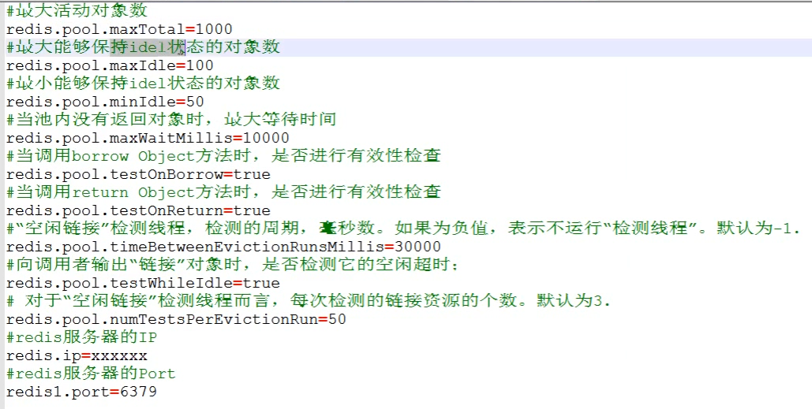

# 05.Jedis连接池

- 笔记本：12.Redis
- 创建时间：2020-02-17 11:03:45 UTC
- 更新时间：2020-02-17 11:28:39 UTC
- 印象笔记 GUID：dfe85805-b531-41f4-816e-dabce34e17ba

**Jedis连接池：** JedisPool

-
使用：

  1. 创建JedisPool 连接池对象

  1. 调用方法getResource() 方法获取Jedis 连接

```
@Test
public void testJedisPool() {
    // 0. 创建一个配置对象
    JedisPoolConfig config = new JedisPoolConfig();
    config.setMaxTotal(50);
    config.setMaxIdle(10);
    // 1. 创建Jedis 连接池对象
    JedisPool jedisPool = new JedisPool(config, "127.0.0.1", 6379);
    // 2. 获取连接
    Jedis jedis = jedisPool.getResource();
    // 3. 使用
    jedis.set("hehe", "haha");
    // 关闭，归还到连接池中
    jedis.close();
}

```

**Jedis详细配置:**
 

**JedisPool工具类：**

```
package cn.liudezhi.jedis.util;

import redis.clients.jedis.Jedis;
import redis.clients.jedis.JedisPool;
import redis.clients.jedis.JedisPoolConfig;

import java.io.IOException;
import java.io.InputStream;
import java.util.Properties;

/**
* JedisPool 工具类
*  加载配置文件，配置连接池的参数
*  提供获取连接的方法
*/
public class JedisPoolUtils {
private static JedisPool jedisPool;

static {
    // 读取配置文件
    InputStream is = JedisPoolUtils.class.getClassLoader().getResourceAsStream("jedis.properties");
    // 创建Properties 对象
    Properties pro = new Properties();
    // 关联文件
    try {
        pro.load(is);
    } catch (IOException e) {
        e.printStackTrace();
    }
    // 获取数据，设置到JedisPoolConfig 中
    JedisPoolConfig config = new JedisPoolConfig();
    config.setMaxTotal(Integer.parseInt(pro.getProperty("maxTotal")));
    config.setMaxIdle(Integer.parseInt(pro.getProperty("maxIdle")));
    // 初始化 JedisPool
    jedisPool = new JedisPool(config, pro.getProperty("host"), Integer.parseInt(pro.getProperty("port")));
}
/**
 * 获取连接方法
 * @return
 */
public static Jedis getJedis() {
    return jedisPool.getResource();
}
}

```

**连接池工具类使用**

```
@Test
public void testJedisPoolUtil() {
    // 通过连接池工具类获取
    Jedis jedis = JedisPoolUtils.getJedis();
    // 3. 使用
    jedis.set("hehe", "haha");
    // 关闭，归还到连接池中
    jedis.close();
}

```

**Jedis%E8%BF%9E%E6%8E%A5%E6%B1%A0%EF%BC%9A**%20JedisPool%0A*%20%E4%BD%BF%E7%94%A8%EF%BC%9A%0A%20%20%20%201.%20%E5%88%9B%E5%BB%BAJedisPool%20%E8%BF%9E%E6%8E%A5%E6%B1%A0%E5%AF%B9%E8%B1%A1%0A%20%20%20%202.%20%E8%B0%83%E7%94%A8%E6%96%B9%E6%B3%95getResource()%20%E6%96%B9%E6%B3%95%E8%8E%B7%E5%8F%96Jedis%20%E8%BF%9E%E6%8E%A5%0A%20%20%20%20%60%60%60java%0A%20%20%20%20%40Test%0A%20%20%20%20public%20void%20testJedisPool()%20%7B%0A%20%20%20%20%20%20%20%20%2F%2F%200.%20%E5%88%9B%E5%BB%BA%E4%B8%80%E4%B8%AA%E9%85%8D%E7%BD%AE%E5%AF%B9%E8%B1%A1%0A%20%20%20%20%20%20%20%20JedisPoolConfig%20config%20%3D%20new%20JedisPoolConfig()%3B%0A%20%20%20%20%20%20%20%20config.setMaxTotal(50)%3B%0A%20%20%20%20%20%20%20%20config.setMaxIdle(10)%3B%0A%20%20%20%20%20%20%20%20%2F%2F%201.%20%E5%88%9B%E5%BB%BAJedis%20%E8%BF%9E%E6%8E%A5%E6%B1%A0%E5%AF%B9%E8%B1%A1%0A%20%20%20%20%20%20%20%20JedisPool%20jedisPool%20%3D%20new%20JedisPool(config%2C%20%22127.0.0.1%22%2C%206379)%3B%0A%20%20%20%20%20%20%20%20%2F%2F%202.%20%E8%8E%B7%E5%8F%96%E8%BF%9E%E6%8E%A5%0A%20%20%20%20%20%20%20%20Jedis%20jedis%20%3D%20jedisPool.getResource()%3B%0A%20%20%20%20%20%20%20%20%2F%2F%203.%20%E4%BD%BF%E7%94%A8%0A%20%20%20%20%20%20%20%20jedis.set(%22hehe%22%2C%20%22haha%22)%3B%0A%20%20%20%20%20%20%20%20%2F%2F%20%E5%85%B3%E9%97%AD%EF%BC%8C%E5%BD%92%E8%BF%98%E5%88%B0%E8%BF%9E%E6%8E%A5%E6%B1%A0%E4%B8%AD%0A%20%20%20%20%20%20%20%20jedis.close()%3B%0A%20%20%20%20%7D%0A%20%20%20%20%60%60%60%0A%0A%20%20%20%20**Jedis%E8%AF%A6%E7%BB%86%E9%85%8D%E7%BD%AE%3A**%0A%20%20%20%20!%5B70ad78e4d8c82867604f8391241c0761.png%5D(en-resource%3A%2F%2Fdatabase%2F1410%3A0)%0A%20%20%20%20%0A**JedisPool%E5%B7%A5%E5%85%B7%E7%B1%BB%EF%BC%9A**%0A%60%60%60java%0Apackage%20cn.liudezhi.jedis.util%3B%0A%0Aimport%20redis.clients.jedis.Jedis%3B%0Aimport%20redis.clients.jedis.JedisPool%3B%0Aimport%20redis.clients.jedis.JedisPoolConfig%3B%0A%0Aimport%20java.io.IOException%3B%0Aimport%20java.io.InputStream%3B%0Aimport%20java.util.Properties%3B%0A%0A%2F**%0A*%20JedisPool%20%E5%B7%A5%E5%85%B7%E7%B1%BB%0A*%20%20%E5%8A%A0%E8%BD%BD%E9%85%8D%E7%BD%AE%E6%96%87%E4%BB%B6%EF%BC%8C%E9%85%8D%E7%BD%AE%E8%BF%9E%E6%8E%A5%E6%B1%A0%E7%9A%84%E5%8F%82%E6%95%B0%0A*%20%20%E6%8F%90%E4%BE%9B%E8%8E%B7%E5%8F%96%E8%BF%9E%E6%8E%A5%E7%9A%84%E6%96%B9%E6%B3%95%0A*%2F%0Apublic%20class%20JedisPoolUtils%20%7B%0Aprivate%20static%20JedisPool%20jedisPool%3B%0A%0Astatic%20%7B%0A%20%20%20%20%2F%2F%20%E8%AF%BB%E5%8F%96%E9%85%8D%E7%BD%AE%E6%96%87%E4%BB%B6%0A%20%20%20%20InputStream%20is%20%3D%20JedisPoolUtils.class.getClassLoader().getResourceAsStream(%22jedis.properties%22)%3B%0A%20%20%20%20%2F%2F%20%E5%88%9B%E5%BB%BAProperties%20%E5%AF%B9%E8%B1%A1%0A%20%20%20%20Properties%20pro%20%3D%20new%20Properties()%3B%0A%20%20%20%20%2F%2F%20%E5%85%B3%E8%81%94%E6%96%87%E4%BB%B6%0A%20%20%20%20try%20%7B%0A%20%20%20%20%20%20%20%20pro.load(is)%3B%0A%20%20%20%20%7D%20catch%20(IOException%20e)%20%7B%0A%20%20%20%20%20%20%20%20e.printStackTrace()%3B%0A%20%20%20%20%7D%0A%20%20%20%20%2F%2F%20%E8%8E%B7%E5%8F%96%E6%95%B0%E6%8D%AE%EF%BC%8C%E8%AE%BE%E7%BD%AE%E5%88%B0JedisPoolConfig%20%E4%B8%AD%0A%20%20%20%20JedisPoolConfig%20config%20%3D%20new%20JedisPoolConfig()%3B%0A%20%20%20%20config.setMaxTotal(Integer.parseInt(pro.getProperty(%22maxTotal%22)))%3B%0A%20%20%20%20config.setMaxIdle(Integer.parseInt(pro.getProperty(%22maxIdle%22)))%3B%0A%20%20%20%20%2F%2F%20%E5%88%9D%E5%A7%8B%E5%8C%96%20JedisPool%0A%20%20%20%20jedisPool%20%3D%20new%20JedisPool(config%2C%20pro.getProperty(%22host%22)%2C%20Integer.parseInt(pro.getProperty(%22port%22)))%3B%0A%7D%0A%2F**%0A%20*%20%E8%8E%B7%E5%8F%96%E8%BF%9E%E6%8E%A5%E6%96%B9%E6%B3%95%0A%20*%20%40return%0A%20*%2F%0Apublic%20static%20Jedis%20getJedis()%20%7B%0A%20%20%20%20return%20jedisPool.getResource()%3B%0A%7D%0A%7D%0A%60%60%60%0A%0A**%E8%BF%9E%E6%8E%A5%E6%B1%A0%E5%B7%A5%E5%85%B7%E7%B1%BB%E4%BD%BF%E7%94%A8**%0A%60%60%60java%0A%40Test%0Apublic%20void%20testJedisPoolUtil()%20%7B%0A%20%20%20%20%2F%2F%20%E9%80%9A%E8%BF%87%E8%BF%9E%E6%8E%A5%E6%B1%A0%E5%B7%A5%E5%85%B7%E7%B1%BB%E8%8E%B7%E5%8F%96%0A%20%20%20%20Jedis%20jedis%20%3D%20JedisPoolUtils.getJedis()%3B%0A%20%20%20%20%2F%2F%203.%20%E4%BD%BF%E7%94%A8%0A%20%20%20%20jedis.set(%22hehe%22%2C%20%22haha%22)%3B%0A%20%20%20%20%2F%2F%20%E5%85%B3%E9%97%AD%EF%BC%8C%E5%BD%92%E8%BF%98%E5%88%B0%E8%BF%9E%E6%8E%A5%E6%B1%A0%E4%B8%AD%0A%20%20%20%20jedis.close()%3B%0A%7D%0A%60%60%60
