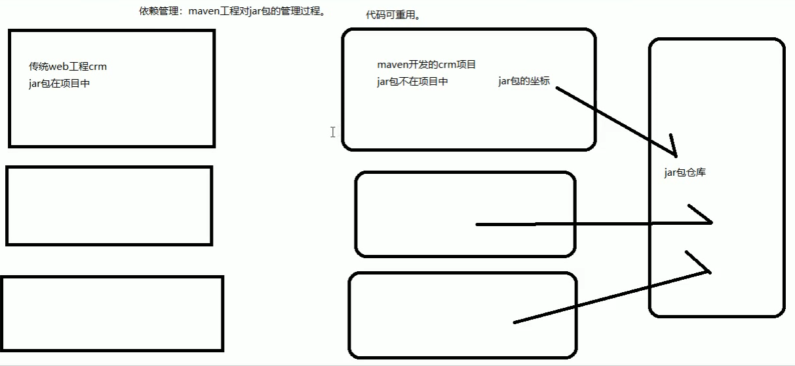
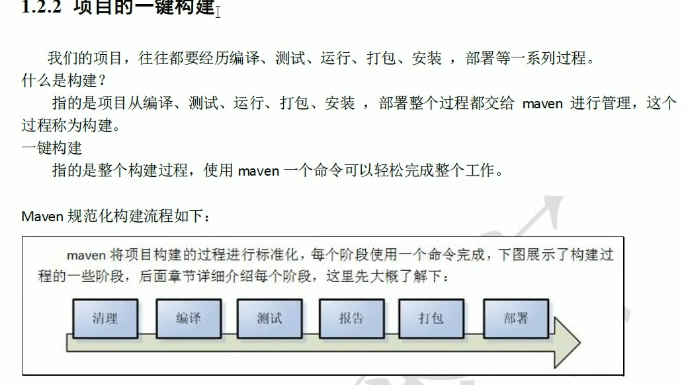

# 01.Maven基本概念

- 笔记本：13.Maven
- 创建时间：2020-02-17 15:04:41 UTC
- 更新时间：2020-02-17 15:10:56 UTC
- 印象笔记 GUID：4cc66896-8376-47b6-8ee5-4148fc6a8aa4

 

写好的Maven 项目中有个叫pom.xml的文件
 进入maven项目的目录，cmd `mvn tomcat:run` 即可运行项目

!%5B3504c416f887493051477d50fe0a6e8b.png%5D(en-resource%3A%2F%2Fdatabase%2F1420%3A0)%0A!%5B88309763ca4c714ed48ecc112b223dc9.png%5D(en-resource%3A%2F%2Fdatabase%2F1422%3A0)%0A%0A%E5%86%99%E5%A5%BD%E7%9A%84Maven%20%E9%A1%B9%E7%9B%AE%E4%B8%AD%E6%9C%89%E4%B8%AA%E5%8F%ABpom.xml%E7%9A%84%E6%96%87%E4%BB%B6%0A%E8%BF%9B%E5%85%A5maven%E9%A1%B9%E7%9B%AE%E7%9A%84%E7%9B%AE%E5%BD%95%EF%BC%8Ccmd%20%60mvn%20tomcat%3Arun%60%20%E5%8D%B3%E5%8F%AF%E8%BF%90%E8%A1%8C%E9%A1%B9%E7%9B%AE
