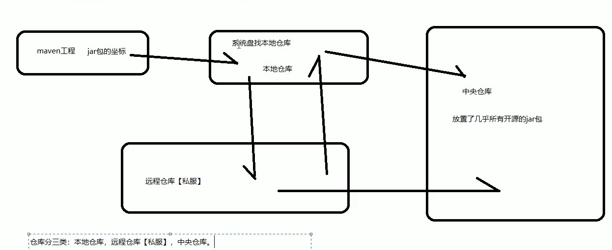

# 02.Maven的安装和仓库种类

- 笔记本：13.Maven
- 创建时间：2020-02-17 15:11:26 UTC
- 更新时间：2020-02-17 15:25:55 UTC
- 印象笔记 GUID：2e517367-b443-4d25-8482-cf448de77007

1.
Maven 软件的下载

  - 地址：[官网](http://maven.apache.org)

1.
Maven 安装

  - 解压到没有空格，没有中文的目录

  - 目录结构

    - bin 目录

      - mvn: 主要用来构建项目

    - boot 目录

      - plexus-classworlds-版本.jar ：Maven 自身运行所需要的类加载器

    - conf 目录

      - settings.xml：对maven 进行配置时各种配置时主要使用的文件。

    - lib 目录

      - 非常多maven 运行所依赖的jar包

  - maven 环境变量配置

    - 新建 MAVEN_HOME = maven目录(bin的上一级)

    - 编辑 PATH ，添加 `%MAVEN_HOME%\bin`

    - 注意：maven 运行需要依赖于 JAVA_HOME 环境变量

  - `mvn -v`：可以查看maven 是否配置成功

1.
Maven 仓库的种类和彼此的关系

  - 仓库分为三类：

    1. 本地仓库

    1. 远程仓库【私服】

    1. 中央仓库
 

1.
配置本地仓库位置

  - conf/settings.xml：`<localRepository>路径</localRepository>` (可以事先放置jar包再指定路径)

1.%20Maven%20%E8%BD%AF%E4%BB%B6%E7%9A%84%E4%B8%8B%E8%BD%BD%0A%20%20%20%20*%20%E5%9C%B0%E5%9D%80%EF%BC%9A%5B%E5%AE%98%E7%BD%91%5D(http%3A%2F%2Fmaven.apache.org)%0A2.%20Maven%20%E5%AE%89%E8%A3%85%0A%20%20%20%20*%20%E8%A7%A3%E5%8E%8B%E5%88%B0%E6%B2%A1%E6%9C%89%E7%A9%BA%E6%A0%BC%EF%BC%8C%E6%B2%A1%E6%9C%89%E4%B8%AD%E6%96%87%E7%9A%84%E7%9B%AE%E5%BD%95%0A%20%20%20%20*%20%E7%9B%AE%E5%BD%95%E7%BB%93%E6%9E%84%0A%20%20%20%20%20%20%20%20*%20bin%20%E7%9B%AE%E5%BD%95%0A%20%20%20%20%20%20%20%20%20%20%20%20*%20mvn%3A%20%E4%B8%BB%E8%A6%81%E7%94%A8%E6%9D%A5%E6%9E%84%E5%BB%BA%E9%A1%B9%E7%9B%AE%0A%20%20%20%20%20%20%20%20*%20boot%20%E7%9B%AE%E5%BD%95%0A%20%20%20%20%20%20%20%20%20%20%20%20*%20plexus-classworlds-%E7%89%88%E6%9C%AC.jar%20%EF%BC%9AMaven%20%E8%87%AA%E8%BA%AB%E8%BF%90%E8%A1%8C%E6%89%80%E9%9C%80%E8%A6%81%E7%9A%84%E7%B1%BB%E5%8A%A0%E8%BD%BD%E5%99%A8%0A%20%20%20%20%20%20%20%20*%20conf%20%E7%9B%AE%E5%BD%95%0A%20%20%20%20%20%20%20%20%20%20%20%20*%20settings.xml%EF%BC%9A%E5%AF%B9maven%20%E8%BF%9B%E8%A1%8C%E9%85%8D%E7%BD%AE%E6%97%B6%E5%90%84%E7%A7%8D%E9%85%8D%E7%BD%AE%E6%97%B6%E4%B8%BB%E8%A6%81%E4%BD%BF%E7%94%A8%E7%9A%84%E6%96%87%E4%BB%B6%E3%80%82%0A%20%20%20%20%20%20%20%20*%20lib%20%E7%9B%AE%E5%BD%95%0A%20%20%20%20%20%20%20%20%20%20%20%20*%20%E9%9D%9E%E5%B8%B8%E5%A4%9Amaven%20%E8%BF%90%E8%A1%8C%E6%89%80%E4%BE%9D%E8%B5%96%E7%9A%84jar%E5%8C%85%0A%20%20%20%20*%20maven%20%E7%8E%AF%E5%A2%83%E5%8F%98%E9%87%8F%E9%85%8D%E7%BD%AE%0A%20%20%20%20%20%20%20%20*%20%E6%96%B0%E5%BB%BA%20MAVEN_HOME%20%3D%20maven%E7%9B%AE%E5%BD%95(bin%E7%9A%84%E4%B8%8A%E4%B8%80%E7%BA%A7)%0A%20%20%20%20%20%20%20%20*%20%E7%BC%96%E8%BE%91%20PATH%20%EF%BC%8C%E6%B7%BB%E5%8A%A0%20%60%25MAVEN_HOME%25%5Cbin%60%0A%20%20%20%20%20%20%20%20*%20%E6%B3%A8%E6%84%8F%EF%BC%9Amaven%20%E8%BF%90%E8%A1%8C%E9%9C%80%E8%A6%81%E4%BE%9D%E8%B5%96%E4%BA%8E%20JAVA_HOME%20%E7%8E%AF%E5%A2%83%E5%8F%98%E9%87%8F%0A%20%20%20%20*%20%60mvn%20-v%60%EF%BC%9A%E5%8F%AF%E4%BB%A5%E6%9F%A5%E7%9C%8Bmaven%20%E6%98%AF%E5%90%A6%E9%85%8D%E7%BD%AE%E6%88%90%E5%8A%9F%0A%0A3.%20Maven%20%E4%BB%93%E5%BA%93%E7%9A%84%E7%A7%8D%E7%B1%BB%E5%92%8C%E5%BD%BC%E6%AD%A4%E7%9A%84%E5%85%B3%E7%B3%BB%0A%20%20%20%20*%20%E4%BB%93%E5%BA%93%E5%88%86%E4%B8%BA%E4%B8%89%E7%B1%BB%EF%BC%9A%0A%20%20%20%20%20%20%20%201.%20%E6%9C%AC%E5%9C%B0%E4%BB%93%E5%BA%93%0A%20%20%20%20%20%20%20%202.%20%E8%BF%9C%E7%A8%8B%E4%BB%93%E5%BA%93%E3%80%90%E7%A7%81%E6%9C%8D%E3%80%91%0A%20%20%20%20%20%20%20%203.%20%E4%B8%AD%E5%A4%AE%E4%BB%93%E5%BA%93%0A!%5B6c54158ad509ec8a193518cc5628d719.png%5D(en-resource%3A%2F%2Fdatabase%2F1426%3A0)%0A%0A4.%20%E9%85%8D%E7%BD%AE%E6%9C%AC%E5%9C%B0%E4%BB%93%E5%BA%93%E4%BD%8D%E7%BD%AE%0A%20%20%20%20*%20conf%2Fsettings.xml%EF%BC%9A%60%3ClocalRepository%3E%E8%B7%AF%E5%BE%84%3C%2FlocalRepository%3E%60%20(%E5%8F%AF%E4%BB%A5%E4%BA%8B%E5%85%88%E6%94%BE%E7%BD%AEjar%E5%8C%85%E5%86%8D%E6%8C%87%E5%AE%9A%E8%B7%AF%E5%BE%84)
