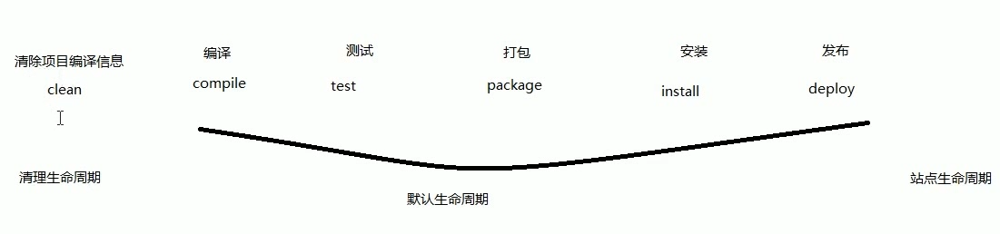
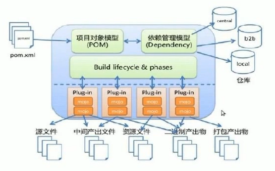
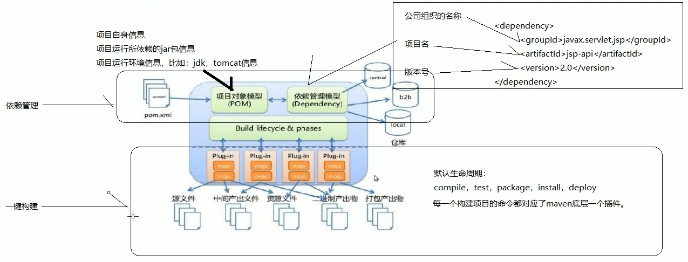

# 04.maven生命周期和概念模型图

- 笔记本：13.Maven
- 创建时间：2020-02-17 15:50:00 UTC
- 更新时间：2020-02-17 16:26:49 UTC
- 印象笔记 GUID：94b4c14e-bdca-42b2-86ed-267c8f716a32

#### maven 生命周期

清除项目编译信息：mvn clean
 编译：mvn compile
 测试：mvn test
 打包：mvn package
 安装：mvn install
 发布：mvn deploy 执行之前必须进行一些配置才可以执行

**发布会执行前面4个（安装，打包，测试，编译）所做的事，安装会执行前面3个所做的事，打包会执行前面两个所做的事，测试会完成编译所做的事，加上测试代码的编译**

#### maven 概念模型图

- 项目对象模型（POM）：其实指的就是maven工程中的pom.xml 文件

  - <groupId> <artifactId> <version> 是项目自身的坐标

  - <dependencies> 标签里面放置的都是项目运行所依赖的jar 包

%23%23%23%23%20maven%20%E7%94%9F%E5%91%BD%E5%91%A8%E6%9C%9F%0A%E6%B8%85%E9%99%A4%E9%A1%B9%E7%9B%AE%E7%BC%96%E8%AF%91%E4%BF%A1%E6%81%AF%EF%BC%9Amvn%20clean%0A%E7%BC%96%E8%AF%91%EF%BC%9Amvn%20compile%0A%E6%B5%8B%E8%AF%95%EF%BC%9Amvn%20test%20%0A%E6%89%93%E5%8C%85%EF%BC%9Amvn%20package%0A%E5%AE%89%E8%A3%85%EF%BC%9Amvn%20install%0A%E5%8F%91%E5%B8%83%EF%BC%9Amvn%20deploy%20%E6%89%A7%E8%A1%8C%E4%B9%8B%E5%89%8D%E5%BF%85%E9%A1%BB%E8%BF%9B%E8%A1%8C%E4%B8%80%E4%BA%9B%E9%85%8D%E7%BD%AE%E6%89%8D%E5%8F%AF%E4%BB%A5%E6%89%A7%E8%A1%8C%0A%0A**%E5%8F%91%E5%B8%83%E4%BC%9A%E6%89%A7%E8%A1%8C%E5%89%8D%E9%9D%A24%E4%B8%AA%EF%BC%88%E5%AE%89%E8%A3%85%EF%BC%8C%E6%89%93%E5%8C%85%EF%BC%8C%E6%B5%8B%E8%AF%95%EF%BC%8C%E7%BC%96%E8%AF%91%EF%BC%89%E6%89%80%E5%81%9A%E7%9A%84%E4%BA%8B%EF%BC%8C%E5%AE%89%E8%A3%85%E4%BC%9A%E6%89%A7%E8%A1%8C%E5%89%8D%E9%9D%A23%E4%B8%AA%E6%89%80%E5%81%9A%E7%9A%84%E4%BA%8B%EF%BC%8C%E6%89%93%E5%8C%85%E4%BC%9A%E6%89%A7%E8%A1%8C%E5%89%8D%E9%9D%A2%E4%B8%A4%E4%B8%AA%E6%89%80%E5%81%9A%E7%9A%84%E4%BA%8B%EF%BC%8C%E6%B5%8B%E8%AF%95%E4%BC%9A%E5%AE%8C%E6%88%90%E7%BC%96%E8%AF%91%E6%89%80%E5%81%9A%E7%9A%84%E4%BA%8B%EF%BC%8C%E5%8A%A0%E4%B8%8A%E6%B5%8B%E8%AF%95%E4%BB%A3%E7%A0%81%E7%9A%84%E7%BC%96%E8%AF%91**%0A%0A!%5B8da9a613a46966153f12ba0dbad624a4.png%5D(en-resource%3A%2F%2Fdatabase%2F1432%3A0)%0A%0A---%0A%0A%23%23%23%23%20maven%20%E6%A6%82%E5%BF%B5%E6%A8%A1%E5%9E%8B%E5%9B%BE%0A!%5B3bbe4918a607e791cdfb29a43118ddaf.png%5D(en-resource%3A%2F%2Fdatabase%2F1434%3A0)%0A%0A!%5Bdd3130bff81659057d42c12190cfff1a.png%5D(en-resource%3A%2F%2Fdatabase%2F1436%3A0)%0A%0A%0A*%20%E9%A1%B9%E7%9B%AE%E5%AF%B9%E8%B1%A1%E6%A8%A1%E5%9E%8B%EF%BC%88POM%EF%BC%89%EF%BC%9A%E5%85%B6%E5%AE%9E%E6%8C%87%E7%9A%84%E5%B0%B1%E6%98%AFmaven%E5%B7%A5%E7%A8%8B%E4%B8%AD%E7%9A%84pom.xml%20%E6%96%87%E4%BB%B6%0A%20%20%20%20*%20%3CgroupId%3E%20%3CartifactId%3E%20%3Cversion%3E%20%E6%98%AF%E9%A1%B9%E7%9B%AE%E8%87%AA%E8%BA%AB%E7%9A%84%E5%9D%90%E6%A0%87%0A%20%20%20%20*%20%3Cdependencies%3E%20%E6%A0%87%E7%AD%BE%E9%87%8C%E9%9D%A2%E6%94%BE%E7%BD%AE%E7%9A%84%E9%83%BD%E6%98%AF%E9%A1%B9%E7%9B%AE%E8%BF%90%E8%A1%8C%E6%89%80%E4%BE%9D%E8%B5%96%E7%9A%84jar%20%E5%8C%85%0A
