# 05.使用骨架构建maven的java工程

- 笔记本：13.Maven
- 创建时间：2020-02-17 16:27:35 UTC
- 更新时间：2020-02-18 06:07:23 UTC
- 印象笔记 GUID：95db43cf-a49a-404b-9413-47548f7d8d6f

#### idea 集成maven

idea -> Configure(或File) -> Settings -> 搜索maven -> Maven home Directory 选择本地安装的maven 的目录 -> User settings file 选择maven 目录下的conf/settings.xml 文件 -> Local repository ：（上面一个配置了，会自动选择）选择本地仓库位置（可以从settings.xml 查看）

Maven 下有个 Runner -> 可以配置 VM Options 配置为 -DarchetypeCatalog=internal（如果使用maven 提供的骨架来创建工程的话，一般是需要联网的。为了确保在不联网的情况下可以正常创建工程，配置了-DarchetypeCatalog=internal 参数，只要我们以前联网下载过相关创建工程的插件，它就会直接从本地而不用联网）
 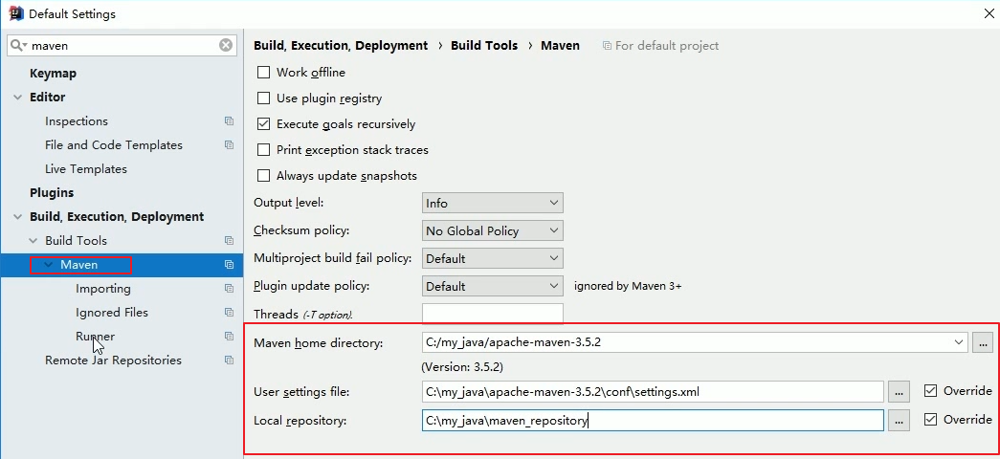

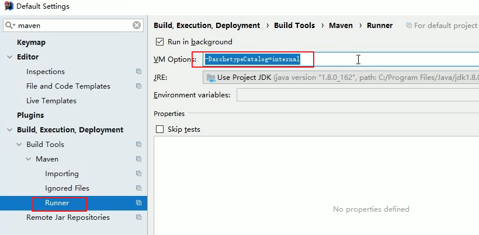

#### 使用 idea 创建一个 maven 的 java 工程(使用maven 骨架)

Create New Project(File->new->project) -> maven 勾选 Create from archetype，选择 `org.apache.maven.archetypes:maven-archetype-quickstart` 它就是ieda 为maven提供好的创建Java 工程的骨架。
 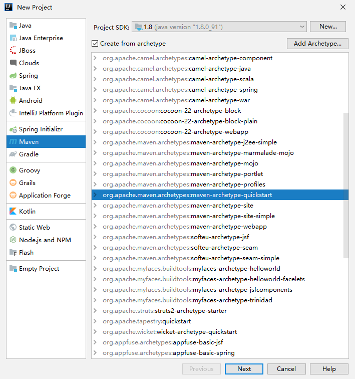
 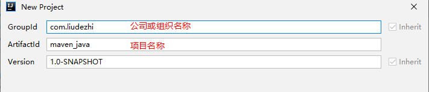
 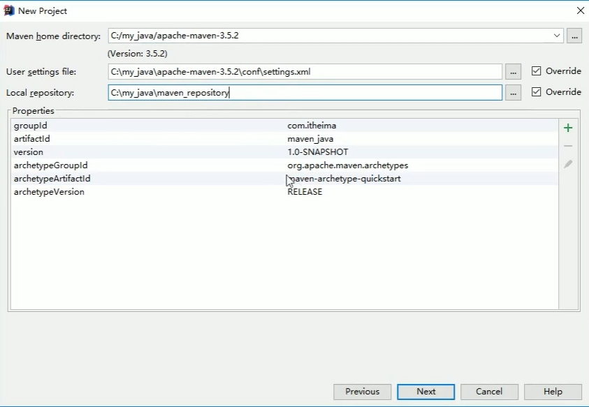
 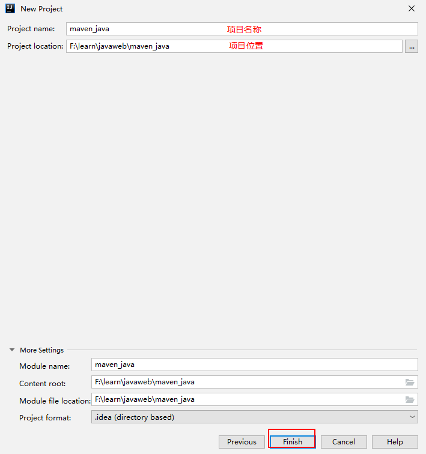

idea默认的文件结构不完整，可以再main上右键 new -> Directory resources -> 右键 -> Mark Directory as -> Resources Root，即可在此目录下放置配置文件了
 同理：测试的配置文件。test/java 右键 -> new Directory ->右键 Mark Directory as -> Test Resourcees Root
 (如果不行，可以修改conf/settings.xml 文件设置[阿里源](https://developer.aliyun.com/mirror/))

#### 使用idea 创建一个maven 工程（不使用骨架，推荐）

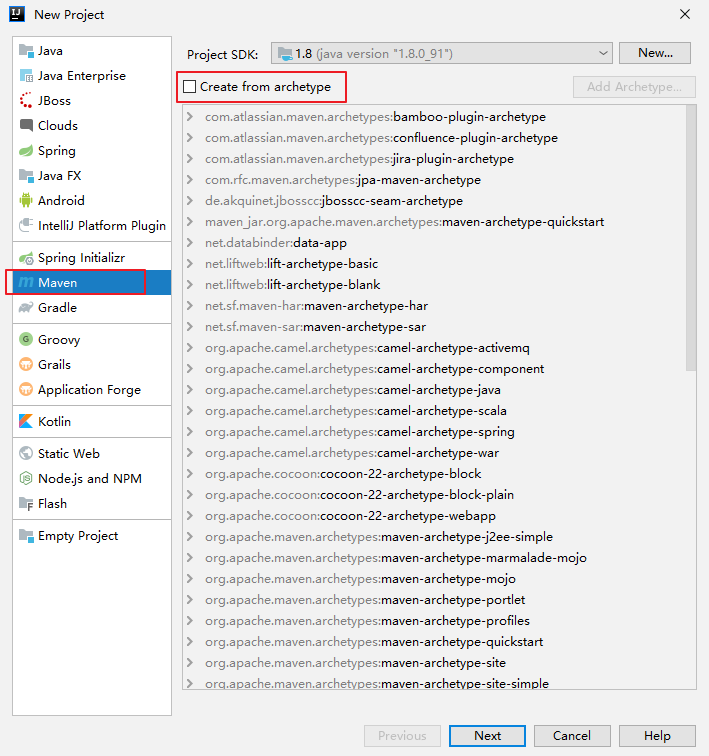

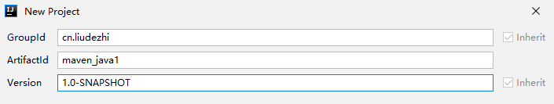
 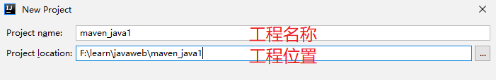
 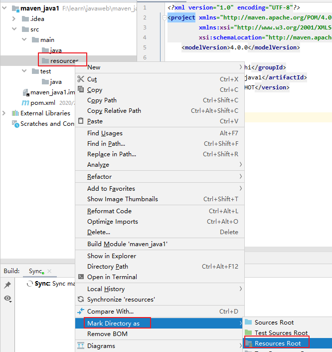

#### 使用idea 创建一个maven web 工程

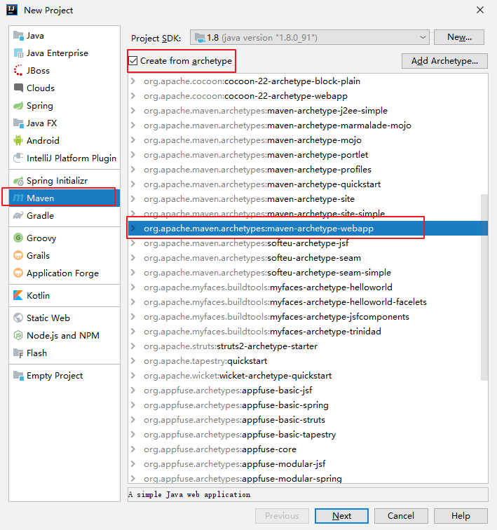

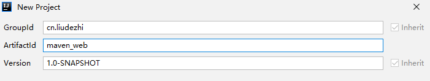
 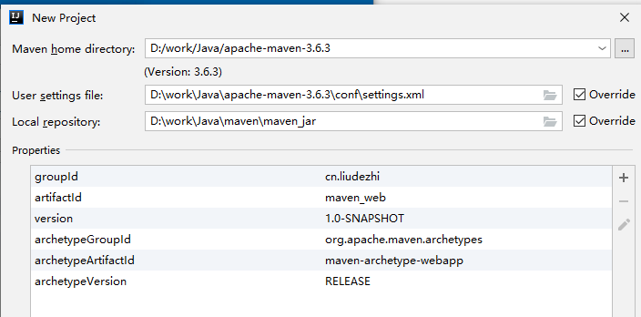
 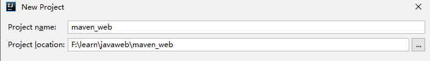
 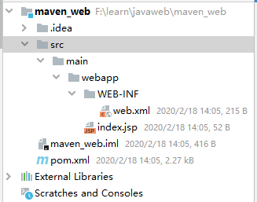

需要手动补齐 src/main/java src/main/resources src/test/java
 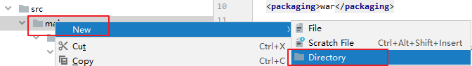
 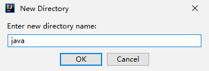

%23%23%23%23%20idea%20%E9%9B%86%E6%88%90maven%0Aidea%20-%3E%20Configure(%E6%88%96File)%20-%3E%20Settings%20-%3E%20%E6%90%9C%E7%B4%A2maven%20-%3E%20Maven%20home%20Directory%20%E9%80%89%E6%8B%A9%E6%9C%AC%E5%9C%B0%E5%AE%89%E8%A3%85%E7%9A%84maven%20%E7%9A%84%E7%9B%AE%E5%BD%95%20-%3E%20User%20settings%20file%20%E9%80%89%E6%8B%A9maven%20%E7%9B%AE%E5%BD%95%E4%B8%8B%E7%9A%84conf%2Fsettings.xml%20%E6%96%87%E4%BB%B6%20-%3E%20Local%20repository%20%EF%BC%9A%EF%BC%88%E4%B8%8A%E9%9D%A2%E4%B8%80%E4%B8%AA%E9%85%8D%E7%BD%AE%E4%BA%86%EF%BC%8C%E4%BC%9A%E8%87%AA%E5%8A%A8%E9%80%89%E6%8B%A9%EF%BC%89%E9%80%89%E6%8B%A9%E6%9C%AC%E5%9C%B0%E4%BB%93%E5%BA%93%E4%BD%8D%E7%BD%AE%EF%BC%88%E5%8F%AF%E4%BB%A5%E4%BB%8Esettings.xml%20%E6%9F%A5%E7%9C%8B%EF%BC%89%0A%0AMaven%20%E4%B8%8B%E6%9C%89%E4%B8%AA%20Runner%20-%3E%20%E5%8F%AF%E4%BB%A5%E9%85%8D%E7%BD%AE%20VM%20Options%20%E9%85%8D%E7%BD%AE%E4%B8%BA%20-DarchetypeCatalog%3Dinternal%EF%BC%88%E5%A6%82%E6%9E%9C%E4%BD%BF%E7%94%A8maven%20%E6%8F%90%E4%BE%9B%E7%9A%84%E9%AA%A8%E6%9E%B6%E6%9D%A5%E5%88%9B%E5%BB%BA%E5%B7%A5%E7%A8%8B%E7%9A%84%E8%AF%9D%EF%BC%8C%E4%B8%80%E8%88%AC%E6%98%AF%E9%9C%80%E8%A6%81%E8%81%94%E7%BD%91%E7%9A%84%E3%80%82%E4%B8%BA%E4%BA%86%E7%A1%AE%E4%BF%9D%E5%9C%A8%E4%B8%8D%E8%81%94%E7%BD%91%E7%9A%84%E6%83%85%E5%86%B5%E4%B8%8B%E5%8F%AF%E4%BB%A5%E6%AD%A3%E5%B8%B8%E5%88%9B%E5%BB%BA%E5%B7%A5%E7%A8%8B%EF%BC%8C%E9%85%8D%E7%BD%AE%E4%BA%86-DarchetypeCatalog%3Dinternal%20%E5%8F%82%E6%95%B0%EF%BC%8C%E5%8F%AA%E8%A6%81%E6%88%91%E4%BB%AC%E4%BB%A5%E5%89%8D%E8%81%94%E7%BD%91%E4%B8%8B%E8%BD%BD%E8%BF%87%E7%9B%B8%E5%85%B3%E5%88%9B%E5%BB%BA%E5%B7%A5%E7%A8%8B%E7%9A%84%E6%8F%92%E4%BB%B6%EF%BC%8C%E5%AE%83%E5%B0%B1%E4%BC%9A%E7%9B%B4%E6%8E%A5%E4%BB%8E%E6%9C%AC%E5%9C%B0%E8%80%8C%E4%B8%8D%E7%94%A8%E8%81%94%E7%BD%91%EF%BC%89%0A!%5Bfe1accd185ef24d01e0c1a035e76ab69.png%5D(en-resource%3A%2F%2Fdatabase%2F1442%3A1)%0A%0A!%5Bb9724cfe61e489650efdba123e3c90d2.png%5D(en-resource%3A%2F%2Fdatabase%2F1440%3A1)%0A%0A---%0A%0A%23%23%23%23%20%E4%BD%BF%E7%94%A8%20idea%20%E5%88%9B%E5%BB%BA%E4%B8%80%E4%B8%AA%20maven%20%E7%9A%84%20java%20%E5%B7%A5%E7%A8%8B(%E4%BD%BF%E7%94%A8maven%20%E9%AA%A8%E6%9E%B6)%0ACreate%20New%20Project(File-%3Enew-%3Eproject)%20-%3E%20maven%20%E5%8B%BE%E9%80%89%20Create%20from%20archetype%EF%BC%8C%E9%80%89%E6%8B%A9%20%60org.apache.maven.archetypes%3Amaven-archetype-quickstart%60%20%E5%AE%83%E5%B0%B1%E6%98%AFieda%20%E4%B8%BAmaven%E6%8F%90%E4%BE%9B%E5%A5%BD%E7%9A%84%E5%88%9B%E5%BB%BAJava%20%E5%B7%A5%E7%A8%8B%E7%9A%84%E9%AA%A8%E6%9E%B6%E3%80%82%0A!%5B6f5de56a525d6c483704c514b306784c.png%5D(en-resource%3A%2F%2Fdatabase%2F1444%3A1)%0A!%5B00af7f23782d16b3ad5442afb1eacc81.png%5D(en-resource%3A%2F%2Fdatabase%2F1446%3A1)%0A!%5B95e4c611ca28bb78bb88f352d906f7e4.png%5D(en-resource%3A%2F%2Fdatabase%2F1448%3A1)%0A!%5Be50b6ced8183051c0eb69da43440e105.png%5D(en-resource%3A%2F%2Fdatabase%2F1450%3A1)%0A%0Aidea%E9%BB%98%E8%AE%A4%E7%9A%84%E6%96%87%E4%BB%B6%E7%BB%93%E6%9E%84%E4%B8%8D%E5%AE%8C%E6%95%B4%EF%BC%8C%E5%8F%AF%E4%BB%A5%E5%86%8Dmain%E4%B8%8A%E5%8F%B3%E9%94%AE%20new%20%20-%3E%20Directory%20resources%20-%3E%20%E5%8F%B3%E9%94%AE%20-%3E%20Mark%20Directory%20as%20-%3E%20Resources%20Root%EF%BC%8C%E5%8D%B3%E5%8F%AF%E5%9C%A8%E6%AD%A4%E7%9B%AE%E5%BD%95%E4%B8%8B%E6%94%BE%E7%BD%AE%E9%85%8D%E7%BD%AE%E6%96%87%E4%BB%B6%E4%BA%86%0A%E5%90%8C%E7%90%86%EF%BC%9A%E6%B5%8B%E8%AF%95%E7%9A%84%E9%85%8D%E7%BD%AE%E6%96%87%E4%BB%B6%E3%80%82test%2Fjava%20%E5%8F%B3%E9%94%AE%20-%3E%20new%20Directory%20-%3E%E5%8F%B3%E9%94%AE%20Mark%20Directory%20as%20-%3E%20Test%20Resourcees%20Root%0A(%E5%A6%82%E6%9E%9C%E4%B8%8D%E8%A1%8C%EF%BC%8C%E5%8F%AF%E4%BB%A5%E4%BF%AE%E6%94%B9conf%2Fsettings.xml%20%E6%96%87%E4%BB%B6%E8%AE%BE%E7%BD%AE%5B%E9%98%BF%E9%87%8C%E6%BA%90%5D(https%3A%2F%2Fdeveloper.aliyun.com%2Fmirror%2F))%0A%0A%0A---%0A%0A%0A%23%23%23%23%20%E4%BD%BF%E7%94%A8idea%20%E5%88%9B%E5%BB%BA%E4%B8%80%E4%B8%AAmaven%20%E5%B7%A5%E7%A8%8B%EF%BC%88%E4%B8%8D%E4%BD%BF%E7%94%A8%E9%AA%A8%E6%9E%B6%EF%BC%8C%E6%8E%A8%E8%8D%90%EF%BC%89%0A!%5B7d46f26dad883bde1bce3cb36ae77bfa.png%5D(en-resource%3A%2F%2Fdatabase%2F1452%3A0)%0A%0A!%5Be741fe5702fa991600c5d4a4944ea1c4.png%5D(en-resource%3A%2F%2Fdatabase%2F1454%3A0)%0A!%5B2a625f74287c2e3f03d0490ee1fd271a.png%5D(en-resource%3A%2F%2Fdatabase%2F1456%3A0)%0A!%5B524e863fe708a757232cab6f052f9aca.png%5D(en-resource%3A%2F%2Fdatabase%2F1458%3A0)%0A%0A---%0A%0A%23%23%23%23%20%E4%BD%BF%E7%94%A8idea%20%E5%88%9B%E5%BB%BA%E4%B8%80%E4%B8%AAmaven%20web%20%E5%B7%A5%E7%A8%8B%0A!%5Bcf3dd5b6c008e615deb781326af9b082.png%5D(en-resource%3A%2F%2Fdatabase%2F1460%3A0)%0A%0A!%5Bfe688e1f4bf78e5bcefebe607c6e0951.png%5D(en-resource%3A%2F%2Fdatabase%2F1462%3A0)%0A!%5B5a71e939113e300c434f73687dde3377.png%5D(en-resource%3A%2F%2Fdatabase%2F1464%3A0)%0A!%5Bcf71a7d0a0c5a65b2876bd3792c48cc6.png%5D(en-resource%3A%2F%2Fdatabase%2F1466%3A0)%0A!%5B5e51d5bf158f9aac48fe00a80223b2af.png%5D(en-resource%3A%2F%2Fdatabase%2F1468%3A0)%0A%0A%E9%9C%80%E8%A6%81%E6%89%8B%E5%8A%A8%E8%A1%A5%E9%BD%90%20src%2Fmain%2Fjava%20src%2Fmain%2Fresources%20src%2Ftest%2Fjava%0A!%5Be5ad6517994a5b8e16ef937264d6e661.png%5D(en-resource%3A%2F%2Fdatabase%2F1470%3A0)%0A!%5B05496db654992ad4135a607c4539865f.png%5D(en-resource%3A%2F%2Fdatabase%2F1472%3A0)%0A!%5Bb48f4aadc9c10fa4910956226afa3a85.png%5D(en-resource%3A%2F%2Fdatabase%2F1474%3A0)%0A
