# 06.maven工程servlet实例

- 笔记本：13.Maven
- 创建时间：2020-02-18 06:08:39 UTC
- 更新时间：2020-02-28 09:20:25 UTC
- 印象笔记 GUID：a799f9d3-0176-4888-8cde-2e522a21ffe5

idea 默认只有webapp 可以创建jsp 页面，要求比较严格。（有些默认webapp也不可以创建）
 如：想在src/main 中创建jsp 页面。
 解决方法：
 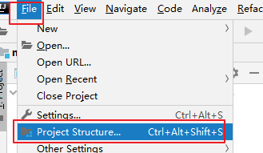

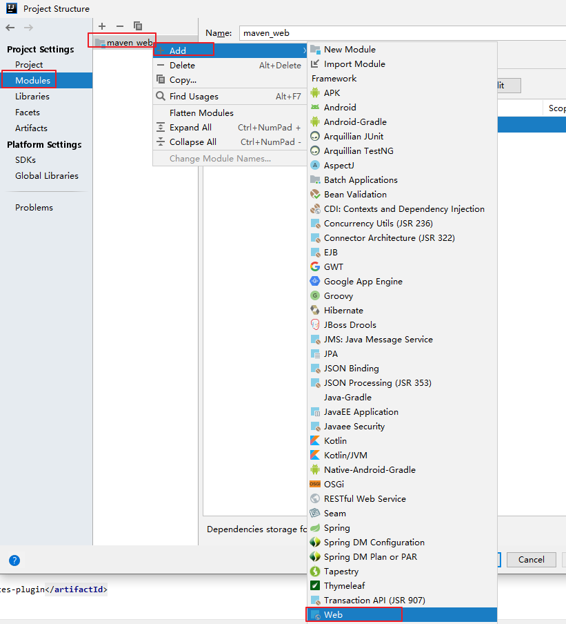
 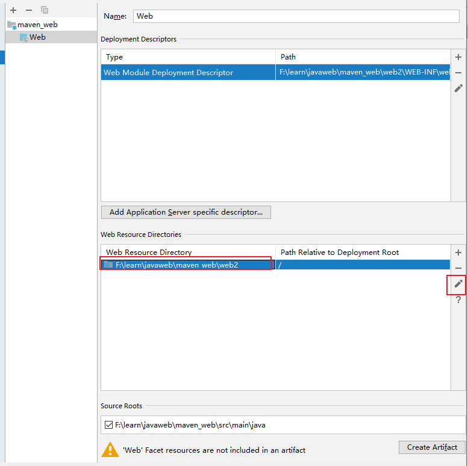
 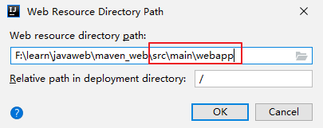

同理：添加src/main 文件夹，此文件夹下即可创建 JSP文件。
 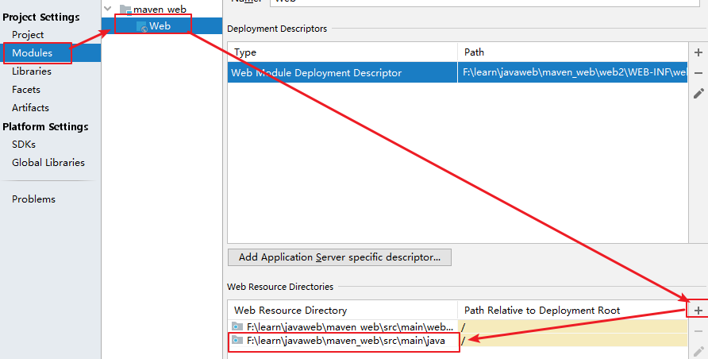

创建Servlet
 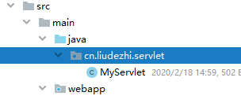
 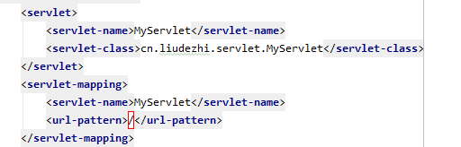
 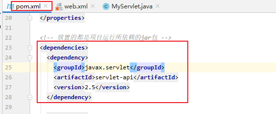
 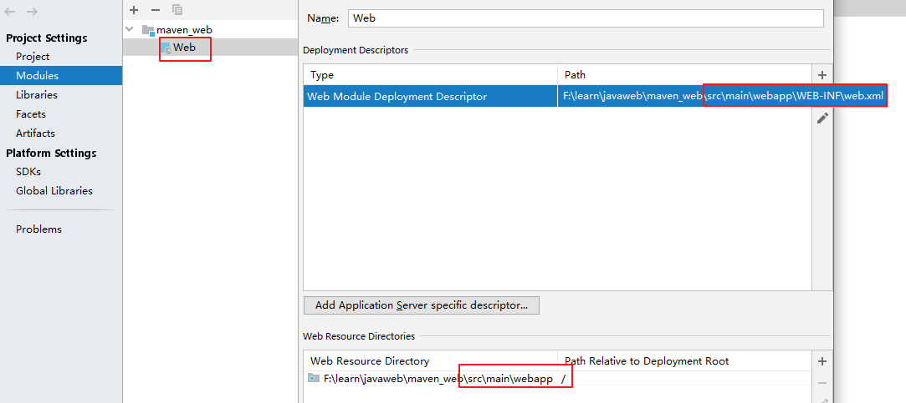

**右键无新建servlet 选项解决方案：**

[参考](https://blog.csdn.net/Delicious_Life/article/details/89515363)
 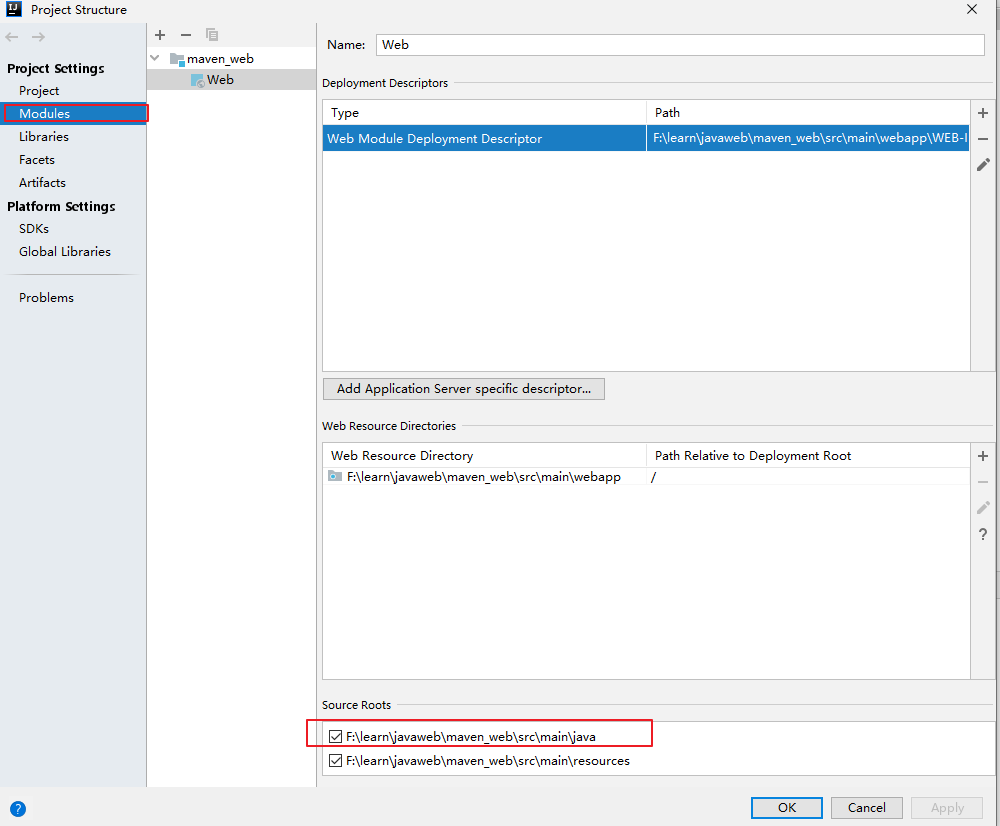

```
<dependencies>
    <dependency>
      <groupId>junit</groupId>
      <artifactId>junit</artifactId>
      <version>4.11</version>
      <scope>test</scope>
    </dependency>
    <dependency>
      <groupId>javax.servlet</groupId>
      <artifactId>servlet-api</artifactId>
      <version>2.5</version>
      <scope>provided</scope>
    </dependency>
    <dependency>
      <groupId>javax.servlet</groupId>
      <artifactId>jsp-api</artifactId>
      <version>2.0</version>
      <scope>provided</scope>
    </dependency>
  </dependencies>

```

```
public class MyServlet extends HttpServlet {
    @Override
    protected void doPost(HttpServletRequest request, HttpServletResponse response) throws ServletException, IOException {
        request.getRequestDispatcher("/hello.jsp").forward(request, response);
    }

    @Override
    protected void doGet(HttpServletRequest request, HttpServletResponse response) throws ServletException, IOException {
        doPost(request, response);
    }
}

```

```
<web-app>
  <servlet>
    <servlet-name>MyServlet</servlet-name>
    <servlet-class>com.liudezhi.servlet.MyServlet</servlet-class>
  </servlet>
  <servlet-mapping>
    <servlet-name>MyServlet</servlet-name>
    <url-pattern>/myServlet</url-pattern>
  </servlet-mapping>
</web-app>

```

**导入依赖后，HttpServlet 依旧报错：** 最开始使用的3.6.3 版本的maven，存在兼容问题，换成了3.6.0后这个问题就解决了。

**运行项目**
 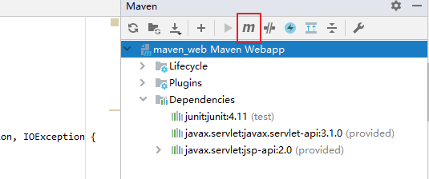
 `mvn tomcat:run`
 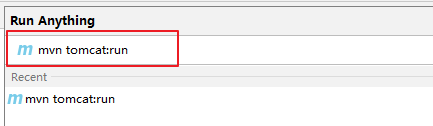

访问 http://localhost:8080/maven_web
 会报错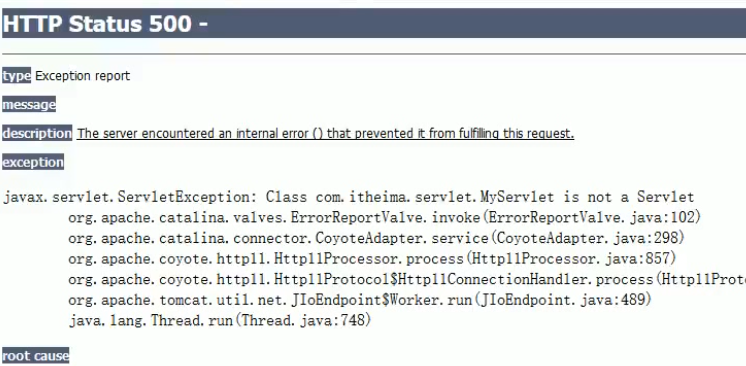

原因：tomcat自身带有 servlet-api.jar 和 jsp.api.jar 和我们导入的servlet-api 及jsp.api包冲突。
 方法：<scope>provided</scope> 指定只在编译时起作用

**注：** tomcat:run 用的是tomcat6，对应jdk过高会报错
 **解决方法：** 使用tomcat7:run
 pom.xml:

```
<plugin>
  <groupId>org.apache.tomcat.maven</groupId>
  <artifactId>tomcat7-maven-plugin</artifactId>
  <version>2.1</version>
  <configuration>
    <path>/test</path>
    <port>8080</port>
    <uriEncoding>UTF-8</uriEncoding>
    <url>http://localhost:8080/test</url>
    <server>Tomcat7</server>
  </configuration>
</plugin>

<!-- 编译插件 -->
<plugin>
  <groupId>org.apache.maven.plugins</groupId>
  <artifactId>maven-compiler-plugin</artifactId>
  <version>3.1</version>
  <configuration>
    <source>1.8</source>
    <target>1.8</target>
    <encoding>UTF-8</encoding>
  </configuration>
</plugin>

```

添加tomcat7 插件：
 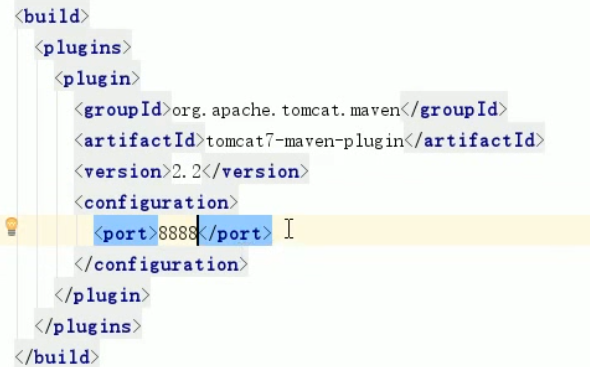

**配置动态模板：**
 File -> settings -> 搜索live -> live Templates
 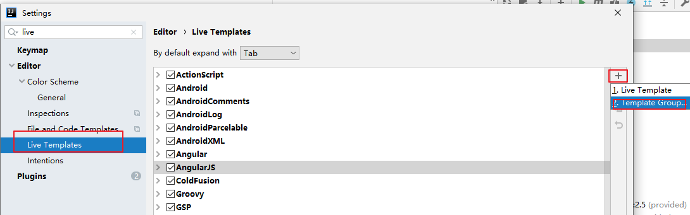
 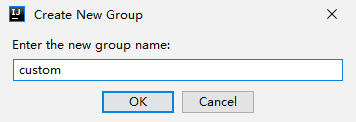
 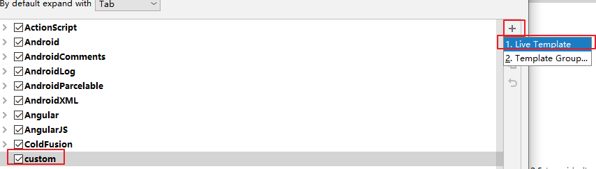
 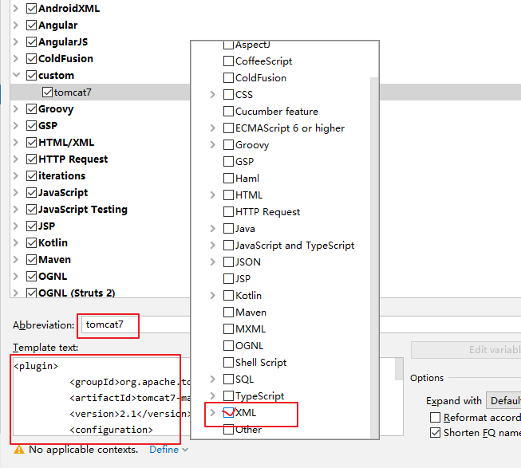

模板创建好后，在xml 中输入tomcat7 回车即可

jdk插件：
 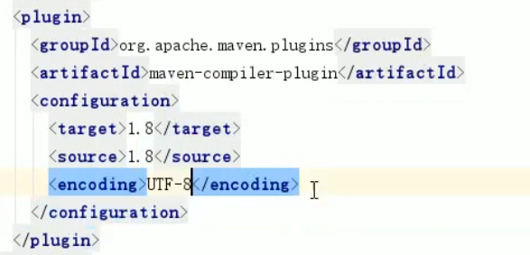

```
<!-- 编译插件 -->
        <plugin>
          <groupId>org.apache.maven.plugins</groupId>
          <artifactId>maven-compiler-plugin</artifactId>
          <version>3.1</version>
          <configuration>
            <source>1.8</source>
            <target>1.8</target>
            <encoding>UTF-8</encoding>
          </configuration>
        </plugin>

```

同理添加jdk 模板
 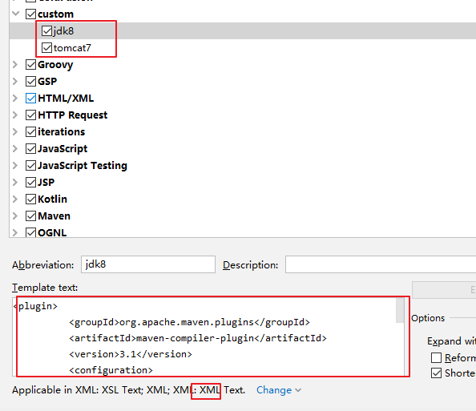

idea%20%E9%BB%98%E8%AE%A4%E5%8F%AA%E6%9C%89webapp%20%E5%8F%AF%E4%BB%A5%E5%88%9B%E5%BB%BAjsp%20%E9%A1%B5%E9%9D%A2%EF%BC%8C%E8%A6%81%E6%B1%82%E6%AF%94%E8%BE%83%E4%B8%A5%E6%A0%BC%E3%80%82%EF%BC%88%E6%9C%89%E4%BA%9B%E9%BB%98%E8%AE%A4webapp%E4%B9%9F%E4%B8%8D%E5%8F%AF%E4%BB%A5%E5%88%9B%E5%BB%BA%EF%BC%89%0A%E5%A6%82%EF%BC%9A%E6%83%B3%E5%9C%A8src%2Fmain%20%E4%B8%AD%E5%88%9B%E5%BB%BAjsp%20%E9%A1%B5%E9%9D%A2%E3%80%82%0A%E8%A7%A3%E5%86%B3%E6%96%B9%E6%B3%95%EF%BC%9A%0A!%5B26249c851921a3ea8601a33e483d76f6.png%5D(en-resource%3A%2F%2Fdatabase%2F1478%3A1)%0A%0A%0A%0A!%5B5e50dcb57869f7262e411e9aa5effe87.png%5D(en-resource%3A%2F%2Fdatabase%2F1480%3A1)%0A!%5Bacdf80b68ab9fe34d050c1784530b491.png%5D(en-resource%3A%2F%2Fdatabase%2F1482%3A1)%0A!%5Bcd7b0a2c36eafe6a137fc35f22ba65e5.png%5D(en-resource%3A%2F%2Fdatabase%2F1484%3A1)%0A%0A%0A%E5%90%8C%E7%90%86%EF%BC%9A%E6%B7%BB%E5%8A%A0src%2Fmain%20%E6%96%87%E4%BB%B6%E5%A4%B9%EF%BC%8C%E6%AD%A4%E6%96%87%E4%BB%B6%E5%A4%B9%E4%B8%8B%E5%8D%B3%E5%8F%AF%E5%88%9B%E5%BB%BA%20JSP%E6%96%87%E4%BB%B6%E3%80%82%0A!%5B0fcae9bdf9377b156c6b8fc805c74f93.png%5D(en-resource%3A%2F%2Fdatabase%2F1486%3A1)%0A%0A%0A---%20%0A%0A%E5%88%9B%E5%BB%BAServlet%0A!%5B4db4dde8b1df1f90821d509a6dc296a2.png%5D(en-resource%3A%2F%2Fdatabase%2F1488%3A1)%0A!%5B6c1763a71abee3649fdf89dd4e831bb0.png%5D(en-resource%3A%2F%2Fdatabase%2F1490%3A1)%0A!%5Bfed9a034b0419436743b0ae835fa0ac3.png%5D(en-resource%3A%2F%2Fdatabase%2F1492%3A1)%0A!%5B82bf27714d12b6cf2790e356b7998dca.png%5D(en-resource%3A%2F%2Fdatabase%2F1494%3A1)%0A%0A%0A**%E5%8F%B3%E9%94%AE%E6%97%A0%E6%96%B0%E5%BB%BAservlet%20%E9%80%89%E9%A1%B9%E8%A7%A3%E5%86%B3%E6%96%B9%E6%A1%88%EF%BC%9A**%0A%5B%E5%8F%82%E8%80%83%5D(https%3A%2F%2Fblog.csdn.net%2FDelicious_Life%2Farticle%2Fdetails%2F89515363)%0A!%5B6b3fbc12140bbafdf64356e0dfb22f01.png%5D(en-resource%3A%2F%2Fdatabase%2F1524%3A0)%0A%0A%60%60%60xml%0A%3Cdependencies%3E%0A%20%20%20%20%3Cdependency%3E%0A%20%20%20%20%20%20%3CgroupId%3Ejunit%3C%2FgroupId%3E%0A%20%20%20%20%20%20%3CartifactId%3Ejunit%3C%2FartifactId%3E%0A%20%20%20%20%20%20%3Cversion%3E4.11%3C%2Fversion%3E%0A%20%20%20%20%20%20%3Cscope%3Etest%3C%2Fscope%3E%0A%20%20%20%20%3C%2Fdependency%3E%0A%20%20%20%20%3Cdependency%3E%0A%20%20%20%20%20%20%3CgroupId%3Ejavax.servlet%3C%2FgroupId%3E%0A%20%20%20%20%20%20%3CartifactId%3Eservlet-api%3C%2FartifactId%3E%0A%20%20%20%20%20%20%3Cversion%3E2.5%3C%2Fversion%3E%0A%20%20%20%20%20%20%3Cscope%3Eprovided%3C%2Fscope%3E%0A%20%20%20%20%3C%2Fdependency%3E%0A%20%20%20%20%3Cdependency%3E%0A%20%20%20%20%20%20%3CgroupId%3Ejavax.servlet%3C%2FgroupId%3E%0A%20%20%20%20%20%20%3CartifactId%3Ejsp-api%3C%2FartifactId%3E%0A%20%20%20%20%20%20%3Cversion%3E2.0%3C%2Fversion%3E%0A%20%20%20%20%20%20%3Cscope%3Eprovided%3C%2Fscope%3E%0A%20%20%20%20%3C%2Fdependency%3E%0A%20%20%3C%2Fdependencies%3E%0A%60%60%60%0A%0A%60%60%60java%0Apublic%20class%20MyServlet%20extends%20HttpServlet%20%7B%0A%20%20%20%20%40Override%0A%20%20%20%20protected%20void%20doPost(HttpServletRequest%20request%2C%20HttpServletResponse%20response)%20throws%20ServletException%2C%20IOException%20%7B%0A%20%20%20%20%20%20%20%20request.getRequestDispatcher(%22%2Fhello.jsp%22).forward(request%2C%20response)%3B%0A%20%20%20%20%7D%0A%0A%20%20%20%20%40Override%0A%20%20%20%20protected%20void%20doGet(HttpServletRequest%20request%2C%20HttpServletResponse%20response)%20throws%20ServletException%2C%20IOException%20%7B%0A%20%20%20%20%20%20%20%20doPost(request%2C%20response)%3B%0A%20%20%20%20%7D%0A%7D%0A%60%60%60%0A%0A%60%60%60xml%0A%3Cweb-app%3E%0A%20%20%3Cservlet%3E%0A%20%20%20%20%3Cservlet-name%3EMyServlet%3C%2Fservlet-name%3E%0A%20%20%20%20%3Cservlet-class%3Ecom.liudezhi.servlet.MyServlet%3C%2Fservlet-class%3E%0A%20%20%3C%2Fservlet%3E%0A%20%20%3Cservlet-mapping%3E%0A%20%20%20%20%3Cservlet-name%3EMyServlet%3C%2Fservlet-name%3E%0A%20%20%20%20%3Curl-pattern%3E%2FmyServlet%3C%2Furl-pattern%3E%0A%20%20%3C%2Fservlet-mapping%3E%0A%3C%2Fweb-app%3E%0A%60%60%60%0A%0A**%E5%AF%BC%E5%85%A5%E4%BE%9D%E8%B5%96%E5%90%8E%EF%BC%8CHttpServlet%20%E4%BE%9D%E6%97%A7%E6%8A%A5%E9%94%99%EF%BC%9A**%20%E6%9C%80%E5%BC%80%E5%A7%8B%E4%BD%BF%E7%94%A8%E7%9A%843.6.3%20%E7%89%88%E6%9C%AC%E7%9A%84maven%EF%BC%8C%E5%AD%98%E5%9C%A8%E5%85%BC%E5%AE%B9%E9%97%AE%E9%A2%98%EF%BC%8C%E6%8D%A2%E6%88%90%E4%BA%863.6.0%E5%90%8E%E8%BF%99%E4%B8%AA%E9%97%AE%E9%A2%98%E5%B0%B1%E8%A7%A3%E5%86%B3%E4%BA%86%E3%80%82%0A%0A%0A**%E8%BF%90%E8%A1%8C%E9%A1%B9%E7%9B%AE**%0A!%5B9ab35092174178042323e5b233066a11.png%5D(en-resource%3A%2F%2Fdatabase%2F1526%3A0)%0A%60mvn%20tomcat%3Arun%60%0A!%5Ba53d587dc89c09bfd554565cadf9fd9d.png%5D(en-resource%3A%2F%2Fdatabase%2F1528%3A0)%0A%0A%E8%AE%BF%E9%97%AE%20http%3A%2F%2Flocalhost%3A8080%2Fmaven_web%0A%E4%BC%9A%E6%8A%A5%E9%94%99!%5B069c4137cc638ad3ab0bffdc62ed6100.png%5D(en-resource%3A%2F%2Fdatabase%2F1532%3A0)%0A%0A%E5%8E%9F%E5%9B%A0%EF%BC%9Atomcat%E8%87%AA%E8%BA%AB%E5%B8%A6%E6%9C%89%20servlet-api.jar%20%E5%92%8C%20jsp.api.jar%20%E5%92%8C%E6%88%91%E4%BB%AC%E5%AF%BC%E5%85%A5%E7%9A%84servlet-api%20%E5%8F%8Ajsp.api%E5%8C%85%E5%86%B2%E7%AA%81%E3%80%82%0A%E6%96%B9%E6%B3%95%EF%BC%9A%3Cscope%3Eprovided%3C%2Fscope%3E%20%E6%8C%87%E5%AE%9A%E5%8F%AA%E5%9C%A8%E7%BC%96%E8%AF%91%E6%97%B6%E8%B5%B7%E4%BD%9C%E7%94%A8%0A%0A%0A**%E6%B3%A8%EF%BC%9A**%20tomcat%3Arun%20%E7%94%A8%E7%9A%84%E6%98%AFtomcat6%EF%BC%8C%E5%AF%B9%E5%BA%94jdk%E8%BF%87%E9%AB%98%E4%BC%9A%E6%8A%A5%E9%94%99%0A**%E8%A7%A3%E5%86%B3%E6%96%B9%E6%B3%95%EF%BC%9A**%20%E4%BD%BF%E7%94%A8tomcat7%3Arun%0Apom.xml%3A%0A%60%60%60xml%0A%3Cplugin%3E%0A%20%20%3CgroupId%3Eorg.apache.tomcat.maven%3C%2FgroupId%3E%0A%20%20%3CartifactId%3Etomcat7-maven-plugin%3C%2FartifactId%3E%0A%20%20%3Cversion%3E2.1%3C%2Fversion%3E%0A%20%20%3Cconfiguration%3E%0A%20%20%20%20%3Cpath%3E%2Ftest%3C%2Fpath%3E%0A%20%20%20%20%3Cport%3E8080%3C%2Fport%3E%0A%20%20%20%20%3CuriEncoding%3EUTF-8%3C%2FuriEncoding%3E%0A%20%20%20%20%3Curl%3Ehttp%3A%2F%2Flocalhost%3A8080%2Ftest%3C%2Furl%3E%0A%20%20%20%20%3Cserver%3ETomcat7%3C%2Fserver%3E%0A%20%20%3C%2Fconfiguration%3E%0A%3C%2Fplugin%3E%0A%0A%3C!--%20%E7%BC%96%E8%AF%91%E6%8F%92%E4%BB%B6%20--%3E%0A%3Cplugin%3E%0A%20%20%3CgroupId%3Eorg.apache.maven.plugins%3C%2FgroupId%3E%0A%20%20%3CartifactId%3Emaven-compiler-plugin%3C%2FartifactId%3E%0A%20%20%3Cversion%3E3.1%3C%2Fversion%3E%0A%20%20%3Cconfiguration%3E%0A%20%20%20%20%3Csource%3E1.8%3C%2Fsource%3E%0A%20%20%20%20%3Ctarget%3E1.8%3C%2Ftarget%3E%0A%20%20%20%20%3Cencoding%3EUTF-8%3C%2Fencoding%3E%0A%20%20%3C%2Fconfiguration%3E%0A%3C%2Fplugin%3E%0A%60%60%60%0A%E6%B7%BB%E5%8A%A0tomcat7%20%E6%8F%92%E4%BB%B6%EF%BC%9A%0A!%5Bc71fcf4035481a3e36afb9ebff420825.png%5D(en-resource%3A%2F%2Fdatabase%2F1536%3A0)%0A%0A**%E9%85%8D%E7%BD%AE%E5%8A%A8%E6%80%81%E6%A8%A1%E6%9D%BF%EF%BC%9A**%0AFile%20-%3E%20settings%20-%3E%20%E6%90%9C%E7%B4%A2live%20-%3E%20live%20Templates%0A!%5Bd689fbf1e86250a977d73c47f3bd2cfa.png%5D(en-resource%3A%2F%2Fdatabase%2F1538%3A0)%0A!%5Be5f52ccdc0de6081a27f36afad05d8fa.png%5D(en-resource%3A%2F%2Fdatabase%2F1540%3A0)%0A!%5B3d844f87c0b55a9b8d0e2a3100ccaa5b.png%5D(en-resource%3A%2F%2Fdatabase%2F1542%3A0)%0A!%5B8cb4ee9badda403159bd64ab170fb3f2.png%5D(en-resource%3A%2F%2Fdatabase%2F1544%3A0)%0A%0A%E6%A8%A1%E6%9D%BF%E5%88%9B%E5%BB%BA%E5%A5%BD%E5%90%8E%EF%BC%8C%E5%9C%A8xml%20%E4%B8%AD%E8%BE%93%E5%85%A5tomcat7%20%E5%9B%9E%E8%BD%A6%E5%8D%B3%E5%8F%AF%0A%0A%0Ajdk%E6%8F%92%E4%BB%B6%EF%BC%9A%0A!%5B5a6fd0109286ae065a844093bccbf993.png%5D(en-resource%3A%2F%2Fdatabase%2F1546%3A0)%0A%60%60%60xml%0A%3C!--%20%E7%BC%96%E8%AF%91%E6%8F%92%E4%BB%B6%20--%3E%0A%20%20%20%20%20%20%20%20%3Cplugin%3E%0A%20%20%20%20%20%20%20%20%20%20%3CgroupId%3Eorg.apache.maven.plugins%3C%2FgroupId%3E%0A%20%20%20%20%20%20%20%20%20%20%3CartifactId%3Emaven-compiler-plugin%3C%2FartifactId%3E%0A%20%20%20%20%20%20%20%20%20%20%3Cversion%3E3.1%3C%2Fversion%3E%0A%20%20%20%20%20%20%20%20%20%20%3Cconfiguration%3E%0A%20%20%20%20%20%20%20%20%20%20%20%20%3Csource%3E1.8%3C%2Fsource%3E%0A%20%20%20%20%20%20%20%20%20%20%20%20%3Ctarget%3E1.8%3C%2Ftarget%3E%0A%20%20%20%20%20%20%20%20%20%20%20%20%3Cencoding%3EUTF-8%3C%2Fencoding%3E%0A%20%20%20%20%20%20%20%20%20%20%3C%2Fconfiguration%3E%0A%20%20%20%20%20%20%20%20%3C%2Fplugin%3E%0A%60%60%60%0A%E5%90%8C%E7%90%86%E6%B7%BB%E5%8A%A0jdk%20%E6%A8%A1%E6%9D%BF%0A!%5Bd6c7a7c2593388508459c98a3df2faaa.png%5D(en-resource%3A%2F%2Fdatabase%2F1548%3A0)%0A
