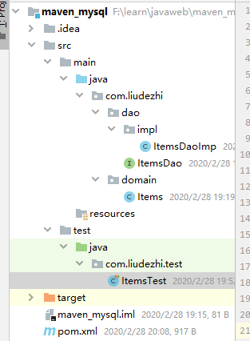
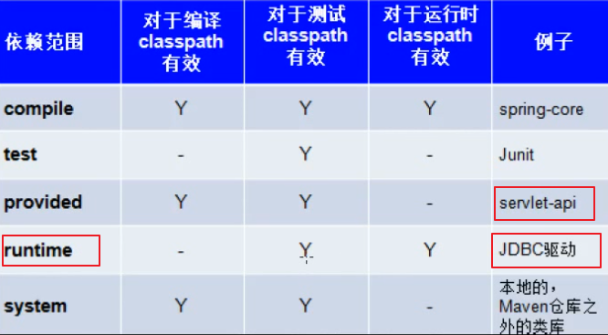

# 07.maven的java工程取mysql数据库

- 笔记本：13.Maven
- 创建时间：2020-02-28 09:21:51 UTC
- 更新时间：2020-02-29 08:36:23 UTC
- 印象笔记 GUID：e3aa299a-7610-429e-905f-f0ea9b2f7e15

#### 项目结构



#### 代码：

**pom.xml**

```
<?xml version="1.0" encoding="UTF-8"?>
<project xmlns="http://maven.apache.org/POM/4.0.0"
         xmlns:xsi="http://www.w3.org/2001/XMLSchema-instance"
         xsi:schemaLocation="http://maven.apache.org/POM/4.0.0 http://maven.apache.org/xsd/maven-4.0.0.xsd">
    <modelVersion>4.0.0</modelVersion>
    <groupId>com.liudezhi</groupId>
    <artifactId>maven_mysql</artifactId>
    <version>1.0-SNAPSHOT</version>
    <dependencies>
        <!-- https://mvnrepository.com/artifact/mysql/mysql-connector-java -->
        <dependency>
            <groupId>mysql</groupId>
            <artifactId>mysql-connector-java</artifactId>
            <version>8.0.11</version>
            <scope>runtime</scope>
        </dependency>

        <dependency>
            <groupId>junit</groupId>
            <artifactId>junit</artifactId>
            <version>4.12</version>
        </dependency>
    </dependencies>
</project>

```



**Items.java**

```
package com.liudezhi.domain;

public class Items {
    private Integer id;
    private String name;
    public Integer getId() {
        return id;
    }
    public void setId(Integer id) {
        this.id = id;
    }
    public String getName() {
        return name;
    }
    public void setName(String name) {
        this.name = name;
    }
}

```

**ItemsDao.java**

```
package com.liudezhi.dao;
import com.liudezhi.domain.Items;
import java.sql.SQLException;
import java.util.List;

public interface ItemsDao {
    public List<Items> findAll() throws SQLException, ClassNotFoundException;
}

```

**ItemsDaoImpl.java**

```
package com.liudezhi.dao.impl;

import com.liudezhi.dao.ItemsDao;
import com.liudezhi.domain.Items;

import java.sql.*;
import java.util.ArrayList;
import java.util.List;

/**
 * 要想从数据库中取出数据
 * 必须有四个属性：数据库驱动，链接数据库的地址，数据库用户名，数据库密码
 */
public class ItemsDaoImp implements ItemsDao {
    public List<Items> findAll() throws SQLException, ClassNotFoundException {
        List<Items> list = new ArrayList<Items>();
        // 获取contection 对象
        Connection connection = null;
        // 获取真正操作数据的对象
        PreparedStatement pst = null;
        // 执行数据库查询操作
        ResultSet rs = null;
        try {
            // 加载驱动类
            Class.forName("com.mysql.cj.jdbc.Driver");
            connection = DriverManager.getConnection("jdbc:mysql://localhost:3306/learn_java?useUnicode=true&characterEncoding=utf-8&useSSL=false&serverTimezone = GMT", "root", "Liudezhi");
//            connection = DriverManager.getConnection("jdbc:mysql://localhost:3306/learn_java?serverTimezone=UTC?useSSL=false", "root", "Liudezhi");
            pst = connection.prepareCall("select * from items");
            rs = pst.executeQuery();
            // 把数据库结果集转成java的 List 集合
            while(rs.next()) {
                Items items = new Items();
                items.setId(rs.getInt("id"));
                items.setName(rs.getString("name"));
                list.add(items);
            }
        } catch (Exception e) {
            e.printStackTrace();
        } finally {
            connection.close();
            pst.close();
            rs.close();
        }
        return list;
    }
}

```

**ItemsTest.java**

```
package com.liudezhi.test;

import com.liudezhi.dao.ItemsDao;
import com.liudezhi.dao.impl.ItemsDaoImp;
import com.liudezhi.domain.Items;
import org.junit.Test;

import java.sql.SQLException;
import java.util.List;

public class ItemsTest {
    @Test
    public void findAll() throws SQLException, ClassNotFoundException {
        ItemsDao dao = new ItemsDaoImp();
        List<Items> list = dao.findAll();
        for(Items itmes : list) {
            System.out.println(itmes.getName());
        }
    }
}

```

%23%23%23%23%20%E9%A1%B9%E7%9B%AE%E7%BB%93%E6%9E%84%0A!%5B5392f5dccebf39fd6b93fb3779658d15.png%5D(en-resource%3A%2F%2Fdatabase%2F1564%3A0)%0A%0A%0A%23%23%23%23%20%E4%BB%A3%E7%A0%81%EF%BC%9A%0A**pom.xml**%0A%60%60%60xml%0A%3C%3Fxml%20version%3D%221.0%22%20encoding%3D%22UTF-8%22%3F%3E%0A%3Cproject%20xmlns%3D%22http%3A%2F%2Fmaven.apache.org%2FPOM%2F4.0.0%22%0A%20%20%20%20%20%20%20%20%20xmlns%3Axsi%3D%22http%3A%2F%2Fwww.w3.org%2F2001%2FXMLSchema-instance%22%0A%20%20%20%20%20%20%20%20%20xsi%3AschemaLocation%3D%22http%3A%2F%2Fmaven.apache.org%2FPOM%2F4.0.0%20http%3A%2F%2Fmaven.apache.org%2Fxsd%2Fmaven-4.0.0.xsd%22%3E%0A%20%20%20%20%3CmodelVersion%3E4.0.0%3C%2FmodelVersion%3E%0A%20%20%20%20%3CgroupId%3Ecom.liudezhi%3C%2FgroupId%3E%0A%20%20%20%20%3CartifactId%3Emaven_mysql%3C%2FartifactId%3E%0A%20%20%20%20%3Cversion%3E1.0-SNAPSHOT%3C%2Fversion%3E%0A%20%20%20%20%3Cdependencies%3E%0A%20%20%20%20%20%20%20%20%3C!--%20https%3A%2F%2Fmvnrepository.com%2Fartifact%2Fmysql%2Fmysql-connector-java%20--%3E%0A%20%20%20%20%20%20%20%20%3Cdependency%3E%0A%20%20%20%20%20%20%20%20%20%20%20%20%3CgroupId%3Emysql%3C%2FgroupId%3E%0A%20%20%20%20%20%20%20%20%20%20%20%20%3CartifactId%3Emysql-connector-java%3C%2FartifactId%3E%0A%20%20%20%20%20%20%20%20%20%20%20%20%3Cversion%3E8.0.11%3C%2Fversion%3E%0A%20%20%20%20%20%20%20%20%20%20%20%20%3Cscope%3Eruntime%3C%2Fscope%3E%0A%20%20%20%20%20%20%20%20%3C%2Fdependency%3E%0A%0A%20%20%20%20%20%20%20%20%3Cdependency%3E%0A%20%20%20%20%20%20%20%20%20%20%20%20%3CgroupId%3Ejunit%3C%2FgroupId%3E%0A%20%20%20%20%20%20%20%20%20%20%20%20%3CartifactId%3Ejunit%3C%2FartifactId%3E%0A%20%20%20%20%20%20%20%20%20%20%20%20%3Cversion%3E4.12%3C%2Fversion%3E%0A%20%20%20%20%20%20%20%20%3C%2Fdependency%3E%0A%20%20%20%20%3C%2Fdependencies%3E%0A%3C%2Fproject%3E%0A%60%60%60%0A!%5Bb79cdd619181afa9bf3bd3335c5663d6.png%5D(en-resource%3A%2F%2Fdatabase%2F1554%3A1)%0A%0A%0A**Items.java**%0A%60%60%60java%0Apackage%20com.liudezhi.domain%3B%0A%0Apublic%20class%20Items%20%7B%0A%20%20%20%20private%20Integer%20id%3B%0A%20%20%20%20private%20String%20name%3B%0A%20%20%20%20public%20Integer%20getId()%20%7B%0A%20%20%20%20%20%20%20%20return%20id%3B%0A%20%20%20%20%7D%0A%20%20%20%20public%20void%20setId(Integer%20id)%20%7B%0A%20%20%20%20%20%20%20%20this.id%20%3D%20id%3B%0A%20%20%20%20%7D%0A%20%20%20%20public%20String%20getName()%20%7B%0A%20%20%20%20%20%20%20%20return%20name%3B%0A%20%20%20%20%7D%0A%20%20%20%20public%20void%20setName(String%20name)%20%7B%0A%20%20%20%20%20%20%20%20this.name%20%3D%20name%3B%0A%20%20%20%20%7D%0A%7D%0A%60%60%60%0A**ItemsDao.java**%0A%60%60%60java%0Apackage%20com.liudezhi.dao%3B%0Aimport%20com.liudezhi.domain.Items%3B%0Aimport%20java.sql.SQLException%3B%0Aimport%20java.util.List%3B%0A%0Apublic%20interface%20ItemsDao%20%7B%0A%20%20%20%20public%20List%3CItems%3E%20findAll()%20throws%20SQLException%2C%20ClassNotFoundException%3B%0A%7D%0A%60%60%60%0A%0A**ItemsDaoImpl.java**%0A%60%60%60java%0Apackage%20com.liudezhi.dao.impl%3B%0A%0Aimport%20com.liudezhi.dao.ItemsDao%3B%0Aimport%20com.liudezhi.domain.Items%3B%0A%0Aimport%20java.sql.*%3B%0Aimport%20java.util.ArrayList%3B%0Aimport%20java.util.List%3B%0A%0A%2F**%0A%20*%20%E8%A6%81%E6%83%B3%E4%BB%8E%E6%95%B0%E6%8D%AE%E5%BA%93%E4%B8%AD%E5%8F%96%E5%87%BA%E6%95%B0%E6%8D%AE%0A%20*%20%E5%BF%85%E9%A1%BB%E6%9C%89%E5%9B%9B%E4%B8%AA%E5%B1%9E%E6%80%A7%EF%BC%9A%E6%95%B0%E6%8D%AE%E5%BA%93%E9%A9%B1%E5%8A%A8%EF%BC%8C%E9%93%BE%E6%8E%A5%E6%95%B0%E6%8D%AE%E5%BA%93%E7%9A%84%E5%9C%B0%E5%9D%80%EF%BC%8C%E6%95%B0%E6%8D%AE%E5%BA%93%E7%94%A8%E6%88%B7%E5%90%8D%EF%BC%8C%E6%95%B0%E6%8D%AE%E5%BA%93%E5%AF%86%E7%A0%81%0A%20*%2F%0Apublic%20class%20ItemsDaoImp%20implements%20ItemsDao%20%7B%0A%20%20%20%20public%20List%3CItems%3E%20findAll()%20throws%20SQLException%2C%20ClassNotFoundException%20%7B%0A%20%20%20%20%20%20%20%20List%3CItems%3E%20list%20%3D%20new%20ArrayList%3CItems%3E()%3B%0A%20%20%20%20%20%20%20%20%2F%2F%20%E8%8E%B7%E5%8F%96contection%20%E5%AF%B9%E8%B1%A1%0A%20%20%20%20%20%20%20%20Connection%20connection%20%3D%20null%3B%0A%20%20%20%20%20%20%20%20%2F%2F%20%E8%8E%B7%E5%8F%96%E7%9C%9F%E6%AD%A3%E6%93%8D%E4%BD%9C%E6%95%B0%E6%8D%AE%E7%9A%84%E5%AF%B9%E8%B1%A1%0A%20%20%20%20%20%20%20%20PreparedStatement%20pst%20%3D%20null%3B%0A%20%20%20%20%20%20%20%20%2F%2F%20%E6%89%A7%E8%A1%8C%E6%95%B0%E6%8D%AE%E5%BA%93%E6%9F%A5%E8%AF%A2%E6%93%8D%E4%BD%9C%0A%20%20%20%20%20%20%20%20ResultSet%20rs%20%3D%20null%3B%0A%20%20%20%20%20%20%20%20try%20%7B%0A%20%20%20%20%20%20%20%20%20%20%20%20%2F%2F%20%E5%8A%A0%E8%BD%BD%E9%A9%B1%E5%8A%A8%E7%B1%BB%0A%20%20%20%20%20%20%20%20%20%20%20%20Class.forName(%22com.mysql.cj.jdbc.Driver%22)%3B%0A%20%20%20%20%20%20%20%20%20%20%20%20connection%20%3D%20DriverManager.getConnection(%22jdbc%3Amysql%3A%2F%2Flocalhost%3A3306%2Flearn_java%3FuseUnicode%3Dtrue%26characterEncoding%3Dutf-8%26useSSL%3Dfalse%26serverTimezone%20%3D%20GMT%22%2C%20%22root%22%2C%20%22Liudezhi%22)%3B%0A%2F%2F%20%20%20%20%20%20%20%20%20%20%20%20connection%20%3D%20DriverManager.getConnection(%22jdbc%3Amysql%3A%2F%2Flocalhost%3A3306%2Flearn_java%3FserverTimezone%3DUTC%3FuseSSL%3Dfalse%22%2C%20%22root%22%2C%20%22Liudezhi%22)%3B%0A%20%20%20%20%20%20%20%20%20%20%20%20pst%20%3D%20connection.prepareCall(%22select%20*%20from%20items%22)%3B%0A%20%20%20%20%20%20%20%20%20%20%20%20rs%20%3D%20pst.executeQuery()%3B%0A%20%20%20%20%20%20%20%20%20%20%20%20%2F%2F%20%E6%8A%8A%E6%95%B0%E6%8D%AE%E5%BA%93%E7%BB%93%E6%9E%9C%E9%9B%86%E8%BD%AC%E6%88%90java%E7%9A%84%20List%20%E9%9B%86%E5%90%88%0A%20%20%20%20%20%20%20%20%20%20%20%20while(rs.next())%20%7B%0A%20%20%20%20%20%20%20%20%20%20%20%20%20%20%20%20Items%20items%20%3D%20new%20Items()%3B%0A%20%20%20%20%20%20%20%20%20%20%20%20%20%20%20%20items.setId(rs.getInt(%22id%22))%3B%0A%20%20%20%20%20%20%20%20%20%20%20%20%20%20%20%20items.setName(rs.getString(%22name%22))%3B%0A%20%20%20%20%20%20%20%20%20%20%20%20%20%20%20%20list.add(items)%3B%0A%20%20%20%20%20%20%20%20%20%20%20%20%7D%0A%20%20%20%20%20%20%20%20%7D%20catch%20(Exception%20e)%20%7B%0A%20%20%20%20%20%20%20%20%20%20%20%20e.printStackTrace()%3B%0A%20%20%20%20%20%20%20%20%7D%20finally%20%7B%0A%20%20%20%20%20%20%20%20%20%20%20%20connection.close()%3B%0A%20%20%20%20%20%20%20%20%20%20%20%20pst.close()%3B%0A%20%20%20%20%20%20%20%20%20%20%20%20rs.close()%3B%0A%20%20%20%20%20%20%20%20%7D%0A%20%20%20%20%20%20%20%20return%20list%3B%0A%20%20%20%20%7D%0A%7D%0A%60%60%60%0A%0A**ItemsTest.java**%0A%60%60%60java%0Apackage%20com.liudezhi.test%3B%0A%0Aimport%20com.liudezhi.dao.ItemsDao%3B%0Aimport%20com.liudezhi.dao.impl.ItemsDaoImp%3B%0Aimport%20com.liudezhi.domain.Items%3B%0Aimport%20org.junit.Test%3B%0A%0Aimport%20java.sql.SQLException%3B%0Aimport%20java.util.List%3B%0A%0Apublic%20class%20ItemsTest%20%7B%0A%20%20%20%20%40Test%0A%20%20%20%20public%20void%20findAll()%20throws%20SQLException%2C%20ClassNotFoundException%20%7B%0A%20%20%20%20%20%20%20%20ItemsDao%20dao%20%3D%20new%20ItemsDaoImp()%3B%0A%20%20%20%20%20%20%20%20List%3CItems%3E%20list%20%3D%20dao.findAll()%3B%0A%20%20%20%20%20%20%20%20for(Items%20itmes%20%3A%20list)%20%7B%0A%20%20%20%20%20%20%20%20%20%20%20%20System.out.println(itmes.getName())%3B%0A%20%20%20%20%20%20%20%20%7D%0A%20%20%20%20%7D%0A%7D%0A%60%60%60
