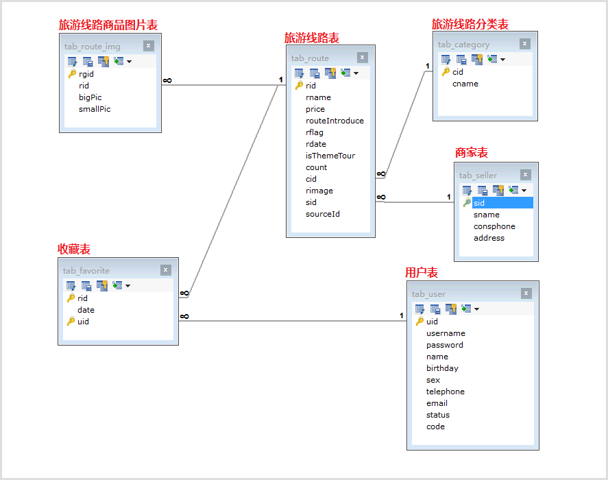

# 02.数据库创建

- 笔记本：14.旅游网项目
- 创建时间：2020-02-29 08:40:26 UTC
- 更新时间：2020-02-29 08:45:24 UTC
- 印象笔记 GUID：5c4ff207-8c59-4db6-a5a6-ba88c2b61087

`create database travel;`
 

`source D://travel.sql`

```
create table tab_category
(
   cid                  int not null auto_increment,
   cname                varchar(100) not null,
   primary key (cid),
   unique key AK_nq_categoryname (cname)
);

create table tab_favorite
(
   rid                  int not null,
   date                 date not null,
   uid                  int not null,
   primary key (rid, uid)
);

create table tab_route
(
   rid                  int not null auto_increment,
   rname                varchar(500) not null,
   price                double not null,
   routeIntroduce       varchar(1000),
   rflag                char(1) not null,
   rdate                varchar(19),
   isThemeTour          char(1) not null,
   count                int default 0,
   cid                  int not null,
   rimage               varchar(200),
   sid                  int,
   sourceId             varchar(50),
   primary key (rid),
   unique key AK_nq_sourceId (sourceId)
);

create table tab_route_img
(
   rgid                 int not null auto_increment,
   rid                  int not null,
   bigPic               varchar(200) not null,
   smallPic             varchar(200),
   primary key (rgid)
);

create table tab_seller
(
   sid                  int not null auto_increment,
   sname                varchar(200) not null,
   consphone            varchar(20) not null,
   address              varchar(200),
   primary key (sid),
   unique key AK_Key_2 (sname)
);

create table tab_user
(
   uid                  int not null auto_increment,
   username             varchar(100) not null,
   password             varchar(32) not null,
   name                 varchar(100),
   birthday             date,
   sex                  char(1),
   telephone            varchar(11),
   email                varchar(100),
   status               char(1) ,
   code					varchar(50),

   primary key (uid),
   unique key AK_nq_username (username),
   unique key AK_nq_code (code)
);

alter table tab_favorite add constraint FK_route_favorite foreign key (rid)
      references tab_route (rid) on delete restrict on update restrict;

alter table tab_favorite add constraint FK_user_favorite foreign key (uid)
      references tab_user (uid) on delete restrict on update restrict;

alter table tab_route add constraint FK_category_route foreign key (cid)
      references tab_category (cid) on delete restrict on update restrict;

alter table tab_route add constraint FK_seller_route foreign key (sid)
      references tab_seller (sid) on delete restrict on update restrict;

alter table tab_route_img add constraint FK_route_routeimg foreign key (rid)
      references tab_route (rid) on delete restrict on update restrict;

```

%60create%20database%20travel%3B%60%0A!%5B043307fc3b83d7ae4f969e4490386d9f.png%5D(en-resource%3A%2F%2Fdatabase%2F1570%3A0)%0A%0A%60source%20D%3A%2F%2Ftravel.sql%60%0A%0A%60%60%60sql%0Acreate%20table%20tab_category%0A(%0A%20%20%20cid%20%20%20%20%20%20%20%20%20%20%20%20%20%20%20%20%20%20int%20not%20null%20auto_increment%2C%0A%20%20%20cname%20%20%20%20%20%20%20%20%20%20%20%20%20%20%20%20varchar(100)%20not%20null%2C%0A%20%20%20primary%20key%20(cid)%2C%0A%20%20%20unique%20key%20AK_nq_categoryname%20(cname)%0A)%3B%0A%0Acreate%20table%20tab_favorite%0A(%0A%20%20%20rid%20%20%20%20%20%20%20%20%20%20%20%20%20%20%20%20%20%20int%20not%20null%2C%0A%20%20%20date%20%20%20%20%20%20%20%20%20%20%20%20%20%20%20%20%20date%20not%20null%2C%0A%20%20%20uid%20%20%20%20%20%20%20%20%20%20%20%20%20%20%20%20%20%20int%20not%20null%2C%0A%20%20%20primary%20key%20(rid%2C%20uid)%0A)%3B%0A%0Acreate%20table%20tab_route%0A(%0A%20%20%20rid%20%20%20%20%20%20%20%20%20%20%20%20%20%20%20%20%20%20int%20not%20null%20auto_increment%2C%0A%20%20%20rname%20%20%20%20%20%20%20%20%20%20%20%20%20%20%20%20varchar(500)%20not%20null%2C%0A%20%20%20price%20%20%20%20%20%20%20%20%20%20%20%20%20%20%20%20double%20not%20null%2C%0A%20%20%20routeIntroduce%20%20%20%20%20%20%20varchar(1000)%2C%0A%20%20%20rflag%20%20%20%20%20%20%20%20%20%20%20%20%20%20%20%20char(1)%20not%20null%2C%0A%20%20%20rdate%20%20%20%20%20%20%20%20%20%20%20%20%20%20%20%20varchar(19)%2C%0A%20%20%20isThemeTour%20%20%20%20%20%20%20%20%20%20char(1)%20not%20null%2C%0A%20%20%20count%20%20%20%20%20%20%20%20%20%20%20%20%20%20%20%20int%20default%200%2C%0A%20%20%20cid%20%20%20%20%20%20%20%20%20%20%20%20%20%20%20%20%20%20int%20not%20null%2C%0A%20%20%20rimage%20%20%20%20%20%20%20%20%20%20%20%20%20%20%20varchar(200)%2C%0A%20%20%20sid%20%20%20%20%20%20%20%20%20%20%20%20%20%20%20%20%20%20int%2C%0A%20%20%20sourceId%20%20%20%20%20%20%20%20%20%20%20%20%20varchar(50)%2C%0A%20%20%20primary%20key%20(rid)%2C%0A%20%20%20unique%20key%20AK_nq_sourceId%20(sourceId)%0A)%3B%0A%0Acreate%20table%20tab_route_img%0A(%0A%20%20%20rgid%20%20%20%20%20%20%20%20%20%20%20%20%20%20%20%20%20int%20not%20null%20auto_increment%2C%0A%20%20%20rid%20%20%20%20%20%20%20%20%20%20%20%20%20%20%20%20%20%20int%20not%20null%2C%0A%20%20%20bigPic%20%20%20%20%20%20%20%20%20%20%20%20%20%20%20varchar(200)%20not%20null%2C%0A%20%20%20smallPic%20%20%20%20%20%20%20%20%20%20%20%20%20varchar(200)%2C%0A%20%20%20primary%20key%20(rgid)%0A)%3B%0A%0Acreate%20table%20tab_seller%0A(%0A%20%20%20sid%20%20%20%20%20%20%20%20%20%20%20%20%20%20%20%20%20%20int%20not%20null%20auto_increment%2C%0A%20%20%20sname%20%20%20%20%20%20%20%20%20%20%20%20%20%20%20%20varchar(200)%20not%20null%2C%0A%20%20%20consphone%20%20%20%20%20%20%20%20%20%20%20%20varchar(20)%20not%20null%2C%0A%20%20%20address%20%20%20%20%20%20%20%20%20%20%20%20%20%20varchar(200)%2C%0A%20%20%20primary%20key%20(sid)%2C%0A%20%20%20unique%20key%20AK_Key_2%20(sname)%0A)%3B%0A%0Acreate%20table%20tab_user%0A(%0A%20%20%20uid%20%20%20%20%20%20%20%20%20%20%20%20%20%20%20%20%20%20int%20not%20null%20auto_increment%2C%0A%20%20%20username%20%20%20%20%20%20%20%20%20%20%20%20%20varchar(100)%20not%20null%2C%0A%20%20%20password%20%20%20%20%20%20%20%20%20%20%20%20%20varchar(32)%20not%20null%2C%0A%20%20%20name%20%20%20%20%20%20%20%20%20%20%20%20%20%20%20%20%20varchar(100)%2C%0A%20%20%20birthday%20%20%20%20%20%20%20%20%20%20%20%20%20date%2C%0A%20%20%20sex%20%20%20%20%20%20%20%20%20%20%20%20%20%20%20%20%20%20char(1)%2C%0A%20%20%20telephone%20%20%20%20%20%20%20%20%20%20%20%20varchar(11)%2C%0A%20%20%20email%20%20%20%20%20%20%20%20%20%20%20%20%20%20%20%20varchar(100)%2C%0A%20%20%20status%20%20%20%20%20%20%20%20%20%20%20%20%20%20%20char(1)%20%2C%0A%20%20%20code%09%09%09%09%09varchar(50)%2C%0A%20%20%20%0A%20%20%20primary%20key%20(uid)%2C%0A%20%20%20unique%20key%20AK_nq_username%20(username)%2C%0A%20%20%20unique%20key%20AK_nq_code%20(code)%0A)%3B%0A%0Aalter%20table%20tab_favorite%20add%20constraint%20FK_route_favorite%20foreign%20key%20(rid)%0A%20%20%20%20%20%20references%20tab_route%20(rid)%20on%20delete%20restrict%20on%20update%20restrict%3B%0A%0Aalter%20table%20tab_favorite%20add%20constraint%20FK_user_favorite%20foreign%20key%20(uid)%0A%20%20%20%20%20%20references%20tab_user%20(uid)%20on%20delete%20restrict%20on%20update%20restrict%3B%0A%0Aalter%20table%20tab_route%20add%20constraint%20FK_category_route%20foreign%20key%20(cid)%0A%20%20%20%20%20%20references%20tab_category%20(cid)%20on%20delete%20restrict%20on%20update%20restrict%3B%0A%0Aalter%20table%20tab_route%20add%20constraint%20FK_seller_route%20foreign%20key%20(sid)%0A%20%20%20%20%20%20references%20tab_seller%20(sid)%20on%20delete%20restrict%20on%20update%20restrict%3B%0A%0Aalter%20table%20tab_route_img%20add%20constraint%20FK_route_routeimg%20foreign%20key%20(rid)%0A%20%20%20%20%20%20references%20tab_route%20(rid)%20on%20delete%20restrict%20on%20update%20restrict%3B%0A%60%60%60
