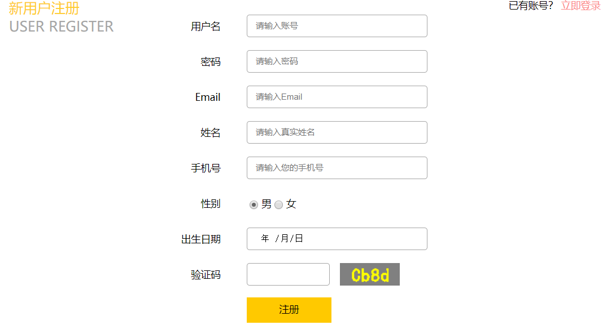
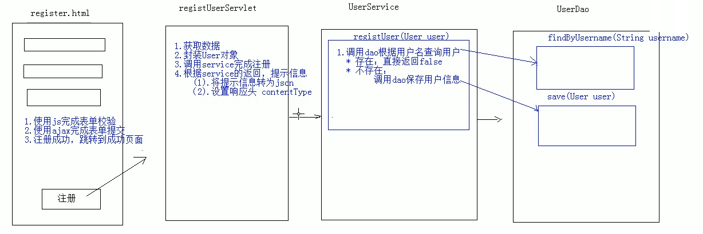
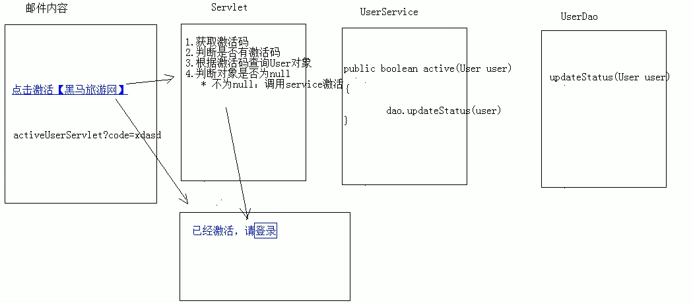

# 03.注册功能

- 笔记本：14.旅游网项目
- 创建时间：2020-02-29 08:47:34 UTC
- 更新时间：2020-02-29 12:38:52 UTC
- 印象笔记 GUID：ae12315f-ee36-4f05-94f0-32570004d9df


 

1. 表单校验

```
/**
 * 表单校验
 * 	1. 用户名：单词字符，8~20位长度
 * 	2. 密码：单词字符，长度8~20位
 * 	3. email：邮件格式
 * 	4. 姓名：非空
 * 	5. 手机号：手机号格式
 * 	6. 出生日期：非空
 * 	7. 验证码：非空
 */
// 校验用户名
function checkUsername() {
    // 1. 获取用户名值
    var username = $("#username").val();
    // 2. 定义正则
    var reg_username = /^\w{8,20}$/;
    // 3. 判断，给出提示信息
    var flag = reg_username.test(username);
    if(flag) {
        // 用户名合法
        $("#username").css("border", "");
    } else {
        // 用户名非法，加一个红色边框
        $("#username").css("border", "1px solid red");
    }
    return flag;
}

// 校验密码
function checkPassword() {
    // 1. 获取密码值
    var password = $("#password").val();
    // 2. 定义正则
    var reg_password = /^\w{8,20}$/;
    // 3. 判断，给出提示信息
    var flag = reg_password.test(password);
    if(flag) {
        // 用户名合法
        $("#password").css("border", "");
    } else {
        // 用户名非法，加一个红色边框
        $("#password").css("border", "1px solid red");
    }
    return flag;
}

// 校验邮箱
function checkEmail() {
    // 1. 获取邮箱
     var email = $("#email").val();
    // 2. 定义正则
    var reg_email = /^\w+@\w+\.\w+$/;
    // 3. 判断
    var flag = reg_email.test(email);
    if(flag) {
        // 邮箱合法
        $("#email").css("border", "");
    } else {
        // 邮箱非法，加一个红色边框
        $("#email").css("border", "1px solid red");
    }
    return flag;
}

// 校验

$(function () {
    // 当表单提交的时候，调用所有的校验方法
    $("#registerForm").submit(function () {
        return checkUsername() && checkPassword();
        // 如果这个方法没有返回值，或者返回值为true，则表单提交，如果返回false，则表单不提交
    });

    // 当一个组件失去焦点时，调用对应的校验方法
    $("#username").blur(checkUsername);
    $("#password").blur(checkPassword);
    $("#email").blur(checkEmail);
})

```

1. 异步(ajax)提交表单
 在此使用异步提交表单，是为了获取服务器响应的数据，因为我们使用的是html作为视图层，不能直接从servlet相关的域对象获取值，只能通过ajax获取响应数据

```
// 当表单提交的时候，调用所有的校验方法
$("#registerForm").submit(function () {
    // 1. 发送数据到服务器
    if(checkUsername() && checkPassword() && checkEmail()) {
        // 校验通过，发送ajax 请求，提交表单的数据
        $.post("registUserServlet", $(this).serialize(), function (data) {
            // 处理服务器响应的数据 data
        })
    }
    // 2. 跳转页面
    return false;
});

```

1. 后台代码实现

- 编写 RegistUserServlet

- 编写 UserService 以及 UserServiceImpl

- 编写 UserDao 以及 UserDaoImpl

1. 邮件激活
 

!%5Ba2344e7f62b39fd275472ec72464e02b.png%5D(en-resource%3A%2F%2Fdatabase%2F1574%3A0)%0A!%5B3d5e87333bf5216cf3f08d88ccc27e85.png%5D(en-resource%3A%2F%2Fdatabase%2F1576%3A0)%0A%0A1.%20%E8%A1%A8%E5%8D%95%E6%A0%A1%E9%AA%8C%0A%60%60%60javascript%0A%2F**%0A%20*%20%E8%A1%A8%E5%8D%95%E6%A0%A1%E9%AA%8C%0A%20*%20%091.%20%E7%94%A8%E6%88%B7%E5%90%8D%EF%BC%9A%E5%8D%95%E8%AF%8D%E5%AD%97%E7%AC%A6%EF%BC%8C8~20%E4%BD%8D%E9%95%BF%E5%BA%A6%0A%20*%20%092.%20%E5%AF%86%E7%A0%81%EF%BC%9A%E5%8D%95%E8%AF%8D%E5%AD%97%E7%AC%A6%EF%BC%8C%E9%95%BF%E5%BA%A68~20%E4%BD%8D%0A%20*%20%093.%20email%EF%BC%9A%E9%82%AE%E4%BB%B6%E6%A0%BC%E5%BC%8F%0A%20*%20%094.%20%E5%A7%93%E5%90%8D%EF%BC%9A%E9%9D%9E%E7%A9%BA%0A%20*%20%095.%20%E6%89%8B%E6%9C%BA%E5%8F%B7%EF%BC%9A%E6%89%8B%E6%9C%BA%E5%8F%B7%E6%A0%BC%E5%BC%8F%0A%20*%20%096.%20%E5%87%BA%E7%94%9F%E6%97%A5%E6%9C%9F%EF%BC%9A%E9%9D%9E%E7%A9%BA%0A%20*%20%097.%20%E9%AA%8C%E8%AF%81%E7%A0%81%EF%BC%9A%E9%9D%9E%E7%A9%BA%0A%20*%2F%0A%2F%2F%20%E6%A0%A1%E9%AA%8C%E7%94%A8%E6%88%B7%E5%90%8D%0Afunction%20checkUsername()%20%7B%0A%20%20%20%20%2F%2F%201.%20%E8%8E%B7%E5%8F%96%E7%94%A8%E6%88%B7%E5%90%8D%E5%80%BC%0A%20%20%20%20var%20username%20%3D%20%24(%22%23username%22).val()%3B%0A%20%20%20%20%2F%2F%202.%20%E5%AE%9A%E4%B9%89%E6%AD%A3%E5%88%99%0A%20%20%20%20var%20reg_username%20%3D%20%2F%5E%5Cw%7B8%2C20%7D%24%2F%3B%0A%20%20%20%20%2F%2F%203.%20%E5%88%A4%E6%96%AD%EF%BC%8C%E7%BB%99%E5%87%BA%E6%8F%90%E7%A4%BA%E4%BF%A1%E6%81%AF%0A%20%20%20%20var%20flag%20%3D%20reg_username.test(username)%3B%0A%20%20%20%20if(flag)%20%7B%0A%20%20%20%20%20%20%20%20%2F%2F%20%E7%94%A8%E6%88%B7%E5%90%8D%E5%90%88%E6%B3%95%0A%20%20%20%20%20%20%20%20%24(%22%23username%22).css(%22border%22%2C%20%22%22)%3B%0A%20%20%20%20%7D%20else%20%7B%0A%20%20%20%20%20%20%20%20%2F%2F%20%E7%94%A8%E6%88%B7%E5%90%8D%E9%9D%9E%E6%B3%95%EF%BC%8C%E5%8A%A0%E4%B8%80%E4%B8%AA%E7%BA%A2%E8%89%B2%E8%BE%B9%E6%A1%86%0A%20%20%20%20%20%20%20%20%24(%22%23username%22).css(%22border%22%2C%20%221px%20solid%20red%22)%3B%0A%20%20%20%20%7D%0A%20%20%20%20return%20flag%3B%0A%7D%0A%0A%2F%2F%20%E6%A0%A1%E9%AA%8C%E5%AF%86%E7%A0%81%0Afunction%20checkPassword()%20%7B%0A%20%20%20%20%2F%2F%201.%20%E8%8E%B7%E5%8F%96%E5%AF%86%E7%A0%81%E5%80%BC%0A%20%20%20%20var%20password%20%3D%20%24(%22%23password%22).val()%3B%0A%20%20%20%20%2F%2F%202.%20%E5%AE%9A%E4%B9%89%E6%AD%A3%E5%88%99%0A%20%20%20%20var%20reg_password%20%3D%20%2F%5E%5Cw%7B8%2C20%7D%24%2F%3B%0A%20%20%20%20%2F%2F%203.%20%E5%88%A4%E6%96%AD%EF%BC%8C%E7%BB%99%E5%87%BA%E6%8F%90%E7%A4%BA%E4%BF%A1%E6%81%AF%0A%20%20%20%20var%20flag%20%3D%20reg_password.test(password)%3B%0A%20%20%20%20if(flag)%20%7B%0A%20%20%20%20%20%20%20%20%2F%2F%20%E7%94%A8%E6%88%B7%E5%90%8D%E5%90%88%E6%B3%95%0A%20%20%20%20%20%20%20%20%24(%22%23password%22).css(%22border%22%2C%20%22%22)%3B%0A%20%20%20%20%7D%20else%20%7B%0A%20%20%20%20%20%20%20%20%2F%2F%20%E7%94%A8%E6%88%B7%E5%90%8D%E9%9D%9E%E6%B3%95%EF%BC%8C%E5%8A%A0%E4%B8%80%E4%B8%AA%E7%BA%A2%E8%89%B2%E8%BE%B9%E6%A1%86%0A%20%20%20%20%20%20%20%20%24(%22%23password%22).css(%22border%22%2C%20%221px%20solid%20red%22)%3B%0A%20%20%20%20%7D%0A%20%20%20%20return%20flag%3B%0A%7D%0A%0A%2F%2F%20%E6%A0%A1%E9%AA%8C%E9%82%AE%E7%AE%B1%0Afunction%20checkEmail()%20%7B%0A%20%20%20%20%2F%2F%201.%20%E8%8E%B7%E5%8F%96%E9%82%AE%E7%AE%B1%0A%20%20%20%20%20var%20email%20%3D%20%24(%22%23email%22).val()%3B%0A%20%20%20%20%2F%2F%202.%20%E5%AE%9A%E4%B9%89%E6%AD%A3%E5%88%99%0A%20%20%20%20var%20reg_email%20%3D%20%2F%5E%5Cw%2B%40%5Cw%2B%5C.%5Cw%2B%24%2F%3B%0A%20%20%20%20%2F%2F%203.%20%E5%88%A4%E6%96%AD%0A%20%20%20%20var%20flag%20%3D%20reg_email.test(email)%3B%0A%20%20%20%20if(flag)%20%7B%0A%20%20%20%20%20%20%20%20%2F%2F%20%E9%82%AE%E7%AE%B1%E5%90%88%E6%B3%95%0A%20%20%20%20%20%20%20%20%24(%22%23email%22).css(%22border%22%2C%20%22%22)%3B%0A%20%20%20%20%7D%20else%20%7B%0A%20%20%20%20%20%20%20%20%2F%2F%20%E9%82%AE%E7%AE%B1%E9%9D%9E%E6%B3%95%EF%BC%8C%E5%8A%A0%E4%B8%80%E4%B8%AA%E7%BA%A2%E8%89%B2%E8%BE%B9%E6%A1%86%0A%20%20%20%20%20%20%20%20%24(%22%23email%22).css(%22border%22%2C%20%221px%20solid%20red%22)%3B%0A%20%20%20%20%7D%0A%20%20%20%20return%20flag%3B%0A%7D%0A%0A%2F%2F%20%E6%A0%A1%E9%AA%8C%0A%0A%24(function%20()%20%7B%0A%20%20%20%20%2F%2F%20%E5%BD%93%E8%A1%A8%E5%8D%95%E6%8F%90%E4%BA%A4%E7%9A%84%E6%97%B6%E5%80%99%EF%BC%8C%E8%B0%83%E7%94%A8%E6%89%80%E6%9C%89%E7%9A%84%E6%A0%A1%E9%AA%8C%E6%96%B9%E6%B3%95%0A%20%20%20%20%24(%22%23registerForm%22).submit(function%20()%20%7B%0A%20%20%20%20%20%20%20%20return%20checkUsername()%20%26%26%20checkPassword()%3B%0A%20%20%20%20%20%20%20%20%2F%2F%20%E5%A6%82%E6%9E%9C%E8%BF%99%E4%B8%AA%E6%96%B9%E6%B3%95%E6%B2%A1%E6%9C%89%E8%BF%94%E5%9B%9E%E5%80%BC%EF%BC%8C%E6%88%96%E8%80%85%E8%BF%94%E5%9B%9E%E5%80%BC%E4%B8%BAtrue%EF%BC%8C%E5%88%99%E8%A1%A8%E5%8D%95%E6%8F%90%E4%BA%A4%EF%BC%8C%E5%A6%82%E6%9E%9C%E8%BF%94%E5%9B%9Efalse%EF%BC%8C%E5%88%99%E8%A1%A8%E5%8D%95%E4%B8%8D%E6%8F%90%E4%BA%A4%0A%20%20%20%20%7D)%3B%0A%0A%20%20%20%20%2F%2F%20%E5%BD%93%E4%B8%80%E4%B8%AA%E7%BB%84%E4%BB%B6%E5%A4%B1%E5%8E%BB%E7%84%A6%E7%82%B9%E6%97%B6%EF%BC%8C%E8%B0%83%E7%94%A8%E5%AF%B9%E5%BA%94%E7%9A%84%E6%A0%A1%E9%AA%8C%E6%96%B9%E6%B3%95%0A%20%20%20%20%24(%22%23username%22).blur(checkUsername)%3B%0A%20%20%20%20%24(%22%23password%22).blur(checkPassword)%3B%0A%20%20%20%20%24(%22%23email%22).blur(checkEmail)%3B%0A%7D)%0A%60%60%60%0A2.%20%E5%BC%82%E6%AD%A5(ajax)%E6%8F%90%E4%BA%A4%E8%A1%A8%E5%8D%95%0A%20%20%20%20%E5%9C%A8%E6%AD%A4%E4%BD%BF%E7%94%A8%E5%BC%82%E6%AD%A5%E6%8F%90%E4%BA%A4%E8%A1%A8%E5%8D%95%EF%BC%8C%E6%98%AF%E4%B8%BA%E4%BA%86%E8%8E%B7%E5%8F%96%E6%9C%8D%E5%8A%A1%E5%99%A8%E5%93%8D%E5%BA%94%E7%9A%84%E6%95%B0%E6%8D%AE%EF%BC%8C%E5%9B%A0%E4%B8%BA%E6%88%91%E4%BB%AC%E4%BD%BF%E7%94%A8%E7%9A%84%E6%98%AFhtml%E4%BD%9C%E4%B8%BA%E8%A7%86%E5%9B%BE%E5%B1%82%EF%BC%8C%E4%B8%8D%E8%83%BD%E7%9B%B4%E6%8E%A5%E4%BB%8Eservlet%E7%9B%B8%E5%85%B3%E7%9A%84%E5%9F%9F%E5%AF%B9%E8%B1%A1%E8%8E%B7%E5%8F%96%E5%80%BC%EF%BC%8C%E5%8F%AA%E8%83%BD%E9%80%9A%E8%BF%87ajax%E8%8E%B7%E5%8F%96%E5%93%8D%E5%BA%94%E6%95%B0%E6%8D%AE%0A%0A%60%60%60javascript%0A%2F%2F%20%E5%BD%93%E8%A1%A8%E5%8D%95%E6%8F%90%E4%BA%A4%E7%9A%84%E6%97%B6%E5%80%99%EF%BC%8C%E8%B0%83%E7%94%A8%E6%89%80%E6%9C%89%E7%9A%84%E6%A0%A1%E9%AA%8C%E6%96%B9%E6%B3%95%0A%24(%22%23registerForm%22).submit(function%20()%20%7B%0A%20%20%20%20%2F%2F%201.%20%E5%8F%91%E9%80%81%E6%95%B0%E6%8D%AE%E5%88%B0%E6%9C%8D%E5%8A%A1%E5%99%A8%0A%20%20%20%20if(checkUsername()%20%26%26%20checkPassword()%20%26%26%20checkEmail())%20%7B%0A%20%20%20%20%20%20%20%20%2F%2F%20%E6%A0%A1%E9%AA%8C%E9%80%9A%E8%BF%87%EF%BC%8C%E5%8F%91%E9%80%81ajax%20%E8%AF%B7%E6%B1%82%EF%BC%8C%E6%8F%90%E4%BA%A4%E8%A1%A8%E5%8D%95%E7%9A%84%E6%95%B0%E6%8D%AE%0A%20%20%20%20%20%20%20%20%24.post(%22registUserServlet%22%2C%20%24(this).serialize()%2C%20function%20(data)%20%7B%0A%20%20%20%20%20%20%20%20%20%20%20%20%2F%2F%20%E5%A4%84%E7%90%86%E6%9C%8D%E5%8A%A1%E5%99%A8%E5%93%8D%E5%BA%94%E7%9A%84%E6%95%B0%E6%8D%AE%20data%0A%20%20%20%20%20%20%20%20%7D)%0A%20%20%20%20%7D%0A%20%20%20%20%2F%2F%202.%20%E8%B7%B3%E8%BD%AC%E9%A1%B5%E9%9D%A2%0A%20%20%20%20return%20false%3B%0A%7D)%3B%0A%60%60%60%0A%0A3.%20%E5%90%8E%E5%8F%B0%E4%BB%A3%E7%A0%81%E5%AE%9E%E7%8E%B0%0A*%20%E7%BC%96%E5%86%99%20RegistUserServlet%0A*%20%E7%BC%96%E5%86%99%20UserService%20%E4%BB%A5%E5%8F%8A%20UserServiceImpl%0A*%20%E7%BC%96%E5%86%99%20UserDao%20%E4%BB%A5%E5%8F%8A%20UserDaoImpl%0A%0A4.%20%E9%82%AE%E4%BB%B6%E6%BF%80%E6%B4%BB%0A!%5Bca8e0f3f9a4697420bdf67452b1971da.png%5D(en-resource%3A%2F%2Fdatabase%2F1578%3A1)%0A
