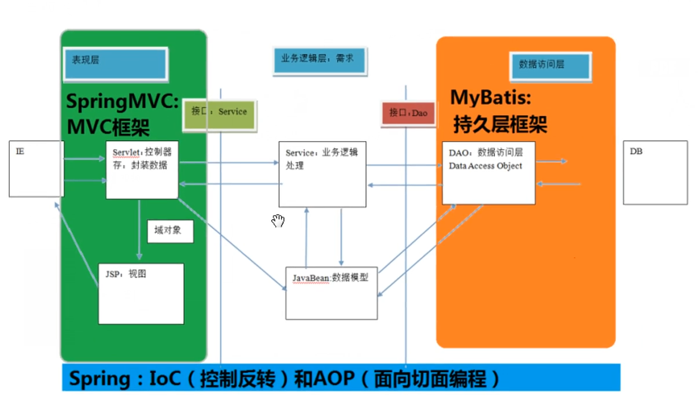

# 01.三层架构和ssm框架的对应关系

- 笔记本：15.Mybatis
- 创建时间：2020-03-02 01:36:59 UTC
- 更新时间：2020-03-02 03:57:32 UTC
- 印象笔记 GUID：edae6250-e3ac-45f9-8aee-f29b60c1316a

1.
什么是框架
 它是我们软件开发中的一套解决方案，不同的框架解决的是不同的问题。

1.
使用该框架的好处：
 框架封装了很多细节，使开发者可以使用极简的方式实现功能。大大提高开发效率。

1.
三层架构

  - 表现层：是用于展示数据的

  - 业务层：是处理业务需求的

  - 持久层：是和数据库交互的

1. 持久层解决方案
 JDBC 技术：
 Connection
 PreparedStatement
 ResultSet
 Spring 的JdbcTemplate：
 Sping 中对jdbc的简单封装
 Apache 的DBuilts：
 它和Spring 的JdbcTemplate 很像，也是对Jdbc 的简单封装
 以上这些都不是框架
 JDBC 是规范
 Spring 的JdbcTemplate 和Apache 的DBUtils 都只是工具类

1.%20%E4%BB%80%E4%B9%88%E6%98%AF%E6%A1%86%E6%9E%B6%0A%20%20%20%20%E5%AE%83%E6%98%AF%E6%88%91%E4%BB%AC%E8%BD%AF%E4%BB%B6%E5%BC%80%E5%8F%91%E4%B8%AD%E7%9A%84%E4%B8%80%E5%A5%97%E8%A7%A3%E5%86%B3%E6%96%B9%E6%A1%88%EF%BC%8C%E4%B8%8D%E5%90%8C%E7%9A%84%E6%A1%86%E6%9E%B6%E8%A7%A3%E5%86%B3%E7%9A%84%E6%98%AF%E4%B8%8D%E5%90%8C%E7%9A%84%E9%97%AE%E9%A2%98%E3%80%82%0A%0A2.%20%E4%BD%BF%E7%94%A8%E8%AF%A5%E6%A1%86%E6%9E%B6%E7%9A%84%E5%A5%BD%E5%A4%84%EF%BC%9A%0A%20%20%20%20%E6%A1%86%E6%9E%B6%E5%B0%81%E8%A3%85%E4%BA%86%E5%BE%88%E5%A4%9A%E7%BB%86%E8%8A%82%EF%BC%8C%E4%BD%BF%E5%BC%80%E5%8F%91%E8%80%85%E5%8F%AF%E4%BB%A5%E4%BD%BF%E7%94%A8%E6%9E%81%E7%AE%80%E7%9A%84%E6%96%B9%E5%BC%8F%E5%AE%9E%E7%8E%B0%E5%8A%9F%E8%83%BD%E3%80%82%E5%A4%A7%E5%A4%A7%E6%8F%90%E9%AB%98%E5%BC%80%E5%8F%91%E6%95%88%E7%8E%87%E3%80%82%0A%0A3.%20%E4%B8%89%E5%B1%82%E6%9E%B6%E6%9E%84%0A%20%20%20%20*%20%E8%A1%A8%E7%8E%B0%E5%B1%82%EF%BC%9A%E6%98%AF%E7%94%A8%E4%BA%8E%E5%B1%95%E7%A4%BA%E6%95%B0%E6%8D%AE%E7%9A%84%0A%20%20%20%20*%20%E4%B8%9A%E5%8A%A1%E5%B1%82%EF%BC%9A%E6%98%AF%E5%A4%84%E7%90%86%E4%B8%9A%E5%8A%A1%E9%9C%80%E6%B1%82%E7%9A%84%0A%20%20%20%20*%20%E6%8C%81%E4%B9%85%E5%B1%82%EF%BC%9A%E6%98%AF%E5%92%8C%E6%95%B0%E6%8D%AE%E5%BA%93%E4%BA%A4%E4%BA%92%E7%9A%84%0A%0A!%5Bc52c48d3456338c675a1a185c031d891.png%5D(en-resource%3A%2F%2Fdatabase%2F1799%3A1)%0A%0A4.%20%E6%8C%81%E4%B9%85%E5%B1%82%E8%A7%A3%E5%86%B3%E6%96%B9%E6%A1%88%0A%20%20%20%20JDBC%20%E6%8A%80%E6%9C%AF%EF%BC%9A%0A%20%20%20%20%20%20%20%20Connection%0A%20%20%20%20%20%20%20%20PreparedStatement%0A%20%20%20%20%20%20%20%20ResultSet%0A%20%20%20%20Spring%20%E7%9A%84JdbcTemplate%EF%BC%9A%0A%20%20%20%20%20%20%20%20Sping%20%E4%B8%AD%E5%AF%B9jdbc%E7%9A%84%E7%AE%80%E5%8D%95%E5%B0%81%E8%A3%85%0A%20%20%20%20Apache%20%E7%9A%84DBuilts%EF%BC%9A%0A%20%20%20%20%20%20%20%20%E5%AE%83%E5%92%8CSpring%20%E7%9A%84JdbcTemplate%20%E5%BE%88%E5%83%8F%EF%BC%8C%E4%B9%9F%E6%98%AF%E5%AF%B9Jdbc%20%E7%9A%84%E7%AE%80%E5%8D%95%E5%B0%81%E8%A3%85%0A%20%20%20%20%E4%BB%A5%E4%B8%8A%E8%BF%99%E4%BA%9B%E9%83%BD%E4%B8%8D%E6%98%AF%E6%A1%86%E6%9E%B6%0A%20%20%20%20%20%20%20%20JDBC%20%E6%98%AF%E8%A7%84%E8%8C%83%0A%20%20%20%20%20%20%20%20Spring%20%E7%9A%84JdbcTemplate%20%E5%92%8CApache%20%E7%9A%84DBUtils%20%E9%83%BD%E5%8F%AA%E6%98%AF%E5%B7%A5%E5%85%B7%E7%B1%BB%0A%20%20%20%20
