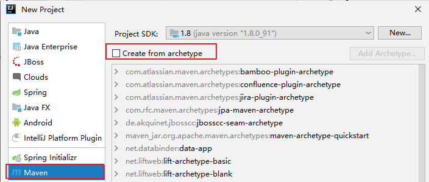
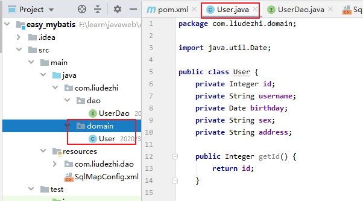
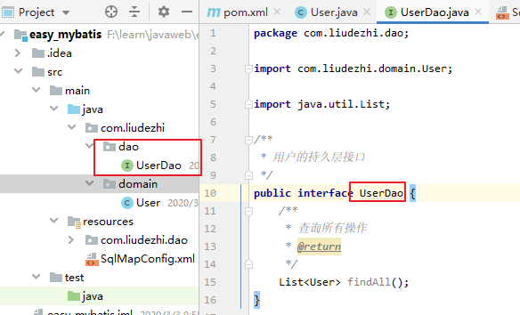
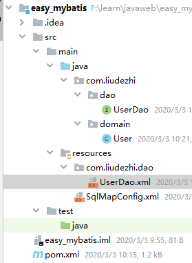

# 03.Mybatis环境搭建

- 笔记本：15.Mybatis
- 创建时间：2020-03-02 04:07:33 UTC
- 更新时间：2020-03-03 08:41:32 UTC
- 印象笔记 GUID：97dc7d4a-55a1-4346-beb9-b49b59073a77

## mybatis 的环境搭建

### 第一步：创建maven 工程并导入坐标



### 第二步：创建实体类和dao 的接口


 

### 第三步：创建映射配置文件：SqlMapConfig.xml

```
<?xml version="1.0" encoding="UTF-8"?>
<!DOCTYPE configuration
        PUBLIC "-//mybatis.org//DTD Config 3.0//EN"
        "http://mybatis.org/dtd/mybatis-3-config.dtd">
<!-- mybatis 的主配置文件 -->
<configuration>
    <!-- 配置环境 -->
    <environments default="mysql">
        <!-- 配置mysql的环境 -->
        <environment id="mysql">
            <!-- 配置事务的类型 -->
            <transactionManager type="JDBC"></transactionManager>
            <!-- 配置数据源（连接池） -->
            <dataSource type="POOLED">
                <!-- 配置连接数据库的4个基本信息 -->
                <property name="driver" value="com.mysql.cj.jdbc.Driver"/>
                <property name="url" value="jdbc:mysql://localhost:3306/mybatis_learn?useUnicode=true&amp;characterEncoding=utf-8&amp;useSSL=false&amp;serverTimezone=GMT"/>
<!--                <property name="driver" value="com.mysql.jdbc.Driver"/>-->
<!--                <property name="url" value="jdbc:mysql//localhost:3306/mybatis_learn"/>-->
                <property name="username" value="root"/>
                <property name="password" value="Liudezhi"/>
            </dataSource>
        </environment>
    </environments>

    <!-- 指定映射配置文件的位置，映射配置文件指的是每个dao独立的配置文件 -->
    <mappers>
        <mapper resource="com/liudezhi/dao/UserDao.xml"/>
    </mappers>
</configuration>

```

### 第四步：创建映射配置文件：UserDao.xml

```
<?xml version="1.0" encoding="UTF-8"?>
<!DOCTYPE mapper
        PUBLIC "-//mybatis.org//DTD Mapper 3.0//EN"
        "http://mybatis.org/dtd/mybatis-3-mapper.dtd">
<mapper namespace="com.liudezhi.dao.UserDao">
    <!-- 配置查询所有 -->
    <select id="findAll">
        select * from user;
    </select>
</mapper>

```

**pom.xml:**

```
<?xml version="1.0" encoding="UTF-8"?>
<project xmlns="http://maven.apache.org/POM/4.0.0"
         xmlns:xsi="http://www.w3.org/2001/XMLSchema-instance"
         xsi:schemaLocation="http://maven.apache.org/POM/4.0.0 http://maven.apache.org/xsd/maven-4.0.0.xsd">
    <modelVersion>4.0.0</modelVersion>
    <groupId>com.liudezhi</groupId>
    <artifactId>easy_mybatis</artifactId>
    <version>1.0-SNAPSHOT</version>
    <packaging>jar</packaging>
    <dependencies>
        <dependency>
            <groupId>org.mybatis</groupId>
            <artifactId>mybatis</artifactId>
            <version>3.4.5</version>
        </dependency>
        <dependency>
            <groupId>mysql</groupId>
            <artifactId>mysql-connector-java</artifactId>
            <version>8.0.11</version>
        </dependency>
        <dependency>
            <groupId>log4j</groupId>
            <artifactId>log4j</artifactId>
            <version>1.2.12</version>
        </dependency>
        <dependency>
            <groupId>junit</groupId>
            <artifactId>junit</artifactId>
            <version>4.12</version>
            <scope>test</scope>
        </dependency>
    </dependencies>
</project>

```

**项目结构：**
 

## 环境搭建的注意事项：

1. 创建UserDao.xml 和UserDao.java 时，名称是为了和我们之前的知识保持一致。在Mybatis中它把持久层的操作接口名称和映射文件也叫做：Mapper。所以：UserDao和 UserMapper是一样的。

1. 在idea 中创建目录的时候，它和包是不一样的

  - 包创建时：com.liudezhi.dao 它是三级目录

  - 目录在创建时：com.liudezhi.dao 是一级目录

1. mybatis 的映射配置文件位置必须和dao 接口的包结构相同

1. 映射配置文件的mapper 标签namespace 属性的取值必须是dao 接口的全限定类名

1. 映射配置文件的操作配置(select ...)，id 属性的取值必须是dao 接口的方法名
 当我们遵从了第三、四，五点之后，我们在开发中就无需再写dao 的实现类

%23%23%20mybatis%20%E7%9A%84%E7%8E%AF%E5%A2%83%E6%90%AD%E5%BB%BA%0A%0A%23%23%23%20%E7%AC%AC%E4%B8%80%E6%AD%A5%EF%BC%9A%E5%88%9B%E5%BB%BAmaven%20%E5%B7%A5%E7%A8%8B%E5%B9%B6%E5%AF%BC%E5%85%A5%E5%9D%90%E6%A0%87%0A!%5Bc19c4bed99bfa7f438c3196dae7f99fe.png%5D(en-resource%3A%2F%2Fdatabase%2F3065%3A1)%0A%0A%23%23%23%20%E7%AC%AC%E4%BA%8C%E6%AD%A5%EF%BC%9A%E5%88%9B%E5%BB%BA%E5%AE%9E%E4%BD%93%E7%B1%BB%E5%92%8Cdao%20%E7%9A%84%E6%8E%A5%E5%8F%A3%0A!%5B4cc7e4518ff24e226bbdb2bef83a87f3.png%5D(en-resource%3A%2F%2Fdatabase%2F3069%3A1)%0A!%5Bcedb80d2276d99e8bc1264ccc14b145f.png%5D(en-resource%3A%2F%2Fdatabase%2F3071%3A1)%0A%0A%0A%23%23%23%20%E7%AC%AC%E4%B8%89%E6%AD%A5%EF%BC%9A%E5%88%9B%E5%BB%BA%E6%98%A0%E5%B0%84%E9%85%8D%E7%BD%AE%E6%96%87%E4%BB%B6%EF%BC%9ASqlMapConfig.xml%0A%60%60%60xml%0A%3C%3Fxml%20version%3D%221.0%22%20encoding%3D%22UTF-8%22%3F%3E%0A%3C!DOCTYPE%20configuration%0A%20%20%20%20%20%20%20%20PUBLIC%20%22-%2F%2Fmybatis.org%2F%2FDTD%20Config%203.0%2F%2FEN%22%0A%20%20%20%20%20%20%20%20%22http%3A%2F%2Fmybatis.org%2Fdtd%2Fmybatis-3-config.dtd%22%3E%0A%3C!--%20mybatis%20%E7%9A%84%E4%B8%BB%E9%85%8D%E7%BD%AE%E6%96%87%E4%BB%B6%20--%3E%0A%3Cconfiguration%3E%0A%20%20%20%20%3C!--%20%E9%85%8D%E7%BD%AE%E7%8E%AF%E5%A2%83%20--%3E%0A%20%20%20%20%3Cenvironments%20default%3D%22mysql%22%3E%0A%20%20%20%20%20%20%20%20%3C!--%20%E9%85%8D%E7%BD%AEmysql%E7%9A%84%E7%8E%AF%E5%A2%83%20--%3E%0A%20%20%20%20%20%20%20%20%3Cenvironment%20id%3D%22mysql%22%3E%0A%20%20%20%20%20%20%20%20%20%20%20%20%3C!--%20%E9%85%8D%E7%BD%AE%E4%BA%8B%E5%8A%A1%E7%9A%84%E7%B1%BB%E5%9E%8B%20--%3E%0A%20%20%20%20%20%20%20%20%20%20%20%20%3CtransactionManager%20type%3D%22JDBC%22%3E%3C%2FtransactionManager%3E%0A%20%20%20%20%20%20%20%20%20%20%20%20%3C!--%20%E9%85%8D%E7%BD%AE%E6%95%B0%E6%8D%AE%E6%BA%90%EF%BC%88%E8%BF%9E%E6%8E%A5%E6%B1%A0%EF%BC%89%20--%3E%0A%20%20%20%20%20%20%20%20%20%20%20%20%3CdataSource%20type%3D%22POOLED%22%3E%0A%20%20%20%20%20%20%20%20%20%20%20%20%20%20%20%20%3C!--%20%E9%85%8D%E7%BD%AE%E8%BF%9E%E6%8E%A5%E6%95%B0%E6%8D%AE%E5%BA%93%E7%9A%844%E4%B8%AA%E5%9F%BA%E6%9C%AC%E4%BF%A1%E6%81%AF%20--%3E%0A%20%20%20%20%20%20%20%20%20%20%20%20%20%20%20%20%3Cproperty%20name%3D%22driver%22%20value%3D%22com.mysql.cj.jdbc.Driver%22%2F%3E%0A%20%20%20%20%20%20%20%20%20%20%20%20%20%20%20%20%3Cproperty%20name%3D%22url%22%20value%3D%22jdbc%3Amysql%3A%2F%2Flocalhost%3A3306%2Fmybatis_learn%3FuseUnicode%3Dtrue%26amp%3BcharacterEncoding%3Dutf-8%26amp%3BuseSSL%3Dfalse%26amp%3BserverTimezone%3DGMT%22%2F%3E%0A%3C!--%20%20%20%20%20%20%20%20%20%20%20%20%20%20%20%20%3Cproperty%20name%3D%22driver%22%20value%3D%22com.mysql.jdbc.Driver%22%2F%3E--%3E%0A%3C!--%20%20%20%20%20%20%20%20%20%20%20%20%20%20%20%20%3Cproperty%20name%3D%22url%22%20value%3D%22jdbc%3Amysql%2F%2Flocalhost%3A3306%2Fmybatis_learn%22%2F%3E--%3E%0A%20%20%20%20%20%20%20%20%20%20%20%20%20%20%20%20%3Cproperty%20name%3D%22username%22%20value%3D%22root%22%2F%3E%0A%20%20%20%20%20%20%20%20%20%20%20%20%20%20%20%20%3Cproperty%20name%3D%22password%22%20value%3D%22Liudezhi%22%2F%3E%0A%20%20%20%20%20%20%20%20%20%20%20%20%3C%2FdataSource%3E%0A%20%20%20%20%20%20%20%20%3C%2Fenvironment%3E%0A%20%20%20%20%3C%2Fenvironments%3E%0A%0A%20%20%20%20%3C!--%20%E6%8C%87%E5%AE%9A%E6%98%A0%E5%B0%84%E9%85%8D%E7%BD%AE%E6%96%87%E4%BB%B6%E7%9A%84%E4%BD%8D%E7%BD%AE%EF%BC%8C%E6%98%A0%E5%B0%84%E9%85%8D%E7%BD%AE%E6%96%87%E4%BB%B6%E6%8C%87%E7%9A%84%E6%98%AF%E6%AF%8F%E4%B8%AAdao%E7%8B%AC%E7%AB%8B%E7%9A%84%E9%85%8D%E7%BD%AE%E6%96%87%E4%BB%B6%20--%3E%0A%20%20%20%20%3Cmappers%3E%0A%20%20%20%20%20%20%20%20%3Cmapper%20resource%3D%22com%2Fliudezhi%2Fdao%2FUserDao.xml%22%2F%3E%0A%20%20%20%20%3C%2Fmappers%3E%0A%3C%2Fconfiguration%3E%0A%60%60%60%0A%0A%23%23%23%20%E7%AC%AC%E5%9B%9B%E6%AD%A5%EF%BC%9A%E5%88%9B%E5%BB%BA%E6%98%A0%E5%B0%84%E9%85%8D%E7%BD%AE%E6%96%87%E4%BB%B6%EF%BC%9AUserDao.xml%0A%60%60%60xml%0A%3C%3Fxml%20version%3D%221.0%22%20encoding%3D%22UTF-8%22%3F%3E%0A%3C!DOCTYPE%20mapper%0A%20%20%20%20%20%20%20%20PUBLIC%20%22-%2F%2Fmybatis.org%2F%2FDTD%20Mapper%203.0%2F%2FEN%22%0A%20%20%20%20%20%20%20%20%22http%3A%2F%2Fmybatis.org%2Fdtd%2Fmybatis-3-mapper.dtd%22%3E%0A%3Cmapper%20namespace%3D%22com.liudezhi.dao.UserDao%22%3E%0A%20%20%20%20%3C!--%20%E9%85%8D%E7%BD%AE%E6%9F%A5%E8%AF%A2%E6%89%80%E6%9C%89%20--%3E%0A%20%20%20%20%3Cselect%20id%3D%22findAll%22%3E%0A%20%20%20%20%20%20%20%20select%20*%20from%20user%3B%0A%20%20%20%20%3C%2Fselect%3E%0A%3C%2Fmapper%3E%0A%60%60%60%0A**pom.xml%3A**%0A%60%60%60xml%0A%3C%3Fxml%20version%3D%221.0%22%20encoding%3D%22UTF-8%22%3F%3E%0A%3Cproject%20xmlns%3D%22http%3A%2F%2Fmaven.apache.org%2FPOM%2F4.0.0%22%0A%20%20%20%20%20%20%20%20%20xmlns%3Axsi%3D%22http%3A%2F%2Fwww.w3.org%2F2001%2FXMLSchema-instance%22%0A%20%20%20%20%20%20%20%20%20xsi%3AschemaLocation%3D%22http%3A%2F%2Fmaven.apache.org%2FPOM%2F4.0.0%20http%3A%2F%2Fmaven.apache.org%2Fxsd%2Fmaven-4.0.0.xsd%22%3E%0A%20%20%20%20%3CmodelVersion%3E4.0.0%3C%2FmodelVersion%3E%0A%20%20%20%20%3CgroupId%3Ecom.liudezhi%3C%2FgroupId%3E%0A%20%20%20%20%3CartifactId%3Eeasy_mybatis%3C%2FartifactId%3E%0A%20%20%20%20%3Cversion%3E1.0-SNAPSHOT%3C%2Fversion%3E%0A%20%20%20%20%3Cpackaging%3Ejar%3C%2Fpackaging%3E%0A%20%20%20%20%3Cdependencies%3E%0A%20%20%20%20%20%20%20%20%3Cdependency%3E%0A%20%20%20%20%20%20%20%20%20%20%20%20%3CgroupId%3Eorg.mybatis%3C%2FgroupId%3E%0A%20%20%20%20%20%20%20%20%20%20%20%20%3CartifactId%3Emybatis%3C%2FartifactId%3E%0A%20%20%20%20%20%20%20%20%20%20%20%20%3Cversion%3E3.4.5%3C%2Fversion%3E%0A%20%20%20%20%20%20%20%20%3C%2Fdependency%3E%0A%20%20%20%20%20%20%20%20%3Cdependency%3E%0A%20%20%20%20%20%20%20%20%20%20%20%20%3CgroupId%3Emysql%3C%2FgroupId%3E%0A%20%20%20%20%20%20%20%20%20%20%20%20%3CartifactId%3Emysql-connector-java%3C%2FartifactId%3E%0A%20%20%20%20%20%20%20%20%20%20%20%20%3Cversion%3E8.0.11%3C%2Fversion%3E%0A%20%20%20%20%20%20%20%20%3C%2Fdependency%3E%0A%20%20%20%20%20%20%20%20%3Cdependency%3E%0A%20%20%20%20%20%20%20%20%20%20%20%20%3CgroupId%3Elog4j%3C%2FgroupId%3E%0A%20%20%20%20%20%20%20%20%20%20%20%20%3CartifactId%3Elog4j%3C%2FartifactId%3E%0A%20%20%20%20%20%20%20%20%20%20%20%20%3Cversion%3E1.2.12%3C%2Fversion%3E%0A%20%20%20%20%20%20%20%20%3C%2Fdependency%3E%0A%20%20%20%20%20%20%20%20%3Cdependency%3E%0A%20%20%20%20%20%20%20%20%20%20%20%20%3CgroupId%3Ejunit%3C%2FgroupId%3E%0A%20%20%20%20%20%20%20%20%20%20%20%20%3CartifactId%3Ejunit%3C%2FartifactId%3E%0A%20%20%20%20%20%20%20%20%20%20%20%20%3Cversion%3E4.12%3C%2Fversion%3E%0A%20%20%20%20%20%20%20%20%20%20%20%20%3Cscope%3Etest%3C%2Fscope%3E%0A%20%20%20%20%20%20%20%20%3C%2Fdependency%3E%0A%20%20%20%20%3C%2Fdependencies%3E%0A%3C%2Fproject%3E%0A%60%60%60%0A**%E9%A1%B9%E7%9B%AE%E7%BB%93%E6%9E%84%EF%BC%9A**%0A!%5Becff0321ba08bda3e7563630806b61ae.png%5D(en-resource%3A%2F%2Fdatabase%2F3073%3A1)%0A%0A%23%23%20%E7%8E%AF%E5%A2%83%E6%90%AD%E5%BB%BA%E7%9A%84%E6%B3%A8%E6%84%8F%E4%BA%8B%E9%A1%B9%EF%BC%9A%0A1.%20%E5%88%9B%E5%BB%BAUserDao.xml%20%E5%92%8CUserDao.java%20%E6%97%B6%EF%BC%8C%E5%90%8D%E7%A7%B0%E6%98%AF%E4%B8%BA%E4%BA%86%E5%92%8C%E6%88%91%E4%BB%AC%E4%B9%8B%E5%89%8D%E7%9A%84%E7%9F%A5%E8%AF%86%E4%BF%9D%E6%8C%81%E4%B8%80%E8%87%B4%E3%80%82%E5%9C%A8Mybatis%E4%B8%AD%E5%AE%83%E6%8A%8A%E6%8C%81%E4%B9%85%E5%B1%82%E7%9A%84%E6%93%8D%E4%BD%9C%E6%8E%A5%E5%8F%A3%E5%90%8D%E7%A7%B0%E5%92%8C%E6%98%A0%E5%B0%84%E6%96%87%E4%BB%B6%E4%B9%9F%E5%8F%AB%E5%81%9A%EF%BC%9AMapper%E3%80%82%E6%89%80%E4%BB%A5%EF%BC%9AUserDao%E5%92%8C%20UserMapper%E6%98%AF%E4%B8%80%E6%A0%B7%E7%9A%84%E3%80%82%0A2.%20%E5%9C%A8idea%20%E4%B8%AD%E5%88%9B%E5%BB%BA%E7%9B%AE%E5%BD%95%E7%9A%84%E6%97%B6%E5%80%99%EF%BC%8C%E5%AE%83%E5%92%8C%E5%8C%85%E6%98%AF%E4%B8%8D%E4%B8%80%E6%A0%B7%E7%9A%84%0A%20%20%20%20*%20%E5%8C%85%E5%88%9B%E5%BB%BA%E6%97%B6%EF%BC%9Acom.liudezhi.dao%20%E5%AE%83%E6%98%AF%E4%B8%89%E7%BA%A7%E7%9B%AE%E5%BD%95%0A%20%20%20%20*%20%E7%9B%AE%E5%BD%95%E5%9C%A8%E5%88%9B%E5%BB%BA%E6%97%B6%EF%BC%9Acom.liudezhi.dao%20%E6%98%AF%E4%B8%80%E7%BA%A7%E7%9B%AE%E5%BD%95%0A3.%20mybatis%20%E7%9A%84%E6%98%A0%E5%B0%84%E9%85%8D%E7%BD%AE%E6%96%87%E4%BB%B6%E4%BD%8D%E7%BD%AE%E5%BF%85%E9%A1%BB%E5%92%8Cdao%20%E6%8E%A5%E5%8F%A3%E7%9A%84%E5%8C%85%E7%BB%93%E6%9E%84%E7%9B%B8%E5%90%8C%0A4.%20%E6%98%A0%E5%B0%84%E9%85%8D%E7%BD%AE%E6%96%87%E4%BB%B6%E7%9A%84mapper%20%E6%A0%87%E7%AD%BEnamespace%20%E5%B1%9E%E6%80%A7%E7%9A%84%E5%8F%96%E5%80%BC%E5%BF%85%E9%A1%BB%E6%98%AFdao%20%E6%8E%A5%E5%8F%A3%E7%9A%84%E5%85%A8%E9%99%90%E5%AE%9A%E7%B1%BB%E5%90%8D%0A5.%20%E6%98%A0%E5%B0%84%E9%85%8D%E7%BD%AE%E6%96%87%E4%BB%B6%E7%9A%84%E6%93%8D%E4%BD%9C%E9%85%8D%E7%BD%AE(select%20...)%EF%BC%8Cid%20%E5%B1%9E%E6%80%A7%E7%9A%84%E5%8F%96%E5%80%BC%E5%BF%85%E9%A1%BB%E6%98%AFdao%20%E6%8E%A5%E5%8F%A3%E7%9A%84%E6%96%B9%E6%B3%95%E5%90%8D%0A%E5%BD%93%E6%88%91%E4%BB%AC%E9%81%B5%E4%BB%8E%E4%BA%86%E7%AC%AC%E4%B8%89%E3%80%81%E5%9B%9B%EF%BC%8C%E4%BA%94%E7%82%B9%E4%B9%8B%E5%90%8E%EF%BC%8C%E6%88%91%E4%BB%AC%E5%9C%A8%E5%BC%80%E5%8F%91%E4%B8%AD%E5%B0%B1%E6%97%A0%E9%9C%80%E5%86%8D%E5%86%99dao%20%E7%9A%84%E5%AE%9E%E7%8E%B0%E7%B1%BB%0A%0A
