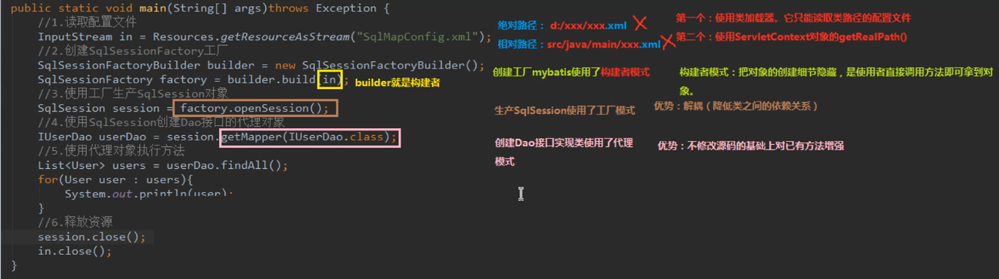
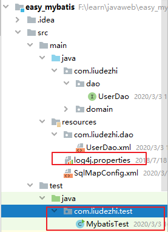

# 04.Mybatis入门案例

- 笔记本：15.Mybatis
- 创建时间：2020-03-03 07:50:55 UTC
- 更新时间：2020-03-03 10:26:58 UTC
- 印象笔记 GUID：44a8f8f6-31e5-4b52-8542-38b78dad5666

第一步：读取配置文件
 第二步：创建SqlSessionFactory 工厂
 第三步：创建SqlSession
 第四步：创建Dao 接口的代理对象
 第五步：执行dao 中的方法
 第六步：释放资源

注意事项：不要忘记在映射配置中告知mybatis 要封装到哪个实体类中
 配置的方式：指定实体类的全限定类名



```
package com.liudezhi.test;

import com.liudezhi.dao.UserDao;
import com.liudezhi.domain.User;
import org.apache.ibatis.io.Resources;
import org.apache.ibatis.session.SqlSession;
import org.apache.ibatis.session.SqlSessionFactory;
import org.apache.ibatis.session.SqlSessionFactoryBuilder;

import java.io.InputStream;
import java.util.List;

public class MybatisTest {

    public static void main(String[] args) throws Exception {
        //1. 读取配置文件
        InputStream in = Resources.getResourceAsStream("SqlMapConfig.xml");
        //2. 创建SqlSessionFactory 工厂
        SqlSessionFactoryBuilder builder = new SqlSessionFactoryBuilder();
        SqlSessionFactory factory = builder.build(in);
        //3. 使用工厂生产SqlSession 对象
        SqlSession session = factory.openSession();
        //4. 使用SqlSession 创建Dao 接口的代理对象
        UserDao userDao = session.getMapper(UserDao.class);
        //5. 使用代理对象执行方法
        List<User> users = userDao.findAll();
        for (User user: users) {
            System.out.println(user);
        }
        //6. 释放资源
        session.close();
        in.close();
    }
}

```

```
# Set root category priority to INFO and its only appender to CONSOLE.
#log4j.rootCategory=INFO, CONSOLE            debug   info   warn error fatal
log4j.rootCategory=debug, CONSOLE, LOGFILE

# Set the enterprise logger category to FATAL and its only appender to CONSOLE.
log4j.logger.org.apache.axis.enterprise=FATAL, CONSOLE

# CONSOLE is set to be a ConsoleAppender using a PatternLayout.
log4j.appender.CONSOLE=org.apache.log4j.ConsoleAppender
log4j.appender.CONSOLE.layout=org.apache.log4j.PatternLayout
log4j.appender.CONSOLE.layout.ConversionPattern=%d{ISO8601} %-6r [%15.15t] %-5p %30.30c %x - %m\n

# LOGFILE is set to be a File appender using a PatternLayout.
log4j.appender.LOGFILE=org.apache.log4j.FileAppender
log4j.appender.LOGFILE.File=d:\axis.log
log4j.appender.LOGFILE.Append=true
log4j.appender.LOGFILE.layout=org.apache.log4j.PatternLayout
log4j.appender.LOGFILE.layout.ConversionPattern=%d{ISO8601} %-6r [%15.15t] %-5p %30.30c %x - %m\n

```



**mybatis 基于注解的入门案例：**
 把UserDao.xml 移除，在dao 接口的方法上使用@Select 注解，并且指定SQL 语句，同时需要在SqlMapConfig.xml 中的mapper 配置时，使用class 属性指定dao接口的全限定类名。

Tips：我们在实际开发中，都是越简便越好，所有都是采用不写dao 实现类的方式。
 不管我们使用XML 还是注解配置。但是Mybatis 它是支持写dao 实现类的。

**eg：实现dao接口方式**

```
package com.liudezhi.dao.impl;

import com.liudezhi.dao.UserDao;
import com.liudezhi.domain.User;
import org.apache.ibatis.session.SqlSession;
import org.apache.ibatis.session.SqlSessionFactory;

import java.util.List;

public class UserDaoImpl implements UserDao {
    private SqlSessionFactory facoty;
    public UserDaoImpl(SqlSessionFactory facoty) {
        this.facoty = facoty;
    }
    public List<User> findAll() {
        //1. 使用工厂创建SqlSession 对象
        SqlSession session = facoty.openSession();
        //2. 使用session 执行查询方法
        List<User> users = session.selectList("com.liudezhi.dao.UserDao.findAll");
        session.close();
        return users;
    }
}

```

```
package com.liudezhi.test;

import com.liudezhi.dao.UserDao;
import com.liudezhi.dao.impl.UserDaoImpl;
import com.liudezhi.domain.User;
import org.apache.ibatis.io.Resources;
import org.apache.ibatis.session.SqlSession;
import org.apache.ibatis.session.SqlSessionFactory;
import org.apache.ibatis.session.SqlSessionFactoryBuilder;

import java.io.InputStream;
import java.util.List;

public class MybatisTest {

    public static void main(String[] args) throws Exception {
        //1. 读取配置文件
        InputStream in = Resources.getResourceAsStream("SqlMapConfig.xml");
        //2. 创建SqlSessionFactory 工厂
        SqlSessionFactoryBuilder builder = new SqlSessionFactoryBuilder();
        SqlSessionFactory factory = builder.build(in);
        //3. 使用工厂创建dao 对象
        UserDao userDao = new UserDaoImpl(factory);
        //4. 使用代理对象执行方法
        List<User> users = userDao.findAll();
        for (User user: users) {
            System.out.println(user);
        }
        in.close();
    }
}

```

%E7%AC%AC%E4%B8%80%E6%AD%A5%EF%BC%9A%E8%AF%BB%E5%8F%96%E9%85%8D%E7%BD%AE%E6%96%87%E4%BB%B6%0A%E7%AC%AC%E4%BA%8C%E6%AD%A5%EF%BC%9A%E5%88%9B%E5%BB%BASqlSessionFactory%20%E5%B7%A5%E5%8E%82%0A%E7%AC%AC%E4%B8%89%E6%AD%A5%EF%BC%9A%E5%88%9B%E5%BB%BASqlSession%0A%E7%AC%AC%E5%9B%9B%E6%AD%A5%EF%BC%9A%E5%88%9B%E5%BB%BADao%20%E6%8E%A5%E5%8F%A3%E7%9A%84%E4%BB%A3%E7%90%86%E5%AF%B9%E8%B1%A1%0A%E7%AC%AC%E4%BA%94%E6%AD%A5%EF%BC%9A%E6%89%A7%E8%A1%8Cdao%20%E4%B8%AD%E7%9A%84%E6%96%B9%E6%B3%95%0A%E7%AC%AC%E5%85%AD%E6%AD%A5%EF%BC%9A%E9%87%8A%E6%94%BE%E8%B5%84%E6%BA%90%0A%0A%E6%B3%A8%E6%84%8F%E4%BA%8B%E9%A1%B9%EF%BC%9A%E4%B8%8D%E8%A6%81%E5%BF%98%E8%AE%B0%E5%9C%A8%E6%98%A0%E5%B0%84%E9%85%8D%E7%BD%AE%E4%B8%AD%E5%91%8A%E7%9F%A5mybatis%20%E8%A6%81%E5%B0%81%E8%A3%85%E5%88%B0%E5%93%AA%E4%B8%AA%E5%AE%9E%E4%BD%93%E7%B1%BB%E4%B8%AD%0A%20%20%20%20%E9%85%8D%E7%BD%AE%E7%9A%84%E6%96%B9%E5%BC%8F%EF%BC%9A%E6%8C%87%E5%AE%9A%E5%AE%9E%E4%BD%93%E7%B1%BB%E7%9A%84%E5%85%A8%E9%99%90%E5%AE%9A%E7%B1%BB%E5%90%8D%0A%0A!%5Beb019b5623ad8bca1ad015d64131c0b2.png%5D(en-resource%3A%2F%2Fdatabase%2F3079%3A1)%0A%0A%60%60%60java%0Apackage%20com.liudezhi.test%3B%0A%0Aimport%20com.liudezhi.dao.UserDao%3B%0Aimport%20com.liudezhi.domain.User%3B%0Aimport%20org.apache.ibatis.io.Resources%3B%0Aimport%20org.apache.ibatis.session.SqlSession%3B%0Aimport%20org.apache.ibatis.session.SqlSessionFactory%3B%0Aimport%20org.apache.ibatis.session.SqlSessionFactoryBuilder%3B%0A%0Aimport%20java.io.InputStream%3B%0Aimport%20java.util.List%3B%0A%0Apublic%20class%20MybatisTest%20%7B%0A%0A%20%20%20%20public%20static%20void%20main(String%5B%5D%20args)%20throws%20Exception%20%7B%0A%20%20%20%20%20%20%20%20%2F%2F1.%20%E8%AF%BB%E5%8F%96%E9%85%8D%E7%BD%AE%E6%96%87%E4%BB%B6%0A%20%20%20%20%20%20%20%20InputStream%20in%20%3D%20Resources.getResourceAsStream(%22SqlMapConfig.xml%22)%3B%0A%20%20%20%20%20%20%20%20%2F%2F2.%20%E5%88%9B%E5%BB%BASqlSessionFactory%20%E5%B7%A5%E5%8E%82%0A%20%20%20%20%20%20%20%20SqlSessionFactoryBuilder%20builder%20%3D%20new%20SqlSessionFactoryBuilder()%3B%0A%20%20%20%20%20%20%20%20SqlSessionFactory%20factory%20%3D%20builder.build(in)%3B%0A%20%20%20%20%20%20%20%20%2F%2F3.%20%E4%BD%BF%E7%94%A8%E5%B7%A5%E5%8E%82%E7%94%9F%E4%BA%A7SqlSession%20%E5%AF%B9%E8%B1%A1%0A%20%20%20%20%20%20%20%20SqlSession%20session%20%3D%20factory.openSession()%3B%0A%20%20%20%20%20%20%20%20%2F%2F4.%20%E4%BD%BF%E7%94%A8SqlSession%20%E5%88%9B%E5%BB%BADao%20%E6%8E%A5%E5%8F%A3%E7%9A%84%E4%BB%A3%E7%90%86%E5%AF%B9%E8%B1%A1%0A%20%20%20%20%20%20%20%20UserDao%20userDao%20%3D%20session.getMapper(UserDao.class)%3B%0A%20%20%20%20%20%20%20%20%2F%2F5.%20%E4%BD%BF%E7%94%A8%E4%BB%A3%E7%90%86%E5%AF%B9%E8%B1%A1%E6%89%A7%E8%A1%8C%E6%96%B9%E6%B3%95%0A%20%20%20%20%20%20%20%20List%3CUser%3E%20users%20%3D%20userDao.findAll()%3B%0A%20%20%20%20%20%20%20%20for%20(User%20user%3A%20users)%20%7B%0A%20%20%20%20%20%20%20%20%20%20%20%20System.out.println(user)%3B%0A%20%20%20%20%20%20%20%20%7D%0A%20%20%20%20%20%20%20%20%2F%2F6.%20%E9%87%8A%E6%94%BE%E8%B5%84%E6%BA%90%0A%20%20%20%20%20%20%20%20session.close()%3B%0A%20%20%20%20%20%20%20%20in.close()%3B%0A%20%20%20%20%7D%0A%7D%0A%60%60%60%0A%0A%60%60%60properties%0A%23%20Set%20root%20category%20priority%20to%20INFO%20and%20its%20only%20appender%20to%20CONSOLE.%0A%23log4j.rootCategory%3DINFO%2C%20CONSOLE%20%20%20%20%20%20%20%20%20%20%20%20debug%20%20%20info%20%20%20warn%20error%20fatal%0Alog4j.rootCategory%3Ddebug%2C%20CONSOLE%2C%20LOGFILE%0A%0A%23%20Set%20the%20enterprise%20logger%20category%20to%20FATAL%20and%20its%20only%20appender%20to%20CONSOLE.%0Alog4j.logger.org.apache.axis.enterprise%3DFATAL%2C%20CONSOLE%0A%0A%23%20CONSOLE%20is%20set%20to%20be%20a%20ConsoleAppender%20using%20a%20PatternLayout.%0Alog4j.appender.CONSOLE%3Dorg.apache.log4j.ConsoleAppender%0Alog4j.appender.CONSOLE.layout%3Dorg.apache.log4j.PatternLayout%0Alog4j.appender.CONSOLE.layout.ConversionPattern%3D%25d%7BISO8601%7D%20%25-6r%20%5B%2515.15t%5D%20%25-5p%20%2530.30c%20%25x%20-%20%25m%5Cn%0A%0A%23%20LOGFILE%20is%20set%20to%20be%20a%20File%20appender%20using%20a%20PatternLayout.%0Alog4j.appender.LOGFILE%3Dorg.apache.log4j.FileAppender%0Alog4j.appender.LOGFILE.File%3Dd%3A%5Caxis.log%0Alog4j.appender.LOGFILE.Append%3Dtrue%0Alog4j.appender.LOGFILE.layout%3Dorg.apache.log4j.PatternLayout%0Alog4j.appender.LOGFILE.layout.ConversionPattern%3D%25d%7BISO8601%7D%20%25-6r%20%5B%2515.15t%5D%20%25-5p%20%2530.30c%20%25x%20-%20%25m%5Cn%0A%60%60%60%0A!%5Ba39ada23c8bccfdcd7cbec6ef5808a04.png%5D(en-resource%3A%2F%2Fdatabase%2F3077%3A1)%0A%0A---%0A%0A**mybatis%20%E5%9F%BA%E4%BA%8E%E6%B3%A8%E8%A7%A3%E7%9A%84%E5%85%A5%E9%97%A8%E6%A1%88%E4%BE%8B%EF%BC%9A**%0A%20%20%20%20%E6%8A%8AUserDao.xml%20%E7%A7%BB%E9%99%A4%EF%BC%8C%E5%9C%A8dao%20%E6%8E%A5%E5%8F%A3%E7%9A%84%E6%96%B9%E6%B3%95%E4%B8%8A%E4%BD%BF%E7%94%A8%40Select%20%E6%B3%A8%E8%A7%A3%EF%BC%8C%E5%B9%B6%E4%B8%94%E6%8C%87%E5%AE%9ASQL%20%E8%AF%AD%E5%8F%A5%EF%BC%8C%E5%90%8C%E6%97%B6%E9%9C%80%E8%A6%81%E5%9C%A8SqlMapConfig.xml%20%E4%B8%AD%E7%9A%84mapper%20%E9%85%8D%E7%BD%AE%E6%97%B6%EF%BC%8C%E4%BD%BF%E7%94%A8class%20%E5%B1%9E%E6%80%A7%E6%8C%87%E5%AE%9Adao%E6%8E%A5%E5%8F%A3%E7%9A%84%E5%85%A8%E9%99%90%E5%AE%9A%E7%B1%BB%E5%90%8D%E3%80%82%0A%0ATips%EF%BC%9A%E6%88%91%E4%BB%AC%E5%9C%A8%E5%AE%9E%E9%99%85%E5%BC%80%E5%8F%91%E4%B8%AD%EF%BC%8C%E9%83%BD%E6%98%AF%E8%B6%8A%E7%AE%80%E4%BE%BF%E8%B6%8A%E5%A5%BD%EF%BC%8C%E6%89%80%E6%9C%89%E9%83%BD%E6%98%AF%E9%87%87%E7%94%A8%E4%B8%8D%E5%86%99dao%20%E5%AE%9E%E7%8E%B0%E7%B1%BB%E7%9A%84%E6%96%B9%E5%BC%8F%E3%80%82%0A%20%20%20%20%E4%B8%8D%E7%AE%A1%E6%88%91%E4%BB%AC%E4%BD%BF%E7%94%A8XML%20%E8%BF%98%E6%98%AF%E6%B3%A8%E8%A7%A3%E9%85%8D%E7%BD%AE%E3%80%82%E4%BD%86%E6%98%AFMybatis%20%E5%AE%83%E6%98%AF%E6%94%AF%E6%8C%81%E5%86%99dao%20%E5%AE%9E%E7%8E%B0%E7%B1%BB%E7%9A%84%E3%80%82%0A%0A**eg%EF%BC%9A%E5%AE%9E%E7%8E%B0dao%E6%8E%A5%E5%8F%A3%E6%96%B9%E5%BC%8F**%0A%60%60%60java%0Apackage%20com.liudezhi.dao.impl%3B%0A%0Aimport%20com.liudezhi.dao.UserDao%3B%0Aimport%20com.liudezhi.domain.User%3B%0Aimport%20org.apache.ibatis.session.SqlSession%3B%0Aimport%20org.apache.ibatis.session.SqlSessionFactory%3B%0A%0Aimport%20java.util.List%3B%0A%0Apublic%20class%20UserDaoImpl%20implements%20UserDao%20%7B%0A%20%20%20%20private%20SqlSessionFactory%20facoty%3B%0A%20%20%20%20public%20UserDaoImpl(SqlSessionFactory%20facoty)%20%7B%0A%20%20%20%20%20%20%20%20this.facoty%20%3D%20facoty%3B%0A%20%20%20%20%7D%0A%20%20%20%20public%20List%3CUser%3E%20findAll()%20%7B%0A%20%20%20%20%20%20%20%20%2F%2F1.%20%E4%BD%BF%E7%94%A8%E5%B7%A5%E5%8E%82%E5%88%9B%E5%BB%BASqlSession%20%E5%AF%B9%E8%B1%A1%0A%20%20%20%20%20%20%20%20SqlSession%20session%20%3D%20facoty.openSession()%3B%0A%20%20%20%20%20%20%20%20%2F%2F2.%20%E4%BD%BF%E7%94%A8session%20%E6%89%A7%E8%A1%8C%E6%9F%A5%E8%AF%A2%E6%96%B9%E6%B3%95%0A%20%20%20%20%20%20%20%20List%3CUser%3E%20users%20%3D%20session.selectList(%22com.liudezhi.dao.UserDao.findAll%22)%3B%0A%20%20%20%20%20%20%20%20session.close()%3B%0A%20%20%20%20%20%20%20%20return%20users%3B%0A%20%20%20%20%7D%0A%7D%0A%60%60%60%0A%60%60%60java%0Apackage%20com.liudezhi.test%3B%0A%0Aimport%20com.liudezhi.dao.UserDao%3B%0Aimport%20com.liudezhi.dao.impl.UserDaoImpl%3B%0Aimport%20com.liudezhi.domain.User%3B%0Aimport%20org.apache.ibatis.io.Resources%3B%0Aimport%20org.apache.ibatis.session.SqlSession%3B%0Aimport%20org.apache.ibatis.session.SqlSessionFactory%3B%0Aimport%20org.apache.ibatis.session.SqlSessionFactoryBuilder%3B%0A%0Aimport%20java.io.InputStream%3B%0Aimport%20java.util.List%3B%0A%0Apublic%20class%20MybatisTest%20%7B%0A%0A%20%20%20%20public%20static%20void%20main(String%5B%5D%20args)%20throws%20Exception%20%7B%0A%20%20%20%20%20%20%20%20%2F%2F1.%20%E8%AF%BB%E5%8F%96%E9%85%8D%E7%BD%AE%E6%96%87%E4%BB%B6%0A%20%20%20%20%20%20%20%20InputStream%20in%20%3D%20Resources.getResourceAsStream(%22SqlMapConfig.xml%22)%3B%0A%20%20%20%20%20%20%20%20%2F%2F2.%20%E5%88%9B%E5%BB%BASqlSessionFactory%20%E5%B7%A5%E5%8E%82%0A%20%20%20%20%20%20%20%20SqlSessionFactoryBuilder%20builder%20%3D%20new%20SqlSessionFactoryBuilder()%3B%0A%20%20%20%20%20%20%20%20SqlSessionFactory%20factory%20%3D%20builder.build(in)%3B%0A%20%20%20%20%20%20%20%20%2F%2F3.%20%E4%BD%BF%E7%94%A8%E5%B7%A5%E5%8E%82%E5%88%9B%E5%BB%BAdao%20%E5%AF%B9%E8%B1%A1%0A%20%20%20%20%20%20%20%20UserDao%20userDao%20%3D%20new%20UserDaoImpl(factory)%3B%0A%20%20%20%20%20%20%20%20%2F%2F4.%20%E4%BD%BF%E7%94%A8%E4%BB%A3%E7%90%86%E5%AF%B9%E8%B1%A1%E6%89%A7%E8%A1%8C%E6%96%B9%E6%B3%95%0A%20%20%20%20%20%20%20%20List%3CUser%3E%20users%20%3D%20userDao.findAll()%3B%0A%20%20%20%20%20%20%20%20for%20(User%20user%3A%20users)%20%7B%0A%20%20%20%20%20%20%20%20%20%20%20%20System.out.println(user)%3B%0A%20%20%20%20%20%20%20%20%7D%0A%20%20%20%20%20%20%20%20in.close()%3B%0A%20%20%20%20%7D%0A%7D%0A%60%60%60%0A
