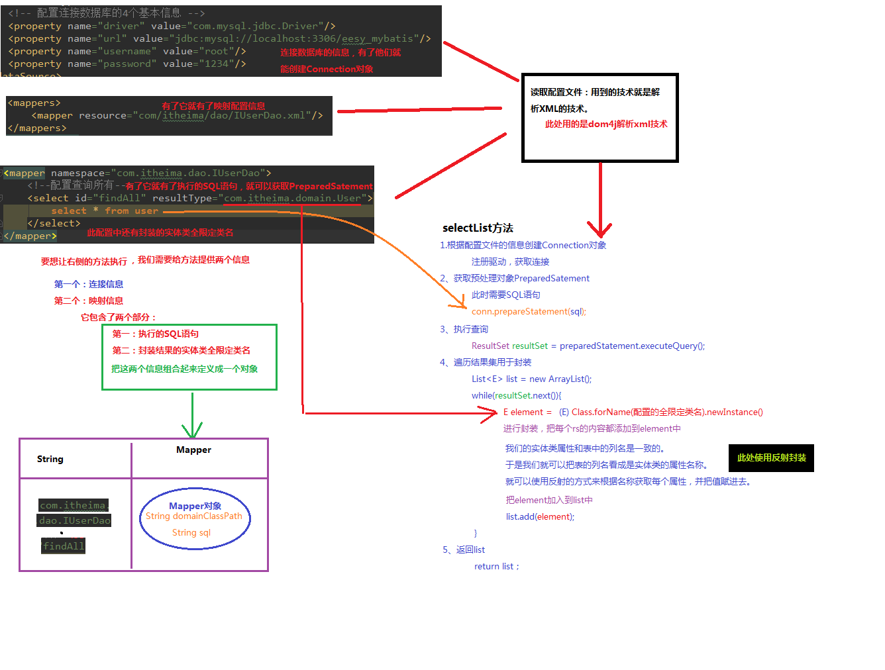
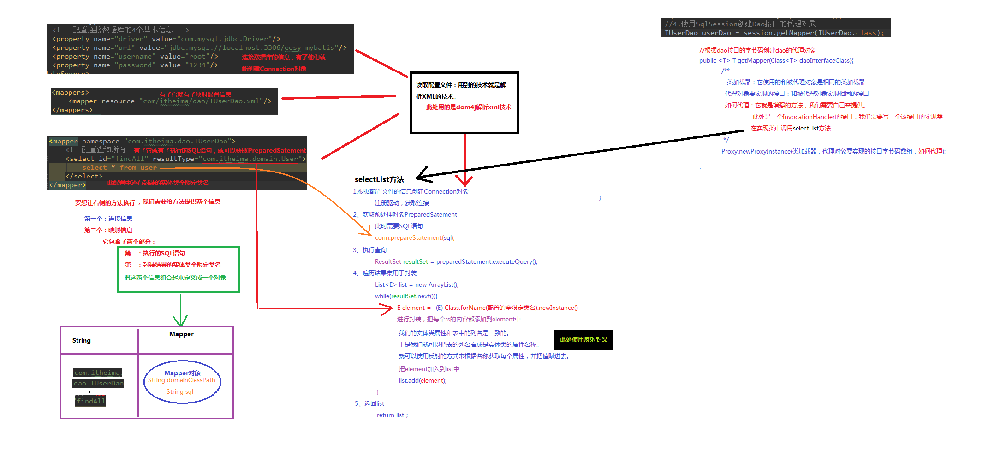

# 05.自定义mybatis框架

- 笔记本：15.Mybatis
- 创建时间：2020-03-03 10:31:45 UTC
- 更新时间：2020-03-03 10:55:33 UTC
- 印象笔记 GUID：8ca9c501-f6dd-438b-b7dd-2bdb09e98b76

自定义Mybatis 的分析：
 mybatis 在使用代理dao 的方式实现增删改查时只做了两件事：
 1. 创建代理对象
 2. 在代理对象中调用selectList

 

%E8%87%AA%E5%AE%9A%E4%B9%89Mybatis%20%E7%9A%84%E5%88%86%E6%9E%90%EF%BC%9A%0A%20%20%20%20mybatis%20%E5%9C%A8%E4%BD%BF%E7%94%A8%E4%BB%A3%E7%90%86dao%20%E7%9A%84%E6%96%B9%E5%BC%8F%E5%AE%9E%E7%8E%B0%E5%A2%9E%E5%88%A0%E6%94%B9%E6%9F%A5%E6%97%B6%E5%8F%AA%E5%81%9A%E4%BA%86%E4%B8%A4%E4%BB%B6%E4%BA%8B%EF%BC%9A%0A%20%20%20%20%20%20%20%201.%20%E5%88%9B%E5%BB%BA%E4%BB%A3%E7%90%86%E5%AF%B9%E8%B1%A1%0A%20%20%20%20%20%20%20%202.%20%E5%9C%A8%E4%BB%A3%E7%90%86%E5%AF%B9%E8%B1%A1%E4%B8%AD%E8%B0%83%E7%94%A8selectList%0A%0A!%5B5d25cde3ea251aa8e174c90416462bef.png%5D(en-resource%3A%2F%2Fdatabase%2F3083%3A0)%0A!%5Ba2b3b4b27a115e36c70e51c20b53a922.png%5D(en-resource%3A%2F%2Fdatabase%2F3085%3A0)%0A
