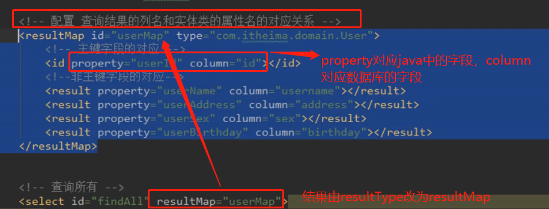

# 06.mybatis CRUD，及数据库字段与domain字段映射

- 笔记本：15.Mybatis
- 创建时间：2020-03-12 16:00:23 UTC
- 更新时间：2020-03-12 16:03:41 UTC
- 印象笔记 GUID：5f8b058a-7e76-438e-b319-8639a3f8f9eb

CRUD:jian

当程序中实体类的字段和数据库中的字段不匹配时：
 

CRUD%3A%E8%A7%81%E9%99%84%E4%BB%B6%0A%0A%E5%BD%93%E7%A8%8B%E5%BA%8F%E4%B8%AD%E5%AE%9E%E4%BD%93%E7%B1%BB%E7%9A%84%E5%AD%97%E6%AE%B5%E5%92%8C%E6%95%B0%E6%8D%AE%E5%BA%93%E4%B8%AD%E7%9A%84%E5%AD%97%E6%AE%B5%E4%B8%8D%E5%8C%B9%E9%85%8D%E6%97%B6%EF%BC%9A%0A!%5B2b382a6622667d649f3f336ab30f54fc.png%5D(en-resource%3A%2F%2Fdatabase%2F3192%3A0)%0A
