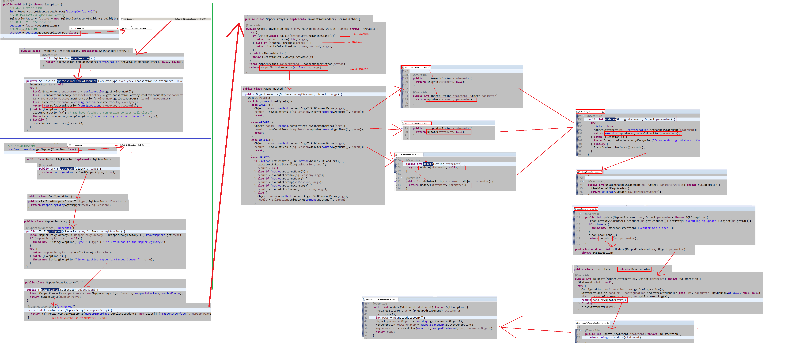
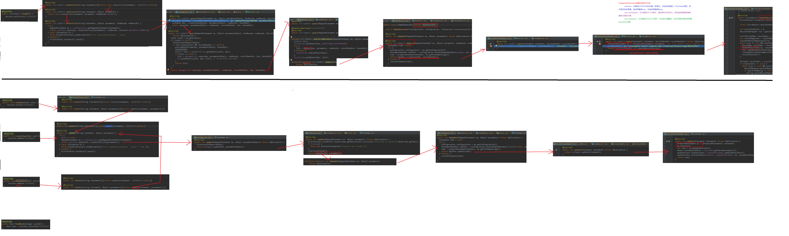
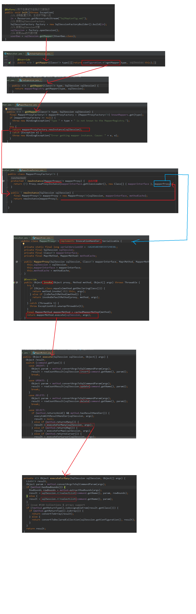
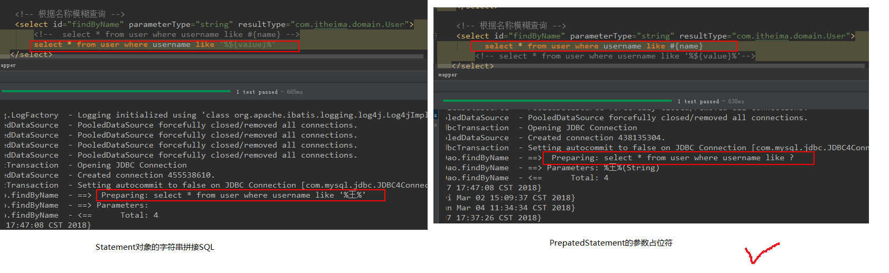
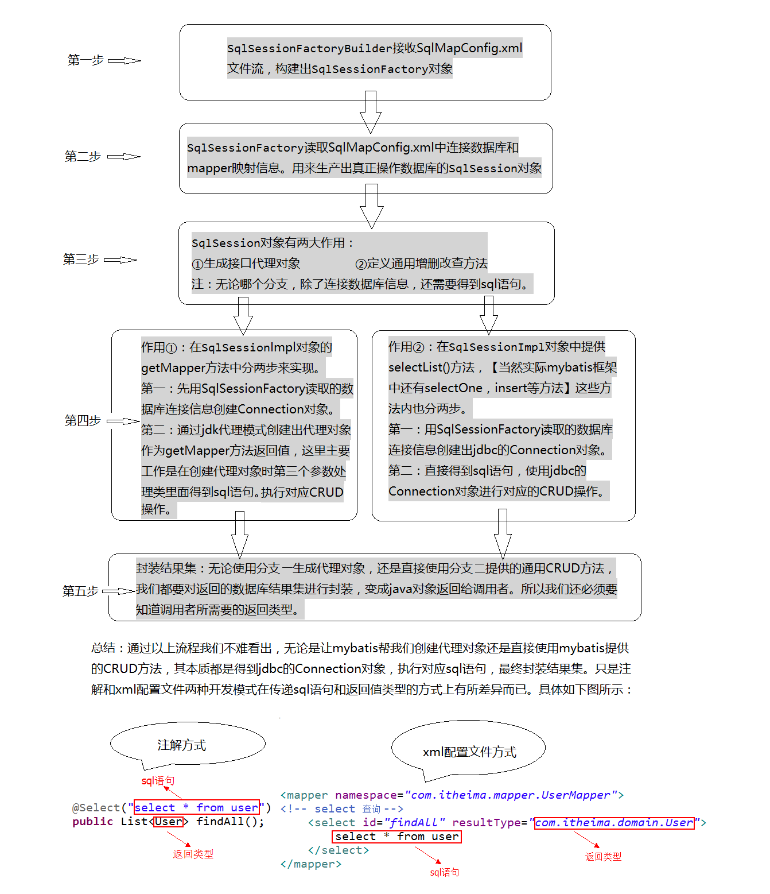

# 07.Mybatis完成Dao层的开发

- 笔记本：15.Mybatis
- 创建时间：2020-03-13 02:49:09 UTC
- 更新时间：2020-03-14 10:30:05 UTC
- 印象笔记 GUID：ec0fa0ae-fae8-4024-a723-cc1338746f69

见mybatis_dao.zip

 
 
 
 

%E8%A7%81mybatis_dao.zip%0A%0A!%5B07064bcac7e3330a7a7a12ce5d84463c.png%5D(en-resource%3A%2F%2Fdatabase%2F3214%3A0)%0A!%5B8ce16b197859120e883763c807f8ca42.png%5D(en-resource%3A%2F%2Fdatabase%2F3216%3A0)%0A!%5B24ddfe4524fb3f3c7995a65840575372.png%5D(en-resource%3A%2F%2Fdatabase%2F3218%3A0)%0A!%5B7979f8aaeb9e828f6cde7f1b005a8c16.png%5D(en-resource%3A%2F%2Fdatabase%2F3220%3A0)%0A!%5Bf69477cf90a8c0436eb471523f22f94b.png%5D(en-resource%3A%2F%2Fdatabase%2F3222%3A0)%0A
