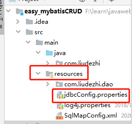

# 08.properties、typeAliase、package标签

- 笔记本：15.Mybatis
- 创建时间：2020-03-14 10:36:12 UTC
- 更新时间：2020-03-14 15:07:02 UTC
- 印象笔记 GUID：5fdb0a86-171d-4303-89a6-0699d9eacd22

```
<?xml version="1.0" encoding="UTF-8"?>
<!DOCTYPE configuration
        PUBLIC "-//mybatis.org//DTD Config 3.0//EN"
        "http://mybatis.org/dtd/mybatis-3-config.dtd">
<configuration>
    <!-- 配置properties
            可以在标签内部配置连接数据库的信息。也可以通过属性引用外部配置文件信息
            resource 属性：
                用于指定配置文件的位置，是按照类路径的写法来写，并且必须存在于类路径下。
            url 属性：
                是要求按照Url 的写法来写地址
                URL：Uniform Resource Locator 统一资源定位符。可以唯一标识一个资源的位置。
                写法：
                    http://localhost:8080/mybatisserver/demo1Servlet
                    协议     主机      端口     URI
                URI：Uniform Resource Identifier 统一资源标识符。它是在应用总可以唯一定位一个资源的
     -->
    <properties resource="jdbcConfig.properties">   <!-- 可以 file:///D:///...jdbcConfig.properties -->
<!--        <property name="driver" value="com.mysql.cj.jdbc.Driver"/>
        <property name="url" value="jdbc:mysql://localhost:3306/mybatis_learn?useUnicode=true&amp;characterEncoding=utf-8&amp;useSSL=false&amp;serverTimezone=GMT"/>
        <property name="username" value="root"/>
        <property name="password" value="Liudezhi"/>-->
    </properties>

    <!-- 使用typeAliase 配置别名，它只能配置domain 中类的别名 -->
    <typeAliases>
        <!-- typeAlias 用于配置别名。type属性指定的是实体类全限定类名。alias属性指定别名，当制定了别名就不再区分大小写 -->
<!--        <typeAlias type="com.liudezhi.domain.User" alias="user"></typeAlias>-->
        <!-- 用于指定要配置别名的包，当指定后，该包下的实体类都会注册别名，并且类名就是别名，不再区分大小写 -->
        <package name="com.liudezhi.domain"/>
    </typeAliases>

    <!-- 配置环境 -->
    <environments default="mysql">
        <!-- 配置mysql 的环境 -->
        <environment id="mysql">
            <!-- 配置事务 -->
            <transactionManager type="JDBC"></transactionManager>
            <!-- 配置连接池 -->
            <dataSource type="POOLED">
                <property name="driver" value="${jdbc.driver}"/>
                <property name="url" value="${jdbc.url}"/>
                <property name="username" value="${jdbc.username}"/>
                <property name="password" value="${jdbc.password}"/>
            </dataSource>
        </environment>
    </environments>

    <!-- 配置映射文件的位置 -->
    <mappers>
<!--        <mapper resource="com/liudezhi/dao/UserDao.xml"></mapper>-->
        <!-- package 标签是用于指定dao接口所在的包,当制定完之后，就不需要写mapper以及resource或则class了 -->
        <package name="com.liudezhi.dao"/>
    </mappers>
</configuration>

```



```
jdbc.driver=com.mysql.cj.jdbc.Driver
jdbc.url=jdbc:mysql://localhost:3306/mybatis_learn?useUnicode=true&amp;characterEncoding=utf-8&amp;useSSL=false&amp;serverTimezone=GMT"
jdbc.username=root
jdbc.password=Liudezhi

```

%0A%0A%60%60%60xml%0A%3C%3Fxml%20version%3D%221.0%22%20encoding%3D%22UTF-8%22%3F%3E%0A%3C!DOCTYPE%20configuration%0A%20%20%20%20%20%20%20%20PUBLIC%20%22-%2F%2Fmybatis.org%2F%2FDTD%20Config%203.0%2F%2FEN%22%0A%20%20%20%20%20%20%20%20%22http%3A%2F%2Fmybatis.org%2Fdtd%2Fmybatis-3-config.dtd%22%3E%0A%3Cconfiguration%3E%0A%20%20%20%20%3C!--%20%E9%85%8D%E7%BD%AEproperties%0A%20%20%20%20%20%20%20%20%20%20%20%20%E5%8F%AF%E4%BB%A5%E5%9C%A8%E6%A0%87%E7%AD%BE%E5%86%85%E9%83%A8%E9%85%8D%E7%BD%AE%E8%BF%9E%E6%8E%A5%E6%95%B0%E6%8D%AE%E5%BA%93%E7%9A%84%E4%BF%A1%E6%81%AF%E3%80%82%E4%B9%9F%E5%8F%AF%E4%BB%A5%E9%80%9A%E8%BF%87%E5%B1%9E%E6%80%A7%E5%BC%95%E7%94%A8%E5%A4%96%E9%83%A8%E9%85%8D%E7%BD%AE%E6%96%87%E4%BB%B6%E4%BF%A1%E6%81%AF%0A%20%20%20%20%20%20%20%20%20%20%20%20resource%20%E5%B1%9E%E6%80%A7%EF%BC%9A%0A%20%20%20%20%20%20%20%20%20%20%20%20%20%20%20%20%E7%94%A8%E4%BA%8E%E6%8C%87%E5%AE%9A%E9%85%8D%E7%BD%AE%E6%96%87%E4%BB%B6%E7%9A%84%E4%BD%8D%E7%BD%AE%EF%BC%8C%E6%98%AF%E6%8C%89%E7%85%A7%E7%B1%BB%E8%B7%AF%E5%BE%84%E7%9A%84%E5%86%99%E6%B3%95%E6%9D%A5%E5%86%99%EF%BC%8C%E5%B9%B6%E4%B8%94%E5%BF%85%E9%A1%BB%E5%AD%98%E5%9C%A8%E4%BA%8E%E7%B1%BB%E8%B7%AF%E5%BE%84%E4%B8%8B%E3%80%82%0A%20%20%20%20%20%20%20%20%20%20%20%20url%20%E5%B1%9E%E6%80%A7%EF%BC%9A%0A%20%20%20%20%20%20%20%20%20%20%20%20%20%20%20%20%E6%98%AF%E8%A6%81%E6%B1%82%E6%8C%89%E7%85%A7Url%20%E7%9A%84%E5%86%99%E6%B3%95%E6%9D%A5%E5%86%99%E5%9C%B0%E5%9D%80%0A%20%20%20%20%20%20%20%20%20%20%20%20%20%20%20%20URL%EF%BC%9AUniform%20Resource%20Locator%20%E7%BB%9F%E4%B8%80%E8%B5%84%E6%BA%90%E5%AE%9A%E4%BD%8D%E7%AC%A6%E3%80%82%E5%8F%AF%E4%BB%A5%E5%94%AF%E4%B8%80%E6%A0%87%E8%AF%86%E4%B8%80%E4%B8%AA%E8%B5%84%E6%BA%90%E7%9A%84%E4%BD%8D%E7%BD%AE%E3%80%82%0A%20%20%20%20%20%20%20%20%20%20%20%20%20%20%20%20%E5%86%99%E6%B3%95%EF%BC%9A%0A%20%20%20%20%20%20%20%20%20%20%20%20%20%20%20%20%20%20%20%20http%3A%2F%2Flocalhost%3A8080%2Fmybatisserver%2Fdemo1Servlet%0A%20%20%20%20%20%20%20%20%20%20%20%20%20%20%20%20%20%20%20%20%E5%8D%8F%E8%AE%AE%20%20%20%20%20%E4%B8%BB%E6%9C%BA%20%20%20%20%20%20%E7%AB%AF%E5%8F%A3%20%20%20%20%20URI%0A%20%20%20%20%20%20%20%20%20%20%20%20%20%20%20%20URI%EF%BC%9AUniform%20Resource%20Identifier%20%E7%BB%9F%E4%B8%80%E8%B5%84%E6%BA%90%E6%A0%87%E8%AF%86%E7%AC%A6%E3%80%82%E5%AE%83%E6%98%AF%E5%9C%A8%E5%BA%94%E7%94%A8%E6%80%BB%E5%8F%AF%E4%BB%A5%E5%94%AF%E4%B8%80%E5%AE%9A%E4%BD%8D%E4%B8%80%E4%B8%AA%E8%B5%84%E6%BA%90%E7%9A%84%0A%20%20%20%20%20--%3E%0A%20%20%20%20%3Cproperties%20resource%3D%22jdbcConfig.properties%22%3E%20%20%20%3C!--%20%E5%8F%AF%E4%BB%A5%20file%3A%2F%2F%2FD%3A%2F%2F%2F...jdbcConfig.properties%20--%3E%0A%3C!--%20%20%20%20%20%20%20%20%3Cproperty%20name%3D%22driver%22%20value%3D%22com.mysql.cj.jdbc.Driver%22%2F%3E%0A%20%20%20%20%20%20%20%20%3Cproperty%20name%3D%22url%22%20value%3D%22jdbc%3Amysql%3A%2F%2Flocalhost%3A3306%2Fmybatis_learn%3FuseUnicode%3Dtrue%26amp%3BcharacterEncoding%3Dutf-8%26amp%3BuseSSL%3Dfalse%26amp%3BserverTimezone%3DGMT%22%2F%3E%0A%20%20%20%20%20%20%20%20%3Cproperty%20name%3D%22username%22%20value%3D%22root%22%2F%3E%0A%20%20%20%20%20%20%20%20%3Cproperty%20name%3D%22password%22%20value%3D%22Liudezhi%22%2F%3E--%3E%0A%20%20%20%20%3C%2Fproperties%3E%0A%0A%20%20%20%20%3C!--%20%E4%BD%BF%E7%94%A8typeAliase%20%E9%85%8D%E7%BD%AE%E5%88%AB%E5%90%8D%EF%BC%8C%E5%AE%83%E5%8F%AA%E8%83%BD%E9%85%8D%E7%BD%AEdomain%20%E4%B8%AD%E7%B1%BB%E7%9A%84%E5%88%AB%E5%90%8D%20--%3E%0A%20%20%20%20%3CtypeAliases%3E%0A%20%20%20%20%20%20%20%20%3C!--%20typeAlias%20%E7%94%A8%E4%BA%8E%E9%85%8D%E7%BD%AE%E5%88%AB%E5%90%8D%E3%80%82type%E5%B1%9E%E6%80%A7%E6%8C%87%E5%AE%9A%E7%9A%84%E6%98%AF%E5%AE%9E%E4%BD%93%E7%B1%BB%E5%85%A8%E9%99%90%E5%AE%9A%E7%B1%BB%E5%90%8D%E3%80%82alias%E5%B1%9E%E6%80%A7%E6%8C%87%E5%AE%9A%E5%88%AB%E5%90%8D%EF%BC%8C%E5%BD%93%E5%88%B6%E5%AE%9A%E4%BA%86%E5%88%AB%E5%90%8D%E5%B0%B1%E4%B8%8D%E5%86%8D%E5%8C%BA%E5%88%86%E5%A4%A7%E5%B0%8F%E5%86%99%20--%3E%0A%3C!--%20%20%20%20%20%20%20%20%3CtypeAlias%20type%3D%22com.liudezhi.domain.User%22%20alias%3D%22user%22%3E%3C%2FtypeAlias%3E--%3E%0A%20%20%20%20%20%20%20%20%3C!--%20%E7%94%A8%E4%BA%8E%E6%8C%87%E5%AE%9A%E8%A6%81%E9%85%8D%E7%BD%AE%E5%88%AB%E5%90%8D%E7%9A%84%E5%8C%85%EF%BC%8C%E5%BD%93%E6%8C%87%E5%AE%9A%E5%90%8E%EF%BC%8C%E8%AF%A5%E5%8C%85%E4%B8%8B%E7%9A%84%E5%AE%9E%E4%BD%93%E7%B1%BB%E9%83%BD%E4%BC%9A%E6%B3%A8%E5%86%8C%E5%88%AB%E5%90%8D%EF%BC%8C%E5%B9%B6%E4%B8%94%E7%B1%BB%E5%90%8D%E5%B0%B1%E6%98%AF%E5%88%AB%E5%90%8D%EF%BC%8C%E4%B8%8D%E5%86%8D%E5%8C%BA%E5%88%86%E5%A4%A7%E5%B0%8F%E5%86%99%20--%3E%0A%20%20%20%20%20%20%20%20%3Cpackage%20name%3D%22com.liudezhi.domain%22%2F%3E%0A%20%20%20%20%3C%2FtypeAliases%3E%0A%0A%0A%20%20%20%20%3C!--%20%E9%85%8D%E7%BD%AE%E7%8E%AF%E5%A2%83%20--%3E%0A%20%20%20%20%3Cenvironments%20default%3D%22mysql%22%3E%0A%20%20%20%20%20%20%20%20%3C!--%20%E9%85%8D%E7%BD%AEmysql%20%E7%9A%84%E7%8E%AF%E5%A2%83%20--%3E%0A%20%20%20%20%20%20%20%20%3Cenvironment%20id%3D%22mysql%22%3E%0A%20%20%20%20%20%20%20%20%20%20%20%20%3C!--%20%E9%85%8D%E7%BD%AE%E4%BA%8B%E5%8A%A1%20--%3E%0A%20%20%20%20%20%20%20%20%20%20%20%20%3CtransactionManager%20type%3D%22JDBC%22%3E%3C%2FtransactionManager%3E%0A%20%20%20%20%20%20%20%20%20%20%20%20%3C!--%20%E9%85%8D%E7%BD%AE%E8%BF%9E%E6%8E%A5%E6%B1%A0%20--%3E%0A%20%20%20%20%20%20%20%20%20%20%20%20%3CdataSource%20type%3D%22POOLED%22%3E%0A%20%20%20%20%20%20%20%20%20%20%20%20%20%20%20%20%3Cproperty%20name%3D%22driver%22%20value%3D%22%24%7Bjdbc.driver%7D%22%2F%3E%0A%20%20%20%20%20%20%20%20%20%20%20%20%20%20%20%20%3Cproperty%20name%3D%22url%22%20value%3D%22%24%7Bjdbc.url%7D%22%2F%3E%0A%20%20%20%20%20%20%20%20%20%20%20%20%20%20%20%20%3Cproperty%20name%3D%22username%22%20value%3D%22%24%7Bjdbc.username%7D%22%2F%3E%0A%20%20%20%20%20%20%20%20%20%20%20%20%20%20%20%20%3Cproperty%20name%3D%22password%22%20value%3D%22%24%7Bjdbc.password%7D%22%2F%3E%0A%20%20%20%20%20%20%20%20%20%20%20%20%3C%2FdataSource%3E%0A%20%20%20%20%20%20%20%20%3C%2Fenvironment%3E%0A%20%20%20%20%3C%2Fenvironments%3E%0A%0A%20%20%20%20%3C!--%20%E9%85%8D%E7%BD%AE%E6%98%A0%E5%B0%84%E6%96%87%E4%BB%B6%E7%9A%84%E4%BD%8D%E7%BD%AE%20--%3E%0A%20%20%20%20%3Cmappers%3E%0A%3C!--%20%20%20%20%20%20%20%20%3Cmapper%20resource%3D%22com%2Fliudezhi%2Fdao%2FUserDao.xml%22%3E%3C%2Fmapper%3E--%3E%0A%20%20%20%20%20%20%20%20%3C!--%20package%20%E6%A0%87%E7%AD%BE%E6%98%AF%E7%94%A8%E4%BA%8E%E6%8C%87%E5%AE%9Adao%E6%8E%A5%E5%8F%A3%E6%89%80%E5%9C%A8%E7%9A%84%E5%8C%85%2C%E5%BD%93%E5%88%B6%E5%AE%9A%E5%AE%8C%E4%B9%8B%E5%90%8E%EF%BC%8C%E5%B0%B1%E4%B8%8D%E9%9C%80%E8%A6%81%E5%86%99mapper%E4%BB%A5%E5%8F%8Aresource%E6%88%96%E5%88%99class%E4%BA%86%20--%3E%0A%20%20%20%20%20%20%20%20%3Cpackage%20name%3D%22com.liudezhi.dao%22%2F%3E%0A%20%20%20%20%3C%2Fmappers%3E%0A%3C%2Fconfiguration%3E%0A%60%60%60%0A%0A%0A!%5B353ebaf5e3c4bddd1eacea1101361943.png%5D(en-resource%3A%2F%2Fdatabase%2F3226%3A1)%0A%0A%60%60%60properties%0Ajdbc.driver%3Dcom.mysql.cj.jdbc.Driver%0Ajdbc.url%3Djdbc%3Amysql%3A%2F%2Flocalhost%3A3306%2Fmybatis_learn%3FuseUnicode%3Dtrue%26amp%3BcharacterEncoding%3Dutf-8%26amp%3BuseSSL%3Dfalse%26amp%3BserverTimezone%3DGMT%22%0Ajdbc.username%3Droot%0Ajdbc.password%3DLiudezhi%0A%60%60%60%0A%0A
