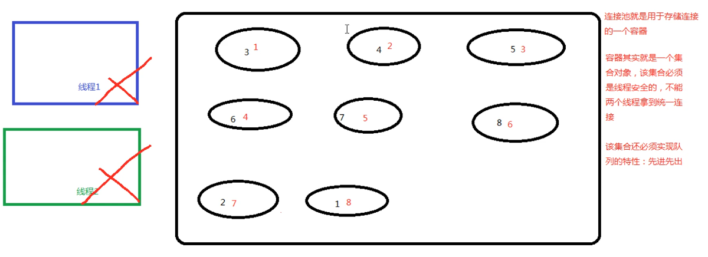
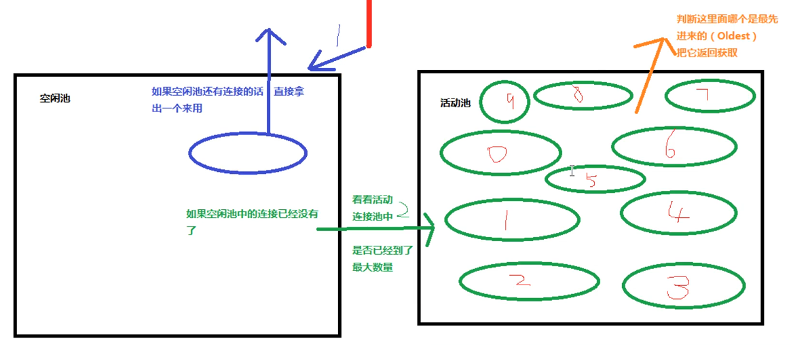

# 09.mybatis连接池及事务

- 笔记本：15.Mybatis
- 创建时间：2020-03-14 15:08:24 UTC
- 更新时间：2020-03-14 16:07:20 UTC
- 印象笔记 GUID：80fa2d8e-1c2a-4b00-9f22-3321d9234fcc

#### mybatis 中连接池使用及分析

1.
我们在实际开发中都会使用连接池，因为它可以减少我们获取连接所消耗的时间。
 

1.
mybatis 中的连接池。mybatis 连接池提供了3中方式的配置：
 配置的位置：
 主配置文件SqlMapConfig.xml 中的 dataSource 标签，type 属性就是表示采用何种连接池方式
 type 属性的取值：

  -
POOLED：采用传统的 javax.sql.DataSource 规范中的连接池，mybatis 中有针对规范的实现。
 

  -
UNPOOLED：采用传统的获取连接的方式，虽然也实现了Javax.sql.DataSource接口，但是并没有使用池的思想。

  -
JNDI ：采用服务器提供的JNDI 技术实现，来获取DataSource对象，不同的服务器所能拿到的DataSource是不一样的。**注意：** 如果不是 web 或者 maven 的 war 工程，是不能使用的。我们实际开发中使用的是tomcat 服务器，采用连接池就是 dbcp 连接池。

#### mybatis 事务控制的分析

什么是事务
 事务的四大特性ACID
 不考虑隔离性会产生的3个问题
 解决办法：四种隔离级别

它是通过sqlSession 对象的commit 方法和rollback 方法实现事务的提交和回滚

%23%23%23%23%20mybatis%20%E4%B8%AD%E8%BF%9E%E6%8E%A5%E6%B1%A0%E4%BD%BF%E7%94%A8%E5%8F%8A%E5%88%86%E6%9E%90%0A1.%20%E6%88%91%E4%BB%AC%E5%9C%A8%E5%AE%9E%E9%99%85%E5%BC%80%E5%8F%91%E4%B8%AD%E9%83%BD%E4%BC%9A%E4%BD%BF%E7%94%A8%E8%BF%9E%E6%8E%A5%E6%B1%A0%EF%BC%8C%E5%9B%A0%E4%B8%BA%E5%AE%83%E5%8F%AF%E4%BB%A5%E5%87%8F%E5%B0%91%E6%88%91%E4%BB%AC%E8%8E%B7%E5%8F%96%E8%BF%9E%E6%8E%A5%E6%89%80%E6%B6%88%E8%80%97%E7%9A%84%E6%97%B6%E9%97%B4%E3%80%82%0A!%5Be4b941832d4f639f772cea8bb68d1842.png%5D(en-resource%3A%2F%2Fdatabase%2F3230%3A0)%0A%0A2.%20mybatis%20%E4%B8%AD%E7%9A%84%E8%BF%9E%E6%8E%A5%E6%B1%A0%E3%80%82mybatis%20%E8%BF%9E%E6%8E%A5%E6%B1%A0%E6%8F%90%E4%BE%9B%E4%BA%863%E4%B8%AD%E6%96%B9%E5%BC%8F%E7%9A%84%E9%85%8D%E7%BD%AE%EF%BC%9A%0A%20%20%20%20%E9%85%8D%E7%BD%AE%E7%9A%84%E4%BD%8D%E7%BD%AE%EF%BC%9A%0A%20%20%20%20%20%20%20%20%E4%B8%BB%E9%85%8D%E7%BD%AE%E6%96%87%E4%BB%B6SqlMapConfig.xml%20%E4%B8%AD%E7%9A%84%20dataSource%20%E6%A0%87%E7%AD%BE%EF%BC%8Ctype%20%E5%B1%9E%E6%80%A7%E5%B0%B1%E6%98%AF%E8%A1%A8%E7%A4%BA%E9%87%87%E7%94%A8%E4%BD%95%E7%A7%8D%E8%BF%9E%E6%8E%A5%E6%B1%A0%E6%96%B9%E5%BC%8F%0A%20%20%20%20type%20%E5%B1%9E%E6%80%A7%E7%9A%84%E5%8F%96%E5%80%BC%EF%BC%9A%20%0A%20%20%20%20*%20POOLED%EF%BC%9A%E9%87%87%E7%94%A8%E4%BC%A0%E7%BB%9F%E7%9A%84%20javax.sql.DataSource%20%E8%A7%84%E8%8C%83%E4%B8%AD%E7%9A%84%E8%BF%9E%E6%8E%A5%E6%B1%A0%EF%BC%8Cmybatis%20%E4%B8%AD%E6%9C%89%E9%92%88%E5%AF%B9%E8%A7%84%E8%8C%83%E7%9A%84%E5%AE%9E%E7%8E%B0%E3%80%82%0A!%5Bd7bc525c6a20b5c488e860150a70fceb.png%5D(en-resource%3A%2F%2Fdatabase%2F3232%3A0)%0A%0A%20%20%20%20*%20UNPOOLED%EF%BC%9A%E9%87%87%E7%94%A8%E4%BC%A0%E7%BB%9F%E7%9A%84%E8%8E%B7%E5%8F%96%E8%BF%9E%E6%8E%A5%E7%9A%84%E6%96%B9%E5%BC%8F%EF%BC%8C%E8%99%BD%E7%84%B6%E4%B9%9F%E5%AE%9E%E7%8E%B0%E4%BA%86Javax.sql.DataSource%E6%8E%A5%E5%8F%A3%EF%BC%8C%E4%BD%86%E6%98%AF%E5%B9%B6%E6%B2%A1%E6%9C%89%E4%BD%BF%E7%94%A8%E6%B1%A0%E7%9A%84%E6%80%9D%E6%83%B3%E3%80%82%0A%20%20%20%20*%20JNDI%20%EF%BC%9A%E9%87%87%E7%94%A8%E6%9C%8D%E5%8A%A1%E5%99%A8%E6%8F%90%E4%BE%9B%E7%9A%84JNDI%20%E6%8A%80%E6%9C%AF%E5%AE%9E%E7%8E%B0%EF%BC%8C%E6%9D%A5%E8%8E%B7%E5%8F%96DataSource%E5%AF%B9%E8%B1%A1%EF%BC%8C%E4%B8%8D%E5%90%8C%E7%9A%84%E6%9C%8D%E5%8A%A1%E5%99%A8%E6%89%80%E8%83%BD%E6%8B%BF%E5%88%B0%E7%9A%84DataSource%E6%98%AF%E4%B8%8D%E4%B8%80%E6%A0%B7%E7%9A%84%E3%80%82**%E6%B3%A8%E6%84%8F%EF%BC%9A**%20%E5%A6%82%E6%9E%9C%E4%B8%8D%E6%98%AF%20web%20%E6%88%96%E8%80%85%20maven%20%E7%9A%84%20war%20%E5%B7%A5%E7%A8%8B%EF%BC%8C%E6%98%AF%E4%B8%8D%E8%83%BD%E4%BD%BF%E7%94%A8%E7%9A%84%E3%80%82%E6%88%91%E4%BB%AC%E5%AE%9E%E9%99%85%E5%BC%80%E5%8F%91%E4%B8%AD%E4%BD%BF%E7%94%A8%E7%9A%84%E6%98%AFtomcat%20%E6%9C%8D%E5%8A%A1%E5%99%A8%EF%BC%8C%E9%87%87%E7%94%A8%E8%BF%9E%E6%8E%A5%E6%B1%A0%E5%B0%B1%E6%98%AF%20dbcp%20%E8%BF%9E%E6%8E%A5%E6%B1%A0%E3%80%82%0A%0A%0A%23%23%23%23%20mybatis%20%E4%BA%8B%E5%8A%A1%E6%8E%A7%E5%88%B6%E7%9A%84%E5%88%86%E6%9E%90%0A%E4%BB%80%E4%B9%88%E6%98%AF%E4%BA%8B%E5%8A%A1%0A%E4%BA%8B%E5%8A%A1%E7%9A%84%E5%9B%9B%E5%A4%A7%E7%89%B9%E6%80%A7ACID%0A%E4%B8%8D%E8%80%83%E8%99%91%E9%9A%94%E7%A6%BB%E6%80%A7%E4%BC%9A%E4%BA%A7%E7%94%9F%E7%9A%843%E4%B8%AA%E9%97%AE%E9%A2%98%0A%E8%A7%A3%E5%86%B3%E5%8A%9E%E6%B3%95%EF%BC%9A%E5%9B%9B%E7%A7%8D%E9%9A%94%E7%A6%BB%E7%BA%A7%E5%88%AB%0A%0A%E5%AE%83%E6%98%AF%E9%80%9A%E8%BF%87sqlSession%20%E5%AF%B9%E8%B1%A1%E7%9A%84commit%20%E6%96%B9%E6%B3%95%E5%92%8Crollback%20%E6%96%B9%E6%B3%95%E5%AE%9E%E7%8E%B0%E4%BA%8B%E5%8A%A1%E7%9A%84%E6%8F%90%E4%BA%A4%E5%92%8C%E5%9B%9E%E6%BB%9A%0A
