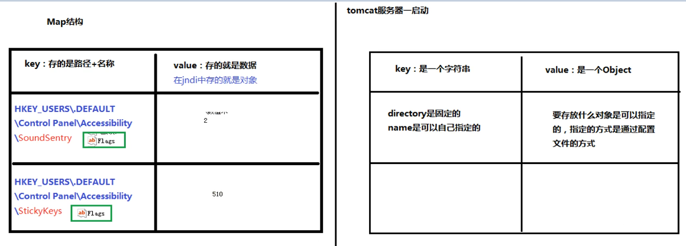

# 12.JNDI

- 笔记本：15.Mybatis
- 创建时间：2020-03-15 15:33:15 UTC
- 更新时间：2020-03-17 02:20:39 UTC
- 原始链接：https://baike.baidu.com/item/JNDI/3792442?fr=aladdin
- 印象笔记 GUID：a17d1660-4846-4317-bb43-fe4a71943e37

### JNDI 概述和原理

JNDI(Java Naming and Directory Interface,Java命名和目录接口)是SUN公司提供的一种标准的Java命名系统接口，JNDI提供统一的客户端API，通过不同的访问提供者接口JNDI服务供应接口(SPI)的实现，由管理者将JNDI API映射为特定的命名服务和目录系统，使得Java应用程序可以和这些命名服务和目录服务之间进行交互。
 

### JNDI 搭建maven 的war 工程

### 测试JNDI 数据源的使用以及使用

%0A%23%23%23%20JNDI%20%E6%A6%82%E8%BF%B0%E5%92%8C%E5%8E%9F%E7%90%86%0AJNDI(Java%20Naming%20and%20Directory%20Interface%2CJava%E5%91%BD%E5%90%8D%E5%92%8C%E7%9B%AE%E5%BD%95%E6%8E%A5%E5%8F%A3)%E6%98%AFSUN%E5%85%AC%E5%8F%B8%E6%8F%90%E4%BE%9B%E7%9A%84%E4%B8%80%E7%A7%8D%E6%A0%87%E5%87%86%E7%9A%84Java%E5%91%BD%E5%90%8D%E7%B3%BB%E7%BB%9F%E6%8E%A5%E5%8F%A3%EF%BC%8CJNDI%E6%8F%90%E4%BE%9B%E7%BB%9F%E4%B8%80%E7%9A%84%E5%AE%A2%E6%88%B7%E7%AB%AFAPI%EF%BC%8C%E9%80%9A%E8%BF%87%E4%B8%8D%E5%90%8C%E7%9A%84%E8%AE%BF%E9%97%AE%E6%8F%90%E4%BE%9B%E8%80%85%E6%8E%A5%E5%8F%A3JNDI%E6%9C%8D%E5%8A%A1%E4%BE%9B%E5%BA%94%E6%8E%A5%E5%8F%A3(SPI)%E7%9A%84%E5%AE%9E%E7%8E%B0%EF%BC%8C%E7%94%B1%E7%AE%A1%E7%90%86%E8%80%85%E5%B0%86JNDI%20API%E6%98%A0%E5%B0%84%E4%B8%BA%E7%89%B9%E5%AE%9A%E7%9A%84%E5%91%BD%E5%90%8D%E6%9C%8D%E5%8A%A1%E5%92%8C%E7%9B%AE%E5%BD%95%E7%B3%BB%E7%BB%9F%EF%BC%8C%E4%BD%BF%E5%BE%97Java%E5%BA%94%E7%94%A8%E7%A8%8B%E5%BA%8F%E5%8F%AF%E4%BB%A5%E5%92%8C%E8%BF%99%E4%BA%9B%E5%91%BD%E5%90%8D%E6%9C%8D%E5%8A%A1%E5%92%8C%E7%9B%AE%E5%BD%95%E6%9C%8D%E5%8A%A1%E4%B9%8B%E9%97%B4%E8%BF%9B%E8%A1%8C%E4%BA%A4%E4%BA%92%E3%80%82%0A!%5B61728e564cb9232ad5a8d55c77a132d0.png%5D(en-resource%3A%2F%2Fdatabase%2F3240%3A0)%0A%0A%23%23%23%20JNDI%20%E6%90%AD%E5%BB%BAmaven%20%E7%9A%84war%20%E5%B7%A5%E7%A8%8B%0A%0A%23%23%23%20%E6%B5%8B%E8%AF%95JNDI%20%E6%95%B0%E6%8D%AE%E6%BA%90%E7%9A%84%E4%BD%BF%E7%94%A8%E4%BB%A5%E5%8F%8A%E4%BD%BF%E7%94%A8%E7%BB%86%E8%8A%82%0A
