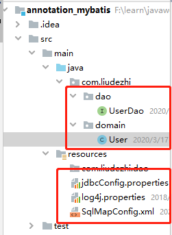
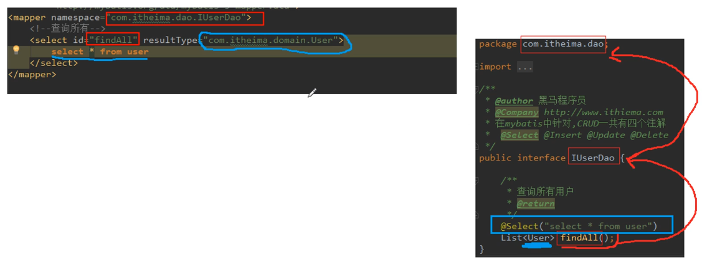
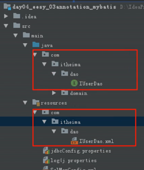

# 15.Mybatis注解开发

- 笔记本：15.Mybatis
- 创建时间：2020-03-17 15:27:26 UTC
- 更新时间：2020-03-18 08:36:38 UTC
- 印象笔记 GUID：ec22658d-7e72-4d8a-ad5e-5b4b8437fce5

### 环境搭建

1. 新建maven工程

1. pom.xml中引入相应的依赖（mybatis、mysql-connector-java、log4j、junit）

1. 新建实体类，dao层接口

```
public interface UserDao {
    /**
     * 查询所有用户
     * @return
     * 在mybatis中针对CRUD一共有四个注解
     * @Select @Insert @Update @Delete
     */
//    @Select(value="select * from user")   //注解如果只有一个value属性需要赋值的时候，value是可以省略的
    @Select("select * from user")
    List<User> findAll();
}

```

1. resources下SqlMapConfig.xml 文件编写，引入jdbc配置文件
 

### 测试和使用注意事项

```
package com.liudezhi.test;
public class MybatisAnnoTest {
    /**
     * 测试基于注解的mybatis 使用
     * @param args
     */
    public static void main(String[] args) throws IOException {
        //1. 获取字节输入流
        InputStream in = Resources.getResourceAsStream("SqlMapConfig.xml");
        //2. 根据字节输入流构建SqlSessionFactory
        SqlSessionFactory factory = new SqlSessionFactoryBuilder().build(in);
        //3. 根据SqlSessionFactory 生产一个SqlSession
        SqlSession session = factory.openSession();
        //4. 使用SqlSession获取Dao的代理对象
        UserDao userDao = session.getMapper(UserDao.class);
        //5. 执行Dao的方法
        List<User> users = userDao.findAll();
        for (User user : users) {
            System.out.println(user);
        }
        //6. 释放资源
        session.close();
        in.close();
    }
}

```

**注解可以替代xml的原因：注解可以通过方法名，类名，包以及注解获取到xml中所需要的所有信息。**
 

**注意：**

- 如果既有注解又有配置文件，并且在SqlMapConfig.xml 中`<mappers>` 标签中配置的是`<package name="com.liudezhi.dao"></package>` 会报错。

- 如果没有使用package，使用的是`<mapper ></mapper>`同样会报错

- 只要使用注解开发，但是在配置文件路径下同时包含了xml，此时不管用不用，都会报错。
 

### 单表CRUD

```
package com.liudezhi.dao;
public interface UserDao {
    /**
     * 查询所有用户
     * @return
     * 在mybatis中针对CRUD一共有四个注解
     * @Select @Insert @Update @Delete
     */
//    @Select(value="select * from user")   //注解如果只有一个value属性需要赋值的时候，value是可以省略的
    @Select("select * from user")
    List<User> findAll();

    /**
     * 保存用户
     * @param user
     */
    @Insert("insert into user(username, address, sex, birthday) values(#{username}, #{address}, #{sex}, #{birthday})")
    void saveUser(User user);

    /**
     * 更新用户
     * @param user
     */
    @Update("update user set username=#{username}, sex=#{sex}, birthday=#{birthday}, address=#{address} where id=#{id}")
    void updateUser(User user);

    /**
     * 删除用户
     * @param userId
     */
    @Update("delete from user where id=#{id}")
    void deleteUser(Integer userId);

    /**
     * 根据id查询用户
     * @param userId
     * @return
     */
    @Select("select * from user where id=#{id}")
    User findById(Integer userId);

    /**
     * 根据名字模糊查询用户
     * @param name
     * @return
     */
//    @Select("select * from user where username like #{username}")
    @Select("select * from user where username like '%${value}%'")      //限制，必须名为value
    List<User> findUserByName(String name);

    /**
     * 获取总用户数
     * @return
     */
    @Select("select count(*) from user")
    int getUserNum();
}

```

```
package com.liudezhi.test;
public class AnnotationCRUDTest {
    private InputStream in;
    private SqlSessionFactory factory;
    private SqlSession session;
    private UserDao userDao;

    @Before
    public void init() throws IOException {
        in = Resources.getResourceAsStream("SqlMapConfig.xml");
        factory = new SqlSessionFactoryBuilder().build(in);
        session = factory.openSession();
        userDao = session.getMapper(UserDao.class);
    }

    @After
    public void destory() throws IOException {
        session.commit();
        session.close();
        in.close();
    }

    @Test
    public void testSave() {
        User user = new User();
        user.setUsername("ldzlovexs");
        user.setAddress("heart");
        user.setSex("男");
        user.setBirthday(new Date());

        userDao.saveUser(user);
    }

    @Test
    public void testUpdate() {
        User user = new User();
        user.setId(54);
        user.setUsername("小可爱");
        user.setAddress("my heart");
        user.setSex("女");
        user.setBirthday(new Date());

        userDao.updateUser(user);
    }

    @Test
    public void testDelete() {
        userDao.deleteUser(52);
    }

    @Test
    public void testFindById() {
        User user = userDao.findById(54);
        System.out.println(user);
    }

    @Test
    public void testFindByName() {
//        List<User> users = userDao.findUserByName("%可爱%");
        List<User> users = userDao.findUserByName("爱");

        for (User user : users) {
            System.out.println(user);
        }
    }

    @Test
    public void testGetUserNum() {
        System.out.println(userDao.getUserNum());
    }
}

```

### 解决实体类属性和数据库表字段不同问题

```
public class User implements Serializable {
    private Integer userId;
    private String userName;
    private String userAddress;
    private String userSex;
    private Date userBirthday;
}

```

```
package com.liudezhi.dao;
public interface UserDao {

    /**
     * 查询所有用户
     * @return
     * 在mybatis中针对CRUD一共有四个注解
     * @Select @Insert @Update @Delete
     */
    @Select("select * from user")
    @Results(id = "userMap", value = {
            @Result(id = true, column = "id", property = "userId"),
            @Result(column = "username", property = "userName"),
            @Result(column = "address", property = "userAddress"),
            @Result(column = "sex", property = "userSex"),
            @Result(column = "birthday", property = "userBirthday"),
    })
    List<User> findAll();

    /**
     * 根据id查询用户
     * @param userId
     * @return
     */
    @Select("select * from user where id=#{id}")
    @ResultMap(value = {"userMap"})
    User findById(Integer userId);

    /**
     * 根据名字模糊查询用户
     * @param name
     * @return
     */
    @Select("select * from user where username like #{username}")
    @ResultMap("userMap")
    List<User> findUserByName(String name);
}

```

### 多表查询一对一

```
public class Account implements Serializable {
    private Integer id;
    private Integer uid;
    private Double money;

    //多对一（mybatis 中称之为一对一）的映射：一个账户只能属于一个用户
    private User user;
}

```

```
public interface AccountDao {

    /**
     * 查询所有账户，并且获取每个账户所属的用户信息
     * @return
     */
    @Select("select * from account")
    @Results(id="accountMap", value = {
            @Result(id = true, column = "id", property = "id"),
            @Result(column = "uid", property = "uid"),
            @Result(column = "money", property = "money"),
            @Result(property = "user", column = "uid", one = @One(select = "com.liudezhi.dao.UserDao.findById", fetchType = FetchType.EAGER))
    })
    List<Account> findAll();
}

```

```
public interface UserDao {
    /**
     * 根据id查询用户
     * @param userId
     * @return
     */
    @Select("select * from user where id=#{id}")
    @ResultMap(value = {"userMap"})
    User findById(Integer userId);
}

```

### 多表查询一对多

```
public class User implements Serializable {
    private Integer userId;
    private String userName;
    private String userAddress;
    private String userSex;
    private Date userBirthday;

    //一对多关系映射：一个用户对应多个账户
    private List<Account> accounts;
}

```

```
public interface AccountDao {
    /**
     * 根据用户id查询账户信息
     * @param userId
     * @return
     */
    @Select("select * from account where uid = #{userId}")
    List<Account> findAccountByUid(Integer userId);
}

```

```
public interface UserDao {

    /**
     * 查询所有用户
     * @return
     * 在mybatis中针对CRUD一共有四个注解
     * @Select @Insert @Update @Delete
     */
    @Select("select * from user")
    @Results(id = "userMap", value = {
            @Result(id = true, column = "id", property = "userId"),
            @Result(column = "username", property = "userName"),
            @Result(column = "address", property = "userAddress"),
            @Result(column = "sex", property = "userSex"),
            @Result(column = "birthday", property = "userBirthday"),
            @Result(property = "accounts", column = "id",
                    many = @Many(select = "com.liudezhi.dao.AccountDao.findAccountByUid", fetchType = FetchType.LAZY))
    })
    List<User> findAll();

    /**
     * 根据id查询用户
     * @param userId
     * @return
     */
    @Select("select * from user where id=#{id}")
    @ResultMap(value = {"userMap"})
    User findById(Integer userId);
}

```

### mybatis 一级缓存

一级缓存不需要我们关注，默认开启

```
@Test
public void testFirstLevelCache() {
    User user1 = userDao.findById(54);
    System.out.println(user1);

    User user2 = userDao.findById(54);
    System.out.println(user2);

    System.out.println(user1 == user2);     //true
}

```

### 注解开发使用二级缓存

**SqlMapConfig.xm 中配置**

```
<configuration>
    <!-- 配置开启二级缓存（不配置也是默认开启的） -->
    <settings>
        <setting name="cacheEnabled" value="true"/>
    </settings>
</configuration>

```

**dao层接口上添加注解`@CacheNamespace`开启二级缓存**

```
@CacheNamespace(blocking = true)
public interface UserDao {

    /**
     * 查询所有用户
     * @return
     * 在mybatis中针对CRUD一共有四个注解
     * @Select @Insert @Update @Delete
     */
    @Select("select * from user")
    @Results(id = "userMap", value = {
            @Result(id = true, column = "id", property = "userId"),
            @Result(column = "username", property = "userName"),
            @Result(column = "address", property = "userAddress"),
            @Result(column = "sex", property = "userSex"),
            @Result(column = "birthday", property = "userBirthday"),
            @Result(property = "accounts", column = "id",
                    many = @Many(select = "com.liudezhi.dao.AccountDao.findAccountByUid", fetchType = FetchType.LAZY))
    })
    List<User> findAll();

    /**
     * 根据id查询用户
     * @param userId
     * @return
     */
    @Select("select * from user where id=#{id}")
    @ResultMap(value = {"userMap"})
    User findById(Integer userId);
}

```

**测试**

```
public class SecondLevelCacheTest {
    private InputStream in;
    private SqlSessionFactory factory;
    private SqlSession session;
    private UserDao userDao;

    @Before
    public void init() throws IOException {
        in = Resources.getResourceAsStream("SqlMapConfig.xml");
        factory = new SqlSessionFactoryBuilder().build(in);
        session = factory.openSession();
        userDao = session.getMapper(UserDao.class);
    }

    @After
    public void destory() throws IOException {
        in.close();
    }

    @Test
    public void testFindOne() {
        User user = userDao.findById(54);
        System.out.println(user);
        session.close();

        session = factory.openSession();    //再次打开session（不会是同一个）
        UserDao userDao1 = session.getMapper(UserDao.class);
        User user1 = userDao1.findById(54);
        System.out.println(user1);

        System.out.println(user == user1);  //未配置二级缓存时，false
    }
}

```

%23%23%23%20%E7%8E%AF%E5%A2%83%E6%90%AD%E5%BB%BA%0A1.%20%E6%96%B0%E5%BB%BAmaven%E5%B7%A5%E7%A8%8B%0A2.%20pom.xml%E4%B8%AD%E5%BC%95%E5%85%A5%E7%9B%B8%E5%BA%94%E7%9A%84%E4%BE%9D%E8%B5%96%EF%BC%88mybatis%E3%80%81mysql-connector-java%E3%80%81log4j%E3%80%81junit%EF%BC%89%0A3.%20%E6%96%B0%E5%BB%BA%E5%AE%9E%E4%BD%93%E7%B1%BB%EF%BC%8Cdao%E5%B1%82%E6%8E%A5%E5%8F%A3%0A%60%60%60java%0Apublic%20interface%20UserDao%20%7B%0A%20%20%20%20%2F**%0A%20%20%20%20%20*%20%E6%9F%A5%E8%AF%A2%E6%89%80%E6%9C%89%E7%94%A8%E6%88%B7%0A%20%20%20%20%20*%20%40return%0A%20%20%20%20%20*%20%E5%9C%A8mybatis%E4%B8%AD%E9%92%88%E5%AF%B9CRUD%E4%B8%80%E5%85%B1%E6%9C%89%E5%9B%9B%E4%B8%AA%E6%B3%A8%E8%A7%A3%0A%20%20%20%20%20*%20%40Select%20%40Insert%20%40Update%20%40Delete%0A%20%20%20%20%20*%2F%0A%2F%2F%20%20%20%20%40Select(value%3D%22select%20*%20from%20user%22)%20%20%20%2F%2F%E6%B3%A8%E8%A7%A3%E5%A6%82%E6%9E%9C%E5%8F%AA%E6%9C%89%E4%B8%80%E4%B8%AAvalue%E5%B1%9E%E6%80%A7%E9%9C%80%E8%A6%81%E8%B5%8B%E5%80%BC%E7%9A%84%E6%97%B6%E5%80%99%EF%BC%8Cvalue%E6%98%AF%E5%8F%AF%E4%BB%A5%E7%9C%81%E7%95%A5%E7%9A%84%0A%20%20%20%20%40Select(%22select%20*%20from%20user%22)%0A%20%20%20%20List%3CUser%3E%20findAll()%3B%0A%7D%0A%60%60%60%0A%0A4.%20resources%E4%B8%8BSqlMapConfig.xml%20%E6%96%87%E4%BB%B6%E7%BC%96%E5%86%99%EF%BC%8C%E5%BC%95%E5%85%A5jdbc%E9%85%8D%E7%BD%AE%E6%96%87%E4%BB%B6%0A!%5B1a8a0ae0f0243c02b42da99be42a85fc.png%5D(en-resource%3A%2F%2Fdatabase%2F3250%3A1)%0A%0A%0A%23%23%23%20%E6%B5%8B%E8%AF%95%E5%92%8C%E4%BD%BF%E7%94%A8%E6%B3%A8%E6%84%8F%E4%BA%8B%E9%A1%B9%0A%60%60%60java%0Apackage%20com.liudezhi.test%3B%0Apublic%20class%20MybatisAnnoTest%20%7B%0A%20%20%20%20%2F**%0A%20%20%20%20%20*%20%E6%B5%8B%E8%AF%95%E5%9F%BA%E4%BA%8E%E6%B3%A8%E8%A7%A3%E7%9A%84mybatis%20%E4%BD%BF%E7%94%A8%0A%20%20%20%20%20*%20%40param%20args%0A%20%20%20%20%20*%2F%0A%20%20%20%20public%20static%20void%20main(String%5B%5D%20args)%20throws%20IOException%20%7B%0A%20%20%20%20%20%20%20%20%2F%2F1.%20%E8%8E%B7%E5%8F%96%E5%AD%97%E8%8A%82%E8%BE%93%E5%85%A5%E6%B5%81%0A%20%20%20%20%20%20%20%20InputStream%20in%20%3D%20Resources.getResourceAsStream(%22SqlMapConfig.xml%22)%3B%0A%20%20%20%20%20%20%20%20%2F%2F2.%20%E6%A0%B9%E6%8D%AE%E5%AD%97%E8%8A%82%E8%BE%93%E5%85%A5%E6%B5%81%E6%9E%84%E5%BB%BASqlSessionFactory%0A%20%20%20%20%20%20%20%20SqlSessionFactory%20factory%20%3D%20new%20SqlSessionFactoryBuilder().build(in)%3B%0A%20%20%20%20%20%20%20%20%2F%2F3.%20%E6%A0%B9%E6%8D%AESqlSessionFactory%20%E7%94%9F%E4%BA%A7%E4%B8%80%E4%B8%AASqlSession%0A%20%20%20%20%20%20%20%20SqlSession%20session%20%3D%20factory.openSession()%3B%0A%20%20%20%20%20%20%20%20%2F%2F4.%20%E4%BD%BF%E7%94%A8SqlSession%E8%8E%B7%E5%8F%96Dao%E7%9A%84%E4%BB%A3%E7%90%86%E5%AF%B9%E8%B1%A1%0A%20%20%20%20%20%20%20%20UserDao%20userDao%20%3D%20session.getMapper(UserDao.class)%3B%0A%20%20%20%20%20%20%20%20%2F%2F5.%20%E6%89%A7%E8%A1%8CDao%E7%9A%84%E6%96%B9%E6%B3%95%0A%20%20%20%20%20%20%20%20List%3CUser%3E%20users%20%3D%20userDao.findAll()%3B%0A%20%20%20%20%20%20%20%20for%20(User%20user%20%3A%20users)%20%7B%0A%20%20%20%20%20%20%20%20%20%20%20%20System.out.println(user)%3B%0A%20%20%20%20%20%20%20%20%7D%0A%20%20%20%20%20%20%20%20%2F%2F6.%20%E9%87%8A%E6%94%BE%E8%B5%84%E6%BA%90%0A%20%20%20%20%20%20%20%20session.close()%3B%0A%20%20%20%20%20%20%20%20in.close()%3B%0A%20%20%20%20%7D%0A%7D%0A%60%60%60%0A**%E6%B3%A8%E8%A7%A3%E5%8F%AF%E4%BB%A5%E6%9B%BF%E4%BB%A3xml%E7%9A%84%E5%8E%9F%E5%9B%A0%EF%BC%9A%E6%B3%A8%E8%A7%A3%E5%8F%AF%E4%BB%A5%E9%80%9A%E8%BF%87%E6%96%B9%E6%B3%95%E5%90%8D%EF%BC%8C%E7%B1%BB%E5%90%8D%EF%BC%8C%E5%8C%85%E4%BB%A5%E5%8F%8A%E6%B3%A8%E8%A7%A3%E8%8E%B7%E5%8F%96%E5%88%B0xml%E4%B8%AD%E6%89%80%E9%9C%80%E8%A6%81%E7%9A%84%E6%89%80%E6%9C%89%E4%BF%A1%E6%81%AF%E3%80%82**%0A!%5Ba0d89ce97c785a30519843bbeb04daf9.png%5D(en-resource%3A%2F%2Fdatabase%2F3252%3A1)%0A%0A**%E6%B3%A8%E6%84%8F%EF%BC%9A**%20%0A*%20%E5%A6%82%E6%9E%9C%E6%97%A2%E6%9C%89%E6%B3%A8%E8%A7%A3%E5%8F%88%E6%9C%89%E9%85%8D%E7%BD%AE%E6%96%87%E4%BB%B6%EF%BC%8C%E5%B9%B6%E4%B8%94%E5%9C%A8SqlMapConfig.xml%20%E4%B8%AD%60%3Cmappers%3E%60%20%E6%A0%87%E7%AD%BE%E4%B8%AD%E9%85%8D%E7%BD%AE%E7%9A%84%E6%98%AF%60%3Cpackage%20name%3D%22com.liudezhi.dao%22%3E%3C%2Fpackage%3E%60%20%E4%BC%9A%E6%8A%A5%E9%94%99%E3%80%82%0A*%20%E5%A6%82%E6%9E%9C%E6%B2%A1%E6%9C%89%E4%BD%BF%E7%94%A8package%EF%BC%8C%E4%BD%BF%E7%94%A8%E7%9A%84%E6%98%AF%60%3Cmapper%20class%3D%22com.liudezhi.dao.UserDao%22%3E%3C%2Fmapper%3E%60%E5%90%8C%E6%A0%B7%E4%BC%9A%E6%8A%A5%E9%94%99%0A*%20%E5%8F%AA%E8%A6%81%E4%BD%BF%E7%94%A8%E6%B3%A8%E8%A7%A3%E5%BC%80%E5%8F%91%EF%BC%8C%E4%BD%86%E6%98%AF%E5%9C%A8%E9%85%8D%E7%BD%AE%E6%96%87%E4%BB%B6%E8%B7%AF%E5%BE%84%E4%B8%8B%E5%90%8C%E6%97%B6%E5%8C%85%E5%90%AB%E4%BA%86xml%EF%BC%8C%E6%AD%A4%E6%97%B6%E4%B8%8D%E7%AE%A1%E7%94%A8%E4%B8%8D%E7%94%A8%EF%BC%8C%E9%83%BD%E4%BC%9A%E6%8A%A5%E9%94%99%E3%80%82%0A!%5B8d688e40b4b5431c72ead5a5e90d0fb5.png%5D(en-resource%3A%2F%2Fdatabase%2F3254%3A1)%0A%0A%0A%0A%23%23%23%20%E5%8D%95%E8%A1%A8CRUD%0A%60%60%60java%0Apackage%20com.liudezhi.dao%3B%0Apublic%20interface%20UserDao%20%7B%0A%20%20%20%20%2F**%0A%20%20%20%20%20*%20%E6%9F%A5%E8%AF%A2%E6%89%80%E6%9C%89%E7%94%A8%E6%88%B7%0A%20%20%20%20%20*%20%40return%0A%20%20%20%20%20*%20%E5%9C%A8mybatis%E4%B8%AD%E9%92%88%E5%AF%B9CRUD%E4%B8%80%E5%85%B1%E6%9C%89%E5%9B%9B%E4%B8%AA%E6%B3%A8%E8%A7%A3%0A%20%20%20%20%20*%20%40Select%20%40Insert%20%40Update%20%40Delete%0A%20%20%20%20%20*%2F%0A%2F%2F%20%20%20%20%40Select(value%3D%22select%20*%20from%20user%22)%20%20%20%2F%2F%E6%B3%A8%E8%A7%A3%E5%A6%82%E6%9E%9C%E5%8F%AA%E6%9C%89%E4%B8%80%E4%B8%AAvalue%E5%B1%9E%E6%80%A7%E9%9C%80%E8%A6%81%E8%B5%8B%E5%80%BC%E7%9A%84%E6%97%B6%E5%80%99%EF%BC%8Cvalue%E6%98%AF%E5%8F%AF%E4%BB%A5%E7%9C%81%E7%95%A5%E7%9A%84%0A%20%20%20%20%40Select(%22select%20*%20from%20user%22)%0A%20%20%20%20List%3CUser%3E%20findAll()%3B%0A%0A%20%20%20%20%2F**%0A%20%20%20%20%20*%20%E4%BF%9D%E5%AD%98%E7%94%A8%E6%88%B7%0A%20%20%20%20%20*%20%40param%20user%0A%20%20%20%20%20*%2F%0A%20%20%20%20%40Insert(%22insert%20into%20user(username%2C%20address%2C%20sex%2C%20birthday)%20values(%23%7Busername%7D%2C%20%23%7Baddress%7D%2C%20%23%7Bsex%7D%2C%20%23%7Bbirthday%7D)%22)%0A%20%20%20%20void%20saveUser(User%20user)%3B%0A%0A%20%20%20%20%2F**%0A%20%20%20%20%20*%20%E6%9B%B4%E6%96%B0%E7%94%A8%E6%88%B7%0A%20%20%20%20%20*%20%40param%20user%0A%20%20%20%20%20*%2F%0A%20%20%20%20%40Update(%22update%20user%20set%20username%3D%23%7Busername%7D%2C%20sex%3D%23%7Bsex%7D%2C%20birthday%3D%23%7Bbirthday%7D%2C%20address%3D%23%7Baddress%7D%20where%20id%3D%23%7Bid%7D%22)%0A%20%20%20%20void%20updateUser(User%20user)%3B%0A%0A%20%20%20%20%2F**%0A%20%20%20%20%20*%20%E5%88%A0%E9%99%A4%E7%94%A8%E6%88%B7%0A%20%20%20%20%20*%20%40param%20userId%0A%20%20%20%20%20*%2F%0A%20%20%20%20%40Update(%22delete%20from%20user%20where%20id%3D%23%7Bid%7D%22)%0A%20%20%20%20void%20deleteUser(Integer%20userId)%3B%0A%0A%20%20%20%20%2F**%0A%20%20%20%20%20*%20%E6%A0%B9%E6%8D%AEid%E6%9F%A5%E8%AF%A2%E7%94%A8%E6%88%B7%0A%20%20%20%20%20*%20%40param%20userId%0A%20%20%20%20%20*%20%40return%0A%20%20%20%20%20*%2F%0A%20%20%20%20%40Select(%22select%20*%20from%20user%20where%20id%3D%23%7Bid%7D%22)%0A%20%20%20%20User%20findById(Integer%20userId)%3B%0A%0A%20%20%20%20%2F**%0A%20%20%20%20%20*%20%E6%A0%B9%E6%8D%AE%E5%90%8D%E5%AD%97%E6%A8%A1%E7%B3%8A%E6%9F%A5%E8%AF%A2%E7%94%A8%E6%88%B7%0A%20%20%20%20%20*%20%40param%20name%0A%20%20%20%20%20*%20%40return%0A%20%20%20%20%20*%2F%0A%2F%2F%20%20%20%20%40Select(%22select%20*%20from%20user%20where%20username%20like%20%23%7Busername%7D%22)%0A%20%20%20%20%40Select(%22select%20*%20from%20user%20where%20username%20like%20'%25%24%7Bvalue%7D%25'%22)%20%20%20%20%20%20%2F%2F%E9%99%90%E5%88%B6%EF%BC%8C%E5%BF%85%E9%A1%BB%E5%90%8D%E4%B8%BAvalue%0A%20%20%20%20List%3CUser%3E%20findUserByName(String%20name)%3B%0A%0A%20%20%20%20%2F**%0A%20%20%20%20%20*%20%E8%8E%B7%E5%8F%96%E6%80%BB%E7%94%A8%E6%88%B7%E6%95%B0%0A%20%20%20%20%20*%20%40return%0A%20%20%20%20%20*%2F%0A%20%20%20%20%40Select(%22select%20count(*)%20from%20user%22)%0A%20%20%20%20int%20getUserNum()%3B%0A%7D%0A%60%60%60%0A%0A%60%60%60java%0Apackage%20com.liudezhi.test%3B%0Apublic%20class%20AnnotationCRUDTest%20%7B%0A%20%20%20%20private%20InputStream%20in%3B%0A%20%20%20%20private%20SqlSessionFactory%20factory%3B%0A%20%20%20%20private%20SqlSession%20session%3B%0A%20%20%20%20private%20UserDao%20userDao%3B%0A%0A%20%20%20%20%40Before%0A%20%20%20%20public%20void%20init()%20throws%20IOException%20%7B%0A%20%20%20%20%20%20%20%20in%20%3D%20Resources.getResourceAsStream(%22SqlMapConfig.xml%22)%3B%0A%20%20%20%20%20%20%20%20factory%20%3D%20new%20SqlSessionFactoryBuilder().build(in)%3B%0A%20%20%20%20%20%20%20%20session%20%3D%20factory.openSession()%3B%0A%20%20%20%20%20%20%20%20userDao%20%3D%20session.getMapper(UserDao.class)%3B%0A%20%20%20%20%7D%0A%0A%20%20%20%20%40After%0A%20%20%20%20public%20void%20destory()%20throws%20IOException%20%7B%0A%20%20%20%20%20%20%20%20session.commit()%3B%0A%20%20%20%20%20%20%20%20session.close()%3B%0A%20%20%20%20%20%20%20%20in.close()%3B%0A%20%20%20%20%7D%0A%0A%20%20%20%20%40Test%0A%20%20%20%20public%20void%20testSave()%20%7B%0A%20%20%20%20%20%20%20%20User%20user%20%3D%20new%20User()%3B%0A%20%20%20%20%20%20%20%20user.setUsername(%22ldzlovexs%22)%3B%0A%20%20%20%20%20%20%20%20user.setAddress(%22heart%22)%3B%0A%20%20%20%20%20%20%20%20user.setSex(%22%E7%94%B7%22)%3B%0A%20%20%20%20%20%20%20%20user.setBirthday(new%20Date())%3B%0A%0A%20%20%20%20%20%20%20%20userDao.saveUser(user)%3B%0A%20%20%20%20%7D%0A%0A%20%20%20%20%40Test%0A%20%20%20%20public%20void%20testUpdate()%20%7B%0A%20%20%20%20%20%20%20%20User%20user%20%3D%20new%20User()%3B%0A%20%20%20%20%20%20%20%20user.setId(54)%3B%0A%20%20%20%20%20%20%20%20user.setUsername(%22%E5%B0%8F%E5%8F%AF%E7%88%B1%22)%3B%0A%20%20%20%20%20%20%20%20user.setAddress(%22my%20heart%22)%3B%0A%20%20%20%20%20%20%20%20user.setSex(%22%E5%A5%B3%22)%3B%0A%20%20%20%20%20%20%20%20user.setBirthday(new%20Date())%3B%0A%0A%20%20%20%20%20%20%20%20userDao.updateUser(user)%3B%0A%20%20%20%20%7D%0A%0A%20%20%20%20%40Test%0A%20%20%20%20public%20void%20testDelete()%20%7B%0A%20%20%20%20%20%20%20%20userDao.deleteUser(52)%3B%0A%20%20%20%20%7D%0A%0A%20%20%20%20%40Test%0A%20%20%20%20public%20void%20testFindById()%20%7B%0A%20%20%20%20%20%20%20%20User%20user%20%3D%20userDao.findById(54)%3B%0A%20%20%20%20%20%20%20%20System.out.println(user)%3B%0A%20%20%20%20%7D%0A%0A%20%20%20%20%40Test%0A%20%20%20%20public%20void%20testFindByName()%20%7B%0A%2F%2F%20%20%20%20%20%20%20%20List%3CUser%3E%20users%20%3D%20userDao.findUserByName(%22%25%E5%8F%AF%E7%88%B1%25%22)%3B%0A%20%20%20%20%20%20%20%20List%3CUser%3E%20users%20%3D%20userDao.findUserByName(%22%E7%88%B1%22)%3B%0A%0A%20%20%20%20%20%20%20%20for%20(User%20user%20%3A%20users)%20%7B%0A%20%20%20%20%20%20%20%20%20%20%20%20System.out.println(user)%3B%0A%20%20%20%20%20%20%20%20%7D%0A%20%20%20%20%7D%0A%0A%20%20%20%20%40Test%0A%20%20%20%20public%20void%20testGetUserNum()%20%7B%0A%20%20%20%20%20%20%20%20System.out.println(userDao.getUserNum())%3B%0A%20%20%20%20%7D%0A%7D%0A%60%60%60%0A%0A%23%23%23%20%E8%A7%A3%E5%86%B3%E5%AE%9E%E4%BD%93%E7%B1%BB%E5%B1%9E%E6%80%A7%E5%92%8C%E6%95%B0%E6%8D%AE%E5%BA%93%E8%A1%A8%E5%AD%97%E6%AE%B5%E4%B8%8D%E5%90%8C%E9%97%AE%E9%A2%98%0A%60%60%60java%0Apublic%20class%20User%20implements%20Serializable%20%7B%0A%20%20%20%20private%20Integer%20userId%3B%0A%20%20%20%20private%20String%20userName%3B%0A%20%20%20%20private%20String%20userAddress%3B%0A%20%20%20%20private%20String%20userSex%3B%0A%20%20%20%20private%20Date%20userBirthday%3B%0A%7D%0A%60%60%60%0A%60%60%60java%0Apackage%20com.liudezhi.dao%3B%0Apublic%20interface%20UserDao%20%7B%0A%0A%20%20%20%20%2F**%0A%20%20%20%20%20*%20%E6%9F%A5%E8%AF%A2%E6%89%80%E6%9C%89%E7%94%A8%E6%88%B7%0A%20%20%20%20%20*%20%40return%0A%20%20%20%20%20*%20%E5%9C%A8mybatis%E4%B8%AD%E9%92%88%E5%AF%B9CRUD%E4%B8%80%E5%85%B1%E6%9C%89%E5%9B%9B%E4%B8%AA%E6%B3%A8%E8%A7%A3%0A%20%20%20%20%20*%20%40Select%20%40Insert%20%40Update%20%40Delete%0A%20%20%20%20%20*%2F%0A%20%20%20%20%40Select(%22select%20*%20from%20user%22)%0A%20%20%20%20%40Results(id%20%3D%20%22userMap%22%2C%20value%20%3D%20%7B%0A%20%20%20%20%20%20%20%20%20%20%20%20%40Result(id%20%3D%20true%2C%20column%20%3D%20%22id%22%2C%20property%20%3D%20%22userId%22)%2C%0A%20%20%20%20%20%20%20%20%20%20%20%20%40Result(column%20%3D%20%22username%22%2C%20property%20%3D%20%22userName%22)%2C%0A%20%20%20%20%20%20%20%20%20%20%20%20%40Result(column%20%3D%20%22address%22%2C%20property%20%3D%20%22userAddress%22)%2C%0A%20%20%20%20%20%20%20%20%20%20%20%20%40Result(column%20%3D%20%22sex%22%2C%20property%20%3D%20%22userSex%22)%2C%0A%20%20%20%20%20%20%20%20%20%20%20%20%40Result(column%20%3D%20%22birthday%22%2C%20property%20%3D%20%22userBirthday%22)%2C%0A%20%20%20%20%7D)%0A%20%20%20%20List%3CUser%3E%20findAll()%3B%0A%0A%20%20%20%20%2F**%0A%20%20%20%20%20*%20%E6%A0%B9%E6%8D%AEid%E6%9F%A5%E8%AF%A2%E7%94%A8%E6%88%B7%0A%20%20%20%20%20*%20%40param%20userId%0A%20%20%20%20%20*%20%40return%0A%20%20%20%20%20*%2F%0A%20%20%20%20%40Select(%22select%20*%20from%20user%20where%20id%3D%23%7Bid%7D%22)%0A%20%20%20%20%40ResultMap(value%20%3D%20%7B%22userMap%22%7D)%0A%20%20%20%20User%20findById(Integer%20userId)%3B%0A%0A%20%20%20%20%2F**%0A%20%20%20%20%20*%20%E6%A0%B9%E6%8D%AE%E5%90%8D%E5%AD%97%E6%A8%A1%E7%B3%8A%E6%9F%A5%E8%AF%A2%E7%94%A8%E6%88%B7%0A%20%20%20%20%20*%20%40param%20name%0A%20%20%20%20%20*%20%40return%0A%20%20%20%20%20*%2F%0A%20%20%20%20%40Select(%22select%20*%20from%20user%20where%20username%20like%20%23%7Busername%7D%22)%0A%20%20%20%20%40ResultMap(%22userMap%22)%0A%20%20%20%20List%3CUser%3E%20findUserByName(String%20name)%3B%0A%7D%0A%60%60%60%0A%0A%23%23%23%20%E5%A4%9A%E8%A1%A8%E6%9F%A5%E8%AF%A2%E4%B8%80%E5%AF%B9%E4%B8%80%0A%60%60%60java%0Apublic%20class%20Account%20implements%20Serializable%20%7B%0A%20%20%20%20private%20Integer%20id%3B%0A%20%20%20%20private%20Integer%20uid%3B%0A%20%20%20%20private%20Double%20money%3B%0A%0A%20%20%20%20%2F%2F%E5%A4%9A%E5%AF%B9%E4%B8%80%EF%BC%88mybatis%20%E4%B8%AD%E7%A7%B0%E4%B9%8B%E4%B8%BA%E4%B8%80%E5%AF%B9%E4%B8%80%EF%BC%89%E7%9A%84%E6%98%A0%E5%B0%84%EF%BC%9A%E4%B8%80%E4%B8%AA%E8%B4%A6%E6%88%B7%E5%8F%AA%E8%83%BD%E5%B1%9E%E4%BA%8E%E4%B8%80%E4%B8%AA%E7%94%A8%E6%88%B7%0A%20%20%20%20private%20User%20user%3B%0A%7D%0A%60%60%60%0A%0A%60%60%60java%0Apublic%20interface%20AccountDao%20%7B%0A%0A%20%20%20%20%2F**%0A%20%20%20%20%20*%20%E6%9F%A5%E8%AF%A2%E6%89%80%E6%9C%89%E8%B4%A6%E6%88%B7%EF%BC%8C%E5%B9%B6%E4%B8%94%E8%8E%B7%E5%8F%96%E6%AF%8F%E4%B8%AA%E8%B4%A6%E6%88%B7%E6%89%80%E5%B1%9E%E7%9A%84%E7%94%A8%E6%88%B7%E4%BF%A1%E6%81%AF%0A%20%20%20%20%20*%20%40return%0A%20%20%20%20%20*%2F%0A%20%20%20%20%40Select(%22select%20*%20from%20account%22)%0A%20%20%20%20%40Results(id%3D%22accountMap%22%2C%20value%20%3D%20%7B%0A%20%20%20%20%20%20%20%20%20%20%20%20%40Result(id%20%3D%20true%2C%20column%20%3D%20%22id%22%2C%20property%20%3D%20%22id%22)%2C%0A%20%20%20%20%20%20%20%20%20%20%20%20%40Result(column%20%3D%20%22uid%22%2C%20property%20%3D%20%22uid%22)%2C%0A%20%20%20%20%20%20%20%20%20%20%20%20%40Result(column%20%3D%20%22money%22%2C%20property%20%3D%20%22money%22)%2C%0A%20%20%20%20%20%20%20%20%20%20%20%20%40Result(property%20%3D%20%22user%22%2C%20column%20%3D%20%22uid%22%2C%20one%20%3D%20%40One(select%20%3D%20%22com.liudezhi.dao.UserDao.findById%22%2C%20fetchType%20%3D%20FetchType.EAGER))%0A%20%20%20%20%7D)%0A%20%20%20%20List%3CAccount%3E%20findAll()%3B%0A%7D%0A%60%60%60%0A%0A%60%60%60java%0Apublic%20interface%20UserDao%20%7B%0A%20%20%20%20%2F**%0A%20%20%20%20%20*%20%E6%A0%B9%E6%8D%AEid%E6%9F%A5%E8%AF%A2%E7%94%A8%E6%88%B7%0A%20%20%20%20%20*%20%40param%20userId%0A%20%20%20%20%20*%20%40return%0A%20%20%20%20%20*%2F%0A%20%20%20%20%40Select(%22select%20*%20from%20user%20where%20id%3D%23%7Bid%7D%22)%0A%20%20%20%20%40ResultMap(value%20%3D%20%7B%22userMap%22%7D)%0A%20%20%20%20User%20findById(Integer%20userId)%3B%0A%7D%0A%60%60%60%0A%0A%23%23%23%20%E5%A4%9A%E8%A1%A8%E6%9F%A5%E8%AF%A2%E4%B8%80%E5%AF%B9%E5%A4%9A%0A%60%60%60java%0Apublic%20class%20User%20implements%20Serializable%20%7B%0A%20%20%20%20private%20Integer%20userId%3B%0A%20%20%20%20private%20String%20userName%3B%0A%20%20%20%20private%20String%20userAddress%3B%0A%20%20%20%20private%20String%20userSex%3B%0A%20%20%20%20private%20Date%20userBirthday%3B%0A%0A%20%20%20%20%2F%2F%E4%B8%80%E5%AF%B9%E5%A4%9A%E5%85%B3%E7%B3%BB%E6%98%A0%E5%B0%84%EF%BC%9A%E4%B8%80%E4%B8%AA%E7%94%A8%E6%88%B7%E5%AF%B9%E5%BA%94%E5%A4%9A%E4%B8%AA%E8%B4%A6%E6%88%B7%0A%20%20%20%20private%20List%3CAccount%3E%20accounts%3B%0A%7D%0A%60%60%60%0A%0A%60%60%60java%0Apublic%20interface%20AccountDao%20%7B%0A%20%20%20%20%2F**%0A%20%20%20%20%20*%20%E6%A0%B9%E6%8D%AE%E7%94%A8%E6%88%B7id%E6%9F%A5%E8%AF%A2%E8%B4%A6%E6%88%B7%E4%BF%A1%E6%81%AF%0A%20%20%20%20%20*%20%40param%20userId%0A%20%20%20%20%20*%20%40return%0A%20%20%20%20%20*%2F%0A%20%20%20%20%40Select(%22select%20*%20from%20account%20where%20uid%20%3D%20%23%7BuserId%7D%22)%0A%20%20%20%20List%3CAccount%3E%20findAccountByUid(Integer%20userId)%3B%0A%7D%0A%60%60%60%0A%0A%60%60%60java%0Apublic%20interface%20UserDao%20%7B%0A%0A%20%20%20%20%2F**%0A%20%20%20%20%20*%20%E6%9F%A5%E8%AF%A2%E6%89%80%E6%9C%89%E7%94%A8%E6%88%B7%0A%20%20%20%20%20*%20%40return%0A%20%20%20%20%20*%20%E5%9C%A8mybatis%E4%B8%AD%E9%92%88%E5%AF%B9CRUD%E4%B8%80%E5%85%B1%E6%9C%89%E5%9B%9B%E4%B8%AA%E6%B3%A8%E8%A7%A3%0A%20%20%20%20%20*%20%40Select%20%40Insert%20%40Update%20%40Delete%0A%20%20%20%20%20*%2F%0A%20%20%20%20%40Select(%22select%20*%20from%20user%22)%0A%20%20%20%20%40Results(id%20%3D%20%22userMap%22%2C%20value%20%3D%20%7B%0A%20%20%20%20%20%20%20%20%20%20%20%20%40Result(id%20%3D%20true%2C%20column%20%3D%20%22id%22%2C%20property%20%3D%20%22userId%22)%2C%0A%20%20%20%20%20%20%20%20%20%20%20%20%40Result(column%20%3D%20%22username%22%2C%20property%20%3D%20%22userName%22)%2C%0A%20%20%20%20%20%20%20%20%20%20%20%20%40Result(column%20%3D%20%22address%22%2C%20property%20%3D%20%22userAddress%22)%2C%0A%20%20%20%20%20%20%20%20%20%20%20%20%40Result(column%20%3D%20%22sex%22%2C%20property%20%3D%20%22userSex%22)%2C%0A%20%20%20%20%20%20%20%20%20%20%20%20%40Result(column%20%3D%20%22birthday%22%2C%20property%20%3D%20%22userBirthday%22)%2C%0A%20%20%20%20%20%20%20%20%20%20%20%20%40Result(property%20%3D%20%22accounts%22%2C%20column%20%3D%20%22id%22%2C%0A%20%20%20%20%20%20%20%20%20%20%20%20%20%20%20%20%20%20%20%20many%20%3D%20%40Many(select%20%3D%20%22com.liudezhi.dao.AccountDao.findAccountByUid%22%2C%20fetchType%20%3D%20FetchType.LAZY))%0A%20%20%20%20%7D)%0A%20%20%20%20List%3CUser%3E%20findAll()%3B%0A%0A%20%20%20%20%2F**%0A%20%20%20%20%20*%20%E6%A0%B9%E6%8D%AEid%E6%9F%A5%E8%AF%A2%E7%94%A8%E6%88%B7%0A%20%20%20%20%20*%20%40param%20userId%0A%20%20%20%20%20*%20%40return%0A%20%20%20%20%20*%2F%0A%20%20%20%20%40Select(%22select%20*%20from%20user%20where%20id%3D%23%7Bid%7D%22)%0A%20%20%20%20%40ResultMap(value%20%3D%20%7B%22userMap%22%7D)%0A%20%20%20%20User%20findById(Integer%20userId)%3B%0A%7D%0A%60%60%60%0A%0A%23%23%23%20mybatis%20%E4%B8%80%E7%BA%A7%E7%BC%93%E5%AD%98%0A%E4%B8%80%E7%BA%A7%E7%BC%93%E5%AD%98%E4%B8%8D%E9%9C%80%E8%A6%81%E6%88%91%E4%BB%AC%E5%85%B3%E6%B3%A8%EF%BC%8C%E9%BB%98%E8%AE%A4%E5%BC%80%E5%90%AF%0A%60%60%60java%0A%40Test%0Apublic%20void%20testFirstLevelCache()%20%7B%0A%20%20%20%20User%20user1%20%3D%20userDao.findById(54)%3B%0A%20%20%20%20System.out.println(user1)%3B%0A%0A%20%20%20%20User%20user2%20%3D%20userDao.findById(54)%3B%0A%20%20%20%20System.out.println(user2)%3B%0A%0A%20%20%20%20System.out.println(user1%20%3D%3D%20user2)%3B%20%20%20%20%20%2F%2Ftrue%0A%7D%0A%60%60%60%0A%0A%23%23%23%20%E6%B3%A8%E8%A7%A3%E5%BC%80%E5%8F%91%E4%BD%BF%E7%94%A8%E4%BA%8C%E7%BA%A7%E7%BC%93%E5%AD%98%0A**SqlMapConfig.xm%20%E4%B8%AD%E9%85%8D%E7%BD%AE**%0A%60%60%60xml%0A%3Cconfiguration%3E%0A%20%20%20%20%3C!--%20%E9%85%8D%E7%BD%AE%E5%BC%80%E5%90%AF%E4%BA%8C%E7%BA%A7%E7%BC%93%E5%AD%98%EF%BC%88%E4%B8%8D%E9%85%8D%E7%BD%AE%E4%B9%9F%E6%98%AF%E9%BB%98%E8%AE%A4%E5%BC%80%E5%90%AF%E7%9A%84%EF%BC%89%20--%3E%0A%20%20%20%20%3Csettings%3E%0A%20%20%20%20%20%20%20%20%3Csetting%20name%3D%22cacheEnabled%22%20value%3D%22true%22%2F%3E%0A%20%20%20%20%3C%2Fsettings%3E%0A%3C%2Fconfiguration%3E%0A%60%60%60%0A%0A**dao%E5%B1%82%E6%8E%A5%E5%8F%A3%E4%B8%8A%E6%B7%BB%E5%8A%A0%E6%B3%A8%E8%A7%A3%60%40CacheNamespace%60%E5%BC%80%E5%90%AF%E4%BA%8C%E7%BA%A7%E7%BC%93%E5%AD%98**%0A%60%60%60java%0A%40CacheNamespace(blocking%20%3D%20true)%0Apublic%20interface%20UserDao%20%7B%0A%0A%20%20%20%20%2F**%0A%20%20%20%20%20*%20%E6%9F%A5%E8%AF%A2%E6%89%80%E6%9C%89%E7%94%A8%E6%88%B7%0A%20%20%20%20%20*%20%40return%0A%20%20%20%20%20*%20%E5%9C%A8mybatis%E4%B8%AD%E9%92%88%E5%AF%B9CRUD%E4%B8%80%E5%85%B1%E6%9C%89%E5%9B%9B%E4%B8%AA%E6%B3%A8%E8%A7%A3%0A%20%20%20%20%20*%20%40Select%20%40Insert%20%40Update%20%40Delete%0A%20%20%20%20%20*%2F%0A%20%20%20%20%40Select(%22select%20*%20from%20user%22)%0A%20%20%20%20%40Results(id%20%3D%20%22userMap%22%2C%20value%20%3D%20%7B%0A%20%20%20%20%20%20%20%20%20%20%20%20%40Result(id%20%3D%20true%2C%20column%20%3D%20%22id%22%2C%20property%20%3D%20%22userId%22)%2C%0A%20%20%20%20%20%20%20%20%20%20%20%20%40Result(column%20%3D%20%22username%22%2C%20property%20%3D%20%22userName%22)%2C%0A%20%20%20%20%20%20%20%20%20%20%20%20%40Result(column%20%3D%20%22address%22%2C%20property%20%3D%20%22userAddress%22)%2C%0A%20%20%20%20%20%20%20%20%20%20%20%20%40Result(column%20%3D%20%22sex%22%2C%20property%20%3D%20%22userSex%22)%2C%0A%20%20%20%20%20%20%20%20%20%20%20%20%40Result(column%20%3D%20%22birthday%22%2C%20property%20%3D%20%22userBirthday%22)%2C%0A%20%20%20%20%20%20%20%20%20%20%20%20%40Result(property%20%3D%20%22accounts%22%2C%20column%20%3D%20%22id%22%2C%0A%20%20%20%20%20%20%20%20%20%20%20%20%20%20%20%20%20%20%20%20many%20%3D%20%40Many(select%20%3D%20%22com.liudezhi.dao.AccountDao.findAccountByUid%22%2C%20fetchType%20%3D%20FetchType.LAZY))%0A%20%20%20%20%7D)%0A%20%20%20%20List%3CUser%3E%20findAll()%3B%0A%0A%20%20%20%20%2F**%0A%20%20%20%20%20*%20%E6%A0%B9%E6%8D%AEid%E6%9F%A5%E8%AF%A2%E7%94%A8%E6%88%B7%0A%20%20%20%20%20*%20%40param%20userId%0A%20%20%20%20%20*%20%40return%0A%20%20%20%20%20*%2F%0A%20%20%20%20%40Select(%22select%20*%20from%20user%20where%20id%3D%23%7Bid%7D%22)%0A%20%20%20%20%40ResultMap(value%20%3D%20%7B%22userMap%22%7D)%0A%20%20%20%20User%20findById(Integer%20userId)%3B%0A%7D%0A%60%60%60%0A%0A**%E6%B5%8B%E8%AF%95**%0A%60%60%60java%0Apublic%20class%20SecondLevelCacheTest%20%7B%0A%20%20%20%20private%20InputStream%20in%3B%0A%20%20%20%20private%20SqlSessionFactory%20factory%3B%0A%20%20%20%20private%20SqlSession%20session%3B%0A%20%20%20%20private%20UserDao%20userDao%3B%0A%0A%20%20%20%20%40Before%0A%20%20%20%20public%20void%20init()%20throws%20IOException%20%7B%0A%20%20%20%20%20%20%20%20in%20%3D%20Resources.getResourceAsStream(%22SqlMapConfig.xml%22)%3B%0A%20%20%20%20%20%20%20%20factory%20%3D%20new%20SqlSessionFactoryBuilder().build(in)%3B%0A%20%20%20%20%20%20%20%20session%20%3D%20factory.openSession()%3B%0A%20%20%20%20%20%20%20%20userDao%20%3D%20session.getMapper(UserDao.class)%3B%0A%20%20%20%20%7D%0A%0A%20%20%20%20%40After%0A%20%20%20%20public%20void%20destory()%20throws%20IOException%20%7B%0A%20%20%20%20%20%20%20%20in.close()%3B%0A%20%20%20%20%7D%0A%0A%20%20%20%20%40Test%0A%20%20%20%20public%20void%20testFindOne()%20%7B%0A%20%20%20%20%20%20%20%20User%20user%20%3D%20userDao.findById(54)%3B%0A%20%20%20%20%20%20%20%20System.out.println(user)%3B%0A%20%20%20%20%20%20%20%20session.close()%3B%0A%0A%20%20%20%20%20%20%20%20session%20%3D%20factory.openSession()%3B%20%20%20%20%2F%2F%E5%86%8D%E6%AC%A1%E6%89%93%E5%BC%80session%EF%BC%88%E4%B8%8D%E4%BC%9A%E6%98%AF%E5%90%8C%E4%B8%80%E4%B8%AA%EF%BC%89%0A%20%20%20%20%20%20%20%20UserDao%20userDao1%20%3D%20session.getMapper(UserDao.class)%3B%0A%20%20%20%20%20%20%20%20User%20user1%20%3D%20userDao1.findById(54)%3B%0A%20%20%20%20%20%20%20%20System.out.println(user1)%3B%0A%0A%20%20%20%20%20%20%20%20System.out.println(user%20%3D%3D%20user1)%3B%20%20%2F%2F%E6%9C%AA%E9%85%8D%E7%BD%AE%E4%BA%8C%E7%BA%A7%E7%BC%93%E5%AD%98%E6%97%B6%EF%BC%8Cfalse%0A%20%20%20%20%7D%0A%7D%0A%60%60%60
