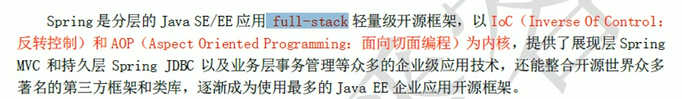
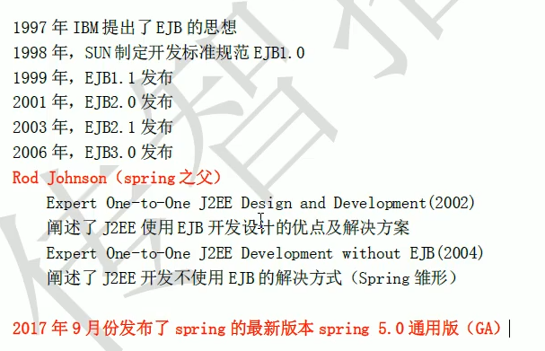
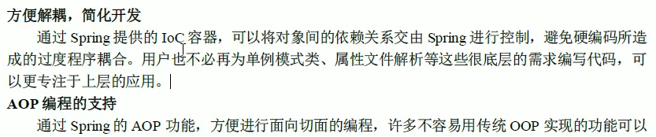
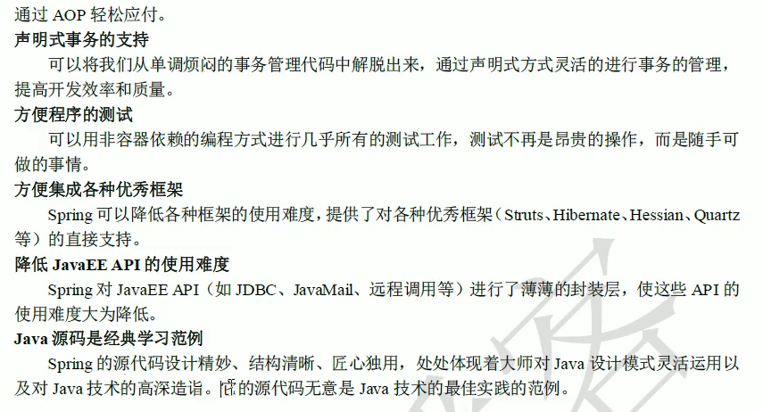

# 01.spring框架简介

- 笔记本：16.Spring
- 创建时间：2020-03-21 02:51:57 UTC
- 更新时间：2020-03-21 08:45:02 UTC
- 印象笔记 GUID：a62441c0-97e6-4474-86e9-f9d9c7d1c2d3

1. spring 的概述

-
spring是什么
 

-
spring的两大核心

-
spring的发展历程和优势
 
 
 

-
spring的体系结构

1.
程序的耦合和解耦
 曾经案例中问题
 工厂模式解耦

1.
IOC概念和spring中的IOC
 spring中基于XML的IOC环境搭建

1.
依赖注入（Dependency Injection）

1.%20spring%20%E7%9A%84%E6%A6%82%E8%BF%B0%0A*%20spring%E6%98%AF%E4%BB%80%E4%B9%88%0A!%5B28f1a349765c203c03fb0c121a3361e7.png%5D(en-resource%3A%2F%2Fdatabase%2F3262%3A0)%0A*%20spring%E7%9A%84%E4%B8%A4%E5%A4%A7%E6%A0%B8%E5%BF%83%0A*%20spring%E7%9A%84%E5%8F%91%E5%B1%95%E5%8E%86%E7%A8%8B%E5%92%8C%E4%BC%98%E5%8A%BF%0A!%5B68882b79c11844dfeb6b3133c0d02ade.png%5D(en-resource%3A%2F%2Fdatabase%2F3264%3A0)%0A!%5Bfe6f7bb36950e7c257c096d2e2e1167a.png%5D(en-resource%3A%2F%2Fdatabase%2F3266%3A0)%0A!%5B98342e4996182b42fe1197b6436b9fd5.png%5D(en-resource%3A%2F%2Fdatabase%2F3268%3A0)%0A%0A*%20spring%E7%9A%84%E4%BD%93%E7%B3%BB%E7%BB%93%E6%9E%84%0A!%5B570a23fa5debd9100a244e95afad52cb.png%5D(en-resource%3A%2F%2Fdatabase%2F3270%3A0)%0A%0A%0A2.%20%E7%A8%8B%E5%BA%8F%E7%9A%84%E8%80%A6%E5%90%88%E5%92%8C%E8%A7%A3%E8%80%A6%0A%E6%9B%BE%E7%BB%8F%E6%A1%88%E4%BE%8B%E4%B8%AD%E9%97%AE%E9%A2%98%0A%E5%B7%A5%E5%8E%82%E6%A8%A1%E5%BC%8F%E8%A7%A3%E8%80%A6%0A%0A3.%20IOC%E6%A6%82%E5%BF%B5%E5%92%8Cspring%E4%B8%AD%E7%9A%84IOC%0Aspring%E4%B8%AD%E5%9F%BA%E4%BA%8EXML%E7%9A%84IOC%E7%8E%AF%E5%A2%83%E6%90%AD%E5%BB%BA%0A%0A4.%20%E4%BE%9D%E8%B5%96%E6%B3%A8%E5%85%A5%EF%BC%88Dependency%20Injection%EF%BC%89
