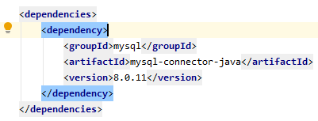
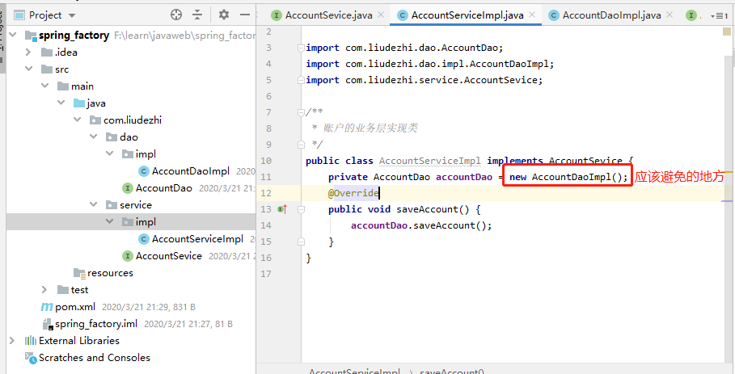
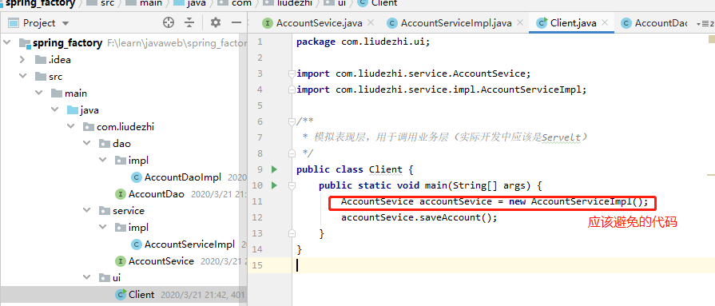
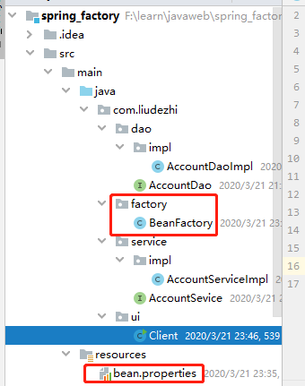
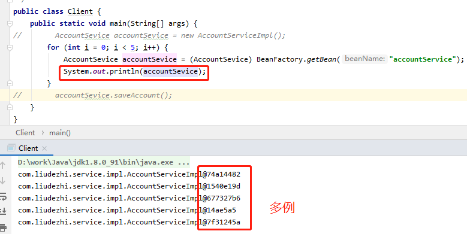

# 02.程序间耦合

- 笔记本：16.Spring
- 创建时间：2020-03-21 13:04:02 UTC
- 更新时间：2020-03-21 16:05:07 UTC
- 印象笔记 GUID：6cfc02c1-c216-43ba-afa1-c25455aad20e

#### 耦合：程序间的依赖关系

##### 包括：

- 类之间的依赖

- 方法间的依赖

##### 解耦：降低程序间的依赖关系

- 实际开发中：
 应该做到：编译期不依赖，运行时才依赖。

- 解耦的思路：
 第一步：使用反射来创建对象，而避免使用new 关键字。
 第二步：通过读取配置文件来获取要创建的对象全限定类名。

**eg：**
 新建maven项目，pom.xml中导入mysql
 

```
create table account (
    id int primary key auto_increment,
    name varchar(40),
    money float
)character set utf8 collate utf8_general_ci;
insert into account(name, value) values('aaa', 1000);
insert into account(name, value) values('bbb', 2000);
insert into account(name, value) values('ccc', 3000);

```

```
/**
 * 程序的耦合
 *  耦合：程序间的依赖关系
 *      包括：
 *          类之间的依赖
 *          方法间的依赖
 *  解耦：
 *      降低程序间的依赖关系
 *  实际开发中：
 *      应该做到：编译期不依赖，运行时才依赖。
 *  解耦的思路：
 *      第一步：使用反射来创建对象，而避免使用new 关键字。
 *      第二步：通过读取配置文件来获取要创建的对象全限定类名。
 */
public class JdbcDemo1 {
    public static void main(String[] args) throws SQLException, ClassNotFoundException {
        //1. 注册驱动
//        DriverManager.registerDriver(new com.mysql.cj.jdbc.Driver());
        Class.forName("com.mysql.cj.jdbc.Driver");
        //2. 获取连接
        Connection conn = DriverManager.getConnection("jdbc:mysql://localhost:3306/learn_spring?useUnicode=true&characterEncoding=utf-8&useSSL=false&serverTimezone=GMT", "root", "Liudezhi");
        //3. 获取操作数据库的预处理对象
        PreparedStatement ps = conn.prepareStatement("select * from account");
        //4. 执行SQL，得到结果集
        ResultSet rs = ps.executeQuery();
        //5. 遍历结果集
        while (rs.next()) {
            System.out.println("name: " + rs.getString("name") + ", money: " + rs.getString("money"));
        }
        //6. 释放资源
        rs.close();
        ps.close();
        conn.close();
    }
}

```

如果把mysql的依赖删除掉，再运行。

- `DriverManager.registerDriver(new com.mysql.cj.jdbc.Driver());`使用会报错：程序包com.mysql.jdbc不存在
 Compilation complated with 1 error and 0 warnings in 2s... **编译时异常**。

- `Class.forName("com.mysql.cj.jdbc.Driver");` 会抛出异常，**运行时异常**。

#### 以往代码中的问题：


 
 具有很强的耦合性，使得代码的独立性很差。

#### 编写工厂类和配置文件



```
package com.liudezhi.factory;
/**
 * 一个创建Bean 对象的工厂
 *  它就是创建我们的service 和dao 对象的。
 *  1. 需要一个配置文件来配置我们的service 和dao
 *      配置的内容：唯一标识=全限定类名（key=value）
 *  2. 通过读取配置i文件中配置的内容，反射创建对象。
 *  我们的配置文件，可以是xml也可以是properties
 *
 * Bean：再计算机英语中，有可重用组件的含义
 * JavaBean：用java 语言编写的可重用组件。
 *  JavaBean > 实体类
 */
public class BeanFactory {
    //定义一个Properties对象
    private static Properties props;

    //使用静态代码块为Properties对象赋值
    static {
        try {
            //实例化对象
            props = new Properties();
            //获取properties文件的流对象
            InputStream in = BeanFactory.class.getClassLoader().getResourceAsStream("bean.properties");
            props.load(in);
        } catch (IOException e) {
            throw new ExceptionInInitializerError("初始化properties失败！");
        }
    }

    /**
     * 根据bean的名称获取bean对象
     * @param beanName
     * @return
     */
    public static Object getBean(String beanName) {
        Object bean = null;
        try {
            String beanPath = props.getProperty(beanName);
            bean = Class.forName(beanPath).newInstance();
        } catch (Exception e) {
            e.printStackTrace();
        }
        return bean;
    }
}

```

```
/**
 * 账户的业务层实现类
 */
public class AccountServiceImpl implements AccountSevice {
//    private AccountDao accountDao = new AccountDaoImpl();
    private AccountDao accountDao = (AccountDao) BeanFactory.getBean("accountDao");
    @Override
    public void saveAccount() {
        accountDao.saveAccount();
    }
}

```

```
/**
 * 模拟表现层，用于调用业务层（实际开发中应该是Servelt）
 */
public class Client {
    public static void main(String[] args) {
//        AccountSevice accountSevice = new AccountServiceImpl();
        AccountSevice accountSevice = (AccountSevice) BeanFactory.getBean("accountService");
        accountSevice.saveAccount();
    }
}

```

此时，例如删除AccountDao，编译是不回报错的，只会出现运行时异常。

#### 工厂模式中的问题及改造



**修改：**

```
package com.liudezhi.factory;

public class BeanFactory {
    //定义一个Properties对象
    private static Properties props;
    //定义一个Map，用于存放我们要创建的对象。我们把它称之为容器
    private static Map<String, Object> beans;

    //使用静态代码块为Properties对象赋值
    static {
        try {
            //实例化对象
            props = new Properties();
            //获取properties文件的流对象
            InputStream in = BeanFactory.class.getClassLoader().getResourceAsStream("bean.properties");
            props.load(in);
            //实例化容器
            beans = new HashMap<String, Object>();
            //去出配置文件中所有的key
            Enumeration keys = props.keys();
            //遍历枚举
            while (keys.hasMoreElements()) {
                //取出每个key
                String key = keys.nextElement().toString();
                //根据key获取value
                String beanPath = props.getProperty(key);
                //反射创建对象
                Object value = Class.forName(beanPath).newInstance();
                beans.put(key, value);
            }
        } catch (Exception e) {
            throw new ExceptionInInitializerError("初始化properties失败！");
        }
    }

    /**
     * 根据bean的名称获取bean对象
     * @param beanName
     * @return
     */
    public static Object getBean(String beanName) {
        return beans.get(beanName);
    }
}

```

单例模式，尽量不要创建类成员，否则一个人修改后，其他人看到的都是修改后的。可以把成员定义在方法中。

%23%23%23%23%20%E8%80%A6%E5%90%88%EF%BC%9A%E7%A8%8B%E5%BA%8F%E9%97%B4%E7%9A%84%E4%BE%9D%E8%B5%96%E5%85%B3%E7%B3%BB%0A%23%23%23%23%23%20%E5%8C%85%E6%8B%AC%EF%BC%9A%0A*%20%E7%B1%BB%E4%B9%8B%E9%97%B4%E7%9A%84%E4%BE%9D%E8%B5%96%0A*%20%E6%96%B9%E6%B3%95%E9%97%B4%E7%9A%84%E4%BE%9D%E8%B5%96%0A%23%23%23%23%23%20%E8%A7%A3%E8%80%A6%EF%BC%9A%E9%99%8D%E4%BD%8E%E7%A8%8B%E5%BA%8F%E9%97%B4%E7%9A%84%E4%BE%9D%E8%B5%96%E5%85%B3%E7%B3%BB%0A*%20%E5%AE%9E%E9%99%85%E5%BC%80%E5%8F%91%E4%B8%AD%EF%BC%9A%0A%20%20%20%20%E5%BA%94%E8%AF%A5%E5%81%9A%E5%88%B0%EF%BC%9A%E7%BC%96%E8%AF%91%E6%9C%9F%E4%B8%8D%E4%BE%9D%E8%B5%96%EF%BC%8C%E8%BF%90%E8%A1%8C%E6%97%B6%E6%89%8D%E4%BE%9D%E8%B5%96%E3%80%82%0A*%20%E8%A7%A3%E8%80%A6%E7%9A%84%E6%80%9D%E8%B7%AF%EF%BC%9A%0A%20%20%20%20%E7%AC%AC%E4%B8%80%E6%AD%A5%EF%BC%9A%E4%BD%BF%E7%94%A8%E5%8F%8D%E5%B0%84%E6%9D%A5%E5%88%9B%E5%BB%BA%E5%AF%B9%E8%B1%A1%EF%BC%8C%E8%80%8C%E9%81%BF%E5%85%8D%E4%BD%BF%E7%94%A8new%20%E5%85%B3%E9%94%AE%E5%AD%97%E3%80%82%0A%20%20%20%20%E7%AC%AC%E4%BA%8C%E6%AD%A5%EF%BC%9A%E9%80%9A%E8%BF%87%E8%AF%BB%E5%8F%96%E9%85%8D%E7%BD%AE%E6%96%87%E4%BB%B6%E6%9D%A5%E8%8E%B7%E5%8F%96%E8%A6%81%E5%88%9B%E5%BB%BA%E7%9A%84%E5%AF%B9%E8%B1%A1%E5%85%A8%E9%99%90%E5%AE%9A%E7%B1%BB%E5%90%8D%E3%80%82%0A%20%20%20%20%0A**eg%EF%BC%9A**%0A%E6%96%B0%E5%BB%BAmaven%E9%A1%B9%E7%9B%AE%EF%BC%8Cpom.xml%E4%B8%AD%E5%AF%BC%E5%85%A5mysql%0A!%5Bcb874692c441071005473423e3882235.png%5D(en-resource%3A%2F%2Fdatabase%2F3274%3A0)%0A%0A%60%60%60sql%0Acreate%20table%20account%20(%0A%20%20%20%20id%20int%20primary%20key%20auto_increment%2C%0A%20%20%20%20name%20varchar(40)%2C%0A%20%20%20%20money%20float%0A)character%20set%20utf8%20collate%20utf8_general_ci%3B%0Ainsert%20into%20account(name%2C%20value)%20values('aaa'%2C%201000)%3B%0Ainsert%20into%20account(name%2C%20value)%20values('bbb'%2C%202000)%3B%0Ainsert%20into%20account(name%2C%20value)%20values('ccc'%2C%203000)%3B%0A%60%60%60%0A%0A%60%60%60java%0A%2F**%0A%20*%20%E7%A8%8B%E5%BA%8F%E7%9A%84%E8%80%A6%E5%90%88%0A%20*%20%20%E8%80%A6%E5%90%88%EF%BC%9A%E7%A8%8B%E5%BA%8F%E9%97%B4%E7%9A%84%E4%BE%9D%E8%B5%96%E5%85%B3%E7%B3%BB%0A%20*%20%20%20%20%20%20%E5%8C%85%E6%8B%AC%EF%BC%9A%0A%20*%20%20%20%20%20%20%20%20%20%20%E7%B1%BB%E4%B9%8B%E9%97%B4%E7%9A%84%E4%BE%9D%E8%B5%96%0A%20*%20%20%20%20%20%20%20%20%20%20%E6%96%B9%E6%B3%95%E9%97%B4%E7%9A%84%E4%BE%9D%E8%B5%96%0A%20*%20%20%E8%A7%A3%E8%80%A6%EF%BC%9A%0A%20*%20%20%20%20%20%20%E9%99%8D%E4%BD%8E%E7%A8%8B%E5%BA%8F%E9%97%B4%E7%9A%84%E4%BE%9D%E8%B5%96%E5%85%B3%E7%B3%BB%0A%20*%20%20%E5%AE%9E%E9%99%85%E5%BC%80%E5%8F%91%E4%B8%AD%EF%BC%9A%0A%20*%20%20%20%20%20%20%E5%BA%94%E8%AF%A5%E5%81%9A%E5%88%B0%EF%BC%9A%E7%BC%96%E8%AF%91%E6%9C%9F%E4%B8%8D%E4%BE%9D%E8%B5%96%EF%BC%8C%E8%BF%90%E8%A1%8C%E6%97%B6%E6%89%8D%E4%BE%9D%E8%B5%96%E3%80%82%0A%20*%20%20%E8%A7%A3%E8%80%A6%E7%9A%84%E6%80%9D%E8%B7%AF%EF%BC%9A%0A%20*%20%20%20%20%20%20%E7%AC%AC%E4%B8%80%E6%AD%A5%EF%BC%9A%E4%BD%BF%E7%94%A8%E5%8F%8D%E5%B0%84%E6%9D%A5%E5%88%9B%E5%BB%BA%E5%AF%B9%E8%B1%A1%EF%BC%8C%E8%80%8C%E9%81%BF%E5%85%8D%E4%BD%BF%E7%94%A8new%20%E5%85%B3%E9%94%AE%E5%AD%97%E3%80%82%0A%20*%20%20%20%20%20%20%E7%AC%AC%E4%BA%8C%E6%AD%A5%EF%BC%9A%E9%80%9A%E8%BF%87%E8%AF%BB%E5%8F%96%E9%85%8D%E7%BD%AE%E6%96%87%E4%BB%B6%E6%9D%A5%E8%8E%B7%E5%8F%96%E8%A6%81%E5%88%9B%E5%BB%BA%E7%9A%84%E5%AF%B9%E8%B1%A1%E5%85%A8%E9%99%90%E5%AE%9A%E7%B1%BB%E5%90%8D%E3%80%82%0A%20*%2F%0Apublic%20class%20JdbcDemo1%20%7B%0A%20%20%20%20public%20static%20void%20main(String%5B%5D%20args)%20throws%20SQLException%2C%20ClassNotFoundException%20%7B%0A%20%20%20%20%20%20%20%20%2F%2F1.%20%E6%B3%A8%E5%86%8C%E9%A9%B1%E5%8A%A8%0A%2F%2F%20%20%20%20%20%20%20%20DriverManager.registerDriver(new%20com.mysql.cj.jdbc.Driver())%3B%0A%20%20%20%20%20%20%20%20Class.forName(%22com.mysql.cj.jdbc.Driver%22)%3B%0A%20%20%20%20%20%20%20%20%2F%2F2.%20%E8%8E%B7%E5%8F%96%E8%BF%9E%E6%8E%A5%0A%20%20%20%20%20%20%20%20Connection%20conn%20%3D%20DriverManager.getConnection(%22jdbc%3Amysql%3A%2F%2Flocalhost%3A3306%2Flearn_spring%3FuseUnicode%3Dtrue%26characterEncoding%3Dutf-8%26useSSL%3Dfalse%26serverTimezone%3DGMT%22%2C%20%22root%22%2C%20%22Liudezhi%22)%3B%0A%20%20%20%20%20%20%20%20%2F%2F3.%20%E8%8E%B7%E5%8F%96%E6%93%8D%E4%BD%9C%E6%95%B0%E6%8D%AE%E5%BA%93%E7%9A%84%E9%A2%84%E5%A4%84%E7%90%86%E5%AF%B9%E8%B1%A1%0A%20%20%20%20%20%20%20%20PreparedStatement%20ps%20%3D%20conn.prepareStatement(%22select%20*%20from%20account%22)%3B%0A%20%20%20%20%20%20%20%20%2F%2F4.%20%E6%89%A7%E8%A1%8CSQL%EF%BC%8C%E5%BE%97%E5%88%B0%E7%BB%93%E6%9E%9C%E9%9B%86%0A%20%20%20%20%20%20%20%20ResultSet%20rs%20%3D%20ps.executeQuery()%3B%0A%20%20%20%20%20%20%20%20%2F%2F5.%20%E9%81%8D%E5%8E%86%E7%BB%93%E6%9E%9C%E9%9B%86%0A%20%20%20%20%20%20%20%20while%20(rs.next())%20%7B%0A%20%20%20%20%20%20%20%20%20%20%20%20System.out.println(%22name%3A%20%22%20%2B%20rs.getString(%22name%22)%20%2B%20%22%2C%20money%3A%20%22%20%2B%20rs.getString(%22money%22))%3B%0A%20%20%20%20%20%20%20%20%7D%0A%20%20%20%20%20%20%20%20%2F%2F6.%20%E9%87%8A%E6%94%BE%E8%B5%84%E6%BA%90%0A%20%20%20%20%20%20%20%20rs.close()%3B%0A%20%20%20%20%20%20%20%20ps.close()%3B%0A%20%20%20%20%20%20%20%20conn.close()%3B%0A%20%20%20%20%7D%0A%7D%0A%60%60%60%0A%0A%E5%A6%82%E6%9E%9C%E6%8A%8Amysql%E7%9A%84%E4%BE%9D%E8%B5%96%E5%88%A0%E9%99%A4%E6%8E%89%EF%BC%8C%E5%86%8D%E8%BF%90%E8%A1%8C%E3%80%82%0A*%20%60DriverManager.registerDriver(new%20com.mysql.cj.jdbc.Driver())%3B%60%E4%BD%BF%E7%94%A8%E4%BC%9A%E6%8A%A5%E9%94%99%EF%BC%9A%E7%A8%8B%E5%BA%8F%E5%8C%85com.mysql.jdbc%E4%B8%8D%E5%AD%98%E5%9C%A8%0ACompilation%20complated%20with%201%20error%20and%200%20warnings%20in%202s...%20**%E7%BC%96%E8%AF%91%E6%97%B6%E5%BC%82%E5%B8%B8**%E3%80%82%0A*%20%60Class.forName(%22com.mysql.cj.jdbc.Driver%22)%3B%60%20%E4%BC%9A%E6%8A%9B%E5%87%BA%E5%BC%82%E5%B8%B8%EF%BC%8C**%E8%BF%90%E8%A1%8C%E6%97%B6%E5%BC%82%E5%B8%B8**%E3%80%82%0A%0A%23%23%23%23%20%E4%BB%A5%E5%BE%80%E4%BB%A3%E7%A0%81%E4%B8%AD%E7%9A%84%E9%97%AE%E9%A2%98%EF%BC%9A%0A!%5Bec893431aa9cc0a56e9ae787da6a78de.png%5D(en-resource%3A%2F%2Fdatabase%2F3276%3A0)%0A!%5B98115b612b98cb43b57fcf7a21c320fd.png%5D(en-resource%3A%2F%2Fdatabase%2F3278%3A0)%0A%E5%85%B7%E6%9C%89%E5%BE%88%E5%BC%BA%E7%9A%84%E8%80%A6%E5%90%88%E6%80%A7%EF%BC%8C%E4%BD%BF%E5%BE%97%E4%BB%A3%E7%A0%81%E7%9A%84%E7%8B%AC%E7%AB%8B%E6%80%A7%E5%BE%88%E5%B7%AE%E3%80%82%0A%0A%23%23%23%23%20%E7%BC%96%E5%86%99%E5%B7%A5%E5%8E%82%E7%B1%BB%E5%92%8C%E9%85%8D%E7%BD%AE%E6%96%87%E4%BB%B6%0A!%5B92ca70694f9738ae7fdb1c0a5421ea5f.png%5D(en-resource%3A%2F%2Fdatabase%2F3280%3A0)%0A%60%60%60java%0Apackage%20com.liudezhi.factory%3B%0A%2F**%0A%20*%20%E4%B8%80%E4%B8%AA%E5%88%9B%E5%BB%BABean%20%E5%AF%B9%E8%B1%A1%E7%9A%84%E5%B7%A5%E5%8E%82%0A%20*%20%20%E5%AE%83%E5%B0%B1%E6%98%AF%E5%88%9B%E5%BB%BA%E6%88%91%E4%BB%AC%E7%9A%84service%20%E5%92%8Cdao%20%E5%AF%B9%E8%B1%A1%E7%9A%84%E3%80%82%0A%20*%20%201.%20%E9%9C%80%E8%A6%81%E4%B8%80%E4%B8%AA%E9%85%8D%E7%BD%AE%E6%96%87%E4%BB%B6%E6%9D%A5%E9%85%8D%E7%BD%AE%E6%88%91%E4%BB%AC%E7%9A%84service%20%E5%92%8Cdao%0A%20*%20%20%20%20%20%20%E9%85%8D%E7%BD%AE%E7%9A%84%E5%86%85%E5%AE%B9%EF%BC%9A%E5%94%AF%E4%B8%80%E6%A0%87%E8%AF%86%3D%E5%85%A8%E9%99%90%E5%AE%9A%E7%B1%BB%E5%90%8D%EF%BC%88key%3Dvalue%EF%BC%89%0A%20*%20%202.%20%E9%80%9A%E8%BF%87%E8%AF%BB%E5%8F%96%E9%85%8D%E7%BD%AEi%E6%96%87%E4%BB%B6%E4%B8%AD%E9%85%8D%E7%BD%AE%E7%9A%84%E5%86%85%E5%AE%B9%EF%BC%8C%E5%8F%8D%E5%B0%84%E5%88%9B%E5%BB%BA%E5%AF%B9%E8%B1%A1%E3%80%82%0A%20*%20%20%E6%88%91%E4%BB%AC%E7%9A%84%E9%85%8D%E7%BD%AE%E6%96%87%E4%BB%B6%EF%BC%8C%E5%8F%AF%E4%BB%A5%E6%98%AFxml%E4%B9%9F%E5%8F%AF%E4%BB%A5%E6%98%AFproperties%0A%20*%0A%20*%20Bean%EF%BC%9A%E5%86%8D%E8%AE%A1%E7%AE%97%E6%9C%BA%E8%8B%B1%E8%AF%AD%E4%B8%AD%EF%BC%8C%E6%9C%89%E5%8F%AF%E9%87%8D%E7%94%A8%E7%BB%84%E4%BB%B6%E7%9A%84%E5%90%AB%E4%B9%89%0A%20*%20JavaBean%EF%BC%9A%E7%94%A8java%20%E8%AF%AD%E8%A8%80%E7%BC%96%E5%86%99%E7%9A%84%E5%8F%AF%E9%87%8D%E7%94%A8%E7%BB%84%E4%BB%B6%E3%80%82%0A%20*%20%20JavaBean%20%3E%20%E5%AE%9E%E4%BD%93%E7%B1%BB%0A%20*%2F%0Apublic%20class%20BeanFactory%20%7B%0A%20%20%20%20%2F%2F%E5%AE%9A%E4%B9%89%E4%B8%80%E4%B8%AAProperties%E5%AF%B9%E8%B1%A1%0A%20%20%20%20private%20static%20Properties%20props%3B%0A%0A%20%20%20%20%2F%2F%E4%BD%BF%E7%94%A8%E9%9D%99%E6%80%81%E4%BB%A3%E7%A0%81%E5%9D%97%E4%B8%BAProperties%E5%AF%B9%E8%B1%A1%E8%B5%8B%E5%80%BC%0A%20%20%20%20static%20%7B%0A%20%20%20%20%20%20%20%20try%20%7B%0A%20%20%20%20%20%20%20%20%20%20%20%20%2F%2F%E5%AE%9E%E4%BE%8B%E5%8C%96%E5%AF%B9%E8%B1%A1%0A%20%20%20%20%20%20%20%20%20%20%20%20props%20%3D%20new%20Properties()%3B%0A%20%20%20%20%20%20%20%20%20%20%20%20%2F%2F%E8%8E%B7%E5%8F%96properties%E6%96%87%E4%BB%B6%E7%9A%84%E6%B5%81%E5%AF%B9%E8%B1%A1%0A%20%20%20%20%20%20%20%20%20%20%20%20InputStream%20in%20%3D%20BeanFactory.class.getClassLoader().getResourceAsStream(%22bean.properties%22)%3B%0A%20%20%20%20%20%20%20%20%20%20%20%20props.load(in)%3B%0A%20%20%20%20%20%20%20%20%7D%20catch%20(IOException%20e)%20%7B%0A%20%20%20%20%20%20%20%20%20%20%20%20throw%20new%20ExceptionInInitializerError(%22%E5%88%9D%E5%A7%8B%E5%8C%96properties%E5%A4%B1%E8%B4%A5%EF%BC%81%22)%3B%0A%20%20%20%20%20%20%20%20%7D%0A%20%20%20%20%7D%0A%0A%20%20%20%20%2F**%0A%20%20%20%20%20*%20%E6%A0%B9%E6%8D%AEbean%E7%9A%84%E5%90%8D%E7%A7%B0%E8%8E%B7%E5%8F%96bean%E5%AF%B9%E8%B1%A1%0A%20%20%20%20%20*%20%40param%20beanName%0A%20%20%20%20%20*%20%40return%0A%20%20%20%20%20*%2F%0A%20%20%20%20public%20static%20Object%20getBean(String%20beanName)%20%7B%0A%20%20%20%20%20%20%20%20Object%20bean%20%3D%20null%3B%0A%20%20%20%20%20%20%20%20try%20%7B%0A%20%20%20%20%20%20%20%20%20%20%20%20String%20beanPath%20%3D%20props.getProperty(beanName)%3B%0A%20%20%20%20%20%20%20%20%20%20%20%20bean%20%3D%20Class.forName(beanPath).newInstance()%3B%0A%20%20%20%20%20%20%20%20%7D%20catch%20(Exception%20e)%20%7B%0A%20%20%20%20%20%20%20%20%20%20%20%20e.printStackTrace()%3B%0A%20%20%20%20%20%20%20%20%7D%0A%20%20%20%20%20%20%20%20return%20bean%3B%0A%20%20%20%20%7D%0A%7D%0A%60%60%60%0A%0A%60%60%60java%0A%2F**%0A%20*%20%E8%B4%A6%E6%88%B7%E7%9A%84%E4%B8%9A%E5%8A%A1%E5%B1%82%E5%AE%9E%E7%8E%B0%E7%B1%BB%0A%20*%2F%0Apublic%20class%20AccountServiceImpl%20implements%20AccountSevice%20%7B%0A%2F%2F%20%20%20%20private%20AccountDao%20accountDao%20%3D%20new%20AccountDaoImpl()%3B%0A%20%20%20%20private%20AccountDao%20accountDao%20%3D%20(AccountDao)%20BeanFactory.getBean(%22accountDao%22)%3B%0A%20%20%20%20%40Override%0A%20%20%20%20public%20void%20saveAccount()%20%7B%0A%20%20%20%20%20%20%20%20accountDao.saveAccount()%3B%0A%20%20%20%20%7D%0A%7D%0A%60%60%60%0A%0A%60%60%60java%0A%2F**%0A%20*%20%E6%A8%A1%E6%8B%9F%E8%A1%A8%E7%8E%B0%E5%B1%82%EF%BC%8C%E7%94%A8%E4%BA%8E%E8%B0%83%E7%94%A8%E4%B8%9A%E5%8A%A1%E5%B1%82%EF%BC%88%E5%AE%9E%E9%99%85%E5%BC%80%E5%8F%91%E4%B8%AD%E5%BA%94%E8%AF%A5%E6%98%AFServelt%EF%BC%89%0A%20*%2F%0Apublic%20class%20Client%20%7B%0A%20%20%20%20public%20static%20void%20main(String%5B%5D%20args)%20%7B%0A%2F%2F%20%20%20%20%20%20%20%20AccountSevice%20accountSevice%20%3D%20new%20AccountServiceImpl()%3B%0A%20%20%20%20%20%20%20%20AccountSevice%20accountSevice%20%3D%20(AccountSevice)%20BeanFactory.getBean(%22accountService%22)%3B%0A%20%20%20%20%20%20%20%20accountSevice.saveAccount()%3B%0A%20%20%20%20%7D%0A%7D%0A%60%60%60%0A%0A%E6%AD%A4%E6%97%B6%EF%BC%8C%E4%BE%8B%E5%A6%82%E5%88%A0%E9%99%A4AccountDao%EF%BC%8C%E7%BC%96%E8%AF%91%E6%98%AF%E4%B8%8D%E5%9B%9E%E6%8A%A5%E9%94%99%E7%9A%84%EF%BC%8C%E5%8F%AA%E4%BC%9A%E5%87%BA%E7%8E%B0%E8%BF%90%E8%A1%8C%E6%97%B6%E5%BC%82%E5%B8%B8%E3%80%82%0A%0A%23%23%23%23%20%E5%B7%A5%E5%8E%82%E6%A8%A1%E5%BC%8F%E4%B8%AD%E7%9A%84%E9%97%AE%E9%A2%98%E5%8F%8A%E6%94%B9%E9%80%A0%0A!%5Bb0253fe5315358ee79f9186c93523c9a.png%5D(en-resource%3A%2F%2Fdatabase%2F3282%3A0)%0A%0A**%E4%BF%AE%E6%94%B9%EF%BC%9A**%0A%60%60%60java%0Apackage%20com.liudezhi.factory%3B%0A%0Apublic%20class%20BeanFactory%20%7B%0A%20%20%20%20%2F%2F%E5%AE%9A%E4%B9%89%E4%B8%80%E4%B8%AAProperties%E5%AF%B9%E8%B1%A1%0A%20%20%20%20private%20static%20Properties%20props%3B%0A%20%20%20%20%2F%2F%E5%AE%9A%E4%B9%89%E4%B8%80%E4%B8%AAMap%EF%BC%8C%E7%94%A8%E4%BA%8E%E5%AD%98%E6%94%BE%E6%88%91%E4%BB%AC%E8%A6%81%E5%88%9B%E5%BB%BA%E7%9A%84%E5%AF%B9%E8%B1%A1%E3%80%82%E6%88%91%E4%BB%AC%E6%8A%8A%E5%AE%83%E7%A7%B0%E4%B9%8B%E4%B8%BA%E5%AE%B9%E5%99%A8%0A%20%20%20%20private%20static%20Map%3CString%2C%20Object%3E%20beans%3B%0A%0A%20%20%20%20%2F%2F%E4%BD%BF%E7%94%A8%E9%9D%99%E6%80%81%E4%BB%A3%E7%A0%81%E5%9D%97%E4%B8%BAProperties%E5%AF%B9%E8%B1%A1%E8%B5%8B%E5%80%BC%0A%20%20%20%20static%20%7B%0A%20%20%20%20%20%20%20%20try%20%7B%0A%20%20%20%20%20%20%20%20%20%20%20%20%2F%2F%E5%AE%9E%E4%BE%8B%E5%8C%96%E5%AF%B9%E8%B1%A1%0A%20%20%20%20%20%20%20%20%20%20%20%20props%20%3D%20new%20Properties()%3B%0A%20%20%20%20%20%20%20%20%20%20%20%20%2F%2F%E8%8E%B7%E5%8F%96properties%E6%96%87%E4%BB%B6%E7%9A%84%E6%B5%81%E5%AF%B9%E8%B1%A1%0A%20%20%20%20%20%20%20%20%20%20%20%20InputStream%20in%20%3D%20BeanFactory.class.getClassLoader().getResourceAsStream(%22bean.properties%22)%3B%0A%20%20%20%20%20%20%20%20%20%20%20%20props.load(in)%3B%0A%20%20%20%20%20%20%20%20%20%20%20%20%2F%2F%E5%AE%9E%E4%BE%8B%E5%8C%96%E5%AE%B9%E5%99%A8%0A%20%20%20%20%20%20%20%20%20%20%20%20beans%20%3D%20new%20HashMap%3CString%2C%20Object%3E()%3B%0A%20%20%20%20%20%20%20%20%20%20%20%20%2F%2F%E5%8E%BB%E5%87%BA%E9%85%8D%E7%BD%AE%E6%96%87%E4%BB%B6%E4%B8%AD%E6%89%80%E6%9C%89%E7%9A%84key%0A%20%20%20%20%20%20%20%20%20%20%20%20Enumeration%20keys%20%3D%20props.keys()%3B%0A%20%20%20%20%20%20%20%20%20%20%20%20%2F%2F%E9%81%8D%E5%8E%86%E6%9E%9A%E4%B8%BE%0A%20%20%20%20%20%20%20%20%20%20%20%20while%20(keys.hasMoreElements())%20%7B%0A%20%20%20%20%20%20%20%20%20%20%20%20%20%20%20%20%2F%2F%E5%8F%96%E5%87%BA%E6%AF%8F%E4%B8%AAkey%0A%20%20%20%20%20%20%20%20%20%20%20%20%20%20%20%20String%20key%20%3D%20keys.nextElement().toString()%3B%0A%20%20%20%20%20%20%20%20%20%20%20%20%20%20%20%20%2F%2F%E6%A0%B9%E6%8D%AEkey%E8%8E%B7%E5%8F%96value%0A%20%20%20%20%20%20%20%20%20%20%20%20%20%20%20%20String%20beanPath%20%3D%20props.getProperty(key)%3B%0A%20%20%20%20%20%20%20%20%20%20%20%20%20%20%20%20%2F%2F%E5%8F%8D%E5%B0%84%E5%88%9B%E5%BB%BA%E5%AF%B9%E8%B1%A1%0A%20%20%20%20%20%20%20%20%20%20%20%20%20%20%20%20Object%20value%20%3D%20Class.forName(beanPath).newInstance()%3B%0A%20%20%20%20%20%20%20%20%20%20%20%20%20%20%20%20beans.put(key%2C%20value)%3B%0A%20%20%20%20%20%20%20%20%20%20%20%20%7D%0A%20%20%20%20%20%20%20%20%7D%20catch%20(Exception%20e)%20%7B%0A%20%20%20%20%20%20%20%20%20%20%20%20throw%20new%20ExceptionInInitializerError(%22%E5%88%9D%E5%A7%8B%E5%8C%96properties%E5%A4%B1%E8%B4%A5%EF%BC%81%22)%3B%0A%20%20%20%20%20%20%20%20%7D%0A%20%20%20%20%7D%0A%0A%20%20%20%20%2F**%0A%20%20%20%20%20*%20%E6%A0%B9%E6%8D%AEbean%E7%9A%84%E5%90%8D%E7%A7%B0%E8%8E%B7%E5%8F%96bean%E5%AF%B9%E8%B1%A1%0A%20%20%20%20%20*%20%40param%20beanName%0A%20%20%20%20%20*%20%40return%0A%20%20%20%20%20*%2F%0A%20%20%20%20public%20static%20Object%20getBean(String%20beanName)%20%7B%0A%20%20%20%20%20%20%20%20return%20beans.get(beanName)%3B%0A%20%20%20%20%7D%0A%7D%0A%60%60%60%0A!%5B7e2144242f361d64536ee5f3f5a9894f.png%5D(en-resource%3A%2F%2Fdatabase%2F3284%3A0)%0A%0A%0A%E5%8D%95%E4%BE%8B%E6%A8%A1%E5%BC%8F%EF%BC%8C%E5%B0%BD%E9%87%8F%E4%B8%8D%E8%A6%81%E5%88%9B%E5%BB%BA%E7%B1%BB%E6%88%90%E5%91%98%EF%BC%8C%E5%90%A6%E5%88%99%E4%B8%80%E4%B8%AA%E4%BA%BA%E4%BF%AE%E6%94%B9%E5%90%8E%EF%BC%8C%E5%85%B6%E4%BB%96%E4%BA%BA%E7%9C%8B%E5%88%B0%E7%9A%84%E9%83%BD%E6%98%AF%E4%BF%AE%E6%94%B9%E5%90%8E%E7%9A%84%E3%80%82%E5%8F%AF%E4%BB%A5%E6%8A%8A%E6%88%90%E5%91%98%E5%AE%9A%E4%B9%89%E5%9C%A8%E6%96%B9%E6%B3%95%E4%B8%AD%E3%80%82
