# 03.Spring的IOC和DI

- 笔记本：16.Spring
- 创建时间：2020-03-21 16:08:21 UTC
- 更新时间：2020-03-22 10:31:56 UTC
- 印象笔记 GUID：2acc150a-3299-4f4e-b29d-900f52815cd0

### IOC（控制反转）

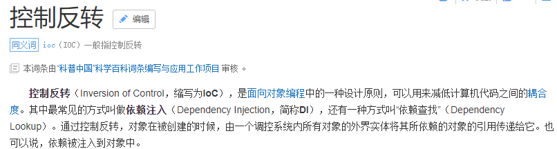

- IOC 的作用：削减计算机程序的耦合（解除我们代码中的依赖关系）。
 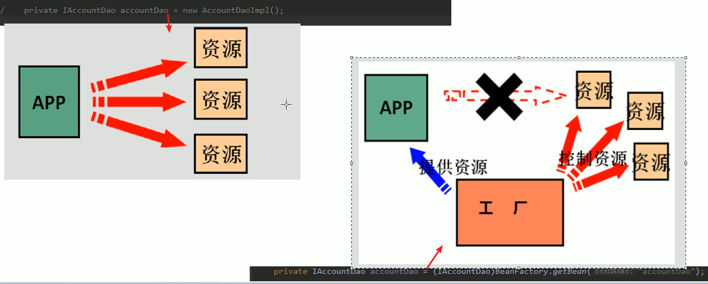

#### 搭建Spring 基于XML的开发环境

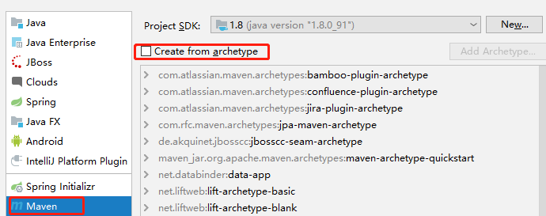

**pom.xml**
 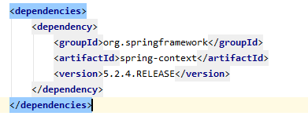

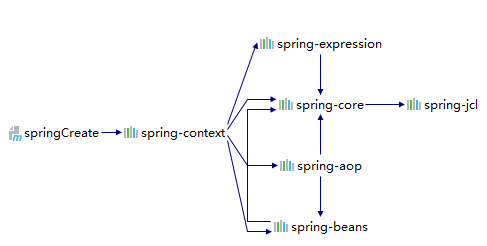

**resources 目录下bean.xml**

```
<?xml version="1.0" encoding="UTF-8"?>
<beans xmlns="http://www.springframework.org/schema/beans"
       xmlns:xsi="http://www.w3.org/2001/XMLSchema-instance"
       xsi:schemaLocation="http://www.springframework.org/schema/beans
        https://www.springframework.org/schema/beans/spring-beans.xsd">
    <!-- 把对象的创建交给spring 来管理 -->
    <bean id="accountService" class="com.liudezhi.service.impl.AccountServiceImpl"></bean>
    <bean id="accountDao" class="com.liudezhi.dao.impl.AccountDaoImpl"></bean>
</beans>

```

**获取对象**

```
public class Client {
    /**
     * 获取spring的Ioc核心容器，并根据id获取对象
     *
     * ApplicationContext 的三个常用实现类：
     *  ClassPathXmlApplicationContext：可以加载类路径下的配置文件，要求配置文件必须在类路径下。不在的话，加载不了。
     *  FileSystemXmlApplicationContext：可以加载磁盘任意路径下的配置文件（必须有访问权限）。
     *  AnnotationConfigApplicationContext：用于读取注解创建容器的。
     *
     * @param args
     */
    public static void main(String[] args) {
//        AccountSevice accountSevice = new AccountServiceImpl();
        //1. 获取核心容器对象
        ApplicationContext ac = new ClassPathXmlApplicationContext("bean.xml");
        //2. 根据id获取Bean对象
        AccountSevice accountSevice = (AccountSevice) ac.getBean("accountService");
        AccountDao accountDao = ac.getBean("accountDao", AccountDao.class); //也可以不强转，传入对象字节码
        accountSevice.saveAccount();
    }

```

**tips：查看接口实现类**
 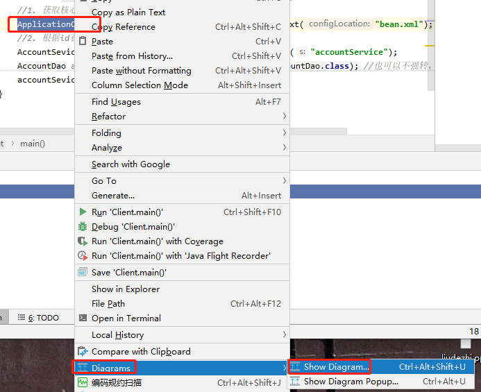
 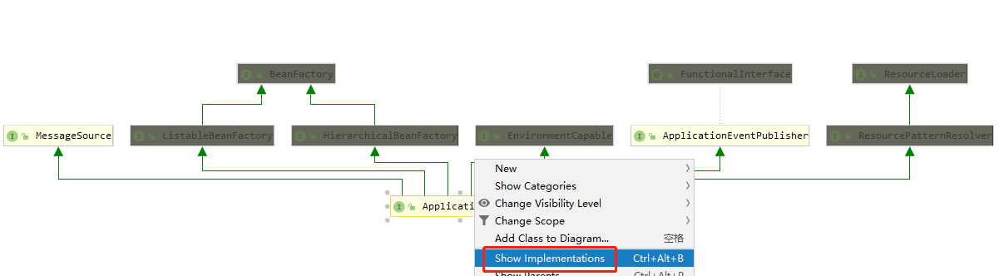
 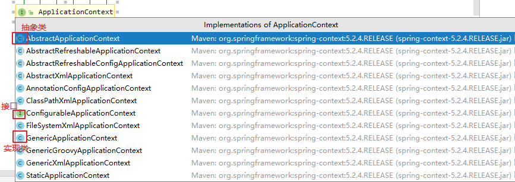

#### ApplicationContext 的三个常用实现类：

- ClassPathXmlApplicationContext：可以加载类路径下的配置文件，要求配置文件必须在类路径下。不在的话，加载不了（更常用）。

- FileSystemXmlApplicationContext：可以加载磁盘任意路径下的配置文件（必须有访问权限）。

- AnnotationConfigApplicationContext：用于读取注解创建容器的。

#### 核心容器的两个接口引发出的问题：

- ApplicationContext：单例对象适用
 它在构建核心容器时，创建对象采取的是立即加载的方式。也就是说，只要一读取完配置文件马上就创建配置文件中配置的对象。（可以在类的构造文件里加上输出，可以看到，当ApplicationContext 创建后，就输出了）

- BeanFactory：多例对象适用
 它在构建核心容器时，创建对象采取的是延迟加载的方式。也就是说，什么时候根据id获取对象，什么时候才真正的创建对象。

#### Spring对bean的管理细节

##### 一、创建bean的三种方式

1.
使用默认构造函数创建。
 在spring的配置文件中使用bean标签，配以id和class属性之后，且没有其他属性和标签时。采用的就是默认构造函数创建bean对象，此时如果类中没有默认构造函数，则对象无法创建。
 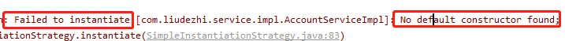

1.
使用普通工厂中的方法创建对象（使用类中的方法创建对象，并存入spring容器）
 **eg：**

```
/**
 * 模拟一个工厂类（该类可能是存在于jar包中的，我们无法通过修改源码的方式来提供默认的构造函数）
 */
public class InstanceFactory {

    public AccountSevice getAccountService() {
        return new AccountServiceImpl();
    }
}

```

```
<?xml version="1.0" encoding="UTF-8"?>
<beans xmlns="http://www.springframework.org/schema/beans"
       xmlns:xsi="http://www.w3.org/2001/XMLSchema-instance"
       xsi:schemaLocation="http://www.springframework.org/schema/beans
        https://www.springframework.org/schema/beans/spring-beans.xsd">

    <!-- 第二种方式：使用普通工厂中的方法创建对象（使用类中的方法创建对象，并存入spring容器）
    -->
    <bean id="instanceFactory" class="com.liudezhi.factory.InstanceFactory"></bean>
    <bean id="accountService" factory-bean="instanceFactory" factory-method="getAccountService"></bean>
</beans>

```

1.
使用工厂中的静态方法创建对象（使用某个类中的静态方法创建对象，并存入spring容器。
 **eg：**

```
/**
 * 模拟一个工厂类（该类可能是存在于jar包中的，我们无法通过修改源码的方式来提供默认的构造函数）
 */
public class StaticFactory {
    public static AccountSevice getAccountService() {
        return new AccountServiceImpl();
    }
}

```

```
<?xml version="1.0" encoding="UTF-8"?>
<beans xmlns="http://www.springframework.org/schema/beans"
       xmlns:xsi="http://www.w3.org/2001/XMLSchema-instance"
       xsi:schemaLocation="http://www.springframework.org/schema/beans
        https://www.springframework.org/schema/beans/spring-beans.xsd">

    <!-- 第三种方式：使用工厂中的静态方法创建对象（使用某个类中的静态方法创建对象，并存入spring容器。-->
    <bean id="accountService" class="com.liudezhi.factory.StaticFactory" factory-method="getAccountService"></bean>
</beans>

```

##### 二、bean对象的作用范围

bean的作用范围调整：
 bean标签的scope属性：

- 作用：用于指定bean的作用范围

- 取值：常用的就是单例的和多例的。

  - singleton：单例（默认值）

  - prototype：多例的

  - request：作用于web应用的请求范围

  - session：作用于web应用的会话范围

  - global-session：作用于集群环境的会话范围（全局会话范围），当不是集群环境时，它就是session。
 **eg：**

```
<bean id="accountService" class="com.liudezhi.factory.StaticFactory"
factory-method="getAccountService" scope="prototype"></bean>

```

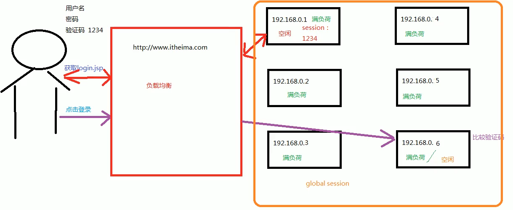

##### 三、bean对象的生命周期

-
单例对象

  - 出生：只要容器创建时，对象出生。

  - 活着：只要容器还在，对象一直活着。

  - 死亡：容器销毁，对象消亡。

  - 总结：单例对象的生命周期和容器相同。
 **eg：**

```
public class AccountServiceImpl implements AccountSevice {

    public AccountServiceImpl() {
        System.out.println("对象被创建了！");
    }

    @Override
    public void saveAccount() {
        System.out.println("保存成功");
    }

    @Override
    public void init() {
        System.out.println("对象初始化了...");
    }

    @Override
    public void destory() {
        System.out.println("对象销毁了...");
    }
}

```

```
<?xml version="1.0" encoding="UTF-8"?>
<beans xmlns="http://www.springframework.org/schema/beans"
       xmlns:xsi="http://www.w3.org/2001/XMLSchema-instance"
       xsi:schemaLocation="http://www.springframework.org/schema/beans
        https://www.springframework.org/schema/beans/spring-beans.xsd">

    <bean id="accountService" class="com.liudezhi.factory.StaticFactory" factory-method="getAccountService"
          scope="singleton" init-method="init" destroy-method="destory"></bean>
</beans>

```

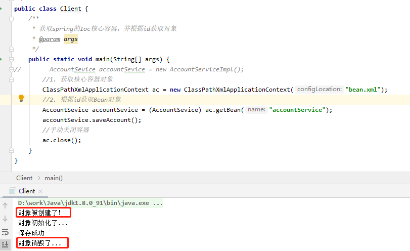

-
多例对象

  - 出生：当我们使用对象时spring框架就为我们创建。

  - 活着：对象只要是在使用过程中就一直活着。

  - 死亡：当对象长时间不用，且没有别的对象引用时，由java的垃圾回收器回收。

### DI

**依赖注入：** Dependency Injection

**IOC的作用：** 降低程序间的耦合（依赖关系）

**依赖关系的管理：** 以后都交给spring来维护
 在当前类需要用到其他类的对象，由spring为我们提供，我们只需要在配置文件中说明

**依赖关系的维护：** 就称之为依赖注入。

**依赖注入：**

#### 三类能注入的数据：

1. 基本类型和String

1. 其他bean类型（在配置文件中或注解配置过的bean）

1. 复杂类型/集合类型

#### 三种注入的方式：

##### 第一种：使用构造函数提供(注入)

- 使用的标签：constructor-arg

- 标签出现的位置：bean标签的内部

- 标签中的属性

  - type：用于指定要注入的数据的数据类型，该数据类型也是构造函数中某个或某些参数的类型

  - index：用于指定要注入的数据给构造函数中指定索引位置的参数赋值。索引的位置是从0开始

  - name：用于指定给构造函数中指定名称的参数赋值。（常用）
 ===============以上三个用于指定给构造函数中哪个参数赋值==================

  - value：用于提供基本类型和String类型的数据

  - ref：用于指定其他的bean类型数据。它指的就是在spring的Ioc核心容器中出现过的bean对象

- 优势：在获取bean对象时，注入数据时必须的操作，否者对象无法创建成功。

- 缺点：改变了bean对象的实例化方式，使我们在创建对象时，如果用不到这些数据，也必须提供

**eg：**

```
public class AccountServiceImpl implements AccountService {

    //如果是经常变化的数据，并不适用于注入的方式
    private String name;
    private Integer age;
    private Date birthday;

    public AccountServiceImpl(String name, Integer age, Date birthday) {
        this.name = name;
        this.age = age;
        this.birthday = birthday;
    }

    @Override
    public void saveAccount() {
        System.out.println("保存成功" + name + "," + age + "," + birthday);
    }
}

```

```
<?xml version="1.0" encoding="UTF-8"?>
<beans xmlns="http://www.springframework.org/schema/beans"
       xmlns:xsi="http://www.w3.org/2001/XMLSchema-instance"
       xsi:schemaLocation="http://www.springframework.org/schema/beans
        https://www.springframework.org/schema/beans/spring-beans.xsd">

    <bean id="accountService" class="com.liudezhi.service.impl.AccountServiceImpl">
        <constructor-arg name="name" value="test"></constructor-arg>
        <constructor-arg name="age" value="18"></constructor-arg>
        <constructor-arg name="birthday" ref="now"></constructor-arg>
    </bean>

    <!-- 配置一个日期对象 -->
    <bean id="now" class="java.util.Date"></bean>
</beans>

```

##### 第二种：使用set方法提供(注入)（更常用）

- 涉及的标签：property

- 出现的位置：bean标签的内部

- 标签的属性：

  - name：用于指定注入时所调用的set方法名称（去掉set，把首字母小写。不是根据成员变量名）

  - value：用于提供基本类型和String类型的数据

  - ref：用于指定其他的bean类型数据。它指的就是在spring的Ioc核心容器中出现过的bean对象

- 优势：创建对象时没有明确的限制，可以直接使用默认构造函数。

- 弊端：如果有某个成员必须有值，则set方法无法保证一定注入（获取对象时有可能set方法没有执行）。

```
package com.liudezhi.service.impl;

import com.liudezhi.service.AccountService;

import java.util.Date;

/**
 * 账户的业务层实现类
 */
public class AccountServiceImpl2 implements AccountService {

    //如果是经常变化的数据，并不适用于注入的方式
    private String name;
    private Integer age;
    private Date birthday;

    public void setName(String name) {
        this.name = name;
    }

    public void setAge(Integer age) {
        this.age = age;
    }

    public void setBirthday(Date birthday) {
        this.birthday = birthday;
    }

    @Override
    public void saveAccount() {
        System.out.println("保存成功" + name + "," + age + "," + birthday);
    }
}

```

```
<?xml version="1.0" encoding="UTF-8"?>
<beans xmlns="http://www.springframework.org/schema/beans"
       xmlns:xsi="http://www.w3.org/2001/XMLSchema-instance"
       xsi:schemaLocation="http://www.springframework.org/schema/beans
        https://www.springframework.org/schema/beans/spring-beans.xsd">

    <!-- 配置一个日期对象 -->
    <bean id="now" class="java.util.Date"></bean>

    <bean id="accountService2" class="com.liudezhi.service.impl.AccountServiceImpl2">
        <property name="name" value="Test"></property>
        <property name="age" value="18"></property>
        <property name="birthday" ref="now"></property>
    </bean>
</beans>

```

##### 第三种：使用注解提供(注入)

#### 注入集合数据（复杂类型的注入/集合类型的注入）

- 用于给List结构集合注入的标签：
 list array set

- 用于给Map结构结合注入的标签：
 map props

- 结构相同，标签可以互换

**eg：**

```
package com.liudezhi.service.impl;

import com.liudezhi.service.AccountService;

import java.util.*;

/**
 * 账户的业务层实现类
 */
public class AccountServiceImpl3 implements AccountService {
    private String[] myStrs;
    private List<String> myList;
    private Set<String> mySet;
    private Map<String, String> myMap;
    private Properties myProps;

    public void setMyStrs(String[] myStrs) {
        this.myStrs = myStrs;
    }

    public void setMyList(List<String> myList) {
        this.myList = myList;
    }

    public void setMySet(Set<String> mySet) {
        this.mySet = mySet;
    }

    public void setMyMap(Map<String, String> myMap) {
        this.myMap = myMap;
    }

    public void setMyProps(Properties myProps) {
        this.myProps = myProps;
    }

    @Override
    public void saveAccount() {
        System.out.println(Arrays.toString(myStrs));
        System.out.println(myList);
        System.out.println(mySet);
        System.out.println(myMap);
        System.out.println(myProps);
    }
}

```

```
<?xml version="1.0" encoding="UTF-8"?>
<beans xmlns="http://www.springframework.org/schema/beans"
       xmlns:xsi="http://www.w3.org/2001/XMLSchema-instance"
       xsi:schemaLocation="http://www.springframework.org/schema/beans
        https://www.springframework.org/schema/beans/spring-beans.xsd">

    <bean id="accountService3" class="com.liudezhi.service.impl.AccountServiceImpl3">
        <property name="myStrs">
            <array>
                <value>AAA</value>
                <value>BBB</value>
                <value>CCC</value>
            </array>
        </property>
        <property name="myList">
            <list>
                <value>AAA</value>
                <value>BBB</value>
                <value>CCC</value>
            </list>
        </property>
        <property name="mySet">
            <set>
                <value>AAA</value>
                <value>BBB</value>
                <value>CCC</value>
            </set>
        </property>
        <property name="myMap">
        <map>
            <entry key="testA" value="aaa"></entry>
            <entry key="testB">
                <value>BBB</value>
            </entry>
        </map>
        </property>
        <property name="myProps">
            <props>
                <prop key="testC">ccc</prop>
                <prop key="testD">ddd</prop>
            </props>
        </property>
    </bean>
</beans>

```

%23%23%23%20IOC%EF%BC%88%E6%8E%A7%E5%88%B6%E5%8F%8D%E8%BD%AC%EF%BC%89%0A!%5B20d4d8da36462d12ac6af1d854047761.png%5D(en-resource%3A%2F%2Fdatabase%2F3294%3A0)%0A*%20IOC%20%E7%9A%84%E4%BD%9C%E7%94%A8%EF%BC%9A%E5%89%8A%E5%87%8F%E8%AE%A1%E7%AE%97%E6%9C%BA%E7%A8%8B%E5%BA%8F%E7%9A%84%E8%80%A6%E5%90%88%EF%BC%88%E8%A7%A3%E9%99%A4%E6%88%91%E4%BB%AC%E4%BB%A3%E7%A0%81%E4%B8%AD%E7%9A%84%E4%BE%9D%E8%B5%96%E5%85%B3%E7%B3%BB%EF%BC%89%E3%80%82%0A!%5Bfa535b3e7d0282cfabba8fd3239c0aff.png%5D(en-resource%3A%2F%2Fdatabase%2F3296%3A0)%0A%0A%23%23%23%23%20%E6%90%AD%E5%BB%BASpring%20%E5%9F%BA%E4%BA%8EXML%E7%9A%84%E5%BC%80%E5%8F%91%E7%8E%AF%E5%A2%83%0A!%5B45d1d40d0e8fcca550f1dd7b8c5ae754.png%5D(en-resource%3A%2F%2Fdatabase%2F3300%3A0)%0A%0A**pom.xml**%0A!%5B337b9f43bdb429f1377940d3d3fde686.png%5D(en-resource%3A%2F%2Fdatabase%2F3302%3A0)%0A%0A!%5B1d32391e50e55f6a14f0099cad1c81cf.png%5D(en-resource%3A%2F%2Fdatabase%2F3304%3A0)%0A%0A**resources%20%E7%9B%AE%E5%BD%95%E4%B8%8Bbean.xml**%0A%60%60%60xml%0A%3C%3Fxml%20version%3D%221.0%22%20encoding%3D%22UTF-8%22%3F%3E%0A%3Cbeans%20xmlns%3D%22http%3A%2F%2Fwww.springframework.org%2Fschema%2Fbeans%22%0A%20%20%20%20%20%20%20xmlns%3Axsi%3D%22http%3A%2F%2Fwww.w3.org%2F2001%2FXMLSchema-instance%22%0A%20%20%20%20%20%20%20xsi%3AschemaLocation%3D%22http%3A%2F%2Fwww.springframework.org%2Fschema%2Fbeans%0A%20%20%20%20%20%20%20%20https%3A%2F%2Fwww.springframework.org%2Fschema%2Fbeans%2Fspring-beans.xsd%22%3E%0A%20%20%20%20%3C!--%20%E6%8A%8A%E5%AF%B9%E8%B1%A1%E7%9A%84%E5%88%9B%E5%BB%BA%E4%BA%A4%E7%BB%99spring%20%E6%9D%A5%E7%AE%A1%E7%90%86%20--%3E%0A%20%20%20%20%3Cbean%20id%3D%22accountService%22%20class%3D%22com.liudezhi.service.impl.AccountServiceImpl%22%3E%3C%2Fbean%3E%0A%20%20%20%20%3Cbean%20id%3D%22accountDao%22%20class%3D%22com.liudezhi.dao.impl.AccountDaoImpl%22%3E%3C%2Fbean%3E%0A%3C%2Fbeans%3E%0A%60%60%60%0A%0A**%E8%8E%B7%E5%8F%96%E5%AF%B9%E8%B1%A1**%0A%60%60%60java%0Apublic%20class%20Client%20%7B%0A%20%20%20%20%2F**%0A%20%20%20%20%20*%20%E8%8E%B7%E5%8F%96spring%E7%9A%84Ioc%E6%A0%B8%E5%BF%83%E5%AE%B9%E5%99%A8%EF%BC%8C%E5%B9%B6%E6%A0%B9%E6%8D%AEid%E8%8E%B7%E5%8F%96%E5%AF%B9%E8%B1%A1%0A%20%20%20%20%20*%0A%20%20%20%20%20*%20ApplicationContext%20%E7%9A%84%E4%B8%89%E4%B8%AA%E5%B8%B8%E7%94%A8%E5%AE%9E%E7%8E%B0%E7%B1%BB%EF%BC%9A%0A%20%20%20%20%20*%20%20ClassPathXmlApplicationContext%EF%BC%9A%E5%8F%AF%E4%BB%A5%E5%8A%A0%E8%BD%BD%E7%B1%BB%E8%B7%AF%E5%BE%84%E4%B8%8B%E7%9A%84%E9%85%8D%E7%BD%AE%E6%96%87%E4%BB%B6%EF%BC%8C%E8%A6%81%E6%B1%82%E9%85%8D%E7%BD%AE%E6%96%87%E4%BB%B6%E5%BF%85%E9%A1%BB%E5%9C%A8%E7%B1%BB%E8%B7%AF%E5%BE%84%E4%B8%8B%E3%80%82%E4%B8%8D%E5%9C%A8%E7%9A%84%E8%AF%9D%EF%BC%8C%E5%8A%A0%E8%BD%BD%E4%B8%8D%E4%BA%86%E3%80%82%0A%20%20%20%20%20*%20%20FileSystemXmlApplicationContext%EF%BC%9A%E5%8F%AF%E4%BB%A5%E5%8A%A0%E8%BD%BD%E7%A3%81%E7%9B%98%E4%BB%BB%E6%84%8F%E8%B7%AF%E5%BE%84%E4%B8%8B%E7%9A%84%E9%85%8D%E7%BD%AE%E6%96%87%E4%BB%B6%EF%BC%88%E5%BF%85%E9%A1%BB%E6%9C%89%E8%AE%BF%E9%97%AE%E6%9D%83%E9%99%90%EF%BC%89%E3%80%82%0A%20%20%20%20%20*%20%20AnnotationConfigApplicationContext%EF%BC%9A%E7%94%A8%E4%BA%8E%E8%AF%BB%E5%8F%96%E6%B3%A8%E8%A7%A3%E5%88%9B%E5%BB%BA%E5%AE%B9%E5%99%A8%E7%9A%84%E3%80%82%0A%20%20%20%20%20*%0A%20%20%20%20%20*%20%40param%20args%0A%20%20%20%20%20*%2F%0A%20%20%20%20public%20static%20void%20main(String%5B%5D%20args)%20%7B%0A%2F%2F%20%20%20%20%20%20%20%20AccountSevice%20accountSevice%20%3D%20new%20AccountServiceImpl()%3B%0A%20%20%20%20%20%20%20%20%2F%2F1.%20%E8%8E%B7%E5%8F%96%E6%A0%B8%E5%BF%83%E5%AE%B9%E5%99%A8%E5%AF%B9%E8%B1%A1%0A%20%20%20%20%20%20%20%20ApplicationContext%20ac%20%3D%20new%20ClassPathXmlApplicationContext(%22bean.xml%22)%3B%0A%20%20%20%20%20%20%20%20%2F%2F2.%20%E6%A0%B9%E6%8D%AEid%E8%8E%B7%E5%8F%96Bean%E5%AF%B9%E8%B1%A1%0A%20%20%20%20%20%20%20%20AccountSevice%20accountSevice%20%3D%20(AccountSevice)%20ac.getBean(%22accountService%22)%3B%0A%20%20%20%20%20%20%20%20AccountDao%20accountDao%20%3D%20ac.getBean(%22accountDao%22%2C%20AccountDao.class)%3B%20%2F%2F%E4%B9%9F%E5%8F%AF%E4%BB%A5%E4%B8%8D%E5%BC%BA%E8%BD%AC%EF%BC%8C%E4%BC%A0%E5%85%A5%E5%AF%B9%E8%B1%A1%E5%AD%97%E8%8A%82%E7%A0%81%0A%20%20%20%20%20%20%20%20accountSevice.saveAccount()%3B%0A%20%20%20%20%7D%0A%60%60%60%0A%0A**tips%EF%BC%9A%E6%9F%A5%E7%9C%8B%E6%8E%A5%E5%8F%A3%E5%AE%9E%E7%8E%B0%E7%B1%BB**%0A!%5B4b4d2d2d8ce028a399ff3268db5a9d50.png%5D(en-resource%3A%2F%2Fdatabase%2F3306%3A0)%0A!%5Beb3fdad378461d7b0ab5ae39930ed9d2.png%5D(en-resource%3A%2F%2Fdatabase%2F3308%3A0)%0A!%5Bb0c2e0cc28d5d08bb5c3823f5be451d3.png%5D(en-resource%3A%2F%2Fdatabase%2F3312%3A0)%0A%0A%0A%23%23%23%23%20ApplicationContext%20%E7%9A%84%E4%B8%89%E4%B8%AA%E5%B8%B8%E7%94%A8%E5%AE%9E%E7%8E%B0%E7%B1%BB%EF%BC%9A%0A*%20ClassPathXmlApplicationContext%EF%BC%9A%E5%8F%AF%E4%BB%A5%E5%8A%A0%E8%BD%BD%E7%B1%BB%E8%B7%AF%E5%BE%84%E4%B8%8B%E7%9A%84%E9%85%8D%E7%BD%AE%E6%96%87%E4%BB%B6%EF%BC%8C%E8%A6%81%E6%B1%82%E9%85%8D%E7%BD%AE%E6%96%87%E4%BB%B6%E5%BF%85%E9%A1%BB%E5%9C%A8%E7%B1%BB%E8%B7%AF%E5%BE%84%E4%B8%8B%E3%80%82%E4%B8%8D%E5%9C%A8%E7%9A%84%E8%AF%9D%EF%BC%8C%E5%8A%A0%E8%BD%BD%E4%B8%8D%E4%BA%86%EF%BC%88%E6%9B%B4%E5%B8%B8%E7%94%A8%EF%BC%89%E3%80%82%0A*%20FileSystemXmlApplicationContext%EF%BC%9A%E5%8F%AF%E4%BB%A5%E5%8A%A0%E8%BD%BD%E7%A3%81%E7%9B%98%E4%BB%BB%E6%84%8F%E8%B7%AF%E5%BE%84%E4%B8%8B%E7%9A%84%E9%85%8D%E7%BD%AE%E6%96%87%E4%BB%B6%EF%BC%88%E5%BF%85%E9%A1%BB%E6%9C%89%E8%AE%BF%E9%97%AE%E6%9D%83%E9%99%90%EF%BC%89%E3%80%82%0A*%20AnnotationConfigApplicationContext%EF%BC%9A%E7%94%A8%E4%BA%8E%E8%AF%BB%E5%8F%96%E6%B3%A8%E8%A7%A3%E5%88%9B%E5%BB%BA%E5%AE%B9%E5%99%A8%E7%9A%84%E3%80%82%0A%0A%23%23%23%23%20%E6%A0%B8%E5%BF%83%E5%AE%B9%E5%99%A8%E7%9A%84%E4%B8%A4%E4%B8%AA%E6%8E%A5%E5%8F%A3%E5%BC%95%E5%8F%91%E5%87%BA%E7%9A%84%E9%97%AE%E9%A2%98%EF%BC%9A%0A*%20ApplicationContext%EF%BC%9A%E5%8D%95%E4%BE%8B%E5%AF%B9%E8%B1%A1%E9%80%82%E7%94%A8%0A%20%20%20%20%E5%AE%83%E5%9C%A8%E6%9E%84%E5%BB%BA%E6%A0%B8%E5%BF%83%E5%AE%B9%E5%99%A8%E6%97%B6%EF%BC%8C%E5%88%9B%E5%BB%BA%E5%AF%B9%E8%B1%A1%E9%87%87%E5%8F%96%E7%9A%84%E6%98%AF%E7%AB%8B%E5%8D%B3%E5%8A%A0%E8%BD%BD%E7%9A%84%E6%96%B9%E5%BC%8F%E3%80%82%E4%B9%9F%E5%B0%B1%E6%98%AF%E8%AF%B4%EF%BC%8C%E5%8F%AA%E8%A6%81%E4%B8%80%E8%AF%BB%E5%8F%96%E5%AE%8C%E9%85%8D%E7%BD%AE%E6%96%87%E4%BB%B6%E9%A9%AC%E4%B8%8A%E5%B0%B1%E5%88%9B%E5%BB%BA%E9%85%8D%E7%BD%AE%E6%96%87%E4%BB%B6%E4%B8%AD%E9%85%8D%E7%BD%AE%E7%9A%84%E5%AF%B9%E8%B1%A1%E3%80%82%EF%BC%88%E5%8F%AF%E4%BB%A5%E5%9C%A8%E7%B1%BB%E7%9A%84%E6%9E%84%E9%80%A0%E6%96%87%E4%BB%B6%E9%87%8C%E5%8A%A0%E4%B8%8A%E8%BE%93%E5%87%BA%EF%BC%8C%E5%8F%AF%E4%BB%A5%E7%9C%8B%E5%88%B0%EF%BC%8C%E5%BD%93ApplicationContext%20%E5%88%9B%E5%BB%BA%E5%90%8E%EF%BC%8C%E5%B0%B1%E8%BE%93%E5%87%BA%E4%BA%86%EF%BC%89%0A*%20BeanFactory%EF%BC%9A%E5%A4%9A%E4%BE%8B%E5%AF%B9%E8%B1%A1%E9%80%82%E7%94%A8%0A%20%20%20%20%E5%AE%83%E5%9C%A8%E6%9E%84%E5%BB%BA%E6%A0%B8%E5%BF%83%E5%AE%B9%E5%99%A8%E6%97%B6%EF%BC%8C%E5%88%9B%E5%BB%BA%E5%AF%B9%E8%B1%A1%E9%87%87%E5%8F%96%E7%9A%84%E6%98%AF%E5%BB%B6%E8%BF%9F%E5%8A%A0%E8%BD%BD%E7%9A%84%E6%96%B9%E5%BC%8F%E3%80%82%E4%B9%9F%E5%B0%B1%E6%98%AF%E8%AF%B4%EF%BC%8C%E4%BB%80%E4%B9%88%E6%97%B6%E5%80%99%E6%A0%B9%E6%8D%AEid%E8%8E%B7%E5%8F%96%E5%AF%B9%E8%B1%A1%EF%BC%8C%E4%BB%80%E4%B9%88%E6%97%B6%E5%80%99%E6%89%8D%E7%9C%9F%E6%AD%A3%E7%9A%84%E5%88%9B%E5%BB%BA%E5%AF%B9%E8%B1%A1%E3%80%82%0A%0A%23%23%23%23%20Spring%E5%AF%B9bean%E7%9A%84%E7%AE%A1%E7%90%86%E7%BB%86%E8%8A%82%0A%0A%23%23%23%23%23%20%E4%B8%80%E3%80%81%E5%88%9B%E5%BB%BAbean%E7%9A%84%E4%B8%89%E7%A7%8D%E6%96%B9%E5%BC%8F%0A1.%20%E4%BD%BF%E7%94%A8%E9%BB%98%E8%AE%A4%E6%9E%84%E9%80%A0%E5%87%BD%E6%95%B0%E5%88%9B%E5%BB%BA%E3%80%82%0A%20%20%20%20%E5%9C%A8spring%E7%9A%84%E9%85%8D%E7%BD%AE%E6%96%87%E4%BB%B6%E4%B8%AD%E4%BD%BF%E7%94%A8bean%E6%A0%87%E7%AD%BE%EF%BC%8C%E9%85%8D%E4%BB%A5id%E5%92%8Cclass%E5%B1%9E%E6%80%A7%E4%B9%8B%E5%90%8E%EF%BC%8C%E4%B8%94%E6%B2%A1%E6%9C%89%E5%85%B6%E4%BB%96%E5%B1%9E%E6%80%A7%E5%92%8C%E6%A0%87%E7%AD%BE%E6%97%B6%E3%80%82%E9%87%87%E7%94%A8%E7%9A%84%E5%B0%B1%E6%98%AF%E9%BB%98%E8%AE%A4%E6%9E%84%E9%80%A0%E5%87%BD%E6%95%B0%E5%88%9B%E5%BB%BAbean%E5%AF%B9%E8%B1%A1%EF%BC%8C%E6%AD%A4%E6%97%B6%E5%A6%82%E6%9E%9C%E7%B1%BB%E4%B8%AD%E6%B2%A1%E6%9C%89%E9%BB%98%E8%AE%A4%E6%9E%84%E9%80%A0%E5%87%BD%E6%95%B0%EF%BC%8C%E5%88%99%E5%AF%B9%E8%B1%A1%E6%97%A0%E6%B3%95%E5%88%9B%E5%BB%BA%E3%80%82%0A%20%20%20%20!%5B53a30b893fefe2019fed241238d8b464.png%5D(en-resource%3A%2F%2Fdatabase%2F3314%3A0)%0A%0A2.%20%E4%BD%BF%E7%94%A8%E6%99%AE%E9%80%9A%E5%B7%A5%E5%8E%82%E4%B8%AD%E7%9A%84%E6%96%B9%E6%B3%95%E5%88%9B%E5%BB%BA%E5%AF%B9%E8%B1%A1%EF%BC%88%E4%BD%BF%E7%94%A8%E7%B1%BB%E4%B8%AD%E7%9A%84%E6%96%B9%E6%B3%95%E5%88%9B%E5%BB%BA%E5%AF%B9%E8%B1%A1%EF%BC%8C%E5%B9%B6%E5%AD%98%E5%85%A5spring%E5%AE%B9%E5%99%A8%EF%BC%89%0A%20%20%20%20**eg%EF%BC%9A**%0A%20%20%20%20%60%60%60java%0A%20%20%20%20%2F**%0A%20%20%20%20%20*%20%E6%A8%A1%E6%8B%9F%E4%B8%80%E4%B8%AA%E5%B7%A5%E5%8E%82%E7%B1%BB%EF%BC%88%E8%AF%A5%E7%B1%BB%E5%8F%AF%E8%83%BD%E6%98%AF%E5%AD%98%E5%9C%A8%E4%BA%8Ejar%E5%8C%85%E4%B8%AD%E7%9A%84%EF%BC%8C%E6%88%91%E4%BB%AC%E6%97%A0%E6%B3%95%E9%80%9A%E8%BF%87%E4%BF%AE%E6%94%B9%E6%BA%90%E7%A0%81%E7%9A%84%E6%96%B9%E5%BC%8F%E6%9D%A5%E6%8F%90%E4%BE%9B%E9%BB%98%E8%AE%A4%E7%9A%84%E6%9E%84%E9%80%A0%E5%87%BD%E6%95%B0%EF%BC%89%0A%20%20%20%20%20*%2F%0A%20%20%20%20public%20class%20InstanceFactory%20%7B%0A%0A%20%20%20%20%20%20%20%20public%20AccountSevice%20getAccountService()%20%7B%0A%20%20%20%20%20%20%20%20%20%20%20%20return%20new%20AccountServiceImpl()%3B%0A%20%20%20%20%20%20%20%20%7D%0A%20%20%20%20%7D%0A%20%20%20%20%60%60%60%0A%20%20%20%20%60%60%60xml%0A%20%20%20%20%3C%3Fxml%20version%3D%221.0%22%20encoding%3D%22UTF-8%22%3F%3E%0A%20%20%20%20%3Cbeans%20xmlns%3D%22http%3A%2F%2Fwww.springframework.org%2Fschema%2Fbeans%22%0A%20%20%20%20%20%20%20%20%20%20%20xmlns%3Axsi%3D%22http%3A%2F%2Fwww.w3.org%2F2001%2FXMLSchema-instance%22%0A%20%20%20%20%20%20%20%20%20%20%20xsi%3AschemaLocation%3D%22http%3A%2F%2Fwww.springframework.org%2Fschema%2Fbeans%0A%20%20%20%20%20%20%20%20%20%20%20%20https%3A%2F%2Fwww.springframework.org%2Fschema%2Fbeans%2Fspring-beans.xsd%22%3E%0A%0A%20%20%20%20%20%20%20%20%3C!--%20%E7%AC%AC%E4%BA%8C%E7%A7%8D%E6%96%B9%E5%BC%8F%EF%BC%9A%E4%BD%BF%E7%94%A8%E6%99%AE%E9%80%9A%E5%B7%A5%E5%8E%82%E4%B8%AD%E7%9A%84%E6%96%B9%E6%B3%95%E5%88%9B%E5%BB%BA%E5%AF%B9%E8%B1%A1%EF%BC%88%E4%BD%BF%E7%94%A8%E7%B1%BB%E4%B8%AD%E7%9A%84%E6%96%B9%E6%B3%95%E5%88%9B%E5%BB%BA%E5%AF%B9%E8%B1%A1%EF%BC%8C%E5%B9%B6%E5%AD%98%E5%85%A5spring%E5%AE%B9%E5%99%A8%EF%BC%89%0A%20%20%20%20%20%20%20%20--%3E%0A%20%20%20%20%20%20%20%20%3Cbean%20id%3D%22instanceFactory%22%20class%3D%22com.liudezhi.factory.InstanceFactory%22%3E%3C%2Fbean%3E%0A%20%20%20%20%20%20%20%20%3Cbean%20id%3D%22accountService%22%20factory-bean%3D%22instanceFactory%22%20factory-method%3D%22getAccountService%22%3E%3C%2Fbean%3E%0A%20%20%20%20%3C%2Fbeans%3E%0A%20%20%20%20%60%60%60%0A%0A3.%20%E4%BD%BF%E7%94%A8%E5%B7%A5%E5%8E%82%E4%B8%AD%E7%9A%84%E9%9D%99%E6%80%81%E6%96%B9%E6%B3%95%E5%88%9B%E5%BB%BA%E5%AF%B9%E8%B1%A1%EF%BC%88%E4%BD%BF%E7%94%A8%E6%9F%90%E4%B8%AA%E7%B1%BB%E4%B8%AD%E7%9A%84%E9%9D%99%E6%80%81%E6%96%B9%E6%B3%95%E5%88%9B%E5%BB%BA%E5%AF%B9%E8%B1%A1%EF%BC%8C%E5%B9%B6%E5%AD%98%E5%85%A5spring%E5%AE%B9%E5%99%A8%E3%80%82%0A%20%20%20%20**eg%EF%BC%9A**%0A%20%20%20%20%60%60%60java%0A%20%20%20%20%2F**%0A%20%20%20%20%20*%20%E6%A8%A1%E6%8B%9F%E4%B8%80%E4%B8%AA%E5%B7%A5%E5%8E%82%E7%B1%BB%EF%BC%88%E8%AF%A5%E7%B1%BB%E5%8F%AF%E8%83%BD%E6%98%AF%E5%AD%98%E5%9C%A8%E4%BA%8Ejar%E5%8C%85%E4%B8%AD%E7%9A%84%EF%BC%8C%E6%88%91%E4%BB%AC%E6%97%A0%E6%B3%95%E9%80%9A%E8%BF%87%E4%BF%AE%E6%94%B9%E6%BA%90%E7%A0%81%E7%9A%84%E6%96%B9%E5%BC%8F%E6%9D%A5%E6%8F%90%E4%BE%9B%E9%BB%98%E8%AE%A4%E7%9A%84%E6%9E%84%E9%80%A0%E5%87%BD%E6%95%B0%EF%BC%89%0A%20%20%20%20%20*%2F%0A%20%20%20%20public%20class%20StaticFactory%20%7B%0A%20%20%20%20%20%20%20%20public%20static%20AccountSevice%20getAccountService()%20%7B%0A%20%20%20%20%20%20%20%20%20%20%20%20return%20new%20AccountServiceImpl()%3B%0A%20%20%20%20%20%20%20%20%7D%0A%20%20%20%20%7D%0A%20%20%20%20%60%60%60%0A%20%20%20%20%60%60%60xml%0A%20%20%20%20%3C%3Fxml%20version%3D%221.0%22%20encoding%3D%22UTF-8%22%3F%3E%0A%20%20%20%20%3Cbeans%20xmlns%3D%22http%3A%2F%2Fwww.springframework.org%2Fschema%2Fbeans%22%0A%20%20%20%20%20%20%20%20%20%20%20xmlns%3Axsi%3D%22http%3A%2F%2Fwww.w3.org%2F2001%2FXMLSchema-instance%22%0A%20%20%20%20%20%20%20%20%20%20%20xsi%3AschemaLocation%3D%22http%3A%2F%2Fwww.springframework.org%2Fschema%2Fbeans%0A%20%20%20%20%20%20%20%20%20%20%20%20https%3A%2F%2Fwww.springframework.org%2Fschema%2Fbeans%2Fspring-beans.xsd%22%3E%0A%0A%20%20%20%20%20%20%20%20%3C!--%20%E7%AC%AC%E4%B8%89%E7%A7%8D%E6%96%B9%E5%BC%8F%EF%BC%9A%E4%BD%BF%E7%94%A8%E5%B7%A5%E5%8E%82%E4%B8%AD%E7%9A%84%E9%9D%99%E6%80%81%E6%96%B9%E6%B3%95%E5%88%9B%E5%BB%BA%E5%AF%B9%E8%B1%A1%EF%BC%88%E4%BD%BF%E7%94%A8%E6%9F%90%E4%B8%AA%E7%B1%BB%E4%B8%AD%E7%9A%84%E9%9D%99%E6%80%81%E6%96%B9%E6%B3%95%E5%88%9B%E5%BB%BA%E5%AF%B9%E8%B1%A1%EF%BC%8C%E5%B9%B6%E5%AD%98%E5%85%A5spring%E5%AE%B9%E5%99%A8%E3%80%82--%3E%0A%20%20%20%20%20%20%20%20%3Cbean%20id%3D%22accountService%22%20class%3D%22com.liudezhi.factory.StaticFactory%22%20factory-method%3D%22getAccountService%22%3E%3C%2Fbean%3E%0A%20%20%20%20%3C%2Fbeans%3E%0A%20%20%20%20%60%60%60%0A%0A%23%23%23%23%23%20%20%E4%BA%8C%E3%80%81bean%E5%AF%B9%E8%B1%A1%E7%9A%84%E4%BD%9C%E7%94%A8%E8%8C%83%E5%9B%B4%0Abean%E7%9A%84%E4%BD%9C%E7%94%A8%E8%8C%83%E5%9B%B4%E8%B0%83%E6%95%B4%EF%BC%9A%0A%26nbsp%3B%26nbsp%3B%26nbsp%3B%26nbsp%3Bbean%E6%A0%87%E7%AD%BE%E7%9A%84scope%E5%B1%9E%E6%80%A7%EF%BC%9A%0A%2B%20%E4%BD%9C%E7%94%A8%EF%BC%9A%E7%94%A8%E4%BA%8E%E6%8C%87%E5%AE%9Abean%E7%9A%84%E4%BD%9C%E7%94%A8%E8%8C%83%E5%9B%B4%0A%2B%20%E5%8F%96%E5%80%BC%EF%BC%9A%E5%B8%B8%E7%94%A8%E7%9A%84%E5%B0%B1%E6%98%AF%E5%8D%95%E4%BE%8B%E7%9A%84%E5%92%8C%E5%A4%9A%E4%BE%8B%E7%9A%84%E3%80%82%0A%20%20%20%20-%20singleton%EF%BC%9A%E5%8D%95%E4%BE%8B%EF%BC%88%E9%BB%98%E8%AE%A4%E5%80%BC%EF%BC%89%0A%20%20%20%20-%20prototype%EF%BC%9A%E5%A4%9A%E4%BE%8B%E7%9A%84%0A%20%20%20%20-%20request%EF%BC%9A%E4%BD%9C%E7%94%A8%E4%BA%8Eweb%E5%BA%94%E7%94%A8%E7%9A%84%E8%AF%B7%E6%B1%82%E8%8C%83%E5%9B%B4%0A%20%20%20%20-%20session%EF%BC%9A%E4%BD%9C%E7%94%A8%E4%BA%8Eweb%E5%BA%94%E7%94%A8%E7%9A%84%E4%BC%9A%E8%AF%9D%E8%8C%83%E5%9B%B4%0A%20%20%20%20-%20global-session%EF%BC%9A%E4%BD%9C%E7%94%A8%E4%BA%8E%E9%9B%86%E7%BE%A4%E7%8E%AF%E5%A2%83%E7%9A%84%E4%BC%9A%E8%AF%9D%E8%8C%83%E5%9B%B4%EF%BC%88%E5%85%A8%E5%B1%80%E4%BC%9A%E8%AF%9D%E8%8C%83%E5%9B%B4%EF%BC%89%EF%BC%8C%E5%BD%93%E4%B8%8D%E6%98%AF%E9%9B%86%E7%BE%A4%E7%8E%AF%E5%A2%83%E6%97%B6%EF%BC%8C%E5%AE%83%E5%B0%B1%E6%98%AFsession%E3%80%82%0A**eg%EF%BC%9A**%0A%60%60%60xml%0A%3Cbean%20id%3D%22accountService%22%20class%3D%22com.liudezhi.factory.StaticFactory%22%20%0Afactory-method%3D%22getAccountService%22%20scope%3D%22prototype%22%3E%3C%2Fbean%3E%0A%60%60%60%0A!%5Bdc0deac798752fd2f3aaec5b5d5610d7.png%5D(en-resource%3A%2F%2Fdatabase%2F3316%3A0)%0A%0A%0A%23%23%23%23%23%20%E4%B8%89%E3%80%81bean%E5%AF%B9%E8%B1%A1%E7%9A%84%E7%94%9F%E5%91%BD%E5%91%A8%E6%9C%9F%0A%0A%2B%20%E5%8D%95%E4%BE%8B%E5%AF%B9%E8%B1%A1%0A%20%20%20%20-%20%E5%87%BA%E7%94%9F%EF%BC%9A%E5%8F%AA%E8%A6%81%E5%AE%B9%E5%99%A8%E5%88%9B%E5%BB%BA%E6%97%B6%EF%BC%8C%E5%AF%B9%E8%B1%A1%E5%87%BA%E7%94%9F%E3%80%82%0A%20%20%20%20-%20%E6%B4%BB%E7%9D%80%EF%BC%9A%E5%8F%AA%E8%A6%81%E5%AE%B9%E5%99%A8%E8%BF%98%E5%9C%A8%EF%BC%8C%E5%AF%B9%E8%B1%A1%E4%B8%80%E7%9B%B4%E6%B4%BB%E7%9D%80%E3%80%82%0A%20%20%20%20-%20%E6%AD%BB%E4%BA%A1%EF%BC%9A%E5%AE%B9%E5%99%A8%E9%94%80%E6%AF%81%EF%BC%8C%E5%AF%B9%E8%B1%A1%E6%B6%88%E4%BA%A1%E3%80%82%0A%20%20%20%20-%20%E6%80%BB%E7%BB%93%EF%BC%9A%E5%8D%95%E4%BE%8B%E5%AF%B9%E8%B1%A1%E7%9A%84%E7%94%9F%E5%91%BD%E5%91%A8%E6%9C%9F%E5%92%8C%E5%AE%B9%E5%99%A8%E7%9B%B8%E5%90%8C%E3%80%82%0A%20%20%20%20**eg%EF%BC%9A**%0A%20%20%20%20%60%60%60java%0A%20%20%20%20public%20class%20AccountServiceImpl%20implements%20AccountSevice%20%7B%0A%0A%20%20%20%20%20%20%20%20public%20AccountServiceImpl()%20%7B%0A%20%20%20%20%20%20%20%20%20%20%20%20System.out.println(%22%E5%AF%B9%E8%B1%A1%E8%A2%AB%E5%88%9B%E5%BB%BA%E4%BA%86%EF%BC%81%22)%3B%0A%20%20%20%20%20%20%20%20%7D%0A%0A%20%20%20%20%20%20%20%20%40Override%0A%20%20%20%20%20%20%20%20public%20void%20saveAccount()%20%7B%0A%20%20%20%20%20%20%20%20%20%20%20%20System.out.println(%22%E4%BF%9D%E5%AD%98%E6%88%90%E5%8A%9F%22)%3B%0A%20%20%20%20%20%20%20%20%7D%0A%0A%20%20%20%20%20%20%20%20%40Override%0A%20%20%20%20%20%20%20%20public%20void%20init()%20%7B%0A%20%20%20%20%20%20%20%20%20%20%20%20System.out.println(%22%E5%AF%B9%E8%B1%A1%E5%88%9D%E5%A7%8B%E5%8C%96%E4%BA%86...%22)%3B%0A%20%20%20%20%20%20%20%20%7D%0A%0A%20%20%20%20%20%20%20%20%40Override%0A%20%20%20%20%20%20%20%20public%20void%20destory()%20%7B%0A%20%20%20%20%20%20%20%20%20%20%20%20System.out.println(%22%E5%AF%B9%E8%B1%A1%E9%94%80%E6%AF%81%E4%BA%86...%22)%3B%0A%20%20%20%20%20%20%20%20%7D%0A%20%20%20%20%7D%0A%20%20%20%20%60%60%60%0A%20%20%20%20%60%60%60xml%0A%20%20%20%20%3C%3Fxml%20version%3D%221.0%22%20encoding%3D%22UTF-8%22%3F%3E%0A%20%20%20%20%3Cbeans%20xmlns%3D%22http%3A%2F%2Fwww.springframework.org%2Fschema%2Fbeans%22%0A%20%20%20%20%20%20%20%20%20%20%20xmlns%3Axsi%3D%22http%3A%2F%2Fwww.w3.org%2F2001%2FXMLSchema-instance%22%0A%20%20%20%20%20%20%20%20%20%20%20xsi%3AschemaLocation%3D%22http%3A%2F%2Fwww.springframework.org%2Fschema%2Fbeans%0A%20%20%20%20%20%20%20%20%20%20%20%20https%3A%2F%2Fwww.springframework.org%2Fschema%2Fbeans%2Fspring-beans.xsd%22%3E%0A%0A%20%20%20%20%20%20%20%20%3Cbean%20id%3D%22accountService%22%20class%3D%22com.liudezhi.factory.StaticFactory%22%20factory-method%3D%22getAccountService%22%0A%20%20%20%20%20%20%20%20%20%20%20%20%20%20scope%3D%22singleton%22%20init-method%3D%22init%22%20destroy-method%3D%22destory%22%3E%3C%2Fbean%3E%0A%20%20%20%20%3C%2Fbeans%3E%0A%20%20%20%20%60%60%60%0A%20%20%20%20!%5Bbb9d141b3a23dd0c5a13363e5eef23b3.png%5D(en-resource%3A%2F%2Fdatabase%2F3318%3A0)%0A%0A%2B%20%E5%A4%9A%E4%BE%8B%E5%AF%B9%E8%B1%A1%0A%20%20%20%20-%20%E5%87%BA%E7%94%9F%EF%BC%9A%E5%BD%93%E6%88%91%E4%BB%AC%E4%BD%BF%E7%94%A8%E5%AF%B9%E8%B1%A1%E6%97%B6spring%E6%A1%86%E6%9E%B6%E5%B0%B1%E4%B8%BA%E6%88%91%E4%BB%AC%E5%88%9B%E5%BB%BA%E3%80%82%0A%20%20%20%20-%20%E6%B4%BB%E7%9D%80%EF%BC%9A%E5%AF%B9%E8%B1%A1%E5%8F%AA%E8%A6%81%E6%98%AF%E5%9C%A8%E4%BD%BF%E7%94%A8%E8%BF%87%E7%A8%8B%E4%B8%AD%E5%B0%B1%E4%B8%80%E7%9B%B4%E6%B4%BB%E7%9D%80%E3%80%82%0A%20%20%20%20-%20%E6%AD%BB%E4%BA%A1%EF%BC%9A%E5%BD%93%E5%AF%B9%E8%B1%A1%E9%95%BF%E6%97%B6%E9%97%B4%E4%B8%8D%E7%94%A8%EF%BC%8C%E4%B8%94%E6%B2%A1%E6%9C%89%E5%88%AB%E7%9A%84%E5%AF%B9%E8%B1%A1%E5%BC%95%E7%94%A8%E6%97%B6%EF%BC%8C%E7%94%B1java%E7%9A%84%E5%9E%83%E5%9C%BE%E5%9B%9E%E6%94%B6%E5%99%A8%E5%9B%9E%E6%94%B6%E3%80%82%0A%0A%0A%23%23%23%20DI%0A**%E4%BE%9D%E8%B5%96%E6%B3%A8%E5%85%A5%EF%BC%9A**%20Dependency%20Injection%0A%0A**IOC%E7%9A%84%E4%BD%9C%E7%94%A8%EF%BC%9A**%20%E9%99%8D%E4%BD%8E%E7%A8%8B%E5%BA%8F%E9%97%B4%E7%9A%84%E8%80%A6%E5%90%88%EF%BC%88%E4%BE%9D%E8%B5%96%E5%85%B3%E7%B3%BB%EF%BC%89%0A%0A**%E4%BE%9D%E8%B5%96%E5%85%B3%E7%B3%BB%E7%9A%84%E7%AE%A1%E7%90%86%EF%BC%9A**%20%E4%BB%A5%E5%90%8E%E9%83%BD%E4%BA%A4%E7%BB%99spring%E6%9D%A5%E7%BB%B4%E6%8A%A4%0A%E5%9C%A8%E5%BD%93%E5%89%8D%E7%B1%BB%E9%9C%80%E8%A6%81%E7%94%A8%E5%88%B0%E5%85%B6%E4%BB%96%E7%B1%BB%E7%9A%84%E5%AF%B9%E8%B1%A1%EF%BC%8C%E7%94%B1spring%E4%B8%BA%E6%88%91%E4%BB%AC%E6%8F%90%E4%BE%9B%EF%BC%8C%E6%88%91%E4%BB%AC%E5%8F%AA%E9%9C%80%E8%A6%81%E5%9C%A8%E9%85%8D%E7%BD%AE%E6%96%87%E4%BB%B6%E4%B8%AD%E8%AF%B4%E6%98%8E%0A%0A**%E4%BE%9D%E8%B5%96%E5%85%B3%E7%B3%BB%E7%9A%84%E7%BB%B4%E6%8A%A4%EF%BC%9A**%20%E5%B0%B1%E7%A7%B0%E4%B9%8B%E4%B8%BA%E4%BE%9D%E8%B5%96%E6%B3%A8%E5%85%A5%E3%80%82%0A%0A**%E4%BE%9D%E8%B5%96%E6%B3%A8%E5%85%A5%EF%BC%9A**%0A%23%23%23%23%20%E4%B8%89%E7%B1%BB%E8%83%BD%E6%B3%A8%E5%85%A5%E7%9A%84%E6%95%B0%E6%8D%AE%EF%BC%9A%0A1.%20%E5%9F%BA%E6%9C%AC%E7%B1%BB%E5%9E%8B%E5%92%8CString%0A2.%20%E5%85%B6%E4%BB%96bean%E7%B1%BB%E5%9E%8B%EF%BC%88%E5%9C%A8%E9%85%8D%E7%BD%AE%E6%96%87%E4%BB%B6%E4%B8%AD%E6%88%96%E6%B3%A8%E8%A7%A3%E9%85%8D%E7%BD%AE%E8%BF%87%E7%9A%84bean%EF%BC%89%0A3.%20%E5%A4%8D%E6%9D%82%E7%B1%BB%E5%9E%8B%2F%E9%9B%86%E5%90%88%E7%B1%BB%E5%9E%8B%0A%0A%23%23%23%23%20%E4%B8%89%E7%A7%8D%E6%B3%A8%E5%85%A5%E7%9A%84%E6%96%B9%E5%BC%8F%EF%BC%9A%0A%0A%23%23%23%23%23%20%E7%AC%AC%E4%B8%80%E7%A7%8D%EF%BC%9A%E4%BD%BF%E7%94%A8%E6%9E%84%E9%80%A0%E5%87%BD%E6%95%B0%E6%8F%90%E4%BE%9B(%E6%B3%A8%E5%85%A5)%0A*%20%E4%BD%BF%E7%94%A8%E7%9A%84%E6%A0%87%E7%AD%BE%EF%BC%9Aconstructor-arg%0A*%20%E6%A0%87%E7%AD%BE%E5%87%BA%E7%8E%B0%E7%9A%84%E4%BD%8D%E7%BD%AE%EF%BC%9Abean%E6%A0%87%E7%AD%BE%E7%9A%84%E5%86%85%E9%83%A8%0A*%20%E6%A0%87%E7%AD%BE%E4%B8%AD%E7%9A%84%E5%B1%9E%E6%80%A7%0A%20%20%20%20-%20type%EF%BC%9A%E7%94%A8%E4%BA%8E%E6%8C%87%E5%AE%9A%E8%A6%81%E6%B3%A8%E5%85%A5%E7%9A%84%E6%95%B0%E6%8D%AE%E7%9A%84%E6%95%B0%E6%8D%AE%E7%B1%BB%E5%9E%8B%EF%BC%8C%E8%AF%A5%E6%95%B0%E6%8D%AE%E7%B1%BB%E5%9E%8B%E4%B9%9F%E6%98%AF%E6%9E%84%E9%80%A0%E5%87%BD%E6%95%B0%E4%B8%AD%E6%9F%90%E4%B8%AA%E6%88%96%E6%9F%90%E4%BA%9B%E5%8F%82%E6%95%B0%E7%9A%84%E7%B1%BB%E5%9E%8B%0A%20%20%20%20-%20index%EF%BC%9A%E7%94%A8%E4%BA%8E%E6%8C%87%E5%AE%9A%E8%A6%81%E6%B3%A8%E5%85%A5%E7%9A%84%E6%95%B0%E6%8D%AE%E7%BB%99%E6%9E%84%E9%80%A0%E5%87%BD%E6%95%B0%E4%B8%AD%E6%8C%87%E5%AE%9A%E7%B4%A2%E5%BC%95%E4%BD%8D%E7%BD%AE%E7%9A%84%E5%8F%82%E6%95%B0%E8%B5%8B%E5%80%BC%E3%80%82%E7%B4%A2%E5%BC%95%E7%9A%84%E4%BD%8D%E7%BD%AE%E6%98%AF%E4%BB%8E0%E5%BC%80%E5%A7%8B%0A%20%20%20%20-%20name%EF%BC%9A%E7%94%A8%E4%BA%8E%E6%8C%87%E5%AE%9A%E7%BB%99%E6%9E%84%E9%80%A0%E5%87%BD%E6%95%B0%E4%B8%AD%E6%8C%87%E5%AE%9A%E5%90%8D%E7%A7%B0%E7%9A%84%E5%8F%82%E6%95%B0%E8%B5%8B%E5%80%BC%E3%80%82%EF%BC%88%E5%B8%B8%E7%94%A8%EF%BC%89%0A%20%20%20%20%3D%3D%3D%3D%3D%3D%3D%3D%3D%3D%3D%3D%3D%3D%3D%E4%BB%A5%E4%B8%8A%E4%B8%89%E4%B8%AA%E7%94%A8%E4%BA%8E%E6%8C%87%E5%AE%9A%E7%BB%99%E6%9E%84%E9%80%A0%E5%87%BD%E6%95%B0%E4%B8%AD%E5%93%AA%E4%B8%AA%E5%8F%82%E6%95%B0%E8%B5%8B%E5%80%BC%3D%3D%3D%3D%3D%3D%3D%3D%3D%3D%3D%3D%3D%3D%3D%3D%3D%3D%0A%20%20%20%20-%20value%EF%BC%9A%E7%94%A8%E4%BA%8E%E6%8F%90%E4%BE%9B%E5%9F%BA%E6%9C%AC%E7%B1%BB%E5%9E%8B%E5%92%8CString%E7%B1%BB%E5%9E%8B%E7%9A%84%E6%95%B0%E6%8D%AE%0A%20%20%20%20-%20ref%EF%BC%9A%E7%94%A8%E4%BA%8E%E6%8C%87%E5%AE%9A%E5%85%B6%E4%BB%96%E7%9A%84bean%E7%B1%BB%E5%9E%8B%E6%95%B0%E6%8D%AE%E3%80%82%E5%AE%83%E6%8C%87%E7%9A%84%E5%B0%B1%E6%98%AF%E5%9C%A8spring%E7%9A%84Ioc%E6%A0%B8%E5%BF%83%E5%AE%B9%E5%99%A8%E4%B8%AD%E5%87%BA%E7%8E%B0%E8%BF%87%E7%9A%84bean%E5%AF%B9%E8%B1%A1%0A*%20%E4%BC%98%E5%8A%BF%EF%BC%9A%E5%9C%A8%E8%8E%B7%E5%8F%96bean%E5%AF%B9%E8%B1%A1%E6%97%B6%EF%BC%8C%E6%B3%A8%E5%85%A5%E6%95%B0%E6%8D%AE%E6%97%B6%E5%BF%85%E9%A1%BB%E7%9A%84%E6%93%8D%E4%BD%9C%EF%BC%8C%E5%90%A6%E8%80%85%E5%AF%B9%E8%B1%A1%E6%97%A0%E6%B3%95%E5%88%9B%E5%BB%BA%E6%88%90%E5%8A%9F%E3%80%82%0A*%20%E7%BC%BA%E7%82%B9%EF%BC%9A%E6%94%B9%E5%8F%98%E4%BA%86bean%E5%AF%B9%E8%B1%A1%E7%9A%84%E5%AE%9E%E4%BE%8B%E5%8C%96%E6%96%B9%E5%BC%8F%EF%BC%8C%E4%BD%BF%E6%88%91%E4%BB%AC%E5%9C%A8%E5%88%9B%E5%BB%BA%E5%AF%B9%E8%B1%A1%E6%97%B6%EF%BC%8C%E5%A6%82%E6%9E%9C%E7%94%A8%E4%B8%8D%E5%88%B0%E8%BF%99%E4%BA%9B%E6%95%B0%E6%8D%AE%EF%BC%8C%E4%B9%9F%E5%BF%85%E9%A1%BB%E6%8F%90%E4%BE%9B%0A%0A**eg%EF%BC%9A**%0A%60%60%60java%0Apublic%20class%20AccountServiceImpl%20implements%20AccountService%20%7B%0A%0A%20%20%20%20%2F%2F%E5%A6%82%E6%9E%9C%E6%98%AF%E7%BB%8F%E5%B8%B8%E5%8F%98%E5%8C%96%E7%9A%84%E6%95%B0%E6%8D%AE%EF%BC%8C%E5%B9%B6%E4%B8%8D%E9%80%82%E7%94%A8%E4%BA%8E%E6%B3%A8%E5%85%A5%E7%9A%84%E6%96%B9%E5%BC%8F%0A%20%20%20%20private%20String%20name%3B%0A%20%20%20%20private%20Integer%20age%3B%0A%20%20%20%20private%20Date%20birthday%3B%0A%0A%20%20%20%20public%20AccountServiceImpl(String%20name%2C%20Integer%20age%2C%20Date%20birthday)%20%7B%0A%20%20%20%20%20%20%20%20this.name%20%3D%20name%3B%0A%20%20%20%20%20%20%20%20this.age%20%3D%20age%3B%0A%20%20%20%20%20%20%20%20this.birthday%20%3D%20birthday%3B%0A%20%20%20%20%7D%0A%0A%20%20%20%20%40Override%0A%20%20%20%20public%20void%20saveAccount()%20%7B%0A%20%20%20%20%20%20%20%20System.out.println(%22%E4%BF%9D%E5%AD%98%E6%88%90%E5%8A%9F%22%20%2B%20name%20%2B%20%22%2C%22%20%2B%20age%20%2B%20%22%2C%22%20%2B%20birthday)%3B%0A%20%20%20%20%7D%0A%7D%0A%60%60%60%0A%0A%60%60%60xml%0A%3C%3Fxml%20version%3D%221.0%22%20encoding%3D%22UTF-8%22%3F%3E%0A%3Cbeans%20xmlns%3D%22http%3A%2F%2Fwww.springframework.org%2Fschema%2Fbeans%22%0A%20%20%20%20%20%20%20xmlns%3Axsi%3D%22http%3A%2F%2Fwww.w3.org%2F2001%2FXMLSchema-instance%22%0A%20%20%20%20%20%20%20xsi%3AschemaLocation%3D%22http%3A%2F%2Fwww.springframework.org%2Fschema%2Fbeans%0A%20%20%20%20%20%20%20%20https%3A%2F%2Fwww.springframework.org%2Fschema%2Fbeans%2Fspring-beans.xsd%22%3E%0A%20%20%20%20%20%20%20%20%0A%20%20%20%20%3Cbean%20id%3D%22accountService%22%20class%3D%22com.liudezhi.service.impl.AccountServiceImpl%22%3E%0A%20%20%20%20%20%20%20%20%3Cconstructor-arg%20name%3D%22name%22%20value%3D%22test%22%3E%3C%2Fconstructor-arg%3E%0A%20%20%20%20%20%20%20%20%3Cconstructor-arg%20name%3D%22age%22%20value%3D%2218%22%3E%3C%2Fconstructor-arg%3E%0A%20%20%20%20%20%20%20%20%3Cconstructor-arg%20name%3D%22birthday%22%20ref%3D%22now%22%3E%3C%2Fconstructor-arg%3E%0A%20%20%20%20%3C%2Fbean%3E%0A%0A%20%20%20%20%3C!--%20%E9%85%8D%E7%BD%AE%E4%B8%80%E4%B8%AA%E6%97%A5%E6%9C%9F%E5%AF%B9%E8%B1%A1%20--%3E%0A%20%20%20%20%3Cbean%20id%3D%22now%22%20class%3D%22java.util.Date%22%3E%3C%2Fbean%3E%0A%3C%2Fbeans%3E%0A%60%60%60%0A%0A%23%23%23%23%23%20%E7%AC%AC%E4%BA%8C%E7%A7%8D%EF%BC%9A%E4%BD%BF%E7%94%A8set%E6%96%B9%E6%B3%95%E6%8F%90%E4%BE%9B(%E6%B3%A8%E5%85%A5)%EF%BC%88%E6%9B%B4%E5%B8%B8%E7%94%A8%EF%BC%89%0A*%20%E6%B6%89%E5%8F%8A%E7%9A%84%E6%A0%87%E7%AD%BE%EF%BC%9Aproperty%0A*%20%E5%87%BA%E7%8E%B0%E7%9A%84%E4%BD%8D%E7%BD%AE%EF%BC%9Abean%E6%A0%87%E7%AD%BE%E7%9A%84%E5%86%85%E9%83%A8%0A*%20%E6%A0%87%E7%AD%BE%E7%9A%84%E5%B1%9E%E6%80%A7%EF%BC%9A%20%20%20%20%0A%20%20%20%20-%20name%EF%BC%9A%E7%94%A8%E4%BA%8E%E6%8C%87%E5%AE%9A%E6%B3%A8%E5%85%A5%E6%97%B6%E6%89%80%E8%B0%83%E7%94%A8%E7%9A%84set%E6%96%B9%E6%B3%95%E5%90%8D%E7%A7%B0%EF%BC%88%E5%8E%BB%E6%8E%89set%EF%BC%8C%E6%8A%8A%E9%A6%96%E5%AD%97%E6%AF%8D%E5%B0%8F%E5%86%99%E3%80%82%E4%B8%8D%E6%98%AF%E6%A0%B9%E6%8D%AE%E6%88%90%E5%91%98%E5%8F%98%E9%87%8F%E5%90%8D%EF%BC%89%0A%20%20%20%20-%20value%EF%BC%9A%E7%94%A8%E4%BA%8E%E6%8F%90%E4%BE%9B%E5%9F%BA%E6%9C%AC%E7%B1%BB%E5%9E%8B%E5%92%8CString%E7%B1%BB%E5%9E%8B%E7%9A%84%E6%95%B0%E6%8D%AE%0A%20%20%20%20-%20ref%EF%BC%9A%E7%94%A8%E4%BA%8E%E6%8C%87%E5%AE%9A%E5%85%B6%E4%BB%96%E7%9A%84bean%E7%B1%BB%E5%9E%8B%E6%95%B0%E6%8D%AE%E3%80%82%E5%AE%83%E6%8C%87%E7%9A%84%E5%B0%B1%E6%98%AF%E5%9C%A8spring%E7%9A%84Ioc%E6%A0%B8%E5%BF%83%E5%AE%B9%E5%99%A8%E4%B8%AD%E5%87%BA%E7%8E%B0%E8%BF%87%E7%9A%84bean%E5%AF%B9%E8%B1%A1%0A*%20%E4%BC%98%E5%8A%BF%EF%BC%9A%E5%88%9B%E5%BB%BA%E5%AF%B9%E8%B1%A1%E6%97%B6%E6%B2%A1%E6%9C%89%E6%98%8E%E7%A1%AE%E7%9A%84%E9%99%90%E5%88%B6%EF%BC%8C%E5%8F%AF%E4%BB%A5%E7%9B%B4%E6%8E%A5%E4%BD%BF%E7%94%A8%E9%BB%98%E8%AE%A4%E6%9E%84%E9%80%A0%E5%87%BD%E6%95%B0%E3%80%82%0A*%20%E5%BC%8A%E7%AB%AF%EF%BC%9A%E5%A6%82%E6%9E%9C%E6%9C%89%E6%9F%90%E4%B8%AA%E6%88%90%E5%91%98%E5%BF%85%E9%A1%BB%E6%9C%89%E5%80%BC%EF%BC%8C%E5%88%99set%E6%96%B9%E6%B3%95%E6%97%A0%E6%B3%95%E4%BF%9D%E8%AF%81%E4%B8%80%E5%AE%9A%E6%B3%A8%E5%85%A5%EF%BC%88%E8%8E%B7%E5%8F%96%E5%AF%B9%E8%B1%A1%E6%97%B6%E6%9C%89%E5%8F%AF%E8%83%BDset%E6%96%B9%E6%B3%95%E6%B2%A1%E6%9C%89%E6%89%A7%E8%A1%8C%EF%BC%89%E3%80%82%0A%0A%0A%60%60%60java%0Apackage%20com.liudezhi.service.impl%3B%0A%0Aimport%20com.liudezhi.service.AccountService%3B%0A%0Aimport%20java.util.Date%3B%0A%0A%2F**%0A%20*%20%E8%B4%A6%E6%88%B7%E7%9A%84%E4%B8%9A%E5%8A%A1%E5%B1%82%E5%AE%9E%E7%8E%B0%E7%B1%BB%0A%20*%2F%0Apublic%20class%20AccountServiceImpl2%20implements%20AccountService%20%7B%0A%0A%20%20%20%20%2F%2F%E5%A6%82%E6%9E%9C%E6%98%AF%E7%BB%8F%E5%B8%B8%E5%8F%98%E5%8C%96%E7%9A%84%E6%95%B0%E6%8D%AE%EF%BC%8C%E5%B9%B6%E4%B8%8D%E9%80%82%E7%94%A8%E4%BA%8E%E6%B3%A8%E5%85%A5%E7%9A%84%E6%96%B9%E5%BC%8F%0A%20%20%20%20private%20String%20name%3B%0A%20%20%20%20private%20Integer%20age%3B%0A%20%20%20%20private%20Date%20birthday%3B%0A%0A%20%20%20%20public%20void%20setName(String%20name)%20%7B%0A%20%20%20%20%20%20%20%20this.name%20%3D%20name%3B%0A%20%20%20%20%7D%0A%0A%20%20%20%20public%20void%20setAge(Integer%20age)%20%7B%0A%20%20%20%20%20%20%20%20this.age%20%3D%20age%3B%0A%20%20%20%20%7D%0A%0A%20%20%20%20public%20void%20setBirthday(Date%20birthday)%20%7B%0A%20%20%20%20%20%20%20%20this.birthday%20%3D%20birthday%3B%0A%20%20%20%20%7D%0A%0A%20%20%20%20%40Override%0A%20%20%20%20public%20void%20saveAccount()%20%7B%0A%20%20%20%20%20%20%20%20System.out.println(%22%E4%BF%9D%E5%AD%98%E6%88%90%E5%8A%9F%22%20%2B%20name%20%2B%20%22%2C%22%20%2B%20age%20%2B%20%22%2C%22%20%2B%20birthday)%3B%0A%20%20%20%20%7D%0A%7D%0A%60%60%60%0A%0A%60%60%60xml%0A%3C%3Fxml%20version%3D%221.0%22%20encoding%3D%22UTF-8%22%3F%3E%0A%3Cbeans%20xmlns%3D%22http%3A%2F%2Fwww.springframework.org%2Fschema%2Fbeans%22%0A%20%20%20%20%20%20%20xmlns%3Axsi%3D%22http%3A%2F%2Fwww.w3.org%2F2001%2FXMLSchema-instance%22%0A%20%20%20%20%20%20%20xsi%3AschemaLocation%3D%22http%3A%2F%2Fwww.springframework.org%2Fschema%2Fbeans%0A%20%20%20%20%20%20%20%20https%3A%2F%2Fwww.springframework.org%2Fschema%2Fbeans%2Fspring-beans.xsd%22%3E%0A%0A%20%20%20%20%3C!--%20%E9%85%8D%E7%BD%AE%E4%B8%80%E4%B8%AA%E6%97%A5%E6%9C%9F%E5%AF%B9%E8%B1%A1%20--%3E%0A%20%20%20%20%3Cbean%20id%3D%22now%22%20class%3D%22java.util.Date%22%3E%3C%2Fbean%3E%0A%0A%20%20%20%20%3Cbean%20id%3D%22accountService2%22%20class%3D%22com.liudezhi.service.impl.AccountServiceImpl2%22%3E%0A%20%20%20%20%20%20%20%20%3Cproperty%20name%3D%22name%22%20value%3D%22Test%22%3E%3C%2Fproperty%3E%0A%20%20%20%20%20%20%20%20%3Cproperty%20name%3D%22age%22%20value%3D%2218%22%3E%3C%2Fproperty%3E%0A%20%20%20%20%20%20%20%20%3Cproperty%20name%3D%22birthday%22%20ref%3D%22now%22%3E%3C%2Fproperty%3E%0A%20%20%20%20%3C%2Fbean%3E%0A%3C%2Fbeans%3E%0A%60%60%60%0A%0A%23%23%23%23%23%20%E7%AC%AC%E4%B8%89%E7%A7%8D%EF%BC%9A%E4%BD%BF%E7%94%A8%E6%B3%A8%E8%A7%A3%E6%8F%90%E4%BE%9B(%E6%B3%A8%E5%85%A5)%0A%0A%23%23%23%23%20%E6%B3%A8%E5%85%A5%E9%9B%86%E5%90%88%E6%95%B0%E6%8D%AE%EF%BC%88%E5%A4%8D%E6%9D%82%E7%B1%BB%E5%9E%8B%E7%9A%84%E6%B3%A8%E5%85%A5%2F%E9%9B%86%E5%90%88%E7%B1%BB%E5%9E%8B%E7%9A%84%E6%B3%A8%E5%85%A5%EF%BC%89%0A*%20%E7%94%A8%E4%BA%8E%E7%BB%99List%E7%BB%93%E6%9E%84%E9%9B%86%E5%90%88%E6%B3%A8%E5%85%A5%E7%9A%84%E6%A0%87%E7%AD%BE%EF%BC%9A%0Alist%20array%20set%0A*%20%E7%94%A8%E4%BA%8E%E7%BB%99Map%E7%BB%93%E6%9E%84%E7%BB%93%E5%90%88%E6%B3%A8%E5%85%A5%E7%9A%84%E6%A0%87%E7%AD%BE%EF%BC%9A%0Amap%20props%0A*%20%E7%BB%93%E6%9E%84%E7%9B%B8%E5%90%8C%EF%BC%8C%E6%A0%87%E7%AD%BE%E5%8F%AF%E4%BB%A5%E4%BA%92%E6%8D%A2%0A%0A**eg%EF%BC%9A**%0A%60%60%60java%0Apackage%20com.liudezhi.service.impl%3B%0A%0Aimport%20com.liudezhi.service.AccountService%3B%0A%0Aimport%20java.util.*%3B%0A%0A%2F**%0A%20*%20%E8%B4%A6%E6%88%B7%E7%9A%84%E4%B8%9A%E5%8A%A1%E5%B1%82%E5%AE%9E%E7%8E%B0%E7%B1%BB%0A%20*%2F%0Apublic%20class%20AccountServiceImpl3%20implements%20AccountService%20%7B%0A%20%20%20%20private%20String%5B%5D%20myStrs%3B%0A%20%20%20%20private%20List%3CString%3E%20myList%3B%0A%20%20%20%20private%20Set%3CString%3E%20mySet%3B%0A%20%20%20%20private%20Map%3CString%2C%20String%3E%20myMap%3B%0A%20%20%20%20private%20Properties%20myProps%3B%0A%0A%20%20%20%20public%20void%20setMyStrs(String%5B%5D%20myStrs)%20%7B%0A%20%20%20%20%20%20%20%20this.myStrs%20%3D%20myStrs%3B%0A%20%20%20%20%7D%0A%0A%20%20%20%20public%20void%20setMyList(List%3CString%3E%20myList)%20%7B%0A%20%20%20%20%20%20%20%20this.myList%20%3D%20myList%3B%0A%20%20%20%20%7D%0A%0A%20%20%20%20public%20void%20setMySet(Set%3CString%3E%20mySet)%20%7B%0A%20%20%20%20%20%20%20%20this.mySet%20%3D%20mySet%3B%0A%20%20%20%20%7D%0A%0A%20%20%20%20public%20void%20setMyMap(Map%3CString%2C%20String%3E%20myMap)%20%7B%0A%20%20%20%20%20%20%20%20this.myMap%20%3D%20myMap%3B%0A%20%20%20%20%7D%0A%0A%20%20%20%20public%20void%20setMyProps(Properties%20myProps)%20%7B%0A%20%20%20%20%20%20%20%20this.myProps%20%3D%20myProps%3B%0A%20%20%20%20%7D%0A%0A%20%20%20%20%40Override%0A%20%20%20%20public%20void%20saveAccount()%20%7B%0A%20%20%20%20%20%20%20%20System.out.println(Arrays.toString(myStrs))%3B%0A%20%20%20%20%20%20%20%20System.out.println(myList)%3B%0A%20%20%20%20%20%20%20%20System.out.println(mySet)%3B%0A%20%20%20%20%20%20%20%20System.out.println(myMap)%3B%0A%20%20%20%20%20%20%20%20System.out.println(myProps)%3B%0A%20%20%20%20%7D%0A%7D%0A%60%60%60%0A%0A%60%60%60xml%0A%3C%3Fxml%20version%3D%221.0%22%20encoding%3D%22UTF-8%22%3F%3E%0A%3Cbeans%20xmlns%3D%22http%3A%2F%2Fwww.springframework.org%2Fschema%2Fbeans%22%0A%20%20%20%20%20%20%20xmlns%3Axsi%3D%22http%3A%2F%2Fwww.w3.org%2F2001%2FXMLSchema-instance%22%0A%20%20%20%20%20%20%20xsi%3AschemaLocation%3D%22http%3A%2F%2Fwww.springframework.org%2Fschema%2Fbeans%0A%20%20%20%20%20%20%20%20https%3A%2F%2Fwww.springframework.org%2Fschema%2Fbeans%2Fspring-beans.xsd%22%3E%0A%0A%20%20%20%20%3Cbean%20id%3D%22accountService3%22%20class%3D%22com.liudezhi.service.impl.AccountServiceImpl3%22%3E%0A%20%20%20%20%20%20%20%20%3Cproperty%20name%3D%22myStrs%22%3E%0A%20%20%20%20%20%20%20%20%20%20%20%20%3Carray%3E%0A%20%20%20%20%20%20%20%20%20%20%20%20%20%20%20%20%3Cvalue%3EAAA%3C%2Fvalue%3E%0A%20%20%20%20%20%20%20%20%20%20%20%20%20%20%20%20%3Cvalue%3EBBB%3C%2Fvalue%3E%0A%20%20%20%20%20%20%20%20%20%20%20%20%20%20%20%20%3Cvalue%3ECCC%3C%2Fvalue%3E%0A%20%20%20%20%20%20%20%20%20%20%20%20%3C%2Farray%3E%0A%20%20%20%20%20%20%20%20%3C%2Fproperty%3E%0A%20%20%20%20%20%20%20%20%3Cproperty%20name%3D%22myList%22%3E%0A%20%20%20%20%20%20%20%20%20%20%20%20%3Clist%3E%0A%20%20%20%20%20%20%20%20%20%20%20%20%20%20%20%20%3Cvalue%3EAAA%3C%2Fvalue%3E%0A%20%20%20%20%20%20%20%20%20%20%20%20%20%20%20%20%3Cvalue%3EBBB%3C%2Fvalue%3E%0A%20%20%20%20%20%20%20%20%20%20%20%20%20%20%20%20%3Cvalue%3ECCC%3C%2Fvalue%3E%0A%20%20%20%20%20%20%20%20%20%20%20%20%3C%2Flist%3E%0A%20%20%20%20%20%20%20%20%3C%2Fproperty%3E%0A%20%20%20%20%20%20%20%20%3Cproperty%20name%3D%22mySet%22%3E%0A%20%20%20%20%20%20%20%20%20%20%20%20%3Cset%3E%0A%20%20%20%20%20%20%20%20%20%20%20%20%20%20%20%20%3Cvalue%3EAAA%3C%2Fvalue%3E%0A%20%20%20%20%20%20%20%20%20%20%20%20%20%20%20%20%3Cvalue%3EBBB%3C%2Fvalue%3E%0A%20%20%20%20%20%20%20%20%20%20%20%20%20%20%20%20%3Cvalue%3ECCC%3C%2Fvalue%3E%0A%20%20%20%20%20%20%20%20%20%20%20%20%3C%2Fset%3E%0A%20%20%20%20%20%20%20%20%3C%2Fproperty%3E%0A%20%20%20%20%20%20%20%20%3Cproperty%20name%3D%22myMap%22%3E%0A%20%20%20%20%20%20%20%20%3Cmap%3E%0A%20%20%20%20%20%20%20%20%20%20%20%20%3Centry%20key%3D%22testA%22%20value%3D%22aaa%22%3E%3C%2Fentry%3E%0A%20%20%20%20%20%20%20%20%20%20%20%20%3Centry%20key%3D%22testB%22%3E%0A%20%20%20%20%20%20%20%20%20%20%20%20%20%20%20%20%3Cvalue%3EBBB%3C%2Fvalue%3E%0A%20%20%20%20%20%20%20%20%20%20%20%20%3C%2Fentry%3E%0A%20%20%20%20%20%20%20%20%3C%2Fmap%3E%0A%20%20%20%20%20%20%20%20%3C%2Fproperty%3E%0A%20%20%20%20%20%20%20%20%3Cproperty%20name%3D%22myProps%22%3E%0A%20%20%20%20%20%20%20%20%20%20%20%20%3Cprops%3E%0A%20%20%20%20%20%20%20%20%20%20%20%20%20%20%20%20%3Cprop%20key%3D%22testC%22%3Eccc%3C%2Fprop%3E%0A%20%20%20%20%20%20%20%20%20%20%20%20%20%20%20%20%3Cprop%20key%3D%22testD%22%3Eddd%3C%2Fprop%3E%0A%20%20%20%20%20%20%20%20%20%20%20%20%3C%2Fprops%3E%0A%20%20%20%20%20%20%20%20%3C%2Fproperty%3E%0A%20%20%20%20%3C%2Fbean%3E%0A%3C%2Fbeans%3E%0A%60%60%60%0A%0A
