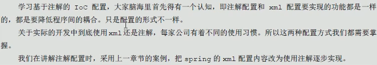
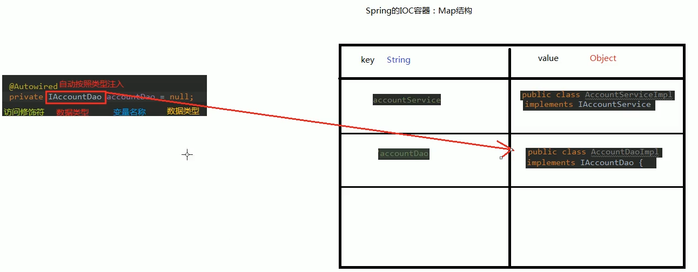

# 04.Spring中IOC的常用注解

- 笔记本：16.Spring
- 创建时间：2020-03-22 10:54:26 UTC
- 更新时间：2020-03-22 16:46:54 UTC
- 印象笔记 GUID：88e65126-4790-4c91-81e6-da7f587c9882



- 曾经xml的配置：

```
<bean id="accountService" class="com.liudezhi.service.impl.AccountServiceImpl"
        scope="" init-method="" destory-method="">
    <property name="" value="" | ref=""></property>
</bean>

```

#### 一、用于创建对象的注解

作用和在XML配置文件中编写一个<bean>标签实现的功能时一样的

-
@Component：
 作用：用于把当前类对象存入spring容器中
 属性：value：用于指定bean的id。当我们不写时，它的默认值是当前类名，且首字母小写。

-
@Controller：一般用在表现层

-
@Service：一般用在业务层

-
@Repository：一般用在持久层
 **tips：** Controller、Service、Repository这三个注解它们的作用和属性与Component时一模一样的。它们三个是spring 框架为我们提供明确的三层使用的注解，使我们的三层对象更加清晰。

**eg：**

```
<?xml version="1.0" encoding="UTF-8"?>
<beans xmlns="http://www.springframework.org/schema/beans"
       xmlns:xsi="http://www.w3.org/2001/XMLSchema-instance"
       xmlns:context="http://www.springframework.org/schema/context"
       xsi:schemaLocation="http://www.springframework.org/schema/beans
        https://www.springframework.org/schema/beans/spring-beans.xsd
        http://www.springframework.org/schema/context
        https://www.springframework.org/schema/context/spring-context.xsd">

    <!-- 告知spring在创建容器时要扫描的包，配置所需要的标签不是在beans的约束中，而是一个名称为context名称空间和约束中 -->
    <context:component-scan base-package="com.liudezhi"></context:component-scan>
</beans>

```

```
/**
 * 账户的持久层实现类
 */
@Controller("accountDao")
public class AccountDaoImpl implements AccountDao {

    @Override
    public void saveAccount() {
        System.out.println("保存了账户");
    }
}

```

```
package com.liudezhi.service.impl;

//@Component(value = "accountService")
@Service("accountService")
public class AccountServiceImpl implements AccountService {
    private AccountDao accountDao = new AccountDaoImpl();
    @Override
    public void saveAccount() {
        accountDao.saveAccount();
    }
}

```

```
public class Client {
    /**
     * @param args
     */
    public static void main(String[] args) {
        //1. 获取核心容器对象
        ApplicationContext ac = new ClassPathXmlApplicationContext("bean.xml");
        //2. 根据id获取Bean对象
//        AccountService accountService = (AccountService) ac.getBean("accountServiceImpl"); //如果注解没有指定value，默认是类名第一个字母小写
        AccountService accountSevice = ac.getBean("accountService", AccountService.class);

        AccountDao accountDao = (AccountDao) ac.getBean("accountDao");
        System.out.println(accountSevice);
        System.out.println(accountDao);
    }
}

```

#### 二、用于注入数据的

作用和在XML配置文件中的bean标签中写一个<property>标签的作用时一样的

-
@Autowired：
 作用：

  - 自动按照类型注入。只要容器中有唯一一个bean对象类型和要注入的变量类型匹配，就可以注入成功。

  - 如果IOC容器中没有任何bean的类型和要注入的变量类型匹配，则报错。

  - 如果IOC容器中有多个匹配的bean时，会先根据类型匹配，然后拿变量名和id匹配，如果匹配上，则注入成功，否则报错。

出现位置：可以是变量上，也可以是方法上。
 细节：在使用注解注入时，set方法就不是必须的了。

-
@Qualifier：
 作用：在按照类型注入的基础之上再按照名称注入。它在给类成员注入时不能单独使用。但是在给方法参数注入时可以。
 属性：
 value：用于指定注入bean的id。
 注意：给类成员注入时不能独立使用，要配合@Autowired使用

-
@Resource
 作用：直接按照bean的id注入。它可以独立使用
 属性：
 name：用于指定bean的id.

**tips：** 以上三个注入都只能注入其他bean类型的数据，而基本类型和String类型无法使用上述注解实现。另外，集合类型的注入只能通过XML来实现。

- @Value
 作用：用于注入基本类型和String类型的数据
 属性：
 value：用于指定数据的值。它可以使用spring中SpEL(也就是spring的el表达式).
 SpEL的写法：${表达式}

**eg：**

```
@Service("accountService")
public class AccountServiceImpl implements AccountService {
    @Autowired
    private AccountDao accountDao;
    @Override
    public void saveAccount() {
        accountDao.saveAccount();
    }
}

```



#### 三、用于改变作用范围的

作用和在bean标签中使用scope属性实现的功能时一样的

- @Scope
 作用：用于指定bean的作用范围
 属性：
 value：指定范围的取值。常用取值：singleton prototype

#### 四、和生命周期相关的（了解）

作用和在bean标签中使用init-method 和destory-method的作用时一样的

- @PreDestory
 作用：用于指定销毁方法

- @PostConstruct
 作用：用于指定初始化方法

**eg：**

```
@Service("accountService")
public class AccountServiceImpl implements AccountService {
    @Autowired
    private AccountDao accountDao;
    @Override
    public void saveAccount() {
        accountDao.saveAccount();
    }

    @PostConstruct
    public void init() {
        System.out.println("初始化方法执行了...");
    }

    @PreDestroy
    public void destory() {
        System.out.println("销毁方法执行了...");
    }
}

```

!%5Bd9743fb919ce6fb987487906e91f2773.png%5D(en-resource%3A%2F%2Fdatabase%2F3403%3A1)%0A%0A%0A*%20%E6%9B%BE%E7%BB%8Fxml%E7%9A%84%E9%85%8D%E7%BD%AE%EF%BC%9A%0A%60%60%60xml%0A%3Cbean%20id%3D%22accountService%22%20class%3D%22com.liudezhi.service.impl.AccountServiceImpl%22%0A%20%20%20%20%20%20%20%20scope%3D%22%22%20init-method%3D%22%22%20destory-method%3D%22%22%3E%0A%20%20%20%20%3Cproperty%20name%3D%22%22%20value%3D%22%22%20%7C%20ref%3D%22%22%3E%3C%2Fproperty%3E%0A%3C%2Fbean%3E%0A%60%60%60%0A%23%23%23%23%20%E4%B8%80%E3%80%81%E7%94%A8%E4%BA%8E%E5%88%9B%E5%BB%BA%E5%AF%B9%E8%B1%A1%E7%9A%84%E6%B3%A8%E8%A7%A3%0A%E4%BD%9C%E7%94%A8%E5%92%8C%E5%9C%A8XML%E9%85%8D%E7%BD%AE%E6%96%87%E4%BB%B6%E4%B8%AD%E7%BC%96%E5%86%99%E4%B8%80%E4%B8%AA%3Cbean%3E%E6%A0%87%E7%AD%BE%E5%AE%9E%E7%8E%B0%E7%9A%84%E5%8A%9F%E8%83%BD%E6%97%B6%E4%B8%80%E6%A0%B7%E7%9A%84%0A*%20%40Component%EF%BC%9A%0A%E4%BD%9C%E7%94%A8%EF%BC%9A%E7%94%A8%E4%BA%8E%E6%8A%8A%E5%BD%93%E5%89%8D%E7%B1%BB%E5%AF%B9%E8%B1%A1%E5%AD%98%E5%85%A5spring%E5%AE%B9%E5%99%A8%E4%B8%AD%0A%E5%B1%9E%E6%80%A7%EF%BC%9Avalue%EF%BC%9A%E7%94%A8%E4%BA%8E%E6%8C%87%E5%AE%9Abean%E7%9A%84id%E3%80%82%E5%BD%93%E6%88%91%E4%BB%AC%E4%B8%8D%E5%86%99%E6%97%B6%EF%BC%8C%E5%AE%83%E7%9A%84%E9%BB%98%E8%AE%A4%E5%80%BC%E6%98%AF%E5%BD%93%E5%89%8D%E7%B1%BB%E5%90%8D%EF%BC%8C%E4%B8%94%E9%A6%96%E5%AD%97%E6%AF%8D%E5%B0%8F%E5%86%99%E3%80%82%0A%0A*%20%40Controller%EF%BC%9A%E4%B8%80%E8%88%AC%E7%94%A8%E5%9C%A8%E8%A1%A8%E7%8E%B0%E5%B1%82%0A*%20%40Service%EF%BC%9A%E4%B8%80%E8%88%AC%E7%94%A8%E5%9C%A8%E4%B8%9A%E5%8A%A1%E5%B1%82%0A*%20%40Repository%EF%BC%9A%E4%B8%80%E8%88%AC%E7%94%A8%E5%9C%A8%E6%8C%81%E4%B9%85%E5%B1%82%0A**tips%EF%BC%9A**%20Controller%E3%80%81Service%E3%80%81Repository%E8%BF%99%E4%B8%89%E4%B8%AA%E6%B3%A8%E8%A7%A3%E5%AE%83%E4%BB%AC%E7%9A%84%E4%BD%9C%E7%94%A8%E5%92%8C%E5%B1%9E%E6%80%A7%E4%B8%8EComponent%E6%97%B6%E4%B8%80%E6%A8%A1%E4%B8%80%E6%A0%B7%E7%9A%84%E3%80%82%E5%AE%83%E4%BB%AC%E4%B8%89%E4%B8%AA%E6%98%AFspring%20%E6%A1%86%E6%9E%B6%E4%B8%BA%E6%88%91%E4%BB%AC%E6%8F%90%E4%BE%9B%E6%98%8E%E7%A1%AE%E7%9A%84%E4%B8%89%E5%B1%82%E4%BD%BF%E7%94%A8%E7%9A%84%E6%B3%A8%E8%A7%A3%EF%BC%8C%E4%BD%BF%E6%88%91%E4%BB%AC%E7%9A%84%E4%B8%89%E5%B1%82%E5%AF%B9%E8%B1%A1%E6%9B%B4%E5%8A%A0%E6%B8%85%E6%99%B0%E3%80%82%0A%0A%20%20%20%20**eg%EF%BC%9A**%0A%20%20%20%20%60%60%60xml%0A%20%20%20%20%3C%3Fxml%20version%3D%221.0%22%20encoding%3D%22UTF-8%22%3F%3E%0A%20%20%20%20%3Cbeans%20xmlns%3D%22http%3A%2F%2Fwww.springframework.org%2Fschema%2Fbeans%22%0A%20%20%20%20%20%20%20%20%20%20%20xmlns%3Axsi%3D%22http%3A%2F%2Fwww.w3.org%2F2001%2FXMLSchema-instance%22%0A%20%20%20%20%20%20%20%20%20%20%20xmlns%3Acontext%3D%22http%3A%2F%2Fwww.springframework.org%2Fschema%2Fcontext%22%0A%20%20%20%20%20%20%20%20%20%20%20xsi%3AschemaLocation%3D%22http%3A%2F%2Fwww.springframework.org%2Fschema%2Fbeans%0A%20%20%20%20%20%20%20%20%20%20%20%20https%3A%2F%2Fwww.springframework.org%2Fschema%2Fbeans%2Fspring-beans.xsd%0A%20%20%20%20%20%20%20%20%20%20%20%20http%3A%2F%2Fwww.springframework.org%2Fschema%2Fcontext%0A%20%20%20%20%20%20%20%20%20%20%20%20https%3A%2F%2Fwww.springframework.org%2Fschema%2Fcontext%2Fspring-context.xsd%22%3E%0A%0A%20%20%20%20%20%20%20%20%3C!--%20%E5%91%8A%E7%9F%A5spring%E5%9C%A8%E5%88%9B%E5%BB%BA%E5%AE%B9%E5%99%A8%E6%97%B6%E8%A6%81%E6%89%AB%E6%8F%8F%E7%9A%84%E5%8C%85%EF%BC%8C%E9%85%8D%E7%BD%AE%E6%89%80%E9%9C%80%E8%A6%81%E7%9A%84%E6%A0%87%E7%AD%BE%E4%B8%8D%E6%98%AF%E5%9C%A8beans%E7%9A%84%E7%BA%A6%E6%9D%9F%E4%B8%AD%EF%BC%8C%E8%80%8C%E6%98%AF%E4%B8%80%E4%B8%AA%E5%90%8D%E7%A7%B0%E4%B8%BAcontext%E5%90%8D%E7%A7%B0%E7%A9%BA%E9%97%B4%E5%92%8C%E7%BA%A6%E6%9D%9F%E4%B8%AD%20--%3E%0A%20%20%20%20%20%20%20%20%3Ccontext%3Acomponent-scan%20base-package%3D%22com.liudezhi%22%3E%3C%2Fcontext%3Acomponent-scan%3E%0A%20%20%20%20%3C%2Fbeans%3E%0A%20%20%20%20%60%60%60%0A%0A%20%20%20%20%60%60%60java%0A%20%20%20%20%2F**%0A%20%20%20%20%20*%20%E8%B4%A6%E6%88%B7%E7%9A%84%E6%8C%81%E4%B9%85%E5%B1%82%E5%AE%9E%E7%8E%B0%E7%B1%BB%0A%20%20%20%20%20*%2F%0A%20%20%20%20%40Controller(%22accountDao%22)%0A%20%20%20%20public%20class%20AccountDaoImpl%20implements%20AccountDao%20%7B%0A%0A%20%20%20%20%20%20%20%20%40Override%0A%20%20%20%20%20%20%20%20public%20void%20saveAccount()%20%7B%0A%20%20%20%20%20%20%20%20%20%20%20%20System.out.println(%22%E4%BF%9D%E5%AD%98%E4%BA%86%E8%B4%A6%E6%88%B7%22)%3B%0A%20%20%20%20%20%20%20%20%7D%0A%20%20%20%20%7D%0A%20%20%20%20%60%60%60%0A%0A%20%20%20%20%60%60%60java%0A%20%20%20%20package%20com.liudezhi.service.impl%3B%0A%0A%20%20%20%20%2F%2F%40Component(value%20%3D%20%22accountService%22)%0A%20%20%20%20%40Service(%22accountService%22)%0A%20%20%20%20public%20class%20AccountServiceImpl%20implements%20AccountService%20%7B%0A%20%20%20%20%20%20%20%20private%20AccountDao%20accountDao%20%3D%20new%20AccountDaoImpl()%3B%0A%20%20%20%20%20%20%20%20%40Override%0A%20%20%20%20%20%20%20%20public%20void%20saveAccount()%20%7B%0A%20%20%20%20%20%20%20%20%20%20%20%20accountDao.saveAccount()%3B%0A%20%20%20%20%20%20%20%20%7D%0A%20%20%20%20%7D%0A%20%20%20%20%60%60%60%0A%0A%20%20%20%20%60%60%60java%0A%20%20%20%20public%20class%20Client%20%7B%0A%20%20%20%20%20%20%20%20%2F**%0A%20%20%20%20%20%20%20%20%20*%20%40param%20args%0A%20%20%20%20%20%20%20%20%20*%2F%0A%20%20%20%20%20%20%20%20public%20static%20void%20main(String%5B%5D%20args)%20%7B%0A%20%20%20%20%20%20%20%20%20%20%20%20%2F%2F1.%20%E8%8E%B7%E5%8F%96%E6%A0%B8%E5%BF%83%E5%AE%B9%E5%99%A8%E5%AF%B9%E8%B1%A1%0A%20%20%20%20%20%20%20%20%20%20%20%20ApplicationContext%20ac%20%3D%20new%20ClassPathXmlApplicationContext(%22bean.xml%22)%3B%0A%20%20%20%20%20%20%20%20%20%20%20%20%2F%2F2.%20%E6%A0%B9%E6%8D%AEid%E8%8E%B7%E5%8F%96Bean%E5%AF%B9%E8%B1%A1%0A%20%20%20%20%2F%2F%20%20%20%20%20%20%20%20AccountService%20accountService%20%3D%20(AccountService)%20ac.getBean(%22accountServiceImpl%22)%3B%20%2F%2F%E5%A6%82%E6%9E%9C%E6%B3%A8%E8%A7%A3%E6%B2%A1%E6%9C%89%E6%8C%87%E5%AE%9Avalue%EF%BC%8C%E9%BB%98%E8%AE%A4%E6%98%AF%E7%B1%BB%E5%90%8D%E7%AC%AC%E4%B8%80%E4%B8%AA%E5%AD%97%E6%AF%8D%E5%B0%8F%E5%86%99%0A%20%20%20%20%20%20%20%20%20%20%20%20AccountService%20accountSevice%20%3D%20ac.getBean(%22accountService%22%2C%20AccountService.class)%3B%0A%0A%20%20%20%20%20%20%20%20%20%20%20%20AccountDao%20accountDao%20%3D%20(AccountDao)%20ac.getBean(%22accountDao%22)%3B%0A%20%20%20%20%20%20%20%20%20%20%20%20System.out.println(accountSevice)%3B%0A%20%20%20%20%20%20%20%20%20%20%20%20System.out.println(accountDao)%3B%0A%20%20%20%20%20%20%20%20%7D%0A%20%20%20%20%7D%0A%20%20%20%20%60%60%60%0A%0A%0A%23%23%23%23%20%E4%BA%8C%E3%80%81%E7%94%A8%E4%BA%8E%E6%B3%A8%E5%85%A5%E6%95%B0%E6%8D%AE%E7%9A%84%0A%E4%BD%9C%E7%94%A8%E5%92%8C%E5%9C%A8XML%E9%85%8D%E7%BD%AE%E6%96%87%E4%BB%B6%E4%B8%AD%E7%9A%84bean%E6%A0%87%E7%AD%BE%E4%B8%AD%E5%86%99%E4%B8%80%E4%B8%AA%3Cproperty%3E%E6%A0%87%E7%AD%BE%E7%9A%84%E4%BD%9C%E7%94%A8%E6%97%B6%E4%B8%80%E6%A0%B7%E7%9A%84%0A*%20%40Autowired%EF%BC%9A%0A%E4%BD%9C%E7%94%A8%EF%BC%9A%0A%20%20%20%20*%20%E8%87%AA%E5%8A%A8%E6%8C%89%E7%85%A7%E7%B1%BB%E5%9E%8B%E6%B3%A8%E5%85%A5%E3%80%82%E5%8F%AA%E8%A6%81%E5%AE%B9%E5%99%A8%E4%B8%AD%E6%9C%89%E5%94%AF%E4%B8%80%E4%B8%80%E4%B8%AAbean%E5%AF%B9%E8%B1%A1%E7%B1%BB%E5%9E%8B%E5%92%8C%E8%A6%81%E6%B3%A8%E5%85%A5%E7%9A%84%E5%8F%98%E9%87%8F%E7%B1%BB%E5%9E%8B%E5%8C%B9%E9%85%8D%EF%BC%8C%E5%B0%B1%E5%8F%AF%E4%BB%A5%E6%B3%A8%E5%85%A5%E6%88%90%E5%8A%9F%E3%80%82%0A%20%20%20%20*%20%E5%A6%82%E6%9E%9CIOC%E5%AE%B9%E5%99%A8%E4%B8%AD%E6%B2%A1%E6%9C%89%E4%BB%BB%E4%BD%95bean%E7%9A%84%E7%B1%BB%E5%9E%8B%E5%92%8C%E8%A6%81%E6%B3%A8%E5%85%A5%E7%9A%84%E5%8F%98%E9%87%8F%E7%B1%BB%E5%9E%8B%E5%8C%B9%E9%85%8D%EF%BC%8C%E5%88%99%E6%8A%A5%E9%94%99%E3%80%82%0A%20%20%20%20*%20%E5%A6%82%E6%9E%9CIOC%E5%AE%B9%E5%99%A8%E4%B8%AD%E6%9C%89%E5%A4%9A%E4%B8%AA%E5%8C%B9%E9%85%8D%E7%9A%84bean%E6%97%B6%EF%BC%8C%E4%BC%9A%E5%85%88%E6%A0%B9%E6%8D%AE%E7%B1%BB%E5%9E%8B%E5%8C%B9%E9%85%8D%EF%BC%8C%E7%84%B6%E5%90%8E%E6%8B%BF%E5%8F%98%E9%87%8F%E5%90%8D%E5%92%8Cid%E5%8C%B9%E9%85%8D%EF%BC%8C%E5%A6%82%E6%9E%9C%E5%8C%B9%E9%85%8D%E4%B8%8A%EF%BC%8C%E5%88%99%E6%B3%A8%E5%85%A5%E6%88%90%E5%8A%9F%EF%BC%8C%E5%90%A6%E5%88%99%E6%8A%A5%E9%94%99%E3%80%82%0A%20%20%20%20%0A%20%20%20%20%E5%87%BA%E7%8E%B0%E4%BD%8D%E7%BD%AE%EF%BC%9A%E5%8F%AF%E4%BB%A5%E6%98%AF%E5%8F%98%E9%87%8F%E4%B8%8A%EF%BC%8C%E4%B9%9F%E5%8F%AF%E4%BB%A5%E6%98%AF%E6%96%B9%E6%B3%95%E4%B8%8A%E3%80%82%0A%20%20%20%20%E7%BB%86%E8%8A%82%EF%BC%9A%E5%9C%A8%E4%BD%BF%E7%94%A8%E6%B3%A8%E8%A7%A3%E6%B3%A8%E5%85%A5%E6%97%B6%EF%BC%8Cset%E6%96%B9%E6%B3%95%E5%B0%B1%E4%B8%8D%E6%98%AF%E5%BF%85%E9%A1%BB%E7%9A%84%E4%BA%86%E3%80%82%0A%0A*%20%40Qualifier%EF%BC%9A%0A%E4%BD%9C%E7%94%A8%EF%BC%9A%E5%9C%A8%E6%8C%89%E7%85%A7%E7%B1%BB%E5%9E%8B%E6%B3%A8%E5%85%A5%E7%9A%84%E5%9F%BA%E7%A1%80%E4%B9%8B%E4%B8%8A%E5%86%8D%E6%8C%89%E7%85%A7%E5%90%8D%E7%A7%B0%E6%B3%A8%E5%85%A5%E3%80%82%E5%AE%83%E5%9C%A8%E7%BB%99%E7%B1%BB%E6%88%90%E5%91%98%E6%B3%A8%E5%85%A5%E6%97%B6%E4%B8%8D%E8%83%BD%E5%8D%95%E7%8B%AC%E4%BD%BF%E7%94%A8%E3%80%82%E4%BD%86%E6%98%AF%E5%9C%A8%E7%BB%99%E6%96%B9%E6%B3%95%E5%8F%82%E6%95%B0%E6%B3%A8%E5%85%A5%E6%97%B6%E5%8F%AF%E4%BB%A5%E3%80%82%0A%E5%B1%9E%E6%80%A7%EF%BC%9A%0A%26nbsp%3B%26nbsp%3B%26nbsp%3B%26nbsp%3Bvalue%EF%BC%9A%E7%94%A8%E4%BA%8E%E6%8C%87%E5%AE%9A%E6%B3%A8%E5%85%A5bean%E7%9A%84id%E3%80%82%0A%E6%B3%A8%E6%84%8F%EF%BC%9A%E7%BB%99%E7%B1%BB%E6%88%90%E5%91%98%E6%B3%A8%E5%85%A5%E6%97%B6%E4%B8%8D%E8%83%BD%E7%8B%AC%E7%AB%8B%E4%BD%BF%E7%94%A8%EF%BC%8C%E8%A6%81%E9%85%8D%E5%90%88%40Autowired%E4%BD%BF%E7%94%A8%0A%0A*%20%40Resource%0A%E4%BD%9C%E7%94%A8%EF%BC%9A%E7%9B%B4%E6%8E%A5%E6%8C%89%E7%85%A7bean%E7%9A%84id%E6%B3%A8%E5%85%A5%E3%80%82%E5%AE%83%E5%8F%AF%E4%BB%A5%E7%8B%AC%E7%AB%8B%E4%BD%BF%E7%94%A8%0A%E5%B1%9E%E6%80%A7%EF%BC%9A%0A%26nbsp%3B%26nbsp%3B%26nbsp%3B%26nbsp%3Bname%EF%BC%9A%E7%94%A8%E4%BA%8E%E6%8C%87%E5%AE%9Abean%E7%9A%84id.%0A%0A**tips%EF%BC%9A**%20%E4%BB%A5%E4%B8%8A%E4%B8%89%E4%B8%AA%E6%B3%A8%E5%85%A5%E9%83%BD%E5%8F%AA%E8%83%BD%E6%B3%A8%E5%85%A5%E5%85%B6%E4%BB%96bean%E7%B1%BB%E5%9E%8B%E7%9A%84%E6%95%B0%E6%8D%AE%EF%BC%8C%E8%80%8C%E5%9F%BA%E6%9C%AC%E7%B1%BB%E5%9E%8B%E5%92%8CString%E7%B1%BB%E5%9E%8B%E6%97%A0%E6%B3%95%E4%BD%BF%E7%94%A8%E4%B8%8A%E8%BF%B0%E6%B3%A8%E8%A7%A3%E5%AE%9E%E7%8E%B0%E3%80%82%E5%8F%A6%E5%A4%96%EF%BC%8C%E9%9B%86%E5%90%88%E7%B1%BB%E5%9E%8B%E7%9A%84%E6%B3%A8%E5%85%A5%E5%8F%AA%E8%83%BD%E9%80%9A%E8%BF%87XML%E6%9D%A5%E5%AE%9E%E7%8E%B0%E3%80%82%0A%0A*%20%40Value%0A%E4%BD%9C%E7%94%A8%EF%BC%9A%E7%94%A8%E4%BA%8E%E6%B3%A8%E5%85%A5%E5%9F%BA%E6%9C%AC%E7%B1%BB%E5%9E%8B%E5%92%8CString%E7%B1%BB%E5%9E%8B%E7%9A%84%E6%95%B0%E6%8D%AE%0A%E5%B1%9E%E6%80%A7%EF%BC%9A%0A%26nbsp%3B%26nbsp%3B%26nbsp%3B%26nbsp%3Bvalue%EF%BC%9A%E7%94%A8%E4%BA%8E%E6%8C%87%E5%AE%9A%E6%95%B0%E6%8D%AE%E7%9A%84%E5%80%BC%E3%80%82%E5%AE%83%E5%8F%AF%E4%BB%A5%E4%BD%BF%E7%94%A8spring%E4%B8%ADSpEL(%E4%B9%9F%E5%B0%B1%E6%98%AFspring%E7%9A%84el%E8%A1%A8%E8%BE%BE%E5%BC%8F).%0ASpEL%E7%9A%84%E5%86%99%E6%B3%95%EF%BC%9A%24%7B%E8%A1%A8%E8%BE%BE%E5%BC%8F%7D%0A%0A%0A**eg%EF%BC%9A**%0A%60%60%60java%0A%40Service(%22accountService%22)%0Apublic%20class%20AccountServiceImpl%20implements%20AccountService%20%7B%0A%20%20%20%20%40Autowired%0A%20%20%20%20private%20AccountDao%20accountDao%3B%0A%20%20%20%20%40Override%0A%20%20%20%20public%20void%20saveAccount()%20%7B%0A%20%20%20%20%20%20%20%20accountDao.saveAccount()%3B%0A%20%20%20%20%7D%0A%7D%0A%60%60%60%0A!%5B8cb4c6640cd2b42e90dc4c7f6934f09b.png%5D(en-resource%3A%2F%2Fdatabase%2F3405%3A0)%0A%0A%0A%23%23%23%23%20%E4%B8%89%E3%80%81%E7%94%A8%E4%BA%8E%E6%94%B9%E5%8F%98%E4%BD%9C%E7%94%A8%E8%8C%83%E5%9B%B4%E7%9A%84%0A%E4%BD%9C%E7%94%A8%E5%92%8C%E5%9C%A8bean%E6%A0%87%E7%AD%BE%E4%B8%AD%E4%BD%BF%E7%94%A8scope%E5%B1%9E%E6%80%A7%E5%AE%9E%E7%8E%B0%E7%9A%84%E5%8A%9F%E8%83%BD%E6%97%B6%E4%B8%80%E6%A0%B7%E7%9A%84%0A*%20%40Scope%0A%E4%BD%9C%E7%94%A8%EF%BC%9A%E7%94%A8%E4%BA%8E%E6%8C%87%E5%AE%9Abean%E7%9A%84%E4%BD%9C%E7%94%A8%E8%8C%83%E5%9B%B4%0A%E5%B1%9E%E6%80%A7%EF%BC%9A%0A%26nbsp%3B%26nbsp%3B%26nbsp%3B%26nbsp%3Bvalue%EF%BC%9A%E6%8C%87%E5%AE%9A%E8%8C%83%E5%9B%B4%E7%9A%84%E5%8F%96%E5%80%BC%E3%80%82%E5%B8%B8%E7%94%A8%E5%8F%96%E5%80%BC%EF%BC%9Asingleton%20prototype%0A%0A%23%23%23%23%20%E5%9B%9B%E3%80%81%E5%92%8C%E7%94%9F%E5%91%BD%E5%91%A8%E6%9C%9F%E7%9B%B8%E5%85%B3%E7%9A%84%EF%BC%88%E4%BA%86%E8%A7%A3%EF%BC%89%0A%E4%BD%9C%E7%94%A8%E5%92%8C%E5%9C%A8bean%E6%A0%87%E7%AD%BE%E4%B8%AD%E4%BD%BF%E7%94%A8init-method%20%E5%92%8Cdestory-method%E7%9A%84%E4%BD%9C%E7%94%A8%E6%97%B6%E4%B8%80%E6%A0%B7%E7%9A%84%0A*%20%40PreDestory%0A%E4%BD%9C%E7%94%A8%EF%BC%9A%E7%94%A8%E4%BA%8E%E6%8C%87%E5%AE%9A%E9%94%80%E6%AF%81%E6%96%B9%E6%B3%95%0A*%20%40PostConstruct%0A%E4%BD%9C%E7%94%A8%EF%BC%9A%E7%94%A8%E4%BA%8E%E6%8C%87%E5%AE%9A%E5%88%9D%E5%A7%8B%E5%8C%96%E6%96%B9%E6%B3%95%0A%0A**eg%EF%BC%9A**%0A%60%60%60java%0A%40Service(%22accountService%22)%0Apublic%20class%20AccountServiceImpl%20implements%20AccountService%20%7B%0A%20%20%20%20%40Autowired%0A%20%20%20%20private%20AccountDao%20accountDao%3B%0A%20%20%20%20%40Override%0A%20%20%20%20public%20void%20saveAccount()%20%7B%0A%20%20%20%20%20%20%20%20accountDao.saveAccount()%3B%0A%20%20%20%20%7D%0A%0A%20%20%20%20%40PostConstruct%0A%20%20%20%20public%20void%20init()%20%7B%0A%20%20%20%20%20%20%20%20System.out.println(%22%E5%88%9D%E5%A7%8B%E5%8C%96%E6%96%B9%E6%B3%95%E6%89%A7%E8%A1%8C%E4%BA%86...%22)%3B%0A%20%20%20%20%7D%0A%0A%20%20%20%20%40PreDestroy%0A%20%20%20%20public%20void%20destory()%20%7B%0A%20%20%20%20%20%20%20%20System.out.println(%22%E9%94%80%E6%AF%81%E6%96%B9%E6%B3%95%E6%89%A7%E8%A1%8C%E4%BA%86...%22)%3B%0A%20%20%20%20%7D%0A%7D%0A%60%60%60%0A%0A!%5B5fa4094537eadef5af7ab9332a6410de.png%5D(en-resource%3A%2F%2Fdatabase%2F3409%3A0)%0A
