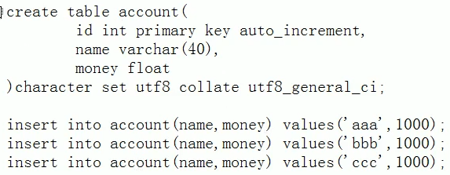
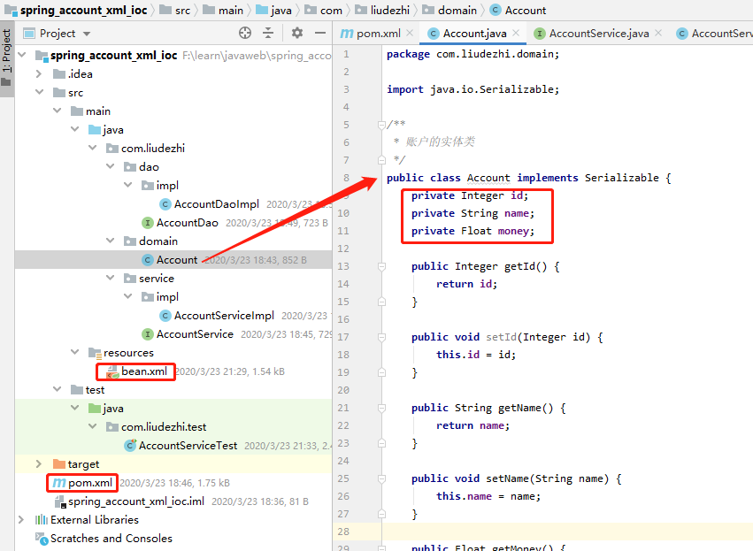

# 05.基于XML的IOC案例：单表CRUD及使用已知注解对案例进行改造

- 笔记本：16.Spring
- 创建时间：2020-03-23 13:38:57 UTC
- 更新时间：2020-03-23 14:10:53 UTC
- 印象笔记 GUID：f9f6aec4-080b-44cc-a279-5bb5333f4644

**数据库**
 

**项目结构**
 

**pom.xml**

```
<?xml version="1.0" encoding="UTF-8"?>
<project xmlns="http://maven.apache.org/POM/4.0.0"
         xmlns:xsi="http://www.w3.org/2001/XMLSchema-instance"
         xsi:schemaLocation="http://maven.apache.org/POM/4.0.0 http://maven.apache.org/xsd/maven-4.0.0.xsd">
    <modelVersion>4.0.0</modelVersion>

    <groupId>com.liudezhi</groupId>
    <artifactId>spring_account_xml_ioc</artifactId>
    <version>1.0-SNAPSHOT</version>
    <build>
        <plugins>
            <plugin>
                <groupId>org.apache.maven.plugins</groupId>
                <artifactId>maven-compiler-plugin</artifactId>
                <configuration>
                    <source>6</source>
                    <target>6</target>
                </configuration>
            </plugin>
        </plugins>
    </build>
    <packaging>jar</packaging>

    <dependencies>
        <dependency>
            <groupId>org.springframework</groupId>
            <artifactId>spring-context</artifactId>
            <version>5.2.4.RELEASE</version>
        </dependency>

        <dependency>
            <groupId>commons-dbutils</groupId>
            <artifactId>commons-dbutils</artifactId>
            <version>1.6</version>
        </dependency>

        <dependency>
            <groupId>mysql</groupId>
            <artifactId>mysql-connector-java</artifactId>
            <version>8.0.11</version>
        </dependency>

        <dependency>
            <groupId>com.mchange</groupId>
            <artifactId>c3p0</artifactId>
            <version>0.9.5.2</version>
        </dependency>

        <dependency>
            <groupId>junit</groupId>
            <artifactId>junit</artifactId>
            <version>4.12</version>
        </dependency>
    </dependencies>

</project>

```

**bean.xml**

```
<?xml version="1.0" encoding="UTF-8"?>
<beans xmlns="http://www.springframework.org/schema/beans"
       xmlns:xsi="http://www.w3.org/2001/XMLSchema-instance"
       xsi:schemaLocation="http://www.springframework.org/schema/beans
        https://www.springframework.org/schema/beans/spring-beans.xsd">

    <!-- 配置service -->
    <bean id="accountService" class="com.liudezhi.service.impl.AccountServiceImpl">
        <!-- 注入dao -->
        <property name="acountDao" ref="accountDao"></property>
    </bean>

    <!-- 配置dao对象 -->
    <bean id="accountDao" class="com.liudezhi.dao.impl.AccountDaoImpl">
        <!-- 注入QueryRunner -->
        <property name="runner" ref="runner"></property>
    </bean>

    <!-- 配置QueryRunner -->
    <bean id="runner" class="org.apache.commons.dbutils.QueryRunner" scope="prototype">
        <!-- 注入数据源 -->
        <constructor-arg name="ds" ref="dataSource"></constructor-arg>
    </bean>

    <!-- 配置数据源 -->
    <bean id="dataSource" class="com.mchange.v2.c3p0.ComboPooledDataSource">
        <!-- 链接数据库的必备信息 -->
        <property name="driverClass" value="com.mysql.cj.jdbc.Driver"></property>
        <property name="jdbcUrl" value="jdbc:mysql://localhost:3306/learn_spring?useUnicode=true&amp;characterEncoding=utf-8&amp;useSSL=false&amp;serverTimezone=GMT"></property>
        <property name="user" value="root"></property>
        <property name="password" value="Liudezhi"></property>
    </bean>
</beans>

```

**AccountServiceImpl**

```
package com.liudezhi.service.impl;
/**
 * 账户的业务层实现类
 */
public class AccountServiceImpl implements AccountService {

    private AccountDao accountDao;

    public void setAcountDao(AccountDao accountDao) {
        this.accountDao = accountDao;
    }

    @Override
    public List<Account> findAllAccount() {
        return accountDao.findAllAccount();
    }

    @Override
    public Account findAcccountById(Integer accountId) {
        return accountDao.findAcccountById(accountId);
    }

    @Override
    public void saveAccount(Account account) {
        accountDao.saveAccount(account);
    }

    @Override
    public void updateAccount(Account account) {
        accountDao.updateAccount(account);
    }

    @Override
    public void deleteAccount(Integer accountId) {
        accountDao.deleteAccount(accountId);
    }
}

```

**AccountDaoImpl**

```
package com.liudezhi.dao.impl;
/**
 * 账户的持久层实现类
 */
public class AccountDaoImpl implements AccountDao {

    private QueryRunner runner;

    public void setRunner(QueryRunner runner) {
        this.runner = runner;
    }

    @Override
    public List<Account> findAllAccount() {
        try {
            return runner.query("select * from account", new BeanListHandler<Account>(Account.class));
        } catch (SQLException e) {
            throw new RuntimeException(e);
        }
    }

    @Override
    public Account findAcccountById(Integer accountId) {
        try {
            return runner.query("select * from account where id = ?", new BeanHandler<Account>(Account.class), accountId);
        } catch (SQLException e) {
            throw new RuntimeException(e);
        }
    }

    @Override
    public void saveAccount(Account account) {
        try {
            runner.update("insert into account(name,money) values(?,?)", account.getName(), account.getMoney());
        } catch (SQLException e) {
            throw new RuntimeException(e);
        }
    }

    @Override
    public void updateAccount(Account account) {
        try {
            runner.update("update account set name=?,money=? where id=?", account.getName(), account.getMoney(), account.getId());
        } catch (SQLException e) {
            throw new RuntimeException(e);
        }
    }

    @Override
    public void deleteAccount(Integer accountId) {
        try {
            runner.update("delete from account where id=?", accountId);
        } catch (SQLException e) {
            throw new RuntimeException(e);
        }
    }
}

```

**AccountServiceTest**

```
package com.liudezhi.test;

/**
 * 使用Junit单元测试，测试我们的配置
 */
public class AccountServiceTest {
    @Test
    public void testFindAll() {
        //1. 获取容器
        ApplicationContext ac = new ClassPathXmlApplicationContext("bean.xml");
        //2. 得到业务层对象
        AccountService accountService = ac.getBean("accountService", AccountService.class);
        //3. 执行方法
        List<Account> accounts = accountService.findAllAccount();
        for (Account account : accounts) {
            System.out.println(account);
        }
    }

    @Test
    public void testFindOne() {
        //1. 获取容器
        ApplicationContext ac = new ClassPathXmlApplicationContext("bean.xml");
        //2. 得到业务层对象
        AccountService accountService = ac.getBean("accountService", AccountService.class);
        Account acccount = accountService.findAcccountById(1);
        System.out.println(acccount);
    }

    @Test
    public void testSave() {
        Account account = new Account();
        account.setName("test");
        account.setMoney(50000f);
        //1. 获取容器
        ApplicationContext ac = new ClassPathXmlApplicationContext("bean.xml");
        //2. 得到业务层对象
        AccountService accountService = ac.getBean("accountService", AccountService.class);
        accountService.saveAccount(account);
    }

    @Test
    public void testUpdate() {
        //1. 获取容器
        ApplicationContext ac = new ClassPathXmlApplicationContext("bean.xml");
        //2. 得到业务层对象
        AccountService accountService = ac.getBean("accountService", AccountService.class);
        Account account = accountService.findAcccountById(4);
        account.setMoney(60000f);
        accountService.updateAccount(account);
    }

    @Test
    public void testDelete() {
        //1. 获取容器
        ApplicationContext ac = new ClassPathXmlApplicationContext("bean.xml");
        //2. 得到业务层对象
        AccountService accountService = ac.getBean("accountService", AccountService.class);
        accountService.deleteAccount(4);
    }
}

```

**使用注解对项目进行改造**

**bean.xml**

```
<?xml version="1.0" encoding="UTF-8"?>
<beans xmlns="http://www.springframework.org/schema/beans"
       xmlns:xsi="http://www.w3.org/2001/XMLSchema-instance"
       xmlns:context="http://www.springframework.org/schema/context"
       xsi:schemaLocation="http://www.springframework.org/schema/beans
        https://www.springframework.org/schema/beans/spring-beans.xsd
        http://www.springframework.org/schema/context
        https://www.springframework.org/schema/context/spring-context.xsd">

    <!-- 告知spring在创建容器时要扫描的包 -->
    <context:component-scan base-package="com.liudezhi"></context:component-scan>

    <!-- 配置QueryRunner -->
    <bean id="runner" class="org.apache.commons.dbutils.QueryRunner" scope="prototype">
        <!-- 注入数据源 -->
        <constructor-arg name="ds" ref="dataSource"></constructor-arg>
    </bean>

    <!-- 配置数据源 -->
    <bean id="dataSource" class="com.mchange.v2.c3p0.ComboPooledDataSource">
        <!-- 链接数据库的必备信息 -->
        <property name="driverClass" value="com.mysql.cj.jdbc.Driver"></property>
        <property name="jdbcUrl" value="jdbc:mysql://localhost:3306/learn_spring?useUnicode=true&amp;characterEncoding=utf-8&amp;useSSL=false&amp;serverTimezone=GMT"></property>
        <property name="user" value="root"></property>
        <property name="password" value="Liudezhi"></property>
    </bean>
</beans>

```

**AccountServiceImpl**

```
package com.liudezhi.service.impl;
/**
 * 账户的业务层实现类
 */
@Service("accountService")
public class AccountServiceImpl implements AccountService {

    @Autowired
    private AccountDao accountDao;

    @Override
    public List<Account> findAllAccount() {
        return accountDao.findAllAccount();
    }

    @Override
    public Account findAcccountById(Integer accountId) {
        return accountDao.findAcccountById(accountId);
    }

    @Override
    public void saveAccount(Account account) {
        accountDao.saveAccount(account);
    }

    @Override
    public void updateAccount(Account account) {
        accountDao.updateAccount(account);
    }

    @Override
    public void deleteAccount(Integer accountId) {
        accountDao.deleteAccount(accountId);
    }
}

```

**AccountDaoImpl**

```
package com.liudezhi.dao.impl;

import com.liudezhi.dao.AccountDao;
import com.liudezhi.domain.Account;
import org.apache.commons.dbutils.QueryRunner;
import org.apache.commons.dbutils.handlers.BeanHandler;
import org.apache.commons.dbutils.handlers.BeanListHandler;
import org.springframework.beans.factory.annotation.Autowired;
import org.springframework.stereotype.Repository;

import java.sql.SQLException;
import java.util.List;

/**
 * 账户的持久层实现类
 */
@Repository("accountDao")
public class AccountDaoImpl implements AccountDao {

    @Autowired
    private QueryRunner runner;

    @Override
    public List<Account> findAllAccount() {
        try {
            return runner.query("select * from account", new BeanListHandler<Account>(Account.class));
        } catch (SQLException e) {
            throw new RuntimeException(e);
        }
    }

    @Override
    public Account findAcccountById(Integer accountId) {
        try {
            return runner.query("select * from account where id = ?", new BeanHandler<Account>(Account.class), accountId);
        } catch (SQLException e) {
            throw new RuntimeException(e);
        }
    }

    @Override
    public void saveAccount(Account account) {
        try {
            runner.update("insert into account(name,money) values(?,?)", account.getName(), account.getMoney());
        } catch (SQLException e) {
            throw new RuntimeException(e);
        }
    }

    @Override
    public void updateAccount(Account account) {
        try {
            runner.update("update account set name=?,money=? where id=?", account.getName(), account.getMoney(), account.getId());
        } catch (SQLException e) {
            throw new RuntimeException(e);
        }
    }

    @Override
    public void deleteAccount(Integer accountId) {
        try {
            runner.update("delete from account where id=?", accountId);
        } catch (SQLException e) {
            throw new RuntimeException(e);
        }
    }
}

```

**%E6%95%B0%E6%8D%AE%E5%BA%93**%20%0A!%5B89e8a132ea3ab2efff62acfe3402a9f4.png%5D(en-resource%3A%2F%2Fdatabase%2F3413%3A1)%0A%0A**%E9%A1%B9%E7%9B%AE%E7%BB%93%E6%9E%84**%0A!%5B40fa2d339816b775168a2dedcd447f78.png%5D(en-resource%3A%2F%2Fdatabase%2F3415%3A1)%0A%0A%0A**pom.xml**%0A%60%60%60xml%0A%3C%3Fxml%20version%3D%221.0%22%20encoding%3D%22UTF-8%22%3F%3E%0A%3Cproject%20xmlns%3D%22http%3A%2F%2Fmaven.apache.org%2FPOM%2F4.0.0%22%0A%20%20%20%20%20%20%20%20%20xmlns%3Axsi%3D%22http%3A%2F%2Fwww.w3.org%2F2001%2FXMLSchema-instance%22%0A%20%20%20%20%20%20%20%20%20xsi%3AschemaLocation%3D%22http%3A%2F%2Fmaven.apache.org%2FPOM%2F4.0.0%20http%3A%2F%2Fmaven.apache.org%2Fxsd%2Fmaven-4.0.0.xsd%22%3E%0A%20%20%20%20%3CmodelVersion%3E4.0.0%3C%2FmodelVersion%3E%0A%0A%20%20%20%20%3CgroupId%3Ecom.liudezhi%3C%2FgroupId%3E%0A%20%20%20%20%3CartifactId%3Espring_account_xml_ioc%3C%2FartifactId%3E%0A%20%20%20%20%3Cversion%3E1.0-SNAPSHOT%3C%2Fversion%3E%0A%20%20%20%20%3Cbuild%3E%0A%20%20%20%20%20%20%20%20%3Cplugins%3E%0A%20%20%20%20%20%20%20%20%20%20%20%20%3Cplugin%3E%0A%20%20%20%20%20%20%20%20%20%20%20%20%20%20%20%20%3CgroupId%3Eorg.apache.maven.plugins%3C%2FgroupId%3E%0A%20%20%20%20%20%20%20%20%20%20%20%20%20%20%20%20%3CartifactId%3Emaven-compiler-plugin%3C%2FartifactId%3E%0A%20%20%20%20%20%20%20%20%20%20%20%20%20%20%20%20%3Cconfiguration%3E%0A%20%20%20%20%20%20%20%20%20%20%20%20%20%20%20%20%20%20%20%20%3Csource%3E6%3C%2Fsource%3E%0A%20%20%20%20%20%20%20%20%20%20%20%20%20%20%20%20%20%20%20%20%3Ctarget%3E6%3C%2Ftarget%3E%0A%20%20%20%20%20%20%20%20%20%20%20%20%20%20%20%20%3C%2Fconfiguration%3E%0A%20%20%20%20%20%20%20%20%20%20%20%20%3C%2Fplugin%3E%0A%20%20%20%20%20%20%20%20%3C%2Fplugins%3E%0A%20%20%20%20%3C%2Fbuild%3E%0A%20%20%20%20%3Cpackaging%3Ejar%3C%2Fpackaging%3E%0A%0A%20%20%20%20%3Cdependencies%3E%0A%20%20%20%20%20%20%20%20%3Cdependency%3E%0A%20%20%20%20%20%20%20%20%20%20%20%20%3CgroupId%3Eorg.springframework%3C%2FgroupId%3E%0A%20%20%20%20%20%20%20%20%20%20%20%20%3CartifactId%3Espring-context%3C%2FartifactId%3E%0A%20%20%20%20%20%20%20%20%20%20%20%20%3Cversion%3E5.2.4.RELEASE%3C%2Fversion%3E%0A%20%20%20%20%20%20%20%20%3C%2Fdependency%3E%0A%0A%20%20%20%20%20%20%20%20%3Cdependency%3E%0A%20%20%20%20%20%20%20%20%20%20%20%20%3CgroupId%3Ecommons-dbutils%3C%2FgroupId%3E%0A%20%20%20%20%20%20%20%20%20%20%20%20%3CartifactId%3Ecommons-dbutils%3C%2FartifactId%3E%0A%20%20%20%20%20%20%20%20%20%20%20%20%3Cversion%3E1.6%3C%2Fversion%3E%0A%20%20%20%20%20%20%20%20%3C%2Fdependency%3E%0A%0A%20%20%20%20%20%20%20%20%3Cdependency%3E%0A%20%20%20%20%20%20%20%20%20%20%20%20%3CgroupId%3Emysql%3C%2FgroupId%3E%0A%20%20%20%20%20%20%20%20%20%20%20%20%3CartifactId%3Emysql-connector-java%3C%2FartifactId%3E%0A%20%20%20%20%20%20%20%20%20%20%20%20%3Cversion%3E8.0.11%3C%2Fversion%3E%0A%20%20%20%20%20%20%20%20%3C%2Fdependency%3E%0A%0A%20%20%20%20%20%20%20%20%3Cdependency%3E%0A%20%20%20%20%20%20%20%20%20%20%20%20%3CgroupId%3Ecom.mchange%3C%2FgroupId%3E%0A%20%20%20%20%20%20%20%20%20%20%20%20%3CartifactId%3Ec3p0%3C%2FartifactId%3E%0A%20%20%20%20%20%20%20%20%20%20%20%20%3Cversion%3E0.9.5.2%3C%2Fversion%3E%0A%20%20%20%20%20%20%20%20%3C%2Fdependency%3E%0A%0A%20%20%20%20%20%20%20%20%3Cdependency%3E%0A%20%20%20%20%20%20%20%20%20%20%20%20%3CgroupId%3Ejunit%3C%2FgroupId%3E%0A%20%20%20%20%20%20%20%20%20%20%20%20%3CartifactId%3Ejunit%3C%2FartifactId%3E%0A%20%20%20%20%20%20%20%20%20%20%20%20%3Cversion%3E4.12%3C%2Fversion%3E%0A%20%20%20%20%20%20%20%20%3C%2Fdependency%3E%0A%20%20%20%20%3C%2Fdependencies%3E%0A%0A%3C%2Fproject%3E%0A%60%60%60%0A%0A**bean.xml**%0A%60%60%60xml%0A%3C%3Fxml%20version%3D%221.0%22%20encoding%3D%22UTF-8%22%3F%3E%0A%3Cbeans%20xmlns%3D%22http%3A%2F%2Fwww.springframework.org%2Fschema%2Fbeans%22%0A%20%20%20%20%20%20%20xmlns%3Axsi%3D%22http%3A%2F%2Fwww.w3.org%2F2001%2FXMLSchema-instance%22%0A%20%20%20%20%20%20%20xsi%3AschemaLocation%3D%22http%3A%2F%2Fwww.springframework.org%2Fschema%2Fbeans%0A%20%20%20%20%20%20%20%20https%3A%2F%2Fwww.springframework.org%2Fschema%2Fbeans%2Fspring-beans.xsd%22%3E%0A%0A%20%20%20%20%3C!--%20%E9%85%8D%E7%BD%AEservice%20--%3E%0A%20%20%20%20%3Cbean%20id%3D%22accountService%22%20class%3D%22com.liudezhi.service.impl.AccountServiceImpl%22%3E%0A%20%20%20%20%20%20%20%20%3C!--%20%E6%B3%A8%E5%85%A5dao%20--%3E%0A%20%20%20%20%20%20%20%20%3Cproperty%20name%3D%22acountDao%22%20ref%3D%22accountDao%22%3E%3C%2Fproperty%3E%0A%20%20%20%20%3C%2Fbean%3E%0A%0A%20%20%20%20%3C!--%20%E9%85%8D%E7%BD%AEdao%E5%AF%B9%E8%B1%A1%20--%3E%0A%20%20%20%20%3Cbean%20id%3D%22accountDao%22%20class%3D%22com.liudezhi.dao.impl.AccountDaoImpl%22%3E%0A%20%20%20%20%20%20%20%20%3C!--%20%E6%B3%A8%E5%85%A5QueryRunner%20--%3E%0A%20%20%20%20%20%20%20%20%3Cproperty%20name%3D%22runner%22%20ref%3D%22runner%22%3E%3C%2Fproperty%3E%0A%20%20%20%20%3C%2Fbean%3E%0A%0A%20%20%20%20%3C!--%20%E9%85%8D%E7%BD%AEQueryRunner%20--%3E%0A%20%20%20%20%3Cbean%20id%3D%22runner%22%20class%3D%22org.apache.commons.dbutils.QueryRunner%22%20scope%3D%22prototype%22%3E%0A%20%20%20%20%20%20%20%20%3C!--%20%E6%B3%A8%E5%85%A5%E6%95%B0%E6%8D%AE%E6%BA%90%20--%3E%0A%20%20%20%20%20%20%20%20%3Cconstructor-arg%20name%3D%22ds%22%20ref%3D%22dataSource%22%3E%3C%2Fconstructor-arg%3E%0A%20%20%20%20%3C%2Fbean%3E%0A%0A%20%20%20%20%3C!--%20%E9%85%8D%E7%BD%AE%E6%95%B0%E6%8D%AE%E6%BA%90%20--%3E%0A%20%20%20%20%3Cbean%20id%3D%22dataSource%22%20class%3D%22com.mchange.v2.c3p0.ComboPooledDataSource%22%3E%0A%20%20%20%20%20%20%20%20%3C!--%20%E9%93%BE%E6%8E%A5%E6%95%B0%E6%8D%AE%E5%BA%93%E7%9A%84%E5%BF%85%E5%A4%87%E4%BF%A1%E6%81%AF%20--%3E%0A%20%20%20%20%20%20%20%20%3Cproperty%20name%3D%22driverClass%22%20value%3D%22com.mysql.cj.jdbc.Driver%22%3E%3C%2Fproperty%3E%0A%20%20%20%20%20%20%20%20%3Cproperty%20name%3D%22jdbcUrl%22%20value%3D%22jdbc%3Amysql%3A%2F%2Flocalhost%3A3306%2Flearn_spring%3FuseUnicode%3Dtrue%26amp%3BcharacterEncoding%3Dutf-8%26amp%3BuseSSL%3Dfalse%26amp%3BserverTimezone%3DGMT%22%3E%3C%2Fproperty%3E%0A%20%20%20%20%20%20%20%20%3Cproperty%20name%3D%22user%22%20value%3D%22root%22%3E%3C%2Fproperty%3E%0A%20%20%20%20%20%20%20%20%3Cproperty%20name%3D%22password%22%20value%3D%22Liudezhi%22%3E%3C%2Fproperty%3E%0A%20%20%20%20%3C%2Fbean%3E%0A%3C%2Fbeans%3E%0A%60%60%60%0A%0A**AccountServiceImpl**%0A%60%60%60java%0Apackage%20com.liudezhi.service.impl%3B%0A%2F**%0A%20*%20%E8%B4%A6%E6%88%B7%E7%9A%84%E4%B8%9A%E5%8A%A1%E5%B1%82%E5%AE%9E%E7%8E%B0%E7%B1%BB%0A%20*%2F%0Apublic%20class%20AccountServiceImpl%20implements%20AccountService%20%7B%0A%0A%20%20%20%20private%20AccountDao%20accountDao%3B%0A%0A%20%20%20%20public%20void%20setAcountDao(AccountDao%20accountDao)%20%7B%0A%20%20%20%20%20%20%20%20this.accountDao%20%3D%20accountDao%3B%0A%20%20%20%20%7D%0A%0A%20%20%20%20%40Override%0A%20%20%20%20public%20List%3CAccount%3E%20findAllAccount()%20%7B%0A%20%20%20%20%20%20%20%20return%20accountDao.findAllAccount()%3B%0A%20%20%20%20%7D%0A%0A%20%20%20%20%40Override%0A%20%20%20%20public%20Account%20findAcccountById(Integer%20accountId)%20%7B%0A%20%20%20%20%20%20%20%20return%20accountDao.findAcccountById(accountId)%3B%0A%20%20%20%20%7D%0A%0A%20%20%20%20%40Override%0A%20%20%20%20public%20void%20saveAccount(Account%20account)%20%7B%0A%20%20%20%20%20%20%20%20accountDao.saveAccount(account)%3B%0A%20%20%20%20%7D%0A%0A%20%20%20%20%40Override%0A%20%20%20%20public%20void%20updateAccount(Account%20account)%20%7B%0A%20%20%20%20%20%20%20%20accountDao.updateAccount(account)%3B%0A%20%20%20%20%7D%0A%0A%20%20%20%20%40Override%0A%20%20%20%20public%20void%20deleteAccount(Integer%20accountId)%20%7B%0A%20%20%20%20%20%20%20%20accountDao.deleteAccount(accountId)%3B%0A%20%20%20%20%7D%0A%7D%0A%60%60%60%0A%0A**AccountDaoImpl**%0A%60%60%60java%0Apackage%20com.liudezhi.dao.impl%3B%0A%2F**%0A%20*%20%E8%B4%A6%E6%88%B7%E7%9A%84%E6%8C%81%E4%B9%85%E5%B1%82%E5%AE%9E%E7%8E%B0%E7%B1%BB%0A%20*%2F%0Apublic%20class%20AccountDaoImpl%20implements%20AccountDao%20%7B%0A%0A%20%20%20%20private%20QueryRunner%20runner%3B%0A%0A%20%20%20%20public%20void%20setRunner(QueryRunner%20runner)%20%7B%0A%20%20%20%20%20%20%20%20this.runner%20%3D%20runner%3B%0A%20%20%20%20%7D%0A%0A%20%20%20%20%40Override%0A%20%20%20%20public%20List%3CAccount%3E%20findAllAccount()%20%7B%0A%20%20%20%20%20%20%20%20try%20%7B%0A%20%20%20%20%20%20%20%20%20%20%20%20return%20runner.query(%22select%20*%20from%20account%22%2C%20new%20BeanListHandler%3CAccount%3E(Account.class))%3B%0A%20%20%20%20%20%20%20%20%7D%20catch%20(SQLException%20e)%20%7B%0A%20%20%20%20%20%20%20%20%20%20%20%20throw%20new%20RuntimeException(e)%3B%0A%20%20%20%20%20%20%20%20%7D%0A%20%20%20%20%7D%0A%0A%20%20%20%20%40Override%0A%20%20%20%20public%20Account%20findAcccountById(Integer%20accountId)%20%7B%0A%20%20%20%20%20%20%20%20try%20%7B%0A%20%20%20%20%20%20%20%20%20%20%20%20return%20runner.query(%22select%20*%20from%20account%20where%20id%20%3D%20%3F%22%2C%20new%20BeanHandler%3CAccount%3E(Account.class)%2C%20accountId)%3B%0A%20%20%20%20%20%20%20%20%7D%20catch%20(SQLException%20e)%20%7B%0A%20%20%20%20%20%20%20%20%20%20%20%20throw%20new%20RuntimeException(e)%3B%0A%20%20%20%20%20%20%20%20%7D%0A%20%20%20%20%7D%0A%0A%20%20%20%20%40Override%0A%20%20%20%20public%20void%20saveAccount(Account%20account)%20%7B%0A%20%20%20%20%20%20%20%20try%20%7B%0A%20%20%20%20%20%20%20%20%20%20%20%20runner.update(%22insert%20into%20account(name%2Cmoney)%20values(%3F%2C%3F)%22%2C%20account.getName()%2C%20account.getMoney())%3B%0A%20%20%20%20%20%20%20%20%7D%20catch%20(SQLException%20e)%20%7B%0A%20%20%20%20%20%20%20%20%20%20%20%20throw%20new%20RuntimeException(e)%3B%0A%20%20%20%20%20%20%20%20%7D%0A%20%20%20%20%7D%0A%0A%20%20%20%20%40Override%0A%20%20%20%20public%20void%20updateAccount(Account%20account)%20%7B%0A%20%20%20%20%20%20%20%20try%20%7B%0A%20%20%20%20%20%20%20%20%20%20%20%20runner.update(%22update%20account%20set%20name%3D%3F%2Cmoney%3D%3F%20where%20id%3D%3F%22%2C%20account.getName()%2C%20account.getMoney()%2C%20account.getId())%3B%0A%20%20%20%20%20%20%20%20%7D%20catch%20(SQLException%20e)%20%7B%0A%20%20%20%20%20%20%20%20%20%20%20%20throw%20new%20RuntimeException(e)%3B%0A%20%20%20%20%20%20%20%20%7D%0A%20%20%20%20%7D%0A%0A%20%20%20%20%40Override%0A%20%20%20%20public%20void%20deleteAccount(Integer%20accountId)%20%7B%0A%20%20%20%20%20%20%20%20try%20%7B%0A%20%20%20%20%20%20%20%20%20%20%20%20runner.update(%22delete%20from%20account%20where%20id%3D%3F%22%2C%20accountId)%3B%0A%20%20%20%20%20%20%20%20%7D%20catch%20(SQLException%20e)%20%7B%0A%20%20%20%20%20%20%20%20%20%20%20%20throw%20new%20RuntimeException(e)%3B%0A%20%20%20%20%20%20%20%20%7D%0A%20%20%20%20%7D%0A%7D%0A%60%60%60%0A**AccountServiceTest**%0A%60%60%60java%0Apackage%20com.liudezhi.test%3B%0A%0A%2F**%0A%20*%20%E4%BD%BF%E7%94%A8Junit%E5%8D%95%E5%85%83%E6%B5%8B%E8%AF%95%EF%BC%8C%E6%B5%8B%E8%AF%95%E6%88%91%E4%BB%AC%E7%9A%84%E9%85%8D%E7%BD%AE%0A%20*%2F%0Apublic%20class%20AccountServiceTest%20%7B%0A%20%20%20%20%40Test%0A%20%20%20%20public%20void%20testFindAll()%20%7B%0A%20%20%20%20%20%20%20%20%2F%2F1.%20%E8%8E%B7%E5%8F%96%E5%AE%B9%E5%99%A8%0A%20%20%20%20%20%20%20%20ApplicationContext%20ac%20%3D%20new%20ClassPathXmlApplicationContext(%22bean.xml%22)%3B%0A%20%20%20%20%20%20%20%20%2F%2F2.%20%E5%BE%97%E5%88%B0%E4%B8%9A%E5%8A%A1%E5%B1%82%E5%AF%B9%E8%B1%A1%0A%20%20%20%20%20%20%20%20AccountService%20accountService%20%3D%20ac.getBean(%22accountService%22%2C%20AccountService.class)%3B%0A%20%20%20%20%20%20%20%20%2F%2F3.%20%E6%89%A7%E8%A1%8C%E6%96%B9%E6%B3%95%0A%20%20%20%20%20%20%20%20List%3CAccount%3E%20accounts%20%3D%20accountService.findAllAccount()%3B%0A%20%20%20%20%20%20%20%20for%20(Account%20account%20%3A%20accounts)%20%7B%0A%20%20%20%20%20%20%20%20%20%20%20%20System.out.println(account)%3B%0A%20%20%20%20%20%20%20%20%7D%0A%20%20%20%20%7D%0A%0A%20%20%20%20%40Test%0A%20%20%20%20public%20void%20testFindOne()%20%7B%0A%20%20%20%20%20%20%20%20%2F%2F1.%20%E8%8E%B7%E5%8F%96%E5%AE%B9%E5%99%A8%0A%20%20%20%20%20%20%20%20ApplicationContext%20ac%20%3D%20new%20ClassPathXmlApplicationContext(%22bean.xml%22)%3B%0A%20%20%20%20%20%20%20%20%2F%2F2.%20%E5%BE%97%E5%88%B0%E4%B8%9A%E5%8A%A1%E5%B1%82%E5%AF%B9%E8%B1%A1%0A%20%20%20%20%20%20%20%20AccountService%20accountService%20%3D%20ac.getBean(%22accountService%22%2C%20AccountService.class)%3B%0A%20%20%20%20%20%20%20%20Account%20acccount%20%3D%20accountService.findAcccountById(1)%3B%0A%20%20%20%20%20%20%20%20System.out.println(acccount)%3B%0A%20%20%20%20%7D%0A%0A%20%20%20%20%40Test%0A%20%20%20%20public%20void%20testSave()%20%7B%0A%20%20%20%20%20%20%20%20Account%20account%20%3D%20new%20Account()%3B%0A%20%20%20%20%20%20%20%20account.setName(%22test%22)%3B%0A%20%20%20%20%20%20%20%20account.setMoney(50000f)%3B%0A%20%20%20%20%20%20%20%20%2F%2F1.%20%E8%8E%B7%E5%8F%96%E5%AE%B9%E5%99%A8%0A%20%20%20%20%20%20%20%20ApplicationContext%20ac%20%3D%20new%20ClassPathXmlApplicationContext(%22bean.xml%22)%3B%0A%20%20%20%20%20%20%20%20%2F%2F2.%20%E5%BE%97%E5%88%B0%E4%B8%9A%E5%8A%A1%E5%B1%82%E5%AF%B9%E8%B1%A1%0A%20%20%20%20%20%20%20%20AccountService%20accountService%20%3D%20ac.getBean(%22accountService%22%2C%20AccountService.class)%3B%0A%20%20%20%20%20%20%20%20accountService.saveAccount(account)%3B%0A%20%20%20%20%7D%0A%0A%20%20%20%20%40Test%0A%20%20%20%20public%20void%20testUpdate()%20%7B%0A%20%20%20%20%20%20%20%20%2F%2F1.%20%E8%8E%B7%E5%8F%96%E5%AE%B9%E5%99%A8%0A%20%20%20%20%20%20%20%20ApplicationContext%20ac%20%3D%20new%20ClassPathXmlApplicationContext(%22bean.xml%22)%3B%0A%20%20%20%20%20%20%20%20%2F%2F2.%20%E5%BE%97%E5%88%B0%E4%B8%9A%E5%8A%A1%E5%B1%82%E5%AF%B9%E8%B1%A1%0A%20%20%20%20%20%20%20%20AccountService%20accountService%20%3D%20ac.getBean(%22accountService%22%2C%20AccountService.class)%3B%0A%20%20%20%20%20%20%20%20Account%20account%20%3D%20accountService.findAcccountById(4)%3B%0A%20%20%20%20%20%20%20%20account.setMoney(60000f)%3B%0A%20%20%20%20%20%20%20%20accountService.updateAccount(account)%3B%0A%20%20%20%20%7D%0A%0A%20%20%20%20%40Test%0A%20%20%20%20public%20void%20testDelete()%20%7B%0A%20%20%20%20%20%20%20%20%2F%2F1.%20%E8%8E%B7%E5%8F%96%E5%AE%B9%E5%99%A8%0A%20%20%20%20%20%20%20%20ApplicationContext%20ac%20%3D%20new%20ClassPathXmlApplicationContext(%22bean.xml%22)%3B%0A%20%20%20%20%20%20%20%20%2F%2F2.%20%E5%BE%97%E5%88%B0%E4%B8%9A%E5%8A%A1%E5%B1%82%E5%AF%B9%E8%B1%A1%0A%20%20%20%20%20%20%20%20AccountService%20accountService%20%3D%20ac.getBean(%22accountService%22%2C%20AccountService.class)%3B%0A%20%20%20%20%20%20%20%20accountService.deleteAccount(4)%3B%0A%20%20%20%20%7D%0A%7D%0A%60%60%60%0A%0A---%0A%0A**%E4%BD%BF%E7%94%A8%E6%B3%A8%E8%A7%A3%E5%AF%B9%E9%A1%B9%E7%9B%AE%E8%BF%9B%E8%A1%8C%E6%94%B9%E9%80%A0**%0A%0A**bean.xml**%0A%60%60%60xml%0A%3C%3Fxml%20version%3D%221.0%22%20encoding%3D%22UTF-8%22%3F%3E%0A%3Cbeans%20xmlns%3D%22http%3A%2F%2Fwww.springframework.org%2Fschema%2Fbeans%22%0A%20%20%20%20%20%20%20xmlns%3Axsi%3D%22http%3A%2F%2Fwww.w3.org%2F2001%2FXMLSchema-instance%22%0A%20%20%20%20%20%20%20xmlns%3Acontext%3D%22http%3A%2F%2Fwww.springframework.org%2Fschema%2Fcontext%22%0A%20%20%20%20%20%20%20xsi%3AschemaLocation%3D%22http%3A%2F%2Fwww.springframework.org%2Fschema%2Fbeans%0A%20%20%20%20%20%20%20%20https%3A%2F%2Fwww.springframework.org%2Fschema%2Fbeans%2Fspring-beans.xsd%0A%20%20%20%20%20%20%20%20http%3A%2F%2Fwww.springframework.org%2Fschema%2Fcontext%0A%20%20%20%20%20%20%20%20https%3A%2F%2Fwww.springframework.org%2Fschema%2Fcontext%2Fspring-context.xsd%22%3E%0A%0A%20%20%20%20%3C!--%20%E5%91%8A%E7%9F%A5spring%E5%9C%A8%E5%88%9B%E5%BB%BA%E5%AE%B9%E5%99%A8%E6%97%B6%E8%A6%81%E6%89%AB%E6%8F%8F%E7%9A%84%E5%8C%85%20--%3E%0A%20%20%20%20%3Ccontext%3Acomponent-scan%20base-package%3D%22com.liudezhi%22%3E%3C%2Fcontext%3Acomponent-scan%3E%0A%20%20%20%20%0A%20%20%20%20%3C!--%20%E9%85%8D%E7%BD%AEQueryRunner%20--%3E%0A%20%20%20%20%3Cbean%20id%3D%22runner%22%20class%3D%22org.apache.commons.dbutils.QueryRunner%22%20scope%3D%22prototype%22%3E%0A%20%20%20%20%20%20%20%20%3C!--%20%E6%B3%A8%E5%85%A5%E6%95%B0%E6%8D%AE%E6%BA%90%20--%3E%0A%20%20%20%20%20%20%20%20%3Cconstructor-arg%20name%3D%22ds%22%20ref%3D%22dataSource%22%3E%3C%2Fconstructor-arg%3E%0A%20%20%20%20%3C%2Fbean%3E%0A%0A%20%20%20%20%3C!--%20%E9%85%8D%E7%BD%AE%E6%95%B0%E6%8D%AE%E6%BA%90%20--%3E%0A%20%20%20%20%3Cbean%20id%3D%22dataSource%22%20class%3D%22com.mchange.v2.c3p0.ComboPooledDataSource%22%3E%0A%20%20%20%20%20%20%20%20%3C!--%20%E9%93%BE%E6%8E%A5%E6%95%B0%E6%8D%AE%E5%BA%93%E7%9A%84%E5%BF%85%E5%A4%87%E4%BF%A1%E6%81%AF%20--%3E%0A%20%20%20%20%20%20%20%20%3Cproperty%20name%3D%22driverClass%22%20value%3D%22com.mysql.cj.jdbc.Driver%22%3E%3C%2Fproperty%3E%0A%20%20%20%20%20%20%20%20%3Cproperty%20name%3D%22jdbcUrl%22%20value%3D%22jdbc%3Amysql%3A%2F%2Flocalhost%3A3306%2Flearn_spring%3FuseUnicode%3Dtrue%26amp%3BcharacterEncoding%3Dutf-8%26amp%3BuseSSL%3Dfalse%26amp%3BserverTimezone%3DGMT%22%3E%3C%2Fproperty%3E%0A%20%20%20%20%20%20%20%20%3Cproperty%20name%3D%22user%22%20value%3D%22root%22%3E%3C%2Fproperty%3E%0A%20%20%20%20%20%20%20%20%3Cproperty%20name%3D%22password%22%20value%3D%22Liudezhi%22%3E%3C%2Fproperty%3E%0A%20%20%20%20%3C%2Fbean%3E%0A%3C%2Fbeans%3E%0A%60%60%60%0A%0A**AccountServiceImpl**%0A%60%60%60java%0Apackage%20com.liudezhi.service.impl%3B%0A%2F**%0A%20*%20%E8%B4%A6%E6%88%B7%E7%9A%84%E4%B8%9A%E5%8A%A1%E5%B1%82%E5%AE%9E%E7%8E%B0%E7%B1%BB%0A%20*%2F%0A%40Service(%22accountService%22)%0Apublic%20class%20AccountServiceImpl%20implements%20AccountService%20%7B%0A%0A%20%20%20%20%40Autowired%0A%20%20%20%20private%20AccountDao%20accountDao%3B%0A%0A%20%20%20%20%40Override%0A%20%20%20%20public%20List%3CAccount%3E%20findAllAccount()%20%7B%0A%20%20%20%20%20%20%20%20return%20accountDao.findAllAccount()%3B%0A%20%20%20%20%7D%0A%0A%20%20%20%20%40Override%0A%20%20%20%20public%20Account%20findAcccountById(Integer%20accountId)%20%7B%0A%20%20%20%20%20%20%20%20return%20accountDao.findAcccountById(accountId)%3B%0A%20%20%20%20%7D%0A%0A%20%20%20%20%40Override%0A%20%20%20%20public%20void%20saveAccount(Account%20account)%20%7B%0A%20%20%20%20%20%20%20%20accountDao.saveAccount(account)%3B%0A%20%20%20%20%7D%0A%0A%20%20%20%20%40Override%0A%20%20%20%20public%20void%20updateAccount(Account%20account)%20%7B%0A%20%20%20%20%20%20%20%20accountDao.updateAccount(account)%3B%0A%20%20%20%20%7D%0A%0A%20%20%20%20%40Override%0A%20%20%20%20public%20void%20deleteAccount(Integer%20accountId)%20%7B%0A%20%20%20%20%20%20%20%20accountDao.deleteAccount(accountId)%3B%0A%20%20%20%20%7D%0A%7D%0A%60%60%60%0A%0A**AccountDaoImpl**%0A%60%60%60java%0Apackage%20com.liudezhi.dao.impl%3B%0A%2F**%0A%20*%20%E8%B4%A6%E6%88%B7%E7%9A%84%E6%8C%81%E4%B9%85%E5%B1%82%E5%AE%9E%E7%8E%B0%E7%B1%BB%0A%20*%2F%0A%40Repository(%22accountDao%22)%0Apublic%20class%20AccountDaoImpl%20implements%20AccountDao%20%7B%0A%0A%20%20%20%20%40Autowired%0A%20%20%20%20private%20QueryRunner%20runner%3B%0A%0A%20%20%20%20%40Override%0A%20%20%20%20public%20List%3CAccount%3E%20findAllAccount()%20%7B%0A%20%20%20%20%20%20%20%20try%20%7B%0A%20%20%20%20%20%20%20%20%20%20%20%20return%20runner.query(%22select%20*%20from%20account%22%2C%20new%20BeanListHandler%3CAccount%3E(Account.class))%3B%0A%20%20%20%20%20%20%20%20%7D%20catch%20(SQLException%20e)%20%7B%0A%20%20%20%20%20%20%20%20%20%20%20%20throw%20new%20RuntimeException(e)%3B%0A%20%20%20%20%20%20%20%20%7D%0A%20%20%20%20%7D%0A%0A%20%20%20%20%40Override%0A%20%20%20%20public%20Account%20findAcccountById(Integer%20accountId)%20%7B%0A%20%20%20%20%20%20%20%20try%20%7B%0A%20%20%20%20%20%20%20%20%20%20%20%20return%20runner.query(%22select%20*%20from%20account%20where%20id%20%3D%20%3F%22%2C%20new%20BeanHandler%3CAccount%3E(Account.class)%2C%20accountId)%3B%0A%20%20%20%20%20%20%20%20%7D%20catch%20(SQLException%20e)%20%7B%0A%20%20%20%20%20%20%20%20%20%20%20%20throw%20new%20RuntimeException(e)%3B%0A%20%20%20%20%20%20%20%20%7D%0A%20%20%20%20%7D%0A%0A%20%20%20%20%40Override%0A%20%20%20%20public%20void%20saveAccount(Account%20account)%20%7B%0A%20%20%20%20%20%20%20%20try%20%7B%0A%20%20%20%20%20%20%20%20%20%20%20%20runner.update(%22insert%20into%20account(name%2Cmoney)%20values(%3F%2C%3F)%22%2C%20account.getName()%2C%20account.getMoney())%3B%0A%20%20%20%20%20%20%20%20%7D%20catch%20(SQLException%20e)%20%7B%0A%20%20%20%20%20%20%20%20%20%20%20%20throw%20new%20RuntimeException(e)%3B%0A%20%20%20%20%20%20%20%20%7D%0A%20%20%20%20%7D%0A%0A%20%20%20%20%40Override%0A%20%20%20%20public%20void%20updateAccount(Account%20account)%20%7B%0A%20%20%20%20%20%20%20%20try%20%7B%0A%20%20%20%20%20%20%20%20%20%20%20%20runner.update(%22update%20account%20set%20name%3D%3F%2Cmoney%3D%3F%20where%20id%3D%3F%22%2C%20account.getName()%2C%20account.getMoney()%2C%20account.getId())%3B%0A%20%20%20%20%20%20%20%20%7D%20catch%20(SQLException%20e)%20%7B%0A%20%20%20%20%20%20%20%20%20%20%20%20throw%20new%20RuntimeException(e)%3B%0A%20%20%20%20%20%20%20%20%7D%0A%20%20%20%20%7D%0A%0A%20%20%20%20%40Override%0A%20%20%20%20public%20void%20deleteAccount(Integer%20accountId)%20%7B%0A%20%20%20%20%20%20%20%20try%20%7B%0A%20%20%20%20%20%20%20%20%20%20%20%20runner.update(%22delete%20from%20account%20where%20id%3D%3F%22%2C%20accountId)%3B%0A%20%20%20%20%20%20%20%20%7D%20catch%20(SQLException%20e)%20%7B%0A%20%20%20%20%20%20%20%20%20%20%20%20throw%20new%20RuntimeException(e)%3B%0A%20%20%20%20%20%20%20%20%7D%0A%20%20%20%20%7D%0A%7D%0A%60%60%60
