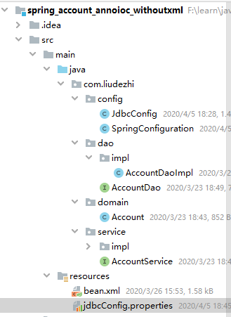

# 06.spring的新注解

- 笔记本：16.Spring
- 创建时间：2020-03-31 12:54:51 UTC
- 更新时间：2020-04-05 12:51:40 UTC
- 原始链接：https://blog.51cto.com/4247649/2118351
- 印象笔记 GUID：799e78b6-59bb-4393-af2e-43eb6e814685

-
@Configuration
 作用：指定当前类是一个配置类
 细节：当配置类作为 AnnotationConfigApplicationContext 对象创建时的参数时，该注解可以不写。

-
@ComponentScan
 作用：用于通过注解指定Spring 在创建容器时要扫描的包*
 属性：

  - value：它和basePackages 的作用是一样的，都是用于指定创建容器时要扫描的包

  - 我们使用此注解就等同于在xml中配置了：`<context:component-scan base-package="com.liudezhi"></context:component-scan>`

  - eg：`@ComponentScan("com.liudezhi")`

-
@Bean
 作用：用于把当前方法的返回值作为bean对象存入spring的ioc容器中
 属性：

  - name：用于指定bean的id。当不写时，默认值时当前方法的名称
 细节：

  - 当我们使用注解配置方法时，如果方法有参数，spring框架会去容器中查找有没有可用的bean对象

  - 查找的方式和AutoWired注解的作用是一样的。

-
@Scope
 @Scope注解是springIoc容器中的一个作用域，在 Spring IoC 容器中具有以下几种作用域：基本作用域singleton（单例）、prototype(多例)，Web 作用域（reqeust、session、globalsession），自定义作用域。

-
@Import
 作用：用于导入其他的配置类
 属性：value：用于指定其他配置类的字节码。当我们使用Import的注解之后，有Import注解的类就是父配置类，而导入的都是子配置类。

-
@PropertySource
 作用：用于指定properties文件的位置
 属性：value：指定文件的名称和路径。关键字：classpath，表示类路径下
 **eg:**
 

```
@Configuration
@ComponentScan({"com.liudezhi"})
@Import(JdbcConfig.class)
@PropertySource("classpath:jdbcConfig.properties")
public class SpringConfiguration {

}

```

```
#jdbcConfig.properties
jdbc.driver=com.mysql.cj.jdbc.Driver
jdbc.url=jdbc:mysql://localhost:3306/learn_spring?useUnicode=true&characterEncoding=utf-8&useSSL=false&serverTimezone=GMT
jdbc.username=root
jdbc.password=Liudezhi

```

```
package com.liudezhi.config;
/**
 * spring 链接数据库相关的配置类
 */
public class JdbcConfig {
    @Value("${jdbc.driver}")
    private String driver;
    @Value("${jdbc.url}")
    private String url;
    @Value("${jdbc.username}")
    private String username;
    @Value("${jdbc.password}")
    private String password;

    /**
     * 用于创建一个QueryRunner对象
     * @param dataSource
     * @return
     */
    @Bean(value = "runner")
    @Scope("prototype")
    public QueryRunner createQueryRunner(DataSource dataSource) {
        return new QueryRunner(dataSource);
    }

    /**
     * 创建数据源对象
     * @return
     */
    @Bean(name="dataSource")
    public DataSource createDataSource() {
        try {
            ComboPooledDataSource ds = new ComboPooledDataSource();
            ds.setDriverClass(driver);
            ds.setJdbcUrl(url);
            ds.setUser(username);
            ds.setPassword(password);
            return ds;
        } catch (Exception e) {
            throw new RuntimeException(e);
        }
    }
}

```

**当有多个数据源，且数据源的name和构造方法里参数名不同时，会报错**

- @Qualifier
 **eg:**

```
@Bean(value = "runner")
@Scope("prototype")
public QueryRunner createQueryRunner(@Qualifier("dataSource") DataSource dataSource) {
    return new QueryRunner(dataSource);
}

```

**eg：**

```
package com.liudezhi.config;
/**
 * 该类是一个配置类，它的作用和bean.xml 是一样的。
 */
@Configuration
//@ComponentScan(basePackages = "com.liudezhi")
@ComponentScan("com.liudezhi")
public class SpringConfiguration {

    /**
     * 用于创建一个QueryRunner对象
     * @param dataSource
     * @return
     */
    @Bean(value = "runner")
    @Scope("prototype")
    public QueryRunner createQueryRunner(DataSource dataSource) {
        return new QueryRunner(dataSource);
    }

    /**
     * 创建数据源对象
     * @return
     */
    @Bean(name="dataSource")
    public DataSource createDataSource() {
        try {
            ComboPooledDataSource ds = new ComboPooledDataSource();
            ds.setDriverClass("com.mysql.cj.jdbc.Driver");
            ds.setJdbcUrl("jdbc:mysql://localhost:3306/learn_spring?useUnicode=true&characterEncoding=utf-8&useSSL=false&serverTimezone=GMT");
            ds.setUser("root");
            ds.setPassword("Liudezhi");
            return ds;
        } catch (Exception e) {
            throw new RuntimeException(e);
        }
    }
}

```

*%20%40Configuration%0A%E4%BD%9C%E7%94%A8%EF%BC%9A%E6%8C%87%E5%AE%9A%E5%BD%93%E5%89%8D%E7%B1%BB%E6%98%AF%E4%B8%80%E4%B8%AA%E9%85%8D%E7%BD%AE%E7%B1%BB%0A%E7%BB%86%E8%8A%82%EF%BC%9A%E5%BD%93%E9%85%8D%E7%BD%AE%E7%B1%BB%E4%BD%9C%E4%B8%BA%20AnnotationConfigApplicationContext%20%E5%AF%B9%E8%B1%A1%E5%88%9B%E5%BB%BA%E6%97%B6%E7%9A%84%E5%8F%82%E6%95%B0%E6%97%B6%EF%BC%8C%E8%AF%A5%E6%B3%A8%E8%A7%A3%E5%8F%AF%E4%BB%A5%E4%B8%8D%E5%86%99%E3%80%82%0A%0A*%20%40ComponentScan%0A%E4%BD%9C%E7%94%A8%EF%BC%9A%E7%94%A8%E4%BA%8E%E9%80%9A%E8%BF%87%E6%B3%A8%E8%A7%A3%E6%8C%87%E5%AE%9ASpring%20%E5%9C%A8%E5%88%9B%E5%BB%BA%E5%AE%B9%E5%99%A8%E6%97%B6%E8%A6%81%E6%89%AB%E6%8F%8F%E7%9A%84%E5%8C%85*%C2%A0%C2%A0%C2%A0%C2%A0%C2%A0%20%0A%E5%B1%9E%E6%80%A7%EF%BC%9A%0A%20%20%20%20-%20value%EF%BC%9A%E5%AE%83%E5%92%8CbasePackages%20%E7%9A%84%E4%BD%9C%E7%94%A8%E6%98%AF%E4%B8%80%E6%A0%B7%E7%9A%84%EF%BC%8C%E9%83%BD%E6%98%AF%E7%94%A8%E4%BA%8E%E6%8C%87%E5%AE%9A%E5%88%9B%E5%BB%BA%E5%AE%B9%E5%99%A8%E6%97%B6%E8%A6%81%E6%89%AB%E6%8F%8F%E7%9A%84%E5%8C%85%0A%20%20%20%20-%20%E6%88%91%E4%BB%AC%E4%BD%BF%E7%94%A8%E6%AD%A4%E6%B3%A8%E8%A7%A3%E5%B0%B1%E7%AD%89%E5%90%8C%E4%BA%8E%E5%9C%A8xml%E4%B8%AD%E9%85%8D%E7%BD%AE%E4%BA%86%EF%BC%9A%60%3Ccontext%3Acomponent-scan%20base-package%3D%22com.liudezhi%22%3E%3C%2Fcontext%3Acomponent-scan%3E%60%0A%20%20%20%20-%20eg%EF%BC%9A%60%40ComponentScan(%22com.liudezhi%22)%60%0A%0A*%20%40Bean%0A%E4%BD%9C%E7%94%A8%EF%BC%9A%E7%94%A8%E4%BA%8E%E6%8A%8A%E5%BD%93%E5%89%8D%E6%96%B9%E6%B3%95%E7%9A%84%E8%BF%94%E5%9B%9E%E5%80%BC%E4%BD%9C%E4%B8%BAbean%E5%AF%B9%E8%B1%A1%E5%AD%98%E5%85%A5spring%E7%9A%84ioc%E5%AE%B9%E5%99%A8%E4%B8%AD%0A%E5%B1%9E%E6%80%A7%EF%BC%9A%0A%20%20%20%20-%20name%EF%BC%9A%E7%94%A8%E4%BA%8E%E6%8C%87%E5%AE%9Abean%E7%9A%84id%E3%80%82%E5%BD%93%E4%B8%8D%E5%86%99%E6%97%B6%EF%BC%8C%E9%BB%98%E8%AE%A4%E5%80%BC%E6%97%B6%E5%BD%93%E5%89%8D%E6%96%B9%E6%B3%95%E7%9A%84%E5%90%8D%E7%A7%B0%0A%E7%BB%86%E8%8A%82%EF%BC%9A%0A%20%20%20%20-%20%E5%BD%93%E6%88%91%E4%BB%AC%E4%BD%BF%E7%94%A8%E6%B3%A8%E8%A7%A3%E9%85%8D%E7%BD%AE%E6%96%B9%E6%B3%95%E6%97%B6%EF%BC%8C%E5%A6%82%E6%9E%9C%E6%96%B9%E6%B3%95%E6%9C%89%E5%8F%82%E6%95%B0%EF%BC%8Cspring%E6%A1%86%E6%9E%B6%E4%BC%9A%E5%8E%BB%E5%AE%B9%E5%99%A8%E4%B8%AD%E6%9F%A5%E6%89%BE%E6%9C%89%E6%B2%A1%E6%9C%89%E5%8F%AF%E7%94%A8%E7%9A%84bean%E5%AF%B9%E8%B1%A1%0A%20%20%20%20-%20%20%E6%9F%A5%E6%89%BE%E7%9A%84%E6%96%B9%E5%BC%8F%E5%92%8CAutoWired%E6%B3%A8%E8%A7%A3%E7%9A%84%E4%BD%9C%E7%94%A8%E6%98%AF%E4%B8%80%E6%A0%B7%E7%9A%84%E3%80%82%0A%0A*%20%40Scope%0A%40Scope%E6%B3%A8%E8%A7%A3%E6%98%AFspringIoc%E5%AE%B9%E5%99%A8%E4%B8%AD%E7%9A%84%E4%B8%80%E4%B8%AA%E4%BD%9C%E7%94%A8%E5%9F%9F%EF%BC%8C%E5%9C%A8%20Spring%20IoC%20%E5%AE%B9%E5%99%A8%E4%B8%AD%E5%85%B7%E6%9C%89%E4%BB%A5%E4%B8%8B%E5%87%A0%E7%A7%8D%E4%BD%9C%E7%94%A8%E5%9F%9F%EF%BC%9A%E5%9F%BA%E6%9C%AC%E4%BD%9C%E7%94%A8%E5%9F%9Fsingleton%EF%BC%88%E5%8D%95%E4%BE%8B%EF%BC%89%E3%80%81prototype(%E5%A4%9A%E4%BE%8B)%EF%BC%8CWeb%20%E4%BD%9C%E7%94%A8%E5%9F%9F%EF%BC%88reqeust%E3%80%81session%E3%80%81globalsession%EF%BC%89%EF%BC%8C%E8%87%AA%E5%AE%9A%E4%B9%89%E4%BD%9C%E7%94%A8%E5%9F%9F%E3%80%82%0A%0A*%20%40Import%0A%E4%BD%9C%E7%94%A8%EF%BC%9A%E7%94%A8%E4%BA%8E%E5%AF%BC%E5%85%A5%E5%85%B6%E4%BB%96%E7%9A%84%E9%85%8D%E7%BD%AE%E7%B1%BB%0A%E5%B1%9E%E6%80%A7%EF%BC%9Avalue%EF%BC%9A%E7%94%A8%E4%BA%8E%E6%8C%87%E5%AE%9A%E5%85%B6%E4%BB%96%E9%85%8D%E7%BD%AE%E7%B1%BB%E7%9A%84%E5%AD%97%E8%8A%82%E7%A0%81%E3%80%82%E5%BD%93%E6%88%91%E4%BB%AC%E4%BD%BF%E7%94%A8Import%E7%9A%84%E6%B3%A8%E8%A7%A3%E4%B9%8B%E5%90%8E%EF%BC%8C%E6%9C%89Import%E6%B3%A8%E8%A7%A3%E7%9A%84%E7%B1%BB%E5%B0%B1%E6%98%AF%E7%88%B6%E9%85%8D%E7%BD%AE%E7%B1%BB%EF%BC%8C%E8%80%8C%E5%AF%BC%E5%85%A5%E7%9A%84%E9%83%BD%E6%98%AF%E5%AD%90%E9%85%8D%E7%BD%AE%E7%B1%BB%E3%80%82%0A%0A*%20%40PropertySource%0A%E4%BD%9C%E7%94%A8%EF%BC%9A%E7%94%A8%E4%BA%8E%E6%8C%87%E5%AE%9Aproperties%E6%96%87%E4%BB%B6%E7%9A%84%E4%BD%8D%E7%BD%AE%0A%E5%B1%9E%E6%80%A7%EF%BC%9Avalue%EF%BC%9A%E6%8C%87%E5%AE%9A%E6%96%87%E4%BB%B6%E7%9A%84%E5%90%8D%E7%A7%B0%E5%92%8C%E8%B7%AF%E5%BE%84%E3%80%82%E5%85%B3%E9%94%AE%E5%AD%97%EF%BC%9Aclasspath%EF%BC%8C%E8%A1%A8%E7%A4%BA%E7%B1%BB%E8%B7%AF%E5%BE%84%E4%B8%8B%0A%20%20%20%20**eg%3A**%0A%20%20%20%20!%5Bbf3c91947050c13561339826921c7f89.png%5D(en-resource%3A%2F%2Fdatabase%2F3435%3A0)%0A%20%20%20%20%0A%20%20%20%20%60%60%60java%0A%20%20%20%20%40Configuration%0A%20%20%20%20%40ComponentScan(%7B%22com.liudezhi%22%7D)%0A%20%20%20%20%40Import(JdbcConfig.class)%0A%20%20%20%20%40PropertySource(%22classpath%3AjdbcConfig.properties%22)%0A%20%20%20%20public%20class%20SpringConfiguration%20%7B%0A%0A%20%20%20%20%7D%0A%20%20%20%20%60%60%60%0A%0A%20%20%20%20%60%60%60properties%0A%20%20%20%20%23jdbcConfig.properties%0A%20%20%20%20jdbc.driver%3Dcom.mysql.cj.jdbc.Driver%0A%20%20%20%20jdbc.url%3Djdbc%3Amysql%3A%2F%2Flocalhost%3A3306%2Flearn_spring%3FuseUnicode%3Dtrue%26characterEncoding%3Dutf-8%26useSSL%3Dfalse%26serverTimezone%3DGMT%0A%20%20%20%20jdbc.username%3Droot%0A%20%20%20%20jdbc.password%3DLiudezhi%0A%20%20%20%20%60%60%60%0A%0A%20%20%20%20%60%60%60java%0A%20%20%20%20package%20com.liudezhi.config%3B%0A%20%20%20%20%2F**%0A%20%20%20%20%20*%20spring%20%E9%93%BE%E6%8E%A5%E6%95%B0%E6%8D%AE%E5%BA%93%E7%9B%B8%E5%85%B3%E7%9A%84%E9%85%8D%E7%BD%AE%E7%B1%BB%0A%20%20%20%20%20*%2F%0A%20%20%20%20public%20class%20JdbcConfig%20%7B%0A%20%20%20%20%20%20%20%20%40Value(%22%24%7Bjdbc.driver%7D%22)%0A%20%20%20%20%20%20%20%20private%20String%20driver%3B%0A%20%20%20%20%20%20%20%20%40Value(%22%24%7Bjdbc.url%7D%22)%0A%20%20%20%20%20%20%20%20private%20String%20url%3B%0A%20%20%20%20%20%20%20%20%40Value(%22%24%7Bjdbc.username%7D%22)%0A%20%20%20%20%20%20%20%20private%20String%20username%3B%0A%20%20%20%20%20%20%20%20%40Value(%22%24%7Bjdbc.password%7D%22)%0A%20%20%20%20%20%20%20%20private%20String%20password%3B%0A%0A%20%20%20%20%20%20%20%20%2F**%0A%20%20%20%20%20%20%20%20%20*%20%E7%94%A8%E4%BA%8E%E5%88%9B%E5%BB%BA%E4%B8%80%E4%B8%AAQueryRunner%E5%AF%B9%E8%B1%A1%0A%20%20%20%20%20%20%20%20%20*%20%40param%20dataSource%0A%20%20%20%20%20%20%20%20%20*%20%40return%0A%20%20%20%20%20%20%20%20%20*%2F%0A%20%20%20%20%20%20%20%20%40Bean(value%20%3D%20%22runner%22)%0A%20%20%20%20%20%20%20%20%40Scope(%22prototype%22)%0A%20%20%20%20%20%20%20%20public%20QueryRunner%20createQueryRunner(DataSource%20dataSource)%20%7B%0A%20%20%20%20%20%20%20%20%20%20%20%20return%20new%20QueryRunner(dataSource)%3B%0A%20%20%20%20%20%20%20%20%7D%0A%0A%20%20%20%20%20%20%20%20%2F**%0A%20%20%20%20%20%20%20%20%20*%20%E5%88%9B%E5%BB%BA%E6%95%B0%E6%8D%AE%E6%BA%90%E5%AF%B9%E8%B1%A1%0A%20%20%20%20%20%20%20%20%20*%20%40return%0A%20%20%20%20%20%20%20%20%20*%2F%0A%20%20%20%20%20%20%20%20%40Bean(name%3D%22dataSource%22)%0A%20%20%20%20%20%20%20%20public%20DataSource%20createDataSource()%20%7B%0A%20%20%20%20%20%20%20%20%20%20%20%20try%20%7B%0A%20%20%20%20%20%20%20%20%20%20%20%20%20%20%20%20ComboPooledDataSource%20ds%20%3D%20new%20ComboPooledDataSource()%3B%0A%20%20%20%20%20%20%20%20%20%20%20%20%20%20%20%20ds.setDriverClass(driver)%3B%0A%20%20%20%20%20%20%20%20%20%20%20%20%20%20%20%20ds.setJdbcUrl(url)%3B%0A%20%20%20%20%20%20%20%20%20%20%20%20%20%20%20%20ds.setUser(username)%3B%0A%20%20%20%20%20%20%20%20%20%20%20%20%20%20%20%20ds.setPassword(password)%3B%0A%20%20%20%20%20%20%20%20%20%20%20%20%20%20%20%20return%20ds%3B%0A%20%20%20%20%20%20%20%20%20%20%20%20%7D%20catch%20(Exception%20e)%20%7B%0A%20%20%20%20%20%20%20%20%20%20%20%20%20%20%20%20throw%20new%20RuntimeException(e)%3B%0A%20%20%20%20%20%20%20%20%20%20%20%20%7D%0A%20%20%20%20%20%20%20%20%7D%0A%20%20%20%20%7D%0A%20%20%20%20%60%60%60%0A%20%20%20%20%0A**%E5%BD%93%E6%9C%89%E5%A4%9A%E4%B8%AA%E6%95%B0%E6%8D%AE%E6%BA%90%EF%BC%8C%E4%B8%94%E6%95%B0%E6%8D%AE%E6%BA%90%E7%9A%84name%E5%92%8C%E6%9E%84%E9%80%A0%E6%96%B9%E6%B3%95%E9%87%8C%E5%8F%82%E6%95%B0%E5%90%8D%E4%B8%8D%E5%90%8C%E6%97%B6%EF%BC%8C%E4%BC%9A%E6%8A%A5%E9%94%99**%0A*%20%40Qualifier%0A**eg%3A**%0A%20%20%20%20%60%60%60java%0A%20%20%20%20%40Bean(value%20%3D%20%22runner%22)%0A%20%20%20%20%40Scope(%22prototype%22)%0A%20%20%20%20public%20QueryRunner%20createQueryRunner(%40Qualifier(%22dataSource%22)%20DataSource%20dataSource)%20%7B%0A%20%20%20%20%20%20%20%20return%20new%20QueryRunner(dataSource)%3B%0A%20%20%20%20%7D%0A%20%20%20%20%60%60%60%0A%0A**eg%EF%BC%9A**%0A%60%60%60java%0Apackage%20com.liudezhi.config%3B%0A%2F**%0A%20*%20%E8%AF%A5%E7%B1%BB%E6%98%AF%E4%B8%80%E4%B8%AA%E9%85%8D%E7%BD%AE%E7%B1%BB%EF%BC%8C%E5%AE%83%E7%9A%84%E4%BD%9C%E7%94%A8%E5%92%8Cbean.xml%20%E6%98%AF%E4%B8%80%E6%A0%B7%E7%9A%84%E3%80%82%0A%20*%2F%0A%40Configuration%0A%2F%2F%40ComponentScan(basePackages%20%3D%20%22com.liudezhi%22)%0A%40ComponentScan(%22com.liudezhi%22)%0Apublic%20class%20SpringConfiguration%20%7B%0A%0A%20%20%20%20%2F**%0A%20%20%20%20%20*%20%E7%94%A8%E4%BA%8E%E5%88%9B%E5%BB%BA%E4%B8%80%E4%B8%AAQueryRunner%E5%AF%B9%E8%B1%A1%0A%20%20%20%20%20*%20%40param%20dataSource%0A%20%20%20%20%20*%20%40return%0A%20%20%20%20%20*%2F%0A%20%20%20%20%40Bean(value%20%3D%20%22runner%22)%0A%20%20%20%20%40Scope(%22prototype%22)%0A%20%20%20%20public%20QueryRunner%20createQueryRunner(DataSource%20dataSource)%20%7B%0A%20%20%20%20%20%20%20%20return%20new%20QueryRunner(dataSource)%3B%0A%20%20%20%20%7D%0A%0A%20%20%20%20%2F**%0A%20%20%20%20%20*%20%E5%88%9B%E5%BB%BA%E6%95%B0%E6%8D%AE%E6%BA%90%E5%AF%B9%E8%B1%A1%0A%20%20%20%20%20*%20%40return%0A%20%20%20%20%20*%2F%0A%20%20%20%20%40Bean(name%3D%22dataSource%22)%0A%20%20%20%20public%20DataSource%20createDataSource()%20%7B%0A%20%20%20%20%20%20%20%20try%20%7B%0A%20%20%20%20%20%20%20%20%20%20%20%20ComboPooledDataSource%20ds%20%3D%20new%20ComboPooledDataSource()%3B%0A%20%20%20%20%20%20%20%20%20%20%20%20ds.setDriverClass(%22com.mysql.cj.jdbc.Driver%22)%3B%0A%20%20%20%20%20%20%20%20%20%20%20%20ds.setJdbcUrl(%22jdbc%3Amysql%3A%2F%2Flocalhost%3A3306%2Flearn_spring%3FuseUnicode%3Dtrue%26characterEncoding%3Dutf-8%26useSSL%3Dfalse%26serverTimezone%3DGMT%22)%3B%0A%20%20%20%20%20%20%20%20%20%20%20%20ds.setUser(%22root%22)%3B%0A%20%20%20%20%20%20%20%20%20%20%20%20ds.setPassword(%22Liudezhi%22)%3B%0A%20%20%20%20%20%20%20%20%20%20%20%20return%20ds%3B%0A%20%20%20%20%20%20%20%20%7D%20catch%20(Exception%20e)%20%7B%0A%20%20%20%20%20%20%20%20%20%20%20%20throw%20new%20RuntimeException(e)%3B%0A%20%20%20%20%20%20%20%20%7D%0A%20%20%20%20%7D%0A%7D%0A%60%60%60
