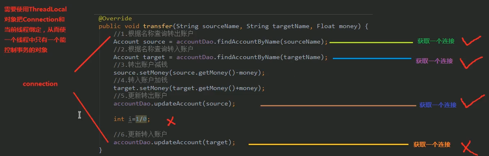

# 08.银行转账案例

- 笔记本：16.Spring
- 创建时间：2020-04-06 07:56:27 UTC
- 更新时间：2020-04-06 13:47:27 UTC
- 印象笔记 GUID：8dbfe0f8-d2e9-4198-8c0e-df21c95d8b28

**eg：**

```
@RunWith(SpringJUnit4ClassRunner.class)
@ContextConfiguration(locations = "classpath:bean.xml")
public class AccountServiceTest {

    @Autowired
    private AccountService accountService;

    @Test
    public void testTransfer(){
        accountService.transfer("aaa", "bbb", 100f);
    }
}

```

```
package com.liudezhi.service.impl;
public class AccountServiceImpl implements AccountService {

    private AccountDao accountDao;

    public void setAcountDao(AccountDao accountDao) {
        this.accountDao = accountDao;
    }

    @Override
    public void transfer(String sourceName, String targetName, Float money) {
        //1. 根据名称查询转出账户
        Account sourceAccount = accountDao.findAccountByName(sourceName);
        //2. 根据名称查询转入账户
        Account targetAccount = accountDao.findAccountByName(targetName);
        //3. 转出账户减钱
        sourceAccount.setMoney(sourceAccount.getMoney() - money);
        //4. 转入账户加钱
        targetAccount.setMoney(targetAccount.getMoney() + money);
        //5. 更新转出账户
        accountDao.updateAccount(sourceAccount);
        int i = 1 / 0;
        //6. 更新转入账户
        accountDao.updateAccount(targetAccount);
    }
}

```



每次查询/更新都是一次提交，因此可能会导致数据不同步。

**改进1：**

```
package com.liudezhi.utils;

import javax.sql.DataSource;
import java.sql.Connection;

/**
 * 连接的工具类，它用于从数据源中获取一个连接，并且实现和线程的绑定。
 */
public class ConnectionUtils {

    private ThreadLocal<Connection> tl = new ThreadLocal<Connection>();
    private DataSource dataSource;

    public void setDataSource(DataSource dataSource) {
        this.dataSource = dataSource;
    }

    /**
     * 获取当前线程上的连接
     * @return
     */
    public Connection getThreadConnection() {
        //1. 先从ThreadLocal上获取
        Connection conn = tl.get();
        try {
            //2. 判断当前线程上是否有连接
            if(conn == null) {
                //3. 从数据源中获取一个连接，并且存入ThreadLocal中
                conn = dataSource.getConnection();
                tl.set(conn);
            }
            //4. 返回当前线程上的连接
            return conn;
        } catch (Exception e) {
            throw new RuntimeException(e);
        }
    }

    /**
     * 把连接和线程解绑
     */
    public void removeConnection() {
        tl.remove();
    }
}

```

```
package com.liudezhi.utils;

/**
 * 和事务管理相关的工具类，它包含了：开启事务，提交事务，回滚事务和释放连接。
 */
public class TransactionManager {

    private ConnectionUtils connectionUtils;

    public void setConnectionUtils(ConnectionUtils connectionUtils) {
        this.connectionUtils = connectionUtils;
    }

    /**
     * 开启事务
     */
    public void beginTransaction() {
        try {
            connectionUtils.getThreadConnection().setAutoCommit(false);
        } catch (Exception e) {
            e.printStackTrace();
        }
    }

    /**
     * 提交事务
     */
    public void commit() {
        try {
            connectionUtils.getThreadConnection().commit();
        } catch (Exception e) {
            e.printStackTrace();
        }
    }

    /**
     * 回滚事务
     */
    public void rollback() {
        try {
            connectionUtils.getThreadConnection().rollback();
        } catch (Exception e) {
            e.printStackTrace();
        }
    }

    /**
     * 释放连接
     */
    public void release() {
        try {
            connectionUtils.getThreadConnection().close();  //还回连接池中
            connectionUtils.removeConnection();
        } catch (Exception e) {
            e.printStackTrace();
        }
    }
}

```

```
package com.liudezhi.service.impl;

import com.liudezhi.dao.AccountDao;
import com.liudezhi.domain.Account;
import com.liudezhi.service.AccountService;
import com.liudezhi.utils.TransactionManager;

import java.util.List;

/**
 * 账户的业务层实现类
 */
public class AccountServiceImpl_old implements AccountService {

    private AccountDao accountDao;
    private TransactionManager txManager;

    public void setTxManager(TransactionManager txManager) {
        this.txManager = txManager;
    }

    public void setAcountDao(AccountDao accountDao) {
        this.accountDao = accountDao;
    }

    @Override
    public void transfer(String sourceName, String targetName, Float money) {
        try {
            //1. 开启事务
            txManager.beginTransaction();
            //2. 执行操作
            //2.1. 根据名称查询转出账户
            Account sourceAccount = accountDao.findAccountByName(sourceName);
            //2.2. 根据名称查询转入账户
            Account targetAccount = accountDao.findAccountByName(targetName);
            //2.3. 转出账户减钱
            sourceAccount.setMoney(sourceAccount.getMoney() - money);
            //2.4. 转入账户加钱
            targetAccount.setMoney(targetAccount.getMoney() + money);
            //2.5. 更新转出账户
            accountDao.updateAccount(sourceAccount);
            int i = 1/0;
            //2.6. 更新转入账户
            accountDao.updateAccount(targetAccount);
            //3. 提交事务
            txManager.commit();
        } catch (Exception e) {
            //4. 回滚操作
            txManager.rollback();
            e.printStackTrace();
        } finally {
            //5. 释放连接
            txManager.release();
        }
    }
}

```

```
package com.liudezhi.test;

/**
 * 使用Junit单元测试，测试我们的配置
 */
@RunWith(SpringJUnit4ClassRunner.class)
public class AccountServiceTest {

    @Autowired
    @Qualifier("proxyAccountService")
    private AccountService accountService;

    @Test
    public void testTransfer(){
        accountService.transfer("aaa", "bbb", 100f);
    }
}

```

```
<?xml version="1.0" encoding="UTF-8"?>
<beans xmlns="http://www.springframework.org/schema/beans"
       xmlns:xsi="http://www.w3.org/2001/XMLSchema-instance"
       xsi:schemaLocation="http://www.springframework.org/schema/beans
        https://www.springframework.org/schema/beans/spring-beans.xsd">

    <!-- 配置service -->
    <bean id="accountService" class="com.liudezhi.service.impl.AccountServiceImpl">
        <!-- 注入dao -->
        <property name="acountDao" ref="accountDao"></property>
        <!-- 注入事务管理器 -->
        <property name="txManager" ref="txManager"></property>
    </bean>

    <!-- 配置dao对象 -->
    <bean id="accountDao" class="com.liudezhi.dao.impl.AccountDaoImpl">
        <!-- 注入QueryRunner -->
        <property name="runner" ref="runner"></property>
        <!-- 注入ConnectionUtils -->
        <property name="connectionUtils" ref="connectionUtils"></property>
    </bean>

    <!-- 配置QueryRunner -->
    <bean id="runner" class="org.apache.commons.dbutils.QueryRunner" scope="prototype"></bean>

    <!-- 配置数据源 -->
    <bean id="dataSource" class="com.mchange.v2.c3p0.ComboPooledDataSource">
        <!-- 链接数据库的必备信息 -->
        <property name="driverClass" value="com.mysql.cj.jdbc.Driver"></property>
        <property name="jdbcUrl" value="jdbc:mysql://localhost:3306/learn_spring?useUnicode=true&amp;characterEncoding=utf-8&amp;useSSL=false&amp;serverTimezone=GMT"></property>
        <property name="user" value="root"></property>
        <property name="password" value="Liudezhi"></property>
    </bean>

    <!-- 配置Connection 的工具类 ConnectionUtils -->
    <bean id="connectionUtils" class="com.liudezhi.utils.ConnectionUtils">
        <!-- 注入数据源 -->
        <property name="dataSource" ref="dataSource"></property>
    </bean>

    <!-- 配置事务管理器 -->
    <bean id="txManager" class="com.liudezhi.utils.TransactionManager">
        <!-- 注入ConnectionUtils -->
        <property name="connectionUtils" ref="connectionUtils"></property>
    </bean>
</beans>

```

**问题：Service接口太复杂**

**改进2：通过动态代理实现事务控制**

```
package com.liudezhi.service.impl;

import com.liudezhi.dao.AccountDao;
import com.liudezhi.domain.Account;
import com.liudezhi.service.AccountService;
import com.liudezhi.utils.TransactionManager;

import java.util.List;

/**
 * 账户的业务层实现类
 */
public class AccountServiceImpl implements AccountService {

    private AccountDao accountDao;

    public void setAcountDao(AccountDao accountDao) {
        this.accountDao = accountDao;
    }

    @Override
    public void transfer(String sourceName, String targetName, Float money) {
        //2.1. 根据名称查询转出账户
        Account sourceAccount = accountDao.findAccountByName(sourceName);
        //2.2. 根据名称查询转入账户
        Account targetAccount = accountDao.findAccountByName(targetName);
        //2.3. 转出账户减钱
        sourceAccount.setMoney(sourceAccount.getMoney() - money);
        //2.4. 转入账户加钱
        targetAccount.setMoney(targetAccount.getMoney() + money);
        //2.5. 更新转出账户
        accountDao.updateAccount(sourceAccount);
        int i = 1/0;
        //2.6. 更新转入账户
        accountDao.updateAccount(targetAccount);
    }
}

```

```
package com.liudezhi.test;

/**
 * 使用Junit单元测试，测试我们的配置
 */
@RunWith(SpringJUnit4ClassRunner.class)
@ContextConfiguration(locations = "classpath:bean.xml")
public class AccountServiceTest {

    @Autowired
    @Qualifier("proxyAccountService")
    private AccountService accountService;

    @Test
    public void testTransfer(){
        accountService.transfer("aaa", "bbb", 100f);
    }
}

```

```
<?xml version="1.0" encoding="UTF-8"?>
<beans xmlns="http://www.springframework.org/schema/beans"
       xmlns:xsi="http://www.w3.org/2001/XMLSchema-instance"
       xsi:schemaLocation="http://www.springframework.org/schema/beans
        https://www.springframework.org/schema/beans/spring-beans.xsd">

    <!-- 配置代理的service -->
    <bean id="proxyAccountService" factory-bean="beanFactory" factory-method="getAccountService"></bean>

    <!-- 配置beanfactory -->
    <bean id="beanFactory" class="com.liudezhi.factory.BeanFactory">
        <!-- 注入service -->
        <property name="accountService" ref="accountService"></property>
        <!-- 注入事务管理器 -->
        <property name="txManager" ref="txManager"></property>
    </bean>

    <!-- 配置service -->
    <bean id="accountService" class="com.liudezhi.service.impl.AccountServiceImpl">
        <!-- 注入dao -->
        <property name="acountDao" ref="accountDao"></property>
    </bean>

    <!-- 配置dao对象 -->
    <bean id="accountDao" class="com.liudezhi.dao.impl.AccountDaoImpl">
        <!-- 注入QueryRunner -->
        <property name="runner" ref="runner"></property>
        <!-- 注入ConnectionUtils -->
        <property name="connectionUtils" ref="connectionUtils"></property>
    </bean>

    <!-- 配置QueryRunner -->
    <bean id="runner" class="org.apache.commons.dbutils.QueryRunner" scope="prototype"></bean>

    <!-- 配置数据源 -->
    <bean id="dataSource" class="com.mchange.v2.c3p0.ComboPooledDataSource">
        <!-- 链接数据库的必备信息 -->
        <property name="driverClass" value="com.mysql.cj.jdbc.Driver"></property>
        <property name="jdbcUrl" value="jdbc:mysql://localhost:3306/learn_spring?useUnicode=true&amp;characterEncoding=utf-8&amp;useSSL=false&amp;serverTimezone=GMT"></property>
        <property name="user" value="root"></property>
        <property name="password" value="Liudezhi"></property>
    </bean>

    <!-- 配置Connection 的工具类 ConnectionUtils -->
    <bean id="connectionUtils" class="com.liudezhi.utils.ConnectionUtils">
        <!-- 注入数据源 -->
        <property name="dataSource" ref="dataSource"></property>
    </bean>

    <!-- 配置事务管理器 -->
    <bean id="txManager" class="com.liudezhi.utils.TransactionManager">
        <!-- 注入ConnectionUtils -->
        <property name="connectionUtils" ref="connectionUtils"></property>
    </bean>
</beans>

```

**eg%EF%BC%9A**%0A%60%60%60java%0A%40RunWith(SpringJUnit4ClassRunner.class)%0A%40ContextConfiguration(locations%20%3D%20%22classpath%3Abean.xml%22)%0Apublic%20class%20AccountServiceTest%20%7B%0A%0A%20%20%20%20%40Autowired%0A%20%20%20%20private%20AccountService%20accountService%3B%0A%0A%20%20%20%20%40Test%0A%20%20%20%20public%20void%20testTransfer()%7B%0A%20%20%20%20%20%20%20%20accountService.transfer(%22aaa%22%2C%20%22bbb%22%2C%20100f)%3B%0A%20%20%20%20%7D%0A%7D%0A%60%60%60%0A%0A%60%60%60java%0Apackage%20com.liudezhi.service.impl%3B%0Apublic%20class%20AccountServiceImpl%20implements%20AccountService%20%7B%0A%0A%20%20%20%20private%20AccountDao%20accountDao%3B%0A%0A%20%20%20%20public%20void%20setAcountDao(AccountDao%20accountDao)%20%7B%0A%20%20%20%20%20%20%20%20this.accountDao%20%3D%20accountDao%3B%0A%20%20%20%20%7D%0A%0A%20%20%20%20%40Override%0A%20%20%20%20public%20void%20transfer(String%20sourceName%2C%20String%20targetName%2C%20Float%20money)%20%7B%0A%20%20%20%20%20%20%20%20%2F%2F1.%20%E6%A0%B9%E6%8D%AE%E5%90%8D%E7%A7%B0%E6%9F%A5%E8%AF%A2%E8%BD%AC%E5%87%BA%E8%B4%A6%E6%88%B7%0A%20%20%20%20%20%20%20%20Account%20sourceAccount%20%3D%20accountDao.findAccountByName(sourceName)%3B%0A%20%20%20%20%20%20%20%20%2F%2F2.%20%E6%A0%B9%E6%8D%AE%E5%90%8D%E7%A7%B0%E6%9F%A5%E8%AF%A2%E8%BD%AC%E5%85%A5%E8%B4%A6%E6%88%B7%0A%20%20%20%20%20%20%20%20Account%20targetAccount%20%3D%20accountDao.findAccountByName(targetName)%3B%0A%20%20%20%20%20%20%20%20%2F%2F3.%20%E8%BD%AC%E5%87%BA%E8%B4%A6%E6%88%B7%E5%87%8F%E9%92%B1%0A%20%20%20%20%20%20%20%20sourceAccount.setMoney(sourceAccount.getMoney()%20-%20money)%3B%0A%20%20%20%20%20%20%20%20%2F%2F4.%20%E8%BD%AC%E5%85%A5%E8%B4%A6%E6%88%B7%E5%8A%A0%E9%92%B1%0A%20%20%20%20%20%20%20%20targetAccount.setMoney(targetAccount.getMoney()%20%2B%20money)%3B%0A%20%20%20%20%20%20%20%20%2F%2F5.%20%E6%9B%B4%E6%96%B0%E8%BD%AC%E5%87%BA%E8%B4%A6%E6%88%B7%0A%20%20%20%20%20%20%20%20accountDao.updateAccount(sourceAccount)%3B%0A%20%20%20%20%20%20%20%20int%20i%20%3D%201%20%2F%200%3B%0A%20%20%20%20%20%20%20%20%2F%2F6.%20%E6%9B%B4%E6%96%B0%E8%BD%AC%E5%85%A5%E8%B4%A6%E6%88%B7%0A%20%20%20%20%20%20%20%20accountDao.updateAccount(targetAccount)%3B%0A%20%20%20%20%7D%0A%7D%0A%0A%60%60%60%0A%0A!%5Bc4d4d8afbe1337ddb9f0623d8458e400.png%5D(en-resource%3A%2F%2Fdatabase%2F3441%3A1)%0A%0A%E6%AF%8F%E6%AC%A1%E6%9F%A5%E8%AF%A2%2F%E6%9B%B4%E6%96%B0%E9%83%BD%E6%98%AF%E4%B8%80%E6%AC%A1%E6%8F%90%E4%BA%A4%EF%BC%8C%E5%9B%A0%E6%AD%A4%E5%8F%AF%E8%83%BD%E4%BC%9A%E5%AF%BC%E8%87%B4%E6%95%B0%E6%8D%AE%E4%B8%8D%E5%90%8C%E6%AD%A5%E3%80%82%0A%0A**%E6%94%B9%E8%BF%9B1%EF%BC%9A**%0A%60%60%60java%0Apackage%20com.liudezhi.utils%3B%0A%0Aimport%20javax.sql.DataSource%3B%0Aimport%20java.sql.Connection%3B%0A%0A%2F**%0A%20*%20%E8%BF%9E%E6%8E%A5%E7%9A%84%E5%B7%A5%E5%85%B7%E7%B1%BB%EF%BC%8C%E5%AE%83%E7%94%A8%E4%BA%8E%E4%BB%8E%E6%95%B0%E6%8D%AE%E6%BA%90%E4%B8%AD%E8%8E%B7%E5%8F%96%E4%B8%80%E4%B8%AA%E8%BF%9E%E6%8E%A5%EF%BC%8C%E5%B9%B6%E4%B8%94%E5%AE%9E%E7%8E%B0%E5%92%8C%E7%BA%BF%E7%A8%8B%E7%9A%84%E7%BB%91%E5%AE%9A%E3%80%82%0A%20*%2F%0Apublic%20class%20ConnectionUtils%20%7B%0A%0A%20%20%20%20private%20ThreadLocal%3CConnection%3E%20tl%20%3D%20new%20ThreadLocal%3CConnection%3E()%3B%0A%20%20%20%20private%20DataSource%20dataSource%3B%0A%0A%20%20%20%20public%20void%20setDataSource(DataSource%20dataSource)%20%7B%0A%20%20%20%20%20%20%20%20this.dataSource%20%3D%20dataSource%3B%0A%20%20%20%20%7D%0A%0A%20%20%20%20%2F**%0A%20%20%20%20%20*%20%E8%8E%B7%E5%8F%96%E5%BD%93%E5%89%8D%E7%BA%BF%E7%A8%8B%E4%B8%8A%E7%9A%84%E8%BF%9E%E6%8E%A5%0A%20%20%20%20%20*%20%40return%0A%20%20%20%20%20*%2F%0A%20%20%20%20public%20Connection%20getThreadConnection()%20%7B%0A%20%20%20%20%20%20%20%20%2F%2F1.%20%E5%85%88%E4%BB%8EThreadLocal%E4%B8%8A%E8%8E%B7%E5%8F%96%0A%20%20%20%20%20%20%20%20Connection%20conn%20%3D%20tl.get()%3B%0A%20%20%20%20%20%20%20%20try%20%7B%0A%20%20%20%20%20%20%20%20%20%20%20%20%2F%2F2.%20%E5%88%A4%E6%96%AD%E5%BD%93%E5%89%8D%E7%BA%BF%E7%A8%8B%E4%B8%8A%E6%98%AF%E5%90%A6%E6%9C%89%E8%BF%9E%E6%8E%A5%0A%20%20%20%20%20%20%20%20%20%20%20%20if(conn%20%3D%3D%20null)%20%7B%0A%20%20%20%20%20%20%20%20%20%20%20%20%20%20%20%20%2F%2F3.%20%E4%BB%8E%E6%95%B0%E6%8D%AE%E6%BA%90%E4%B8%AD%E8%8E%B7%E5%8F%96%E4%B8%80%E4%B8%AA%E8%BF%9E%E6%8E%A5%EF%BC%8C%E5%B9%B6%E4%B8%94%E5%AD%98%E5%85%A5ThreadLocal%E4%B8%AD%0A%20%20%20%20%20%20%20%20%20%20%20%20%20%20%20%20conn%20%3D%20dataSource.getConnection()%3B%0A%20%20%20%20%20%20%20%20%20%20%20%20%20%20%20%20tl.set(conn)%3B%0A%20%20%20%20%20%20%20%20%20%20%20%20%7D%0A%20%20%20%20%20%20%20%20%20%20%20%20%2F%2F4.%20%E8%BF%94%E5%9B%9E%E5%BD%93%E5%89%8D%E7%BA%BF%E7%A8%8B%E4%B8%8A%E7%9A%84%E8%BF%9E%E6%8E%A5%0A%20%20%20%20%20%20%20%20%20%20%20%20return%20conn%3B%0A%20%20%20%20%20%20%20%20%7D%20catch%20(Exception%20e)%20%7B%0A%20%20%20%20%20%20%20%20%20%20%20%20throw%20new%20RuntimeException(e)%3B%0A%20%20%20%20%20%20%20%20%7D%0A%20%20%20%20%7D%0A%0A%20%20%20%20%2F**%0A%20%20%20%20%20*%20%E6%8A%8A%E8%BF%9E%E6%8E%A5%E5%92%8C%E7%BA%BF%E7%A8%8B%E8%A7%A3%E7%BB%91%0A%20%20%20%20%20*%2F%0A%20%20%20%20public%20void%20removeConnection()%20%7B%0A%20%20%20%20%20%20%20%20tl.remove()%3B%0A%20%20%20%20%7D%0A%7D%0A%60%60%60%0A%0A%60%60%60java%0Apackage%20com.liudezhi.utils%3B%0A%0A%2F**%0A%20*%20%E5%92%8C%E4%BA%8B%E5%8A%A1%E7%AE%A1%E7%90%86%E7%9B%B8%E5%85%B3%E7%9A%84%E5%B7%A5%E5%85%B7%E7%B1%BB%EF%BC%8C%E5%AE%83%E5%8C%85%E5%90%AB%E4%BA%86%EF%BC%9A%E5%BC%80%E5%90%AF%E4%BA%8B%E5%8A%A1%EF%BC%8C%E6%8F%90%E4%BA%A4%E4%BA%8B%E5%8A%A1%EF%BC%8C%E5%9B%9E%E6%BB%9A%E4%BA%8B%E5%8A%A1%E5%92%8C%E9%87%8A%E6%94%BE%E8%BF%9E%E6%8E%A5%E3%80%82%0A%20*%2F%0Apublic%20class%20TransactionManager%20%7B%0A%0A%20%20%20%20private%20ConnectionUtils%20connectionUtils%3B%0A%0A%20%20%20%20public%20void%20setConnectionUtils(ConnectionUtils%20connectionUtils)%20%7B%0A%20%20%20%20%20%20%20%20this.connectionUtils%20%3D%20connectionUtils%3B%0A%20%20%20%20%7D%0A%0A%20%20%20%20%2F**%0A%20%20%20%20%20*%20%E5%BC%80%E5%90%AF%E4%BA%8B%E5%8A%A1%0A%20%20%20%20%20*%2F%0A%20%20%20%20public%20void%20beginTransaction()%20%7B%0A%20%20%20%20%20%20%20%20try%20%7B%0A%20%20%20%20%20%20%20%20%20%20%20%20connectionUtils.getThreadConnection().setAutoCommit(false)%3B%0A%20%20%20%20%20%20%20%20%7D%20catch%20(Exception%20e)%20%7B%0A%20%20%20%20%20%20%20%20%20%20%20%20e.printStackTrace()%3B%0A%20%20%20%20%20%20%20%20%7D%0A%20%20%20%20%7D%0A%0A%20%20%20%20%2F**%0A%20%20%20%20%20*%20%E6%8F%90%E4%BA%A4%E4%BA%8B%E5%8A%A1%0A%20%20%20%20%20*%2F%0A%20%20%20%20public%20void%20commit()%20%7B%0A%20%20%20%20%20%20%20%20try%20%7B%0A%20%20%20%20%20%20%20%20%20%20%20%20connectionUtils.getThreadConnection().commit()%3B%0A%20%20%20%20%20%20%20%20%7D%20catch%20(Exception%20e)%20%7B%0A%20%20%20%20%20%20%20%20%20%20%20%20e.printStackTrace()%3B%0A%20%20%20%20%20%20%20%20%7D%0A%20%20%20%20%7D%0A%0A%20%20%20%20%2F**%0A%20%20%20%20%20*%20%E5%9B%9E%E6%BB%9A%E4%BA%8B%E5%8A%A1%0A%20%20%20%20%20*%2F%0A%20%20%20%20public%20void%20rollback()%20%7B%0A%20%20%20%20%20%20%20%20try%20%7B%0A%20%20%20%20%20%20%20%20%20%20%20%20connectionUtils.getThreadConnection().rollback()%3B%0A%20%20%20%20%20%20%20%20%7D%20catch%20(Exception%20e)%20%7B%0A%20%20%20%20%20%20%20%20%20%20%20%20e.printStackTrace()%3B%0A%20%20%20%20%20%20%20%20%7D%0A%20%20%20%20%7D%0A%0A%20%20%20%20%2F**%0A%20%20%20%20%20*%20%E9%87%8A%E6%94%BE%E8%BF%9E%E6%8E%A5%0A%20%20%20%20%20*%2F%0A%20%20%20%20public%20void%20release()%20%7B%0A%20%20%20%20%20%20%20%20try%20%7B%0A%20%20%20%20%20%20%20%20%20%20%20%20connectionUtils.getThreadConnection().close()%3B%20%20%2F%2F%E8%BF%98%E5%9B%9E%E8%BF%9E%E6%8E%A5%E6%B1%A0%E4%B8%AD%0A%20%20%20%20%20%20%20%20%20%20%20%20connectionUtils.removeConnection()%3B%0A%20%20%20%20%20%20%20%20%7D%20catch%20(Exception%20e)%20%7B%0A%20%20%20%20%20%20%20%20%20%20%20%20e.printStackTrace()%3B%0A%20%20%20%20%20%20%20%20%7D%0A%20%20%20%20%7D%0A%7D%0A%60%60%60%0A%0A%60%60%60java%0Apackage%20com.liudezhi.service.impl%3B%0A%0Aimport%20com.liudezhi.dao.AccountDao%3B%0Aimport%20com.liudezhi.domain.Account%3B%0Aimport%20com.liudezhi.service.AccountService%3B%0Aimport%20com.liudezhi.utils.TransactionManager%3B%0A%0Aimport%20java.util.List%3B%0A%0A%2F**%0A%20*%20%E8%B4%A6%E6%88%B7%E7%9A%84%E4%B8%9A%E5%8A%A1%E5%B1%82%E5%AE%9E%E7%8E%B0%E7%B1%BB%0A%20*%2F%0Apublic%20class%20AccountServiceImpl_old%20implements%20AccountService%20%7B%0A%0A%20%20%20%20private%20AccountDao%20accountDao%3B%0A%20%20%20%20private%20TransactionManager%20txManager%3B%0A%0A%20%20%20%20public%20void%20setTxManager(TransactionManager%20txManager)%20%7B%0A%20%20%20%20%20%20%20%20this.txManager%20%3D%20txManager%3B%0A%20%20%20%20%7D%0A%0A%20%20%20%20public%20void%20setAcountDao(AccountDao%20accountDao)%20%7B%0A%20%20%20%20%20%20%20%20this.accountDao%20%3D%20accountDao%3B%0A%20%20%20%20%7D%0A%0A%20%20%20%20%40Override%0A%20%20%20%20public%20void%20transfer(String%20sourceName%2C%20String%20targetName%2C%20Float%20money)%20%7B%0A%20%20%20%20%20%20%20%20try%20%7B%0A%20%20%20%20%20%20%20%20%20%20%20%20%2F%2F1.%20%E5%BC%80%E5%90%AF%E4%BA%8B%E5%8A%A1%0A%20%20%20%20%20%20%20%20%20%20%20%20txManager.beginTransaction()%3B%0A%20%20%20%20%20%20%20%20%20%20%20%20%2F%2F2.%20%E6%89%A7%E8%A1%8C%E6%93%8D%E4%BD%9C%0A%20%20%20%20%20%20%20%20%20%20%20%20%2F%2F2.1.%20%E6%A0%B9%E6%8D%AE%E5%90%8D%E7%A7%B0%E6%9F%A5%E8%AF%A2%E8%BD%AC%E5%87%BA%E8%B4%A6%E6%88%B7%0A%20%20%20%20%20%20%20%20%20%20%20%20Account%20sourceAccount%20%3D%20accountDao.findAccountByName(sourceName)%3B%0A%20%20%20%20%20%20%20%20%20%20%20%20%2F%2F2.2.%20%E6%A0%B9%E6%8D%AE%E5%90%8D%E7%A7%B0%E6%9F%A5%E8%AF%A2%E8%BD%AC%E5%85%A5%E8%B4%A6%E6%88%B7%0A%20%20%20%20%20%20%20%20%20%20%20%20Account%20targetAccount%20%3D%20accountDao.findAccountByName(targetName)%3B%0A%20%20%20%20%20%20%20%20%20%20%20%20%2F%2F2.3.%20%E8%BD%AC%E5%87%BA%E8%B4%A6%E6%88%B7%E5%87%8F%E9%92%B1%0A%20%20%20%20%20%20%20%20%20%20%20%20sourceAccount.setMoney(sourceAccount.getMoney()%20-%20money)%3B%0A%20%20%20%20%20%20%20%20%20%20%20%20%2F%2F2.4.%20%E8%BD%AC%E5%85%A5%E8%B4%A6%E6%88%B7%E5%8A%A0%E9%92%B1%0A%20%20%20%20%20%20%20%20%20%20%20%20targetAccount.setMoney(targetAccount.getMoney()%20%2B%20money)%3B%0A%20%20%20%20%20%20%20%20%20%20%20%20%2F%2F2.5.%20%E6%9B%B4%E6%96%B0%E8%BD%AC%E5%87%BA%E8%B4%A6%E6%88%B7%0A%20%20%20%20%20%20%20%20%20%20%20%20accountDao.updateAccount(sourceAccount)%3B%0A%20%20%20%20%20%20%20%20%20%20%20%20int%20i%20%3D%201%2F0%3B%0A%20%20%20%20%20%20%20%20%20%20%20%20%2F%2F2.6.%20%E6%9B%B4%E6%96%B0%E8%BD%AC%E5%85%A5%E8%B4%A6%E6%88%B7%0A%20%20%20%20%20%20%20%20%20%20%20%20accountDao.updateAccount(targetAccount)%3B%0A%20%20%20%20%20%20%20%20%20%20%20%20%2F%2F3.%20%E6%8F%90%E4%BA%A4%E4%BA%8B%E5%8A%A1%0A%20%20%20%20%20%20%20%20%20%20%20%20txManager.commit()%3B%0A%20%20%20%20%20%20%20%20%7D%20catch%20(Exception%20e)%20%7B%0A%20%20%20%20%20%20%20%20%20%20%20%20%2F%2F4.%20%E5%9B%9E%E6%BB%9A%E6%93%8D%E4%BD%9C%0A%20%20%20%20%20%20%20%20%20%20%20%20txManager.rollback()%3B%0A%20%20%20%20%20%20%20%20%20%20%20%20e.printStackTrace()%3B%0A%20%20%20%20%20%20%20%20%7D%20finally%20%7B%0A%20%20%20%20%20%20%20%20%20%20%20%20%2F%2F5.%20%E9%87%8A%E6%94%BE%E8%BF%9E%E6%8E%A5%0A%20%20%20%20%20%20%20%20%20%20%20%20txManager.release()%3B%0A%20%20%20%20%20%20%20%20%7D%0A%20%20%20%20%7D%0A%7D%0A%60%60%60%0A%0A%60%60%60java%0Apackage%20com.liudezhi.test%3B%0A%0A%2F**%0A%20*%20%E4%BD%BF%E7%94%A8Junit%E5%8D%95%E5%85%83%E6%B5%8B%E8%AF%95%EF%BC%8C%E6%B5%8B%E8%AF%95%E6%88%91%E4%BB%AC%E7%9A%84%E9%85%8D%E7%BD%AE%0A%20*%2F%0A%40RunWith(SpringJUnit4ClassRunner.class)%0Apublic%20class%20AccountServiceTest%20%7B%0A%0A%20%20%20%20%40Autowired%0A%20%20%20%20%40Qualifier(%22proxyAccountService%22)%0A%20%20%20%20private%20AccountService%20accountService%3B%0A%0A%20%20%20%20%40Test%0A%20%20%20%20public%20void%20testTransfer()%7B%0A%20%20%20%20%20%20%20%20accountService.transfer(%22aaa%22%2C%20%22bbb%22%2C%20100f)%3B%0A%20%20%20%20%7D%0A%7D%0A%60%60%60%0A%0A%60%60%60xml%0A%3C%3Fxml%20version%3D%221.0%22%20encoding%3D%22UTF-8%22%3F%3E%0A%3Cbeans%20xmlns%3D%22http%3A%2F%2Fwww.springframework.org%2Fschema%2Fbeans%22%0A%20%20%20%20%20%20%20xmlns%3Axsi%3D%22http%3A%2F%2Fwww.w3.org%2F2001%2FXMLSchema-instance%22%0A%20%20%20%20%20%20%20xsi%3AschemaLocation%3D%22http%3A%2F%2Fwww.springframework.org%2Fschema%2Fbeans%0A%20%20%20%20%20%20%20%20https%3A%2F%2Fwww.springframework.org%2Fschema%2Fbeans%2Fspring-beans.xsd%22%3E%0A%0A%20%20%20%20%3C!--%20%E9%85%8D%E7%BD%AEservice%20--%3E%0A%20%20%20%20%3Cbean%20id%3D%22accountService%22%20class%3D%22com.liudezhi.service.impl.AccountServiceImpl%22%3E%0A%20%20%20%20%20%20%20%20%3C!--%20%E6%B3%A8%E5%85%A5dao%20--%3E%0A%20%20%20%20%20%20%20%20%3Cproperty%20name%3D%22acountDao%22%20ref%3D%22accountDao%22%3E%3C%2Fproperty%3E%0A%20%20%20%20%20%20%20%20%3C!--%20%E6%B3%A8%E5%85%A5%E4%BA%8B%E5%8A%A1%E7%AE%A1%E7%90%86%E5%99%A8%20--%3E%0A%20%20%20%20%20%20%20%20%3Cproperty%20name%3D%22txManager%22%20ref%3D%22txManager%22%3E%3C%2Fproperty%3E%0A%20%20%20%20%3C%2Fbean%3E%0A%0A%20%20%20%20%3C!--%20%E9%85%8D%E7%BD%AEdao%E5%AF%B9%E8%B1%A1%20--%3E%0A%20%20%20%20%3Cbean%20id%3D%22accountDao%22%20class%3D%22com.liudezhi.dao.impl.AccountDaoImpl%22%3E%0A%20%20%20%20%20%20%20%20%3C!--%20%E6%B3%A8%E5%85%A5QueryRunner%20--%3E%0A%20%20%20%20%20%20%20%20%3Cproperty%20name%3D%22runner%22%20ref%3D%22runner%22%3E%3C%2Fproperty%3E%0A%20%20%20%20%20%20%20%20%3C!--%20%E6%B3%A8%E5%85%A5ConnectionUtils%20--%3E%0A%20%20%20%20%20%20%20%20%3Cproperty%20name%3D%22connectionUtils%22%20ref%3D%22connectionUtils%22%3E%3C%2Fproperty%3E%0A%20%20%20%20%3C%2Fbean%3E%0A%0A%20%20%20%20%3C!--%20%E9%85%8D%E7%BD%AEQueryRunner%20--%3E%0A%20%20%20%20%3Cbean%20id%3D%22runner%22%20class%3D%22org.apache.commons.dbutils.QueryRunner%22%20scope%3D%22prototype%22%3E%3C%2Fbean%3E%0A%0A%20%20%20%20%3C!--%20%E9%85%8D%E7%BD%AE%E6%95%B0%E6%8D%AE%E6%BA%90%20--%3E%0A%20%20%20%20%3Cbean%20id%3D%22dataSource%22%20class%3D%22com.mchange.v2.c3p0.ComboPooledDataSource%22%3E%0A%20%20%20%20%20%20%20%20%3C!--%20%E9%93%BE%E6%8E%A5%E6%95%B0%E6%8D%AE%E5%BA%93%E7%9A%84%E5%BF%85%E5%A4%87%E4%BF%A1%E6%81%AF%20--%3E%0A%20%20%20%20%20%20%20%20%3Cproperty%20name%3D%22driverClass%22%20value%3D%22com.mysql.cj.jdbc.Driver%22%3E%3C%2Fproperty%3E%0A%20%20%20%20%20%20%20%20%3Cproperty%20name%3D%22jdbcUrl%22%20value%3D%22jdbc%3Amysql%3A%2F%2Flocalhost%3A3306%2Flearn_spring%3FuseUnicode%3Dtrue%26amp%3BcharacterEncoding%3Dutf-8%26amp%3BuseSSL%3Dfalse%26amp%3BserverTimezone%3DGMT%22%3E%3C%2Fproperty%3E%0A%20%20%20%20%20%20%20%20%3Cproperty%20name%3D%22user%22%20value%3D%22root%22%3E%3C%2Fproperty%3E%0A%20%20%20%20%20%20%20%20%3Cproperty%20name%3D%22password%22%20value%3D%22Liudezhi%22%3E%3C%2Fproperty%3E%0A%20%20%20%20%3C%2Fbean%3E%0A%0A%20%20%20%20%3C!--%20%E9%85%8D%E7%BD%AEConnection%20%E7%9A%84%E5%B7%A5%E5%85%B7%E7%B1%BB%20ConnectionUtils%20--%3E%0A%20%20%20%20%3Cbean%20id%3D%22connectionUtils%22%20class%3D%22com.liudezhi.utils.ConnectionUtils%22%3E%0A%20%20%20%20%20%20%20%20%3C!--%20%E6%B3%A8%E5%85%A5%E6%95%B0%E6%8D%AE%E6%BA%90%20--%3E%0A%20%20%20%20%20%20%20%20%3Cproperty%20name%3D%22dataSource%22%20ref%3D%22dataSource%22%3E%3C%2Fproperty%3E%0A%20%20%20%20%3C%2Fbean%3E%0A%0A%20%20%20%20%3C!--%20%E9%85%8D%E7%BD%AE%E4%BA%8B%E5%8A%A1%E7%AE%A1%E7%90%86%E5%99%A8%20--%3E%0A%20%20%20%20%3Cbean%20id%3D%22txManager%22%20class%3D%22com.liudezhi.utils.TransactionManager%22%3E%0A%20%20%20%20%20%20%20%20%3C!--%20%E6%B3%A8%E5%85%A5ConnectionUtils%20--%3E%0A%20%20%20%20%20%20%20%20%3Cproperty%20name%3D%22connectionUtils%22%20ref%3D%22connectionUtils%22%3E%3C%2Fproperty%3E%0A%20%20%20%20%3C%2Fbean%3E%0A%3C%2Fbeans%3E%0A%60%60%60%0A%0A**%E9%97%AE%E9%A2%98%EF%BC%9AService%E6%8E%A5%E5%8F%A3%E5%A4%AA%E5%A4%8D%E6%9D%82**%0A%0A**%E6%94%B9%E8%BF%9B2%EF%BC%9A%E9%80%9A%E8%BF%87%E5%8A%A8%E6%80%81%E4%BB%A3%E7%90%86%E5%AE%9E%E7%8E%B0%E4%BA%8B%E5%8A%A1%E6%8E%A7%E5%88%B6**%0A%0A%60%60%60java%0Apackage%20com.liudezhi.service.impl%3B%0A%0Aimport%20com.liudezhi.dao.AccountDao%3B%0Aimport%20com.liudezhi.domain.Account%3B%0Aimport%20com.liudezhi.service.AccountService%3B%0Aimport%20com.liudezhi.utils.TransactionManager%3B%0A%0Aimport%20java.util.List%3B%0A%0A%2F**%0A%20*%20%E8%B4%A6%E6%88%B7%E7%9A%84%E4%B8%9A%E5%8A%A1%E5%B1%82%E5%AE%9E%E7%8E%B0%E7%B1%BB%0A%20*%2F%0Apublic%20class%20AccountServiceImpl%20implements%20AccountService%20%7B%0A%0A%20%20%20%20private%20AccountDao%20accountDao%3B%0A%0A%20%20%20%20public%20void%20setAcountDao(AccountDao%20accountDao)%20%7B%0A%20%20%20%20%20%20%20%20this.accountDao%20%3D%20accountDao%3B%0A%20%20%20%20%7D%0A%0A%20%20%20%20%40Override%0A%20%20%20%20public%20void%20transfer(String%20sourceName%2C%20String%20targetName%2C%20Float%20money)%20%7B%0A%20%20%20%20%20%20%20%20%2F%2F2.1.%20%E6%A0%B9%E6%8D%AE%E5%90%8D%E7%A7%B0%E6%9F%A5%E8%AF%A2%E8%BD%AC%E5%87%BA%E8%B4%A6%E6%88%B7%0A%20%20%20%20%20%20%20%20Account%20sourceAccount%20%3D%20accountDao.findAccountByName(sourceName)%3B%0A%20%20%20%20%20%20%20%20%2F%2F2.2.%20%E6%A0%B9%E6%8D%AE%E5%90%8D%E7%A7%B0%E6%9F%A5%E8%AF%A2%E8%BD%AC%E5%85%A5%E8%B4%A6%E6%88%B7%0A%20%20%20%20%20%20%20%20Account%20targetAccount%20%3D%20accountDao.findAccountByName(targetName)%3B%0A%20%20%20%20%20%20%20%20%2F%2F2.3.%20%E8%BD%AC%E5%87%BA%E8%B4%A6%E6%88%B7%E5%87%8F%E9%92%B1%0A%20%20%20%20%20%20%20%20sourceAccount.setMoney(sourceAccount.getMoney()%20-%20money)%3B%0A%20%20%20%20%20%20%20%20%2F%2F2.4.%20%E8%BD%AC%E5%85%A5%E8%B4%A6%E6%88%B7%E5%8A%A0%E9%92%B1%0A%20%20%20%20%20%20%20%20targetAccount.setMoney(targetAccount.getMoney()%20%2B%20money)%3B%0A%20%20%20%20%20%20%20%20%2F%2F2.5.%20%E6%9B%B4%E6%96%B0%E8%BD%AC%E5%87%BA%E8%B4%A6%E6%88%B7%0A%20%20%20%20%20%20%20%20accountDao.updateAccount(sourceAccount)%3B%0A%20%20%20%20%20%20%20%20int%20i%20%3D%201%2F0%3B%0A%20%20%20%20%20%20%20%20%2F%2F2.6.%20%E6%9B%B4%E6%96%B0%E8%BD%AC%E5%85%A5%E8%B4%A6%E6%88%B7%0A%20%20%20%20%20%20%20%20accountDao.updateAccount(targetAccount)%3B%0A%20%20%20%20%7D%0A%7D%0A%60%60%60%0A%0A%60%60%60java%0Apackage%20com.liudezhi.test%3B%0A%0A%2F**%0A%20*%20%E4%BD%BF%E7%94%A8Junit%E5%8D%95%E5%85%83%E6%B5%8B%E8%AF%95%EF%BC%8C%E6%B5%8B%E8%AF%95%E6%88%91%E4%BB%AC%E7%9A%84%E9%85%8D%E7%BD%AE%0A%20*%2F%0A%40RunWith(SpringJUnit4ClassRunner.class)%0A%40ContextConfiguration(locations%20%3D%20%22classpath%3Abean.xml%22)%0Apublic%20class%20AccountServiceTest%20%7B%0A%0A%20%20%20%20%40Autowired%0A%20%20%20%20%40Qualifier(%22proxyAccountService%22)%0A%20%20%20%20private%20AccountService%20accountService%3B%0A%0A%20%20%20%20%40Test%0A%20%20%20%20public%20void%20testTransfer()%7B%0A%20%20%20%20%20%20%20%20accountService.transfer(%22aaa%22%2C%20%22bbb%22%2C%20100f)%3B%0A%20%20%20%20%7D%0A%7D%0A%60%60%60%0A%0A%60%60%60xml%0A%3C%3Fxml%20version%3D%221.0%22%20encoding%3D%22UTF-8%22%3F%3E%0A%3Cbeans%20xmlns%3D%22http%3A%2F%2Fwww.springframework.org%2Fschema%2Fbeans%22%0A%20%20%20%20%20%20%20xmlns%3Axsi%3D%22http%3A%2F%2Fwww.w3.org%2F2001%2FXMLSchema-instance%22%0A%20%20%20%20%20%20%20xsi%3AschemaLocation%3D%22http%3A%2F%2Fwww.springframework.org%2Fschema%2Fbeans%0A%20%20%20%20%20%20%20%20https%3A%2F%2Fwww.springframework.org%2Fschema%2Fbeans%2Fspring-beans.xsd%22%3E%0A%0A%20%20%20%20%3C!--%20%E9%85%8D%E7%BD%AE%E4%BB%A3%E7%90%86%E7%9A%84service%20--%3E%0A%20%20%20%20%3Cbean%20id%3D%22proxyAccountService%22%20factory-bean%3D%22beanFactory%22%20factory-method%3D%22getAccountService%22%3E%3C%2Fbean%3E%0A%0A%20%20%20%20%3C!--%20%E9%85%8D%E7%BD%AEbeanfactory%20--%3E%0A%20%20%20%20%3Cbean%20id%3D%22beanFactory%22%20class%3D%22com.liudezhi.factory.BeanFactory%22%3E%0A%20%20%20%20%20%20%20%20%3C!--%20%E6%B3%A8%E5%85%A5service%20--%3E%0A%20%20%20%20%20%20%20%20%3Cproperty%20name%3D%22accountService%22%20ref%3D%22accountService%22%3E%3C%2Fproperty%3E%0A%20%20%20%20%20%20%20%20%3C!--%20%E6%B3%A8%E5%85%A5%E4%BA%8B%E5%8A%A1%E7%AE%A1%E7%90%86%E5%99%A8%20--%3E%0A%20%20%20%20%20%20%20%20%3Cproperty%20name%3D%22txManager%22%20ref%3D%22txManager%22%3E%3C%2Fproperty%3E%0A%20%20%20%20%3C%2Fbean%3E%0A%0A%20%20%20%20%3C!--%20%E9%85%8D%E7%BD%AEservice%20--%3E%0A%20%20%20%20%3Cbean%20id%3D%22accountService%22%20class%3D%22com.liudezhi.service.impl.AccountServiceImpl%22%3E%0A%20%20%20%20%20%20%20%20%3C!--%20%E6%B3%A8%E5%85%A5dao%20--%3E%0A%20%20%20%20%20%20%20%20%3Cproperty%20name%3D%22acountDao%22%20ref%3D%22accountDao%22%3E%3C%2Fproperty%3E%0A%20%20%20%20%3C%2Fbean%3E%0A%0A%20%20%20%20%3C!--%20%E9%85%8D%E7%BD%AEdao%E5%AF%B9%E8%B1%A1%20--%3E%0A%20%20%20%20%3Cbean%20id%3D%22accountDao%22%20class%3D%22com.liudezhi.dao.impl.AccountDaoImpl%22%3E%0A%20%20%20%20%20%20%20%20%3C!--%20%E6%B3%A8%E5%85%A5QueryRunner%20--%3E%0A%20%20%20%20%20%20%20%20%3Cproperty%20name%3D%22runner%22%20ref%3D%22runner%22%3E%3C%2Fproperty%3E%0A%20%20%20%20%20%20%20%20%3C!--%20%E6%B3%A8%E5%85%A5ConnectionUtils%20--%3E%0A%20%20%20%20%20%20%20%20%3Cproperty%20name%3D%22connectionUtils%22%20ref%3D%22connectionUtils%22%3E%3C%2Fproperty%3E%0A%20%20%20%20%3C%2Fbean%3E%0A%0A%20%20%20%20%3C!--%20%E9%85%8D%E7%BD%AEQueryRunner%20--%3E%0A%20%20%20%20%3Cbean%20id%3D%22runner%22%20class%3D%22org.apache.commons.dbutils.QueryRunner%22%20scope%3D%22prototype%22%3E%3C%2Fbean%3E%0A%0A%20%20%20%20%3C!--%20%E9%85%8D%E7%BD%AE%E6%95%B0%E6%8D%AE%E6%BA%90%20--%3E%0A%20%20%20%20%3Cbean%20id%3D%22dataSource%22%20class%3D%22com.mchange.v2.c3p0.ComboPooledDataSource%22%3E%0A%20%20%20%20%20%20%20%20%3C!--%20%E9%93%BE%E6%8E%A5%E6%95%B0%E6%8D%AE%E5%BA%93%E7%9A%84%E5%BF%85%E5%A4%87%E4%BF%A1%E6%81%AF%20--%3E%0A%20%20%20%20%20%20%20%20%3Cproperty%20name%3D%22driverClass%22%20value%3D%22com.mysql.cj.jdbc.Driver%22%3E%3C%2Fproperty%3E%0A%20%20%20%20%20%20%20%20%3Cproperty%20name%3D%22jdbcUrl%22%20value%3D%22jdbc%3Amysql%3A%2F%2Flocalhost%3A3306%2Flearn_spring%3FuseUnicode%3Dtrue%26amp%3BcharacterEncoding%3Dutf-8%26amp%3BuseSSL%3Dfalse%26amp%3BserverTimezone%3DGMT%22%3E%3C%2Fproperty%3E%0A%20%20%20%20%20%20%20%20%3Cproperty%20name%3D%22user%22%20value%3D%22root%22%3E%3C%2Fproperty%3E%0A%20%20%20%20%20%20%20%20%3Cproperty%20name%3D%22password%22%20value%3D%22Liudezhi%22%3E%3C%2Fproperty%3E%0A%20%20%20%20%3C%2Fbean%3E%0A%0A%20%20%20%20%3C!--%20%E9%85%8D%E7%BD%AEConnection%20%E7%9A%84%E5%B7%A5%E5%85%B7%E7%B1%BB%20ConnectionUtils%20--%3E%0A%20%20%20%20%3Cbean%20id%3D%22connectionUtils%22%20class%3D%22com.liudezhi.utils.ConnectionUtils%22%3E%0A%20%20%20%20%20%20%20%20%3C!--%20%E6%B3%A8%E5%85%A5%E6%95%B0%E6%8D%AE%E6%BA%90%20--%3E%0A%20%20%20%20%20%20%20%20%3Cproperty%20name%3D%22dataSource%22%20ref%3D%22dataSource%22%3E%3C%2Fproperty%3E%0A%20%20%20%20%3C%2Fbean%3E%0A%0A%20%20%20%20%3C!--%20%E9%85%8D%E7%BD%AE%E4%BA%8B%E5%8A%A1%E7%AE%A1%E7%90%86%E5%99%A8%20--%3E%0A%20%20%20%20%3Cbean%20id%3D%22txManager%22%20class%3D%22com.liudezhi.utils.TransactionManager%22%3E%0A%20%20%20%20%20%20%20%20%3C!--%20%E6%B3%A8%E5%85%A5ConnectionUtils%20--%3E%0A%20%20%20%20%20%20%20%20%3Cproperty%20name%3D%22connectionUtils%22%20ref%3D%22connectionUtils%22%3E%3C%2Fproperty%3E%0A%20%20%20%20%3C%2Fbean%3E%0A%3C%2Fbeans%3E%0A%60%60%60%0A
