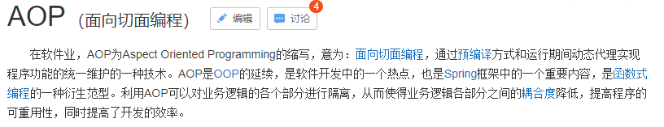
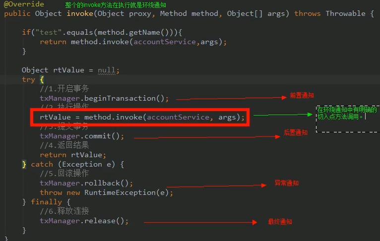

# 09.AOP概述

- 笔记本：16.Spring
- 创建时间：2020-04-06 14:00:26 UTC
- 更新时间：2020-04-18 06:20:31 UTC
- 印象笔记 GUID：ced27a50-37b0-418f-839f-3810118430a9

#### AOP：全称是 Aspect Oriented Programming 即：面向切面编程。


 简单的说，就是把我们程序重复的代码抽取出来，在需要执行的时候，使用动态代理的技术，在不修改源码的基础上，对我们的已有方法进行增强。

#### AOP的作用及优势

##### 作用：

 在程序运行期间，不修改源码对已有方法进行增强。

##### 优势：

 减少重复代码
 提高开发效率
 维护方便

#### AOP的实现方式

使用动态代理技术

#### Spring中的AOP

##### 说明

我们学习spring的aop，是通过配置的方式。

##### AOP相关术语

-
Joinpoint（连接点）：
 所谓连接点是指那些被拦截到的点。在spring中，这些点指的是方法，因为spring只支持方法类型的连接点。（所有的方法都是连接点）

-
Pointcut（切入点）：
 所谓切入点是指我们要对哪些Joinpoint 进行拦截的定义。（被增强的方法就是切入点）

-
Advice（通知/增强）：
 所谓通知是指拦截到Joinpoint 之后要做的事情就是通知。
 通知的类型：前置通知，后置通知，异常通知，最终通知，环绕通知。
 

-
Introduction（引介）：
 引介是一种特殊的通知在不修改类代码的前提下，Introduction 可以运行在运行器为类动态地添加一些方法或 Field（字段）。

-
Target（目标对象）：
 代理的目标对象。

-
Weaving（织入）：
 是指把增强应用到目标对象来创建新的代理对象的过程。
 spring采用动态代理织入，而 AspectJ采用编译期织入和类装载期织入。

-
Proxy（代理）：
 一个类被AOP织入增强后，就产生一个结果代理类。

-
Aspect（切面）：
 是切入点和通知（引介）的结合。

##### 学习 Spring中的 AOP要明确的事

a、开发阶段（我们做的）
 编写核心业务代码（开发主线）
 把公用代码抽取出来，制作成通知。
 在配置文件中，声明切入点与通知的关系，即切面。
 b、运行阶段（Spring框架完成的）
 Spring框架监控切入点方法的执行。一旦监控到切入点方法被运行，使用代理机制，动态创建目标对象的代理对象，根据通知类别，在代理对象的对应位置，将通知对应的功能织入，完成完成的代码逻辑运行。

##### eg：基于xml的AOP编写

###### spring中基于XML的AOP配置步骤

1. 把通知Bean也交给spring来管理

1. 使用 aop:config 标签表明开始AOP的配置

1. 使用 aop:aspect 标签表明配置切面
 id 属性：是给切面提供一个唯一标识。
 ref 属性：是指定通知类 bean 的id。

1. 在 aop:aspect 标签的内部使用对应标签来配置通知的类型。

  - aop:before：标识配置前置通知。（我们现在示例是让 printLog 方法在切入点执行之前执行，所以是前置通知）

    - method 属性：用于指定 Logger 类中哪个方法是前置通知

    - pointcut 属性：用于指定切入点表达式，该表达式的含义是：对业务层中的哪些方法增强。

      - 切入点表达式的写法：

        -
关键字：execution（表达式）

        -
表达式：
 访问修饰符 返回值 包名.包名...类名.方法名(参数列表)

        -
标准的表达式写法：
 public void com.liudezhi.service.impl.AccountServiceImpl.saveAccount()

        -
访问修饰符可以省略：
 void com.liudezhi.service.impl.AccountServiceImpl.saveAccount()

        -
返回值可以使用通配符，表示任意返回值
 * com.liudezhi.service.impl.AccountServiceImpl.saveAccount()

        -
包名可以使用通配符，表示任意包。但是有几级包，就需要写几个*.
 * *.*.*.*.AccountServiceImpl.saveAccount()

        -
包名可以使用.. 表示当前包及其子包
 * *..AccountServiceImpl.saveAccount()

        -
类名和方法名都可以使用*来实现通配
 * *..*.*()

        -
参数列表：
 可以直接写数据类型：
 基本类型直接写名称 int
 引用类型写包名.类名的方式 java.lang.String
 可以使用通配符表示任意类型，但是必须有参数
 * *..*.*(*)
 可以使用..表示有无参数均可，有参数可以是任意类型
 * *..*.*(..)

        -
全通配写法：* *..*.*(..)

        -
实际开发中切入点表达式的通常写法：
 切到业务层实现类下的所有方法
 * com.liudezhi.service.impl.*.*(..)

**pom.xml**

```
<dependencies>
    <dependency>
        <groupId>org.springframework</groupId>
        <artifactId>spring-context</artifactId>
        <version>5.2.1.RELEASE</version>
    </dependency>

    <dependency>
        <groupId>org.aspectj</groupId>
        <artifactId>aspectjweaver</artifactId>
        <version>1.8.9</version>
    </dependency>
</dependencies>

```

```
package com.liudezhi.service.impl;
/**
 * 账户的业务层实现类
 */
public class AccountServiceImpl implements AccountService {
    @Override
    public void saveAccount() {
        System.out.println("执行了 saveAccount");
    }
    @Override
    public void updateAccount(int i) {
        System.out.println("执行了 updateAccount");
    }
    @Override
    public int deleteAccount() {
        System.out.println("执行了 deleteAccount");
        return 0;
    }
}

```

**bean.xml**

```
<?xml version="1.0" encoding="UTF-8"?>
<beans xmlns="http://www.springframework.org/schema/beans"
       xmlns:xsi="http://www.w3.org/2001/XMLSchema-instance"
       xmlns:aop="http://www.springframework.org/schema/aop"
       xsi:schemaLocation="http://www.springframework.org/schema/beans
        https://www.springframework.org/schema/beans/spring-beans.xsd
        http://www.springframework.org/schema/aop
        https://www.springframework.org/schema/aop/spring-aop.xsd">

    <!-- 配置spring的IOC，把service对象配置进来 -->
    <bean id="accountService" class="com.liudezhi.service.impl.AccountServiceImpl"></bean>
    <!-- spring中基于XML的AOP配置步骤
        1. 把通知Bean也交给spring来管理
        2. 使用 aop:config 标签表明开始AOP的配置
        3. 使用 aop:aspect 标签表明配置切面
            id 属性：是给切面提供一个唯一标识。
            ref 属性：是指定通知类 bean 的id。
        4. 在 aop:aspect 标签的内部使用对应标签来配置通知的类型。
            aop:before：标识配置前置通知。（我们现在示例是让 printLog 方法在切入点执行之前执行，所以是前置通知）
                method 属性：用于指定 Logger 类中哪个方法是前置通知
                pointcut 属性：用于指定切入点表达式，该表达式的含义是：对业务层中的哪些方法增强。
                    切入点表达式的写法：
                        关键字：execution（表达式）
                        表达式：
                            访问修饰符 返回值 包名.包名...类名.方法名(参数列表)
                        标准的表达式写法：
                            public void com.liudezhi.service.impl.AccountServiceImpl.saveAccount()
                        访问修饰符可以省略：
                            void com.liudezhi.service.impl.AccountServiceImpl.saveAccount()
                        返回值可以使用通配符，表示任意返回值
                            * com.liudezhi.service.impl.AccountServiceImpl.saveAccount()
                        包名可以使用通配符，表示任意包。但是有几级包，就需要写几个*.
                            * *.*.*.*.AccountServiceImpl.saveAccount()
                        包名可以使用.. 表示当前包及其子包
                            * *..AccountServiceImpl.saveAccount()
                        类名和方法名都可以使用*来实现通配
                            * *..*.*()
                        参数列表：
                            可以直接写数据类型：
                                基本类型直接写名称   int
                                引用类型写包名.类名的方式 java.lang.String
                            可以使用通配符表示任意类型，但是必须有参数
                                * *..*.*(*)
                            可以使用..表示有无参数均可，有参数可以是任意类型
                                * *..*.*(..)
                        全通配写法：* *..*.*(..)

                        实际开发中切入点表达式的通常写法：
                            切到业务层实现类下的所有方法
                                * com.liudezhi.service.impl.*.*(..)
     -->
    <!-- 配置Logger类 -->
    <bean id="logger" class="com.liudezhi.util.Logger"></bean>

    <!-- 配置AOP -->
    <aop:config>
        <!-- 配置切面 -->
        <aop:aspect id="logAdvice" ref="logger">
            <!-- 配置通知的类型，并且建立方法和切入点方法的关联。 -->
<!--            <aop:before method="printLog" pointcut="execution(public void com.liudezhi.service.impl.AccountServiceImpl.saveAccount())"></aop:before>-->
            <aop:before method="printLog" pointcut="execution(* *..*.*(..))"></aop:before>
        </aop:aspect>
    </aop:config>
</beans>

```

```
package com.liudezhi.test;
/**
 * 测试AOP的配置
 */
public class AOPTest {
    public static void main(String[] args) {
        //1. 获取容器
        ApplicationContext ac = new ClassPathXmlApplicationContext("bean.xml");
        //2. 获取对象
        AccountService accountService = (AccountService) ac.getBean("accountService");
        //3. 执行方法
        accountService.saveAccount();
        accountService.updateAccount(1);
        accountService.deleteAccount();
    }
}

```

%23%23%23%23%20AOP%EF%BC%9A%E5%85%A8%E7%A7%B0%E6%98%AF%20Aspect%20Oriented%20Programming%20%E5%8D%B3%EF%BC%9A%E9%9D%A2%E5%90%91%E5%88%87%E9%9D%A2%E7%BC%96%E7%A8%8B%E3%80%82%0A!%5B3059f06d1c0d80e9dbbd52ad2940cee5.png%5D(en-resource%3A%2F%2Fdatabase%2F3453%3A1)%0A%26ensp%3B%26ensp%3B%26ensp%3B%26ensp%3B%E7%AE%80%E5%8D%95%E7%9A%84%E8%AF%B4%EF%BC%8C%E5%B0%B1%E6%98%AF%E6%8A%8A%E6%88%91%E4%BB%AC%E7%A8%8B%E5%BA%8F%E9%87%8D%E5%A4%8D%E7%9A%84%E4%BB%A3%E7%A0%81%E6%8A%BD%E5%8F%96%E5%87%BA%E6%9D%A5%EF%BC%8C%E5%9C%A8%E9%9C%80%E8%A6%81%E6%89%A7%E8%A1%8C%E7%9A%84%E6%97%B6%E5%80%99%EF%BC%8C%E4%BD%BF%E7%94%A8%E5%8A%A8%E6%80%81%E4%BB%A3%E7%90%86%E7%9A%84%E6%8A%80%E6%9C%AF%EF%BC%8C%E5%9C%A8%E4%B8%8D%E4%BF%AE%E6%94%B9%E6%BA%90%E7%A0%81%E7%9A%84%E5%9F%BA%E7%A1%80%E4%B8%8A%EF%BC%8C%E5%AF%B9%E6%88%91%E4%BB%AC%E7%9A%84%E5%B7%B2%E6%9C%89%E6%96%B9%E6%B3%95%E8%BF%9B%E8%A1%8C%E5%A2%9E%E5%BC%BA%E3%80%82%0A%0A%23%23%23%23%20AOP%E7%9A%84%E4%BD%9C%E7%94%A8%E5%8F%8A%E4%BC%98%E5%8A%BF%0A%23%23%23%23%23%20%E4%BD%9C%E7%94%A8%EF%BC%9A%0A%26ensp%3B%26ensp%3B%26ensp%3B%26ensp%3B%E5%9C%A8%E7%A8%8B%E5%BA%8F%E8%BF%90%E8%A1%8C%E6%9C%9F%E9%97%B4%EF%BC%8C%E4%B8%8D%E4%BF%AE%E6%94%B9%E6%BA%90%E7%A0%81%E5%AF%B9%E5%B7%B2%E6%9C%89%E6%96%B9%E6%B3%95%E8%BF%9B%E8%A1%8C%E5%A2%9E%E5%BC%BA%E3%80%82%0A%23%23%23%23%23%20%E4%BC%98%E5%8A%BF%EF%BC%9A%0A%26ensp%3B%26ensp%3B%26ensp%3B%26ensp%3B%E5%87%8F%E5%B0%91%E9%87%8D%E5%A4%8D%E4%BB%A3%E7%A0%81%0A%26ensp%3B%26ensp%3B%26ensp%3B%26ensp%3B%E6%8F%90%E9%AB%98%E5%BC%80%E5%8F%91%E6%95%88%E7%8E%87%0A%26ensp%3B%26ensp%3B%26ensp%3B%26ensp%3B%E7%BB%B4%E6%8A%A4%E6%96%B9%E4%BE%BF%0A%0A%23%23%23%23%20AOP%E7%9A%84%E5%AE%9E%E7%8E%B0%E6%96%B9%E5%BC%8F%0A%E4%BD%BF%E7%94%A8%E5%8A%A8%E6%80%81%E4%BB%A3%E7%90%86%E6%8A%80%E6%9C%AF%0A%0A%23%23%23%23%20Spring%E4%B8%AD%E7%9A%84AOP%0A%23%23%23%23%23%20%E8%AF%B4%E6%98%8E%0A%E6%88%91%E4%BB%AC%E5%AD%A6%E4%B9%A0spring%E7%9A%84aop%EF%BC%8C%E6%98%AF%E9%80%9A%E8%BF%87%E9%85%8D%E7%BD%AE%E7%9A%84%E6%96%B9%E5%BC%8F%E3%80%82%0A%0A%23%23%23%23%23%20AOP%E7%9B%B8%E5%85%B3%E6%9C%AF%E8%AF%AD%0A*%20Joinpoint%EF%BC%88%E8%BF%9E%E6%8E%A5%E7%82%B9%EF%BC%89%EF%BC%9A%0A%20%20%20%20%26ensp%3B%26ensp%3B%E6%89%80%E8%B0%93%E8%BF%9E%E6%8E%A5%E7%82%B9%E6%98%AF%E6%8C%87%E9%82%A3%E4%BA%9B%E8%A2%AB%E6%8B%A6%E6%88%AA%E5%88%B0%E7%9A%84%E7%82%B9%E3%80%82%E5%9C%A8spring%E4%B8%AD%EF%BC%8C%E8%BF%99%E4%BA%9B%E7%82%B9%E6%8C%87%E7%9A%84%E6%98%AF%E6%96%B9%E6%B3%95%EF%BC%8C%E5%9B%A0%E4%B8%BAspring%E5%8F%AA%E6%94%AF%E6%8C%81%E6%96%B9%E6%B3%95%E7%B1%BB%E5%9E%8B%E7%9A%84%E8%BF%9E%E6%8E%A5%E7%82%B9%E3%80%82%EF%BC%88%E6%89%80%E6%9C%89%E7%9A%84%E6%96%B9%E6%B3%95%E9%83%BD%E6%98%AF%E8%BF%9E%E6%8E%A5%E7%82%B9%EF%BC%89%0A*%20Pointcut%EF%BC%88%E5%88%87%E5%85%A5%E7%82%B9%EF%BC%89%EF%BC%9A%0A%20%20%20%20%26ensp%3B%26ensp%3B%E6%89%80%E8%B0%93%E5%88%87%E5%85%A5%E7%82%B9%E6%98%AF%E6%8C%87%E6%88%91%E4%BB%AC%E8%A6%81%E5%AF%B9%E5%93%AA%E4%BA%9BJoinpoint%20%E8%BF%9B%E8%A1%8C%E6%8B%A6%E6%88%AA%E7%9A%84%E5%AE%9A%E4%B9%89%E3%80%82%EF%BC%88%E8%A2%AB%E5%A2%9E%E5%BC%BA%E7%9A%84%E6%96%B9%E6%B3%95%E5%B0%B1%E6%98%AF%E5%88%87%E5%85%A5%E7%82%B9%EF%BC%89%0A*%20Advice%EF%BC%88%E9%80%9A%E7%9F%A5%2F%E5%A2%9E%E5%BC%BA%EF%BC%89%EF%BC%9A%0A%20%20%20%20%26ensp%3B%26ensp%3B%E6%89%80%E8%B0%93%E9%80%9A%E7%9F%A5%E6%98%AF%E6%8C%87%E6%8B%A6%E6%88%AA%E5%88%B0Joinpoint%20%E4%B9%8B%E5%90%8E%E8%A6%81%E5%81%9A%E7%9A%84%E4%BA%8B%E6%83%85%E5%B0%B1%E6%98%AF%E9%80%9A%E7%9F%A5%E3%80%82%0A%20%20%20%20%26ensp%3B%26ensp%3B%E9%80%9A%E7%9F%A5%E7%9A%84%E7%B1%BB%E5%9E%8B%EF%BC%9A%E5%89%8D%E7%BD%AE%E9%80%9A%E7%9F%A5%EF%BC%8C%E5%90%8E%E7%BD%AE%E9%80%9A%E7%9F%A5%EF%BC%8C%E5%BC%82%E5%B8%B8%E9%80%9A%E7%9F%A5%EF%BC%8C%E6%9C%80%E7%BB%88%E9%80%9A%E7%9F%A5%EF%BC%8C%E7%8E%AF%E7%BB%95%E9%80%9A%E7%9F%A5%E3%80%82%0A%20%20%20%20!%5B8e4cd8e8ba5f6348177b679d0e1b1d36.png%5D(en-resource%3A%2F%2Fdatabase%2F3455%3A1)%0A%20%20%20%20%0A*%20Introduction%EF%BC%88%E5%BC%95%E4%BB%8B%EF%BC%89%EF%BC%9A%0A%20%20%20%20%26ensp%3B%26ensp%3B%E5%BC%95%E4%BB%8B%E6%98%AF%E4%B8%80%E7%A7%8D%E7%89%B9%E6%AE%8A%E7%9A%84%E9%80%9A%E7%9F%A5%E5%9C%A8%E4%B8%8D%E4%BF%AE%E6%94%B9%E7%B1%BB%E4%BB%A3%E7%A0%81%E7%9A%84%E5%89%8D%E6%8F%90%E4%B8%8B%EF%BC%8CIntroduction%20%E5%8F%AF%E4%BB%A5%E8%BF%90%E8%A1%8C%E5%9C%A8%E8%BF%90%E8%A1%8C%E5%99%A8%E4%B8%BA%E7%B1%BB%E5%8A%A8%E6%80%81%E5%9C%B0%E6%B7%BB%E5%8A%A0%E4%B8%80%E4%BA%9B%E6%96%B9%E6%B3%95%E6%88%96%20Field%EF%BC%88%E5%AD%97%E6%AE%B5%EF%BC%89%E3%80%82%0A*%20Target%EF%BC%88%E7%9B%AE%E6%A0%87%E5%AF%B9%E8%B1%A1%EF%BC%89%EF%BC%9A%0A%20%20%20%20%26ensp%3B%26ensp%3B%E4%BB%A3%E7%90%86%E7%9A%84%E7%9B%AE%E6%A0%87%E5%AF%B9%E8%B1%A1%E3%80%82%0A*%20Weaving%EF%BC%88%E7%BB%87%E5%85%A5%EF%BC%89%EF%BC%9A%0A%20%20%20%20%26ensp%3B%26ensp%3B%E6%98%AF%E6%8C%87%E6%8A%8A%E5%A2%9E%E5%BC%BA%E5%BA%94%E7%94%A8%E5%88%B0%E7%9B%AE%E6%A0%87%E5%AF%B9%E8%B1%A1%E6%9D%A5%E5%88%9B%E5%BB%BA%E6%96%B0%E7%9A%84%E4%BB%A3%E7%90%86%E5%AF%B9%E8%B1%A1%E7%9A%84%E8%BF%87%E7%A8%8B%E3%80%82%0A%20%20%20%20%26ensp%3B%26ensp%3Bspring%E9%87%87%E7%94%A8%E5%8A%A8%E6%80%81%E4%BB%A3%E7%90%86%E7%BB%87%E5%85%A5%EF%BC%8C%E8%80%8C%20AspectJ%E9%87%87%E7%94%A8%E7%BC%96%E8%AF%91%E6%9C%9F%E7%BB%87%E5%85%A5%E5%92%8C%E7%B1%BB%E8%A3%85%E8%BD%BD%E6%9C%9F%E7%BB%87%E5%85%A5%E3%80%82%0A*%20Proxy%EF%BC%88%E4%BB%A3%E7%90%86%EF%BC%89%EF%BC%9A%0A%20%20%20%20%26ensp%3B%26ensp%3B%E4%B8%80%E4%B8%AA%E7%B1%BB%E8%A2%ABAOP%E7%BB%87%E5%85%A5%E5%A2%9E%E5%BC%BA%E5%90%8E%EF%BC%8C%E5%B0%B1%E4%BA%A7%E7%94%9F%E4%B8%80%E4%B8%AA%E7%BB%93%E6%9E%9C%E4%BB%A3%E7%90%86%E7%B1%BB%E3%80%82%0A*%20Aspect%EF%BC%88%E5%88%87%E9%9D%A2%EF%BC%89%EF%BC%9A%0A%20%20%20%20%26ensp%3B%26ensp%3B%E6%98%AF%E5%88%87%E5%85%A5%E7%82%B9%E5%92%8C%E9%80%9A%E7%9F%A5%EF%BC%88%E5%BC%95%E4%BB%8B%EF%BC%89%E7%9A%84%E7%BB%93%E5%90%88%E3%80%82%0A%20%20%20%20%0A%23%23%23%23%23%20%E5%AD%A6%E4%B9%A0%20Spring%E4%B8%AD%E7%9A%84%20AOP%E8%A6%81%E6%98%8E%E7%A1%AE%E7%9A%84%E4%BA%8B%0Aa%E3%80%81%E5%BC%80%E5%8F%91%E9%98%B6%E6%AE%B5%EF%BC%88%E6%88%91%E4%BB%AC%E5%81%9A%E7%9A%84%EF%BC%89%0A%26ensp%3B%26ensp%3B%26ensp%3B%26ensp%3B%E7%BC%96%E5%86%99%E6%A0%B8%E5%BF%83%E4%B8%9A%E5%8A%A1%E4%BB%A3%E7%A0%81%EF%BC%88%E5%BC%80%E5%8F%91%E4%B8%BB%E7%BA%BF%EF%BC%89%0A%26ensp%3B%26ensp%3B%26ensp%3B%26ensp%3B%E6%8A%8A%E5%85%AC%E7%94%A8%E4%BB%A3%E7%A0%81%E6%8A%BD%E5%8F%96%E5%87%BA%E6%9D%A5%EF%BC%8C%E5%88%B6%E4%BD%9C%E6%88%90%E9%80%9A%E7%9F%A5%E3%80%82%0A%26ensp%3B%26ensp%3B%26ensp%3B%26ensp%3B%E5%9C%A8%E9%85%8D%E7%BD%AE%E6%96%87%E4%BB%B6%E4%B8%AD%EF%BC%8C%E5%A3%B0%E6%98%8E%E5%88%87%E5%85%A5%E7%82%B9%E4%B8%8E%E9%80%9A%E7%9F%A5%E7%9A%84%E5%85%B3%E7%B3%BB%EF%BC%8C%E5%8D%B3%E5%88%87%E9%9D%A2%E3%80%82%0Ab%E3%80%81%E8%BF%90%E8%A1%8C%E9%98%B6%E6%AE%B5%EF%BC%88Spring%E6%A1%86%E6%9E%B6%E5%AE%8C%E6%88%90%E7%9A%84%EF%BC%89%0A%26ensp%3B%26ensp%3B%26ensp%3B%26ensp%3BSpring%E6%A1%86%E6%9E%B6%E7%9B%91%E6%8E%A7%E5%88%87%E5%85%A5%E7%82%B9%E6%96%B9%E6%B3%95%E7%9A%84%E6%89%A7%E8%A1%8C%E3%80%82%E4%B8%80%E6%97%A6%E7%9B%91%E6%8E%A7%E5%88%B0%E5%88%87%E5%85%A5%E7%82%B9%E6%96%B9%E6%B3%95%E8%A2%AB%E8%BF%90%E8%A1%8C%EF%BC%8C%E4%BD%BF%E7%94%A8%E4%BB%A3%E7%90%86%E6%9C%BA%E5%88%B6%EF%BC%8C%E5%8A%A8%E6%80%81%E5%88%9B%E5%BB%BA%E7%9B%AE%E6%A0%87%E5%AF%B9%E8%B1%A1%E7%9A%84%E4%BB%A3%E7%90%86%E5%AF%B9%E8%B1%A1%EF%BC%8C%E6%A0%B9%E6%8D%AE%E9%80%9A%E7%9F%A5%E7%B1%BB%E5%88%AB%EF%BC%8C%E5%9C%A8%E4%BB%A3%E7%90%86%E5%AF%B9%E8%B1%A1%E7%9A%84%E5%AF%B9%E5%BA%94%E4%BD%8D%E7%BD%AE%EF%BC%8C%E5%B0%86%E9%80%9A%E7%9F%A5%E5%AF%B9%E5%BA%94%E7%9A%84%E5%8A%9F%E8%83%BD%E7%BB%87%E5%85%A5%EF%BC%8C%E5%AE%8C%E6%88%90%E5%AE%8C%E6%88%90%E7%9A%84%E4%BB%A3%E7%A0%81%E9%80%BB%E8%BE%91%E8%BF%90%E8%A1%8C%E3%80%82%0A%0A
