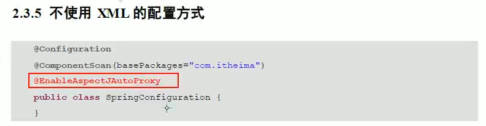

# 11.基于注解的AOP编写

- 笔记本：16.Spring
- 创建时间：2020-04-18 14:27:06 UTC
- 更新时间：2020-04-19 05:43:18 UTC
- 印象笔记 GUID：1be28b3d-f48f-4499-9a07-9a63d567727e

```
<?xml version="1.0" encoding="UTF-8"?>
<beans xmlns="http://www.springframework.org/schema/beans"
       xmlns:xsi="http://www.w3.org/2001/XMLSchema-instance"
       xmlns:aop="http://www.springframework.org/schema/aop"
       xmlns:context="http://www.springframework.org/schema/context"
       xsi:schemaLocation="http://www.springframework.org/schema/beans
        https://www.springframework.org/schema/beans/spring-beans.xsd
        http://www.springframework.org/schema/aop
        https://www.springframework.org/schema/aop/spring-aop.xsd
        http://www.springframework.org/schema/context
        https://www.springframework.org/schema/context/spring-context.xsd">

    <!-- 配置spring创建容器时要扫描的包 -->
    <context:component-scan base-package="com.liudezhi"></context:component-scan>

    <!-- 配置spring开启注解AOP的支持 -->
    <aop:aspectj-autoproxy></aop:aspectj-autoproxy>

</beans>

```

```
package com.liudezhi.service.impl;

/**
 * 账户的业务层实现类
 */
@Service("accountService")
public class AccountServiceImpl implements AccountService {
    @Override
    public void saveAccount() {
        System.out.println("执行了 saveAccount");
//        int i = 1/0;
    }

```

```
package com.liudezhi.util;

/**
 * 用于记录日志的工具类，它里面提供了公共的代码
 */
@Component("logger")
@Aspect //标识当前类是一个切面类
public class Logger {

    @Pointcut("execution(* com.liudezhi.service.impl.*.*(..))")
    private void pt1() {}

    /**
     * 前置通知
     */
    @Before("pt1()")
    public void beforePrintLog() {
        System.out.println("前置通知：Logger类中的beforePrintLog方法开始记录日志了");
    }
    /**
     * 后置通知
     */
    @AfterReturning("pt1()")
    public void afterReturningPrintLog() {
        System.out.println("后置通知：Logger类中的afterReturningPrintLog方法开始记录日志了");
    }
    /**
     * 异常通知
     */
    @AfterThrowing("pt1()")
    public void afterThrowingPrintLog() {
        System.out.println("异常通知：Logger类中的afterThrowingPrintLog方法开始记录日志了");
    }
    /**
     * 最终通知
     */
    @After("pt1()")
    public void afterPrintLog() {
        System.out.println("最终通知：Logger类中的afterPrintLog方法开始记录日志了");
    }

    /**
     * 环绕通知
     */
//    @Around("pt1()")
    public Object aroundPrintLog(ProceedingJoinPoint pjp) {
        Object returnValue = null;
        try {
            Object[] args = pjp.getArgs();  //得到方法执行所需的参数

            System.out.println("Logger类中的aroundPrintLog方法开始记录日志了...前置");

            returnValue = pjp.proceed(args);  //明确调用业务层方法(切入点方法)

            System.out.println("Logger类中的aroundPrintLog方法开始记录日志了...后置");
            return returnValue;
        } catch (Throwable throwable) {
            System.out.println("Logger类中的aroundPrintLog方法开始记录日志了...异常");
            throwable.printStackTrace();
        } finally {
            System.out.println("Logger类中的aroundPrintLog方法开始记录日志了...最终");
        }
        return returnValue;
    }
}

```


 可以取代 bean.xml 中的`<aop:aspectj-autoproxy></aop:aspectj-autoproxy>`

**tips:** 基于注解的方式开发时，前置，后置... 的顺序有些问题，推荐使用环绕通知。

%60%60%60xml%0A%3C%3Fxml%20version%3D%221.0%22%20encoding%3D%22UTF-8%22%3F%3E%0A%3Cbeans%20xmlns%3D%22http%3A%2F%2Fwww.springframework.org%2Fschema%2Fbeans%22%0A%20%20%20%20%20%20%20xmlns%3Axsi%3D%22http%3A%2F%2Fwww.w3.org%2F2001%2FXMLSchema-instance%22%0A%20%20%20%20%20%20%20xmlns%3Aaop%3D%22http%3A%2F%2Fwww.springframework.org%2Fschema%2Faop%22%0A%20%20%20%20%20%20%20xmlns%3Acontext%3D%22http%3A%2F%2Fwww.springframework.org%2Fschema%2Fcontext%22%0A%20%20%20%20%20%20%20xsi%3AschemaLocation%3D%22http%3A%2F%2Fwww.springframework.org%2Fschema%2Fbeans%0A%20%20%20%20%20%20%20%20https%3A%2F%2Fwww.springframework.org%2Fschema%2Fbeans%2Fspring-beans.xsd%0A%20%20%20%20%20%20%20%20http%3A%2F%2Fwww.springframework.org%2Fschema%2Faop%0A%20%20%20%20%20%20%20%20https%3A%2F%2Fwww.springframework.org%2Fschema%2Faop%2Fspring-aop.xsd%0A%20%20%20%20%20%20%20%20http%3A%2F%2Fwww.springframework.org%2Fschema%2Fcontext%0A%20%20%20%20%20%20%20%20https%3A%2F%2Fwww.springframework.org%2Fschema%2Fcontext%2Fspring-context.xsd%22%3E%0A%0A%20%20%20%20%3C!--%20%E9%85%8D%E7%BD%AEspring%E5%88%9B%E5%BB%BA%E5%AE%B9%E5%99%A8%E6%97%B6%E8%A6%81%E6%89%AB%E6%8F%8F%E7%9A%84%E5%8C%85%20--%3E%0A%20%20%20%20%3Ccontext%3Acomponent-scan%20base-package%3D%22com.liudezhi%22%3E%3C%2Fcontext%3Acomponent-scan%3E%0A%0A%20%20%20%20%3C!--%20%E9%85%8D%E7%BD%AEspring%E5%BC%80%E5%90%AF%E6%B3%A8%E8%A7%A3AOP%E7%9A%84%E6%94%AF%E6%8C%81%20--%3E%0A%20%20%20%20%3Caop%3Aaspectj-autoproxy%3E%3C%2Faop%3Aaspectj-autoproxy%3E%0A%0A%3C%2Fbeans%3E%0A%60%60%60%0A%0A%0A%60%60%60java%0Apackage%20com.liudezhi.service.impl%3B%0A%0A%2F**%0A%20*%20%E8%B4%A6%E6%88%B7%E7%9A%84%E4%B8%9A%E5%8A%A1%E5%B1%82%E5%AE%9E%E7%8E%B0%E7%B1%BB%0A%20*%2F%0A%40Service(%22accountService%22)%0Apublic%20class%20AccountServiceImpl%20implements%20AccountService%20%7B%0A%20%20%20%20%40Override%0A%20%20%20%20public%20void%20saveAccount()%20%7B%0A%20%20%20%20%20%20%20%20System.out.println(%22%E6%89%A7%E8%A1%8C%E4%BA%86%20saveAccount%22)%3B%0A%2F%2F%20%20%20%20%20%20%20%20int%20i%20%3D%201%2F0%3B%0A%20%20%20%20%7D%0A%60%60%60%0A%0A%0A%60%60%60java%0Apackage%20com.liudezhi.util%3B%0A%0A%2F**%0A%20*%20%E7%94%A8%E4%BA%8E%E8%AE%B0%E5%BD%95%E6%97%A5%E5%BF%97%E7%9A%84%E5%B7%A5%E5%85%B7%E7%B1%BB%EF%BC%8C%E5%AE%83%E9%87%8C%E9%9D%A2%E6%8F%90%E4%BE%9B%E4%BA%86%E5%85%AC%E5%85%B1%E7%9A%84%E4%BB%A3%E7%A0%81%0A%20*%2F%0A%40Component(%22logger%22)%0A%40Aspect%20%2F%2F%E6%A0%87%E8%AF%86%E5%BD%93%E5%89%8D%E7%B1%BB%E6%98%AF%E4%B8%80%E4%B8%AA%E5%88%87%E9%9D%A2%E7%B1%BB%0Apublic%20class%20Logger%20%7B%0A%0A%20%20%20%20%40Pointcut(%22execution(*%20com.liudezhi.service.impl.*.*(..))%22)%0A%20%20%20%20private%20void%20pt1()%20%7B%7D%0A%0A%20%20%20%20%2F**%0A%20%20%20%20%20*%20%E5%89%8D%E7%BD%AE%E9%80%9A%E7%9F%A5%0A%20%20%20%20%20*%2F%0A%20%20%20%20%40Before(%22pt1()%22)%0A%20%20%20%20public%20void%20beforePrintLog()%20%7B%0A%20%20%20%20%20%20%20%20System.out.println(%22%E5%89%8D%E7%BD%AE%E9%80%9A%E7%9F%A5%EF%BC%9ALogger%E7%B1%BB%E4%B8%AD%E7%9A%84beforePrintLog%E6%96%B9%E6%B3%95%E5%BC%80%E5%A7%8B%E8%AE%B0%E5%BD%95%E6%97%A5%E5%BF%97%E4%BA%86%22)%3B%0A%20%20%20%20%7D%0A%20%20%20%20%2F**%0A%20%20%20%20%20*%20%E5%90%8E%E7%BD%AE%E9%80%9A%E7%9F%A5%0A%20%20%20%20%20*%2F%0A%20%20%20%20%40AfterReturning(%22pt1()%22)%0A%20%20%20%20public%20void%20afterReturningPrintLog()%20%7B%0A%20%20%20%20%20%20%20%20System.out.println(%22%E5%90%8E%E7%BD%AE%E9%80%9A%E7%9F%A5%EF%BC%9ALogger%E7%B1%BB%E4%B8%AD%E7%9A%84afterReturningPrintLog%E6%96%B9%E6%B3%95%E5%BC%80%E5%A7%8B%E8%AE%B0%E5%BD%95%E6%97%A5%E5%BF%97%E4%BA%86%22)%3B%0A%20%20%20%20%7D%0A%20%20%20%20%2F**%0A%20%20%20%20%20*%20%E5%BC%82%E5%B8%B8%E9%80%9A%E7%9F%A5%0A%20%20%20%20%20*%2F%0A%20%20%20%20%40AfterThrowing(%22pt1()%22)%0A%20%20%20%20public%20void%20afterThrowingPrintLog()%20%7B%0A%20%20%20%20%20%20%20%20System.out.println(%22%E5%BC%82%E5%B8%B8%E9%80%9A%E7%9F%A5%EF%BC%9ALogger%E7%B1%BB%E4%B8%AD%E7%9A%84afterThrowingPrintLog%E6%96%B9%E6%B3%95%E5%BC%80%E5%A7%8B%E8%AE%B0%E5%BD%95%E6%97%A5%E5%BF%97%E4%BA%86%22)%3B%0A%20%20%20%20%7D%0A%20%20%20%20%2F**%0A%20%20%20%20%20*%20%E6%9C%80%E7%BB%88%E9%80%9A%E7%9F%A5%0A%20%20%20%20%20*%2F%0A%20%20%20%20%40After(%22pt1()%22)%0A%20%20%20%20public%20void%20afterPrintLog()%20%7B%0A%20%20%20%20%20%20%20%20System.out.println(%22%E6%9C%80%E7%BB%88%E9%80%9A%E7%9F%A5%EF%BC%9ALogger%E7%B1%BB%E4%B8%AD%E7%9A%84afterPrintLog%E6%96%B9%E6%B3%95%E5%BC%80%E5%A7%8B%E8%AE%B0%E5%BD%95%E6%97%A5%E5%BF%97%E4%BA%86%22)%3B%0A%20%20%20%20%7D%0A%0A%20%20%20%20%2F**%0A%20%20%20%20%20*%20%E7%8E%AF%E7%BB%95%E9%80%9A%E7%9F%A5%0A%20%20%20%20%20*%2F%0A%2F%2F%20%20%20%20%40Around(%22pt1()%22)%0A%20%20%20%20public%20Object%20aroundPrintLog(ProceedingJoinPoint%20pjp)%20%7B%0A%20%20%20%20%20%20%20%20Object%20returnValue%20%3D%20null%3B%0A%20%20%20%20%20%20%20%20try%20%7B%0A%20%20%20%20%20%20%20%20%20%20%20%20Object%5B%5D%20args%20%3D%20pjp.getArgs()%3B%20%20%2F%2F%E5%BE%97%E5%88%B0%E6%96%B9%E6%B3%95%E6%89%A7%E8%A1%8C%E6%89%80%E9%9C%80%E7%9A%84%E5%8F%82%E6%95%B0%0A%0A%20%20%20%20%20%20%20%20%20%20%20%20System.out.println(%22Logger%E7%B1%BB%E4%B8%AD%E7%9A%84aroundPrintLog%E6%96%B9%E6%B3%95%E5%BC%80%E5%A7%8B%E8%AE%B0%E5%BD%95%E6%97%A5%E5%BF%97%E4%BA%86...%E5%89%8D%E7%BD%AE%22)%3B%0A%0A%20%20%20%20%20%20%20%20%20%20%20%20returnValue%20%3D%20pjp.proceed(args)%3B%20%20%2F%2F%E6%98%8E%E7%A1%AE%E8%B0%83%E7%94%A8%E4%B8%9A%E5%8A%A1%E5%B1%82%E6%96%B9%E6%B3%95(%E5%88%87%E5%85%A5%E7%82%B9%E6%96%B9%E6%B3%95)%0A%0A%20%20%20%20%20%20%20%20%20%20%20%20System.out.println(%22Logger%E7%B1%BB%E4%B8%AD%E7%9A%84aroundPrintLog%E6%96%B9%E6%B3%95%E5%BC%80%E5%A7%8B%E8%AE%B0%E5%BD%95%E6%97%A5%E5%BF%97%E4%BA%86...%E5%90%8E%E7%BD%AE%22)%3B%0A%20%20%20%20%20%20%20%20%20%20%20%20return%20returnValue%3B%0A%20%20%20%20%20%20%20%20%7D%20catch%20(Throwable%20throwable)%20%7B%0A%20%20%20%20%20%20%20%20%20%20%20%20System.out.println(%22Logger%E7%B1%BB%E4%B8%AD%E7%9A%84aroundPrintLog%E6%96%B9%E6%B3%95%E5%BC%80%E5%A7%8B%E8%AE%B0%E5%BD%95%E6%97%A5%E5%BF%97%E4%BA%86...%E5%BC%82%E5%B8%B8%22)%3B%0A%20%20%20%20%20%20%20%20%20%20%20%20throwable.printStackTrace()%3B%0A%20%20%20%20%20%20%20%20%7D%20finally%20%7B%0A%20%20%20%20%20%20%20%20%20%20%20%20System.out.println(%22Logger%E7%B1%BB%E4%B8%AD%E7%9A%84aroundPrintLog%E6%96%B9%E6%B3%95%E5%BC%80%E5%A7%8B%E8%AE%B0%E5%BD%95%E6%97%A5%E5%BF%97%E4%BA%86...%E6%9C%80%E7%BB%88%22)%3B%0A%20%20%20%20%20%20%20%20%7D%0A%20%20%20%20%20%20%20%20return%20returnValue%3B%0A%20%20%20%20%7D%0A%7D%0A%60%60%60%0A%0A!%5B3f273a928298d19f2f909d5195497152.png%5D(en-resource%3A%2F%2Fdatabase%2F3465%3A1)%0A%E5%8F%AF%E4%BB%A5%E5%8F%96%E4%BB%A3%20bean.xml%20%E4%B8%AD%E7%9A%84%60%3Caop%3Aaspectj-autoproxy%3E%3C%2Faop%3Aaspectj-autoproxy%3E%60%0A%0A%0A**tips%3A**%20%E5%9F%BA%E4%BA%8E%E6%B3%A8%E8%A7%A3%E7%9A%84%E6%96%B9%E5%BC%8F%E5%BC%80%E5%8F%91%E6%97%B6%EF%BC%8C%E5%89%8D%E7%BD%AE%EF%BC%8C%E5%90%8E%E7%BD%AE...%20%E7%9A%84%E9%A1%BA%E5%BA%8F%E6%9C%89%E4%BA%9B%E9%97%AE%E9%A2%98%EF%BC%8C%E4%BC%9A%E5%85%88%E8%B0%83%E7%94%A8%E6%9C%80%E7%BB%88%E9%80%9A%E7%9F%A5%EF%BC%8C%E7%84%B6%E5%90%8E%E6%89%8D%E8%B0%83%E7%94%A8%E5%90%8E%E7%BD%AE%E9%80%9A%E7%9F%A5%E3%80%82%E6%8E%A8%E8%8D%90%E4%BD%BF%E7%94%A8%E7%8E%AF%E7%BB%95%E9%80%9A%E7%9F%A5%E3%80%82
