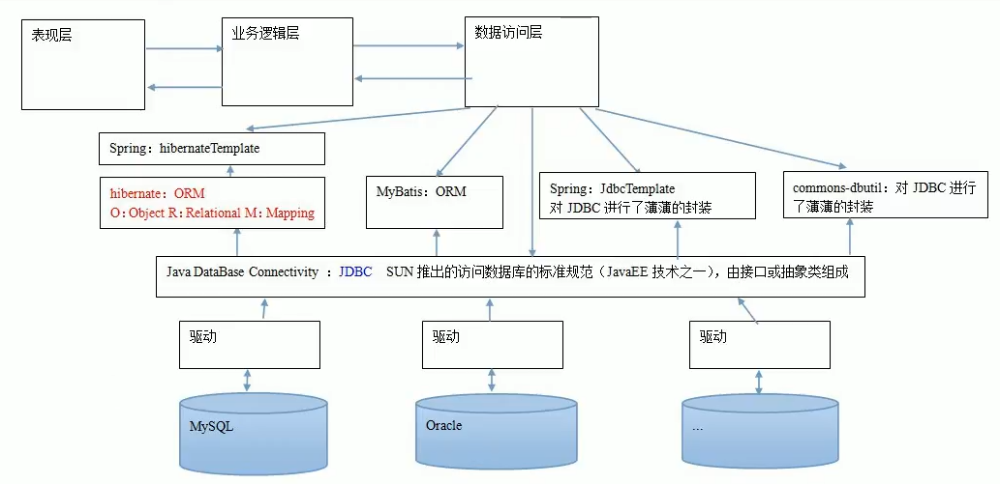

# 12.spring中的JdbcTemplate

- 笔记本：16.Spring
- 创建时间：2020-04-18 15:22:39 UTC
- 更新时间：2020-04-19 05:05:54 UTC
- 印象笔记 GUID：f02ac7b7-e138-4dc4-9fa1-bdcbabc753ae

#### JdbcTemplate 概述

它是 spring 框架中提供的一个对象，是对原始 Jdbc API 对象的简单封装。spring 框架为我们提供了很多的模板操作类。
 操作关系型数据库的：
 JdbcTemplate
 HibernateTemplate
 操作 nosql 数据库的：
 RedisTemplate
 操作消息队列的：
 JmsTemplate
 JdbcTemplate 在 spring-jdbc-版本.jar 中，在导包时，除了要导入这个jar包，还需要导入一个spring-tx-版本.jar（它是和事务相关的）。



##### JdbcTemplate 的作用：

 它就是用于和数据库交互的，实现对表的CRUD操作。

##### 如何创建 JdbcTemplate 对象：

```
/**
 * JdbcTemplate 的最基础用法
 */
public class JdbcTemplateDemo1 {
    public static void main(String[] args) {
        //准备数据源：spring的内置数据源
        DriverManagerDataSource ds = new DriverManagerDataSource();
        ds.setDriverClassName("com.mysql.cj.jdbc.Driver");
        ds.setUrl("jdbc:mysql://localhost:3306/learn_spring?useUnicode=true&characterEncoding=utf-8&useSSL=false&serverTimezone=GMT");
        ds.setUsername("root");
        ds.setPassword("Liudezhi");

        //1. 创建JdbcTemplate对象
        JdbcTemplate jt = new JdbcTemplate();
        //给jt设置数据源
        jt.setDataSource(ds);
        //2. 执行操作
        jt.execute("insert into account(name, money) values ('liudezhi', 500000)");
    }
}

```

##### spring ioc 中使用 JdbcTemplate

```
<?xml version="1.0" encoding="UTF-8"?>
<beans xmlns="http://www.springframework.org/schema/beans"
       xmlns:xsi="http://www.w3.org/2001/XMLSchema-instance"
       xsi:schemaLocation="http://www.springframework.org/schema/beans
        https://www.springframework.org/schema/beans/spring-beans.xsd">

    <!-- 配置JdbcTemplate -->
    <bean id="jdbcTemplate" class="org.springframework.jdbc.core.JdbcTemplate">
        <property name="dataSource" ref="dataSource"></property>
    </bean>

    <!-- 配置数据源 -->
    <bean id="dataSource" class="org.springframework.jdbc.datasource.DriverManagerDataSource">
        <property name="driverClassName" value="com.mysql.cj.jdbc.Driver"></property>
        <property name="url" value="jdbc:mysql://localhost:3306/learn_spring?useUnicode=true&amp;characterEncoding=utf-8&amp;useSSL=false&amp;serverTimezone=GMT"></property>
        <property name="username" value="root"></property>
        <property name="password" value="Liudezhi"></property>
    </bean>
</beans>

```

```
package com.liudezhi.jdbcTemplate;

/**
 * JdbcTemplate 的CRUD操作
 */
public class JdbcTemplateDemo2 {
    public static void main(String[] args) {
        //1. 获取容器
        ApplicationContext ac = new ClassPathXmlApplicationContext("bean.xml");
        //2. 获取对象
        JdbcTemplate jt = ac.getBean("jdbcTemplate", JdbcTemplate.class);
        //3. 执行操作
        //保存
        jt.update("insert into account(name, value)values(?,?)", "eee", 3333f);
}

```

##### JdbcTemplate 对象中的常用方法：

```
//保存
jt.update("insert into account(name, value)values(?,?)", "eee", 3333f);
//更新
jt.update("update account set name=?, money=? where id=?", "xis", 100000f, 1);
//删除
jt.update("delete form account where id = ?", 8);
//查询所有
//        List<Account> accounts = jt.query("select * from account where money > ?", new AccountRowMapper(), 8000f);
List<Account> accounts = jt.query("select * from account where money > ?", new BeanPropertyRowMapper<Account>(Account.class), 8000f);
for (Account account : accounts) {
    System.out.println(account);
}
//查询一个
List<Account> accounts1 = jt.query("select * from account where id = ?", new BeanPropertyRowMapper<Account>(Account.class), 1);
System.out.println(accounts1.isEmpty() ? "没有内容" : accounts1.get(0));
//返回一行一列（使用聚合函数，但不加group by 子句）
Integer count = jt.queryForObject("select count(*) from account where money > ?", Integer.class, 10000f);
System.out.println(count);

```

```
/**
 * 定义Account的封装策略
 */
class AccountRowMapper implements RowMapper<Account> {

    /**
     * 把结果集中的数据封装到Account中，然后由spring把每个account加到集合中
     * @param resultSet
     * @param i
     * @return
     * @throws SQLException
     */
    @Override
    public Account mapRow(ResultSet resultSet, int i) throws SQLException {
        Account account = new Account();
        account.setId(resultSet.getInt("id"));
        account.setName(resultSet.getString("name"));
        account.setMoney(resultSet.getFloat("money"));
        return account;
    }
}

```

##### JdbcTemplate 在 dao 中的使用：

```
package com.liudezhi.dao.impl;

/**
 * 账户的持久层实现类
 */
public class AccountDaoImpl extends JdbcDaoSupport implements AccountDao {

    @Override
    public Account findAccountById(Integer accountId) {
        List<Account> accounts = getJdbcTemplate().query("select * from account where id = ?", new BeanPropertyRowMapper<Account>(Account.class), accountId);
        return accounts.isEmpty() ? null : accounts.get(0);
    }

    @Override
    public Account findAccountByName(String accountName) {
        List<Account> accounts = getJdbcTemplate().query("select * from account where name = ?", new BeanPropertyRowMapper<Account>(Account.class), accountName);
        if (accounts.isEmpty()) {
            return null;
        }
        if (accounts.size() > 1) {
            throw new RuntimeException("结果集不唯一");
        }
        return accounts.get(0);
    }

    @Override
    public void updateAccount(Account account) {
        super.getJdbcTemplate().update("update account set name = ?, money = ? where id = ?", account.getName(), account.getMoney(), account.getId());
    }
}

```

```
public class Account implements Serializable {
    private Integer id;
    private String name;
    private Float money;
}

```

```
<?xml version="1.0" encoding="UTF-8"?>
<beans xmlns="http://www.springframework.org/schema/beans"
       xmlns:xsi="http://www.w3.org/2001/XMLSchema-instance"
       xsi:schemaLocation="http://www.springframework.org/schema/beans
        https://www.springframework.org/schema/beans/spring-beans.xsd">

    <!-- 配置账户的持久层 -->
    <bean id="accountDao" class="com.liudezhi.dao.impl.AccountDaoImpl">
        <property name="jdbcTemplate" ref="jdbcTemplate"></property>
    </bean>

    <!-- 配置JdbcTemplate -->
    <bean id="jdbcTemplate" class="org.springframework.jdbc.core.JdbcTemplate">
        <property name="dataSource" ref="dataSource"></property>
    </bean>

    <!-- 配置数据源 -->
    <bean id="dataSource" class="org.springframework.jdbc.datasource.DriverManagerDataSource">
        <property name="driverClassName" value="com.mysql.cj.jdbc.Driver"></property>
        <property name="url" value="jdbc:mysql://localhost:3306/learn_spring?useUnicode=true&amp;characterEncoding=utf-8&amp;useSSL=false&amp;serverTimezone=GMT"></property>
        <property name="username" value="root"></property>
        <property name="password" value="Liudezhi"></property>
    </bean>
</beans>

```

```
package com.liudezhi.jdbcTemplate;

/**
 * JdbcTemplate 的最基础用法
 */
public class JdbcTemplateDemo3 {
    public static void main(String[] args) {
        //1. 获取容器
        ApplicationContext ac = new ClassPathXmlApplicationContext("bean.xml");
        AccountDao accountDao = ac.getBean("accountDao", AccountDao.class);

        Account a1 = accountDao.findAccountById(1);
        System.out.println(a1);

        Account a2 = accountDao.findAccountByName("liudezhi");
        System.out.println(a2);

        a2.setMoney(600000.0f);
        accountDao.updateAccount(a2);
    }
}

```

##### JdbcDaoSupport 的使用以及 Dao 的两种编写方式：

```
package com.liudezhi.dao.impl;
/**
 * 此类用于抽取dao中的重复代码
 */
public class JdbcDaoSupport {

    private JdbcTemplate jdbcTemplate;

    public void setJdbcTemplate(JdbcTemplate jdbcTemplate) {
        this.jdbcTemplate = jdbcTemplate;
    }

    public JdbcTemplate getJdbcTemplate() {
        return jdbcTemplate;
    }
}

```

**注：** spring 提供了JdbcDaoSupport 类，无需我们手动书写，直接继承spring提供的即可。但是要注意如果继承spring提供的，在使用注解时，会比较麻烦。

**方式一：**

```
package com.liudezhi.dao.impl;

/**
 * 账户的持久层实现类
 */
public class AccountDaoImpl extends JdbcDaoSupport implements AccountDao {

    @Override
    public Account findAccountById(Integer accountId) {
        List<Account> accounts = getJdbcTemplate().query("select * from account where id = ?", new BeanPropertyRowMapper<Account>(Account.class), accountId);
        return accounts.isEmpty() ? null : accounts.get(0);
    }
}

```

**方式二：**

```
package com.liudezhi.dao.impl;

/**
 * 账户的持久层实现类
 */
public class AccountDaoImpl2 implements AccountDao {

    private JdbcTemplate jdbcTemplate;

    public void setJdbcTemplate(JdbcTemplate jdbcTemplate) {
        this.jdbcTemplate = jdbcTemplate;
    }

    @Override
    public Account findAccountById(Integer accountId) {
        List<Account> accounts = jdbcTemplate.query("select * from account where id = ?", new BeanPropertyRowMapper<Account>(Account.class), accountId);
        return accounts.isEmpty() ? null : accounts.get(0);
    }
}

```

%23%23%23%23%20JdbcTemplate%20%E6%A6%82%E8%BF%B0%0A%E5%AE%83%E6%98%AF%20spring%20%E6%A1%86%E6%9E%B6%E4%B8%AD%E6%8F%90%E4%BE%9B%E7%9A%84%E4%B8%80%E4%B8%AA%E5%AF%B9%E8%B1%A1%EF%BC%8C%E6%98%AF%E5%AF%B9%E5%8E%9F%E5%A7%8B%20Jdbc%20API%20%E5%AF%B9%E8%B1%A1%E7%9A%84%E7%AE%80%E5%8D%95%E5%B0%81%E8%A3%85%E3%80%82spring%20%E6%A1%86%E6%9E%B6%E4%B8%BA%E6%88%91%E4%BB%AC%E6%8F%90%E4%BE%9B%E4%BA%86%E5%BE%88%E5%A4%9A%E7%9A%84%E6%A8%A1%E6%9D%BF%E6%93%8D%E4%BD%9C%E7%B1%BB%E3%80%82%0A%26ensp%3B%26ensp%3B%26ensp%3B%26ensp%3B%E6%93%8D%E4%BD%9C%E5%85%B3%E7%B3%BB%E5%9E%8B%E6%95%B0%E6%8D%AE%E5%BA%93%E7%9A%84%EF%BC%9A%0A%26ensp%3B%26ensp%3B%26ensp%3B%26ensp%3B%26ensp%3B%26ensp%3B%26ensp%3B%26ensp%3BJdbcTemplate%0A%26ensp%3B%26ensp%3B%26ensp%3B%26ensp%3B%26ensp%3B%26ensp%3B%26ensp%3B%26ensp%3BHibernateTemplate%0A%26ensp%3B%26ensp%3B%26ensp%3B%26ensp%3B%E6%93%8D%E4%BD%9C%20nosql%20%E6%95%B0%E6%8D%AE%E5%BA%93%E7%9A%84%EF%BC%9A%0A%26ensp%3B%26ensp%3B%26ensp%3B%26ensp%3B%26ensp%3B%26ensp%3B%26ensp%3B%26ensp%3BRedisTemplate%0A%26ensp%3B%26ensp%3B%26ensp%3B%26ensp%3B%E6%93%8D%E4%BD%9C%E6%B6%88%E6%81%AF%E9%98%9F%E5%88%97%E7%9A%84%EF%BC%9A%0A%26ensp%3B%26ensp%3B%26ensp%3B%26ensp%3B%26ensp%3B%26ensp%3B%26ensp%3B%26ensp%3BJmsTemplate%0A%20%20%20%20JdbcTemplate%20%E5%9C%A8%20spring-jdbc-%E7%89%88%E6%9C%AC.jar%20%E4%B8%AD%EF%BC%8C%E5%9C%A8%E5%AF%BC%E5%8C%85%E6%97%B6%EF%BC%8C%E9%99%A4%E4%BA%86%E8%A6%81%E5%AF%BC%E5%85%A5%E8%BF%99%E4%B8%AAjar%E5%8C%85%EF%BC%8C%E8%BF%98%E9%9C%80%E8%A6%81%E5%AF%BC%E5%85%A5%E4%B8%80%E4%B8%AAspring-tx-%E7%89%88%E6%9C%AC.jar%EF%BC%88%E5%AE%83%E6%98%AF%E5%92%8C%E4%BA%8B%E5%8A%A1%E7%9B%B8%E5%85%B3%E7%9A%84%EF%BC%89%E3%80%82%0A%0A!%5B75cc235b20dbd26d86ad8a9bf4a5b68f.png%5D(en-resource%3A%2F%2Fdatabase%2F3471%3A1)%0A%0A%23%23%23%23%23%20JdbcTemplate%20%E7%9A%84%E4%BD%9C%E7%94%A8%EF%BC%9A%0A%26ensp%3B%26ensp%3B%26ensp%3B%26ensp%3B%E5%AE%83%E5%B0%B1%E6%98%AF%E7%94%A8%E4%BA%8E%E5%92%8C%E6%95%B0%E6%8D%AE%E5%BA%93%E4%BA%A4%E4%BA%92%E7%9A%84%EF%BC%8C%E5%AE%9E%E7%8E%B0%E5%AF%B9%E8%A1%A8%E7%9A%84CRUD%E6%93%8D%E4%BD%9C%E3%80%82%0A%0A%23%23%23%23%23%20%E5%A6%82%E4%BD%95%E5%88%9B%E5%BB%BA%20JdbcTemplate%20%E5%AF%B9%E8%B1%A1%EF%BC%9A%0A%60%60%60java%0A%2F**%0A%20*%20JdbcTemplate%20%E7%9A%84%E6%9C%80%E5%9F%BA%E7%A1%80%E7%94%A8%E6%B3%95%0A%20*%2F%0Apublic%20class%20JdbcTemplateDemo1%20%7B%0A%20%20%20%20public%20static%20void%20main(String%5B%5D%20args)%20%7B%0A%20%20%20%20%20%20%20%20%2F%2F%E5%87%86%E5%A4%87%E6%95%B0%E6%8D%AE%E6%BA%90%EF%BC%9Aspring%E7%9A%84%E5%86%85%E7%BD%AE%E6%95%B0%E6%8D%AE%E6%BA%90%0A%20%20%20%20%20%20%20%20DriverManagerDataSource%20ds%20%3D%20new%20DriverManagerDataSource()%3B%0A%20%20%20%20%20%20%20%20ds.setDriverClassName(%22com.mysql.cj.jdbc.Driver%22)%3B%0A%20%20%20%20%20%20%20%20ds.setUrl(%22jdbc%3Amysql%3A%2F%2Flocalhost%3A3306%2Flearn_spring%3FuseUnicode%3Dtrue%26characterEncoding%3Dutf-8%26useSSL%3Dfalse%26serverTimezone%3DGMT%22)%3B%0A%20%20%20%20%20%20%20%20ds.setUsername(%22root%22)%3B%0A%20%20%20%20%20%20%20%20ds.setPassword(%22Liudezhi%22)%3B%0A%0A%20%20%20%20%20%20%20%20%2F%2F1.%20%E5%88%9B%E5%BB%BAJdbcTemplate%E5%AF%B9%E8%B1%A1%0A%20%20%20%20%20%20%20%20JdbcTemplate%20jt%20%3D%20new%20JdbcTemplate()%3B%0A%20%20%20%20%20%20%20%20%2F%2F%E7%BB%99jt%E8%AE%BE%E7%BD%AE%E6%95%B0%E6%8D%AE%E6%BA%90%0A%20%20%20%20%20%20%20%20jt.setDataSource(ds)%3B%0A%20%20%20%20%20%20%20%20%2F%2F2.%20%E6%89%A7%E8%A1%8C%E6%93%8D%E4%BD%9C%0A%20%20%20%20%20%20%20%20jt.execute(%22insert%20into%20account(name%2C%20money)%20values%20('liudezhi'%2C%20500000)%22)%3B%0A%20%20%20%20%7D%0A%7D%0A%60%60%60%0A%0A%23%23%23%23%23%20spring%20ioc%20%E4%B8%AD%E4%BD%BF%E7%94%A8%20JdbcTemplate%0A%60%60%60xml%0A%3C%3Fxml%20version%3D%221.0%22%20encoding%3D%22UTF-8%22%3F%3E%0A%3Cbeans%20xmlns%3D%22http%3A%2F%2Fwww.springframework.org%2Fschema%2Fbeans%22%0A%20%20%20%20%20%20%20xmlns%3Axsi%3D%22http%3A%2F%2Fwww.w3.org%2F2001%2FXMLSchema-instance%22%0A%20%20%20%20%20%20%20xsi%3AschemaLocation%3D%22http%3A%2F%2Fwww.springframework.org%2Fschema%2Fbeans%0A%20%20%20%20%20%20%20%20https%3A%2F%2Fwww.springframework.org%2Fschema%2Fbeans%2Fspring-beans.xsd%22%3E%0A%0A%20%20%20%20%3C!--%20%E9%85%8D%E7%BD%AEJdbcTemplate%20--%3E%0A%20%20%20%20%3Cbean%20id%3D%22jdbcTemplate%22%20class%3D%22org.springframework.jdbc.core.JdbcTemplate%22%3E%0A%20%20%20%20%20%20%20%20%3Cproperty%20name%3D%22dataSource%22%20ref%3D%22dataSource%22%3E%3C%2Fproperty%3E%0A%20%20%20%20%3C%2Fbean%3E%0A%0A%20%20%20%20%3C!--%20%E9%85%8D%E7%BD%AE%E6%95%B0%E6%8D%AE%E6%BA%90%20--%3E%0A%20%20%20%20%3Cbean%20id%3D%22dataSource%22%20class%3D%22org.springframework.jdbc.datasource.DriverManagerDataSource%22%3E%0A%20%20%20%20%20%20%20%20%3Cproperty%20name%3D%22driverClassName%22%20value%3D%22com.mysql.cj.jdbc.Driver%22%3E%3C%2Fproperty%3E%0A%20%20%20%20%20%20%20%20%3Cproperty%20name%3D%22url%22%20value%3D%22jdbc%3Amysql%3A%2F%2Flocalhost%3A3306%2Flearn_spring%3FuseUnicode%3Dtrue%26amp%3BcharacterEncoding%3Dutf-8%26amp%3BuseSSL%3Dfalse%26amp%3BserverTimezone%3DGMT%22%3E%3C%2Fproperty%3E%0A%20%20%20%20%20%20%20%20%3Cproperty%20name%3D%22username%22%20value%3D%22root%22%3E%3C%2Fproperty%3E%0A%20%20%20%20%20%20%20%20%3Cproperty%20name%3D%22password%22%20value%3D%22Liudezhi%22%3E%3C%2Fproperty%3E%0A%20%20%20%20%3C%2Fbean%3E%0A%3C%2Fbeans%3E%0A%60%60%60%0A%0A%60%60%60java%0Apackage%20com.liudezhi.jdbcTemplate%3B%0A%0A%2F**%0A%20*%20JdbcTemplate%20%E7%9A%84CRUD%E6%93%8D%E4%BD%9C%0A%20*%2F%0Apublic%20class%20JdbcTemplateDemo2%20%7B%0A%20%20%20%20public%20static%20void%20main(String%5B%5D%20args)%20%7B%0A%20%20%20%20%20%20%20%20%2F%2F1.%20%E8%8E%B7%E5%8F%96%E5%AE%B9%E5%99%A8%0A%20%20%20%20%20%20%20%20ApplicationContext%20ac%20%3D%20new%20ClassPathXmlApplicationContext(%22bean.xml%22)%3B%0A%20%20%20%20%20%20%20%20%2F%2F2.%20%E8%8E%B7%E5%8F%96%E5%AF%B9%E8%B1%A1%0A%20%20%20%20%20%20%20%20JdbcTemplate%20jt%20%3D%20ac.getBean(%22jdbcTemplate%22%2C%20JdbcTemplate.class)%3B%0A%20%20%20%20%20%20%20%20%2F%2F3.%20%E6%89%A7%E8%A1%8C%E6%93%8D%E4%BD%9C%0A%20%20%20%20%20%20%20%20%2F%2F%E4%BF%9D%E5%AD%98%0A%20%20%20%20%20%20%20%20jt.update(%22insert%20into%20account(name%2C%20value)values(%3F%2C%3F)%22%2C%20%22eee%22%2C%203333f)%3B%0A%7D%0A%60%60%60%0A%0A%23%23%23%23%23%20JdbcTemplate%20%E5%AF%B9%E8%B1%A1%E4%B8%AD%E7%9A%84%E5%B8%B8%E7%94%A8%E6%96%B9%E6%B3%95%EF%BC%9A%0A%0A%60%60%60java%0A%2F%2F%E4%BF%9D%E5%AD%98%0Ajt.update(%22insert%20into%20account(name%2C%20value)values(%3F%2C%3F)%22%2C%20%22eee%22%2C%203333f)%3B%0A%2F%2F%E6%9B%B4%E6%96%B0%0Ajt.update(%22update%20account%20set%20name%3D%3F%2C%20money%3D%3F%20where%20id%3D%3F%22%2C%20%22xis%22%2C%20100000f%2C%201)%3B%0A%2F%2F%E5%88%A0%E9%99%A4%0Ajt.update(%22delete%20form%20account%20where%20id%20%3D%20%3F%22%2C%208)%3B%0A%2F%2F%E6%9F%A5%E8%AF%A2%E6%89%80%E6%9C%89%0A%2F%2F%20%20%20%20%20%20%20%20List%3CAccount%3E%20accounts%20%3D%20jt.query(%22select%20*%20from%20account%20where%20money%20%3E%20%3F%22%2C%20new%20AccountRowMapper()%2C%208000f)%3B%0AList%3CAccount%3E%20accounts%20%3D%20jt.query(%22select%20*%20from%20account%20where%20money%20%3E%20%3F%22%2C%20new%20BeanPropertyRowMapper%3CAccount%3E(Account.class)%2C%208000f)%3B%0Afor%20(Account%20account%20%3A%20accounts)%20%7B%0A%20%20%20%20System.out.println(account)%3B%0A%7D%0A%2F%2F%E6%9F%A5%E8%AF%A2%E4%B8%80%E4%B8%AA%0AList%3CAccount%3E%20accounts1%20%3D%20jt.query(%22select%20*%20from%20account%20where%20id%20%3D%20%3F%22%2C%20new%20BeanPropertyRowMapper%3CAccount%3E(Account.class)%2C%201)%3B%0ASystem.out.println(accounts1.isEmpty()%20%3F%20%22%E6%B2%A1%E6%9C%89%E5%86%85%E5%AE%B9%22%20%3A%20accounts1.get(0))%3B%0A%2F%2F%E8%BF%94%E5%9B%9E%E4%B8%80%E8%A1%8C%E4%B8%80%E5%88%97%EF%BC%88%E4%BD%BF%E7%94%A8%E8%81%9A%E5%90%88%E5%87%BD%E6%95%B0%EF%BC%8C%E4%BD%86%E4%B8%8D%E5%8A%A0group%20by%20%E5%AD%90%E5%8F%A5%EF%BC%89%0AInteger%20count%20%3D%20jt.queryForObject(%22select%20count(*)%20from%20account%20where%20money%20%3E%20%3F%22%2C%20Integer.class%2C%2010000f)%3B%0ASystem.out.println(count)%3B%0A%60%60%60%0A%0A%60%60%60java%0A%2F**%0A%20*%20%E5%AE%9A%E4%B9%89Account%E7%9A%84%E5%B0%81%E8%A3%85%E7%AD%96%E7%95%A5%0A%20*%2F%0Aclass%20AccountRowMapper%20implements%20RowMapper%3CAccount%3E%20%7B%0A%0A%20%20%20%20%2F**%0A%20%20%20%20%20*%20%E6%8A%8A%E7%BB%93%E6%9E%9C%E9%9B%86%E4%B8%AD%E7%9A%84%E6%95%B0%E6%8D%AE%E5%B0%81%E8%A3%85%E5%88%B0Account%E4%B8%AD%EF%BC%8C%E7%84%B6%E5%90%8E%E7%94%B1spring%E6%8A%8A%E6%AF%8F%E4%B8%AAaccount%E5%8A%A0%E5%88%B0%E9%9B%86%E5%90%88%E4%B8%AD%0A%20%20%20%20%20*%20%40param%20resultSet%0A%20%20%20%20%20*%20%40param%20i%0A%20%20%20%20%20*%20%40return%0A%20%20%20%20%20*%20%40throws%20SQLException%0A%20%20%20%20%20*%2F%0A%20%20%20%20%40Override%0A%20%20%20%20public%20Account%20mapRow(ResultSet%20resultSet%2C%20int%20i)%20throws%20SQLException%20%7B%0A%20%20%20%20%20%20%20%20Account%20account%20%3D%20new%20Account()%3B%0A%20%20%20%20%20%20%20%20account.setId(resultSet.getInt(%22id%22))%3B%0A%20%20%20%20%20%20%20%20account.setName(resultSet.getString(%22name%22))%3B%0A%20%20%20%20%20%20%20%20account.setMoney(resultSet.getFloat(%22money%22))%3B%0A%20%20%20%20%20%20%20%20return%20account%3B%0A%20%20%20%20%7D%0A%7D%0A%60%60%60%0A%0A%23%23%23%23%23%20JdbcTemplate%20%E5%9C%A8%20dao%20%E4%B8%AD%E7%9A%84%E4%BD%BF%E7%94%A8%EF%BC%9A%0A%60%60%60java%0Apackage%20com.liudezhi.dao.impl%3B%0A%0A%2F**%0A%20*%20%E8%B4%A6%E6%88%B7%E7%9A%84%E6%8C%81%E4%B9%85%E5%B1%82%E5%AE%9E%E7%8E%B0%E7%B1%BB%0A%20*%2F%0Apublic%20class%20AccountDaoImpl%20extends%20JdbcDaoSupport%20implements%20AccountDao%20%7B%0A%0A%20%20%20%20%40Override%0A%20%20%20%20public%20Account%20findAccountById(Integer%20accountId)%20%7B%0A%20%20%20%20%20%20%20%20List%3CAccount%3E%20accounts%20%3D%20getJdbcTemplate().query(%22select%20*%20from%20account%20where%20id%20%3D%20%3F%22%2C%20new%20BeanPropertyRowMapper%3CAccount%3E(Account.class)%2C%20accountId)%3B%0A%20%20%20%20%20%20%20%20return%20accounts.isEmpty()%20%3F%20null%20%3A%20accounts.get(0)%3B%0A%20%20%20%20%7D%0A%0A%20%20%20%20%40Override%0A%20%20%20%20public%20Account%20findAccountByName(String%20accountName)%20%7B%0A%20%20%20%20%20%20%20%20List%3CAccount%3E%20accounts%20%3D%20getJdbcTemplate().query(%22select%20*%20from%20account%20where%20name%20%3D%20%3F%22%2C%20new%20BeanPropertyRowMapper%3CAccount%3E(Account.class)%2C%20accountName)%3B%0A%20%20%20%20%20%20%20%20if%20(accounts.isEmpty())%20%7B%0A%20%20%20%20%20%20%20%20%20%20%20%20return%20null%3B%0A%20%20%20%20%20%20%20%20%7D%0A%20%20%20%20%20%20%20%20if%20(accounts.size()%20%3E%201)%20%7B%0A%20%20%20%20%20%20%20%20%20%20%20%20throw%20new%20RuntimeException(%22%E7%BB%93%E6%9E%9C%E9%9B%86%E4%B8%8D%E5%94%AF%E4%B8%80%22)%3B%0A%20%20%20%20%20%20%20%20%7D%0A%20%20%20%20%20%20%20%20return%20accounts.get(0)%3B%0A%20%20%20%20%7D%0A%0A%20%20%20%20%40Override%0A%20%20%20%20public%20void%20updateAccount(Account%20account)%20%7B%0A%20%20%20%20%20%20%20%20super.getJdbcTemplate().update(%22update%20account%20set%20name%20%3D%20%3F%2C%20money%20%3D%20%3F%20where%20id%20%3D%20%3F%22%2C%20account.getName()%2C%20account.getMoney()%2C%20account.getId())%3B%0A%20%20%20%20%7D%0A%7D%0A%60%60%60%0A%0A%60%60%60java%0Apublic%20class%20Account%20implements%20Serializable%20%7B%0A%20%20%20%20private%20Integer%20id%3B%0A%20%20%20%20private%20String%20name%3B%0A%20%20%20%20private%20Float%20money%3B%0A%7D%0A%60%60%60%0A%0A%60%60%60xml%0A%3C%3Fxml%20version%3D%221.0%22%20encoding%3D%22UTF-8%22%3F%3E%0A%3Cbeans%20xmlns%3D%22http%3A%2F%2Fwww.springframework.org%2Fschema%2Fbeans%22%0A%20%20%20%20%20%20%20xmlns%3Axsi%3D%22http%3A%2F%2Fwww.w3.org%2F2001%2FXMLSchema-instance%22%0A%20%20%20%20%20%20%20xsi%3AschemaLocation%3D%22http%3A%2F%2Fwww.springframework.org%2Fschema%2Fbeans%0A%20%20%20%20%20%20%20%20https%3A%2F%2Fwww.springframework.org%2Fschema%2Fbeans%2Fspring-beans.xsd%22%3E%0A%0A%20%20%20%20%3C!--%20%E9%85%8D%E7%BD%AE%E8%B4%A6%E6%88%B7%E7%9A%84%E6%8C%81%E4%B9%85%E5%B1%82%20--%3E%0A%20%20%20%20%3Cbean%20id%3D%22accountDao%22%20class%3D%22com.liudezhi.dao.impl.AccountDaoImpl%22%3E%0A%20%20%20%20%20%20%20%20%3Cproperty%20name%3D%22jdbcTemplate%22%20ref%3D%22jdbcTemplate%22%3E%3C%2Fproperty%3E%0A%20%20%20%20%3C%2Fbean%3E%0A%0A%20%20%20%20%3C!--%20%E9%85%8D%E7%BD%AEJdbcTemplate%20--%3E%0A%20%20%20%20%3Cbean%20id%3D%22jdbcTemplate%22%20class%3D%22org.springframework.jdbc.core.JdbcTemplate%22%3E%0A%20%20%20%20%20%20%20%20%3Cproperty%20name%3D%22dataSource%22%20ref%3D%22dataSource%22%3E%3C%2Fproperty%3E%0A%20%20%20%20%3C%2Fbean%3E%0A%0A%20%20%20%20%3C!--%20%E9%85%8D%E7%BD%AE%E6%95%B0%E6%8D%AE%E6%BA%90%20--%3E%0A%20%20%20%20%3Cbean%20id%3D%22dataSource%22%20class%3D%22org.springframework.jdbc.datasource.DriverManagerDataSource%22%3E%0A%20%20%20%20%20%20%20%20%3Cproperty%20name%3D%22driverClassName%22%20value%3D%22com.mysql.cj.jdbc.Driver%22%3E%3C%2Fproperty%3E%0A%20%20%20%20%20%20%20%20%3Cproperty%20name%3D%22url%22%20value%3D%22jdbc%3Amysql%3A%2F%2Flocalhost%3A3306%2Flearn_spring%3FuseUnicode%3Dtrue%26amp%3BcharacterEncoding%3Dutf-8%26amp%3BuseSSL%3Dfalse%26amp%3BserverTimezone%3DGMT%22%3E%3C%2Fproperty%3E%0A%20%20%20%20%20%20%20%20%3Cproperty%20name%3D%22username%22%20value%3D%22root%22%3E%3C%2Fproperty%3E%0A%20%20%20%20%20%20%20%20%3Cproperty%20name%3D%22password%22%20value%3D%22Liudezhi%22%3E%3C%2Fproperty%3E%0A%20%20%20%20%3C%2Fbean%3E%0A%3C%2Fbeans%3E%0A%60%60%60%0A%0A%60%60%60java%0Apackage%20com.liudezhi.jdbcTemplate%3B%0A%0A%2F**%0A%20*%20JdbcTemplate%20%E7%9A%84%E6%9C%80%E5%9F%BA%E7%A1%80%E7%94%A8%E6%B3%95%0A%20*%2F%0Apublic%20class%20JdbcTemplateDemo3%20%7B%0A%20%20%20%20public%20static%20void%20main(String%5B%5D%20args)%20%7B%0A%20%20%20%20%20%20%20%20%2F%2F1.%20%E8%8E%B7%E5%8F%96%E5%AE%B9%E5%99%A8%0A%20%20%20%20%20%20%20%20ApplicationContext%20ac%20%3D%20new%20ClassPathXmlApplicationContext(%22bean.xml%22)%3B%0A%20%20%20%20%20%20%20%20AccountDao%20accountDao%20%3D%20ac.getBean(%22accountDao%22%2C%20AccountDao.class)%3B%0A%0A%20%20%20%20%20%20%20%20Account%20a1%20%3D%20accountDao.findAccountById(1)%3B%0A%20%20%20%20%20%20%20%20System.out.println(a1)%3B%0A%0A%20%20%20%20%20%20%20%20Account%20a2%20%3D%20accountDao.findAccountByName(%22liudezhi%22)%3B%0A%20%20%20%20%20%20%20%20System.out.println(a2)%3B%0A%0A%20%20%20%20%20%20%20%20a2.setMoney(600000.0f)%3B%0A%20%20%20%20%20%20%20%20accountDao.updateAccount(a2)%3B%0A%20%20%20%20%7D%0A%7D%0A%60%60%60%0A%0A%23%23%23%23%23%20JdbcDaoSupport%20%E7%9A%84%E4%BD%BF%E7%94%A8%E4%BB%A5%E5%8F%8A%20Dao%20%E7%9A%84%E4%B8%A4%E7%A7%8D%E7%BC%96%E5%86%99%E6%96%B9%E5%BC%8F%EF%BC%9A%0A%60%60%60java%0Apackage%20com.liudezhi.dao.impl%3B%0A%2F**%0A%20*%20%E6%AD%A4%E7%B1%BB%E7%94%A8%E4%BA%8E%E6%8A%BD%E5%8F%96dao%E4%B8%AD%E7%9A%84%E9%87%8D%E5%A4%8D%E4%BB%A3%E7%A0%81%0A%20*%2F%0Apublic%20class%20JdbcDaoSupport%20%7B%0A%0A%20%20%20%20private%20JdbcTemplate%20jdbcTemplate%3B%0A%0A%20%20%20%20public%20void%20setJdbcTemplate(JdbcTemplate%20jdbcTemplate)%20%7B%0A%20%20%20%20%20%20%20%20this.jdbcTemplate%20%3D%20jdbcTemplate%3B%0A%20%20%20%20%7D%0A%0A%20%20%20%20public%20JdbcTemplate%20getJdbcTemplate()%20%7B%0A%20%20%20%20%20%20%20%20return%20jdbcTemplate%3B%0A%20%20%20%20%7D%0A%7D%0A%60%60%60%0A**%E6%B3%A8%EF%BC%9A**%20spring%20%E6%8F%90%E4%BE%9B%E4%BA%86JdbcDaoSupport%20%E7%B1%BB%EF%BC%8C%E6%97%A0%E9%9C%80%E6%88%91%E4%BB%AC%E6%89%8B%E5%8A%A8%E4%B9%A6%E5%86%99%EF%BC%8C%E7%9B%B4%E6%8E%A5%E7%BB%A7%E6%89%BFspring%E6%8F%90%E4%BE%9B%E7%9A%84%E5%8D%B3%E5%8F%AF%E3%80%82%E4%BD%86%E6%98%AF%E8%A6%81%E6%B3%A8%E6%84%8F%E5%A6%82%E6%9E%9C%E7%BB%A7%E6%89%BFspring%E6%8F%90%E4%BE%9B%E7%9A%84%EF%BC%8C%E5%9C%A8%E4%BD%BF%E7%94%A8%E6%B3%A8%E8%A7%A3%E6%97%B6%EF%BC%8C%E4%BC%9A%E6%AF%94%E8%BE%83%E9%BA%BB%E7%83%A6%E3%80%82%0A%0A**%E6%96%B9%E5%BC%8F%E4%B8%80%EF%BC%9A**%0A%60%60%60java%0Apackage%20com.liudezhi.dao.impl%3B%0A%0A%2F**%0A%20*%20%E8%B4%A6%E6%88%B7%E7%9A%84%E6%8C%81%E4%B9%85%E5%B1%82%E5%AE%9E%E7%8E%B0%E7%B1%BB%0A%20*%2F%0Apublic%20class%20AccountDaoImpl%20extends%20JdbcDaoSupport%20implements%20AccountDao%20%7B%0A%0A%20%20%20%20%40Override%0A%20%20%20%20public%20Account%20findAccountById(Integer%20accountId)%20%7B%0A%20%20%20%20%20%20%20%20List%3CAccount%3E%20accounts%20%3D%20getJdbcTemplate().query(%22select%20*%20from%20account%20where%20id%20%3D%20%3F%22%2C%20new%20BeanPropertyRowMapper%3CAccount%3E(Account.class)%2C%20accountId)%3B%0A%20%20%20%20%20%20%20%20return%20accounts.isEmpty()%20%3F%20null%20%3A%20accounts.get(0)%3B%0A%20%20%20%20%7D%0A%7D%0A%60%60%60%0A%0A**%E6%96%B9%E5%BC%8F%E4%BA%8C%EF%BC%9A**%0A%60%60%60java%0Apackage%20com.liudezhi.dao.impl%3B%0A%0A%2F**%0A%20*%20%E8%B4%A6%E6%88%B7%E7%9A%84%E6%8C%81%E4%B9%85%E5%B1%82%E5%AE%9E%E7%8E%B0%E7%B1%BB%0A%20*%2F%0Apublic%20class%20AccountDaoImpl2%20implements%20AccountDao%20%7B%0A%0A%20%20%20%20private%20JdbcTemplate%20jdbcTemplate%3B%0A%0A%20%20%20%20public%20void%20setJdbcTemplate(JdbcTemplate%20jdbcTemplate)%20%7B%0A%20%20%20%20%20%20%20%20this.jdbcTemplate%20%3D%20jdbcTemplate%3B%0A%20%20%20%20%7D%0A%0A%20%20%20%20%40Override%0A%20%20%20%20public%20Account%20findAccountById(Integer%20accountId)%20%7B%0A%20%20%20%20%20%20%20%20List%3CAccount%3E%20accounts%20%3D%20jdbcTemplate.query(%22select%20*%20from%20account%20where%20id%20%3D%20%3F%22%2C%20new%20BeanPropertyRowMapper%3CAccount%3E(Account.class)%2C%20accountId)%3B%0A%20%20%20%20%20%20%20%20return%20accounts.isEmpty()%20%3F%20null%20%3A%20accounts.get(0)%3B%0A%20%20%20%20%7D%0A%7D%0A%60%60%60
